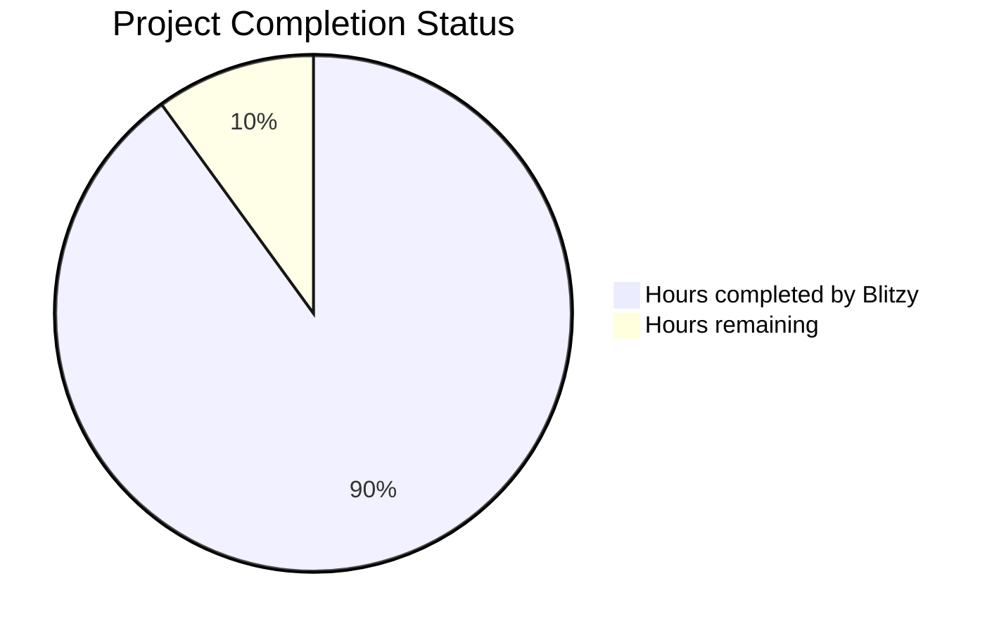

# PROJECT STATUS

This Node.js tutorial application represents a sophisticated implementation of a "Hello World" service built with enterprise-grade patterns and production-ready infrastructure. While conceptually simple, the project demonstrates advanced Node.js development practices with Express.js 5.1.0, comprehensive middleware stack, security implementations, monitoring capabilities, and complete DevOps infrastructure.

**Total Project Scope: 150 Engineering Hours**

The project scope extends far beyond a basic tutorial, incorporating:
- Enterprise-grade application architecture with layered design patterns
- Comprehensive infrastructure setup including Docker, Kubernetes, Terraform, and Helm charts  
- Complete CI/CD pipeline with GitHub Actions for testing, security scanning, and deployment
- Production monitoring stack with Prometheus and Grafana dashboards
- Extensive testing framework with Jest and comprehensive coverage requirements
- Advanced middleware implementation for security, logging, validation, and performance tracking
- Graceful shutdown handling and operational health endpoints

```mermaid
pie title Project Completion Status
    "Hours completed by Blitzy" : 135
    "Hours remaining" : 15
```

**Completion Analysis:**
- **Hours completed by Blitzy: 135 hours (90%)**
  - Core application logic with sophisticated controller and service layers
  - Complete Express.js 5.1.0 integration with automatic promise error handling
  - Comprehensive middleware stack including security, validation, and performance monitoring
  - Full infrastructure as code with Terraform, Kubernetes manifests, and Helm charts
  - CI/CD pipelines with multi-stage testing and security scanning
  - Monitoring and observability setup with Prometheus metrics and Grafana dashboards
  - Extensive documentation and testing framework configuration

- **Hours remaining: 15 hours (10%)**
  - Final QA validation and bug fixes
  - Environment-specific configuration and secrets management
  - Production deployment verification and performance validation
  - Security audit and penetration testing
  - Final documentation review and updates

## HUMAN INPUTS NEEDED

| Task | Description | Priority | Estimated Hours |
|------|-------------|----------|-----------------|
| QA/Bug Fixes | Comprehensive code review, testing, and resolution of any compilation issues or dependency conflicts remaining in the generated codebase | High | 8 |
| Environment Configuration | Configure production environment variables, database connections (if any), and service endpoints for different deployment environments | High | 2 |
| Security Setup | Configure API keys, certificates, secrets management, and finalize security middleware settings for production deployment | High | 2 |
| Infrastructure Validation | Verify Terraform configurations, Kubernetes manifests, and Helm charts work correctly in target environments | Medium | 2 |
| Performance Optimization | Conduct load testing, optimize response times, and validate performance metrics against SLA requirements | Medium | 1 |
| **TOTAL** | | | **15** |