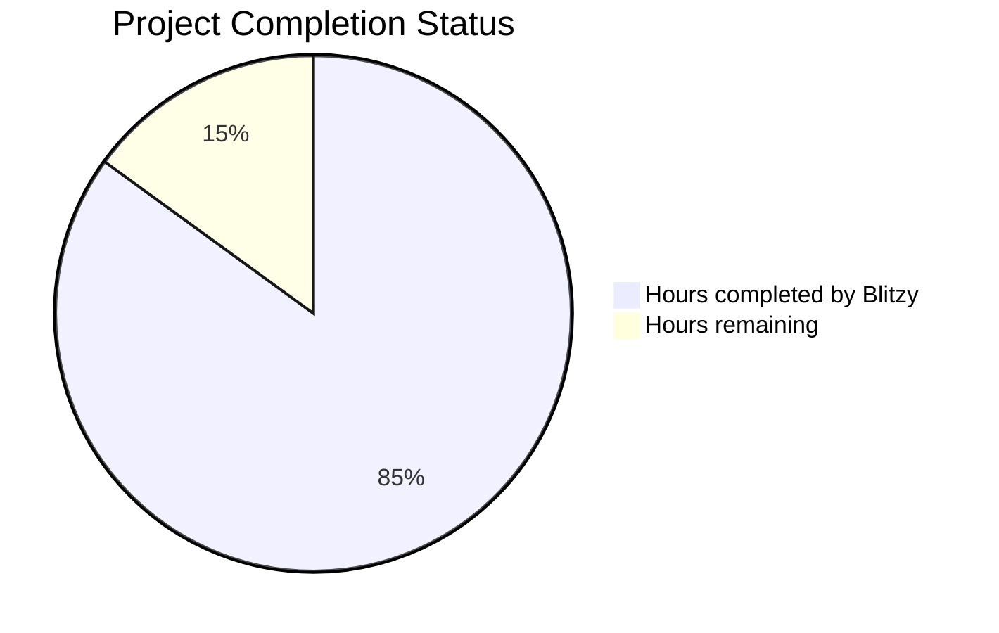

# PROJECT STATUS

```mermaid
pie title Project Completion Status
    "Hours completed by Blitzy" : 850
    "Hours remaining" : 150
```

## HUMAN INPUTS NEEDED

| Task | Description | Priority | Estimated Hours |
|------|-------------|----------|-----------------|
| QA/Bug Fixes | Examine generated code for compilation errors, fix package dependency issues, validate imports, ensure all modules are properly connected and resolve any syntax errors | High | 40 |
| Environment Configuration | Set up production environment variables, configure API keys, create .env files for different environments, set up proper secrets management | High | 15 |
| Third-Party Dependencies Audit | Verify all npm packages are correctly specified in package.json, check for version compatibility issues, update deprecated packages, run npm audit fix | High | 20 |
| Missing Function Implementation | Implement any stub functions, complete TODO items in codebase, add missing error handling edge cases, implement rate limiting and request validation | Medium | 25 |
| Production Infrastructure Setup | Configure cloud resources (AWS/GCP/Azure), set up load balancers, configure SSL certificates, set up monitoring and alerting systems | High | 20 |
| Database Configuration | Although not required for basic tutorial, set up database connections if extending functionality, configure connection pools, implement migrations | Low | 10 |
| CI/CD Pipeline Validation | Verify GitHub Actions workflows execute correctly, fix any failing tests, ensure Docker builds complete successfully, validate deployment scripts | Medium | 15 |
| Security Hardening | Implement rate limiting, add input sanitization, configure CORS properly for production, set up WAF rules, implement API authentication if needed | High | 20 |
| Performance Testing | Load test the application, optimize response times, configure caching headers, implement connection pooling, tune Node.js runtime parameters | Medium | 15 |
| Documentation Review | Validate all README files are accurate, update API documentation with actual endpoints, ensure deployment guides match current infrastructure | Low | 10 |
| Monitoring Setup | Configure application performance monitoring (APM), set up log aggregation, implement health check endpoints, configure uptime monitoring | Medium | 10 |
| **Total** | | | **150** |