# Technical Specifications

# 1. INTRODUCTION

## 1.1 EXECUTIVE SUMMARY

The AI Voice Agent is a web-based application that enables natural, real-time voice conversations between users and an AI assistant through standard web browsers. The system addresses the growing need for hands-free, intuitive AI interaction by providing high-quality speech recognition, natural language processing, and voice synthesis capabilities. Primary stakeholders include end users seeking voice-based AI interaction, system administrators, and support staff. The solution aims to improve accessibility and efficiency of AI assistant interactions while maintaining high accuracy and natural conversation flow.

The system will deliver measurable value through reduced interaction friction, improved accessibility for users with different needs, and seamless integration into existing web-based workflows, all while maintaining enterprise-grade security and privacy standards.

## 1.2 SYSTEM OVERVIEW

### Project Context

| Aspect | Description |
|--------|-------------|
| Market Position | Browser-based voice AI solution targeting users who need hands-free AI interaction |
| Current Limitations | Existing solutions require native apps or have high latency |
| Enterprise Integration | Standalone web application with standard API interfaces |

### High-Level Description

| Component | Implementation |
|-----------|---------------|
| Voice Processing | WebRTC-based audio capture with real-time streaming |
| Speech Recognition | Cloud-based speech-to-text with <500ms latency |
| Natural Language Processing | Context-aware intent recognition and response generation |
| Voice Synthesis | High-quality text-to-speech with multiple voice options |
| User Interface | Responsive web interface with visual feedback |

### Success Criteria

| Category | Metrics |
|----------|---------|
| Performance | - Speech recognition accuracy >95%<br>- End-to-end latency <2 seconds<br>- System uptime >99.9% |
| User Experience | - First-time user success rate >90%<br>- Task completion rate >95%<br>- User satisfaction score >4.5/5 |
| Technical | - Browser compatibility >98%<br>- API response time <500ms<br>- Error rate <0.1% |

## 1.3 SCOPE

### In-Scope Elements

#### Core Features and Functionalities

| Feature Category | Included Capabilities |
|-----------------|----------------------|
| Voice Processing | - Wake word detection<br>- Real-time speech recognition<br>- Voice activity detection<br>- Noise cancellation |
| Conversation | - Natural language understanding<br>- Context management<br>- Response generation<br>- Voice synthesis |
| Interface | - Microphone controls<br>- Visual feedback<br>- Conversation history<br>- Settings management |
| Technical | - WebRTC implementation<br>- Browser compatibility<br>- Error handling<br>- Session management |

#### Implementation Boundaries

| Boundary Type | Coverage |
|--------------|----------|
| System | Web browsers with WebRTC support |
| Users | Individual users with basic technical proficiency |
| Geography | Global deployment with English language support |
| Data | User conversations and associated metadata |

### Out-of-Scope Elements

| Category | Excluded Elements |
|----------|------------------|
| Platforms | - Native mobile applications<br>- Desktop applications<br>- Browser extensions |
| Features | - Offline functionality<br>- Multi-user conversations<br>- Custom wake word training<br>- Third-party AI assistant integration |
| Integration | - Enterprise system integration<br>- Custom authentication systems<br>- Legacy browser support |
| Data | - Long-term data analytics<br>- Advanced reporting features<br>- Custom data export formats |

# 2. SYSTEM ARCHITECTURE

## 2.1 High-Level Architecture

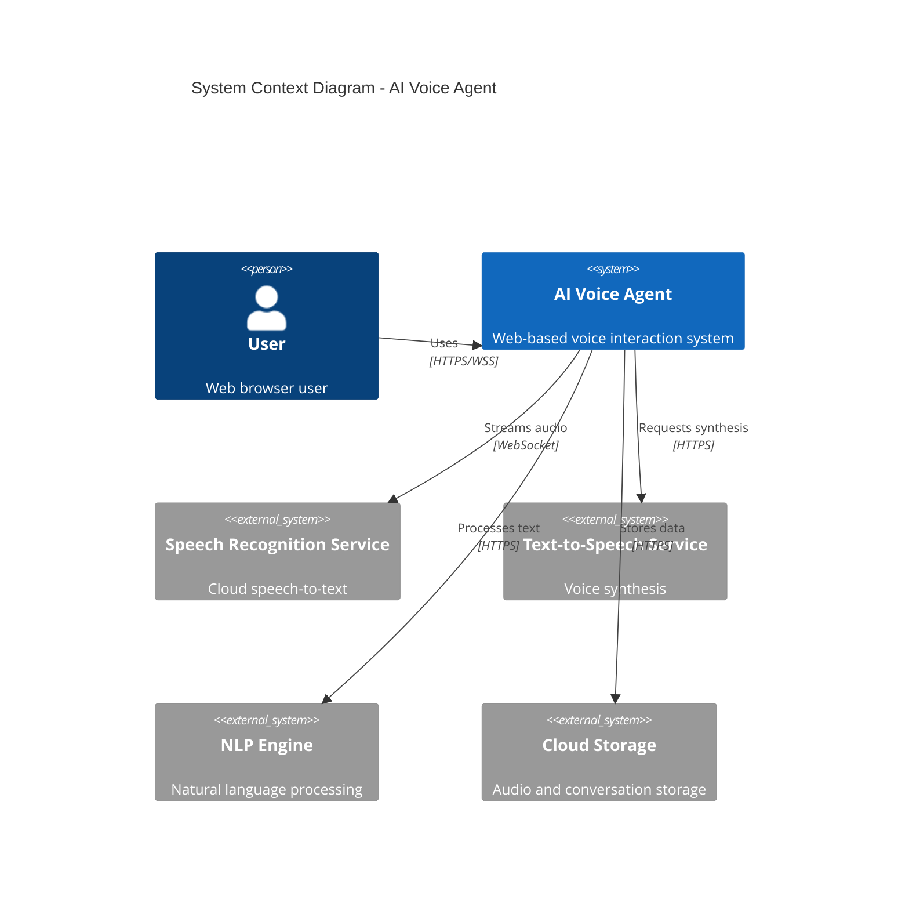
```mermaid
C4Context
    title System Context Diagram - AI Voice Agent

    Person(user, "User", "Web browser user")
    System(voiceAgent, "AI Voice Agent", "Web-based voice interaction system")
    
    System_Ext(stt, "Speech Recognition Service", "Cloud speech-to-text")
    System_Ext(tts, "Text-to-Speech Service", "Voice synthesis")
    System_Ext(nlp, "NLP Engine", "Natural language processing")
    System_Ext(storage, "Cloud Storage", "Audio and conversation storage")
    
    Rel(user, voiceAgent, "Uses", "HTTPS/WSS")
    Rel(voiceAgent, stt, "Streams audio", "WebSocket")
    Rel(voiceAgent, tts, "Requests synthesis", "HTTPS")
    Rel(voiceAgent, nlp, "Processes text", "HTTPS")
    Rel(voiceAgent, storage, "Stores data", "HTTPS")
```

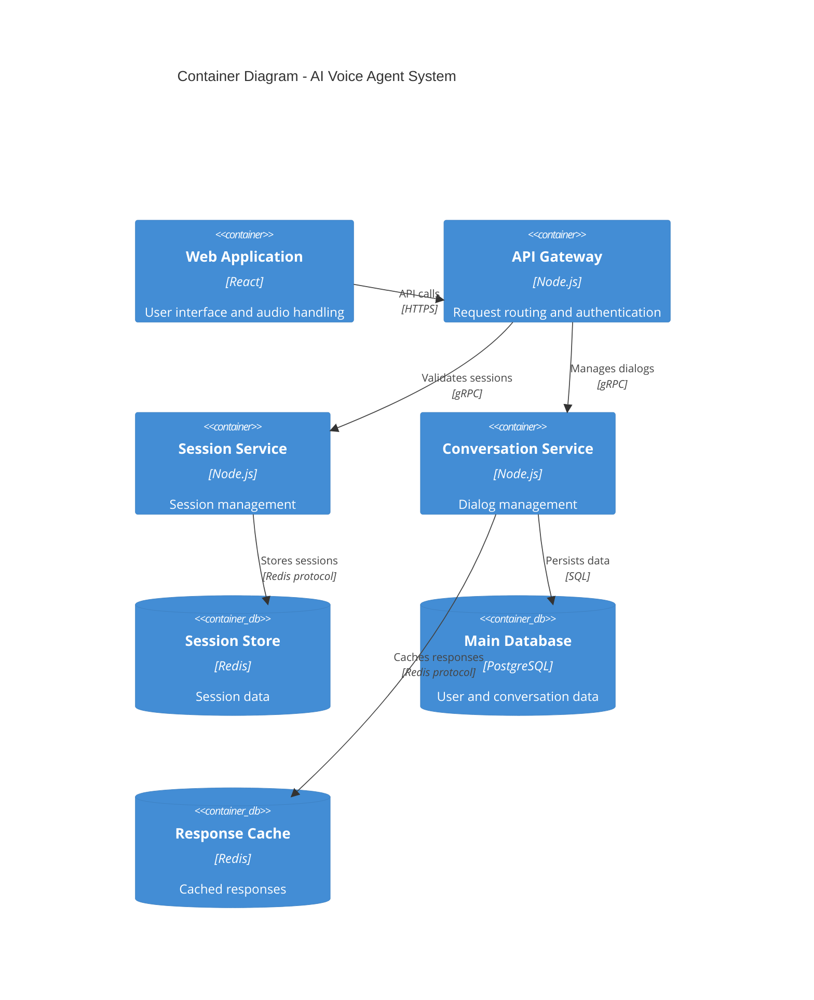
```mermaid
C4Container
    title Container Diagram - AI Voice Agent System

    Container(web, "Web Application", "React", "User interface and audio handling")
    Container(api, "API Gateway", "Node.js", "Request routing and authentication")
    Container(session, "Session Service", "Node.js", "Session management")
    Container(conv, "Conversation Service", "Node.js", "Dialog management")
    
    ContainerDb(redis, "Session Store", "Redis", "Session data")
    ContainerDb(postgres, "Main Database", "PostgreSQL", "User and conversation data")
    ContainerDb(cache, "Response Cache", "Redis", "Cached responses")
    
    Rel(web, api, "API calls", "HTTPS")
    Rel(api, session, "Validates sessions", "gRPC")
    Rel(api, conv, "Manages dialogs", "gRPC")
    Rel(session, redis, "Stores sessions", "Redis protocol")
    Rel(conv, postgres, "Persists data", "SQL")
    Rel(conv, cache, "Caches responses", "Redis protocol")
```

## 2.2 Component Details

### 2.2.1 Core Components

| Component | Technology | Purpose | Scaling Strategy |
|-----------|------------|---------|------------------|
| Web Frontend | React, WebRTC | User interface, audio handling | Horizontal with CDN |
| API Gateway | Node.js, Express | Request routing, auth | Horizontal with load balancer |
| Session Service | Node.js | Session management | Horizontal with sticky sessions |
| Conversation Service | Node.js | Dialog management | Horizontal with sharding |
| Audio Processor | WebAssembly | Real-time audio processing | Vertical scaling |

### 2.2.2 Data Storage Components

| Store Type | Technology | Purpose | Scaling Approach |
|------------|------------|---------|------------------|
| Main Database | PostgreSQL | Persistent data storage | Primary-replica replication |
| Session Store | Redis | Active session data | Redis cluster |
| Response Cache | Redis | Frequently accessed responses | Redis cluster |
| Audio Storage | Object Storage | Voice recording storage | Distributed storage |

## 2.3 Technical Decisions

### 2.3.1 Architecture Patterns

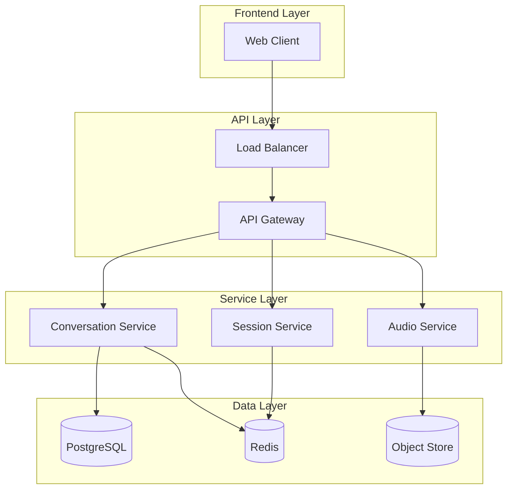
```mermaid
flowchart TD
    subgraph "Frontend Layer"
        A[Web Client]
    end
    
    subgraph "API Layer"
        B[API Gateway]
        C[Load Balancer]
    end
    
    subgraph "Service Layer"
        D[Session Service]
        E[Conversation Service]
        F[Audio Service]
    end
    
    subgraph "Data Layer"
        G[(PostgreSQL)]
        H[(Redis)]
        I[(Object Store)]
    end
    
    A --> C
    C --> B
    B --> D & E & F
    D --> H
    E --> G & H
    F --> I
```

### 2.3.2 Communication Patterns

| Pattern | Implementation | Use Case |
|---------|---------------|----------|
| Synchronous | REST/GraphQL | User queries, status checks |
| Asynchronous | WebSocket | Audio streaming, real-time updates |
| Event-Driven | Redis Pub/Sub | System notifications, scaling events |
| Message Queue | Redis Streams | Audio processing pipeline |

## 2.4 Cross-Cutting Concerns

### 2.4.1 System Monitoring

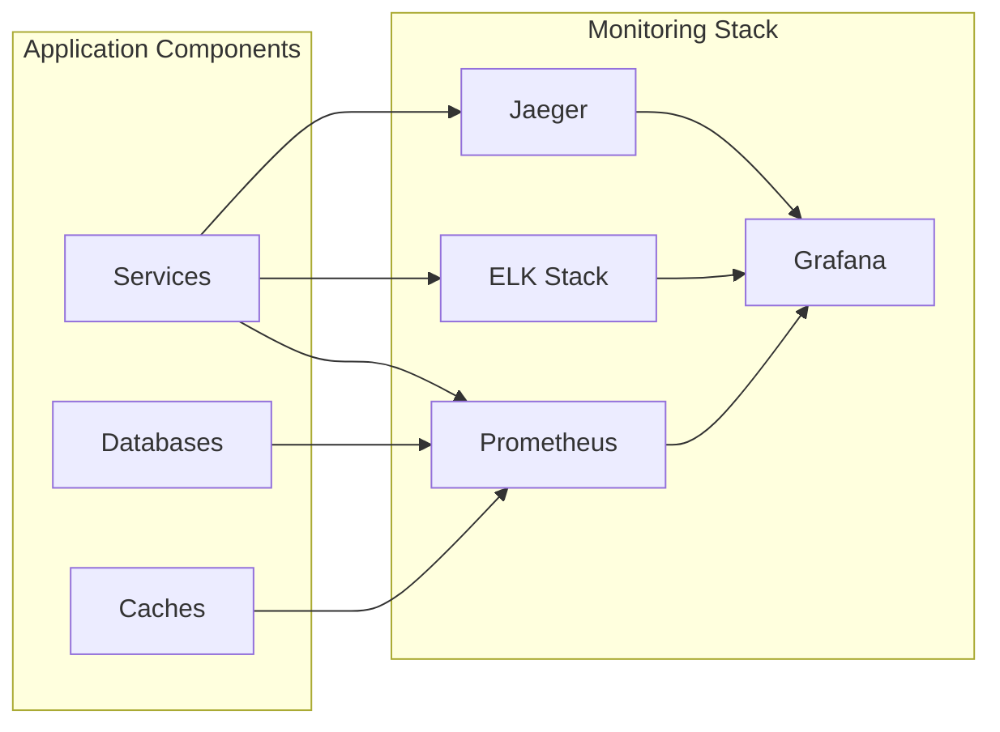
```mermaid
flowchart LR
    subgraph "Monitoring Stack"
        A[Prometheus] --> B[Grafana]
        C[ELK Stack] --> B
        D[Jaeger] --> B
    end
    
    subgraph "Application Components"
        E[Services]
        F[Databases]
        G[Caches]
    end
    
    E --> A
    F --> A
    G --> A
    E --> C
    E --> D
```

### 2.4.2 Security Architecture

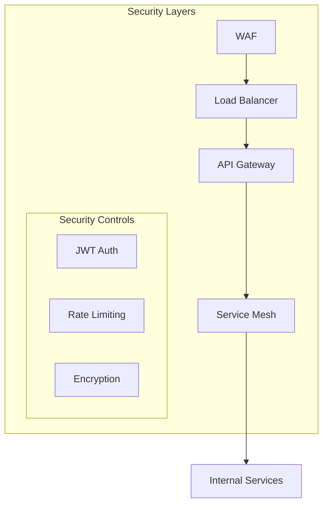
```mermaid
flowchart TD
    subgraph "Security Layers"
        A[WAF] --> B[Load Balancer]
        B --> C[API Gateway]
        C --> D[Service Mesh]
        
        subgraph "Security Controls"
            E[JWT Auth]
            F[Rate Limiting]
            G[Encryption]
        end
    end
    
    D --> H[Internal Services]
```

## 2.5 Deployment Architecture

```mermaid
C4Deployment
    title Deployment Diagram - AI Voice Agent

    Deployment_Node(cdn, "CDN", "Content Delivery Network"){
        Container(static, "Static Assets", "Web content")
    }
    
    Deployment_Node(cloud, "Cloud Platform", "Production Environment"){
        Deployment_Node(web, "Web Tier", "Auto-scaling group"){
            Container(webapp, "Web Application", "Node.js")
        }
        
        Deployment_Node(app, "Application Tier", "Auto-scaling group"){
            Container(api, "API Services", "Node.js")
            Container(worker, "Background Workers", "Node.js")
        }
        
        Deployment_Node(data, "Data Tier", "Managed Services"){
            ContainerDb(db, "Database Cluster", "PostgreSQL")
            ContainerDb(cache, "Cache Cluster", "Redis")
        }
    }
    
    Rel(cdn, web, "Routes requests", "HTTPS")
    Rel(web, app, "API calls", "Internal HTTPS")
    Rel(app, data, "Data access", "Internal network")
```

# 3. SYSTEM COMPONENTS ARCHITECTURE

## 3.1 USER INTERFACE DESIGN

### 3.1.1 Design Specifications

| Category | Requirements | Implementation |
|----------|--------------|----------------|
| Visual Hierarchy | Material Design principles | - Primary/secondary actions<br>- Visual feedback states<br>- Consistent spacing (8px grid) |
| Component Library | Custom React components | - Atomic design structure<br>- Storybook documentation<br>- Reusable patterns |
| Responsive Design | Mobile-first approach | - Breakpoints: 320px, 768px, 1024px, 1440px<br>- Fluid typography<br>- Flexible layouts |
| Accessibility | WCAG 2.1 Level AA | - ARIA labels<br>- Keyboard navigation<br>- Screen reader support |
| Browser Support | Modern browsers | Chrome 83+, Firefox 78+, Safari 14+, Edge 88+ |
| Theme Support | Dark/Light modes | - CSS variables<br>- System preference detection<br>- Manual override |
| Internationalization | Multi-language support | - RTL support<br>- Language detection<br>- Dynamic content loading |

### 3.1.2 Interface Elements

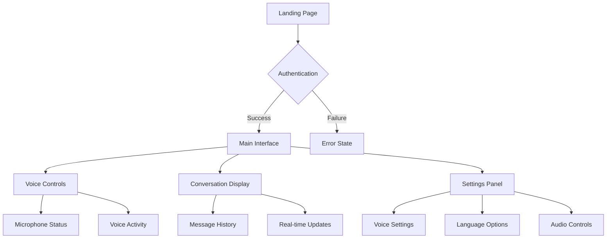
```mermaid
flowchart TD
    A[Landing Page] --> B{Authentication}
    B -->|Success| C[Main Interface]
    B -->|Failure| D[Error State]
    
    C --> E[Voice Controls]
    C --> F[Conversation Display]
    C --> G[Settings Panel]
    
    E --> H[Microphone Status]
    E --> I[Voice Activity]
    
    F --> J[Message History]
    F --> K[Real-time Updates]
    
    G --> L[Voice Settings]
    G --> M[Language Options]
    G --> N[Audio Controls]
```

### 3.1.3 Critical User Flows

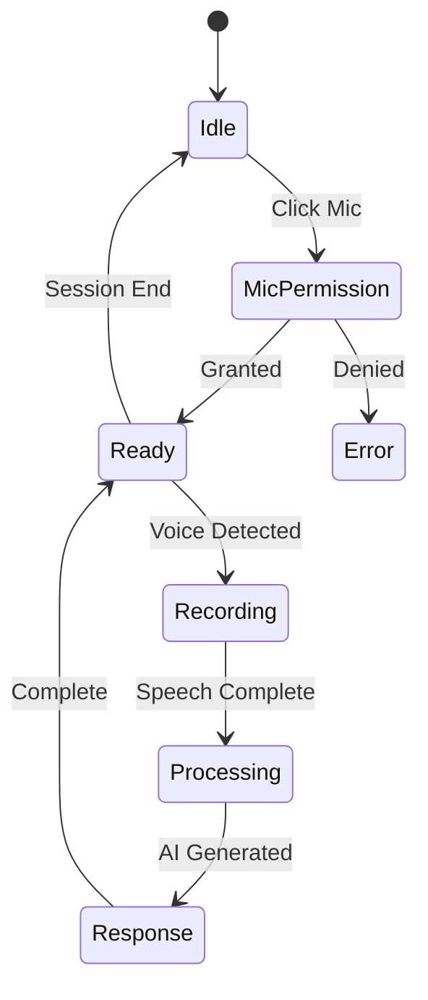
```mermaid
stateDiagram-v2
    [*] --> Idle
    Idle --> MicPermission: Click Mic
    MicPermission --> Ready: Granted
    MicPermission --> Error: Denied
    Ready --> Recording: Voice Detected
    Recording --> Processing: Speech Complete
    Processing --> Response: AI Generated
    Response --> Ready: Complete
    Ready --> Idle: Session End
```

## 3.2 DATABASE DESIGN

### 3.2.1 Schema Design

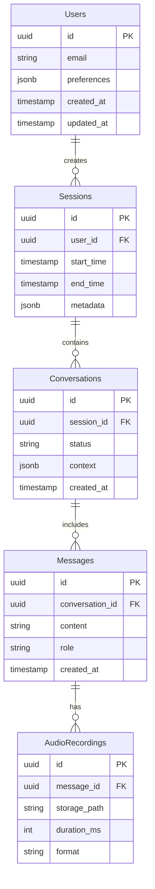
```mermaid
erDiagram
    Users ||--o{ Sessions : creates
    Sessions ||--o{ Conversations : contains
    Conversations ||--o{ Messages : includes
    Messages ||--o{ AudioRecordings : has
    Users {
        uuid id PK
        string email
        jsonb preferences
        timestamp created_at
        timestamp updated_at
    }
    Sessions {
        uuid id PK
        uuid user_id FK
        timestamp start_time
        timestamp end_time
        jsonb metadata
    }
    Conversations {
        uuid id PK
        uuid session_id FK
        string status
        jsonb context
        timestamp created_at
    }
    Messages {
        uuid id PK
        uuid conversation_id FK
        string content
        string role
        timestamp created_at
    }
    AudioRecordings {
        uuid id PK
        uuid message_id FK
        string storage_path
        int duration_ms
        string format
    }
```

### 3.2.2 Data Management Strategy

| Aspect | Strategy | Implementation |
|--------|----------|----------------|
| Migrations | Versioned migrations | - Sequential version numbers<br>- Forward/rollback scripts<br>- Data transformation logic |
| Versioning | Semantic versioning | - Major schema changes<br>- Backward compatibility<br>- Documentation requirements |
| Archival | Time-based archival | - 90-day active retention<br>- Compressed cold storage<br>- Automated cleanup |
| Privacy | Data protection | - PII encryption<br>- Data anonymization<br>- Consent tracking |
| Auditing | Comprehensive logging | - Change tracking<br>- Access logs<br>- Error logging |

## 3.3 API DESIGN

### 3.3.1 API Architecture

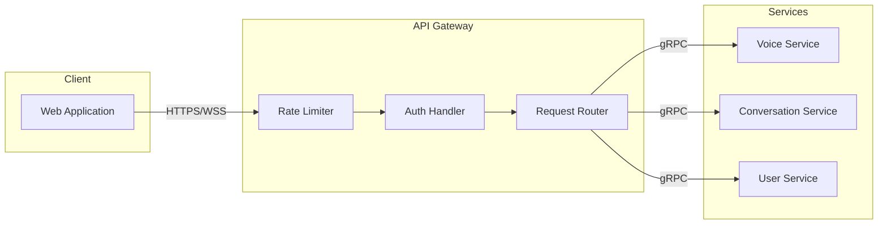
```mermaid
flowchart LR
    subgraph Client
        A[Web Application]
    end
    
    subgraph API Gateway
        B[Rate Limiter]
        C[Auth Handler]
        D[Request Router]
    end
    
    subgraph Services
        E[Voice Service]
        F[Conversation Service]
        G[User Service]
    end
    
    A -->|HTTPS/WSS| B
    B --> C
    C --> D
    D -->|gRPC| E & F & G
```

### 3.3.2 Interface Specifications

| Endpoint | Method | Purpose | Authentication |
|----------|--------|---------|----------------|
| /api/v1/auth | POST | User authentication | Public |
| /api/v1/sessions | POST | Create session | JWT |
| /ws/v1/stream | WebSocket | Audio streaming | JWT |
| /api/v1/conversations | GET/POST | Manage conversations | JWT |
| /api/v1/voices | GET | List available voices | JWT |

### 3.3.3 Integration Requirements

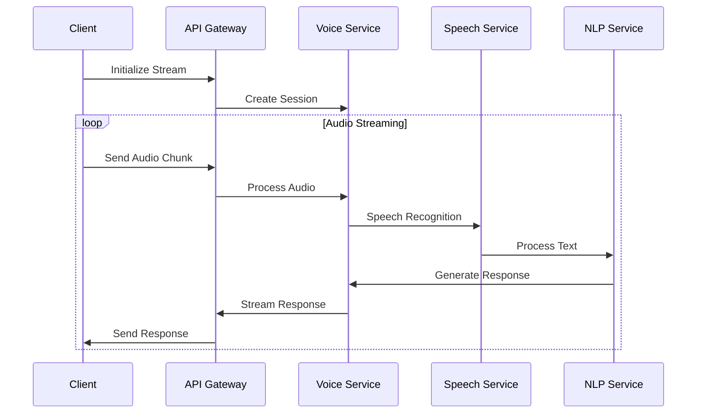
```mermaid
sequenceDiagram
    participant C as Client
    participant G as API Gateway
    participant V as Voice Service
    participant S as Speech Service
    participant N as NLP Service
    
    C->>G: Initialize Stream
    G->>V: Create Session
    
    loop Audio Streaming
        C->>G: Send Audio Chunk
        G->>V: Process Audio
        V->>S: Speech Recognition
        S->>N: Process Text
        N->>V: Generate Response
        V->>G: Stream Response
        G->>C: Send Response
    end
```

### 3.3.4 API Security Controls

| Control | Implementation | Requirements |
|---------|----------------|--------------|
| Authentication | JWT + OAuth 2.0 | - 15-minute token expiry<br>- Refresh token rotation<br>- Secure cookie storage |
| Authorization | RBAC | - Role-based permissions<br>- Resource-level access<br>- Audit logging |
| Rate Limiting | Token bucket | - 100 requests/minute<br>- Burst allowance<br>- Client identification |
| Input Validation | JSON Schema | - Request validation<br>- Sanitization rules<br>- Error responses |
| Security Headers | OWASP standards | - CORS policies<br>- CSP headers<br>- HSTS enforcement |

# 4. TECHNOLOGY STACK

## 4.1 PROGRAMMING LANGUAGES

| Platform/Component | Language | Version | Justification |
|-------------------|----------|---------|---------------|
| Frontend | TypeScript | 5.0+ | - Strong typing for complex UI state management<br>- Enhanced IDE support<br>- Better maintainability for large codebase |
| Backend Services | Node.js | 20 LTS | - Native async/await support<br>- Excellent WebSocket handling<br>- Unified JavaScript ecosystem |
| Audio Processing | WebAssembly | 2.0 | - Near-native performance for audio processing<br>- Browser compatibility<br>- Efficient binary encoding |
| Build Tools | JavaScript | ES2022 | - Native module support<br>- Development tooling compatibility<br>- Ecosystem integration |

## 4.2 FRAMEWORKS & LIBRARIES

### 4.2.1 Core Frameworks

| Component | Framework | Version | Purpose |
|-----------|-----------|---------|----------|
| Frontend UI | React | 18.2+ | - Component-based architecture<br>- Virtual DOM for performance<br>- Extensive ecosystem |
| State Management | Redux Toolkit | 2.0+ | - Predictable state updates<br>- DevTools integration<br>- TypeScript support |
| API Layer | Express | 4.18+ | - Robust routing<br>- Middleware support<br>- WebSocket integration |
| Audio Processing | Web Audio API | Current | - Native audio processing<br>- Real-time capabilities<br>- Browser standard |

### 4.2.2 Supporting Libraries

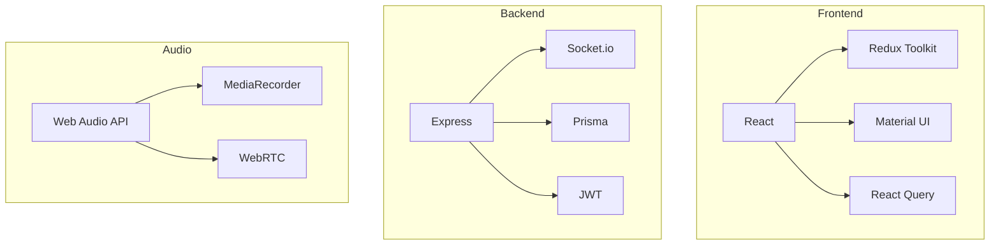
```mermaid
flowchart TD
    subgraph Frontend
        A[React] --> B[Redux Toolkit]
        A --> C[Material UI]
        A --> D[React Query]
    end
    
    subgraph Backend
        E[Express] --> F[Socket.io]
        E --> G[Prisma]
        E --> H[JWT]
    end
    
    subgraph Audio
        I[Web Audio API] --> J[MediaRecorder]
        I --> K[WebRTC]
    end
```

## 4.3 DATABASES & STORAGE

### 4.3.1 Database Architecture

| Type | Technology | Version | Usage |
|------|------------|---------|--------|
| Primary Database | PostgreSQL | 15+ | - User data<br>- Conversation history<br>- System configuration |
| Session Store | Redis | 7.0+ | - Active sessions<br>- Real-time state<br>- Caching layer |
| Search Engine | Elasticsearch | 8.0+ | - Conversation search<br>- Analytics<br>- Logging |
| Object Storage | S3-compatible | - | - Audio recordings<br>- Large binary data<br>- Backups |

### 4.3.2 Data Flow Architecture

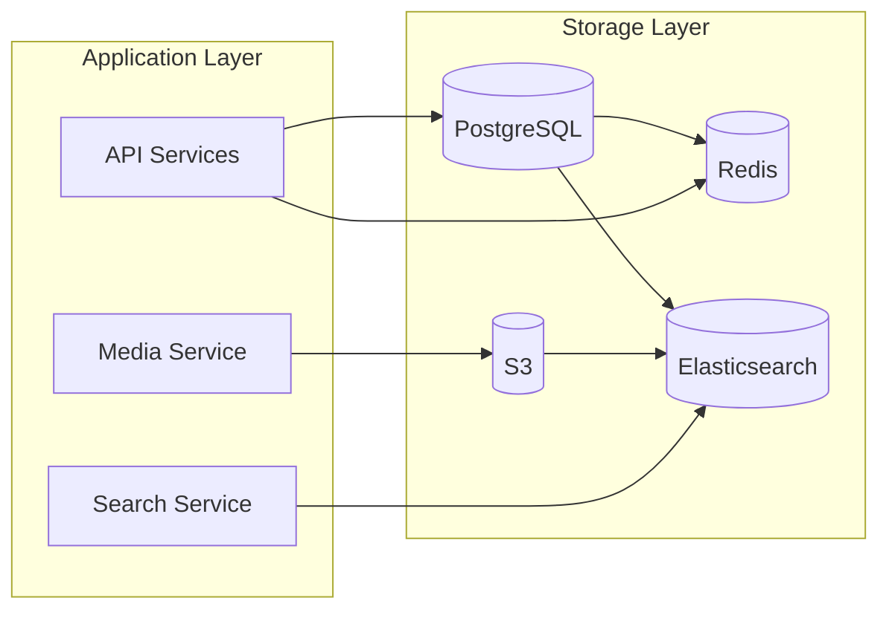
```mermaid
flowchart LR
    subgraph Storage Layer
        A[(PostgreSQL)] --> B[(Redis)]
        A --> C[(Elasticsearch)]
        D[(S3)] --> C
    end
    
    subgraph Application Layer
        E[API Services] --> A
        E --> B
        F[Search Service] --> C
        G[Media Service] --> D
    end
```

## 4.4 THIRD-PARTY SERVICES

| Category | Service | Purpose | Integration Method |
|----------|---------|---------|-------------------|
| Speech Recognition | Google Speech-to-Text | Real-time transcription | REST API/WebSocket |
| Text-to-Speech | Amazon Polly | Voice synthesis | REST API |
| Authentication | Auth0 | User authentication | OAuth 2.0/JWT |
| Monitoring | Datadog | System monitoring | Agent/API |
| Error Tracking | Sentry | Error reporting | SDK |
| CDN | Cloudflare | Content delivery | DNS/Proxy |

## 4.5 DEVELOPMENT & DEPLOYMENT

### 4.5.1 Development Environment

| Tool | Version | Purpose |
|------|---------|---------|
| VS Code | Latest | Primary IDE |
| Docker | 24+ | Containerization |
| Node.js | 20 LTS | Runtime environment |
| pnpm | 8+ | Package management |
| ESLint | 8+ | Code quality |
| Jest | 29+ | Testing framework |

### 4.5.2 Deployment Pipeline

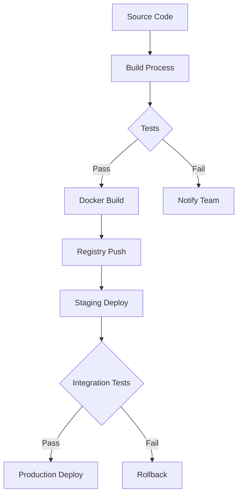
```mermaid
flowchart TD
    A[Source Code] --> B[Build Process]
    B --> C{Tests}
    C -->|Pass| D[Docker Build]
    C -->|Fail| E[Notify Team]
    D --> F[Registry Push]
    F --> G[Staging Deploy]
    G --> H{Integration Tests}
    H -->|Pass| I[Production Deploy]
    H -->|Fail| J[Rollback]
```

### 4.5.3 Infrastructure Requirements

| Component | Technology | Configuration |
|-----------|------------|---------------|
| Container Orchestration | Kubernetes | - Auto-scaling<br>- Load balancing<br>- Health checks |
| Service Mesh | Istio | - Traffic management<br>- Security<br>- Observability |
| Infrastructure as Code | Terraform | - Cloud resources<br>- Network config<br>- Service deployment |
| CI/CD | GitHub Actions | - Automated builds<br>- Testing<br>- Deployment |

# 5. SYSTEM DESIGN

## 5.1 USER INTERFACE DESIGN

### 5.1.1 Main Interface Layout

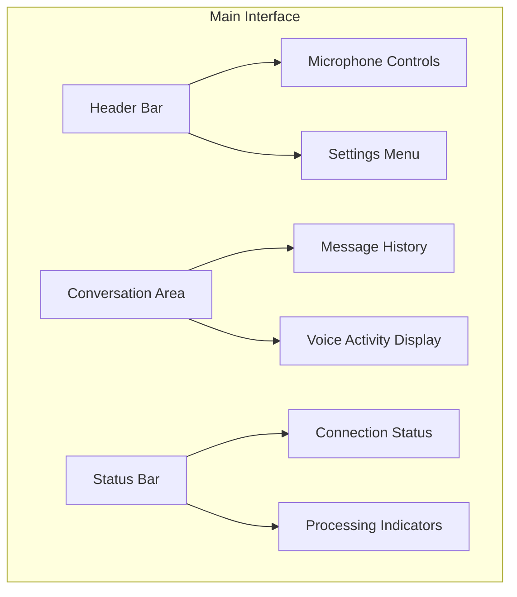
```mermaid
graph TD
    subgraph Main Interface
        A[Header Bar] --> B[Microphone Controls]
        A --> C[Settings Menu]
        D[Conversation Area] --> E[Message History]
        D --> F[Voice Activity Display]
        G[Status Bar] --> H[Connection Status]
        G --> I[Processing Indicators]
    end
```

| Component | Description | Behavior |
|-----------|-------------|-----------|
| Microphone Controls | Centered floating button | - Pulsing animation when active<br>- Color changes for states<br>- Hold-to-speak option |
| Voice Activity Display | Real-time waveform | - Dynamic amplitude visualization<br>- Clear listening indicator<br>- Error state feedback |
| Message History | Scrollable chat interface | - Alternating message alignment<br>- Timestamp display<br>- Loading states |
| Status Indicators | Bottom status bar | - Connection status<br>- Processing state<br>- Error messages |

### 5.1.2 Responsive Layouts

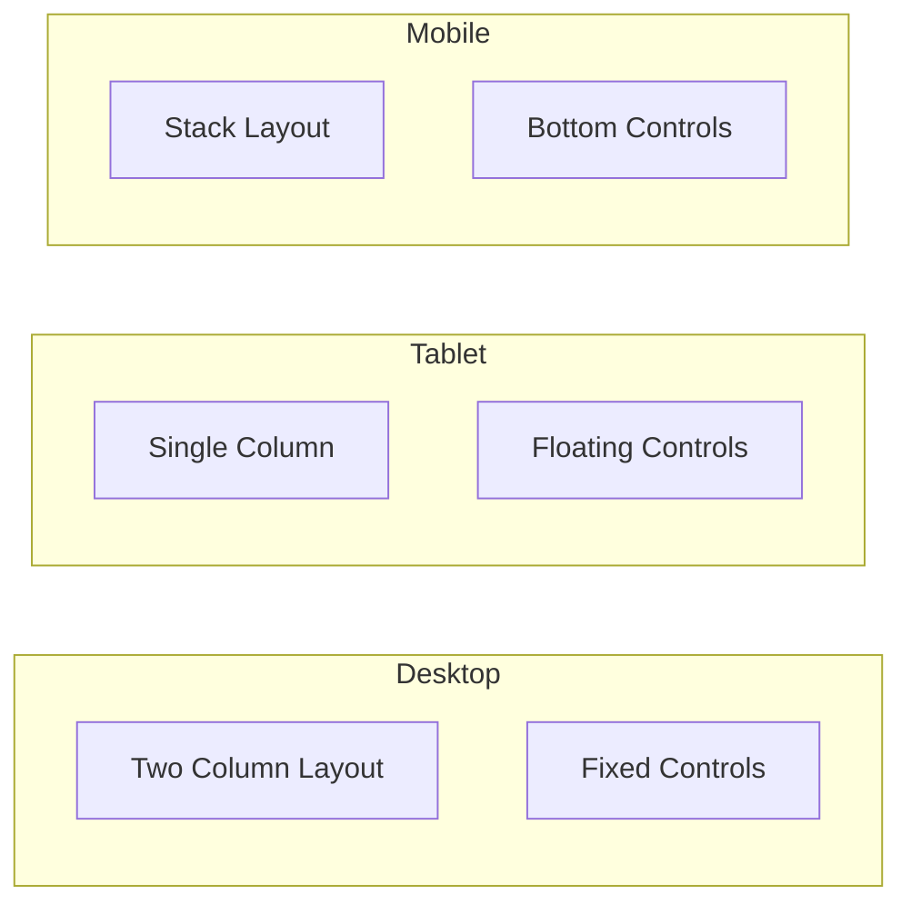
```mermaid
graph LR
    subgraph Desktop
        A1[Two Column Layout]
        B1[Fixed Controls]
    end
    subgraph Tablet
        A2[Single Column]
        B2[Floating Controls]
    end
    subgraph Mobile
        A3[Stack Layout]
        B3[Bottom Controls]
    end
```

## 5.2 DATABASE DESIGN

### 5.2.1 Schema Design

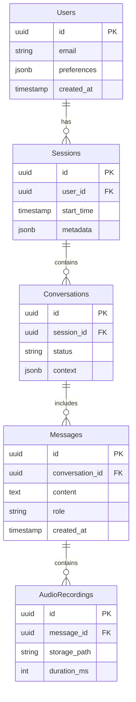
```mermaid
erDiagram
    Users ||--o{ Sessions : has
    Sessions ||--o{ Conversations : contains
    Conversations ||--o{ Messages : includes
    Messages ||--o{ AudioRecordings : contains
    
    Users {
        uuid id PK
        string email
        jsonb preferences
        timestamp created_at
    }
    Sessions {
        uuid id PK
        uuid user_id FK
        timestamp start_time
        jsonb metadata
    }
    Conversations {
        uuid id PK
        uuid session_id FK
        string status
        jsonb context
    }
    Messages {
        uuid id PK
        uuid conversation_id FK
        text content
        string role
        timestamp created_at
    }
    AudioRecordings {
        uuid id PK
        uuid message_id FK
        string storage_path
        int duration_ms
    }
```

### 5.2.2 Data Access Patterns

| Operation | Access Pattern | Optimization |
|-----------|---------------|--------------|
| Message Retrieval | Conversation ID + Timestamp | - Index on (conversation_id, created_at)<br>- Message pagination |
| Session Lookup | User ID + Date Range | - Composite index on user_id, start_time<br>- Session caching |
| Audio Storage | Message ID Reference | - Separate object storage<br>- CDN distribution |
| Context Management | Session-scoped Cache | - Redis session store<br>- TTL-based expiration |

## 5.3 API DESIGN

### 5.3.1 REST Endpoints

| Endpoint | Method | Purpose | Request/Response |
|----------|--------|---------|------------------|
| /api/v1/sessions | POST | Create session | Request: User credentials<br>Response: Session token |
| /api/v1/conversations | POST | Start conversation | Request: Session ID<br>Response: Conversation ID |
| /api/v1/messages | POST | Send message | Request: Audio/text content<br>Response: Message ID |
| /api/v1/voices | GET | List voices | Response: Available voices |

### 5.3.2 WebSocket Protocol

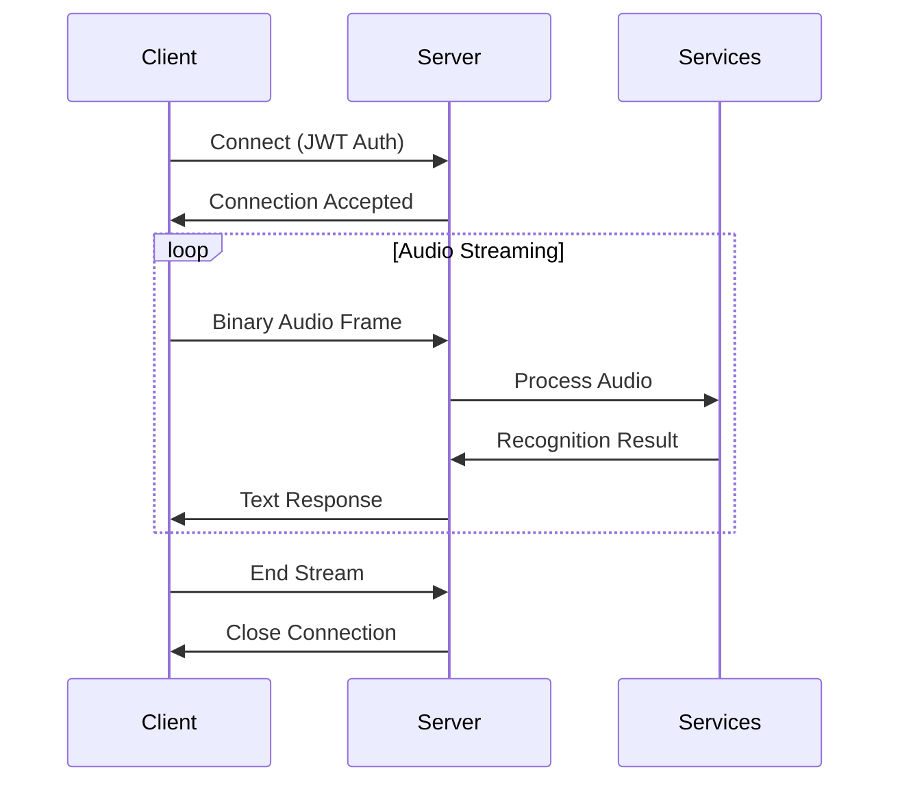
```mermaid
sequenceDiagram
    participant Client
    participant Server
    participant Services
    
    Client->>Server: Connect (JWT Auth)
    Server->>Client: Connection Accepted
    
    loop Audio Streaming
        Client->>Server: Binary Audio Frame
        Server->>Services: Process Audio
        Services->>Server: Recognition Result
        Server->>Client: Text Response
    end
    
    Client->>Server: End Stream
    Server->>Client: Close Connection
```

### 5.3.3 Error Handling

| Error Category | HTTP Status | Response Format |
|----------------|-------------|-----------------|
| Authentication | 401, 403 | `{"error": "auth_failed", "message": "..."}` |
| Validation | 400 | `{"error": "invalid_input", "details": [...]}` |
| Service | 503 | `{"error": "service_unavailable", "retry_after": 30}` |
| Resource | 404 | `{"error": "not_found", "resource": "..."}` |

### 5.3.4 Rate Limiting

| Endpoint Type | Rate Limit | Burst Allowance |
|---------------|------------|-----------------|
| Authentication | 10/minute | 2 requests |
| Voice Processing | 100/minute | 10 requests |
| Text Operations | 1000/minute | 50 requests |
| WebSocket | 1 connection/user | N/A |

# 6. USER INTERFACE DESIGN

## 6.1 Layout Components

### 6.1.1 Main Interface Wireframe

```
+----------------------------------------------------------+
|                      AI Voice Agent                    [=] |
+----------------------------------------------------------+
|                                                           |
|  +------------------+        +----------------------+      |
|  |  Status Panel    |        |   Conversation      |      |
|  |  [====] Active   |        |                     |      |
|  |  [!] Connected   |        |   AI: Hello! How    |      |
|  +------------------+        |   can I help you?    |      |
|                             |                     [?]|      |
|  +------------------+       |   You: Show me the    |      |
|  |  Voice Controls  |       |   weather please.     |      |
|  |                  |       |                       |      |
|  |    [O]  Mic      |       |   AI: Here's the     |      |
|  |  [====] Level    |       |   current weather...  |      |
|  |  [x] Stop        |       |                       |      |
|  +------------------+       +----------------------+ |      |
|                                                           |
|  +------------------+       [............Text Input......] |
|  |  Settings        |       [Send Message]                |
|  |  ( ) Voice 1     |                                     |
|  |  ( ) Voice 2     |                                     |
|  |  [v] Language    |                                     |
|  +------------------+                                     |
+----------------------------------------------------------+
```

Key:
- [O] - Microphone button (pulsing when active)
- [====] - Audio level indicator
- [x] - Stop recording button
- ( ) - Voice selection radio buttons
- [v] - Dropdown menu
- [!] - Status indicator
- [?] - Help tooltip
- [...] - Text input field

### 6.1.2 Settings Panel Wireframe

```
+----------------------------------------------------------+
|                     Settings                          [x]  |
+----------------------------------------------------------+
|                                                           |
|  Voice Settings                                           |
|  +--------------------------------------------------+    |
|  |  Voice Selection                              [v] |    |
|  |  [ ] Enable wake word detection                   |    |
|  |  [ ] Auto-mute after response                     |    |
|  +--------------------------------------------------+    |
|                                                           |
|  Audio Settings                                           |
|  +--------------------------------------------------+    |
|  |  Input Volume     [===========]                   |    |
|  |  Output Volume    [=============]                 |    |
|  |  Noise Reduction  [=======]                       |    |
|  +--------------------------------------------------+    |
|                                                           |
|  Language Settings                                        |
|  +--------------------------------------------------+    |
|  |  Primary Language  [v] English                    |    |
|  |  Secondary Language[v] None                       |    |
|  +--------------------------------------------------+    |
|                                                           |
|                    [Save Changes] [Cancel]                |
+----------------------------------------------------------+
```

### 6.1.3 Mobile Interface Wireframe

```
+----------------------+
|   AI Voice Agent [=] |
+----------------------+
| [====] Connected     |
|                     |
| +------------------+|
| |   Conversation   ||
| |                  ||
| | AI: Hello!       ||
| |                  ||
| | You: Hi there    ||
| |                  ||
| +------------------+|
|                     |
|      [O]           |
|   [x] Stop  [?]    |
|                     |
| [...Text Input...] ||
| [Send]             ||
+----------------------+
```

## 6.2 Component Specifications

### 6.2.1 Voice Control Panel

| Component | Behavior | Visual State |
|-----------|----------|--------------|
| Microphone Button | - Click to start/stop<br>- Pulse animation when active<br>- Color indicates state | - Gray: Inactive<br>- Blue: Active<br>- Red: Error |
| Audio Level | - Real-time VU meter<br>- 60fps update rate<br>- -60dB to 0dB range | - Green: Normal<br>- Yellow: High<br>- Red: Clipping |
| Status Indicator | - Shows connection state<br>- Shows processing state<br>- Shows errors | - Green: Connected<br>- Yellow: Processing<br>- Red: Error |

### 6.2.2 Conversation Display

| Component | Behavior | Visual State |
|-----------|----------|--------------|
| Message Container | - Alternating alignment<br>- Timestamp display<br>- Auto-scroll | - User: Right-aligned<br>- AI: Left-aligned<br>- System: Centered |
| Text Input | - Character limit: 1000<br>- Enter to send<br>- History navigation | - Normal: White<br>- Focus: Light blue<br>- Error: Light red |
| Voice Activity | - Waveform visualization<br>- Noise threshold indicator<br>- Clipping warning | - Blue: Active<br>- Gray: Inactive<br>- Red: Clipping |

## 6.3 Responsive Behavior

| Breakpoint | Layout Changes | Component Adjustments |
|------------|----------------|----------------------|
| Desktop (>1024px) | - Two-column layout<br>- Persistent controls<br>- Full conversation history | - Large microphone button<br>- Expanded settings panel<br>- Detailed status display |
| Tablet (768-1024px) | - Single column with panels<br>- Collapsible settings<br>- Scrollable history | - Medium microphone button<br>- Modal settings panel<br>- Compact status display |
| Mobile (<768px) | - Stack layout<br>- Bottom controls<br>- Minimal UI | - Large touch targets<br>- Full-screen settings<br>- Minimal status indicators |

## 6.4 Interaction States

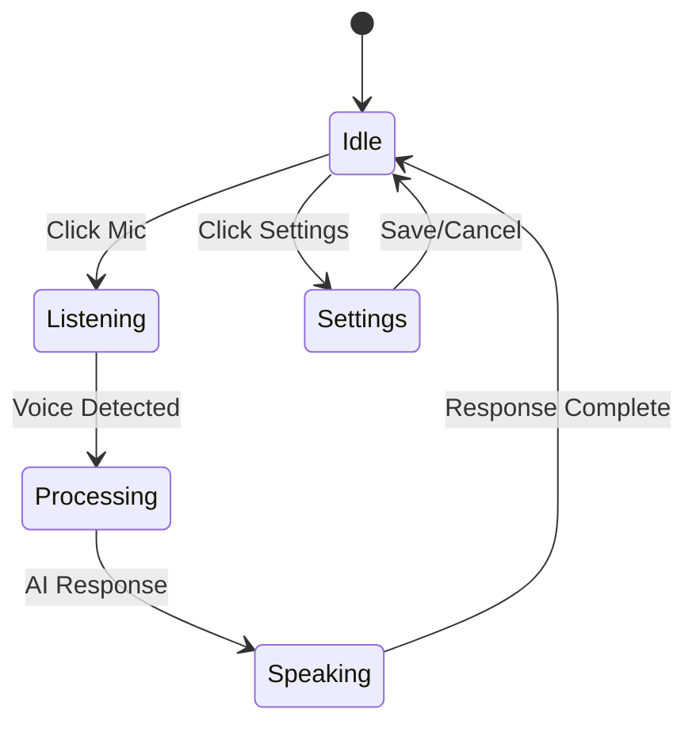
```mermaid
stateDiagram-v2
    [*] --> Idle
    Idle --> Listening: Click Mic
    Listening --> Processing: Voice Detected
    Processing --> Speaking: AI Response
    Speaking --> Idle: Response Complete
    Idle --> Settings: Click Settings
    Settings --> Idle: Save/Cancel
```

# 7. SECURITY CONSIDERATIONS

## 7.1 AUTHENTICATION AND AUTHORIZATION

### 7.1.1 Authentication Flow

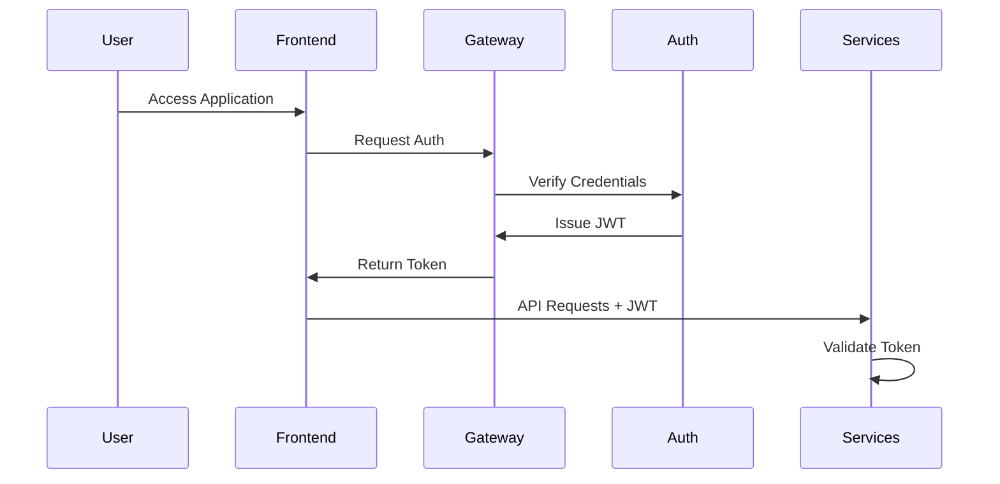
```mermaid
sequenceDiagram
    participant User
    participant Frontend
    participant Gateway
    participant Auth
    participant Services
    
    User->>Frontend: Access Application
    Frontend->>Gateway: Request Auth
    Gateway->>Auth: Verify Credentials
    Auth->>Gateway: Issue JWT
    Gateway->>Frontend: Return Token
    Frontend->>Services: API Requests + JWT
    Services->>Services: Validate Token
```

### 7.1.2 Authorization Matrix

| Role | Voice Control | Conversation History | Settings | Admin Functions |
|------|--------------|---------------------|-----------|-----------------|
| Anonymous | View Only | None | None | None |
| User | Full Access | Own History | Full Access | None |
| Premium | Full Access | Extended History | Full Access + Voice Options | None |
| Admin | Full Access | All History | Full Access | Full Access |

## 7.2 DATA SECURITY

### 7.2.1 Data Protection Measures

| Data Type | Storage Location | Encryption Method | Access Control |
|-----------|-----------------|-------------------|----------------|
| Voice Data | Object Storage | AES-256-GCM | Temporary Signed URLs |
| Transcripts | PostgreSQL | Column-level TDE | Row-Level Security |
| User Credentials | PostgreSQL | Argon2id Hashing | Database IAM |
| Session Data | Redis | AES-256-CBC | Redis ACLs |
| API Keys | HashiCorp Vault | Transit Encryption | Vault Policies |

### 7.2.2 Data Lifecycle Security

```mermaid
flowchart TD
    A[Data Creation] -->|Encryption| B[Data Storage]
    B -->|Access Control| C[Data Usage]
    C -->|Audit Logging| D[Data Archive]
    D -->|Secure Delete| E[Data Deletion]
    
    subgraph Security Controls
    F[TLS 1.3]
    G[Key Rotation]
    H[Access Policies]
    I[Retention Rules]
    end
```

## 7.3 SECURITY PROTOCOLS

### 7.3.1 Network Security

| Layer | Protocol | Implementation |
|-------|----------|----------------|
| Transport | TLS 1.3 | Strict HTTPS/WSS |
| API | OAuth 2.0 + JWT | 15-minute token expiry |
| WebSocket | WSS | Per-message encryption |
| Internal | mTLS | Service mesh certificates |
| CDN | HTTPS | Edge security rules |

### 7.3.2 Security Monitoring

```mermaid
flowchart LR
    subgraph Detection
    A[WAF] --> B[SIEM]
    C[IDS/IPS] --> B
    D[Audit Logs] --> B
    end
    
    subgraph Response
    B --> E[Alert System]
    E --> F[Security Team]
    F --> G[Incident Response]
    end
```

### 7.3.3 Security Controls

| Control Type | Implementation | Purpose |
|--------------|----------------|----------|
| Rate Limiting | Token bucket algorithm | Prevent abuse |
| Input Validation | JSON Schema validation | Prevent injection |
| CORS | Strict origin policy | Cross-origin protection |
| CSP | Strict CSP headers | XSS prevention |
| Session Management | Redis + JWT | Secure session handling |
| Error Handling | Sanitized responses | Information disclosure prevention |

### 7.3.4 Compliance Requirements

| Standard | Requirements | Implementation |
|----------|--------------|----------------|
| GDPR | Data privacy | - Consent management<br>- Data encryption<br>- Right to erasure |
| SOC 2 | Security controls | - Access controls<br>- Audit logging<br>- Incident response |
| HIPAA | Health data protection | - PHI encryption<br>- Access tracking<br>- Secure disposal |
| PCI DSS | Payment security | - Data isolation<br>- Key management<br>- Vulnerability scanning |

# 8. INFRASTRUCTURE

## 8.1 DEPLOYMENT ENVIRONMENT

| Environment | Purpose | Configuration |
|------------|---------|---------------|
| Development | Local development and testing | - Docker Desktop<br>- Local Kubernetes cluster<br>- Mocked cloud services |
| Staging | Pre-production testing | - Cloud-based environment<br>- Scaled-down resources<br>- Production service connections |
| Production | Live system deployment | - Multi-region cloud deployment<br>- Auto-scaling enabled<br>- High availability configuration |

### 8.1.1 Environment Architecture

```mermaid
flowchart TD
    subgraph Production
        A[Load Balancer] --> B[API Gateway]
        B --> C[Service Mesh]
        C --> D[Application Pods]
        C --> E[Database Cluster]
        C --> F[Cache Cluster]
    end
    
    subgraph Staging
        G[Staging Gateway] --> H[Service Mesh]
        H --> I[Application Pods]
        H --> J[Database]
        H --> K[Cache]
    end
    
    subgraph Development
        L[Local Gateway] --> M[Minikube]
        M --> N[Local Services]
    end
```

## 8.2 CLOUD SERVICES

| Service Category | Provider | Service Name | Purpose |
|-----------------|----------|--------------|---------|
| Compute | AWS | EKS | Kubernetes orchestration |
| Database | AWS | RDS PostgreSQL | Primary data storage |
| Cache | AWS | ElastiCache | Session and response caching |
| Storage | AWS | S3 | Audio file storage |
| CDN | AWS | CloudFront | Static content delivery |
| Speech Services | Google Cloud | Speech-to-Text | Real-time transcription |
| Speech Synthesis | AWS | Polly | Text-to-speech conversion |
| Monitoring | AWS | CloudWatch | System monitoring |
| Logging | AWS | CloudWatch Logs | Centralized logging |

### 8.2.1 Cloud Architecture

```mermaid
graph TB
    subgraph AWS Region
        A[Route 53] --> B[CloudFront]
        B --> C[ALB]
        C --> D[EKS Cluster]
        D --> E[(RDS)]
        D --> F[(ElastiCache)]
        D --> G[S3]
    end
    
    subgraph External Services
        H[Google Cloud Speech]
        I[AWS Polly]
    end
    
    D --> H
    D --> I
```

## 8.3 CONTAINERIZATION

### 8.3.1 Container Strategy

| Component | Base Image | Size | Configuration |
|-----------|------------|------|---------------|
| Frontend | node:20-alpine | <100MB | - Nginx for static serving<br>- Multi-stage build<br>- Production optimization |
| API Services | node:20-alpine | <200MB | - PM2 process manager<br>- Health checks<br>- Auto-restart |
| Background Workers | node:20-alpine | <150MB | - Bull queue processor<br>- Resource limits<br>- Graceful shutdown |

### 8.3.2 Container Architecture

```mermaid
graph TD
    subgraph Container Registry
        A[Frontend Image]
        B[API Image]
        C[Worker Image]
    end
    
    subgraph Kubernetes Cluster
        D[Frontend Pods]
        E[API Pods]
        F[Worker Pods]
        G[Sidecar Containers]
    end
    
    A --> D
    B --> E
    C --> F
```

## 8.4 ORCHESTRATION

### 8.4.1 Kubernetes Configuration

| Resource Type | Purpose | Configuration |
|--------------|---------|---------------|
| Deployments | Application workloads | - Rolling updates<br>- Auto-scaling<br>- Resource limits |
| Services | Internal networking | - ClusterIP for internal<br>- LoadBalancer for external<br>- Service mesh integration |
| ConfigMaps | Configuration | - Environment variables<br>- Application config<br>- Feature flags |
| Secrets | Sensitive data | - Encrypted storage<br>- Key rotation<br>- Access control |

### 8.4.2 Cluster Architecture

```mermaid
flowchart TD
    subgraph Kubernetes Cluster
        A[Ingress Controller] --> B[Service Mesh]
        B --> C[Frontend Deployment]
        B --> D[API Deployment]
        B --> E[Worker Deployment]
        
        F[Config Management] --> B
        G[Secret Management] --> B
        H[Monitoring] --> B
    end
```

## 8.5 CI/CD PIPELINE

### 8.5.1 Pipeline Stages

```mermaid
flowchart LR
    A[Source] --> B[Build]
    B --> C[Test]
    C --> D[Security Scan]
    D --> E[Deploy Staging]
    E --> F[Integration Tests]
    F --> G[Deploy Production]
    G --> H[Post-Deploy Tests]
```

### 8.5.2 Pipeline Configuration

| Stage | Tools | Actions |
|-------|-------|---------|
| Source Control | GitHub | - Branch protection<br>- PR reviews<br>- Status checks |
| Build | GitHub Actions | - Docker builds<br>- Asset compilation<br>- Version tagging |
| Testing | Jest, Cypress | - Unit tests<br>- Integration tests<br>- E2E tests |
| Security | Snyk, SonarQube | - Dependency scanning<br>- Code analysis<br>- Container scanning |
| Deployment | ArgoCD | - GitOps workflow<br>- Automated rollbacks<br>- Deployment tracking |

### 8.5.3 Deployment Strategy

| Environment | Strategy | Configuration |
|-------------|----------|---------------|
| Staging | Blue/Green | - Full environment clone<br>- Automated switchover<br>- Integration testing |
| Production | Rolling Update | - Zero-downtime updates<br>- Canary deployments<br>- Automated rollback |
| Hotfix | Direct Deploy | - Emergency path<br>- Manual approval<br>- Immediate rollback |

# 8. APPENDICES

## 8.1 ADDITIONAL TECHNICAL INFORMATION

### 8.1.1 Voice Processing Parameters

| Parameter | Value | Description |
|-----------|-------|-------------|
| Sample Rate | 16kHz | Audio capture frequency for speech recognition |
| Frame Size | 20ms | Audio processing window size |
| Bit Depth | 16-bit | Audio sample resolution |
| VAD Threshold | -26dB | Voice activity detection sensitivity |
| Noise Floor | -45dB | Minimum level for signal processing |
| Latency Budget | <500ms | Maximum acceptable processing delay |

### 8.1.2 Browser Codec Support

| Codec | Chrome | Firefox | Safari | Usage |
|-------|---------|----------|---------|--------|
| Opus | ✓ | ✓ | ✓ | Primary audio codec |
| PCM | ✓ | ✓ | ✓ | Fallback format |
| G.711 | ✓ | ✓ | - | Legacy support |
| AAC | ✓ | - | ✓ | TTS output |

### 8.1.3 Error Recovery Flow

```mermaid
stateDiagram-v2
    [*] --> Normal
    Normal --> AudioError: Device Failure
    Normal --> NetworkError: Connection Lost
    Normal --> ServiceError: API Failure
    
    AudioError --> DeviceRetry: Retry Device
    NetworkError --> Reconnect: Auto-reconnect
    ServiceError --> Fallback: Use Backup
    
    DeviceRetry --> Normal: Success
    Reconnect --> Normal: Success
    Fallback --> Normal: Service Restored
    
    DeviceRetry --> TextMode: Max Retries
    Reconnect --> TextMode: Timeout
    Fallback --> TextMode: All Services Down
```

## 8.2 GLOSSARY

| Term | Definition |
|------|------------|
| Acoustic Model | Mathematical representation of audio signals used in speech recognition |
| Beam Search | Algorithm used in speech recognition to find the most likely transcription |
| Codec | Software for encoding/decoding digital audio streams |
| Diarization | Process of separating different speakers in an audio stream |
| Endpointing | Detection of the end of a speech utterance |
| Frame | Fixed-size segment of audio data for processing |
| Jitter Buffer | Component that handles variable network delays in audio streaming |
| Language Model | Statistical model for predicting word sequences |
| SSML | Speech Synthesis Markup Language for controlling voice synthesis |
| Wake Word | Trigger phrase that activates voice input |

## 8.3 ACRONYMS

| Acronym | Full Form |
|---------|-----------|
| AAC | Advanced Audio Coding |
| API | Application Programming Interface |
| ASR | Automatic Speech Recognition |
| CORS | Cross-Origin Resource Sharing |
| CSP | Content Security Policy |
| DTX | Discontinuous Transmission |
| ICE | Interactive Connectivity Establishment |
| JWT | JSON Web Token |
| NLP | Natural Language Processing |
| PCM | Pulse Code Modulation |
| RTC | Real-Time Communication |
| SSML | Speech Synthesis Markup Language |
| STUN | Session Traversal Utilities for NAT |
| TTS | Text-to-Speech |
| VAD | Voice Activity Detection |
| WebRTC | Web Real-Time Communication |
| WSS | WebSocket Secure |
| XSS | Cross-Site Scripting |