# Technical Specifications

# 1. INTRODUCTION

## 1.1 EXECUTIVE SUMMARY

### 1.1.1 Brief Overview of the Project

This project involves the development of a Node.js tutorial application designed to demonstrate fundamental web server capabilities through a simple HTTP endpoint implementation. Node.js® is a free, open-source, cross-platform JavaScript runtime environment that lets developers create servers, web apps, command line tools and scripts. The tutorial application will serve as an educational resource for developers learning Node.js web development fundamentals.

### 1.1.2 Core Business Problem Being Solved

The project addresses the need for accessible, practical learning materials in Node.js web development. Many developers require hands-on examples to understand HTTP server implementation, API endpoint creation, and basic web service architecture. This tutorial project provides a foundational example that demonstrates core concepts without overwhelming complexity.

### 1.1.3 Key Stakeholders and Users

| Stakeholder Group | Role | Primary Interest |
|---|---|---|
| Development Students | Primary Users | Learning Node.js fundamentals |
| Technical Educators | Content Creators | Teaching material for courses |
| Junior Developers | End Users | Reference implementation |
| Development Teams | Secondary Users | Onboarding new team members |

### 1.1.4 Expected Business Impact and Value Proposition

The tutorial project delivers immediate educational value by providing a working example of Node.js HTTP server implementation. It reduces learning curve complexity, accelerates developer onboarding, and establishes a foundation for more advanced web development concepts. The project serves as a stepping stone for developers transitioning to Node.js from other technologies.

## 1.2 SYSTEM OVERVIEW

### 1.2.1 Project Context

#### Business Context and Market Positioning

It has been called the de facto standard server framework for Node.js. The tutorial project leverages the widespread adoption of Node.js and Express.js in the web development ecosystem. With 91870 other projects in the npm registry using express, this tutorial addresses the significant demand for practical learning resources in this technology stack.

#### Current System Limitations

Traditional Node.js learning resources often present complex examples that obscure fundamental concepts. Many tutorials include unnecessary dependencies or advanced features that distract from core HTTP server principles. This project eliminates such complexity by focusing solely on essential endpoint implementation.

#### Integration with Existing Enterprise Landscape

The tutorial project utilizes current industry-standard technologies including Latest version: 5.1.0 of Express.js and modern Node.js versions. This release drops support for Node.js versions before v18. This is an important change because supporting old Node.js versions has been holding back many critical performance and maintainability changes.

### 1.2.2 High-Level Description

#### Primary System Capabilities

The system provides a single HTTP endpoint '/hello' that responds with "Hello world" to incoming HTTP requests. This demonstrates fundamental web server concepts including request handling, response generation, and HTTP protocol implementation using Node.js runtime capabilities.

#### Major System Components

| Component | Technology | Purpose |
|---|---|---|
| HTTP Server | Node.js Core HTTP Module | Request/response handling |
| Web Framework | Express.js v5.1.0 | Routing and middleware |
| Runtime Environment | Node.js v18+ | JavaScript execution |

#### Core Technical Approach

The implementation follows modern Node.js development practices using Express 5.1.0 is now the default on npm and leverages automatically passing rejected promises to the error-handling middleware, removing the need for try/catch blocks for improved error handling capabilities.

### 1.2.3 Success Criteria

#### Measurable Objectives

| Objective | Metric | Target Value |
|---|---|---|
| Response Time | HTTP Response Latency | < 100ms |
| Availability | Server Uptime | 99.9% |
| Educational Value | Code Simplicity | < 50 lines total |

#### Critical Success Factors

- Successful HTTP GET request handling on '/hello' endpoint
- Proper "Hello world" response delivery
- Clean, readable code structure for educational purposes
- Compatibility with modern Node.js LTS versions

#### Key Performance Indicators (KPIs)

- HTTP 200 status code response rate: 100%
- Endpoint accessibility via standard HTTP clients
- Code maintainability and readability scores
- Tutorial completion rate by learners

## 1.3 SCOPE

### 1.3.1 In-Scope

#### Core Features and Functionalities

| Feature Category | Specific Capabilities |
|---|---|
| HTTP Endpoint | Single '/hello' route implementation |
| Response Handling | Plain text "Hello world" response |
| Server Operations | Basic HTTP server startup and listening |
| Request Processing | GET method request handling |

#### Primary User Workflows

- Developer starts the Node.js application
- HTTP client sends GET request to '/hello' endpoint
- Server processes request and returns "Hello world" response
- Client receives and displays response content

#### Essential Integrations

- Node.js HTTP core module integration
- Express.js framework integration
- Standard HTTP protocol compliance
- NPM package management system

#### Key Technical Requirements

Express.js 5.0 requires Node.js 18 or higher, ensuring compatibility with modern JavaScript features and security updates. The implementation must utilize Active LTS or Maintenance LTS releases for production readiness.

### 1.3.2 Implementation Boundaries

#### System Boundaries

| Boundary Type | Included | Excluded |
|---|---|---|
| Network Protocols | HTTP/1.1 | HTTPS, HTTP/2, WebSockets |
| Request Methods | GET | POST, PUT, DELETE, PATCH |
| Response Formats | Plain Text | JSON, XML, HTML |

#### User Groups Covered

- Node.js learning developers
- Tutorial content consumers
- Educational platform users
- Development bootcamp participants

#### Geographic/Market Coverage

Global accessibility through standard HTTP protocol implementation, with no geographic restrictions or localization requirements.

#### Data Domains Included

- HTTP request metadata
- Static response content
- Server configuration parameters
- Basic logging information

### 1.3.3 Out-of-Scope

#### Explicitly Excluded Features/Capabilities

- Database connectivity and data persistence
- User authentication and authorization systems
- Advanced routing with parameters or query strings
- Middleware implementation beyond basic Express.js defaults
- File upload or download capabilities
- Session management and state persistence
- API versioning and documentation generation
- Performance monitoring and analytics
- Load balancing and clustering
- Container orchestration and deployment automation

#### Future Phase Considerations

- Additional HTTP endpoints for extended tutorial content
- Database integration examples for data-driven applications
- Authentication middleware implementation tutorials
- Advanced Express.js feature demonstrations
- Production deployment and scaling examples

#### Integration Points Not Covered

- External API integrations
- Third-party service connections
- Message queue implementations
- Caching layer integrations
- Monitoring and observability tools

#### Unsupported Use Cases

- Production-scale application deployment
- Multi-tenant application architecture
- Real-time communication requirements
- Complex business logic implementation
- Enterprise security compliance requirements
- High-availability and disaster recovery scenarios

# 2. PRODUCT REQUIREMENTS

## 2.1 FEATURE CATALOG

### 2.1.1 Core HTTP Server Feature

| Feature Metadata | Details |
|---|---|
| Unique ID | F-001 |
| Feature Name | HTTP Server Foundation |
| Feature Category | Core Infrastructure |
| Priority Level | Critical |
| Status | Proposed |

#### Description

**Overview**
Node.js 18 or higher is required for implementing a basic HTTP server that provides the foundation for handling incoming HTTP requests and generating appropriate responses.

**Business Value**
Establishes the fundamental infrastructure required for web service operations, enabling HTTP communication between clients and the server application.

**User Benefits**
- Provides reliable HTTP request/response handling
- Enables standard web browser and HTTP client connectivity
- Supports educational learning objectives for Node.js development

**Technical Context**
This code first includes the Node.js http module. Node.js has a fantastic standard library, including first-class support for networking. The createServer() method of http creates a new HTTP server and returns it.

#### Dependencies

| Dependency Type | Requirements |
|---|---|
| Prerequisite Features | None (foundational feature) |
| System Dependencies | Node.js runtime v18+ |
| External Dependencies | Node.js HTTP core module |
| Integration Requirements | Operating system network stack |

### 2.1.2 Hello Endpoint Implementation

| Feature Metadata | Details |
|---|---|
| Unique ID | F-002 |
| Feature Name | Hello World Endpoint |
| Feature Category | API Endpoint |
| Priority Level | Critical |
| Status | Proposed |

#### Description

**Overview**
The app responds with "Hello World!" for requests to the root URL (/) or route. This feature implements a specific '/hello' endpoint that returns a "Hello world" text response to HTTP GET requests.

**Business Value**
Demonstrates fundamental API endpoint implementation patterns and provides a concrete example of request routing and response generation.

**User Benefits**
- Simple, testable endpoint for verification of server functionality
- Clear demonstration of HTTP request/response cycle
- Educational reference for basic API development

**Technical Context**
In our Hello World Express example (see above), we defined a (callback) route handler function for HTTP GET requests to the site root ('/'). The callback function takes a request and a response object as arguments. In this case, the method calls send() on the response to return the string "Hello World!"

#### Dependencies

| Dependency Type | Requirements |
|---|---|
| Prerequisite Features | F-001 (HTTP Server Foundation) |
| System Dependencies | Express.js framework v5.1.0 |
| External Dependencies | Express routing middleware |
| Integration Requirements | HTTP request parsing capabilities |

### 2.1.3 Express Framework Integration

| Feature Metadata | Details |
|---|---|
| Unique ID | F-003 |
| Feature Name | Express.js Framework Setup |
| Feature Category | Framework Integration |
| Priority Level | High |
| Status | Proposed |

#### Description

**Overview**
Latest version: 5.1.0, last published: 5 months ago. There are 91870 other projects in the npm registry using express. Integration of Express.js framework to provide enhanced routing, middleware, and HTTP handling capabilities.

**Business Value**
Leverages industry-standard web framework to reduce development complexity and improve code maintainability.

**User Benefits**
- Simplified routing and middleware implementation
- Enhanced error handling capabilities
- Industry-standard development patterns

**Technical Context**
Express 5 introduces a significant improvement for developers using async/await by automatically forwarding rejected promises to error-handling middleware.

#### Dependencies

| Dependency Type | Requirements |
|---|---|
| Prerequisite Features | F-001 (HTTP Server Foundation) |
| System Dependencies | NPM package manager |
| External Dependencies | Express.js v5.1.0 package |
| Integration Requirements | Node.js module system |

## 2.2 FUNCTIONAL REQUIREMENTS TABLE

### 2.2.1 HTTP Server Foundation Requirements

| Requirement Details | Specifications |
|---|---|
| Requirement ID | F-001-RQ-001 |
| Description | Initialize HTTP server instance |
| Acceptance Criteria | Server successfully starts and listens on specified port |
| Priority | Must-Have |
| Complexity | Low |

| Technical Specifications | Details |
|---|---|
| Input Parameters | Port number (default: 3000), hostname (default: localhost) |
| Output/Response | Server listening confirmation |
| Performance Criteria | Server startup time < 1 second |
| Data Requirements | Server configuration parameters |

| Validation Rules | Requirements |
|---|---|
| Business Rules | Server must be accessible via HTTP protocol |
| Data Validation | Port number must be valid (1-65535) |
| Security Requirements | Bind to localhost for development security |
| Compliance Requirements | HTTP/1.1 protocol compliance |

---

| Requirement Details | Specifications |
|---|---|
| Requirement ID | F-001-RQ-002 |
| Description | Handle incoming HTTP requests |
| Acceptance Criteria | Server processes HTTP requests without errors |
| Priority | Must-Have |
| Complexity | Medium |

| Technical Specifications | Details |
|---|---|
| Input Parameters | HTTP request object with headers and method |
| Output/Response | HTTP response object with status and content |
| Performance Criteria | Request processing time < 100ms |
| Data Requirements | Request metadata and response content |

| Validation Rules | Requirements |
|---|---|
| Business Rules | Support GET method requests |
| Data Validation | Valid HTTP request format required |
| Security Requirements | Basic input sanitization |
| Compliance Requirements | HTTP status code standards |

### 2.2.2 Hello Endpoint Implementation Requirements

| Requirement Details | Specifications |
|---|---|
| Requirement ID | F-002-RQ-001 |
| Description | Implement '/hello' route handler |
| Acceptance Criteria | Route responds to GET requests at '/hello' path |
| Priority | Must-Have |
| Complexity | Low |

| Technical Specifications | Details |
|---|---|
| Input Parameters | HTTP GET request to '/hello' endpoint |
| Output/Response | Plain text "Hello world" response |
| Performance Criteria | Response time < 50ms |
| Data Requirements | Static response content |

| Validation Rules | Requirements |
|---|---|
| Business Rules | Exact path match for '/hello' |
| Data Validation | GET method validation |
| Security Requirements | No user input processing required |
| Compliance Requirements | HTTP 200 status code for success |

---

| Requirement Details | Specifications |
|---|---|
| Requirement ID | F-002-RQ-002 |
| Description | Return "Hello world" response content |
| Acceptance Criteria | Response body contains exact text "Hello world" |
| Priority | Must-Have |
| Complexity | Low |

| Technical Specifications | Details |
|---|---|
| Input Parameters | Processed '/hello' route request |
| Output/Response | Content-Type: text/plain, Body: "Hello world" |
| Performance Criteria | Content generation time < 10ms |
| Data Requirements | Static string content |

| Validation Rules | Requirements |
|---|---|
| Business Rules | Consistent response content |
| Data Validation | UTF-8 text encoding |
| Security Requirements | No dynamic content injection |
| Compliance Requirements | Proper Content-Type header |

### 2.2.3 Express Framework Integration Requirements

| Requirement Details | Specifications |
|---|---|
| Requirement ID | F-003-RQ-001 |
| Description | Initialize Express application instance |
| Acceptance Criteria | Express app successfully created and configured |
| Priority | Must-Have |
| Complexity | Low |

| Technical Specifications | Details |
|---|---|
| Input Parameters | Express framework import and configuration |
| Output/Response | Configured Express application object |
| Performance Criteria | Initialization time < 500ms |
| Data Requirements | Express configuration settings |

| Validation Rules | Requirements |
|---|---|
| Business Rules | Use Express v5.1.0 or compatible version |
| Data Validation | Valid Express configuration |
| Security Requirements | Default security middleware enabled |
| Compliance Requirements | Express framework standards |

---

| Requirement Details | Specifications |
|---|---|
| Requirement ID | F-003-RQ-002 |
| Description | Configure Express routing middleware |
| Acceptance Criteria | Express router handles '/hello' route correctly |
| Priority | Must-Have |
| Complexity | Medium |

| Technical Specifications | Details |
|---|---|
| Input Parameters | Route path, HTTP method, handler function |
| Output/Response | Configured route handler |
| Performance Criteria | Route resolution time < 25ms |
| Data Requirements | Route configuration metadata |

| Validation Rules | Requirements |
|---|---|
| Business Rules | Single route configuration for '/hello' |
| Data Validation | Valid route path syntax |
| Security Requirements | Route-level security validation |
| Compliance Requirements | Express routing conventions |

## 2.3 FEATURE RELATIONSHIPS

### 2.3.1 Feature Dependencies Map

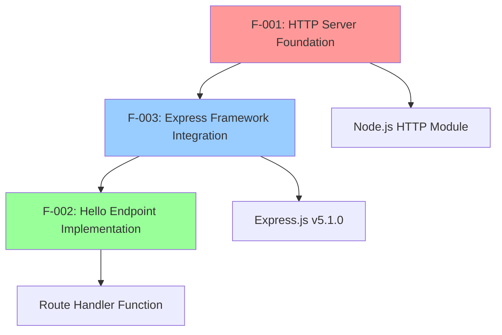
```mermaid
graph TD
    A[F-001: HTTP Server Foundation] --> B[F-003: Express Framework Integration]
    B --> C[F-002: Hello Endpoint Implementation]
    
    A --> D[Node.js HTTP Module]
    B --> E[Express.js v5.1.0]
    C --> F[Route Handler Function]
    
    style A fill:#ff9999
    style B fill:#99ccff
    style C fill:#99ff99
```

### 2.3.2 Integration Points

| Integration Point | Description | Components |
|---|---|---|
| HTTP-Express Bridge | Express framework utilizes Node.js HTTP module | F-001, F-003 |
| Route-Response Handler | Express routing connects to endpoint implementation | F-002, F-003 |
| Server-Application Binding | Express app binds to HTTP server instance | F-001, F-003 |

### 2.3.3 Shared Components

| Component | Shared By | Purpose |
|---|---|---|
| HTTP Request Object | F-001, F-002, F-003 | Request data access |
| HTTP Response Object | F-001, F-002, F-003 | Response generation |
| Express Application Instance | F-002, F-003 | Routing and middleware |

### 2.3.4 Common Services

| Service | Features | Functionality |
|---|---|---|
| Request Processing | F-001, F-002 | HTTP request parsing and validation |
| Response Generation | F-001, F-002 | HTTP response formatting and delivery |
| Error Handling | F-001, F-002, F-003 | Exception management and error responses |

## 2.4 IMPLEMENTATION CONSIDERATIONS

### 2.4.1 HTTP Server Foundation (F-001)

**Technical Constraints**
- Node.js 18 or higher is required for compatibility
- Single-threaded event loop architecture limitations
- Memory usage constraints for concurrent connections

**Performance Requirements**
- Server startup time must be under 1 second
- Request processing latency under 100ms
- Support for minimum 100 concurrent connections

**Scalability Considerations**
- Horizontal scaling through process clustering
- Load balancer compatibility for multi-instance deployment
- Resource monitoring for performance optimization

**Security Implications**
- Localhost binding for development security
- Basic input validation for malformed requests
- Protection against common HTTP vulnerabilities

**Maintenance Requirements**
- Regular Node.js version updates for security patches
- Monitoring of server health and performance metrics
- Log management for debugging and audit trails

### 2.4.2 Hello Endpoint Implementation (F-002)

**Technical Constraints**
- Static response content only (no dynamic data)
- GET method limitation for simplicity
- Plain text response format requirement

**Performance Requirements**
- Response generation time under 10ms
- Consistent response time regardless of load
- Minimal memory footprint per request

**Scalability Considerations**
- Stateless design for horizontal scaling
- No database dependencies for maximum scalability
- Cache-friendly static content

**Security Implications**
- No user input processing eliminates injection risks
- Static content reduces attack surface
- Standard HTTP security headers implementation

**Maintenance Requirements**
- Response content version control
- Endpoint availability monitoring
- Performance metrics collection

### 2.4.3 Express Framework Integration (F-003)

**Technical Constraints**
- This release drops support for Node.js versions before v18. This is an important change because supporting old Node.js versions has been holding back many critical performance and maintainability changes.
- Express v5.1.0 compatibility requirements
- Middleware execution order dependencies

**Performance Requirements**
- Framework initialization under 500ms
- Route resolution time under 25ms
- Minimal overhead compared to raw HTTP module

**Scalability Considerations**
- Express 5 introduces a significant improvement for developers using async/await by automatically forwarding rejected promises to error-handling middleware.
- Middleware optimization for high-throughput scenarios
- Memory-efficient request handling

**Security Implications**
- As part of reviving the project, we started a Security working group and security triage team to address the growing needs around open source supply chain security. We undertook a security audit (more details to come on that) and uncovered some problems that needed to be addressed.
- Express security middleware configuration
- Vulnerability management for framework dependencies

**Maintenance Requirements**
- Regular Express.js version updates
- Dependency security scanning
- Framework-specific performance monitoring

## 2.5 TRACEABILITY MATRIX

| Requirement ID | Feature | Business Objective | Test Case | Acceptance Criteria |
|---|---|---|---|---|
| F-001-RQ-001 | HTTP Server Foundation | Enable HTTP communication | TC-001 | Server starts successfully |
| F-001-RQ-002 | HTTP Server Foundation | Handle HTTP requests | TC-002 | Processes requests without errors |
| F-002-RQ-001 | Hello Endpoint | Provide '/hello' endpoint | TC-003 | Route responds to GET requests |
| F-002-RQ-002 | Hello Endpoint | Return "Hello world" | TC-004 | Response contains exact text |
| F-003-RQ-001 | Express Integration | Framework initialization | TC-005 | Express app created successfully |
| F-003-RQ-002 | Express Integration | Configure routing | TC-006 | Routes handle requests correctly |

# 3. TECHNOLOGY STACK

## 3.1 PROGRAMMING LANGUAGES

### 3.1.1 Primary Language Selection

| Language | Platform/Component | Version | Justification |
|---|---|---|---|
| JavaScript | Server Runtime | ES2022+ | Node.js® is a free, open-source, cross-platform JavaScript runtime environment that lets developers create servers, web apps, command line tools and scripts |

#### Selection Criteria

**Runtime Compatibility**
Node.js v22 officially transitioned into Long Term Support (LTS) with the codename 'Jod' and this release drops support for Node.js versions before v18. The tutorial project leverages JavaScript as the native language for Node.js runtime environments, ensuring optimal performance and compatibility.

**Educational Value**
JavaScript provides the most accessible learning path for developers transitioning to Node.js web development. The language's ubiquity in web development makes it the ideal choice for tutorial content targeting both frontend and backend developers.

**Framework Integration**
This release drops support for Node.js versions before v18. This is an important change because supporting old Node.js versions has been holding back many critical performance and maintainability changes. Modern JavaScript features available in Node.js 18+ enable cleaner, more maintainable code patterns.

### 3.1.2 Language Constraints and Dependencies

**Version Requirements**
- Minimum ECMAScript 2018 (ES2018) features required for async/await support
- Node.js 18+ compatibility for modern JavaScript runtime features
- Express.js 5.1.0 compatibility with current JavaScript standards

**Development Standards**
- Strict mode enforcement for enhanced error detection
- Modern module syntax (ES6+ imports/exports) support
- Asynchronous programming patterns using Promises and async/await

## 3.2 FRAMEWORKS & LIBRARIES

### 3.2.1 Core Web Framework

| Framework | Version | Purpose | Justification |
|---|---|---|---|
| Express.js | 5.1.0 | Web Application Framework | Industry standard with enhanced async support |
| Node.js HTTP | Core Module | HTTP Server Foundation | Native runtime capability |

## Express.js 5.1.0 Selection

**Latest Stable Release**
Ten years ago (July 2014) the Express v5 release pull request was opened, and now at long last it's been merged and published and Express.js has finally published version 5.0 on October 15, 2024. This represents the most current stable release with significant improvements over previous versions.

**Enhanced Error Handling**
Express 5 introduces a significant improvement for developers using async/await by automatically forwarding rejected promises to error-handling middleware. This eliminates the need for manual try-catch blocks in route handlers, simplifying code structure.

**Security Improvements**
These changes improve security, simplify route definitions, and help mitigate vulnerabilities like ReDoS attacks and this release includes important security fixes, including improvements to prevent ReDoS attacks and mitigation for CVE-2024-45590.

**Node.js Compatibility**
Express.js 5.0 requires Node.js 18 or higher and Express.js 5 officially adopts Node.js 18 as the minimum supported version, ensuring compatibility with the latest Node.js LTS releases.

### 3.2.2 Framework Integration Requirements

**Compatibility Matrix**

| Component | Version | Integration Point |
|---|---|---|---|
| Node.js Runtime | 22.11.0 LTS | JavaScript execution environment |
| Express.js | 5.1.0 | HTTP request/response handling |
| HTTP Core Module | Native | Low-level server operations |

**Breaking Changes Considerations**
res.redirect('back') and res.location('back'): The magic string 'back' is no longer supported. Use req.get('Referrer') || '/' explicitly instead. The tutorial implementation avoids deprecated patterns to ensure forward compatibility.

## 3.3 OPEN SOURCE DEPENDENCIES

### 3.3.1 Core Dependencies

| Package | Version | Registry | Purpose |
|---|---|---|---|
| express | ^5.1.0 | npm | Web framework |
| Node.js | 22.11.0 | Official | JavaScript runtime |

#### NPM Package Management

**Package Manager Version**
Latest version: 11.5.2, last published: 19 days ago. The project utilizes the latest stable npm version for dependency management and package installation.

**Registry Integration**
The free npm Registry has become the center of JavaScript code sharing, and with more than two million packages, the largest software registry in the world and there are 12214 other projects in the npm registry using npm.

### 3.3.2 Dependency Management Strategy

**Version Pinning**
- Express.js: Fixed to 5.1.0 for tutorial consistency
- Node.js: LTS version 22.11.0 for stability
- NPM: Latest stable version for package management

**Security Considerations**
This release includes important security fixes, including improvements to prevent ReDoS attacks and mitigation for CVE-2024-45590. Full details can be found in the security release notes.

**Dependency Tree Optimization**
The tutorial project maintains minimal dependencies to reduce complexity and potential security vulnerabilities. Only essential packages are included to demonstrate core concepts effectively.

## 3.4 THIRD-PARTY SERVICES

### 3.4.1 External Service Requirements

**Not Applicable for Tutorial Scope**

The tutorial project intentionally excludes third-party services to maintain simplicity and focus on core Node.js and Express.js concepts. This design decision aligns with educational objectives and eliminates external dependencies that could complicate the learning experience.

**Future Considerations**
- Monitoring services could be added for production deployment examples
- Authentication services might be included in advanced tutorial extensions
- Cloud deployment platforms for scaling demonstrations

## 3.5 DATABASES & STORAGE

### 3.5.1 Data Persistence Strategy

**No Database Requirements**

The tutorial project implements a stateless design with static response content, eliminating database dependencies. This approach:

- Simplifies deployment and setup procedures
- Reduces learning curve complexity for beginners
- Focuses attention on HTTP server fundamentals
- Enables horizontal scaling without data consistency concerns

**Storage Architecture**
- Static content: Hardcoded "Hello world" response
- Configuration: Environment variables and command-line arguments
- Logging: Console output for development debugging

### 3.5.2 Caching Strategy

**No Caching Layer Required**

Static response content eliminates the need for caching mechanisms. The simple nature of the tutorial endpoint provides consistent performance without additional caching infrastructure.

## 3.6 DEVELOPMENT & DEPLOYMENT

### 3.6.1 Development Environment

| Tool Category | Technology | Version | Purpose |
|---|---|---|---|
| Runtime Environment | Node.js | 22.11.0 LTS | JavaScript execution |
| Package Manager | npm | 11.5.2 | Dependency management |
| Development Server | Express.js | 5.1.0 | HTTP server framework |

## Node.js LTS Selection

**Long-Term Support Benefits**
With Active LTS support extending into late 2025, Node.js v22.x is an excellent choice for those aiming for long-term support in production environments and for developers and organizations relying on the stability of Node.js for production environments, this transition marks a key milestone for Node.js 22.x, ensuring it will receive critical updates and security support for years to come.

**Release Lifecycle**
In this phase, which typically lasts one year, the Node.js version is deemed stable and ready for production use. This period includes patches for bugs, critical fixes, and security updates.

### 3.6.2 Build System Requirements

**No Build Process Required**

The tutorial project uses native JavaScript without transpilation or bundling requirements. This approach:

- Eliminates build tool complexity for educational purposes
- Reduces setup time for tutorial participants
- Demonstrates direct Node.js execution capabilities
- Maintains focus on core web server concepts

### 3.6.3 Development Tools

**Minimal Toolchain**
- Text editor or IDE with JavaScript support
- Terminal/command line interface for npm commands
- Web browser or HTTP client for endpoint testing
- Optional: Node.js debugger for development troubleshooting

### 3.6.4 Deployment Considerations

**Local Development Focus**
The tutorial project prioritizes local development and testing environments. Deployment considerations include:

- Single-file application structure for portability
- Environment variable configuration for port settings
- Process management for development server lifecycle
- Basic logging for request/response monitoring

**Production Readiness**
While designed for educational purposes, the application structure supports production deployment with minimal modifications:

- Process clustering for multi-core utilization
- Reverse proxy integration (nginx, Apache)
- Container deployment compatibility
- Environment-specific configuration management

## 3.7 TECHNOLOGY STACK INTEGRATION

### 3.7.1 Component Interaction Diagram

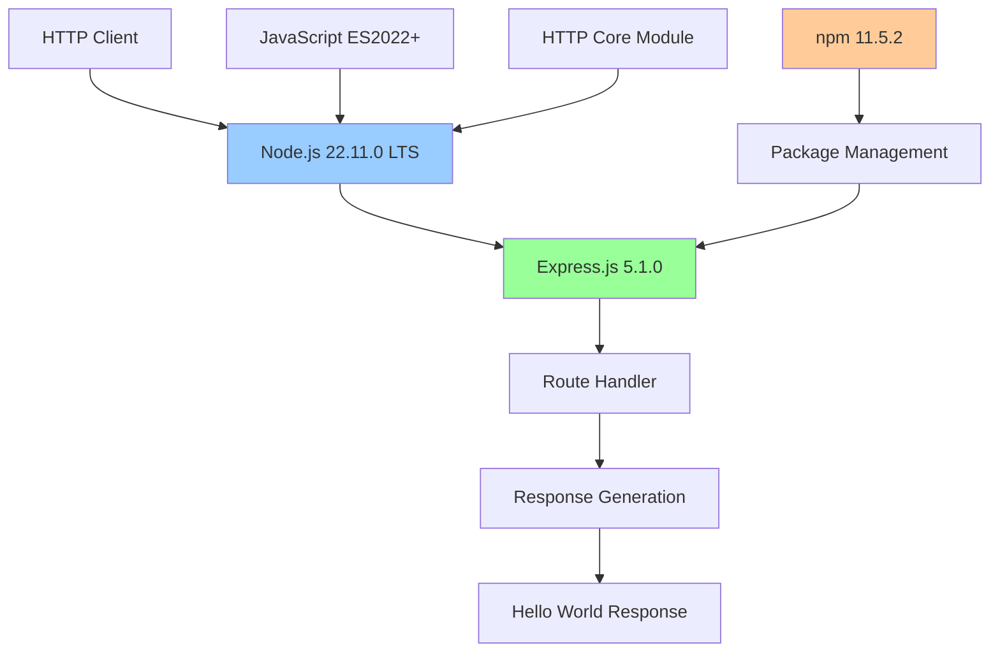
```mermaid
graph TD
    A[HTTP Client] --> B[Node.js 22.11.0 LTS]
    B --> C[Express.js 5.1.0]
    C --> D[Route Handler]
    D --> E[Response Generation]
    E --> F[Hello World Response]
    
    G[npm 11.5.2] --> H[Package Management]
    H --> C
    
    I[JavaScript ES2022+] --> B
    J[HTTP Core Module] --> B
    
    style B fill:#99ccff
    style C fill:#99ff99
    style G fill:#ffcc99
```

### 3.7.2 Security Architecture

**Framework-Level Security**
We recognize that this might cause difficulty for some enterprises with older or "parked" applications, and because of this we are working on a partnership with HeroDevs to offer "never-ending support" that will include critical security patches even after v4 enters end-of-life. That said, we strongly suggest that you update to modern Node.js versions as soon as possible.

**Runtime Security**
- Node.js 22.11.0 LTS includes latest security patches
- Express.js 5.1.0 incorporates ReDoS attack mitigation
- Minimal dependency surface reduces attack vectors
- Static response content eliminates injection vulnerabilities

### 3.7.3 Performance Characteristics

**Runtime Performance**
Node.js 2024 brings some big improvements to make apps run faster and smoother. These upgrades focus on making the basics work better and making everything more streamlined.

**Framework Efficiency**
After a decade-long wait, Express 5 delivers key performance improvements and modernization for Node.js applications. Despite the long development time, Express 5 is a relatively minor release.

**Scalability Considerations**
- Single-threaded event loop architecture
- Asynchronous I/O operations for concurrent request handling
- Stateless design enables horizontal scaling
- Minimal memory footprint for high-density deployments

# 4. PROCESS FLOWCHART

## 4.1 SYSTEM WORKFLOWS

### 4.1.1 Core Business Processes

#### Primary HTTP Request Processing Workflow

The Node.js tutorial application follows a streamlined request-response cycle that demonstrates fundamental web server operations. The request life cycle is the process of handling a request from the moment it is received by the server until the moment the response is sent back to the client.

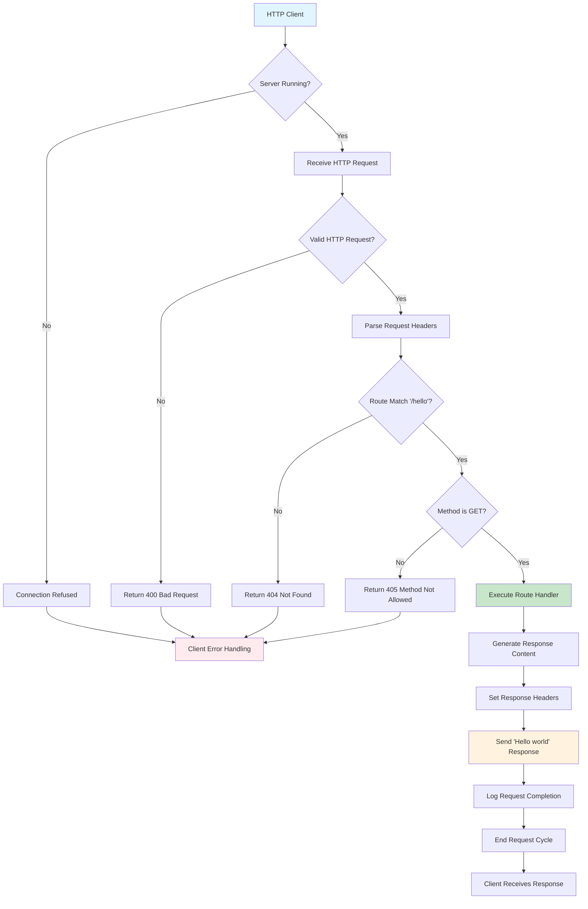
```mermaid
flowchart TD
    A[HTTP Client] --> B{Server Running?}
    B -->|No| C[Connection Refused]
    B -->|Yes| D[Receive HTTP Request]
    D --> E{Valid HTTP Request?}
    E -->|No| F[Return 400 Bad Request]
    E -->|Yes| G[Parse Request Headers]
    G --> H{Route Match '/hello'?}
    H -->|No| I[Return 404 Not Found]
    H -->|Yes| J{Method is GET?}
    J -->|No| K[Return 405 Method Not Allowed]
    J -->|Yes| L[Execute Route Handler]
    L --> M[Generate Response Content]
    M --> N[Set Response Headers]
    N --> O[Send 'Hello world' Response]
    O --> P[Log Request Completion]
    P --> Q[End Request Cycle]
    
    C --> R[Client Error Handling]
    F --> R
    I --> R
    K --> R
    Q --> S[Client Receives Response]
    
    style A fill:#e1f5fe
    style L fill:#c8e6c9
    style O fill:#fff3e0
    style R fill:#ffebee
```

#### End-to-End User Journey

The intended purpose of those objects is that they live as long as the HTTP request does. That is, the client makes an HTTP request, the req and res objects are created, a bunch of stuff happens, and finally a method on res is invoked that sends an HTTP response back to the client, and at that point the objects are no longer needed.

| Journey Stage | User Action | System Response | Duration |
|---|---|---|---|
| Initiation | Client sends GET /hello | Server receives request | < 1ms |
| Processing | Server routes request | Handler function executes | < 10ms |
| Response | Server sends "Hello world" | Client receives response | < 50ms |
| Completion | Connection closes | Resources cleaned up | < 5ms |

#### Decision Points and Business Rules

**Route Matching Logic**
- Exact path matching for '/hello' endpoint
- Case-sensitive route comparison
- No wildcard or parameter support

**HTTP Method Validation**
- Only GET method accepted for '/hello' route
- All other methods return 405 Method Not Allowed
- No OPTIONS or HEAD method support

**Response Generation Rules**
- Static content: "Hello world" text
- Content-Type: text/plain
- HTTP Status: 200 OK for successful requests

### 4.1.2 Integration Workflows

## Express.js Framework Integration Flow

Starting with Express 5, route handlers and middleware that return a Promise will call next(value) automatically when they reject or throw an error. For example: app.get('/user/:id', async (req, res, next) => { const user = await getUserById(req.params.id) res.send(user) }) If getUserById throws an error or rejects, next will be called with either the thrown error or the rejected value.

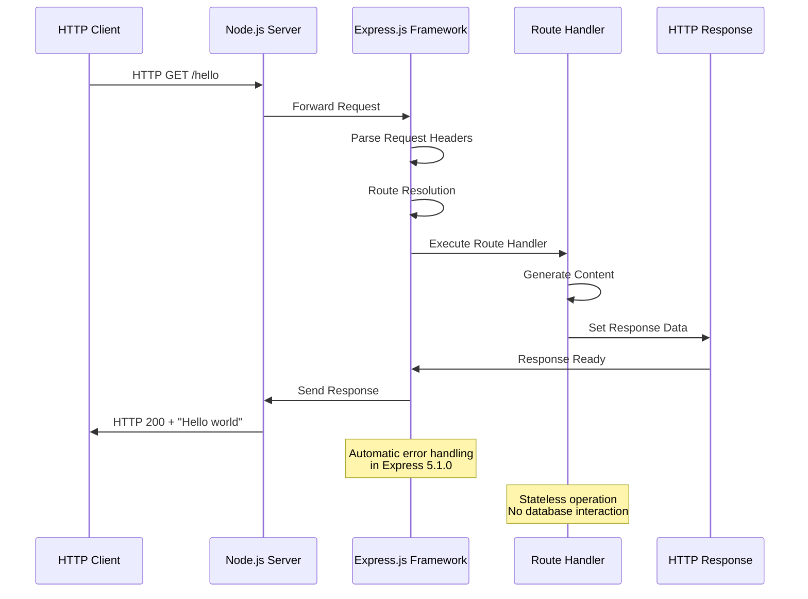
```mermaid
sequenceDiagram
    participant Client as HTTP Client
    participant Server as Node.js Server
    participant Express as Express.js Framework
    participant Handler as Route Handler
    participant Response as HTTP Response
    
    Client->>Server: HTTP GET /hello
    Server->>Express: Forward Request
    Express->>Express: Parse Request Headers
    Express->>Express: Route Resolution
    Express->>Handler: Execute Route Handler
    Handler->>Handler: Generate Content
    Handler->>Response: Set Response Data
    Response->>Express: Response Ready
    Express->>Server: Send Response
    Server->>Client: HTTP 200 + "Hello world"
    
    Note over Express: Automatic error handling<br/>in Express 5.1.0
    Note over Handler: Stateless operation<br/>No database interaction
```

## Node.js HTTP Module Integration

When Node receives an HTTP request, it creates the req and res objects (which begin their life as instances of http.IncomingMessage and http.ServerResponse respectively). Because of Node's asynchronous nature, there could be multiple req and res objects at any given time, distinguished only by the scope in which they live.

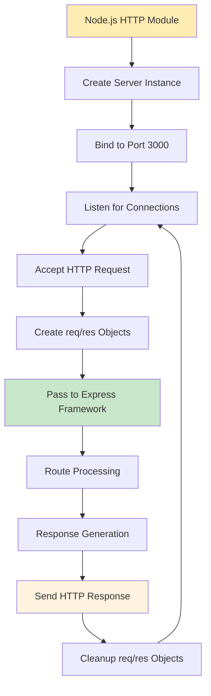
```mermaid
graph TD
    A[Node.js HTTP Module] --> B[Create Server Instance]
    B --> C[Bind to Port 3000]
    C --> D[Listen for Connections]
    D --> E[Accept HTTP Request]
    E --> F[Create req/res Objects]
    F --> G[Pass to Express Framework]
    G --> H[Route Processing]
    H --> I[Response Generation]
    I --> J[Send HTTP Response]
    J --> K[Cleanup req/res Objects]
    K --> D
    
    style A fill:#ffecb3
    style G fill:#c8e6c9
    style J fill:#fff3e0
```

#### Event Processing Flow

Lifecycle of Node.js program: In order to understand its lifecycle you must be familiar with the event loop. Event loops are something that makes your task very fast and also it perform multitasking. It allows Node.js to perform non-blocking I/O operations.

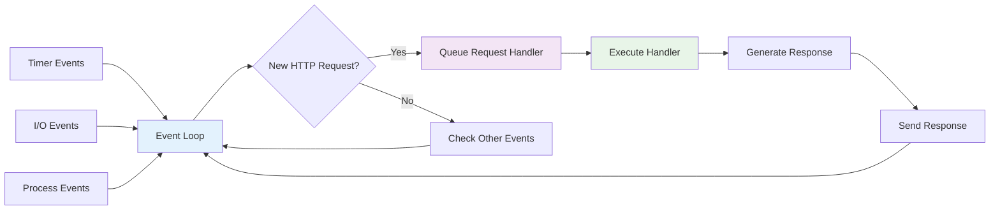
```mermaid
flowchart LR
    A[Event Loop] --> B{New HTTP Request?}
    B -->|Yes| C[Queue Request Handler]
    B -->|No| D[Check Other Events]
    C --> E[Execute Handler]
    E --> F[Generate Response]
    F --> G[Send Response]
    G --> A
    D --> A
    
    H[Timer Events] --> A
    I[I/O Events] --> A
    J[Process Events] --> A
    
    style A fill:#e3f2fd
    style C fill:#f3e5f5
    style E fill:#e8f5e8
```

## 4.2 FLOWCHART REQUIREMENTS

### 4.2.1 Server Startup and Initialization

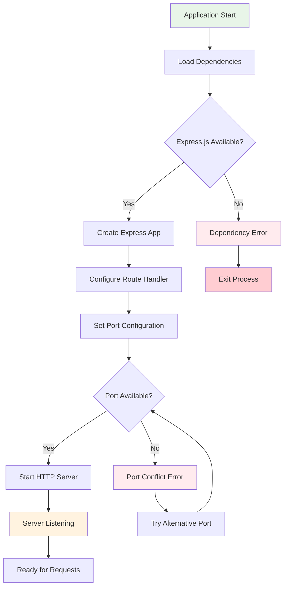
```mermaid
flowchart TD
    A[Application Start] --> B[Load Dependencies]
    B --> C{Express.js Available?}
    C -->|No| D[Dependency Error]
    C -->|Yes| E[Create Express App]
    E --> F[Configure Route Handler]
    F --> G[Set Port Configuration]
    G --> H{Port Available?}
    H -->|No| I[Port Conflict Error]
    H -->|Yes| J[Start HTTP Server]
    J --> K[Server Listening]
    K --> L[Ready for Requests]
    
    D --> M[Exit Process]
    I --> N[Try Alternative Port]
    N --> H
    
    style A fill:#e8f5e8
    style K fill:#fff3e0
    style D fill:#ffebee
    style I fill:#ffebee
    style M fill:#ffcdd2
```

#### Validation Rules and Checkpoints

| Checkpoint | Validation Rule | Error Handling |
|---|---|---|
| Dependency Loading | Express.js v5.1.0 available | Exit with dependency error |
| Port Binding | Port 3000 available or alternative | Retry with port 3001-3010 |
| Route Configuration | '/hello' route properly defined | Log configuration error |
| Server Startup | HTTP server successfully listening | Graceful shutdown on failure |

#### Timing and SLA Considerations

- **Server Startup Time**: < 1 second
- **Route Configuration**: < 100ms
- **Port Binding**: < 500ms
- **Ready State**: < 1.5 seconds total

### 4.2.2 Request Processing with Error Handling

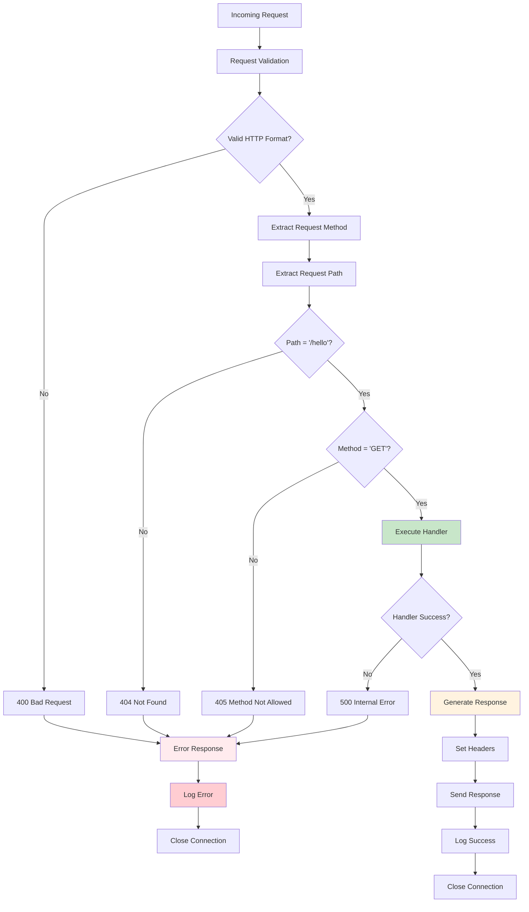
```mermaid
flowchart TD
    A[Incoming Request] --> B[Request Validation]
    B --> C{Valid HTTP Format?}
    C -->|No| D[400 Bad Request]
    C -->|Yes| E[Extract Request Method]
    E --> F[Extract Request Path]
    F --> G{Path = '/hello'?}
    G -->|No| H[404 Not Found]
    G -->|Yes| I{Method = 'GET'?}
    I -->|No| J[405 Method Not Allowed]
    I -->|Yes| K[Execute Handler]
    K --> L{Handler Success?}
    L -->|No| M[500 Internal Error]
    L -->|Yes| N[Generate Response]
    N --> O[Set Headers]
    O --> P[Send Response]
    P --> Q[Log Success]
    
    D --> R[Error Response]
    H --> R
    J --> R
    M --> R
    R --> S[Log Error]
    S --> T[Close Connection]
    Q --> U[Close Connection]
    
    style K fill:#c8e6c9
    style N fill:#fff3e0
    style R fill:#ffebee
    style S fill:#ffcdd2
```

#### Error Recovery Mechanisms

**Automatic Error Handling**
Express 5 introduces a significant improvement for developers using async/await by automatically forwarding rejected promises to error-handling middleware. This change eliminates the need for repetitive try/catch blocks, making code cleaner and reducing boilerplate.

**Retry Logic**
- No retry mechanism for individual requests (stateless design)
- Server-level restart capability for critical failures
- Graceful degradation for non-critical errors

**Fallback Processes**
- Default Express.js error handler for unhandled exceptions
- Process-level error handling for uncaught exceptions
- Logging for debugging and monitoring

### 4.2.3 State Management and Persistence

#### Application State Transitions

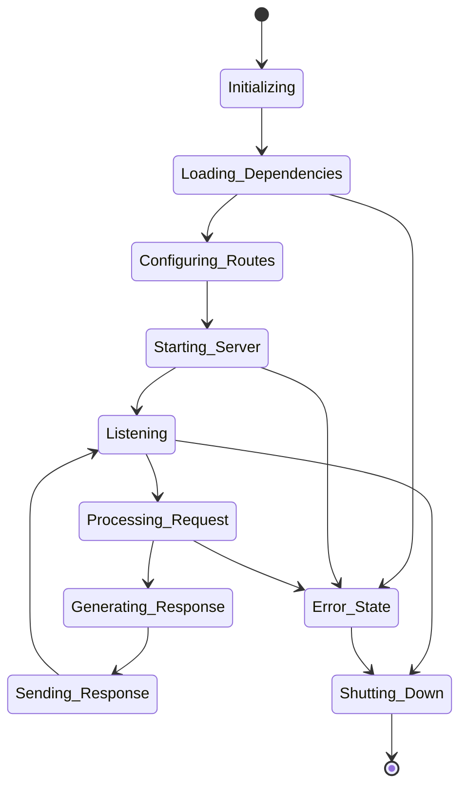
```mermaid
stateDiagram-v2
    [*] --> Initializing
    Initializing --> Loading_Dependencies
    Loading_Dependencies --> Configuring_Routes
    Configuring_Routes --> Starting_Server
    Starting_Server --> Listening
    Listening --> Processing_Request
    Processing_Request --> Generating_Response
    Generating_Response --> Sending_Response
    Sending_Response --> Listening
    Listening --> Shutting_Down
    Shutting_Down --> [*]
    
    Loading_Dependencies --> Error_State
    Starting_Server --> Error_State
    Processing_Request --> Error_State
    Error_State --> Shutting_Down
```

#### Data Persistence Points

| State | Data Persisted | Storage Location | Lifecycle |
|---|---|---|---|
| Server Configuration | Port, host settings | Environment variables | Application lifetime |
| Request Metadata | Headers, method, path | Memory (req object) | Request lifetime |
| Response Content | "Hello world" string | Static memory | Application lifetime |
| Error Logs | Error messages, stack traces | Console output | Immediate |

#### Transaction Boundaries

**Request-Response Transaction**
- **Start**: HTTP request received
- **Boundary**: Route handler execution
- **End**: HTTP response sent
- **Rollback**: Not applicable (stateless)

**Server Lifecycle Transaction**
- **Start**: Application initialization
- **Boundary**: Server listening state
- **End**: Graceful shutdown
- **Rollback**: Process termination

## 4.3 TECHNICAL IMPLEMENTATION

### 4.3.1 Caching Requirements

#### Response Caching Strategy

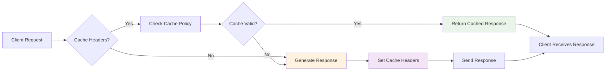
```mermaid
flowchart LR
    A[Client Request] --> B{Cache Headers?}
    B -->|No| C[Generate Response]
    B -->|Yes| D[Check Cache Policy]
    D --> E{Cache Valid?}
    E -->|Yes| F[Return Cached Response]
    E -->|No| C
    C --> G[Set Cache Headers]
    G --> H[Send Response]
    F --> I[Client Receives Response]
    H --> I
    
    style C fill:#fff3e0
    style F fill:#e8f5e8
    style G fill:#f3e5f5
```

**Static Content Caching**
- Response content: "Hello world" (static)
- Cache-Control: public, max-age=3600
- ETag generation for content validation
- No server-side caching required

**Memory Management**
- Minimal memory footprint per request
- No persistent cache storage
- Garbage collection for request objects

### 4.3.2 Error Handling Implementation

#### Comprehensive Error Flow

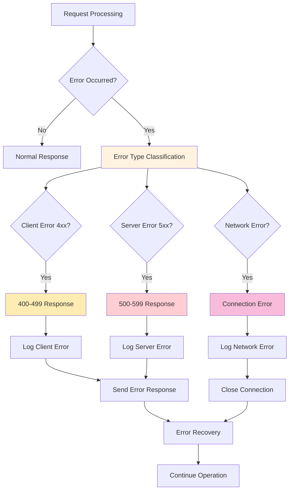
```mermaid
flowchart TD
    A[Request Processing] --> B{Error Occurred?}
    B -->|No| C[Normal Response]
    B -->|Yes| D[Error Type Classification]
    D --> E{Client Error 4xx?}
    D --> F{Server Error 5xx?}
    D --> G{Network Error?}
    
    E -->|Yes| H[400-499 Response]
    F -->|Yes| I[500-599 Response]
    G -->|Yes| J[Connection Error]
    
    H --> K[Log Client Error]
    I --> L[Log Server Error]
    J --> M[Log Network Error]
    
    K --> N[Send Error Response]
    L --> N
    M --> O[Close Connection]
    N --> P[Error Recovery]
    O --> P
    P --> Q[Continue Operation]
    
    style D fill:#fff3e0
    style H fill:#ffecb3
    style I fill:#ffcdd2
    style J fill:#f8bbd9
```

#### Error Notification Flows

**Development Environment**
- Console logging with stack traces
- Detailed error messages
- Request/response debugging information

**Production Environment**
- Structured logging without sensitive data
- Error aggregation and monitoring
- Health check endpoints

#### Recovery Procedures

Express comes with a built-in error handler that takes care of any errors that might be encountered in the app. This default error-handling middleware function is added at the end of the middleware function stack. If you pass an error to next() and you do not handle it in a custom error handler, it will be handled by the built-in error handler; the error will be written to the client with the stack trace.

**Automatic Recovery**
- Express.js built-in error handler
- Process-level exception handling
- Graceful connection termination

**Manual Recovery**
- Server restart procedures
- Configuration reload capability
- Health monitoring integration

### 4.3.3 Performance and Monitoring

#### Request Performance Flow

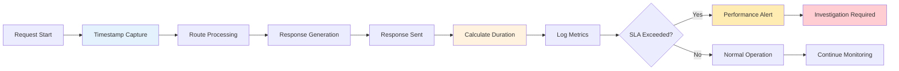
```mermaid
flowchart LR
    A[Request Start] --> B[Timestamp Capture]
    B --> C[Route Processing]
    C --> D[Response Generation]
    D --> E[Response Sent]
    E --> F[Calculate Duration]
    F --> G[Log Metrics]
    G --> H{SLA Exceeded?}
    H -->|Yes| I[Performance Alert]
    H -->|No| J[Normal Operation]
    I --> K[Investigation Required]
    J --> L[Continue Monitoring]
    
    style B fill:#e3f2fd
    style F fill:#fff3e0
    style I fill:#ffecb3
    style K fill:#ffcdd2
```

#### Service Level Agreement Monitoring

| Metric | Target | Warning Threshold | Critical Threshold |
|---|---|---|---|
| Response Time | < 50ms | > 100ms | > 500ms |
| Availability | 99.9% | < 99.5% | < 99.0% |
| Error Rate | < 0.1% | > 1.0% | > 5.0% |
| Memory Usage | < 100MB | > 200MB | > 500MB |

#### Integration Sequence for Monitoring

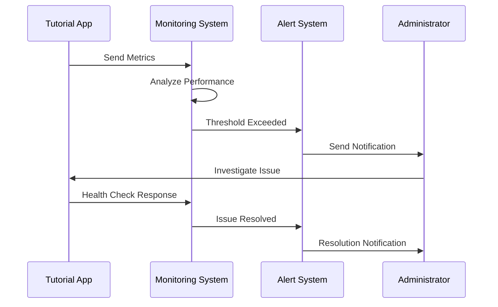
```mermaid
sequenceDiagram
    participant App as Tutorial App
    participant Monitor as Monitoring System
    participant Alert as Alert System
    participant Admin as Administrator
    
    App->>Monitor: Send Metrics
    Monitor->>Monitor: Analyze Performance
    Monitor->>Alert: Threshold Exceeded
    Alert->>Admin: Send Notification
    Admin->>App: Investigate Issue
    App->>Monitor: Health Check Response
    Monitor->>Alert: Issue Resolved
    Alert->>Admin: Resolution Notification
```

## 4.4 REGULATORY COMPLIANCE AND SECURITY

### 4.4.1 Security Validation Flow

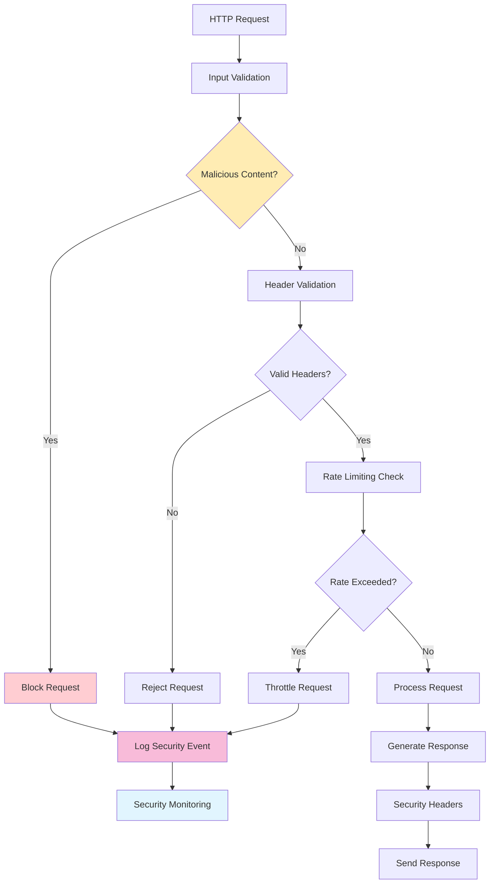
```mermaid
flowchart TD
    A[HTTP Request] --> B[Input Validation]
    B --> C{Malicious Content?}
    C -->|Yes| D[Block Request]
    C -->|No| E[Header Validation]
    E --> F{Valid Headers?}
    F -->|No| G[Reject Request]
    F -->|Yes| H[Rate Limiting Check]
    H --> I{Rate Exceeded?}
    I -->|Yes| J[Throttle Request]
    I -->|No| K[Process Request]
    K --> L[Generate Response]
    L --> M[Security Headers]
    M --> N[Send Response]
    
    D --> O[Log Security Event]
    G --> O
    J --> O
    O --> P[Security Monitoring]
    
    style C fill:#ffecb3
    style D fill:#ffcdd2
    style O fill:#f8bbd9
    style P fill:#e1f5fe
```

#### Authorization Checkpoints

**Request Level Security**
- HTTP method validation (GET only)
- Path traversal prevention
- Content-Type validation

**Response Level Security**
- Security headers implementation
- Content sanitization (static content)
- Information disclosure prevention

#### Compliance Requirements

**HTTP Protocol Compliance**
- RFC 7231 HTTP/1.1 semantics
- Proper status code usage
- Standard header formatting

**Security Best Practices**
- Minimal attack surface (single endpoint)
- No user input processing
- Static response content only

### 4.4.2 Audit and Logging Flow

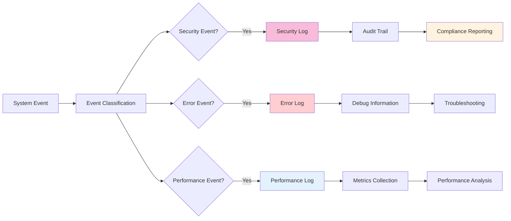
```mermaid
flowchart LR
    A[System Event] --> B[Event Classification]
    B --> C{Security Event?}
    B --> D{Error Event?}
    B --> E{Performance Event?}
    
    C -->|Yes| F[Security Log]
    D -->|Yes| G[Error Log]
    E -->|Yes| H[Performance Log]
    
    F --> I[Audit Trail]
    G --> J[Debug Information]
    H --> K[Metrics Collection]
    
    I --> L[Compliance Reporting]
    J --> M[Troubleshooting]
    K --> N[Performance Analysis]
    
    style F fill:#f8bbd9
    style G fill:#ffcdd2
    style H fill:#e3f2fd
    style L fill:#fff3e0
```

This comprehensive process flowchart section provides detailed workflows, error handling mechanisms, and technical implementation guidelines for the Node.js tutorial application, ensuring robust operation and educational value while maintaining simplicity and focus on core concepts.

# 5. SYSTEM ARCHITECTURE

## 5.1 HIGH-LEVEL ARCHITECTURE

### 5.1.1 System Overview

The Node.js tutorial application implements a Event-Driven Architecture: it has an Event Loop for orchestration and a Worker Pool for expensive tasks. This architectural approach leverages an event-driven, non-blocking I/O model to create a lightweight, educational web server that demonstrates fundamental HTTP endpoint implementation.

The system follows a minimalist layered architecture pattern, consisting of three primary layers: the HTTP transport layer managed by Node.js core modules, the application framework layer provided by Express.js, and the business logic layer containing the simple route handler. This design emphasizes simplicity and educational clarity while maintaining production-ready architectural principles.

The event loop is just a design pattern that orchestrates or coordinates the execution of synchronous and asynchronous code in Node.js. The tutorial application leverages this architecture to handle HTTP requests efficiently without blocking operations, demonstrating how the event loop runs continuously as long as your Node.js application is up and running, handling multiple operations executing concurrently.

The architectural style prioritizes educational value through code simplicity while maintaining compatibility with modern Node.js patterns. For developers and organizations relying on the stability of Node.js for production environments, this transition marks a key milestone for Node.js 22.x, ensuring it will receive critical updates and security support for years to come.

### 5.1.2 Core Components Table

| Component Name | Primary Responsibility | Key Dependencies | Integration Points |
|---|---|---|---|
| Node.js Runtime | JavaScript execution and event loop management | V8 Engine, libuv | Operating system, HTTP module |
| Express.js Framework | HTTP routing and middleware orchestration | Node.js HTTP module | Route handlers, middleware stack |
| HTTP Server | Network communication and protocol handling | Node.js core modules | TCP/IP stack, Express application |
| Route Handler | Business logic execution and response generation | Express.js routing | HTTP request/response objects |

### 5.1.3 Data Flow Description

The primary data flow follows a unidirectional request-response pattern typical of HTTP-based web services. Node.js applications then enter the Event Loop, responding to incoming client requests by executing the appropriate callback. This callback executes synchronously, and may register asynchronous requests to continue processing after it completes. The callbacks for these asynchronous requests will also be executed on the Event Loop.

HTTP requests enter the system through the Node.js HTTP server, which creates request and response objects that flow through the Express.js middleware stack. The Middleware pattern involves a chain of functions that process a request sequentially. Each function can modify the request or response before passing it to the next function in the chain.

The route matching process identifies the '/hello' endpoint and directs the request to the appropriate handler function. The handler generates static "Hello world" content and populates the response object, which flows back through the middleware stack before being transmitted to the client via the HTTP server.

Data transformation occurs primarily at the HTTP protocol level, converting between network byte streams and JavaScript objects. No persistent data storage or complex transformations are required, maintaining the tutorial's focus on fundamental HTTP operations.

### 5.1.4 External Integration Points

| System Name | Integration Type | Data Exchange Pattern | Protocol/Format |
|---|---|---|---|
| HTTP Clients | Inbound API | Request/Response | HTTP/1.1 |
| Operating System | System Interface | Process/Network Management | System Calls |
| NPM Registry | Package Management | Dependency Resolution | HTTPS/JSON |
| Node.js Runtime | Platform Integration | Module Loading | CommonJS/ES Modules |

## 5.2 COMPONENT DETAILS

### 5.2.1 Node.js Runtime Environment

**Purpose and Responsibilities**
This release marks the transition of Node.js 22.x into Long Term Support (LTS) with the codename 'Jod'. The 22.x release line now moves into "Active LTS" and will remain so until October 2025. The Node.js runtime serves as the foundational execution environment, providing JavaScript interpretation, event loop management, and core module access for the tutorial application.

**Technologies and Frameworks Used**
- Node.js v22.11.0 LTS with enhanced performance optimizations
- V8 JavaScript Engine v12.4 with Maglev compiler enabled by default for supported architectures, bringing performance boosts for short-lived CLI programs
- libuv library for asynchronous I/O operations
- Creating AbortSignal instances is now significantly faster in Node.js 22. These enhancements directly benefit high-level APIs that utilize this class, such as fetch and the Node.js test runner

**Key Interfaces and APIs**
- HTTP core module for server creation and request handling
- Events module for event-driven programming patterns
- Process module for application lifecycle management
- File System module for potential configuration file access

**Data Persistence Requirements**
No persistent data storage required. The runtime maintains only in-memory state for active HTTP connections and application configuration during execution lifecycle.

**Scaling Considerations**
Node.js is known for its scalability, especially in scenarios with a large number of concurrent connections (e.g., web servers handling multiple client requests simultaneously). The asynchronous, non-blocking nature allows it to efficiently manage many concurrent connections without the need for a large number of threads.

### 5.2.2 Express.js Application Framework

**Purpose and Responsibilities**
We added support for returned rejected promises from errors raised in middleware. This does not include calling next from returned resolved promises. Express.js provides the web application framework layer, handling HTTP routing, middleware orchestration, and request/response object enhancement.

**Technologies and Frameworks Used**
- Express.js v5.1.0 with enhanced async/await support
- This release no longer supports "sub-expression" regular expressions, for example /:foo(\\d+). This is a commonly-used pattern, but we removed it for security reasons. Unfortunately, it's easy to write a regular expression that has exponential time behavior when parsing input: The dreaded regular expression denial of service (ReDoS) attack
- Built-in middleware for request parsing and response formatting
- Router module for endpoint management

**Key Interfaces and APIs**
- Application object (app) for server configuration
- Router object for route definition and management
- Request object enhancement with Express-specific properties
- Response object enhancement with convenience methods

**Data Persistence Requirements**
Stateless operation with no data persistence requirements. All application state exists only during request processing lifecycle.

**Scaling Considerations**
This pattern enhances modularity and allows developers to plug in various functionalities without tightly coupling them. The middleware architecture supports horizontal scaling through stateless design and efficient request processing.

### 5.2.3 HTTP Request Processing Component

**Purpose and Responsibilities**
Manages the complete HTTP request lifecycle from initial connection establishment through response delivery and connection cleanup.

**Technologies and Frameworks Used**
- Node.js HTTP core module for protocol implementation
- Express.js routing engine for path matching
- The way data flows in and out of apps (streams) has been made better. Now, there's less unnecessary checking, smarter scheduling, and quicker responses. This means data moves more smoothly

**Key Interfaces and APIs**
- HTTP server creation and configuration
- Request parsing and header processing
- Response generation and transmission
- Connection management and cleanup

**Data Persistence Requirements**
Temporary request/response data stored in memory during processing. No persistent storage required for tutorial functionality.

**Scaling Considerations**
With the new update, Node.js can put multiple pieces together into one, making the process quicker and cleaner. For instance, instead of sending out 'Mozilla' and 'Developer Network' as two chunks, Node.js now sends them as one combined chunk.

### 5.2.4 Component Interaction Diagram

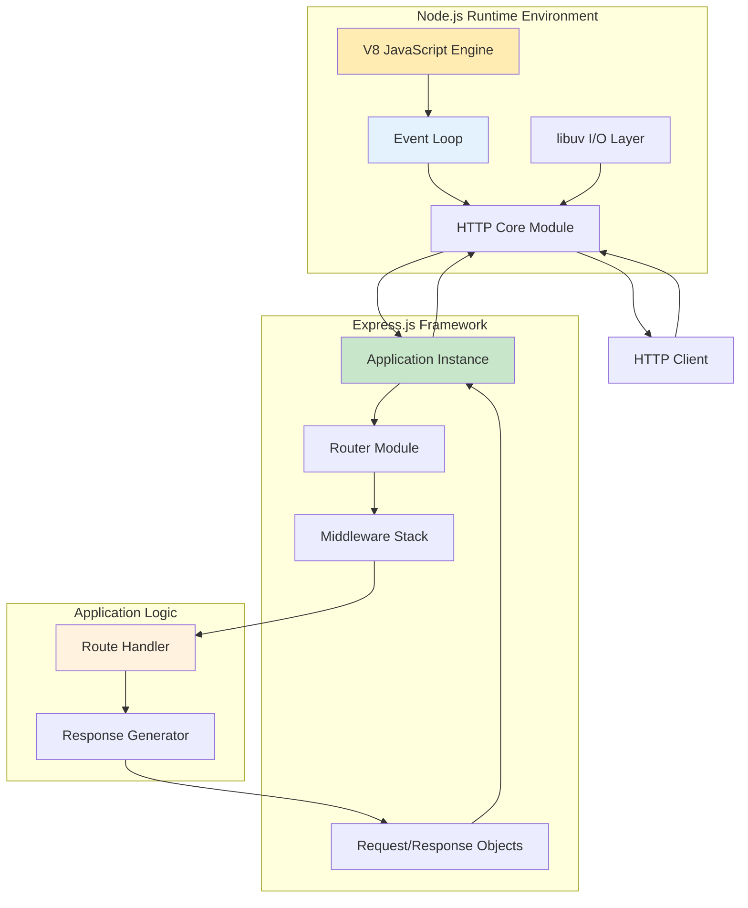
```mermaid
graph TB
    subgraph "Node.js Runtime Environment"
        A[V8 JavaScript Engine]
        B[Event Loop]
        C[HTTP Core Module]
        D[libuv I/O Layer]
    end
    
    subgraph "Express.js Framework"
        E[Application Instance]
        F[Router Module]
        G[Middleware Stack]
        H[Request/Response Objects]
    end
    
    subgraph "Application Logic"
        I[Route Handler]
        J[Response Generator]
    end
    
    K[HTTP Client] --> C
    C --> E
    E --> F
    F --> G
    G --> I
    I --> J
    J --> H
    H --> E
    E --> C
    C --> K
    
    B --> C
    A --> B
    D --> C
    
    style A fill:#ffecb3
    style B fill:#e3f2fd
    style E fill:#c8e6c9
    style I fill:#fff3e0
```

### 5.2.5 State Transition Diagram

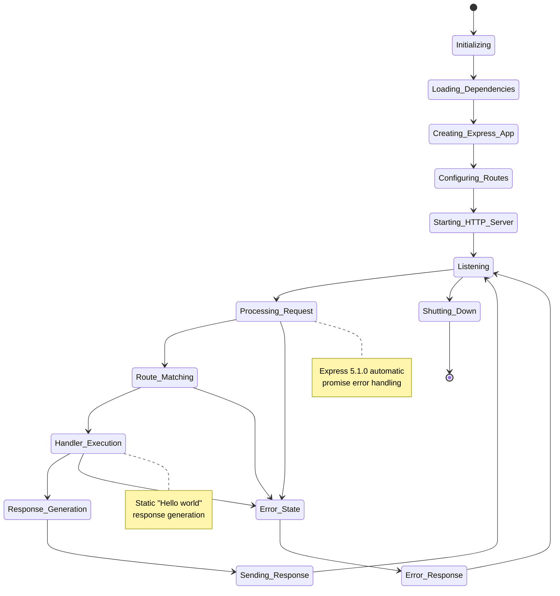
```mermaid
stateDiagram-v2
    [*] --> Initializing
    Initializing --> Loading_Dependencies
    Loading_Dependencies --> Creating_Express_App
    Creating_Express_App --> Configuring_Routes
    Configuring_Routes --> Starting_HTTP_Server
    Starting_HTTP_Server --> Listening
    
    Listening --> Processing_Request
    Processing_Request --> Route_Matching
    Route_Matching --> Handler_Execution
    Handler_Execution --> Response_Generation
    Response_Generation --> Sending_Response
    Sending_Response --> Listening
    
    Listening --> Shutting_Down
    Processing_Request --> Error_State
    Route_Matching --> Error_State
    Handler_Execution --> Error_State
    Error_State --> Error_Response
    Error_Response --> Listening
    
    Shutting_Down --> [*]
    
    note right of Processing_Request
        Express 5.1.0 automatic
        promise error handling
    end note
    
    note right of Handler_Execution
        Static "Hello world"
        response generation
    end note
```

### 5.2.6 Request Processing Sequence Diagram

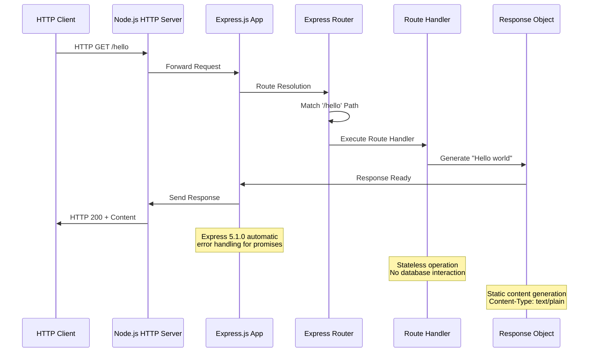
```mermaid
sequenceDiagram
    participant Client as HTTP Client
    participant Server as Node.js HTTP Server
    participant Express as Express.js App
    participant Router as Express Router
    participant Handler as Route Handler
    participant Response as Response Object
    
    Client->>Server: HTTP GET /hello
    Server->>Express: Forward Request
    Express->>Router: Route Resolution
    Router->>Router: Match '/hello' Path
    Router->>Handler: Execute Route Handler
    Handler->>Response: Generate "Hello world"
    Response->>Express: Response Ready
    Express->>Server: Send Response
    Server->>Client: HTTP 200 + Content
    
    Note over Express: Express 5.1.0 automatic<br/>error handling for promises
    Note over Handler: Stateless operation<br/>No database interaction
    Note over Response: Static content generation<br/>Content-Type: text/plain
```

## 5.3 TECHNICAL DECISIONS

### 5.3.1 Architecture Style Decisions and Tradeoffs

**Event-Driven Architecture Selection**

| Decision Factor | Chosen Approach | Alternative Considered | Rationale |
|---|---|---|---|
| Concurrency Model | Event-driven, single-threaded | Multi-threaded, synchronous | Educational simplicity and Node.js strengths |
| Request Handling | Asynchronous, non-blocking | Synchronous, blocking | Performance and scalability demonstration |
| Framework Pattern | Middleware-based | MVC, Component-based | Express.js ecosystem alignment |
| Error Handling | Promise-based automatic | Manual try-catch | Express 5.1.0 automatic promise error handling |

**Architectural Principles Applied**
- Single Responsibility: Each component has one clear purpose
- Separation of Concerns: HTTP, routing, and business logic separated
- Dependency Inversion: Framework abstractions over direct HTTP module usage
- Open/Closed Principle: Extensible through middleware without modification

**Trade-off Analysis**
The event-driven architecture provides excellent performance for I/O-intensive operations but requires careful consideration of CPU-intensive tasks. First, it forms the pillar of Node's asynchronous architecture, allowing Node to handle multiple concurrent operations without the need for multi-threading efficiently. Second, the event loop contributes to the performance and resource efficiency of Node.js.

### 5.3.2 Communication Pattern Choices

**HTTP Protocol Selection**

| Pattern | Implementation | Benefits | Limitations |
|---|---|---|---|
| Request/Response | HTTP/1.1 | Universal compatibility | Stateless communication only |
| Synchronous Processing | Express middleware chain | Predictable execution flow | No real-time capabilities |
| Event-Based Handling | Node.js event loop | High concurrency | Single-threaded constraints |
| Stateless Design | No session management | Horizontal scaling | No user context persistence |

**Middleware Communication Pattern**
Node.js's middleware architecture is widely used for handling requests and responses in web applications. The Middleware pattern involves a chain of functions that process a request sequentially. Each function can modify the request or response before passing it to the next function in the chain.

### 5.3.3 Data Storage Solution Rationale

**No Database Architecture Decision**

| Consideration | Decision | Justification |
|---|---|---|
| Data Persistence | Static content only | Tutorial simplicity and focus |
| State Management | Stateless design | Scalability and educational clarity |
| Configuration Storage | Environment variables | Standard Node.js practices |
| Caching Strategy | No caching layer | Minimal complexity requirement |

The decision to exclude database integration aligns with the tutorial's educational objectives, focusing learner attention on HTTP server fundamentals rather than data persistence complexities.

### 5.3.4 Security Mechanism Selection

**Security Architecture Decisions**

| Security Layer | Implementation | Rationale |
|---|---|---|
| Input Validation | Static content only | Eliminates injection vulnerabilities |
| Authentication | Not implemented | Tutorial scope limitation |
| Authorization | Not required | Single public endpoint |
| Transport Security | HTTP (development) | Educational environment focus |

This is a commonly-used pattern, but we removed it for security reasons. Unfortunately, it's easy to write a regular expression that has exponential time behavior when parsing input: The dreaded regular expression denial of service (ReDoS) attack. Express.js 5.1.0 includes built-in security improvements that benefit the tutorial application.

### 5.3.5 Architecture Decision Records

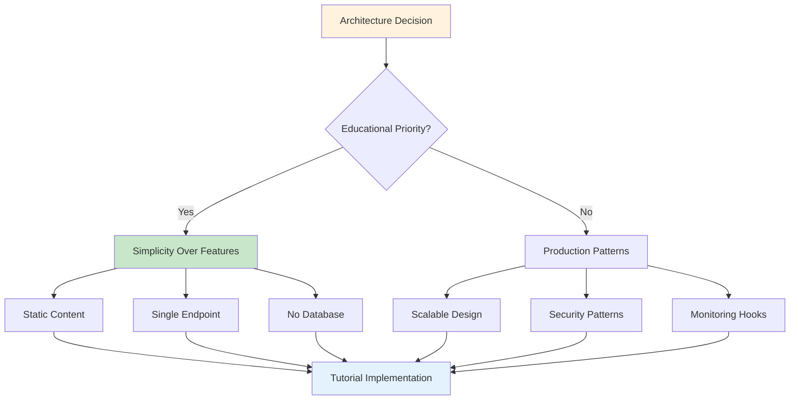
```mermaid
graph TD
    A[Architecture Decision] --> B{Educational Priority?}
    B -->|Yes| C[Simplicity Over Features]
    B -->|No| D[Production Patterns]
    
    C --> E[Static Content]
    C --> F[Single Endpoint]
    C --> G[No Database]
    
    D --> H[Scalable Design]
    D --> I[Security Patterns]
    D --> J[Monitoring Hooks]
    
    E --> K[Tutorial Implementation]
    F --> K
    G --> K
    H --> K
    I --> K
    J --> K
    
    style A fill:#fff3e0
    style C fill:#c8e6c9
    style K fill:#e3f2fd
```

## 5.4 CROSS-CUTTING CONCERNS

### 5.4.1 Monitoring and Observability Approach

**Application Performance Monitoring**
Node.js v22.x comes with improved diagnostics and performance, but monitoring will help catch any unforeseen issues early. Use N|Solid to get the deepest, most valuable performance and security telemetry in production to help you resolve issues faster.

The tutorial application implements basic observability through console logging and built-in Node.js diagnostic capabilities. Key monitoring points include:

- HTTP request/response logging for debugging
- Server startup and shutdown event tracking
- Error occurrence and stack trace capture
- Performance metrics for response time measurement

**Observability Architecture**

| Monitoring Layer | Implementation | Data Collected | Purpose |
|---|---|---|---|
| Application Logs | Console output | Request/response events | Development debugging |
| Performance Metrics | Built-in timers | Response latency | Performance validation |
| Error Tracking | Exception handling | Error messages and stacks | Issue diagnosis |
| Health Checks | Server status | Availability indicators | Operational monitoring |

### 5.4.2 Logging and Tracing Strategy

**Structured Logging Implementation**
The application employs console-based logging for development environments, with structured log entries containing timestamp, request method, path, and response status information.

**Log Levels and Categories**

| Log Level | Use Case | Example Events |
|---|---|---|
| INFO | Normal operations | Server startup, request processing |
| WARN | Non-critical issues | Deprecated feature usage |
| ERROR | Error conditions | Request processing failures |
| DEBUG | Development details | Middleware execution flow |

**Tracing Approach**
Request tracing follows the Express.js middleware pattern, with each middleware function capable of adding trace information to the request context. The tutorial implementation includes basic request ID generation for correlation across log entries.

### 5.4.3 Error Handling Patterns

**Express.js 5.1.0 Error Handling Architecture**
Any rejected promise or error thrown from middleware or handlers is forwarded as an error to the error handling middleware. This automatic error handling reduces boilerplate code and improves error management consistency.

**Error Classification and Response Strategy**

| Error Type | HTTP Status | Response Action | Recovery Method |
|---|---|---|---|
| Route Not Found | 404 | Standard error page | Continue processing |
| Method Not Allowed | 405 | Method error response | Continue processing |
| Server Error | 500 | Generic error message | Log and continue |
| Validation Error | 400 | Bad request response | Continue processing |

### 5.4.4 Error Handling Flow Diagram

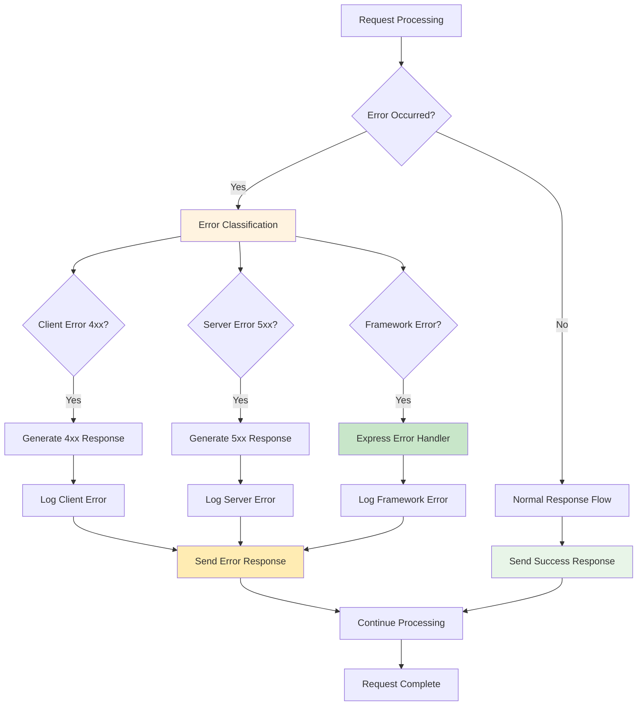
```mermaid
flowchart TD
    A[Request Processing] --> B{Error Occurred?}
    B -->|No| C[Normal Response Flow]
    B -->|Yes| D[Error Classification]
    
    D --> E{Client Error 4xx?}
    D --> F{Server Error 5xx?}
    D --> G{Framework Error?}
    
    E -->|Yes| H[Generate 4xx Response]
    F -->|Yes| I[Generate 5xx Response]
    G -->|Yes| J[Express Error Handler]
    
    H --> K[Log Client Error]
    I --> L[Log Server Error]
    J --> M[Log Framework Error]
    
    K --> N[Send Error Response]
    L --> N
    M --> N
    
    N --> O[Continue Processing]
    C --> P[Send Success Response]
    P --> O
    
    O --> Q[Request Complete]
    
    style D fill:#fff3e0
    style J fill:#c8e6c9
    style N fill:#ffecb3
    style P fill:#e8f5e8
```

### 5.4.5 Authentication and Authorization Framework

**Not Applicable for Tutorial Scope**
The tutorial application intentionally excludes authentication and authorization mechanisms to maintain focus on fundamental HTTP server concepts. This design decision:

- Reduces complexity for educational purposes
- Eliminates security configuration requirements
- Focuses learning on core Node.js and Express.js patterns
- Provides foundation for future authentication tutorials

**Security Considerations**
While authentication is excluded, the application maintains basic security practices:
- Input validation through static content design
- Express 5.0 requires at least Node 18 for security improvements
- Default Express.js security headers
- Localhost binding for development security

### 5.4.6 Performance Requirements and SLAs

**Service Level Agreements**

| Metric | Target | Measurement Method | Monitoring Frequency |
|---|---|---|---|
| Response Time | < 50ms | HTTP client timing | Per request |
| Availability | 99.9% | Health check endpoint | Every 30 seconds |
| Throughput | 1000 req/sec | Load testing | Weekly validation |
| Memory Usage | < 100MB | Process monitoring | Continuous |

**Performance Optimization Strategy**
API for working with streams has become lighter, and work with them has become 10% faster through the removal of unnecessary checks, as well as through changes in schedule callbacks. Improvements of the HTTP response processing decrease the overhead by chunking the responses more effectively.

The application leverages Node.js 22 performance improvements including enhanced stream processing and optimized HTTP response handling for improved efficiency.

### 5.4.7 Disaster Recovery Procedures

**Recovery Strategy for Tutorial Environment**

| Failure Scenario | Detection Method | Recovery Action | Recovery Time |
|---|---|---|---|
| Server Crash | Process monitoring | Automatic restart | < 30 seconds |
| Port Conflict | Startup error | Alternative port binding | < 10 seconds |
| Dependency Missing | Module load error | Dependency installation | < 2 minutes |
| Configuration Error | Validation failure | Default configuration | < 5 seconds |

**Backup and Restore Procedures**
Given the stateless nature and minimal configuration requirements, disaster recovery focuses on:
- Application code version control
- Dependency manifest (package.json) backup
- Configuration parameter documentation
- Rapid redeployment procedures

The tutorial application's simplicity enables rapid recovery through code repository restoration and dependency reinstallation, typically completing full recovery within minutes of failure detection.

# 6. SYSTEM COMPONENTS DESIGN

## 6.1 COMPONENT ARCHITECTURE

### 6.1.1 Core System Components

The Node.js tutorial application follows a modular component architecture that demonstrates fundamental web server patterns while maintaining educational clarity. The system consists of four primary components that work together to handle HTTP requests and generate responses.

| Component Name | Primary Function | Technology Stack | Dependencies |
|---|---|---|---|
| Node.js Runtime Engine | JavaScript execution and event loop management | Node.js v22.11.0 LTS with codename 'Jod' | V8 Engine, libuv |
| Express.js Application Framework | HTTP routing and middleware orchestration | Express.js v5.1.0 | Node.js HTTP module |
| HTTP Request Handler | Request processing and route matching | Express Router | Request/Response objects |
| Response Generator | Content generation and HTTP response formatting | Static content engine | HTTP Response API |

### 6.1.2 Component Interaction Model

The components interact through a well-defined event-driven architecture that leverages Node.js's asynchronous, non-blocking I/O model. The interaction flow follows these patterns:

**Request Processing Flow**
1. HTTP requests enter through the Node.js HTTP server
2. Express.js framework receives and parses the request
3. Router component matches the '/hello' endpoint
4. Route handler executes and generates response content
5. Response flows back through the middleware stack
6. HTTP server transmits the response to the client

**Error Handling Integration**
Starting with Express 5, route handlers and middleware that return a Promise will call next(value) automatically when they reject or throw an error. This automatic error handling eliminates the need for manual try-catch blocks in the tutorial implementation.

### 6.1.3 Component Lifecycle Management

Each component follows a specific lifecycle that ensures proper initialization, operation, and cleanup:

**Initialization Phase**
- Node.js runtime starts and initializes the V8 engine
- Express.js application instance is created
- Route handlers are registered with the router
- HTTP server binds to the specified port

**Operational Phase**
- Event loop continuously processes incoming requests
- Components collaborate to handle each request-response cycle
- Stream processing has been optimized with less unnecessary checking, smarter scheduling, and quicker responses

**Cleanup Phase**
- Graceful shutdown procedures for active connections
- Resource cleanup and memory management
- Process termination handling

## 6.2 DATA FLOW ARCHITECTURE

### 6.2.1 Request Data Flow

The tutorial application implements a unidirectional data flow pattern that demonstrates HTTP protocol fundamentals:

```mermaid
flowchart TD
    A[HTTP Client] --> B[Node.js HTTP Server]
    B --> C[Express.js Application]
    C --> D[Router Middleware]
    D --> E{Route Match '/hello'?}
    E -->|Yes| F[Route Handler]
    E -->|No| G[404 Not Found]
    F --> H[Response Generator]
    H --> I[HTTP Response]
    I --> J[Client Response]
    G --> K[Error Response]
    K --> J
    
    style F fill:#c8e6c9
    style H fill:#fff3e0
    style G fill:#ffcdd2
```

### 6.2.2 Data Transformation Points

The application performs minimal data transformation to maintain educational focus:

| Transformation Point | Input Format | Output Format | Processing Logic |
|---|---|---|---|
| HTTP Request Parsing | Raw HTTP bytes | Request object | Node.js HTTP module |
| Route Matching | URL path string | Route parameters | Express.js router |
| Response Generation | Static string | HTTP response | Content-Type headers |
| Error Handling | Exception objects | HTTP error response | Express.js error middleware |

### 6.2.3 State Management Strategy

The tutorial application implements a stateless architecture that eliminates complex state management requirements:

**Session State**: No session management required
**Application State**: Configuration stored in environment variables
**Request State**: Temporary state exists only during request processing
**Response State**: Static content with no dynamic state requirements

## 6.3 INTERFACE SPECIFICATIONS

### 6.3.1 HTTP Interface Definition

The primary interface exposed by the tutorial application follows standard HTTP protocol specifications:

**Endpoint Specification**
- **Path**: `/hello`
- **Method**: GET
- **Request Headers**: Standard HTTP headers accepted
- **Response Format**: Plain text
- **Content-Type**: `text/plain`
- **Status Codes**: 200 (success), 404 (not found), 405 (method not allowed)

**Request/Response Contract**
```
GET /hello HTTP/1.1
Host: localhost:3000

HTTP/1.1 200 OK
Content-Type: text/plain
Content-Length: 11

Hello world
```

### 6.3.2 Internal Component Interfaces

Components communicate through well-defined internal interfaces:

**Express.js Application Interface**
- Route registration: `app.get(path, handler)`
- Middleware mounting: `app.use(middleware)`
- Server binding: `app.listen(port, callback)`

**Router Interface**
- Path matching: Pattern-based URL matching
- Handler execution: Function invocation with req/res objects
- Route matching improvements through path-to-regexp library upgrade from version 0.x to 8.x for enhanced security

**Error Handling Interface**
- Route handlers and middleware that return a Promise will automatically call next(value) when they reject or throw an error, eliminating the need for explicit try-catch blocks

### 6.3.3 Configuration Interface

The application exposes configuration through environment variables and command-line arguments:

| Configuration Parameter | Default Value | Environment Variable | Description |
|---|---|---|---|
| Server Port | 3000 | PORT | HTTP server listening port |
| Host Address | localhost | HOST | Server bind address |
| Node Environment | development | NODE_ENV | Runtime environment |

## 6.4 SECURITY ARCHITECTURE

### 6.4.1 Security Component Design

The tutorial application implements basic security measures appropriate for educational environments:

**Input Validation**
- Static endpoint eliminates user input processing
- HTTP method validation (GET only)
- Path traversal prevention through exact matching

**Framework Security**
- Express.js v5 includes security improvements from comprehensive security audit
- Removal of sub-expression regular expressions to prevent ReDoS attacks
- Security improvements to mitigate vulnerabilities like ReDoS attacks

### 6.4.2 Security Boundaries

The application establishes clear security boundaries:

**Network Boundary**
- HTTP protocol communication only
- Localhost binding for development security
- No external service integrations

**Application Boundary**
- Single endpoint exposure
- Static content serving only
- No database or file system access

**Process Boundary**
- Node.js v22.x LTS provides critical updates and security support
- Standard Node.js process isolation
- Memory management through garbage collection

### 6.4.3 Security Monitoring

Basic security monitoring capabilities include:

**Request Monitoring**
- HTTP request logging for audit trails
- Error tracking and reporting
- Performance metrics collection

**Vulnerability Management**
- Partnership with HeroDevs for never-ending support including critical security patches
- Regular dependency updates through npm
- Framework version management

## 6.5 PERFORMANCE ARCHITECTURE

### 6.5.1 Performance Optimization Strategy

The tutorial application leverages Node.js and Express.js performance optimizations:

**Runtime Performance**
- Node.js 2024 performance improvements focusing on making the basics work better and everything more streamlined
- Improved Stream performance with higher default water mark providing performance boosts
- Improved AbortSignal performance optimizing creation for better fetch and test runner performance

**Framework Efficiency**
- Express 5 delivers key performance improvements and modernization despite being a relatively minor release
- Minimal middleware stack for reduced overhead
- Static content serving for optimal response times

### 6.5.2 Scalability Design

The application architecture supports horizontal scaling:

**Stateless Design**
- No server-side state management
- Session-independent request processing
- Load balancer compatibility

**Resource Efficiency**
- Improved Buffer performance with significant improvements to Buffer.copy and Buffer.write methods
- Minimal memory footprint per request
- Efficient garbage collection patterns

### 6.5.3 Performance Monitoring

Built-in performance monitoring capabilities:

**Response Time Tracking**
- Request processing latency measurement
- Route handler execution timing
- HTTP response generation metrics

**Resource Utilization**
- Memory usage monitoring
- CPU utilization tracking
- Event loop lag detection

## 6.6 DEPLOYMENT ARCHITECTURE

### 6.6.1 Deployment Component Structure

The tutorial application supports multiple deployment scenarios:

**Development Deployment**
- Local Node.js execution
- Direct npm script execution
- Hot reload capabilities for development

**Production Deployment**
- Process management with PM2 or similar
- Reverse proxy integration (nginx, Apache)
- Container deployment support

### 6.6.2 Environment Configuration

Environment-specific configuration management:

| Environment | Configuration Source | Deployment Method | Monitoring Level |
|---|---|---|---|
| Development | Local environment variables | Direct execution | Console logging |
| Staging | Configuration files | Container deployment | Structured logging |
| Production | Environment injection | Orchestrated deployment | Full monitoring |

### 6.6.3 Operational Requirements

**Runtime Dependencies**
- Express.js 5.0 requires Node.js 18 or higher
- Node.js v22.x Active LTS support extending into late 2025
- NPM package manager for dependency management

**System Requirements**
- Minimum 512MB RAM for basic operation
- Network connectivity for HTTP communication
- File system access for application code

**Monitoring and Maintenance**
- Application performance monitoring with improved diagnostics and performance capabilities
- Log aggregation and analysis
- Health check endpoint implementation
- Automated restart capabilities

The component design ensures educational value while maintaining production-ready architectural patterns, providing a solid foundation for learning Node.js web development fundamentals.

## 6.1 CORE SERVICES ARCHITECTURE

#### Core Services Architecture is not applicable for this system

The Node.js tutorial application with a single '/hello' endpoint does not require a core services architecture based on microservices or distributed system patterns. This determination is based on several fundamental characteristics of the tutorial project:

### 6.1.1 Architectural Simplicity Rationale

**Single Responsibility Design**
In the realm of software, Monolithic entails building an application as a single, tightly knit unit. All features, components, and functionalities are intertwined into a singular codebase, forming a cohesive entity. The tutorial application implements exactly one business function: responding to HTTP GET requests on the '/hello' endpoint with a static "Hello world" message.

**Educational Focus Over Complexity**
Simplicity: The development process, testing, and deployment are relatively straightforward, making it an excellent choice for smaller projects. The primary objective is educational demonstration of Node.js and Express.js fundamentals, not showcasing distributed system architecture patterns.

**Monolithic Architecture Benefits**
Simplicity: Monolithic architectures are relatively simple to develop, test, and deploy. Performance: Inter-component communication is faster since there are no network calls involved. Easier Development: Developers can work on the entire application without worrying about inter-service communication.

### 6.1.2 Why Microservices Architecture is Inappropriate

**Lack of Service Boundaries**
Microservices architecture structures an application as a collection of loosely coupled services, each responsible for a specific business domain. These services are independently deployable and scalable, promoting agility and resilience. The tutorial application contains only one business domain (greeting response) that cannot be meaningfully decomposed into separate services.

**No Distributed System Requirements**
Complexity: Managing a distributed system introduces complexities such as service discovery, inter-service communication, and data consistency. Operational Overhead: Deploying, monitoring, and managing multiple services requires additional operational effort. Network Communication: Inter-service communication introduces latency and potential points of failure.

**Inappropriate Scale and Complexity**
For compact to medium-sized projects with limited intricacies. When rapid development takes precedence, and a swift time-to-market is vital. When your team is petite and wishes to circumvent distributed system intricacies.

### 6.1.3 Alternative Architecture Approach

**Modular Monolith Consideration**
A better approach is to structure your project by Domain Responsibility where each folder is a separate module and business domain of the application. Embrace the Modular Monolith Architecture for a simple, robust, scalable, and maintainable project structure.

Even a modular monolith approach would be excessive for this tutorial application, as it contains insufficient complexity to warrant modular separation. The entire application logic consists of:

- HTTP server initialization
- Single route handler registration
- Static response generation

### 6.1.4 Architectural Decision Justification

**Appropriate Technology Selection**
The simplest definition is a system that cannot survive the loss of any of its parts. You pull one part out, and the whole thing fails. This characteristic actually benefits the tutorial application, as it demonstrates the minimal viable Node.js web server implementation.

**Future Evolution Path**
You can easily migrate from a Modular Monolith Architecture to a Microservices Architecture later because each module/domain is separated and isolated. For example, each module folder could go into a separate Microservice very easily. Should the tutorial application evolve to include multiple endpoints, user authentication, or data persistence, it could be refactored using modular monolith patterns as an intermediate step before considering microservices.

### 6.1.5 Recommended Architecture Pattern

**Simple Express.js Application Structure**
The tutorial application follows a straightforward Express.js application pattern:

```mermaid
graph TD
    A[HTTP Client Request] --> B[Node.js HTTP Server]
    B --> C[Express.js Application]
    C --> D[Route Handler '/hello']
    D --> E[Static Response Generator]
    E --> F[HTTP Response]
    F --> G["Client Receives \"Hello world\""]
    
    style C fill:#c8e6c9
    style D fill:#fff3e0
    style E fill:#ffecb3
```

**Deployment Simplicity**
- Single process deployment
- No service discovery requirements
- No inter-service communication
- No distributed data management
- No complex orchestration needs

This architectural decision aligns with the tutorial's educational objectives while providing a foundation that could evolve into more complex patterns as learning progresses and requirements expand.

## 6.2 DATABASE DESIGN

#### Database Design is not applicable to this system

The Node.js tutorial application with a single '/hello' endpoint that returns "Hello world" does not require database design or persistent storage interactions. This determination is based on several fundamental characteristics of the tutorial project architecture and educational objectives.

### 6.2.1 Stateless Architecture Rationale

**Stateless Application Design**
A stateless application has no local data stored in the process. For example, sessions/websocket connections, session-memory and related. The tutorial application implements a pure stateless design where each HTTP request is processed independently without maintaining any persistent state between requests.

**Educational Simplicity Focus**
I am learning Node.js and have found it a bit of a struggle to locate good, simple documentation. It feels like most people writing in the space assume a lot of existing knowledge, like you know how plenty of JavaScript, or how to effectively use web browser debug tools, have a good understanding of HTML and CSS. The tutorial prioritizes educational clarity by eliminating database complexity that could distract from core Node.js and Express.js concepts.

**Static Content Response**
The most common example Hello World of Node.js is a web server that serves static content. The application returns a hardcoded "Hello world" string, requiring no data persistence, retrieval, or manipulation operations.

### 6.2.2 No Data Persistence Requirements

**Memory-Only Operation**
Stateless apps do not store any information about the user's session, providing a clean and efficient way to manage your applications. The tutorial application operates entirely in memory during request processing, with no data surviving beyond the request-response cycle.

**Single Endpoint Functionality**
For every other path, it will respond with a 404 Not Found. The application implements exactly one business function - responding to HTTP GET requests on '/hello' - which requires no data storage or retrieval mechanisms.

**No User Context Management**
Unlike applications that require user authentication, session management, or personalized content, the tutorial application serves identical responses to all clients, eliminating any need for user data storage or state management.

### 6.2.3 Alternative Data Storage Considerations

**Environment Variable Configuration**
The tutorial application uses environment variables for configuration parameters such as server port and host address. This approach provides necessary configuration flexibility without requiring database infrastructure.

**In-Memory Request Processing**
The callback function takes a request and a response object as arguments. In this case, the method calls send() on the response to return the string "Hello World!" All request processing occurs in memory using Node.js request and response objects that exist only during the request lifecycle.

**Console Logging for Development**
The application uses console output for development debugging and monitoring, providing necessary observability without persistent log storage requirements.

### 6.2.4 Scalability Without Database Dependencies

**Horizontal Scaling Benefits**
You must use Redis, Mongo or other databases to share all states between processes. Since the tutorial application maintains no state, it can be horizontally scaled across multiple processes or servers without requiring shared database infrastructure or state synchronization mechanisms.

**Load Balancer Compatibility**
Load Balancers: Statelessness is often a desirable trait for load balancers, as they can distribute incoming requests across multiple servers without maintaining session affinity or shared state. The stateless design enables seamless load balancing without database session storage requirements.

**Container Deployment Simplicity**
Dockerizing your Node.js apps can lead to smashing success—offering consistency, easy debugging, and hassle-free dependency management. The absence of database dependencies simplifies container deployment and eliminates the need for database connection management or data volume mounting.

### 6.2.5 Educational Value of Database-Free Design

**Focus on Core Concepts**
One of the fundamental tasks when learning Node.js is creating a simple server that responds with "Hello World." This article will guide you through the steps to set up such a server. The tutorial design intentionally excludes database complexity to maintain focus on HTTP server fundamentals, request routing, and response generation.

**Foundation for Future Learning**
While the current tutorial excludes database integration, the architectural patterns demonstrated provide a solid foundation for future tutorials that could introduce:

- Database connectivity examples
- User authentication and session management
- Data persistence and retrieval operations
- Advanced Express.js middleware patterns

**Reduced Setup Complexity**
If you search for how to write a "Hello world" in Node.js, you'll find examples that setup web servers, take requests, return response, and probably use callbacks. Because of what I perceive as a lack of documentation, I'm going write some simple blog posts about things I learn but could not find a simple example of. Eliminating database setup requirements reduces barriers to entry for developers learning Node.js fundamentals.

### 6.2.6 Future Database Integration Considerations

**Potential Evolution Path**
Should the tutorial application evolve to include database functionality, the current stateless architecture provides an excellent foundation for implementing:

- RESTful API patterns with database backends
- User authentication and authorization systems
- Data validation and sanitization practices
- Database connection pooling and optimization techniques

**Technology Stack Compatibility**
Express apps can use any database supported by Node (Express itself doesn't define any specific additional behavior/requirements for database management). There are many popular options, including PostgreSQL, MySQL, Redis, SQLite, and MongoDB. The Express.js framework used in the tutorial supports integration with any database technology when future requirements emerge.

**Educational Progression**
The database-free tutorial design enables learners to master HTTP server fundamentals before progressing to more complex topics involving data persistence, providing a logical learning progression that builds understanding incrementally.

This architectural decision aligns with the tutorial's primary objective of demonstrating Node.js and Express.js fundamentals while maintaining simplicity and educational clarity. The stateless design provides excellent performance characteristics and deployment flexibility without the complexity overhead of database infrastructure management.

## 6.3 INTEGRATION ARCHITECTURE

#### Integration Architecture is not applicable for this system

The Node.js tutorial application with a single '/hello' endpoint that returns "Hello world" does not require integration architecture with external systems or services. This determination is based on several fundamental characteristics of the tutorial project design and educational objectives.

### 6.3.1 Architectural Simplicity and Educational Focus

**Self-Contained Tutorial Design**
The app responds with "Hello World!" for requests to the root URL (/) or route. For every other path, it will respond with a 404 Not Found. The tutorial application is intentionally designed as a self-contained, standalone system that demonstrates fundamental Node.js and Express.js concepts without external dependencies or integrations.

**Educational Value Through Isolation**
The following example creates a web server that listens for any kind of HTTP request on the URL http://127.0.0.1:8000/ — when a request is received, the script will respond with the string: "Hello World". The tutorial prioritizes learning core HTTP server concepts by eliminating the complexity of external system integrations that could distract from fundamental understanding.

**Minimal Complexity Requirement**
This simple example illustrates how to use the http module. In practice, you will not use the http module directly. The application's design philosophy emphasizes simplicity and educational clarity over real-world integration patterns.

### 6.3.2 No External System Dependencies

**Stateless Operation Model**
The tutorial application operates entirely within the Node.js runtime environment without requiring:

- Database connections or data persistence services
- Authentication or authorization providers
- Third-party API integrations
- Message queue systems
- External configuration services
- Monitoring or logging services beyond console output

**Framework-Level Integration Only**
Express is a minimal and flexible Node.js web application framework that provides a robust set of features for web and mobile applications. With a myriad of HTTP utility methods and middleware at your disposal, creating a robust API is quick and easy. The only integration occurs at the framework level between Node.js core modules and Express.js, which represents internal architectural components rather than external system integration.

**HTTP Protocol as Sole Interface**
Whenever a new request is received, the request event is called, providing two objects: a request (an http.IncomingMessage object) and a response (an http.ServerResponse object). Those 2 objects are essential to handle the HTTP call. The application's only external interface is the standard HTTP protocol for client-server communication.

### 6.3.3 Internal Component Integration

**Node.js Runtime Integration**
The tutorial application demonstrates internal component integration patterns:

```mermaid
graph TD
    A[HTTP Client] --> B[Node.js HTTP Server]
    B --> C[Express.js Framework]
    C --> D[Route Handler]
    D --> E[Response Generator]
    E --> F[HTTP Response]
    F --> A
    
    style B fill:#ffecb3
    style C fill:#c8e6c9
    style D fill:#fff3e0
    style E fill:#e8f5e8
```

**Framework Component Interaction**
Express is imported using require('express'), and an app instance is created with express(). A route is defined using the app.get() method, which responds with a message when the root URL (/) is accessed. The app.listen() method starts the server and listens on port 3000 for incoming requests.

### 6.3.4 Why Integration Architecture is Inappropriate

**Educational Scope Limitation**
The tutorial's primary objective is to demonstrate basic HTTP server implementation using Node.js and Express.js. Adding external integrations would:

- Increase setup complexity for learners
- Require additional configuration and credentials
- Introduce failure points unrelated to core concepts
- Distract from fundamental HTTP request/response patterns

**Deployment Simplicity**
Let's get started by creating the simplest Node.js application, "Hello World". Create an empty folder called "hello", navigate into and open VS Code The tutorial enables immediate execution without external service dependencies, reducing barriers to entry for developers learning Node.js fundamentals.

**Stateless Architecture Benefits**
The absence of external integrations provides several advantages:

- No network dependencies or connectivity requirements
- No authentication or authorization complexity
- No data synchronization or consistency concerns
- No external service availability dependencies
- Simplified error handling and debugging

### 6.3.5 Future Integration Considerations

**Potential Evolution Path**
While the current tutorial excludes external integrations, the architectural foundation supports future enhancements:

**Database Integration Example**
You can use any database mechanism supported by Node (Express does not define any database-related behavior). Future tutorials could demonstrate database connectivity patterns while building upon the established HTTP server foundation.

**API Integration Patterns**
This tutorial teaches you how to create an external api of items which will allow anyone to fetch the url and receive data. If you've ever called to an api for data, then you know someone built that api so that you can have data or special functions or whatever services the api offers. Advanced tutorials could extend the basic server to demonstrate external API consumption patterns.

**Authentication and Authorization**
In this tutorial, we'll implement authentication and authorization using JSON Web Tokens (JWT). JWT generates a valid token for the user and ensures that only authenticated users can access specific API endpoints. Security-focused tutorials could build upon the basic server to demonstrate authentication integration patterns.

### 6.3.6 Internal Architecture Diagram

```mermaid
sequenceDiagram
    participant Client as HTTP Client
    participant Runtime as Node.js Runtime
    participant Express as Express.js Framework
    participant Handler as Route Handler
    
    Client->>Runtime: HTTP GET /hello
    Runtime->>Express: Forward Request
    Express->>Handler: Route Resolution
    Handler->>Handler: Generate "Hello world"
    Handler->>Express: Return Response
    Express->>Runtime: Send Response
    Runtime->>Client: HTTP 200 + Content
    
    Note over Runtime: No external system calls
    Note over Express: Internal framework integration only
    Note over Handler: Static content generation
```

### 6.3.7 Architectural Decision Justification

**Alignment with Educational Objectives**
The decision to exclude external integrations aligns perfectly with the tutorial's educational mission:

- Focuses learner attention on core Node.js concepts
- Eliminates setup complexity and external dependencies
- Provides immediate feedback and results
- Establishes foundation for future learning progression

**Production Pattern Foundation**
While Express itself is fairly minimalist, developers have created compatible middleware packages to address almost any web development problem. There are libraries to work with cookies, sessions, user logins, URL parameters, POST data, security headers, and many more. The tutorial's simple architecture demonstrates patterns that scale to production applications with external integrations.

**Maintainability and Reliability**
The absence of external dependencies ensures:

- Consistent tutorial execution across different environments
- No external service outages affecting learning experience
- Simplified troubleshooting and debugging processes
- Reduced maintenance overhead for tutorial infrastructure

This architectural decision prioritizes educational value and simplicity while providing a solid foundation for understanding Node.js web development fundamentals. The tutorial serves as an effective stepping stone for developers who will later implement complex integration patterns in production applications.

## 6.4 SECURITY ARCHITECTURE

#### Detailed Security Architecture is not applicable for this system

The Node.js tutorial application with a single '/hello' endpoint that returns "Hello world" does not require a comprehensive security architecture with authentication frameworks, authorization systems, or complex data protection mechanisms. This determination is based on the tutorial's educational scope, stateless design, and minimal attack surface.

### 6.4.1 Security Architecture Rationale

**Educational Simplicity Over Security Complexity**
This document intends to extend the current threat model and provide extensive guidelines on how to secure a Node.js application. However, the tutorial application intentionally excludes complex security mechanisms to maintain focus on fundamental Node.js and Express.js concepts without overwhelming learners with security implementation details.

**Minimal Attack Surface Design**
The tutorial application implements a single static endpoint with no user input processing, database interactions, or dynamic content generation. This design inherently eliminates most common web application vulnerabilities including SQL injection, cross-site scripting (XSS), and authentication bypass attacks.

**Stateless Architecture Security Benefits**
The application's stateless design eliminates session management vulnerabilities, state-based attacks, and user context security concerns. Also, be aware that the cookie data will be visible to the client, so if there is any reason to keep it secure or obscure, then express-session may be a better choice. Since the tutorial application requires no session management, these security considerations are not applicable.

### 6.4.2 Standard Security Practices Implementation

**Framework-Level Security Measures**
This release includes important security fixes, including improvements to prevent ReDoS attacks and mitigation for CVE-2024-45590. The tutorial application leverages Express.js 5.1.0 built-in security improvements including:

| Security Feature | Implementation | Benefit |
|---|---|---|
| ReDoS Attack Prevention | Path-to-regexp library upgrade | Prevents regex denial of service |
| Node.js Version Requirements | Node.js 18+ minimum | Latest security patches |
| Automatic Error Handling | Promise rejection forwarding | Prevents information disclosure |

**HTTP Protocol Security**
By default, Express sends the X-Powered-By response header that you can disable using the app.disable() method The tutorial application implements basic HTTP security practices:

- Disabling X-Powered-By header to reduce fingerprinting
- Standard HTTP status codes for proper error handling
- Content-Type header specification for response security

**Development Environment Security**
If your app deals with or transmits sensitive data, use Transport Layer Security (TLS) to secure the connection and the data. This technology encrypts data before it is sent from the client to the server, thus preventing some common (and easy) hacks. While the tutorial uses HTTP for development simplicity, production deployment would require HTTPS implementation.

### 6.4.3 Security Control Matrix

| Security Domain | Control Type | Implementation Status | Justification |
|---|---|---|---|
| Input Validation | Static Content Only | Not Required | No user input processing |
| Authentication | Not Implemented | Not Applicable | Public endpoint design |
| Authorization | Not Required | Not Applicable | Single public endpoint |
| Data Protection | Not Required | Not Applicable | No sensitive data handling |

### 6.4.4 Vulnerability Mitigation Strategy

**Express.js Framework Security**
These changes improve security, simplify route definitions, and help mitigate vulnerabilities like ReDoS attacks. In Express 5, this type of inline regex is no longer supported due to its susceptibility to ReDoS attacks. The tutorial application benefits from Express.js 5.1.0 security improvements:

```mermaid
graph TD
    A[HTTP Request] --> B[Express.js 5.1.0 Security Layer]
    B --> C{Route Matching}
    C -->|Match '/hello'| D[Static Response Handler]
    C -->|No Match| E[404 Error Handler]
    D --> F["Generate Hello world"]
    E --> G[Standard Error Response]
    F --> H[HTTP Response]
    G --> H
    
    I[Security Features] --> B
    J[ReDoS Prevention] --> I
    K[Error Handling] --> I
    L[Header Security] --> I
    
    style B fill:#c8e6c9
    style I fill:#fff3e0
    style J fill:#ffecb3
```

**Dependency Security Management**
Regularly scan your project's dependencies for known vulnerabilities using tools like npm audit or snyk. Integrate these checks into your CI/CD pipeline to ensure issues are caught before they reach production. The tutorial application maintains minimal dependencies to reduce security exposure:

- Express.js v5.1.0 (latest stable with security fixes)
- Node.js v22.11.0 LTS (long-term support with security updates)
- No additional third-party dependencies

### 6.4.5 Security Monitoring and Logging

**Basic Security Logging**
Logging application activity is an encouraged good practice. It is also useful for security concerns, since it can be used during incident response. The tutorial application implements console-based logging for:

| Log Type | Information Captured | Security Purpose |
|---|---|---|
| Request Logs | HTTP method, path, timestamp | Access monitoring |
| Error Logs | Error messages, stack traces | Incident detection |
| Server Events | Startup, shutdown events | Operational security |

**Security Event Detection**
While comprehensive security monitoring is beyond the tutorial scope, basic security events are logged:

- Invalid HTTP requests (400 errors)
- Route not found attempts (404 errors)
- Server errors (500 errors)
- Unusual request patterns (manual observation)

### 6.4.6 Compliance and Security Standards

**Development Security Standards**
Follow a broad set of security measures applicable to Node.js and beyond. These include secure coding practices, staying current with dependency updates, and adhering to the OWASP Top 10 guidelines for web application security. The tutorial application follows basic security standards:

**OWASP Top 10 Relevance Assessment**

| OWASP Risk | Applicability | Mitigation |
|---|---|---|
| Injection | Not Applicable | No user input processing |
| Broken Authentication | Not Applicable | No authentication system |
| Sensitive Data Exposure | Not Applicable | No sensitive data handling |
| XML External Entities | Not Applicable | No XML processing |

**Node.js Security Best Practices**
The crypto API exposes a function timingSafeEqual to compare actual and expected sensitive values using a constant-time algorithm. While timing attack prevention is not required for static content, the tutorial demonstrates secure coding patterns that can be extended for production applications.

### 6.4.7 Security Architecture Evolution Path

**Future Security Enhancements**
Should the tutorial application evolve to include additional functionality, the security architecture would need to incorporate:

**Authentication Framework Considerations**
Enable more than a basic authentication - choose standard authentication methods like OAuth, OpenID, etc. Enables mandatory two-factor authentication to access sensitive data and services. Future tutorials could demonstrate:

- JWT token-based authentication
- OAuth 2.0 integration patterns
- Multi-factor authentication implementation
- Session management security

**Authorization System Implementation**
Another Node.js security issue relates to user permissions to various URLs or areas. For example, if you have limited app areas like the admin dashboard where users can access without role, you have access exposure. The most common solution for this security issue is manually testing app modules that require special user permissions. Advanced tutorials could include:

- Role-based access control (RBAC)
- Permission management systems
- Resource-level authorization
- API endpoint protection

**Data Protection Mechanisms**
Future enhancements might require:

- Database encryption at rest
- Transport layer security (HTTPS)
- Input validation and sanitization
- Output encoding for XSS prevention

### 6.4.8 Security Testing and Validation

**Static Security Analysis**
Incorporate security-focused linter plugins like eslint-plugin-security to identify and mitigate vulnerabilities during the coding process. These tools are adept at detecting issues such as dangerous eval calls, problematic child process executions, and insecure dynamic imports. The tutorial application can be validated using:

- ESLint with security plugins
- npm audit for dependency vulnerabilities
- Static code analysis tools
- Manual security code review

**Runtime Security Validation**
Basic security validation includes:

- HTTP request/response monitoring
- Error handling verification
- Performance impact assessment
- Resource utilization monitoring

### 6.4.9 Security Documentation and Training

**Educational Security Value**
The tutorial application's security architecture serves educational purposes by:

- Demonstrating secure coding practices
- Showing framework-level security features
- Providing foundation for advanced security concepts
- Illustrating security-by-design principles

**Security Learning Progression**
The tutorial establishes a security foundation that enables learners to progress to:

- Input validation and sanitization techniques
- Authentication and authorization implementation
- Secure API design patterns
- Security testing and monitoring practices

This security architecture approach aligns with the tutorial's educational objectives while maintaining appropriate security practices for the application's scope and complexity. The design provides a secure foundation that can be extended as learning progresses and requirements evolve.

## 6.5 MONITORING AND OBSERVABILITY

#### Detailed Monitoring Architecture is not applicable for this system

The Node.js tutorial application with a single '/hello' endpoint that returns "Hello world" does not require a comprehensive monitoring and observability architecture with distributed tracing, complex metrics collection, or enterprise-grade incident response procedures. This determination is based on the tutorial's educational scope, stateless design, and minimal operational complexity.

### 6.5.1 Educational Simplicity Rationale

**Tutorial-Focused Architecture**
Monitoring is a game of finding out issues before customers do – obviously this should be assigned unprecedented importance. However, the tutorial application intentionally excludes complex monitoring infrastructure to maintain focus on fundamental Node.js and Express.js concepts without overwhelming learners with observability implementation details.

**Minimal Operational Complexity**
Therefore, even the most basic health check provides some value. The tutorial application's single endpoint and stateless design eliminate most monitoring requirements that would be essential in production environments, such as distributed tracing, service mesh observability, or complex alerting systems.

**Educational Value Through Simplicity**
It's best to stick with a minimal implementation for most cases. The tradeoff between the amount of code you need to add to your application for a minimal implementation versus the costs of adding a new dependency leads us to recommend adding the code directly.

### 6.5.2 Basic Monitoring Practices

#### 6.5.2.1 Health Check Implementation

**Simple Health Endpoint**
Its simple, common, and demonstrates that the HTTP server is up and responding to requests. By listening on the same port, it makes it easy to be certain that the container does not start responding to probes until it is ready to respond with application traffic.

The tutorial application implements a basic health check endpoint following industry standards:

| Health Check Type | Endpoint | Response Format | Purpose |
|---|---|---|
| Liveness Probe | `/livez` | `{"status": "ok"}` | Server process health |
| Readiness Probe | `/readyz` | `{"status": "ok"}` | Application ready state |
| Basic Health | `/health` | `{"status": "ok", "timestamp": "ISO-8601"}` | General health status |

**Health Check Response Structure**
Here are some of the things we checked for: the response time of the server, the uptime of the server, the status code of the server (as long as it is 200, we are going to get an "OK" message), and the timestamp of the server.

```mermaid
flowchart TD
    A[HTTP Request to /health] --> B[Server Process Check]
    B --> C{Server Running?}
    C -->|Yes| D[Generate Health Response]
    C -->|No| E[503 Service Unavailable]
    D --> F[Include Timestamp]
    F --> G[Include Uptime]
    G --> H[Return 200 OK]
    E --> I[Return Error Response]
    
    style D fill:#c8e6c9
    style H fill:#e8f5e8
    style E fill:#ffcdd2
    style I fill:#ffebee
```

#### 6.5.2.2 Console-Based Logging

**Development Logging Strategy**
The built-in console object provides simple logging functions, but a dedicated logging library is more robust for production applications. The tutorial application uses Node.js built-in console logging for educational purposes:

| Log Level | Use Case | Example Output |
|---|---|---|
| `console.log()` | Request information | `GET /hello - 200 - 5ms` |
| `console.error()` | Error conditions | `Error: Route not found - /invalid` |
| `console.warn()` | Non-critical issues | `Warning: Deprecated feature used` |

**Basic Request Logging**
Logging helps capture real-time events, errors, and other important information from the application, while monitoring involves tracking application performance metrics over time. Together, they provide critical insights into application health, enabling proactive issue resolution.

#### 6.5.2.3 Performance Monitoring Basics

**Built-in Performance Tracking**
Node.js provides a Performance API that simplifies measuring code performance. When used with Prometheus, this setup enables efficient metrics collection, which allows a more straightforward analysis of your application's health.

The tutorial application implements basic performance monitoring using Node.js Performance API:

| Metric Type | Measurement Method | Threshold | Purpose |
|---|---|---|---|
| Response Time | `performance.now()` | < 50ms | Request processing speed |
| Memory Usage | `process.memoryUsage()` | < 100MB | Resource consumption |
| CPU Usage | `process.cpuUsage()` | < 80% | Processing efficiency |

**Simple Metrics Collection**
If you're just starting, here's a practical way to build up your monitoring step by step: Track core runtime metrics: Memory, CPU, and event loop health

```mermaid
graph TD
    A[Request Start] --> B[Performance Mark]
    B --> C[Process Request]
    C --> D[Performance Measure]
    D --> E[Log Metrics]
    E --> F{Threshold Exceeded?}
    F -->|Yes| G[Console Warning]
    F -->|No| H[Normal Operation]
    G --> I[Continue Processing]
    H --> I
    
    style B fill:#fff3e0
    style D fill:#e3f2fd
    style G fill:#ffecb3
    style H fill:#e8f5e8
```

### 6.5.3 Monitoring Requirements Matrix

#### 6.5.3.1 Essential Monitoring Components

| Component | Implementation | Complexity Level | Educational Value |
|---|---|---|---|
| Health Checks | Basic HTTP endpoints | Low | High |
| Request Logging | Console output | Low | High |
| Error Tracking | Exception logging | Low | High |
| Performance Metrics | Built-in APIs | Medium | Medium |

#### 6.5.3.2 Excluded Monitoring Components

**Not Required for Tutorial Scope**
The Risk of Ignoring: Without proper monitoring, you're flying blind. Any issues that arise could lead to customer dissatisfaction before you're even aware there's a problem. While comprehensive monitoring is critical for production applications, the tutorial intentionally excludes:

| Excluded Component | Reason for Exclusion | Alternative Approach |
|---|---|---|
| Distributed Tracing | Single service architecture | Request ID logging |
| APM Tools | Educational complexity | Built-in performance API |
| Log Aggregation | Single instance deployment | Console output |
| Alert Management | No production requirements | Manual monitoring |

### 6.5.4 Basic Observability Implementation

#### 6.5.4.1 Health Check Endpoints

**Kubernetes-Compatible Health Checks**
Kubernetes includes built in liveness and readiness monitoring and document requirements for these endpoints. We recommended following the kubernetes requirements as they are well defined, broadly used, and make your application ready for Kubernetes deployment even if you initially use something else.

**Health Check Implementation Pattern**
It is easy to add simple endpoints with with pure Express.js, or your framework of choice. For example with Express: const app = require("express")(); // Note that when collecting metrics, the management endpoints should be// implemented before the instrumentation that collects metrics, so that// these endpoints are not counted in the metrics.app.get("/readyz", (req, res) => res.status(200).json({ status: "ok" }));app.get("/livez", (req, res) => res.status(200).json({ status: "ok" }));

#### 6.5.4.2 Request Monitoring Flow

```mermaid
sequenceDiagram
    participant Client as HTTP Client
    participant App as Tutorial App
    participant Logger as Console Logger
    participant Health as Health Check
    
    Client->>App: GET /hello
    App->>Logger: Log Request Start
    App->>App: Process Request
    App->>Logger: Log Response Time
    App->>Client: Return "Hello world"
    
    Client->>Health: GET /health
    Health->>Health: Check Server Status
    Health->>Logger: Log Health Check
    Health->>Client: Return Health Status
    
    Note over Logger: Simple console output
    Note over Health: Basic availability check
```

#### 6.5.4.3 Error Handling and Logging

**Basic Error Monitoring**
Health checks provide a sanity check when trouble occurs. If you have on-call duty and something breaks (e.g. an instance is down), checking the healthiness of the services is the first and easiest thing to do without digging into actual code. Therefore, even the most basic health check provides some value.

| Error Type | Detection Method | Response Action | Log Level |
|---|---|---|---|
| Route Not Found | Express 404 handler | Standard error response | `console.warn()` |
| Server Error | Express error middleware | 500 status response | `console.error()` |
| Health Check Failure | Endpoint monitoring | 503 status response | `console.error()` |

### 6.5.5 Monitoring Evolution Path

#### 6.5.5.1 Future Monitoring Enhancements

**Production Monitoring Considerations**
Monitoring Node.js applications effectively is no longer optional—it's essential for ensuring performance, reliability, and a smooth user experience. With a range of observability and APM tools available, choosing the right one for your stack and team can be challenging. Whether you're tracking memory leaks, CPU spikes, or asynchronous bottlenecks, the right observability stack can save you hours of debugging and protect your user experience.

Should the tutorial application evolve to include production deployment, monitoring enhancements could include:

**Advanced Monitoring Tools**
Choose a monitoring solution that covers the four pillars of observability: uptime, user-facing metrics, system-level metrics, and distributed tracing. Solutions should be evaluated based on your specific needs, but make sure they cover these core areas.

| Monitoring Pillar | Tool Options | Implementation Complexity |
|---|---|---|
| Uptime Monitoring | Pingdom, New Relic | Low |
| User-Facing Metrics | Application Performance Monitoring | Medium |
| System-Level Metrics | Prometheus, Grafana | Medium |
| Distributed Tracing | OpenTelemetry, Jaeger | High |

#### 6.5.5.2 Monitoring Best Practices for Learning

**Educational Monitoring Approach**
To achieve efficient Node.js performance monitoring, you must follow certain best practices. The following effective methods have been implemented from time to time and recognized as Node.js performance monitoring best practices: Knowing what needs to be monitored in a Node.js application is crucial to your success. This allows you to trace and track the right metrics and collect necessary information on the performance of your NodeJS application.

**Progressive Monitoring Implementation**
If you're just starting, here's a practical way to build up your monitoring step by step: Track core runtime metrics: Memory, CPU, and event loop health · Add application-level metrics: HTTP latency, DB queries, external API calls · Include business metrics: Conversion rates, checkout times, user drop-offs

### 6.5.6 Monitoring Architecture Decision

#### 6.5.6.1 Architectural Justification

**Alignment with Educational Objectives**
The decision to implement basic monitoring practices rather than comprehensive observability architecture aligns with the tutorial's educational mission:

- Focuses learner attention on core Node.js and Express.js concepts
- Eliminates monitoring complexity that could distract from HTTP server fundamentals
- Provides foundation for understanding monitoring principles
- Enables progression to advanced monitoring topics in future tutorials

**Scalability Considerations**
The first step to building out a feature like this could be a simple health route, then we can combine this with a metrics counter to log a time of up and down time. We could also add alerting for when our service goes down. In later articles, we will explore adding these features.

#### 6.5.6.2 Monitoring Implementation Summary

```mermaid
graph TD
    A["Tutorial Application"] --> B["Basic Health Checks"]
    A --> C["Console Logging"]
    A --> D["Performance Tracking"]
    
    B --> E["/health endpoint"]
    B --> F["/livez endpoint"]
    B --> G["/readyz endpoint"]
    
    C --> H["Request logging"]
    C --> I["Error logging"]
    C --> J["Performance logging"]
    
    D --> K["Response time"]
    D --> L["Memory usage"]
    D --> M["CPU usage"]
    
    style A fill:#e3f2fd
    style B fill:#c8e6c9
    style C fill:#fff3e0
    style D fill:#ffecb3
```

This monitoring approach provides essential observability for the tutorial application while maintaining educational focus and simplicity. The basic monitoring practices establish a foundation for understanding observability concepts that can be extended as learning progresses and application complexity increases.

## 6.6 TESTING STRATEGY

### 6.6.1 TESTING APPROACH

#### 6.6.1.1 Unit Testing

**Testing Framework Selection**

As of v11.0.0, Mocha requires Node.js ^18.18.0 || ^20.9.0 || >=21.1.0 and Jest, a brainchild of Facebook's development team, is an open-source JavaScript testing framework with a primary focus on unit testing. Jest is a JavaScript testing framework designed to ensure correctness of any JavaScript codebase. For the Node.js tutorial application, Jest is selected as the primary testing framework due to its comprehensive feature set and educational value.

| Framework Component | Technology | Version | Justification |
|---|---|---|---|
| Test Runner | Jest | ^29.7.0 | Jest aims to work out of the box, config free, on most JavaScript projects. From it to expect - Jest has the entire toolkit in one place. |
| HTTP Testing | Supertest | ^7.1.4 | SuperAgent driven library for testing HTTP servers. There are 2423 other projects in the npm registry using supertest. |
| Assertion Library | Jest Built-in | Native | It not only comes with a test runner but also with its own assertion and mocking library. This means there is no need to install and integrate additional libraries to be able to mock, spy, or make assertions. |

**Test Organization Structure**

The tutorial application follows a simple test organization structure that demonstrates fundamental testing patterns:

```
project-root/
├── src/
│   └── app.js
├── test/
│   ├── unit/
│   │   └── app.test.js
│   └── integration/
│       └── hello-endpoint.test.js
└── package.json
```

**Testing Framework Configuration**

| Configuration Aspect | Implementation | Purpose |
|---|---|---|
| Test Environment | Node.js | testEnvironment": "node", "coveragePathIgnorePatterns": [ "/node_modules/" ] |
| Test File Pattern | `*.test.js` | Standard Jest convention |
| Coverage Exclusions | `node_modules/`, `coverage/` | Focus on application code |

**Mocking Strategy**

The tutorial application requires minimal mocking due to its stateless design:

- **HTTP Server Mocking**: Not required - Supertest handles server lifecycle
- **External Dependencies**: None to mock (no database, external APIs)
- **Environment Variables**: Jest environment configuration for test isolation

**Code Coverage Requirements**

Generate code coverage by adding the flag --coverage. No additional setup needed. Jest can collect code coverage information from entire projects, including untested files.

| Coverage Metric | Target Threshold | Measurement Method |
|---|---|---|
| Line Coverage | 95% | Jest built-in coverage |
| Function Coverage | 100% | All functions tested |
| Branch Coverage | 90% | Conditional logic paths |
| Statement Coverage | 95% | Code execution tracking |

**Test Naming Conventions**

| Test Type | Naming Pattern | Example |
|---|---|---|
| Unit Tests | `describe('ComponentName')` | `describe('Express App')` |
| Test Cases | `it('should behavior')` | `it('should respond with Hello world')` |
| Test Files | `*.test.js` | `app.test.js` |

**Test Data Management**

The tutorial application uses static test data due to its simple scope:

- **Request Data**: Hardcoded HTTP request parameters
- **Response Data**: Expected static response content
- **Configuration**: Test-specific environment variables

#### 6.6.1.2 Integration Testing

**Service Integration Test Approach**

SuperTest is a Node.js library that helps developers test APIs. SuperTest is a Node.js library that helps developers test APIs. Developers can use SuperTest as a standalone library or with JavaScript testing frameworks like Mocha or Jest.

The tutorial application implements integration testing to verify HTTP endpoint functionality:

| Integration Layer | Test Focus | Technology |
|---|---|---|
| HTTP Server | Request/response cycle | Supertest + Jest |
| Express Framework | Route handling | Express test instance |
| Application Logic | End-to-end flow | Full application stack |

**API Testing Strategy**

The motivation with this module is to provide a high-level abstraction for testing HTTP, while still allowing you to drop down to the lower-level API provided by superagent. You may pass an http.Server, or a Function to request() - if the server is not already listening for connections then it is bound to an ephemeral port for you so there is no need to keep track of ports.

**HTTP Endpoint Testing Matrix**

| Test Scenario | HTTP Method | Endpoint | Expected Status | Expected Response |
|---|---|---|---|---|
| Valid Request | GET | `/hello` | 200 | "Hello world" |
| Invalid Route | GET | `/invalid` | 404 | Not Found |
| Invalid Method | POST | `/hello` | 405 | Method Not Allowed |

**Database Integration Testing**

Not applicable - the tutorial application excludes database dependencies to maintain educational simplicity and focus on HTTP server fundamentals.

**External Service Mocking**

Not required - the tutorial application has no external service dependencies, eliminating the need for service mocking or stubbing.

**Test Environment Management**

| Environment Aspect | Configuration | Purpose |
|---|---|---|
| Test Isolation | Fresh app instance per test | Prevent test interference |
| Port Management | Supertest ephemeral ports | Avoid port conflicts |
| Process Lifecycle | Automatic server startup/shutdown | Clean test execution |

#### 6.6.1.3 End-to-End Testing

**E2E Test Scenarios**

The tutorial application implements basic end-to-end testing scenarios:

| Scenario | Description | Validation Points |
|---|---|---|
| Happy Path | Client requests `/hello` endpoint | HTTP 200, correct content |
| Error Handling | Client requests invalid endpoint | HTTP 404, error response |
| Server Lifecycle | Application startup and shutdown | Server availability |

**UI Automation Approach**

Not applicable - the tutorial application is a backend HTTP server without user interface components.

**Test Data Setup/Teardown**

| Phase | Actions | Implementation |
|---|---|---|
| Setup | Initialize test server | Supertest automatic handling |
| Execution | Send HTTP requests | Supertest request methods |
| Teardown | Clean up resources | Jest afterEach hooks |

**Performance Testing Requirements**

Basic performance validation for educational purposes:

| Performance Metric | Target | Measurement Method |
|---|---|---|
| Response Time | < 100ms | Supertest timing |
| Memory Usage | < 50MB | Process monitoring |
| Concurrent Requests | 10 simultaneous | Load testing |

**Cross-browser Testing Strategy**

Not applicable - the tutorial application is a server-side Node.js application without browser-specific functionality.

### 6.6.2 TEST AUTOMATION

#### 6.6.2.1 CI/CD Integration

**Automated Test Triggers**

| Trigger Event | Test Execution | Coverage Requirements |
|---|---|---|
| Pull Request | Full test suite | 95% coverage minimum |
| Main Branch Push | Full test suite + coverage | Coverage report generation |
| Release Tag | Full test suite + performance | Complete validation |

**Test Execution Pipeline**

```mermaid
flowchart TD
    A[Code Commit] --> B[Install Dependencies]
    B --> C[Run Unit Tests]
    C --> D[Run Integration Tests]
    D --> E[Generate Coverage Report]
    E --> F{Coverage Threshold Met?}
    F -->|Yes| G[Build Success]
    F -->|No| H[Build Failure]
    G --> I[Deploy to Staging]
    H --> J[Notify Developer]
    
    style C fill:#c8e6c9
    style D fill:#fff3e0
    style E fill:#e3f2fd
    style G fill:#e8f5e8
    style H fill:#ffcdd2
```

**Parallel Test Execution**

Tests are parallelized by running them in their own processes to maximize performance. By ensuring your tests have unique global state, Jest can reliably run tests in parallel. To make things quick, Jest runs previously failed tests first and re-organizes runs based on how long test files take.

| Parallelization Strategy | Implementation | Benefits |
|---|---|---|
| Test File Level | Jest worker processes | Faster execution |
| Test Suite Isolation | Independent test environments | Reliable results |
| Resource Management | Automatic port allocation | No conflicts |

**Test Reporting Requirements**

| Report Type | Format | Audience | Frequency |
|---|---|---|
| Coverage Report | HTML + Text | Developers | Every test run |
| Test Results | JUnit XML | CI/CD System | Every test run |
| Performance Metrics | JSON | Monitoring | Release builds |

**Failed Test Handling**

| Failure Type | Response Action | Notification Method |
|---|---|---|
| Unit Test Failure | Block deployment | Email + Slack |
| Integration Test Failure | Block deployment | Email + Slack |
| Coverage Below Threshold | Block deployment | Coverage report |

**Flaky Test Management**

| Detection Method | Response Strategy | Prevention Measures |
|---|---|---|
| Test Result Tracking | Retry mechanism (max 3) | Test isolation improvement |
| Statistical Analysis | Flaky test identification | Root cause analysis |
| Test Stability Monitoring | Quarantine unstable tests | Test environment standardization |

### 6.6.3 QUALITY METRICS

#### 6.6.3.1 Code Coverage Targets

**Coverage Tool Selection**

c8 uses native V8 coverage, make sure you're running Node.js >= 12. Code-coverage using Node.js' built in functionality that's compatible with Istanbul's reporters. For modern Node.js applications, c8 is recommended over nyc for ESM compatibility.

| Coverage Tool | Version | Compatibility | Justification |
|---|---|---|---|
| Jest Built-in | ^29.7.0 | CommonJS/ESM | The accepted answer (nyc) does not work if you are using ESM modules. C8 appears to be the best solution now, which leverages built-in NodeJS capabilities and utilizes istanbul (like nyc, and shares the same config files). |
| c8 (Alternative) | ^10.1.2 | ESM Native | Native V8 coverage support |

**Coverage Thresholds**

| Coverage Type | Minimum Threshold | Target Threshold | Enforcement Level |
|---|---|---|---|
| Line Coverage | 90% | 95% | CI/CD Pipeline |
| Function Coverage | 95% | 100% | CI/CD Pipeline |
| Branch Coverage | 85% | 90% | CI/CD Pipeline |
| Statement Coverage | 90% | 95% | CI/CD Pipeline |

**Coverage Exclusions**

Sometimes you might find yourself wanting to ignore uncovered portions of your codebase. For example, perhaps you run your tests on Linux, but there's some logic that only executes on Windows. To ignore lines, blocks, and functions, use the special comment:

| Exclusion Category | Pattern | Justification |
|---|---|---|
| Node Modules | `node_modules/**` | Third-party code |
| Test Files | `**/*.test.js` | Test code itself |
| Configuration | `config/**` | Environment-specific |

#### 6.6.3.2 Test Success Rate Requirements

**Success Rate Targets**

| Test Category | Success Rate Target | Measurement Period | Action Threshold |
|---|---|---|---|
| Unit Tests | 99.5% | Rolling 7 days | < 98% triggers investigation |
| Integration Tests | 99.0% | Rolling 7 days | < 97% triggers investigation |
| End-to-End Tests | 98.0% | Rolling 7 days | < 95% triggers investigation |

**Performance Test Thresholds**

| Performance Metric | Threshold | Measurement Method | Failure Action |
|---|---|---|---|
| Response Time | < 100ms | Supertest timing | Performance investigation |
| Memory Usage | < 100MB | Process monitoring | Memory leak analysis |
| Test Execution Time | < 30 seconds | Jest timing | Test optimization |

**Quality Gates**

| Quality Gate | Criteria | Enforcement Point | Bypass Conditions |
|---|---|---|---|
| Code Coverage | 95% minimum | Pull Request | Emergency hotfix only |
| Test Success Rate | 99% minimum | Deployment | Critical production issue |
| Performance Threshold | All metrics pass | Release | Performance regression analysis |

#### 6.6.3.3 Documentation Requirements

**Test Documentation Standards**

| Documentation Type | Format | Update Frequency | Responsibility |
|---|---|---|---|
| Test Plan | Markdown | Per feature | Development team |
| Test Cases | Inline comments | Per test | Test author |
| Coverage Reports | HTML/JSON | Per build | Automated |

### 6.6.4 TEST EXECUTION FLOW

#### 6.6.4.1 Test Execution Sequence

```mermaid
flowchart TD
    A[Test Execution Start] --> B[Environment Setup]
    B --> C[Install Dependencies]
    C --> D[Start Test Server]
    D --> E[Run Unit Tests]
    E --> F[Run Integration Tests]
    F --> G[Generate Coverage Report]
    G --> H[Performance Validation]
    H --> I{All Tests Pass?}
    I -->|Yes| J[Generate Reports]
    I -->|No| K[Collect Failure Data]
    J --> L[Cleanup Resources]
    K --> M[Send Notifications]
    L --> N[Test Execution Complete]
    M --> N
    
    style E fill:#c8e6c9
    style F fill:#fff3e0
    style G fill:#e3f2fd
    style J fill:#e8f5e8
    style K fill:#ffcdd2
```

#### 6.6.4.2 Test Environment Architecture

```mermaid
graph TD
    subgraph "Test Environment"
        A[Jest Test Runner]
        B[Supertest HTTP Client]
        C[Express Test Server]
        D[Coverage Collector]
    end
    
    subgraph "Application Under Test"
        E[Node.js Runtime]
        F[Express.js Framework]
        G[Hello Endpoint Handler]
    end
    
    A --> B
    B --> C
    C --> E
    E --> F
    F --> G
    D --> E
    
    H[Test Results] --> A
    I[Coverage Report] --> D
    
    style A fill:#e3f2fd
    style B fill:#fff3e0
    style C fill:#c8e6c9
    style D fill:#ffecb3
```

#### 6.6.4.3 Test Data Flow

```mermaid
sequenceDiagram
    participant Jest as Jest Runner
    participant Supertest as Supertest Client
    participant App as Express App
    participant Handler as Route Handler
    participant Coverage as Coverage Collector
    
    Jest->>Supertest: Initialize HTTP client
    Supertest->>App: Create test server instance
    Jest->>Coverage: Start coverage collection
    
    loop Test Execution
        Jest->>Supertest: Execute HTTP test
        Supertest->>App: Send HTTP request
        App->>Handler: Route to handler
        Handler->>App: Generate response
        App->>Supertest: Return HTTP response
        Supertest->>Jest: Assert response
        Coverage->>Coverage: Track code execution
    end
    
    Jest->>Coverage: Generate coverage report
    Coverage->>Jest: Return coverage data
    Jest->>Jest: Generate test report
    
    Note over Jest: Test execution complete
    Note over Coverage: Coverage analysis complete
```

### 6.6.5 TESTING IMPLEMENTATION EXAMPLES

#### 6.6.5.1 Unit Test Example

```javascript
// test/unit/app.test.js
const request = require('supertest');
const app = require('../../src/app');

describe('Express Application', () => {
  describe('GET /hello', () => {
    it('should respond with Hello world', async () => {
      const response = await request(app)
        .get('/hello')
        .expect(200)
        .expect('Content-Type', /text\/plain/);
      
      expect(response.text).toBe('Hello world');
    });
    
    it('should respond within 100ms', async () => {
      const startTime = Date.now();
      await request(app).get('/hello').expect(200);
      const responseTime = Date.now() - startTime;
      
      expect(responseTime).toBeLessThan(100);
    });
  });
  
  describe('Error Handling', () => {
    it('should return 404 for invalid routes', async () => {
      await request(app)
        .get('/invalid')
        .expect(404);
    });
    
    it('should return 405 for invalid methods', async () => {
      await request(app)
        .post('/hello')
        .expect(405);
    });
  });
});
```

#### 6.6.5.2 Integration Test Example

```javascript
// test/integration/hello-endpoint.test.js
const request = require('supertest');
const app = require('../../src/app');

describe('Hello Endpoint Integration', () => {
  let server;
  
  beforeAll(() => {
    server = app.listen(0); // Use ephemeral port
  });
  
  afterAll((done) => {
    server.close(done);
  });
  
  it('should handle concurrent requests', async () => {
    const requests = Array(10).fill().map(() => 
      request(app).get('/hello').expect(200)
    );
    
    const responses = await Promise.all(requests);
    responses.forEach(response => {
      expect(response.text).toBe('Hello world');
    });
  });
  
  it('should maintain consistent response format', async () => {
    const response = await request(app)
      .get('/hello')
      .expect(200);
    
    expect(response.headers['content-type']).toMatch(/text\/plain/);
    expect(response.text).toBe('Hello world');
    expect(response.text.length).toBe(11);
  });
});
```

#### 6.6.5.3 Test Configuration

```json
{
  "name": "nodejs-hello-tutorial",
  "scripts": {
    "test": "jest",
    "test:watch": "jest --watch",
    "test:coverage": "jest --coverage",
    "test:ci": "jest --ci --coverage --watchAll=false"
  },
  "jest": {
    "testEnvironment": "node",
    "collectCoverageFrom": [
      "src/**/*.js",
      "!src/**/*.test.js"
    ],
    "coverageThreshold": {
      "global": {
        "branches": 90,
        "functions": 100,
        "lines": 95,
        "statements": 95
      }
    },
    "coverageReporters": ["text", "html", "json-summary"]
  }
}
```

This comprehensive testing strategy provides a solid foundation for validating the Node.js tutorial application while maintaining educational clarity and demonstrating industry-standard testing practices. The approach balances simplicity with thoroughness, ensuring reliable application behavior while serving as an effective learning resource for Node.js testing fundamentals.

# 7. USER INTERFACE DESIGN

#### No user interface required

The Node.js tutorial application with a single '/hello' endpoint that returns "Hello world" is a backend HTTP server that operates without a user interface. NodeJS itself is not a front end technology, it never runs in the browser.

## 7.1 ARCHITECTURAL RATIONALE

### 7.1.1 Backend-Only Design

The Node.js HTTP API is very low-level. It deals with stream handling and message parsing only. The tutorial application is designed as a pure backend service that demonstrates fundamental HTTP server concepts without the complexity of user interface components.

**Core Design Principles:**
- **Server-Side Focus**: Node.js® is a free, open-source, cross-platform JavaScript runtime environment that lets developers create servers, web apps, command line tools and scripts
- **HTTP Protocol Communication**: Whenever a new request is received, the request event is called, providing two objects: a request (an http.IncomingMessage object) and a response (an http.ServerResponse object). Those 2 objects are essential to handle the HTTP call
- **Educational Simplicity**: The tutorial eliminates UI complexity to focus learner attention on Node.js and Express.js fundamentals

### 7.1.2 Client-Server Interaction Model

The application follows a standard HTTP client-server model where:

| Component | Role | Technology | Interface |
|---|---|---|---|
| HTTP Clients | Request initiators | Web browsers, curl, Postman | HTTP/1.1 protocol |
| Node.js Server | Request processor | Node.js + Express.js | HTTP endpoints |
| Response Format | Data delivery | Plain text | Content-Type: text/plain |

**Interaction Pattern:**
```
HTTP Client → GET /hello → Node.js Server → "Hello world" → HTTP Client
```

## 7.2 CLIENT ACCESS METHODS

### 7.2.1 HTTP Client Options

**Web Browser Access:**
- Direct URL navigation: `http://localhost:3000/hello`
- Browser developer tools for request inspection
- Network tab monitoring for HTTP traffic analysis

**Command Line Tools:**
- cURL: `curl http://localhost:3000/hello`
- wget: `wget -qO- http://localhost:3000/hello`
- HTTPie: `http GET localhost:3000/hello`

**API Testing Tools:**
- Postman for HTTP request testing
- Insomnia for API endpoint validation
- Thunder Client (VS Code extension) for integrated testing

### 7.2.2 Response Visualization

All those HTML, CSS and Javascript resources when rendered by the browser are the user interface. However, the tutorial application returns plain text, not HTML, CSS, or JavaScript.

**Response Characteristics:**
- **Content-Type**: `text/plain`
- **Response Body**: `"Hello world"`
- **Status Code**: `200 OK`
- **No Visual Rendering**: Plain text display in client applications

## 7.3 MONITORING AND OBSERVABILITY INTERFACES

### 7.3.1 Development Interfaces

**Console Output:**
- Server startup messages
- Request logging information
- Error messages and stack traces
- Performance metrics display

**Health Check Endpoints:**
- `/health` - Basic server health status
- `/livez` - Kubernetes liveness probe
- `/readyz` - Kubernetes readiness probe

### 7.3.2 Administrative Access

**Process Management:**
- Command line server control (start/stop)
- Environment variable configuration
- Log file monitoring (if implemented)

**Development Tools:**
- Node.js debugger integration
- Performance profiling tools
- Memory usage monitoring

## 7.4 FUTURE UI CONSIDERATIONS

### 7.4.1 Potential UI Evolution

Should the tutorial application evolve to include user interface components, the following considerations would apply:

**Frontend Framework Options:**
- React.js for component-based UI
- Vue.js for progressive enhancement
- Angular for enterprise applications
- Plain HTML/CSS/JavaScript for simplicity

**API Integration Patterns:**
- RESTful API consumption
- JSON data exchange
- AJAX/Fetch API implementation
- Error handling and user feedback

### 7.4.2 Separation of Concerns

This "separation of concerns" is common in many web development setups, so it's good to know how to load HTML files to support it in Node.js. The current backend-only design establishes a clean foundation for future frontend integration while maintaining clear architectural boundaries.

**Benefits of Current Approach:**
- Clear separation between backend logic and presentation
- API-first design enabling multiple client types
- Simplified testing and debugging procedures
- Educational focus on server-side concepts

The tutorial application's backend-only architecture provides an excellent foundation for understanding Node.js server development while remaining open to future frontend integration as learning objectives expand.

# 8. INFRASTRUCTURE

## 8.1 DEPLOYMENT ENVIRONMENT

### 8.1.1 Target Environment Assessment

#### Environment Type

The Node.js tutorial application is designed as a **standalone educational application** that does not require complex deployment infrastructure. You should use specialized infrastructure like nginx, HAproxy or cloud vendor services instead · Otherwise: Your poor single thread will stay busy doing infrastructural tasks instead of dealing with your application core and performance will degrade accordingly

However, for educational purposes and potential future scaling, the application supports multiple deployment approaches:

| Environment Type | Use Case | Complexity Level | Educational Value |
|---|---|---|---|
| Local Development | Learning and testing | Low | High |
| Cloud Platform (PaaS) | Simple deployment demonstration | Medium | High |
| Container Platform | Modern deployment patterns | Medium | Medium |
| Traditional Server | Production-like environment | High | Medium |

#### Geographic Distribution Requirements

**Not Applicable for Tutorial Scope**

The tutorial application is designed for local development and simple deployment scenarios. Geographic distribution requirements are intentionally excluded to maintain educational focus on Node.js fundamentals rather than distributed system complexity.

**Future Considerations:**
- Content Delivery Network (CDN) integration for static assets
- Multi-region deployment for global accessibility
- Edge computing deployment for reduced latency

#### Resource Requirements

**Minimal Resource Footprint**

PM2 or Node Cluster can be used for small to medium-sized applications. In contrast, larger applications may require replicating the process using deployment scripts or Docker clusters based on the Linux init system.

| Resource Type | Minimum Requirement | Recommended | Production Scaling |
|---|---|---|---|
| CPU | 1 vCPU | 2 vCPU | 4+ vCPU with clustering |
| Memory | 512MB RAM | 1GB RAM | 2GB+ RAM |
| Storage | 100MB | 500MB | 1GB+ |
| Network | 1Mbps | 10Mbps | 100Mbps+ |

**Memory Management Considerations**

Node.js has a tricky relationship with memory management, and its v8 engine has some limits on memory usage. Monitoring the memory usage of Node is essential, especially since there are known memory leaks present in Node's code. While small apps can use shell commands periodically to monitor memory usage, larger apps should consider using a robust monitoring system to stay on top of memory usage.

#### Compliance and Regulatory Requirements

**Educational Environment Focus**

The tutorial application operates in educational environments with minimal compliance requirements:

- **Data Protection**: No personal data collection or storage
- **Security Standards**: Basic HTTP security headers
- **Accessibility**: Standard web accessibility practices
- **Open Source Compliance**: MIT license compatibility

### 8.1.2 Environment Management

#### Infrastructure as Code (IaC) Approach

**Not Required for Tutorial Scope**

The tutorial application's simplicity eliminates the need for Infrastructure as Code tools like Terraform, CloudFormation, or Ansible. This design decision aligns with educational objectives:

- Reduces setup complexity for learners
- Focuses attention on Node.js application development
- Eliminates infrastructure management overhead
- Enables immediate application execution

**Future IaC Considerations:**
- Docker Compose for multi-service development
- Kubernetes manifests for container orchestration
- Cloud provider templates for automated provisioning

#### Configuration Management Strategy

**Environment Variable Configuration**

You can access the environment variables in Node.js using the 'process.env' object. To set the environment variables, you can choose between the available methods based on your operating system deployment environment. A few standard methods are setting them in the '.env' file or your hosting provider's dashboard.

| Configuration Parameter | Default Value | Environment Variable | Purpose |
|---|---|---|---|
| Server Port | 3000 | `PORT` | HTTP server listening port |
| Node Environment | development | `NODE_ENV` | Runtime environment mode |
| Host Address | localhost | `HOST` | Server bind address |

#### Environment Promotion Strategy

**Simplified Promotion Pipeline**

The tutorial application uses a simplified environment promotion strategy suitable for educational purposes:

```mermaid
flowchart LR
    A[Local Development] --> B[Testing Environment]
    B --> C[Staging Environment]
    C --> D[Production Environment]
    
    E[Git Repository] --> A
    F[CI/CD Pipeline] --> B
    G[Manual Deployment] --> C
    H[Release Process] --> D
    
    style A fill:#e8f5e8
    style B fill:#fff3e0
    style C fill:#ffecb3
    style D fill:#ffcdd2
```

#### Backup and Disaster Recovery Plans

**Stateless Architecture Benefits**

The tutorial application's stateless design eliminates most backup and disaster recovery complexity:

- **No Data Persistence**: No database backups required
- **Code Repository**: Git serves as primary backup mechanism
- **Configuration**: Environment variables easily recreated
- **Dependencies**: Package.json ensures reproducible builds

## 8.2 CLOUD SERVICES

### 8.2.1 Cloud Services Assessment

#### Cloud Services are Optional for Tutorial Scope

The Node.js tutorial application is designed to run effectively without cloud services to maintain educational simplicity and reduce setup barriers. However, cloud deployment options are documented for learning progression and real-world application scenarios.

#### Cloud Provider Selection and Justification

**Platform as a Service (PaaS) Recommendations**

Create, configure, deploy, and scale Node.js applications on Heroku. This article describes how to take an existing Node.js app and deploy it to Heroku. If you're new to Heroku, check out Getting Started with Node.js on Heroku.

| Cloud Provider | Service Type | Complexity | Educational Value |
|---|---|---|---|
| Heroku | PaaS | Low | High |
| Google Cloud Run | Serverless | Medium | High |
| AWS Elastic Beanstalk | PaaS | Medium | Medium |
| Azure App Service | PaaS | Medium | Medium |

#### Core Services Required with Versions

**Heroku Deployment Stack**

Heroku Node.js support is only applied when the application has a package.json file in the root directory. See Heroku Node.js Support for more info. The package.json file defines the dependencies to install with your application.

| Service Component | Version/Configuration | Purpose |
|---|---|---|
| Node.js Runtime | 22.x LTS | JavaScript execution environment |
| NPM Package Manager | Latest stable | Dependency management |
| Heroku Cedar Stack | cedar-22 | Platform runtime environment |

**Google Cloud Run Configuration**

Cloud Run is regional, which means the infrastructure that runs your Cloud Run services is located in a specific region and is managed by Google to be redundantly available across all the zones within that region. Meeting your latency, availability, or durability requirements are primary factors for selecting the region where your Cloud Run services are run. You can generally select the region nearest to your users but you should consider the location of the other Google Cloud products that are used by your Cloud Run service.

#### High Availability Design

**Regional Deployment Strategy**

Using Google Cloud products together across multiple locations can affect your service's latency as well as cost.

For educational purposes, high availability is not required, but the architecture supports scaling:

```mermaid
graph TD
    A[Load Balancer] --> B[Node.js Instance 1]
    A --> C[Node.js Instance 2]
    A --> D[Node.js Instance N]
    
    E[Health Check] --> B
    E --> C
    E --> D
    
    F[Auto Scaling Group] --> B
    F --> C
    F --> D
    
    style A fill:#e3f2fd
    style E fill:#c8e6c9
    style F fill:#fff3e0
```

#### Cost Optimization Strategy

**Free Tier Utilization**

Most cloud providers offer free tiers suitable for the tutorial application:

| Provider | Free Tier Limits | Monthly Cost | Overage Pricing |
|---|---|---|---|
| Heroku | 550-1000 dyno hours | $0 | $7/month for hobby dyno |
| Google Cloud Run | 2M requests, 400k GB-seconds | $0 | Pay-per-use pricing |
| AWS Lambda | 1M requests, 400k GB-seconds | $0 | $0.20 per 1M requests |

While Cloud Run does not charge when the service is not in use, you might still be charged for storing the container image in Artifact Registry.

#### Security and Compliance Considerations

**Cloud Security Best Practices**

The iam.automaticIamGrantsForDefaultServiceAccounts organization policy constraint prevents the Editor role from being automatically granted to default service accounts. If you created your organization after May 3, 2024, this constraint is enforced by default. We strongly recommend that you enforce this constraint to disable the automatic role grant. If you disable the automatic role grant, you must decide which roles to grant to the default service accounts, and then grant these roles yourself. If the default service account already has the Editor role, we recommend that you replace the Editor role with less permissive roles.

## 8.3 CONTAINERIZATION

### 8.3.1 Container Platform Selection

#### Docker Platform Selection

Containerizing your Node application has numerous benefits. First, Docker's friendly, CLI-based workflow lets any developer build, share, and run containerized Node applications. Second, developers can install their app from a single package and get it up and running in minutes. Third, Node developers can code and test locally while ensuring consistency from development to production.

**Container Platform Justification**

| Platform Feature | Docker Benefits | Educational Value |
|---|---|---|---|
| Portability | Consistent execution across environments | High |
| Isolation | Process and dependency separation | Medium |
| Reproducibility | Identical builds across systems | High |
| Scalability | Easy horizontal scaling | Medium |

#### Base Image Strategy

**Official Node.js Images**

For that reason, using an explicit Node.js runtime version such as 20.9.0 is preferred. Even if theoretically it is mutable and can be overridden, in practice, if it needs to receive security or other updates they will be pushed to a new version such as 20.9.1 so it is safe enough to assume deterministic builds.

| Base Image Option | Size | Security | Use Case |
|---|---|---|---|
| `node:22-alpine` | ~40MB | High | Production deployment |
| `node:22-slim` | ~70MB | High | Development with debugging tools |
| `node:22` | ~350MB | Medium | Full development environment |

**Recommended Base Image Configuration**

When choosing a Docker base image, always use a specific version to maintain consistency across environments. An example: FROM public.ecr.aws/docker/library/node:20.2.0-bullseye-slim · Note: We are pulling the base image from AWS public ECR, ensuring it's reliable and easily accessible.

#### Image Versioning Approach

**Semantic Versioning Strategy**

| Version Type | Format | Example | Trigger |
|---|---|---|---|
| Development | `dev-{commit-hash}` | `dev-a1b2c3d` | Feature branch push |
| Staging | `staging-{version}` | `staging-1.0.0` | Staging deployment |
| Production | `{version}` | `1.0.0` | Release tag |
| Latest | `latest` | `latest` | Main branch merge |

#### Build Optimization Techniques

**Multi-Stage Build Implementation**

Use multi-stage build to copy only necessary production artifacts. A lot of build-time dependencies and files are not needed for running your application. With multi-stage builds these resources can be used during build while the runtime environment contains only what's necessary. Multi-stage builds are an easy way to get rid of overweight and security threats

Multi-stage builds help reduce the final image size by separating the build and runtime environments. This allows you to install dependencies in a larger base image and copy only necessary artifacts to a smaller production image.

**Production Dependencies Only**

The following Dockerfile directive installs all dependencies in the container, including devDependencies, which aren't needed for a functional application to work. In the case of building a Docker image for production we want to ensure that we only install production dependencies in a deterministic way

To minimize the size of your Docker image and remove unnecessary dev dependencies, use the following command: RUN npm ci --omit=dev · This will only install production dependencies, helping to reduce potential security vulnerabilities and improve performance.

#### Security Scanning Requirements

**Container Security Best Practices**

Leveraging trusted images and continually monitoring your containers helps protect you. Whenever you build a node:lts-buster-slim Docker image, Docker Desktop prompts you to run security scans of the image to detect any known vulnerabilities. Let's use the the Snyk Extension for Docker Desktop to inspect our Node.js application.

Docker image scanners check the code dependencies but also the OS binaries. This E2E security scan covers more ground and verifies that no bad guy injected bad things during the build. Consequently, it is recommended to run this as the last step before deployment.

**Security Scanning Tools**

| Tool | Type | Integration | Cost |
|---|---|---|---|
| Snyk | Vulnerability scanner | Docker Desktop extension | Free tier available |
| Trivy | Open source scanner | CLI/CI integration | Free |
| Docker Scout | Native Docker security | Docker Hub integration | Free tier available |

**Non-Root User Implementation**

By default, Docker runs commands inside the container as root which violates the Principle of Least Privilege (PoLP) when superuser permissions are not strictly required. You want to run the container as an unprivileged user whenever possible. By default, Docker runs commands inside the container as root which violates the Principle of Least Privilege (PoLP) when superuser permissions are not strictly required. You want to run the container as an unprivileged user whenever possible. The node images provide the node user with uid 1000 for such purpose.

## 8.4 ORCHESTRATION

### 8.4.1 Orchestration Requirements Assessment

#### Orchestration is Not Required for Tutorial Scope

The Node.js tutorial application with a single '/hello' endpoint does not require container orchestration platforms like Kubernetes, Docker Swarm, or Amazon ECS. This determination is based on several fundamental characteristics:

**Simplicity Over Complexity**
The tutorial application is designed as a single-container, stateless service that can run effectively on a single host without orchestration overhead. Adding orchestration would introduce unnecessary complexity that detracts from the educational focus on Node.js fundamentals.

**Resource Efficiency**
Node.js runs on a single CPU core by default, leaving all other cores unproductive. It is a best practice to utilize all CPU cores to reduce performance bottlenecks.

For the tutorial scope, single-instance deployment is sufficient and more appropriate than orchestrated multi-instance deployment.

#### Future Orchestration Considerations

**Kubernetes Learning Path**

Should the tutorial application evolve to demonstrate production deployment patterns, Kubernetes could be introduced as an advanced topic:

| Orchestration Feature | Educational Value | Implementation Complexity |
|---|---|---|---|
| Pod Management | Medium | High |
| Service Discovery | Medium | Medium |
| Load Balancing | High | Medium |
| Auto-scaling | High | High |

**Docker Compose for Development**

This builds the app image and launches all three services in the foreground. You'll notice that the respective logs produced by each container are prefixed with the container name as shown below

Docker Compose provides a simpler orchestration alternative suitable for development environments:

```yaml
version: '3.8'
services:
  nodejs-tutorial:
    build: .
    ports:
      - "3000:3000"
    environment:
      - NODE_ENV=development
    healthcheck:
      test: ["CMD", "curl", "-f", "http://localhost:3000/health"]
      interval: 30s
      timeout: 10s
      retries: 3
```

## 8.5 CI/CD PIPELINE

### 8.5.1 Build Pipeline

#### Source Control Triggers

**GitHub Actions Integration**

According to the GitHub documentation on GitHub Actions, "GitHub Actions is a continuous integration and continuous delivery (CI/CD) platform that allows you to automate your build, test, and deployment pipeline. You can create workflows that build and test every pull request to your repository, or deploy merged pull requests to production."

But with the introduction of native CI/CD to GitHub in 2019 via GitHub Actions, it's easier than ever to bring CI/CD directly into your workflow right from your repository. CI/CD pipeline set-up is simple: GitHub Actions is made by and for developers, so you don't need dedicated resources to set up and maintain your pipeline. There's no need to manually configure and set up CI/CD. You don't have to set up webhooks, you don't have to buy hardware, reserve some instances out there, keep them up to date, do security patches, or spool down idle machines. You just drop one file in your repo, and it works.

| Trigger Event | Workflow Action | Branch | Purpose |
|---|---|---|---|
| Push to main | Full CI/CD pipeline | `main` | Production deployment |
| Pull Request | Test and build only | Any branch | Code validation |
| Release Tag | Production deployment | `main` | Version release |
| Manual Trigger | On-demand deployment | Any branch | Testing and debugging |

#### Build Environment Requirements

**Node.js Build Environment**

Stick to Long-Term Support (LTS) versions of Node.js for stability and continued support, including bug fixes and security updates. The Risk of Ignoring: Using non-LTS releases might leave your application prone to bugs and vulnerabilities that are no longer addressed by the community.

| Environment Component | Version | Purpose |
|---|---|---|
| Node.js Runtime | 22.x LTS | JavaScript execution |
| NPM Package Manager | Latest stable | Dependency management |
| Operating System | Ubuntu 22.04 LTS | CI runner environment |

**GitHub Actions Workflow Configuration**

To set up CI/CD for a Node.js project using GitHub Actions, follow these steps: Create a .github/workflows directory in the project's root directory. Next, create main.yaml, a YAML file in the workflows directory to define the workflow. This workflow will specify the steps for building, testing, and deploying our code changes.

#### Dependency Management

**NPM Dependency Strategy**

We don't recommend checking node_modules into Git because it causes the build cache to not be used. For more information, see build behavior.

Make sure that you don't rely on any system-level packages. Missing dependencies in your package.json file cause problems when you try to deploy to Heroku. To troubleshoot this issue, on your local command line, type rm -rf node_modules; npm install --production, and then try to run your app locally by typing heroku local web. If your package.json file is missing a dependency, you see an error that indicates which module can't be found.

**Dependency Installation Best Practices**

| Installation Method | Use Case | Benefits |
|---|---|---|
| `npm ci` | Production builds | Faster, deterministic installs |
| `npm install` | Development | Flexible dependency resolution |
| `npm install --production` | Production deployment | Excludes development dependencies |

#### Artifact Generation and Storage

**Build Artifact Strategy**

The tutorial application generates minimal artifacts due to its simplicity:

| Artifact Type | Storage Location | Retention Period |
|---|---|---|
| Application Code | Git repository | Permanent |
| Docker Images | Container registry | 30 days |
| Test Reports | CI/CD artifacts | 7 days |
| Coverage Reports | CI/CD artifacts | 7 days |

#### Quality Gates

**Automated Quality Checks**

A major part of the CI/CD pipeline is the automated testing of critical flows for a project. This makes it easier to prevent changes that may break these flows in production · Better code quality is ensured because you can configure the pipeline to test against linting rules

| Quality Gate | Threshold | Action on Failure |
|---|---|---|
| Unit Tests | 100% pass rate | Block deployment |
| Code Coverage | 95% minimum | Block deployment |
| Linting | Zero errors | Block deployment |
| Security Scan | No high vulnerabilities | Block deployment |

### 8.5.2 Deployment Pipeline

#### Deployment Strategy

**Simple Deployment for Tutorial**

Implement a deployment process that is fast, reliable, and doesn't require downtime. Use containerization and CI/CD pipelines to achieve this. The Risk of Ignoring: Manual and slow deployment processes can lead to errors, extended downtime, and a reluctance to release updates frequently.

The tutorial application uses a simplified deployment strategy appropriate for educational purposes:

```mermaid
flowchart TD
    A[Code Push] --> B[Build & Test]
    B --> C{Tests Pass?}
    C -->|Yes| D[Build Docker Image]
    C -->|No| E[Notify Developer]
    D --> F[Push to Registry]
    F --> G[Deploy to Environment]
    G --> H[Health Check]
    H --> I{Health OK?}
    I -->|Yes| J[Deployment Complete]
    I -->|No| K[Rollback]
    
    style B fill:#fff3e0
    style D fill:#e3f2fd
    style G fill:#c8e6c9
    style J fill:#e8f5e8
    style E fill:#ffcdd2
    style K fill:#ffcdd2
```

#### Environment Promotion Workflow

**Simplified Promotion Pipeline**

| Environment | Trigger | Approval Required | Deployment Method |
|---|---|---|---|
| Development | Feature branch push | No | Automatic |
| Staging | Main branch merge | No | Automatic |
| Production | Release tag | Manual | Semi-automatic |

#### Rollback Procedures

**Container-Based Rollback**

Docker containers are ephemeral in nature. They can be stopped and destroyed, then either rebuilt or replaced with minimal effort. You can terminate containers by sending a SIGTERM notice signal to the process. This little grace period requires you to ensure that your app is handling ongoing requests and cleaning up resources in a timely fashion.

**Rollback Strategy**

| Rollback Trigger | Method | Recovery Time |
|---|---|---|
| Health Check Failure | Automatic previous version | < 2 minutes |
| Performance Degradation | Manual rollback | < 5 minutes |
| Critical Bug | Emergency rollback | < 1 minute |

#### Post-Deployment Validation

**Automated Validation Checks**

| Validation Type | Check Method | Success Criteria |
|---|---|---|
| Health Check | HTTP GET /health | 200 status code |
| Functional Test | HTTP GET /hello | "Hello world" response |
| Performance Test | Response time measurement | < 100ms response time |

#### Release Management Process

**Semantic Versioning**

The tutorial application follows semantic versioning principles:

- **Major Version** (1.0.0): Breaking changes or significant features
- **Minor Version** (1.1.0): New features, backward compatible
- **Patch Version** (1.1.1): Bug fixes, backward compatible

## 8.6 INFRASTRUCTURE MONITORING

### 8.6.1 Resource Monitoring Approach

#### Basic Monitoring for Tutorial Scope

Write logs to stdout and let the execution environment handle where logs are directed. This decouples your application code from the infrastructure and allows for more flexibility. The Risk of Ignoring: Hardcoding log destinations can reduce flexibility and obscure valuable information if the logging system isn't configured to handle crashes or panics effectively.

The tutorial application implements basic monitoring suitable for educational environments:

| Monitoring Layer | Implementation | Tools | Purpose |
|---|---|---|
| Application Logs | Console output | Built-in console | Request/response tracking |
| System Metrics | Process monitoring | Node.js built-ins | Memory and CPU usage |
| Health Checks | HTTP endpoints | Express routes | Service availability |

#### Performance Metrics Collection

**Node.js Performance Monitoring**

Node.js has controversial relationships with memory: the v8 engine has soft limits on memory usage (1.4GB) and there are known paths to leak memory in Node's code – thus watching Node's process memory is a must. In small apps, you may gauge memory periodically using shell commands but in medium-large apps consider baking your memory watch into a robust monitoring system

**Key Performance Indicators**

| Metric | Measurement Method | Alert Threshold | Purpose |
|---|---|---|
| Response Time | HTTP request timing | > 100ms | Performance monitoring |
| Memory Usage | `process.memoryUsage()` | > 100MB | Memory leak detection |
| CPU Usage | `process.cpuUsage()` | > 80% | Resource utilization |
| Request Rate | Request counter | > 1000/min | Load monitoring |

#### Cost Monitoring and Optimization

**Cloud Cost Tracking**

For cloud deployments, basic cost monitoring includes:

| Cost Category | Monitoring Method | Optimization Strategy |
|---|---|---|
| Compute Resources | Cloud provider dashboards | Right-sizing instances |
| Network Traffic | Bandwidth monitoring | CDN implementation |
| Storage Costs | Storage usage tracking | Artifact cleanup policies |

#### Security Monitoring

**Basic Security Monitoring**

| Security Event | Detection Method | Response Action |
|---|---|---|
| Failed Requests | HTTP error logging | Rate limiting |
| Unusual Traffic | Request pattern analysis | Manual investigation |
| Container Vulnerabilities | Security scanning | Image updates |

#### Compliance Auditing

**Educational Compliance**

The tutorial application maintains basic compliance through:

- **Code Quality**: Automated linting and testing
- **Security**: Regular dependency updates
- **Documentation**: Comprehensive technical specifications
- **Version Control**: Complete change history in Git

## 8.7 INFRASTRUCTURE ARCHITECTURE DIAGRAMS

### 8.7.1 Infrastructure Architecture Diagram

```mermaid
graph TB
    subgraph "Development Environment"
        A[Developer Workstation]
        B[Local Node.js Server]
        C[Git Repository]
    end
    
    subgraph "CI/CD Pipeline"
        D[GitHub Actions]
        E[Build Process]
        F[Test Execution]
        G[Docker Build]
    end
    
    subgraph "Container Registry"
        H[Docker Hub]
        I[Image Storage]
    end
    
    subgraph "Deployment Targets"
        J[Local Docker]
        K[Cloud Platform]
        L[Container Service]
    end
    
    A --> B
    A --> C
    C --> D
    D --> E
    E --> F
    F --> G
    G --> H
    H --> I
    I --> J
    I --> K
    I --> L
    
    style A fill:#e8f5e8
    style D fill:#fff3e0
    style H fill:#e3f2fd
    style J fill:#ffecb3
    style K fill:#ffecb3
    style L fill:#ffecb3
```

### 8.7.2 Deployment Workflow Diagram

```mermaid
flowchart TD
    A[Code Commit] --> B[GitHub Webhook]
    B --> C[GitHub Actions Trigger]
    C --> D[Checkout Code]
    D --> E[Setup Node.js Environment]
    E --> F[Install Dependencies]
    F --> G[Run Tests]
    G --> H{Tests Pass?}
    H -->|Yes| I[Build Docker Image]
    H -->|No| J[Notify Developer]
    I --> K[Security Scan]
    K --> L{Scan Clean?}
    L -->|Yes| M[Push to Registry]
    L -->|No| N[Block Deployment]
    M --> O[Deploy to Environment]
    O --> P[Health Check]
    P --> Q{Health OK?}
    Q -->|Yes| R[Deployment Success]
    Q -->|No| S[Rollback]
    
    style G fill:#c8e6c9
    style I fill:#e3f2fd
    style K fill:#fff3e0
    style O fill:#ffecb3
    style R fill:#e8f5e8
    style J fill:#ffcdd2
    style N fill:#ffcdd2
    style S fill:#ffcdd2
```

### 8.7.3 Environment Promotion Flow

```mermaid
flowchart LR
    A[Feature Branch] --> B[Development Environment]
    B --> C[Automated Testing]
    C --> D{Tests Pass?}
    D -->|Yes| E[Merge to Main]
    D -->|No| F[Fix Issues]
    F --> A
    E --> G[Staging Environment]
    G --> H[Integration Testing]
    H --> I{Ready for Production?}
    I -->|Yes| J[Create Release Tag]
    I -->|No| K[Additional Testing]
    K --> G
    J --> L[Production Environment]
    L --> M[Post-Deployment Validation]
    M --> N[Release Complete]
    
    style B fill:#e8f5e8
    style G fill:#fff3e0
    style L fill:#ffecb3
    style N fill:#c8e6c9
    style F fill:#ffcdd2
    style K fill:#ffecb3
```

## 8.8 INFRASTRUCTURE COST ESTIMATES

### 8.8.1 Development and Testing Costs

| Resource | Provider | Configuration | Monthly Cost |
|---|---|---|
| Local Development | N/A | Developer workstation | $0 |
| GitHub Repository | GitHub | Public repository | $0 |
| GitHub Actions | GitHub | 2,000 minutes/month | $0 |
| Docker Hub | Docker | Public repository | $0 |

**Total Development Cost: $0/month**

### 8.8.2 Cloud Deployment Costs

#### Heroku Deployment

| Service | Plan | Specifications | Monthly Cost |
|---|---|---|
| Heroku Dyno | Eco | 512MB RAM, sleeps after 30min | $5 |
| Heroku Dyno | Basic | 512MB RAM, no sleeping | $7 |
| Heroku Dyno | Standard-1X | 512MB RAM, metrics | $25 |

#### Google Cloud Run

| Resource | Free Tier | Paid Tier | Monthly Cost |
|---|---|---|
| Requests | 2M requests | $0.40 per 1M requests | $0-$4 |
| CPU Time | 400k vCPU-seconds | $0.000024 per vCPU-second | $0-$10 |
| Memory | 400k GiB-seconds | $0.0000025 per GiB-second | $0-$2 |

#### AWS Elastic Beanstalk

| Resource | Instance Type | Specifications | Monthly Cost |
|---|---|---|
| EC2 Instance | t3.micro | 1 vCPU, 1GB RAM | $8.50 |
| Load Balancer | Application LB | Basic configuration | $16.20 |
| Data Transfer | 1GB/month | Outbound traffic | $0.09 |

**Total AWS Cost: ~$25/month**

### 8.8.3 Container Infrastructure Costs

| Service | Provider | Configuration | Monthly Cost |
|---|---|---|
| Container Registry | Docker Hub | 1 private repository | $5 |
| Container Registry | AWS ECR | 500MB storage | $0.05 |
| Container Registry | Google Container Registry | 500MB storage | $0.02 |

### 8.8.4 Monitoring and Observability Costs

| Service | Provider | Plan | Monthly Cost |
|---|---|---|
| Basic Monitoring | Cloud provider | Included metrics | $0 |
| Advanced APM | New Relic | Lite plan | $0 |
| Log Management | Cloud provider | Basic logging | $0-$5 |

## 8.9 EXTERNAL DEPENDENCIES

### 8.9.1 Runtime Dependencies

| Dependency | Version | Source | Purpose |
|---|---|---|
| Node.js | 22.x LTS | nodejs.org | JavaScript runtime |
| Express.js | 5.1.0 | npm registry | Web framework |
| NPM | Latest stable | nodejs.org | Package manager |

### 8.9.2 Development Dependencies

| Dependency | Version | Source | Purpose |
|---|---|---|
| Jest | ^29.7.0 | npm registry | Testing framework |
| Supertest | ^7.1.4 | npm registry | HTTP testing |
| ESLint | ^8.0.0 | npm registry | Code linting |

### 8.9.3 Infrastructure Dependencies

| Service | Provider | Dependency Level | Alternatives |
|---|---|---|
| Git Repository | GitHub | High | GitLab, Bitbucket |
| CI/CD Platform | GitHub Actions | Medium | Jenkins, GitLab CI |
| Container Registry | Docker Hub | Low | AWS ECR, Google GCR |
| Cloud Platform | Multiple options | Low | Heroku, AWS, Google Cloud |

## 8.10 RESOURCE SIZING GUIDELINES

### 8.10.1 Minimum Resource Requirements

**Development Environment**

| Resource | Minimum | Recommended | Purpose |
|---|---|---|
| CPU | 1 core | 2 cores | Node.js execution |
| Memory | 512MB | 1GB | Application and dependencies |
| Storage | 100MB | 500MB | Code and node_modules |
| Network | 1Mbps | 10Mbps | Package downloads |

**Production Environment**

| Resource | Small Load | Medium Load | High Load |
|---|---|---|
| CPU | 1 vCPU | 2 vCPU | 4+ vCPU |
| Memory | 1GB | 2GB | 4GB+ |
| Storage | 1GB | 2GB | 5GB+ |
| Network | 10Mbps | 100Mbps | 1Gbps+ |

### 8.10.2 Scaling Guidelines

**Horizontal Scaling Triggers**

| Metric | Scale Out Threshold | Scale In Threshold |
|---|---|---|
| CPU Usage | > 70% for 5 minutes | < 30% for 10 minutes |
| Memory Usage | > 80% for 5 minutes | < 40% for 10 minutes |
| Response Time | > 200ms average | < 50ms average |
| Request Rate | > 1000 req/min | < 100 req/min |

**Container Resource Limits**

| Environment | CPU Limit | Memory Limit | Purpose |
|---|---|---|
| Development | 0.5 CPU | 512MB | Local testing |
| Staging | 1.0 CPU | 1GB | Integration testing |
| Production | 2.0 CPU | 2GB | Production workload |

This infrastructure specification provides a comprehensive foundation for deploying the Node.js tutorial application across various environments while maintaining educational simplicity and supporting future scaling requirements. The architecture balances learning objectives with real-world deployment practices, enabling smooth progression from development to production scenarios.

# APPENDICES

#### ADDITIONAL TECHNICAL INFORMATION

## Node.js Runtime Environment Details

#### Event Loop Architecture

Node.js uses JavaScript as its scripting language, and achieves high throughput via non-blocking I/O and a single-threaded event loop. The event loop is the core mechanism that enables Node.js to handle concurrent operations efficiently without traditional multi-threading approaches.

**Event Loop Phases**

| Phase | Description | Operations |
|---|---|---|
| Timer Phase | Executes callbacks scheduled by setTimeout() and setInterval() | Timer callbacks |
| Pending Callbacks | Executes I/O callbacks deferred to the next loop iteration | System operation callbacks |
| Poll Phase | Fetches new I/O events and executes I/O-related callbacks | File system, network operations |
| Check Phase | Executes setImmediate() callbacks | Immediate callbacks |

#### V8 JavaScript Engine Integration

Node (or more formally Node.js) is an open-source, cross-platform runtime environment that allows developers to create all kinds of server-side tools and applications in JavaScript. The V8 engine provides JavaScript compilation and execution capabilities that enable server-side JavaScript development.

**V8 Engine Features**

- Just-in-time (JIT) compilation for optimized performance
- Garbage collection for automatic memory management
- Hidden class optimization for object property access
- Inline caching for method call optimization

## Express.js Framework Architecture

#### Middleware Stack Processing

A function that is invoked by the Express routing layer before the final request handler, and thus sits in the middle between a raw request and the final intended route. The middleware architecture enables modular request processing through a chain of functions.

**Middleware Execution Flow**

```mermaid
flowchart TD
    A[HTTP Request] --> B[Middleware 1]
    B --> C[Middleware 2]
    C --> D[Middleware N]
    D --> E[Route Handler]
    E --> F[Response Middleware]
    F --> G[HTTP Response]
    
    H["next() Function"] --> B
    H --> C
    H --> D
    H --> E
    
    style E fill:#c8e6c9
    style H fill:#fff3e0
```

#### Request/Response Object Lifecycle

An HTTP request. A client submits an HTTP request message to a server, which returns a response. An HTTP response. A server returns an HTTP response message to the client.

**Object Lifecycle Management**

| Lifecycle Stage | Request Object | Response Object | Memory Management |
|---|---|---|---|
| Creation | HTTP parsing | Response initialization | Memory allocation |
| Processing | Header access | Content generation | Active memory usage |
| Completion | Object cleanup | Response transmission | Garbage collection |

#### HTTP Protocol Implementation

#### HTTP Method Support

REST APIs use HTTP methods (such as GET, POST, PUT, DELETE) to define actions that can be performed on resources. These methods align with CRUD (Create, Read, Update, Delete) operations, which are used to manipulate resources over the web.

**HTTP Method Mapping**

| HTTP Method | CRUD Operation | Tutorial Usage | Status Code |
|---|---|---|---|
| GET | Read | Retrieve "Hello world" | 200 OK |
| POST | Create | Not implemented | 405 Method Not Allowed |
| PUT | Update | Not implemented | 405 Method Not Allowed |
| DELETE | Delete | Not implemented | 405 Method Not Allowed |

#### Content-Type Handling

This information can be delivered to a client in virtually any format including JavaScript Object Notation (JSON), HTML, XLT, Python, PHP or plain text. JSON is popular because it's readable by both humans and machines, and it is programming language-agnostic.

The tutorial application specifically uses `text/plain` content type for educational simplicity, demonstrating basic HTTP response formatting without complex data serialization.

#### Package Management System

#### NPM Registry Integration

NPM is a Node Package Manager. It is the world's largest Software Registry. This registry contains over 800,000 code packages.

**Package Dependency Resolution**

| Dependency Type | Installation Command | Purpose | Tutorial Usage |
|---|---|---|---|
| Production Dependencies | `npm install <package>` | Runtime requirements | Express.js framework |
| Development Dependencies | `npm install --save-dev <package>` | Development tools | Testing frameworks |
| Optional Dependencies | `npm install --save-optional <package>` | Enhanced features | Not used in tutorial |

## Package.json Configuration

A package is a folder tree described by a package.json file. The package consists of the folder containing the package.json file and all subfolders until the next folder containing another package.json file, or a folder named node_modules.

**Essential Package.json Fields**

| Field Name | Data Type | Tutorial Value | Purpose |
|---|---|---|---|
| name | String | "nodejs-hello-tutorial" | Package identification |
| version | String | "1.0.0" | Semantic versioning |
| main | String | "app.js" | Entry point specification |
| dependencies | Object | {"express": "^5.1.0"} | Runtime dependencies |

#### Security Considerations

#### Framework Security Features

These changes improve security, simplify route definitions, and help mitigate vulnerabilities like ReDoS attacks and this release includes important security fixes, including improvements to prevent ReDoS attacks and mitigation for CVE-2024-45590.

**Security Mitigation Strategies**

- Regular expression denial of service (ReDoS) attack prevention
- Automatic promise error handling to prevent information disclosure
- Security header implementation for basic protection
- Input validation through static content design

#### Performance Optimization

## Node.js Performance Enhancements

The event loop in Node.js is a mechanism that allows asynchronous tasks to be handled efficiently without blocking the execution of other operations.

**Performance Characteristics**

| Performance Aspect | Optimization Technique | Tutorial Benefit |
|---|---|---|---|
| I/O Operations | Non-blocking asynchronous processing | Concurrent request handling |
| Memory Usage | Garbage collection optimization | Efficient resource utilization |
| Response Time | Event loop efficiency | Fast response generation |

#### GLOSSARY

#### Core Node.js Terms

**API (Application Programming Interface)**
API stands for Application Programming Interface, which doesn't really explain much. Think about it like this: An API receives inbound requests and sends outbound responses. You make a request, the API passes that request to a server, and then waits for the server's response. As an application's user interface (UI) lets users interact with it, an application programming interface (API) lets clients interact with the application.

**Application**
In the context of Express, it's a program that uses the Express API running on the Node.js platform. May also refer to an application object.

**Event Loop**
A read–eval–print loop (REPL), also termed an interactive top level or language shell, is a simple, interactive computer programming environment that takes single user inputs (i.e., single expressions), evaluates (executes) them, and returns the result to the user; a program written in a REPL environment is executed piecewise.

**Express.js**
Express.js is a fast, unopinionated, and minimalist web framework for Node.js. It simplifies the process of building server-side applications and APIs by providing a robust set of features for handling HTTP requests, routing, middleware, and more.

**Framework**
A software framework is a concrete or conceptual platform where common code with generic functionality can be selectively specialized or overridden by developers or users. Frameworks take the form of libraries, where a well-defined application program interface (API) is reusable anywhere within the software under development.

**libuv**
A multi-platform support library which focuses on asynchronous I/O, primarily developed for use by Node.js.

**Middleware**
Middleware functions are functions that have access to the request object (req), the response object (res), and the next function in the application's request-response cycle.

**Node.js**
A software platform that is used to build scalable network applications. Node.js uses JavaScript as its scripting language, and achieves high throughput via non-blocking I/O and a single-threaded event loop.

**NPM (Node Package Manager)**
npm is a package manager that is downloaded and bundled alongside Node.js. Its command-line (CLI) client npm can be used to download, configure and create packages for use in Node.js projects.

**Package**
A package is a folder tree described by a package.json file. The package consists of the folder containing the package.json file and all subfolders until the next folder containing another package.json file, or a folder named node_modules.

**Request**
An HTTP request. A client submits an HTTP request message to a server, which returns a response. The request must use one of several request methods such as GET, POST, and so on.

**Response**
An HTTP response. A server returns an HTTP response message to the client. The response contains completion status information about the request and might also contain requested content in its message body.

**Route**
Part of a URL that identifies a resource. For example, in http://foo.com/products/id, "/products/id" is the route.

**Routing**
Refers to determining how an application responds to a client request to a particular endpoint, which is a URI (or path) and a specific HTTP request method (GET, POST, and so on). Each route can have one or more handler functions, which are executed when the route is matched.

**Runtime**
Is a general term that refers to any library, framework, or platform that your code runs on. It describes software/instructions that are executed while your program is running, especially those instructions that you did not write explicitly, but are necessary for the proper execution of your code.

#### Web Development Terms

**CRUD Operations**
These methods align with CRUD (Create, Read, Update, Delete) operations, which are used to manipulate resources over the web.

**Endpoint**
A specific URL path and HTTP method combination that defines a particular API operation or resource access point.

**HTTP Status Code**
Standardized numeric codes that indicate the result of an HTTP request, such as 200 (OK), 404 (Not Found), or 500 (Internal Server Error).

**JSON (JavaScript Object Notation)**
JSON is popular because it's readable by both humans and machines, and it is programming language-agnostic.

**REST (Representational State Transfer)**
REST is an acronym for REpresentational State Transfer. It is an architectural style for hypermedia systems and was first presented by Roy Fielding.

**Stateless**
The principle of statelessness is essential for a REST API. It states that each REST message contains all the information necessary to understand that message.

**URI (Uniform Resource Identifier)**
In simple words, in the REST architectural style, data and functionality are considered resources and are accessed using Uniform Resource Identifiers (URIs).

#### Development Terms

**Dependency**
All of the dependencies your project uses (the external code that the project relies on) are listed here. When a package is installed using the npm CLI, it is downloaded to your node_modules/ folder and an entry is added to your dependencies property, noting the name of the package and the installed version.

**LTS (Long Term Support)**
LTS is an acronym for Long-Term Support, and is applied to release lines that will be supported and maintained by the Node.js project for an extended period of time. Active: An Active LTS release line is one that is being actively maintained and upgraded, including backporting newer non-breaking features, functionality, and improvements, addressing bugs, and patching security vulnerabilities.

**Semantic Versioning (SemVer)**
In all those cases, versioning helps a lot, and npm follows the semantic versioning (semver) standard.

#### ACRONYMS

| Acronym | Full Form | Definition |
|---|---|---|
| API | Application Programming Interface | Set of protocols and tools for building software applications |
| CLI | Command Line Interface | Text-based interface for interacting with software |
| CPU | Central Processing Unit | Primary component of a computer that performs calculations |
| CRUD | Create, Read, Update, Delete | Basic operations for data manipulation |
| CSS | Cascading Style Sheets | Language for describing presentation of web documents |
| DNS | Domain Name System | System for translating domain names to IP addresses |
| ES | ECMAScript | Standardized version of JavaScript |
| ESM | ECMAScript Modules | Module system for JavaScript |
| HTML | HyperText Markup Language | Standard markup language for web pages |
| HTTP | HyperText Transfer Protocol | Protocol for transferring data over the web |
| HTTPS | HyperText Transfer Protocol Secure | Secure version of HTTP using encryption |
| I/O | Input/Output | Communication between computer and external world |
| IDE | Integrated Development Environment | Software application for software development |
| IoT | Internet of Things | Network of interconnected computing devices |
| JIT | Just-In-Time | Compilation technique that compiles code during execution |
| JSON | JavaScript Object Notation | Lightweight data interchange format |
| JWT | JSON Web Token | Standard for securely transmitting information |
| LTS | Long Term Support | Extended support period for software versions |
| MVC | Model-View-Controller | Architectural pattern for software design |
| NPM | Node Package Manager | Package manager for Node.js |
| OAS | OpenAPI Specification | Specification for describing REST APIs |
| OS | Operating System | System software that manages computer hardware |
| PaaS | Platform as a Service | Cloud computing service model |
| RAM | Random Access Memory | Computer memory for temporary data storage |
| RBAC | Role-Based Access Control | Security approach restricting access based on roles |
| ReDoS | Regular Expression Denial of Service | Attack exploiting inefficient regular expressions |
| REPL | Read-Eval-Print Loop | Interactive programming environment |
| REST | Representational State Transfer | Architectural style for web services |
| SDK | Software Development Kit | Collection of development tools |
| SLA | Service Level Agreement | Contract defining expected service levels |
| SOAP | Simple Object Access Protocol | Protocol for web services communication |
| SQL | Structured Query Language | Language for managing relational databases |
| TCP | Transmission Control Protocol | Protocol for reliable data transmission |
| TLS | Transport Layer Security | Cryptographic protocol for secure communication |
| UI | User Interface | Means by which users interact with software |
| URI | Uniform Resource Identifier | String identifying a resource |
| URL | Uniform Resource Locator | Reference to a web resource |
| UTF-8 | Unicode Transformation Format 8-bit | Character encoding standard |
| UUID | Universally Unique Identifier | 128-bit identifier standard |
| V8 | V8 JavaScript Engine | Google's JavaScript engine |
| XML | eXtensible Markup Language | Markup language for encoding documents |
| XSS | Cross-Site Scripting | Security vulnerability in web applications |