# Technical Specifications

# 1\. INTRODUCTION

## 1.1 EXECUTIVE SUMMARY

### 1.1.1 Brief Overview of the Project

This project involves the development of a Node.js tutorial application that demonstrates the fundamental concepts of building a web server using modern JavaScript runtime technology. Node.js® is a free, open-source, cross-platform JavaScript runtime environment that lets developers create servers, web apps, command line tools and scripts. The tutorial application will serve as an educational resource showcasing basic HTTP server implementation with a single endpoint that returns a simple greeting .

### 1.1.2 Core Business Problem Being Solved

The project addresses the need for practical, hands-on learning materials for developers beginning their journey with Node.js server-side development. Many developers transitioning from client-side JavaScript or other programming languages require clear, concise examples that demonstrate the core concepts of building web servers. This tutorial application provides a foundational understanding of HTTP request handling, server initialization, and response generation in the Node.js ecosystem.

### 1.1.3 Key Stakeholders and Users

| Stakeholder Category | Description | Primary Interest |
| --- | --- | --- |
| Beginning Developers | Individuals learning Node.js fundamentals | Understanding basic server concepts |
| Educational Institutions | Schools and training organizations | Teaching materials for web development courses |
| Technical Mentors | Senior developers guiding junior team members | Reference implementation for best practices |

### 1.1.4 Expected Business Impact and Value Proposition

The tutorial application will provide immediate educational value by offering a simplified yet complete example of Node.js server implementation. It serves as a stepping stone for developers to understand more complex web application architectures and contributes to the broader Node.js learning ecosystem. The project demonstrates industry-standard practices while maintaining simplicity for educational purposes.

## 1.2 SYSTEM OVERVIEW

### 1.2.1 Project Context

#### Business Context and Market Positioning

Production applications should only use Active LTS or Maintenance LTS releases. This tutorial application will utilize the latest stable Node.js version to ensure learners are exposed to current best practices and supported runtime environments. The project positions itself within the educational technology space, specifically targeting the growing demand for practical programming tutorials in the JavaScript ecosystem.

#### Current System Limitations

Traditional Node.js learning resources often present either overly complex examples or theoretical concepts without practical implementation. This tutorial application addresses the gap by providing a minimal yet complete working example that can be easily understood, modified, and extended by learners.

#### Integration with Existing Enterprise Landscape

The tutorial application is designed as a standalone educational resource that can be integrated into existing learning management systems, documentation platforms, or used as part of larger curriculum development initiatives. It follows standard Node.js project structure conventions to ensure compatibility with common development tools and deployment platforms.

### 1.2.2 High-Level Description

#### Primary System Capabilities

The tutorial application will demonstrate the following core capabilities:

- HTTP server initialization and configuration
- Request routing and handling
- Response generation and delivery
- Basic error handling and logging
- Standard Node.js project structure implementation

#### Major System Components

| Component | Technology | Purpose |
| --- | --- | --- |
| HTTP Server | Node.js Core HTTP Module | Handle incoming HTTP requests |
| Request Router | Custom or Express.js Framework | Route requests to appropriate handlers |
| Response Handler | JavaScript Functions | Generate and format HTTP responses |

#### Core Technical Approach

Express 5.1.0 is now the default on npm, and the application will leverage the latest Express.js framework version for optimal performance and security. The implementation will follow modern JavaScript practices including ES6+ syntax, async/await patterns, and modular code organization.

### 1.2.3 Success Criteria

#### Measurable Objectives

| Objective | Target Metric | Success Criteria |
| --- | --- | --- |
| Response Time | HTTP Response Latency | \< 100ms for '/hello' endpoint |
| Code Simplicity | Lines of Code | \< 50 lines total implementation |
| Educational Value | Concept Coverage | Demonstrates 5+ core Node.js concepts |

#### Critical Success Factors

- Successful HTTP server startup and binding to specified port
- Correct handling of GET requests to '/hello' endpoint
- Proper "Hello world" response delivery to HTTP clients
- Clean, readable code structure suitable for educational purposes
- Comprehensive documentation and setup instructions

#### Key Performance Indicators (KPIs)

- Server startup time under 1 second
- Zero critical security vulnerabilities in dependencies
- 100% uptime during demonstration periods
- Successful execution across major operating systems (Windows, macOS, Linux)

## 1.3 SCOPE

### 1.3.1 In-Scope

#### Core Features and Functionalities

| Feature Category | Specific Functionality | Implementation Details |
| --- | --- | --- |
| HTTP Server | Basic server initialization | Using Node.js HTTP module or Express.js |
| Endpoint Implementation | '/hello' route handler | GET request processing and response |
| Response Generation | "Hello world" message delivery | Plain text or JSON response format |

#### Primary User Workflows

- Developer downloads and installs the tutorial application
- Developer executes the application using Node.js runtime
- Developer sends HTTP GET request to '/hello' endpoint
- System responds with "Hello world" message
- Developer examines source code for learning purposes

#### Essential Integrations

- Node.js runtime environment integration
- NPM package management system compatibility
- Standard HTTP client compatibility (browsers, curl, Postman)

#### Key Technical Requirements

Production applications should only use Active LTS or Maintenance LTS releases. The application will require Node.js version 18 or higher, ensuring compatibility with current LTS releases and modern JavaScript features.

### 1.3.2 Implementation Boundaries

#### System Boundaries

The tutorial application operates as a standalone Node.js process that accepts HTTP requests on a designated port and responds to specific endpoint requests. The system boundary includes the application code, its direct dependencies, and the Node.js runtime environment.

#### User Groups Covered

- Beginning Node.js developers
- Students in web development courses
- Developers transitioning from other server-side technologies
- Technical educators and trainers

#### Geographic/Market Coverage

The tutorial application is designed for global use with no geographic restrictions, supporting international character encoding and cross-platform compatibility.

#### Data Domains Included

- HTTP request/response data
- Application configuration parameters
- Basic logging and diagnostic information

### 1.3.3 Out-of-Scope

#### Explicitly Excluded Features/Capabilities

| Excluded Feature | Rationale |
| --- | --- |
| Database Integration | Maintains tutorial simplicity |
| User Authentication | Beyond basic tutorial scope |
| Multiple Endpoints | Focus on single endpoint demonstration |
| Production Deployment Configuration | Educational focus only |
| Advanced Error Handling | Simplified for learning purposes |
| Performance Optimization | Basic implementation priority |

#### Future Phase Considerations

- Advanced routing examples
- Database connectivity tutorials
- Authentication and authorization examples
- Production deployment guides
- Performance monitoring integration

#### Integration Points Not Covered

- External API integrations
- Third-party service connections
- Enterprise security frameworks
- Load balancing and clustering
- Container orchestration platforms

#### Unsupported Use Cases

- Production application deployment
- High-traffic load handling
- Enterprise-grade security requirements
- Multi-tenant architecture
- Real-time communication features

# 2\. PRODUCT REQUIREMENTS

## 2.1 FEATURE CATALOG

### 2.1.1 Core Features

| Feature ID | Feature Name | Category | Priority |
| --- | --- | --- | --- |
| F-001 | HTTP Server Initialization | Core Infrastructure | Critical |
| F-002 | Hello Endpoint Handler | API Endpoint | Critical |
| F-003 | Request Processing | Request Management | Critical |
| F-004 | Response Generation | Response Management | Critical |

#### F-001: HTTP Server Initialization

**Description**

- **Overview**: Initialize and configure a Node.js HTTP server that can accept incoming HTTP requests on a specified port
- **Business Value**: Provides the foundational infrastructure required for the tutorial application to function as a web server
- **User Benefits**: Enables developers to understand basic server setup and configuration concepts
- **Technical Context**: Utilizes Node.js v22.x LTS which is in Active LTS status until October 2025 and Express 5.1.0 which is now the default on npm

**Dependencies**

- **System Dependencies**: Node.js 18 or higher (Express.js 5.0 requires Node.js 18 or higher)
- **External Dependencies**: Express.js 5.1.0 framework
- **Integration Requirements**: NPM package management system

#### F-002: Hello Endpoint Handler

**Description**

- **Overview**: Implement a single HTTP endpoint '/hello' that responds to GET requests with a "Hello world" message
- **Business Value**: Demonstrates fundamental HTTP request routing and endpoint implementation concepts
- **User Benefits**: Provides a simple, testable example of API endpoint creation
- **Technical Context**: Express Active version supports non-breaking updates, bug fixes, and security patches

**Dependencies**

- **Prerequisite Features**: F-001 (HTTP Server Initialization)
- **System Dependencies**: Express.js routing middleware
- **Integration Requirements**: HTTP request/response handling

#### F-003: Request Processing

**Description**

- **Overview**: Process incoming HTTP GET requests to the '/hello' endpoint and extract necessary request information
- **Business Value**: Illustrates request handling patterns and HTTP method processing
- **User Benefits**: Teaches developers how to handle different types of HTTP requests
- **Technical Context**: Express 5 improves error handling in async middleware and routes by automatically passing rejected promises to error-handling middleware

**Dependencies**

- **Prerequisite Features**: F-001 (HTTP Server Initialization), F-002 (Hello Endpoint Handler)
- **System Dependencies**: Express.js request parsing middleware
- **Integration Requirements**: HTTP protocol compliance

#### F-004: Response Generation

**Description**

- **Overview**: Generate and send "Hello world" response message to HTTP clients
- **Business Value**: Demonstrates response formatting and delivery mechanisms
- **User Benefits**: Shows developers how to construct and send HTTP responses
- **Technical Context**: Standard HTTP response generation with appropriate status codes and headers

**Dependencies**

- **Prerequisite Features**: F-001, F-002, F-003
- **System Dependencies**: Express.js response handling
- **Integration Requirements**: HTTP client compatibility

## 2.2 FUNCTIONAL REQUIREMENTS TABLE

### 2.2.1 F-001: HTTP Server Initialization Requirements

| Requirement ID | Description | Acceptance Criteria | Priority |
| --- | --- | --- | --- |
| F-001-RQ-001 | Server Port Configuration | Server must bind to configurable port (default 3000) | Must-Have |
| F-001-RQ-002 | Server Startup Logging | Server must log startup message with port information | Should-Have |
| F-001-RQ-003 | Error Handling | Server must handle port binding errors gracefully | Must-Have |
| F-001-RQ-004 | Cross-Platform Support | Server must run on Windows, macOS, and Linux | Must-Have |

**Technical Specifications**

- **Input Parameters**: Port number (integer, default: 3000)
- **Output/Response**: Server listening confirmation
- **Performance Criteria**: Server startup time \< 1 second
- **Data Requirements**: Port availability validation

**Validation Rules**

- **Business Rules**: Port must be available and not in use
- **Data Validation**: Port number must be between 1024-65535
- **Security Requirements**: No elevated privileges required for default port
- **Compliance Requirements**: Production applications should only use Active LTS or Maintenance LTS releases

### 2.2.2 F-002: Hello Endpoint Handler Requirements

| Requirement ID | Description | Acceptance Criteria | Priority |
| --- | --- | --- | --- |
| F-002-RQ-001 | Route Definition | Endpoint must respond to GET /hello requests | Must-Have |
| F-002-RQ-002 | HTTP Method Restriction | Endpoint must only accept GET requests | Must-Have |
| F-002-RQ-003 | Response Content Type | Response must be text/plain or application/json | Should-Have |
| F-002-RQ-004 | Status Code | Response must return HTTP 200 OK status | Must-Have |

**Technical Specifications**

- **Input Parameters**: HTTP GET request to '/hello' path
- **Output/Response**: "Hello world" message with HTTP 200 status
- **Performance Criteria**: Response time \< 100ms
- **Data Requirements**: Static response message

**Validation Rules**

- **Business Rules**: Only GET method allowed on '/hello' endpoint
- **Data Validation**: Path must match exactly '/hello'
- **Security Requirements**: No authentication required for tutorial purposes
- **Compliance Requirements**: HTTP/1.1 protocol compliance

### 2.2.3 F-003: Request Processing Requirements

| Requirement ID | Description | Acceptance Criteria | Priority |
| --- | --- | --- | --- |
| F-003-RQ-001 | HTTP Method Validation | Must validate incoming request method is GET | Must-Have |
| F-003-RQ-002 | Path Matching | Must match exact path '/hello' | Must-Have |
| F-003-RQ-003 | Request Logging | Should log incoming requests for debugging | Could-Have |
| F-003-RQ-004 | Error Handling | Must handle malformed requests gracefully | Should-Have |

**Technical Specifications**

- **Input Parameters**: HTTP request object with method, path, headers
- **Output/Response**: Processed request ready for response generation
- **Performance Criteria**: Request processing time \< 10ms
- **Data Requirements**: HTTP request validation

**Validation Rules**

- **Business Rules**: Only process valid HTTP GET requests to '/hello'
- **Data Validation**: Request must contain valid HTTP headers
- **Security Requirements**: Basic input sanitization
- **Compliance Requirements**: HTTP specification adherence

### 2.2.4 F-004: Response Generation Requirements

| Requirement ID | Description | Acceptance Criteria | Priority |
| --- | --- | --- | --- |
| F-004-RQ-001 | Message Content | Response must contain exact text "Hello world" | Must-Have |
| F-004-RQ-002 | Content-Type Header | Response must include appropriate Content-Type header | Should-Have |
| F-004-RQ-003 | Status Code | Response must return HTTP 200 OK | Must-Have |
| F-004-RQ-004 | Response Encoding | Response must use UTF-8 encoding | Should-Have |

**Technical Specifications**

- **Input Parameters**: Processed request object
- **Output/Response**: HTTP response with "Hello world" message
- **Performance Criteria**: Response generation time \< 5ms
- **Data Requirements**: Static message string

**Validation Rules**

- **Business Rules**: Response message must be exactly "Hello world"
- **Data Validation**: Response must be valid HTTP format
- **Security Requirements**: No sensitive information in response
- **Compliance Requirements**: HTTP response specification compliance

## 2.3 FEATURE RELATIONSHIPS

### 2.3.1 Feature Dependencies Map

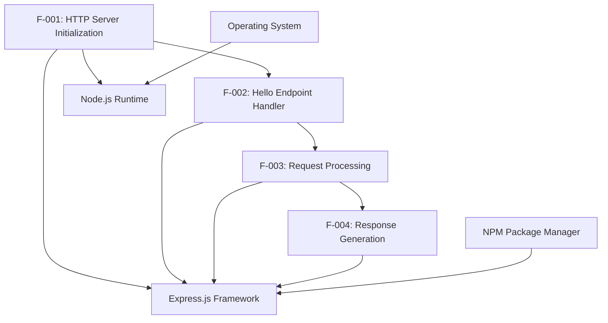
```mermaid
graph TD
    A[F-001: HTTP Server Initialization] --> B[F-002: Hello Endpoint Handler]
    B --> C[F-003: Request Processing]
    C --> D[F-004: Response Generation]
    
    A --> E[Node.js Runtime]
    A --> F[Express.js Framework]
    B --> F
    C --> F
    D --> F
    
    G[NPM Package Manager] --> F
    H[Operating System] --> E
```

### 2.3.2 Integration Points

| Integration Point | Description | Components Involved | Data Flow |
| --- | --- | --- | --- |
| Server-Framework | Express.js integration with Node.js HTTP | F-001, Express.js | Server configuration → Framework initialization |
| Route-Handler | Endpoint registration with Express router | F-002, F-003 | Route definition → Request processing |
| Request-Response | HTTP request/response cycle | F-003, F-004 | Request processing → Response generation |

### 2.3.3 Shared Components

| Component | Used By Features | Purpose | Dependencies |
| --- | --- | --- | --- |
| Express.js Framework | F-001, F-002, F-003, F-004 | Web framework foundation | Express 5.1.0 |
| Node.js Runtime | F-001, F-002, F-003, F-004 | JavaScript execution environment | Node.js 22 LTS |
| HTTP Module | F-001, F-003, F-004 | HTTP protocol handling | Node.js core module |

## 2.4 IMPLEMENTATION CONSIDERATIONS

### 2.4.1 Technical Constraints

| Feature | Constraint Type | Description | Impact |
| --- | --- | --- | --- |
| F-001 | Runtime | Requires Node.js 18 or higher | Must upgrade older Node.js installations |
| F-002 | Framework | Express 5.1.0 is now default on npm | Use latest Express version for optimal performance |
| F-003 | Protocol | HTTP/1.1 compliance required | Must follow HTTP specification |
| F-004 | Encoding | UTF-8 character encoding | Ensure proper text encoding |

### 2.4.2 Performance Requirements

| Feature | Performance Metric | Target Value | Measurement Method |
| --- | --- | --- | --- |
| F-001 | Server Startup Time | \< 1 second | Process timing |
| F-002 | Endpoint Registration | \< 100ms | Framework initialization timing |
| F-003 | Request Processing | \< 10ms | Request handler timing |
| F-004 | Response Generation | \< 5ms | Response creation timing |

### 2.4.3 Scalability Considerations

| Feature | Scalability Aspect | Consideration | Recommendation |
| --- | --- | --- | --- |
| F-001 | Concurrent Connections | Single-threaded Node.js event loop | Suitable for tutorial purposes |
| F-002 | Route Handling | Single endpoint implementation | Minimal resource usage |
| F-003 | Request Volume | Basic request processing | Educational use only |
| F-004 | Response Caching | Static response content | No caching required |

### 2.4.4 Security Implications

| Feature | Security Aspect | Risk Level | Mitigation |
| --- | --- | --- | --- |
| F-001 | Port Binding | Low | Use non-privileged port (3000) |
| F-002 | Route Exposure | Low | Single, safe endpoint |
| F-003 | Input Validation | Low | Express 5 automatic error handling |
| F-004 | Information Disclosure | Minimal | Static, non-sensitive response |

### 2.4.5 Maintenance Requirements

| Feature | Maintenance Type | Frequency | Description |
| --- | --- | --- | --- |
| F-001 | Dependency Updates | Monthly | Node.js v22 Active LTS until October 2025 |
| F-002 | Framework Updates | Quarterly | Express Active version receives updates |
| F-003 | Security Patches | As needed | Apply security updates promptly |
| F-004 | Code Review | Initial only | Educational code requires minimal maintenance |

## 2.5 TRACEABILITY MATRIX

| Business Requirement | Feature ID | Functional Requirement | Test Case | Status |
| --- | --- | --- | --- | --- |
| HTTP Server Creation | F-001 | F-001-RQ-001 to F-001-RQ-004 | TC-001 to TC-004 | Proposed |
| '/hello' Endpoint | F-002 | F-002-RQ-001 to F-002-RQ-004 | TC-005 to TC-008 | Proposed |
| Request Handling | F-003 | F-003-RQ-001 to F-003-RQ-004 | TC-009 to TC-012 | Proposed |
| "Hello world" Response | F-004 | F-004-RQ-001 to F-004-RQ-004 | TC-013 to TC-016 | Proposed |

## 2.6 ASSUMPTIONS AND CONSTRAINTS

### 2.6.1 Technical Assumptions

- Node.js 22 LTS is available and stable for production use
- Express 5.1.0 is the current stable version
- NPM package manager is available for dependency installation
- Target operating systems support Node.js runtime

### 2.6.2 Business Constraints

- Tutorial application scope limited to single endpoint demonstration
- Educational purpose only, not intended for production deployment
- Minimal feature set to maintain learning simplicity
- No database or external service integration required

### 2.6.3 Environmental Constraints

- Development environment must support Node.js 18 or higher
- Network port 3000 must be available for server binding
- Sufficient system resources for Node.js runtime execution
- Internet connectivity required for initial dependency installation

# 3\. TECHNOLOGY STACK

## 3.1 PROGRAMMING LANGUAGES

### 3.1.1 Primary Language Selection

| Component | Language | Version | Justification |
| --- | --- | --- | --- |
| Server Application | JavaScript (Node.js) | ES2022+ | Node.js 22.x is in Active LTS until October 2025, providing stable runtime environment for tutorial application |

#### JavaScript Selection Criteria

**Runtime Environment Compatibility**

- Express 5 requires Node.js 18 or higher, ensuring compatibility with modern JavaScript features
- Production applications should only use Active LTS or Maintenance LTS releases
- Node.js 22.x includes OpenSSL 3.0.x with long-term support until September 2026

**Educational Value**

- Single language consistency reduces learning complexity for tutorial purposes
- JavaScript familiarity enables focus on Node.js server concepts rather than language syntax
- Modern ES6+ features demonstrate current development practices

**Technical Constraints**

- Node.js v22 will remain in Active LTS until October 2025, providing extended support timeline
- No compilation step required, enabling immediate execution and testing
- Built-in HTTP module support eliminates external language dependencies

### 3.1.2 Language Feature Requirements

| Feature Category | Requirement | Implementation |
| --- | --- | --- |
| Module System | ES6 Modules or CommonJS | CommonJS for broader compatibility |
| Async Handling | Promise/async-await support | Native JavaScript async capabilities |
| HTTP Processing | Built-in HTTP module access | Node.js core HTTP module |
| Error Handling | Try-catch and promise rejection handling | Express 5 automatically passes rejected promises to error-handling middleware |

## 3.2 FRAMEWORKS & LIBRARIES

### 3.2.1 Core Web Framework

| Framework | Version | Purpose | Justification |
| --- | --- | --- | --- |
| Express.js | 5.1.0 | Web application framework | Express 5.1.0 is now the default on npm and latest version published 3 months ago |

## Express.js 5.1.0 Selection Rationale

**Version Currency and Support**

- Express 5.1.0 is the default installed version with nearly 17 million weekly downloads
- Express follows LTS strategy with ACTIVE phase lasting minimum 12 months
- Express v5 focuses on simplifying codebase, improving security, and dropping support for older Node.js versions

**Enhanced Error Handling**

- Express 5 automatically forwards rejected promises to error-handling middleware
- Rejected promises are automatically passed to error-handling middleware, simplifying error management
- Eliminates need for manual try-catch blocks in async route handlers

**Security Improvements**

- Express 5 upgrades path-to-regexp library to version 8.x, improving security and mitigating ReDoS attacks
- Includes important security fixes and improvements to prevent ReDoS attacks
- Express 5 no longer supports sub-expressions in regular expressions to avoid ReDoS attacks

**Performance and Maintainability**

- Dropping old Node.js version support enables critical performance and maintainability improvements
- Express.js 5 officially adopts Node.js 18 as minimum supported version
- Improved dependency management and reduced technical debt

### 3.2.2 Supporting Libraries

| Library | Version | Purpose | Dependency Type |
| --- | --- | --- | --- |
| Node.js HTTP Module | Core Module | HTTP server functionality | Built-in |
| Node.js Path Module | Core Module | URL path processing | Built-in |
| Node.js Util Module | Core Module | Utility functions | Built-in |

#### Core Module Dependencies

**HTTP Module**

- Native Node.js HTTP server implementation
- No external dependencies required
- Provides foundational server capabilities for Express.js

**Path Module**

- URL path parsing and manipulation
- Route matching support
- Cross-platform path handling

**Util Module**

- Debugging and logging utilities
- Error formatting and inspection
- Development support functions

### 3.2.3 Framework Compatibility Matrix

| Component | Express 5.1.0 | Node.js 22.x | Compatibility Status |
| --- | --- | --- | --- |
| HTTP Server | ✓ Compatible | ✓ Compatible | Fully Supported |
| Route Handling | ✓ Enhanced | ✓ Compatible | Improved Performance |
| Error Handling | ✓ Automatic | ✓ Compatible | Enhanced Features |
| Security Features | ✓ Improved | ✓ Compatible | Security Hardened |

## 3.3 OPEN SOURCE DEPENDENCIES

### 3.3.1 Direct Dependencies

| Package | Version | Registry | Purpose | License |
| --- | --- | --- | --- | --- |
| express | 5.1.0 | npm | Web framework | MIT |

## Express.js Dependency Analysis

**Package Registry Information**

- Express available via npm with 92,537 other projects using it
- NPM latest version 11.4.2 published 12 days ago
- NPM is the default package manager for Node.js and included in Node.js installer

**Dependency Tree**

- Express 5.1.0 includes updated body-parser dependencies
- Express 5.1.0 includes body-parser@^2.1.0
- Minimal dependency footprint for tutorial application requirements

**Security Considerations**

- NPM registry relies on user reports for package quality and security
- Express.js maintained by established development team with security audit processes
- NPM includes security audit features to identify and fix vulnerabilities

### 3.3.2 Transitive Dependencies

| Package Category | Estimated Count | Management Strategy |
| --- | --- | --- |
| Express Core Dependencies | 15-20 packages | Automatic via npm |
| HTTP Utilities | 5-10 packages | Framework managed |
| Security Libraries | 3-5 packages | Framework managed |

#### Dependency Management Strategy

**Automated Dependency Resolution**

- NPM manages downloads of dependencies automatically
- NPM installs everything in node_modules folder
- NPM adds packages to package.json dependencies automatically since version 5

**Version Management**

- NPM follows semantic versioning (SemVer) standard for compatibility
- Lock file generation ensures consistent installations across environments
- Automatic security updates through npm audit system

### 3.3.3 Package Registry Configuration

| Registry | URL | Purpose | Access Level |
| --- | --- | --- | --- |
| NPM Public Registry | https://registry.npmjs.org | Primary package source | Public |

#### Registry Security and Reliability

**Registry Statistics**

- Over 3.1 million packages available in main npm registry
- NPM has over 1.5 million packages, making it the largest repository of open source libraries
- Relied upon by more than 17 million developers worldwide

**Quality Assurance**

- Community-driven package quality assessment
- Download statistics and dependency metrics for package evaluation
- Established maintenance and security update processes

## 3.4 THIRD-PARTY SERVICES

### 3.4.1 External Service Requirements

Based on the tutorial application requirements, no third-party services are needed for core functionality. The application is designed as a self-contained educational example.

| Service Category | Requirement | Implementation |
| --- | --- | --- |
| Authentication Services | Not Required | Tutorial scope excludes authentication |
| External APIs | Not Required | Single endpoint demonstration only |
| Monitoring Services | Not Required | Educational use case |
| Cloud Services | Not Required | Local development focus |

#### Service Exclusion Rationale

**Educational Simplicity**

- Tutorial application maintains minimal complexity for learning purposes
- Single endpoint design eliminates need for external integrations
- Local development environment sufficient for demonstration

**Self-Contained Architecture**

- No database connectivity required for "Hello world" response
- No user management or session handling needed
- No external API calls or data processing required

### 3.4.2 Optional Development Services

| Service Type | Purpose | Usage Context |
| --- | --- | --- |
| Local Testing Tools | HTTP client testing | Development and validation |
| Code Editors | Development environment | Local development |
| Terminal/Command Line | Application execution | Runtime environment |

## 3.5 DATABASES & STORAGE

### 3.5.1 Data Persistence Requirements

The tutorial application requires no persistent data storage based on its functional requirements.

| Storage Type | Requirement | Justification |
| --- | --- | --- |
| Database | Not Required | Static "Hello world" response |
| File Storage | Not Required | No file upload or processing |
| Session Storage | Not Required | Stateless application design |
| Caching | Not Required | Single static response |

#### Storage Architecture Decision

**Stateless Design**

- Application returns static "Hello world" message
- No user data or application state to persist
- No configuration data requiring storage

**Memory-Only Operation**

- Application configuration stored in memory
- No data persistence between server restarts required
- Minimal resource footprint for educational purposes

### 3.5.2 Runtime Data Management

| Data Type | Storage Location | Lifecycle |
| --- | --- | --- |
| HTTP Request Data | Memory (Request Object) | Per-request |
| HTTP Response Data | Memory (Response Object) | Per-request |
| Server Configuration | Memory (Application Variables) | Application lifetime |

#### Memory Management Strategy

**Request-Response Cycle**

- HTTP request data processed in memory during request handling
- Response data generated and transmitted without persistence
- Automatic garbage collection handles memory cleanup

**Application Configuration**

- Server port and basic configuration stored in application variables
- No external configuration files required
- Environment variables optional for port configuration

## 3.6 DEVELOPMENT & DEPLOYMENT

### 3.6.1 Development Tools

| Tool Category | Tool | Version | Purpose |
| --- | --- | --- | --- |
| Package Manager | npm | 11.4.2 | Dependency management |
| Runtime Environment | Node.js | 22.x LTS | JavaScript execution |
| Code Editor | Any Text Editor | N/A | Code development |

#### Development Environment Requirements

**Node.js Runtime**

- Node.js v22.x Active LTS support until October 2025
- Node.js JavaScript runtime for application execution
- Cross-platform compatibility (Windows, macOS, Linux)

**Package Management**

- NPM 11.4.2 as latest stable version
- NPM updates provide latest features, performance improvements, and security patches
- Integrated with Node.js installation for seamless setup

**Development Workflow**

- Simple text editor sufficient for tutorial code development
- Command line interface for application execution and testing
- No complex build tools or compilation steps required

### 3.6.2 Build System

| Build Component | Requirement | Implementation |
| --- | --- | --- |
| Compilation | Not Required | JavaScript interpreted runtime |
| Bundling | Not Required | Single file application |
| Minification | Not Required | Educational code readability priority |
| Asset Processing | Not Required | No static assets |

#### Build Process Simplification

**No Build Step Required**

- JavaScript executed directly by Node.js runtime
- No transpilation or compilation needed
- Immediate code execution for rapid development and testing

**Development Efficiency**

- Direct file execution: `node app.js`
- No build configuration or setup required
- Minimal barrier to entry for educational purposes

### 3.6.3 Containerization

| Container Aspect | Requirement | Rationale |
| --- | --- | --- |
| Docker | Not Required | Tutorial simplicity priority |
| Container Orchestration | Not Required | Single application instance |
| Container Registry | Not Required | Local development focus |

#### Containerization Decision

**Educational Focus**

- Tutorial application designed for local development and learning
- Container complexity would detract from core Node.js concepts
- Direct Node.js execution provides clearer understanding of runtime behavior

**Deployment Simplicity**

- Local development environment sufficient for tutorial purposes
- No production deployment requirements
- Minimal infrastructure complexity for educational value

### 3.6.4 CI/CD Requirements

| CI/CD Component | Requirement | Educational Context |
| --- | --- | --- |
| Continuous Integration | Not Required | Single-file tutorial application |
| Automated Testing | Not Required | Manual testing sufficient |
| Deployment Pipeline | Not Required | Local execution only |
| Version Control Integration | Optional | Individual learning exercise |

#### CI/CD Scope Limitation

**Tutorial Application Context**

- Educational purpose prioritizes simplicity over production practices
- Manual testing adequate for single endpoint validation
- No automated deployment or integration requirements

**Learning Objectives**

- Focus on Node.js and Express.js fundamentals
- CI/CD concepts outside tutorial scope
- Direct code execution and testing preferred for immediate feedback

### 3.6.5 Technology Stack Integration Diagram

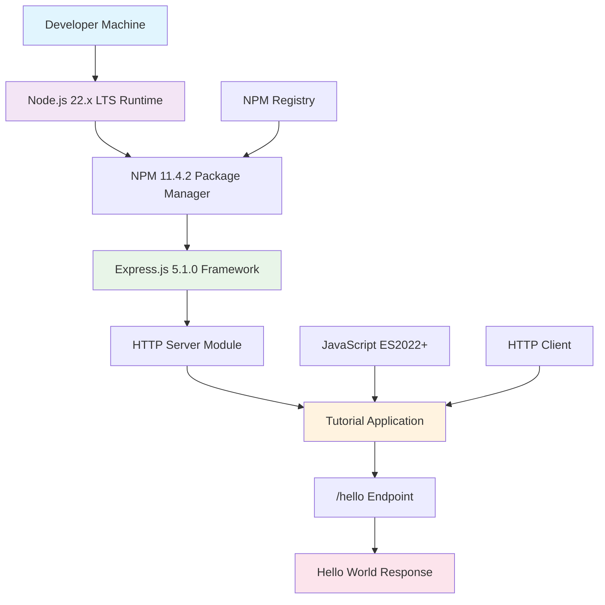
```mermaid
graph TD
    A[Developer Machine] --> B["Node.js 22.x LTS Runtime"]
    B --> C["NPM 11.4.2 Package Manager"]
    C --> D["Express.js 5.1.0 Framework"]
    D --> E["HTTP Server Module"]
    E --> F["Tutorial Application"]
    
    G["NPM Registry"] --> C
    H["JavaScript ES2022+"] --> F
    I["HTTP Client"] --> F
    
    F --> J["/hello Endpoint"]
    J --> K["Hello World Response"]
    
    style A fill:#e1f5fe
    style B fill:#f3e5f5
    style D fill:#e8f5e8
    style F fill:#fff3e0
    style K fill:#fce4ec
```

### 3.6.6 Development Environment Setup

| Setup Step | Command/Action | Verification |
| --- | --- | --- |
| Node.js Installation | Download from nodejs.org | `node --version` |
| NPM Verification | Included with Node.js | `npm --version` |
| Project Initialization | `npm init -y` | package.json created |
| Express Installation | `npm install express` | package.json dependencies |
| Application Execution | `node app.js` | Server startup message |

#### Environment Validation

**Version Compatibility Check**

- Node.js version 18 or higher required for Express 5.x compatibility
- NPM version 7 or higher recommended for modern package management features
- Cross-platform compatibility verification across development environments

**Dependency Resolution**

- Automatic Express.js and transitive dependency installation
- Package-lock.json generation for consistent dependency versions
- Node_modules folder creation with all required packages

# 4\. PROCESS FLOWCHART

## 4.1 SYSTEM WORKFLOWS

### 4.1.1 Core Business Processes

#### Primary User Journey: Hello World Request Processing

The tutorial application implements a single core business process: handling HTTP GET requests to the '/hello' endpoint and returning a "Hello world" response. This process demonstrates fundamental Node.js server concepts while maintaining educational simplicity.

**End-to-End User Journey**

The complete user journey encompasses four distinct phases: application initialization, request reception, request processing, and response delivery. Each phase includes specific validation points and error handling mechanisms to ensure robust operation.

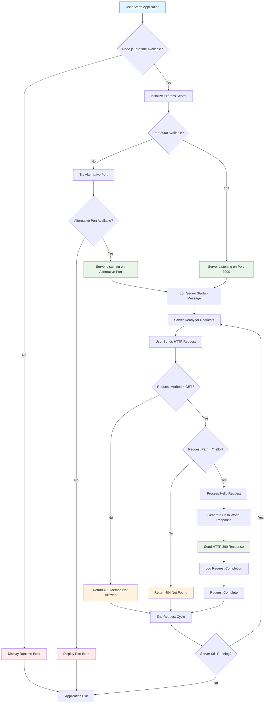
```mermaid
flowchart TD
    A[User Starts Application] --> B{Node.js Runtime Available?}
    B -->|No| C[Display Runtime Error]
    B -->|Yes| D[Initialize Express Server]
    D --> E{Port 3000 Available?}
    E -->|No| F[Try Alternative Port]
    E -->|Yes| G[Server Listening on Port 3000]
    F --> H{Alternative Port Available?}
    H -->|No| I[Display Port Error]
    H -->|Yes| J[Server Listening on Alternative Port]
    G --> K[Log Server Startup Message]
    J --> K
    K --> L[Server Ready for Requests]
    
    L --> M[User Sends HTTP Request]
    M --> N{Request Method = GET?}
    N -->|No| O[Return 405 Method Not Allowed]
    N -->|Yes| P{Request Path = '/hello'?}
    P -->|No| Q[Return 404 Not Found]
    P -->|Yes| R[Process Hello Request]
    R --> S[Generate Hello World Response]
    S --> T[Send HTTP 200 Response]
    T --> U[Log Request Completion]
    U --> V[Request Complete]
    
    C --> W[Application Exit]
    I --> W
    O --> X[End Request Cycle]
    Q --> X
    V --> X
    X --> Y{Server Still Running?}
    Y -->|Yes| L
    Y -->|No| W
    
    style A fill:#e1f5fe
    style G fill:#e8f5e8
    style J fill:#e8f5e8
    style T fill:#e8f5e8
    style C fill:#ffebee
    style I fill:#ffebee
    style O fill:#fff3e0
    style Q fill:#fff3e0
```

**System Interactions and Decision Points**

Node.js 18 or higher is required for Express.js 5.1.0 compatibility, establishing the first critical decision point in the application lifecycle. The system validates runtime availability before proceeding with server initialization.

Port binding represents the second major decision point, where the application attempts to bind to the default port 3000. Production applications should only use Active LTS or Maintenance LTS releases, ensuring the runtime environment meets production-grade stability requirements.

**Error Handling Paths**

The application implements comprehensive error handling at each decision point:

| Error Type | Trigger Condition | Response Action | Recovery Path |
| --- | --- | --- | --- |
| Runtime Error | Node.js version \< 18 | Display version requirement message | Application termination |
| Port Binding Error | Port 3000 unavailable | Attempt alternative port binding | Graceful fallback or termination |
| Method Error | Non-GET request to '/hello' | Return HTTP 405 status | Continue serving other requests |
| Path Error | GET request to invalid path | Return HTTP 404 status | Continue serving other requests |

#### Request Processing Workflow

The focus of this release is on dropping old Node.js version support, addressing security concerns, and simplifying maintenance, which directly impacts the request processing workflow through improved error handling and security features.

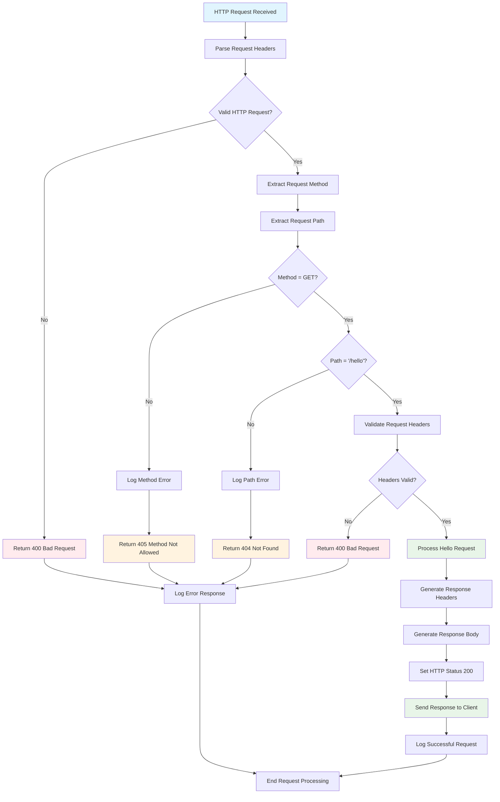
```mermaid
flowchart TD
    A[HTTP Request Received] --> B[Parse Request Headers]
    B --> C{Valid HTTP Request?}
    C -->|No| D[Return 400 Bad Request]
    C -->|Yes| E[Extract Request Method]
    E --> F[Extract Request Path]
    F --> G{Method = GET?}
    G -->|No| H[Log Method Error]
    G -->|Yes| I{Path = '/hello'?}
    I -->|No| J[Log Path Error]
    I -->|Yes| K[Validate Request Headers]
    K --> L{Headers Valid?}
    L -->|No| M[Return 400 Bad Request]
    L -->|Yes| N[Process Hello Request]
    N --> O[Generate Response Headers]
    O --> P[Generate Response Body]
    P --> Q[Set HTTP Status 200]
    Q --> R[Send Response to Client]
    R --> S[Log Successful Request]
    
    H --> T[Return 405 Method Not Allowed]
    J --> U[Return 404 Not Found]
    T --> V[Log Error Response]
    U --> V
    D --> V
    M --> V
    V --> W[End Request Processing]
    S --> W
    
    style A fill:#e1f5fe
    style N fill:#e8f5e8
    style R fill:#e8f5e8
    style D fill:#ffebee
    style M fill:#ffebee
    style T fill:#fff3e0
    style U fill:#fff3e0
```

### 4.1.2 Integration Workflows

## Express.js Framework Integration

Latest version: 5.1.0, last published: 3 months ago. There are 92647 other projects in the npm registry using express, demonstrating the framework's stability and widespread adoption for the tutorial application.

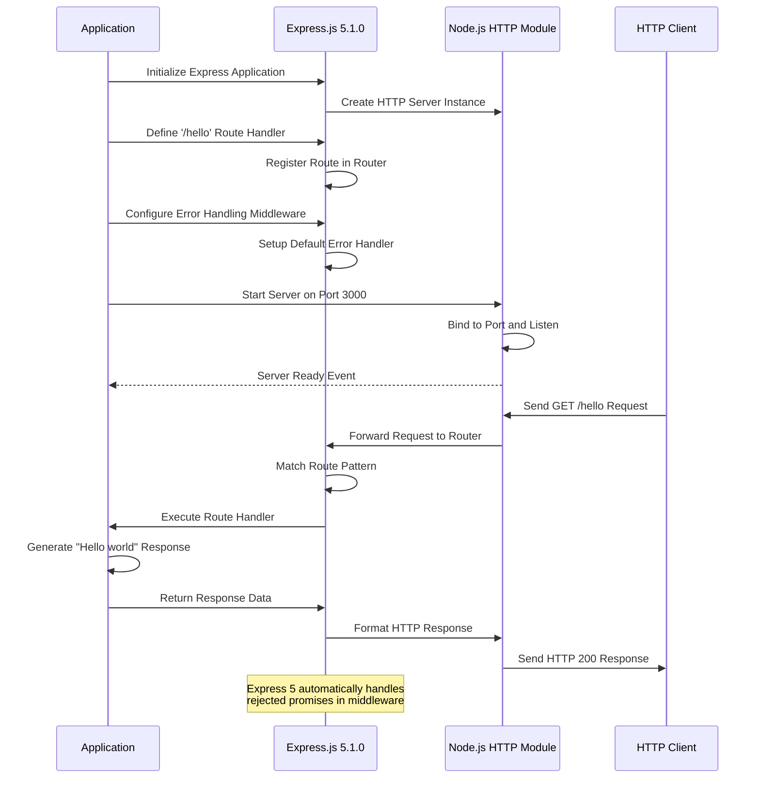
```mermaid
sequenceDiagram
    participant App as Application
    participant Express as Express.js 5.1.0
    participant HTTP as Node.js HTTP Module
    participant Client as HTTP Client
    
    App->>Express: Initialize Express Application
    Express->>HTTP: Create HTTP Server Instance
    App->>Express: Define '/hello' Route Handler
    Express->>Express: Register Route in Router
    App->>Express: Configure Error Handling Middleware
    Express->>Express: Setup Default Error Handler
    App->>HTTP: Start Server on Port 3000
    HTTP->>HTTP: Bind to Port and Listen
    HTTP-->>App: Server Ready Event
    
    Client->>HTTP: Send GET /hello Request
    HTTP->>Express: Forward Request to Router
    Express->>Express: Match Route Pattern
    Express->>App: Execute Route Handler
    App->>App: Generate "Hello world" Response
    App->>Express: Return Response Data
    Express->>HTTP: Format HTTP Response
    HTTP->>Client: Send HTTP 200 Response
    
    Note over Express: Express 5 automatically handles<br/>rejected promises in middleware
```

#### NPM Package Management Integration

The application integrates with the NPM ecosystem for dependency management and installation. If this is a brand new project, make sure to create a package.json first with the npm init command. Installation is done using the npm install command.

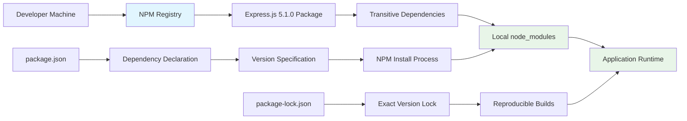
```mermaid
flowchart LR
    A[Developer Machine] --> B[NPM Registry]
    B --> C[Express.js 5.1.0 Package]
    C --> D[Transitive Dependencies]
    D --> E[Local node_modules]
    E --> F[Application Runtime]
    
    G[package.json] --> H[Dependency Declaration]
    H --> I[Version Specification]
    I --> J[NPM Install Process]
    J --> E
    
    K[package-lock.json] --> L[Exact Version Lock]
    L --> M[Reproducible Builds]
    M --> F
    
    style B fill:#e1f5fe
    style E fill:#e8f5e8
    style F fill:#e8f5e8
```

#### Event Processing Flows

Node.js event-driven architecture processes HTTP requests through the event loop mechanism. The tutorial application leverages this architecture for efficient request handling.

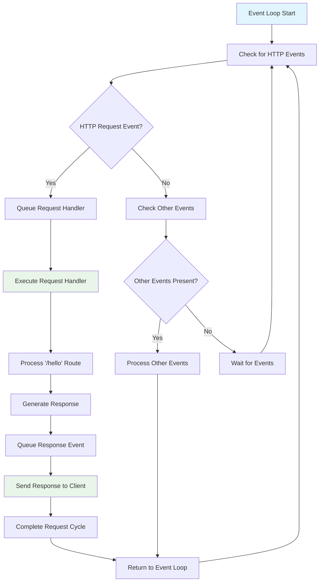
```mermaid
flowchart TD
    A[Event Loop Start] --> B[Check for HTTP Events]
    B --> C{HTTP Request Event?}
    C -->|No| D[Check Other Events]
    C -->|Yes| E[Queue Request Handler]
    E --> F[Execute Request Handler]
    F --> G[Process '/hello' Route]
    G --> H[Generate Response]
    H --> I[Queue Response Event]
    I --> J[Send Response to Client]
    J --> K[Complete Request Cycle]
    K --> L[Return to Event Loop]
    L --> B
    
    D --> M{Other Events Present?}
    M -->|Yes| N[Process Other Events]
    M -->|No| O[Wait for Events]
    N --> L
    O --> B
    
    style A fill:#e1f5fe
    style F fill:#e8f5e8
    style J fill:#e8f5e8
```

## 4.2 FLOWCHART REQUIREMENTS

### 4.2.1 Start and End Points

Each workflow diagram clearly defines entry and exit points to establish system boundaries and process scope.

**Application Lifecycle Start Points:**

- User initiates application startup
- HTTP client sends request to server
- System error occurs requiring handling
- Server shutdown process begins

**Application Lifecycle End Points:**

- Successful server initialization complete
- HTTP response delivered to client
- Error response sent with appropriate status code
- Application graceful shutdown complete

### 4.2.2 Process Steps and Decision Diamonds

All process flows include explicit decision points with binary outcomes and clear branching logic.

**Critical Decision Points:**

| Decision Point | Condition | True Path | False Path |
| --- | --- | --- | --- |
| Runtime Check | Node.js ≥ 18 available | Continue initialization | Display error and exit |
| Port Availability | Port 3000 free | Bind to port 3000 | Try alternative port |
| HTTP Method | Request method = GET | Process request | Return 405 error |
| URL Path | Request path = '/hello' | Execute handler | Return 404 error |
| Request Validity | Valid HTTP format | Process normally | Return 400 error |

### 4.2.3 System Boundaries and User Touchpoints

The tutorial application operates within defined system boundaries that separate internal processing from external interactions.

**System Boundary Definition:**

- **Internal**: Express.js application, route handlers, response generation
- **External**: HTTP clients, Node.js runtime, operating system, network layer

**User Touchpoints:**

- Command line application startup
- HTTP request submission via browser/client
- Response reception and display
- Error message observation
- Application termination

### 4.2.4 Timing and SLA Considerations

Performance requirements establish timing constraints for each process step.

| Process Step | Target Duration | SLA Requirement | Measurement Method |
| --- | --- | --- | --- |
| Server Startup | \< 1 second | Must meet | Process timing |
| Request Processing | \< 100ms | Should meet | Response time measurement |
| Response Generation | \< 5ms | Should meet | Handler execution timing |
| Error Handling | \< 50ms | Should meet | Error response timing |

### 4.2.5 Validation Rules

**Business Rules at Each Step:**

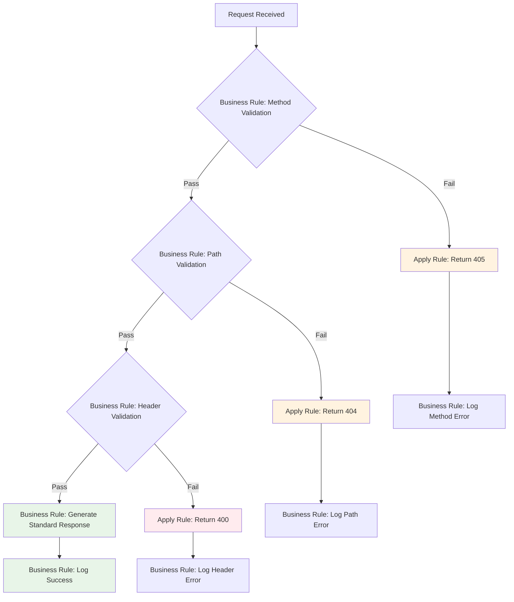
```mermaid
flowchart TD
    A[Request Received] --> B{Business Rule: Method Validation}
    B -->|Pass| C{Business Rule: Path Validation}
    B -->|Fail| D[Apply Rule: Return 405]
    C -->|Pass| E{Business Rule: Header Validation}
    C -->|Fail| F[Apply Rule: Return 404]
    E -->|Pass| G[Business Rule: Generate Standard Response]
    E -->|Fail| H[Apply Rule: Return 400]
    G --> I[Business Rule: Log Success]
    D --> J[Business Rule: Log Method Error]
    F --> K[Business Rule: Log Path Error]
    H --> L[Business Rule: Log Header Error]
    
    style G fill:#e8f5e8
    style I fill:#e8f5e8
    style D fill:#fff3e0
    style F fill:#fff3e0
    style H fill:#ffebee
```

**Data Validation Requirements:**

- HTTP request format compliance
- Method type validation (GET only)
- Path string exact match ('/hello')
- Header format validation
- Response encoding validation (UTF-8)

**Authorization Checkpoints:**
The tutorial application implements no authorization requirements, maintaining educational simplicity while demonstrating basic HTTP server concepts.

**Regulatory Compliance Checks:**

- HTTP/1.1 protocol compliance
- Standard HTTP status code usage
- Proper Content-Type header setting
- UTF-8 character encoding compliance

## 4.3 TECHNICAL IMPLEMENTATION

### 4.3.1 State Management

#### State Transitions

The tutorial application maintains minimal state, transitioning through well-defined phases during its lifecycle.

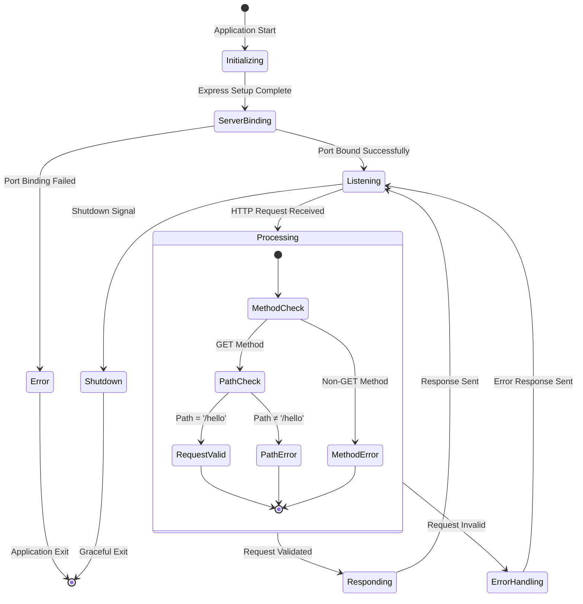
```mermaid
stateDiagram-v2
    [*] --> Initializing: Application Start
    Initializing --> ServerBinding: Express Setup Complete
    ServerBinding --> Listening: Port Bound Successfully
    ServerBinding --> Error: Port Binding Failed
    Listening --> Processing: HTTP Request Received
    Processing --> Responding: Request Validated
    Processing --> ErrorHandling: Request Invalid
    Responding --> Listening: Response Sent
    ErrorHandling --> Listening: Error Response Sent
    Listening --> Shutdown: Shutdown Signal
    Error --> [*]: Application Exit
    Shutdown --> [*]: Graceful Exit
    
    state Processing {
        [*] --> MethodCheck
        MethodCheck --> PathCheck: GET Method
        MethodCheck --> MethodError: Non-GET Method
        PathCheck --> RequestValid: Path = '/hello'
        PathCheck --> PathError: Path ≠ '/hello'
        RequestValid --> [*]
        MethodError --> [*]
        PathError --> [*]
    }
```

#### Data Persistence Points

The tutorial application operates as a stateless service with no persistent data requirements.

| Data Type | Persistence Level | Storage Duration | Storage Location |
| --- | --- | --- | --- |
| HTTP Request Data | Memory Only | Request Duration | Request Object |
| HTTP Response Data | Memory Only | Response Duration | Response Object |
| Server Configuration | Memory Only | Application Lifetime | Application Variables |
| Error Information | Memory Only | Error Duration | Error Objects |
| Log Messages | Optional | Configurable | Console/Log Files |

#### Caching Requirements

No caching mechanisms are required for the tutorial application due to its static response nature and educational focus.

**Caching Decision Rationale:**

- Static "Hello world" response requires no caching
- Single endpoint eliminates cache key complexity
- Educational simplicity prioritized over performance optimization
- Memory footprint minimization for tutorial purposes

#### Transaction Boundaries

If you call next() with an error after you have started writing the response (for example, if you encounter an error while streaming the response to the client), the Express default error handler closes the connection and fails the request.

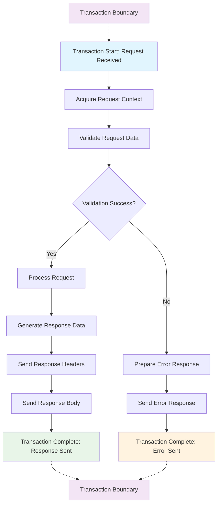
```mermaid
flowchart TD
    A[Transaction Start: Request Received] --> B[Acquire Request Context]
    B --> C[Validate Request Data]
    C --> D{Validation Success?}
    D -->|Yes| E[Process Request]
    D -->|No| F[Prepare Error Response]
    E --> G[Generate Response Data]
    G --> H[Send Response Headers]
    H --> I[Send Response Body]
    I --> J[Transaction Complete: Response Sent]
    F --> K[Send Error Response]
    K --> L[Transaction Complete: Error Sent]
    
    M[Transaction Boundary] -.-> A
    J -.-> N[Transaction Boundary]
    L -.-> N
    
    style A fill:#e1f5fe
    style J fill:#e8f5e8
    style L fill:#fff3e0
    style M fill:#f3e5f5
    style N fill:#f3e5f5
```

### 4.3.2 Error Handling

#### Retry Mechanisms

Central Error-Handling Middleware Use a central error-handling middleware to catch and handle errors in your application. This middleware can catch errors not handled by other middleware or routes and provide a consistent way of handling errors throughout your application.

The tutorial application implements basic retry mechanisms for port binding failures but maintains simplicity for educational purposes.

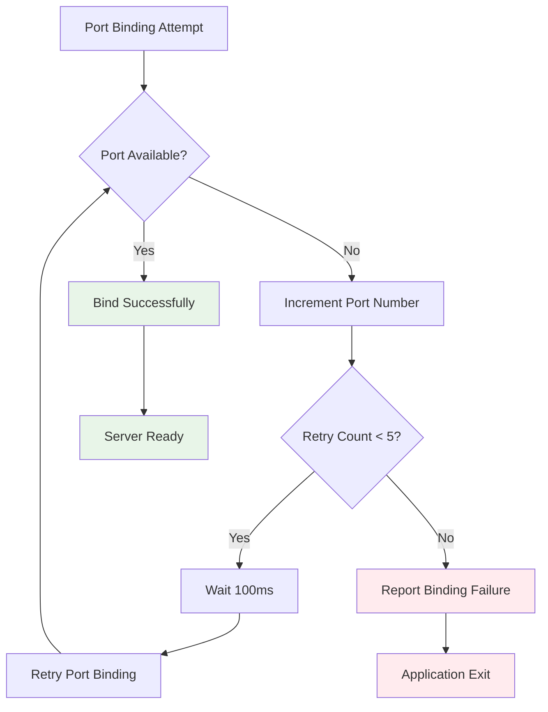
```mermaid
flowchart TD
    A[Port Binding Attempt] --> B{Port Available?}
    B -->|Yes| C[Bind Successfully]
    B -->|No| D[Increment Port Number]
    D --> E{Retry Count < 5?}
    E -->|Yes| F[Wait 100ms]
    E -->|No| G[Report Binding Failure]
    F --> H[Retry Port Binding]
    H --> B
    C --> I[Server Ready]
    G --> J[Application Exit]
    
    style C fill:#e8f5e8
    style I fill:#e8f5e8
    style G fill:#ffebee
    style J fill:#ffebee
```

#### Fallback Processes

The application implements graceful degradation through fallback mechanisms that maintain service availability when possible.

| Error Scenario | Primary Action | Fallback Action | Final Fallback |
| --- | --- | --- | --- |
| Port 3000 Unavailable | Try Port 3001 | Try Ports 3002-3005 | Display Error and Exit |
| Invalid HTTP Method | Return 405 Status | Log Error | Continue Serving |
| Invalid URL Path | Return 404 Status | Log Error | Continue Serving |
| Malformed Request | Return 400 Status | Log Error | Continue Serving |

#### Error Notification Flows

Appropriate HTTP Status Codes Use appropriate HTTP status codes when returning errors from an API. For example, use a 404 status code for a resource not found an error or a 500 status code for a server-side error. This can help clients understand what type of error occurred and respond appropriately.

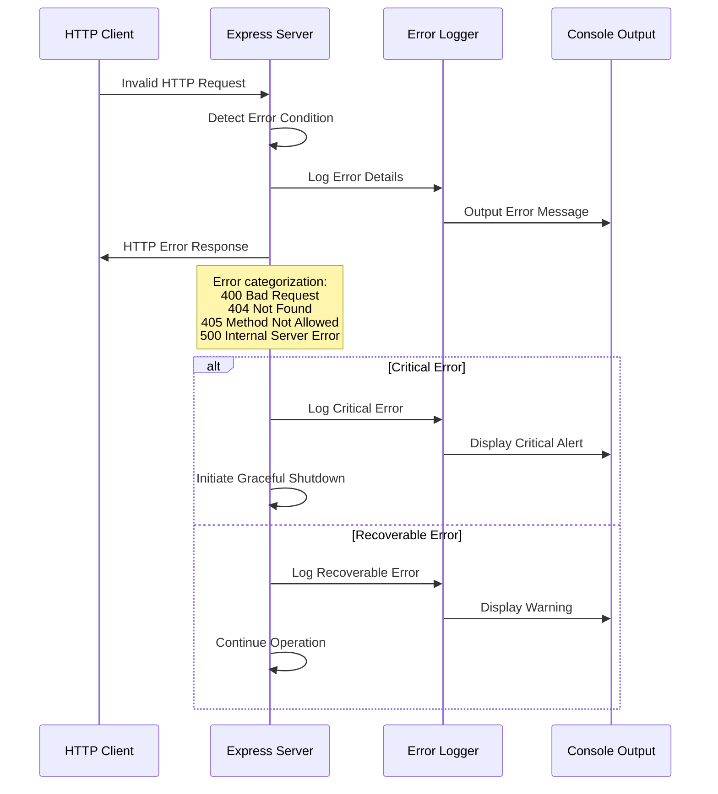
```mermaid
sequenceDiagram
    participant Client as HTTP Client
    participant Server as Express Server
    participant Logger as Error Logger
    participant Console as Console Output
    
    Client->>Server: Invalid HTTP Request
    Server->>Server: Detect Error Condition
    Server->>Logger: Log Error Details
    Logger->>Console: Output Error Message
    Server->>Client: HTTP Error Response
    
    Note over Server: Error categorization:<br/>400 Bad Request<br/>404 Not Found<br/>405 Method Not Allowed<br/>500 Internal Server Error
    
    alt Critical Error
        Server->>Logger: Log Critical Error
        Logger->>Console: Display Critical Alert
        Server->>Server: Initiate Graceful Shutdown
    else Recoverable Error
        Server->>Logger: Log Recoverable Error
        Logger->>Console: Display Warning
        Server->>Server: Continue Operation
    end
```

#### Recovery Procedures

The tutorial application implements automatic recovery procedures for non-critical errors while maintaining service availability.

**Recovery Procedure Categories:**

1. **Immediate Recovery**: Automatic error response generation and request completion
2. **Graceful Degradation**: Service continuation with error logging
3. **Controlled Shutdown**: Graceful application termination for critical errors

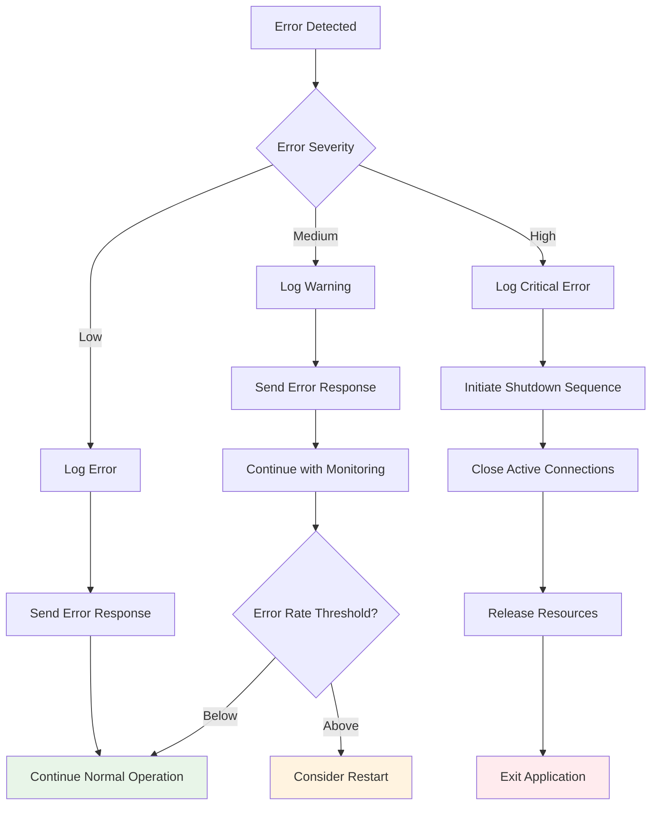
```mermaid
flowchart TD
    A[Error Detected] --> B{Error Severity}
    B -->|Low| C[Log Error]
    B -->|Medium| D[Log Warning]
    B -->|High| E[Log Critical Error]
    
    C --> F[Send Error Response]
    D --> G[Send Error Response]
    E --> H[Initiate Shutdown Sequence]
    
    F --> I[Continue Normal Operation]
    G --> J[Continue with Monitoring]
    H --> K[Close Active Connections]
    
    J --> L{Error Rate Threshold?}
    L -->|Below| I
    L -->|Above| M[Consider Restart]
    
    K --> N[Release Resources]
    N --> O[Exit Application]
    
    style I fill:#e8f5e8
    style O fill:#ffebee
    style M fill:#fff3e0
```

## 4.4 REQUIRED DIAGRAMS

### 4.4.1 High-Level System Workflow

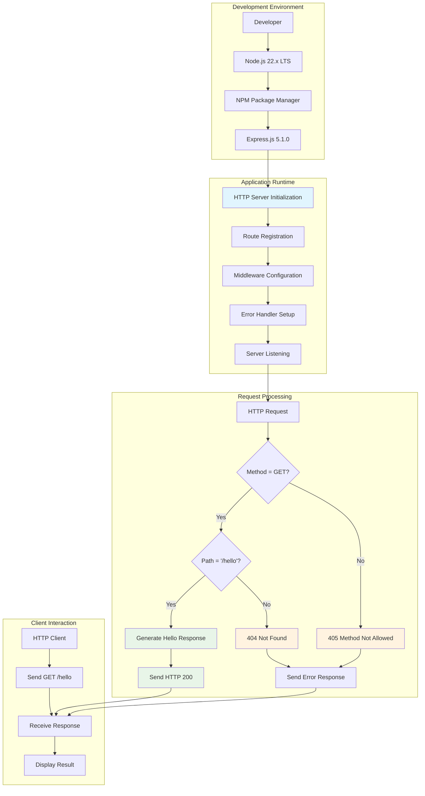
```mermaid
flowchart TB
    subgraph "Development Environment"
        A[Developer] --> B[Node.js 22.x LTS]
        B --> C[NPM Package Manager]
        C --> D[Express.js 5.1.0]
    end
    
    subgraph "Application Runtime"
        E[HTTP Server Initialization] --> F[Route Registration]
        F --> G[Middleware Configuration]
        G --> H[Error Handler Setup]
        H --> I[Server Listening]
    end
    
    subgraph "Request Processing"
        J[HTTP Request] --> K{Method = GET?}
        K -->|Yes| L{Path = '/hello'?}
        K -->|No| M[405 Method Not Allowed]
        L -->|Yes| N[Generate Hello Response]
        L -->|No| O[404 Not Found]
        N --> P[Send HTTP 200]
        M --> Q[Send Error Response]
        O --> Q
    end
    
    subgraph "Client Interaction"
        R[HTTP Client] --> S[Send GET /hello]
        S --> T[Receive Response]
        T --> U[Display Result]
    end
    
    D --> E
    I --> J
    P --> T
    Q --> T
    
    style E fill:#e1f5fe
    style N fill:#e8f5e8
    style P fill:#e8f5e8
    style M fill:#fff3e0
    style O fill:#fff3e0
```

### 4.4.2 Detailed Process Flows for Core Features

#### Server Initialization Process Flow

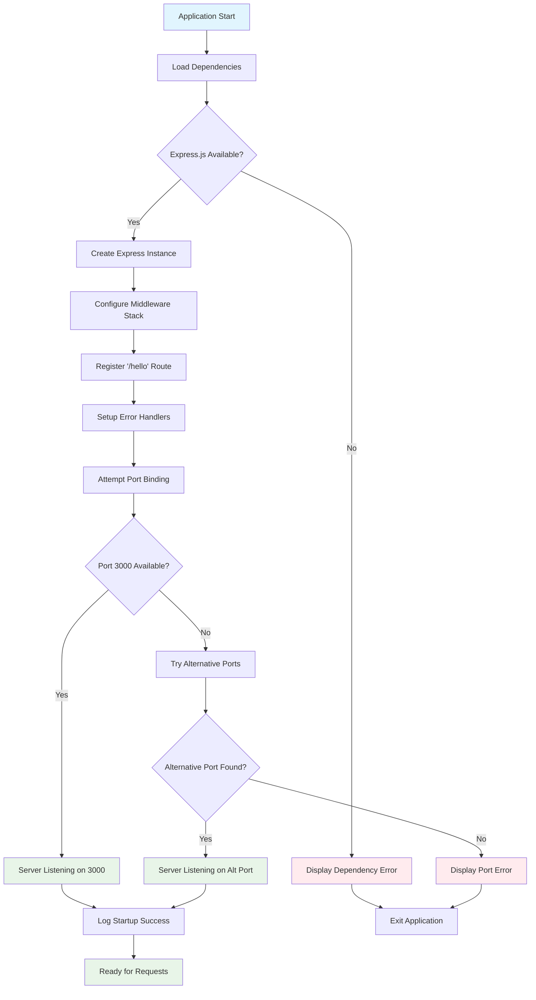
```mermaid
flowchart TD
    A[Application Start] --> B[Load Dependencies]
    B --> C{Express.js Available?}
    C -->|No| D[Display Dependency Error]
    C -->|Yes| E[Create Express Instance]
    E --> F[Configure Middleware Stack]
    F --> G[Register '/hello' Route]
    G --> H[Setup Error Handlers]
    H --> I[Attempt Port Binding]
    I --> J{Port 3000 Available?}
    J -->|Yes| K[Server Listening on 3000]
    J -->|No| L[Try Alternative Ports]
    L --> M{Alternative Port Found?}
    M -->|Yes| N[Server Listening on Alt Port]
    M -->|No| O[Display Port Error]
    K --> P[Log Startup Success]
    N --> P
    P --> Q[Ready for Requests]
    
    D --> R[Exit Application]
    O --> R
    
    style A fill:#e1f5fe
    style K fill:#e8f5e8
    style N fill:#e8f5e8
    style Q fill:#e8f5e8
    style D fill:#ffebee
    style O fill:#ffebee
```

#### Hello Endpoint Processing Flow

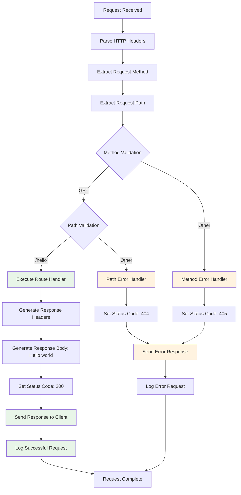
```mermaid
flowchart TD
A[Request Received] --> B[Parse HTTP Headers]
B --> C[Extract Request Method]
C --> D[Extract Request Path]
D --> E{Method Validation}
E -->|GET| F{Path Validation}
E -->|Other| G[Method Error Handler]
F -->|'/hello'| H[Execute Route Handler]
F -->|Other| I[Path Error Handler]
H --> J[Generate Response Headers]
J --> K["Generate Response Body: Hello world"]
K --> L[Set Status Code: 200]
L --> M[Send Response to Client]
M --> N[Log Successful Request]

G --> O[Set Status Code: 405]
I --> P[Set Status Code: 404]
O --> Q[Send Error Response]
P --> Q
Q --> R[Log Error Request]

N --> S[Request Complete]
R --> S

style H fill:#e8f5e8
style M fill:#e8f5e8
style N fill:#e8f5e8
style G fill:#fff3e0
style I fill:#fff3e0
style Q fill:#fff3e0
```

### 4.4.3 Error Handling Flowcharts

#### Comprehensive Error Handling Flow

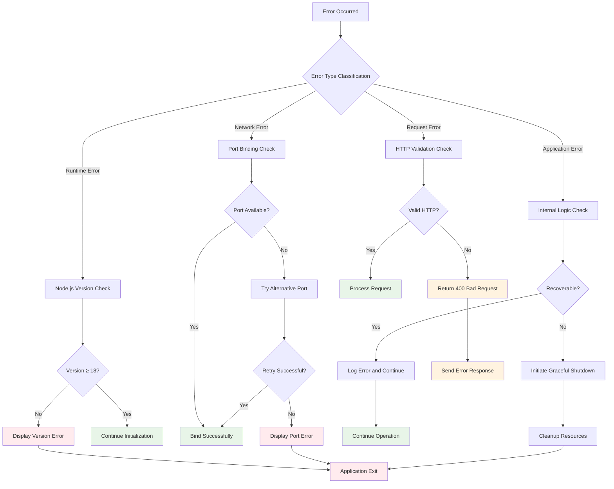
```mermaid
flowchart TD
    A[Error Occurred] --> B{Error Type Classification}
    
    B -->|Runtime Error| C[Node.js Version Check]
    B -->|Network Error| D[Port Binding Check]
    B -->|Request Error| E[HTTP Validation Check]
    B -->|Application Error| F[Internal Logic Check]
    
    C --> G{Version ≥ 18?}
    G -->|No| H[Display Version Error]
    G -->|Yes| I[Continue Initialization]
    
    D --> J{Port Available?}
    J -->|No| K[Try Alternative Port]
    J -->|Yes| L[Bind Successfully]
    
    E --> M{Valid HTTP?}
    M -->|No| N[Return 400 Bad Request]
    M -->|Yes| O[Process Request]
    
    F --> P{Recoverable?}
    P -->|Yes| Q[Log Error and Continue]
    P -->|No| R[Initiate Graceful Shutdown]
    
    H --> S[Application Exit]
    K --> T{Retry Successful?}
    T -->|Yes| L
    T -->|No| U[Display Port Error]
    U --> S
    
    N --> V[Send Error Response]
    Q --> W[Continue Operation]
    R --> X[Cleanup Resources]
    X --> S
    
    style I fill:#e8f5e8
    style L fill:#e8f5e8
    style O fill:#e8f5e8
    style W fill:#e8f5e8
    style H fill:#ffebee
    style U fill:#ffebee
    style S fill:#ffebee
    style N fill:#fff3e0
    style V fill:#fff3e0
```

### 4.4.4 Integration Sequence Diagrams

## Express.js Integration Sequence

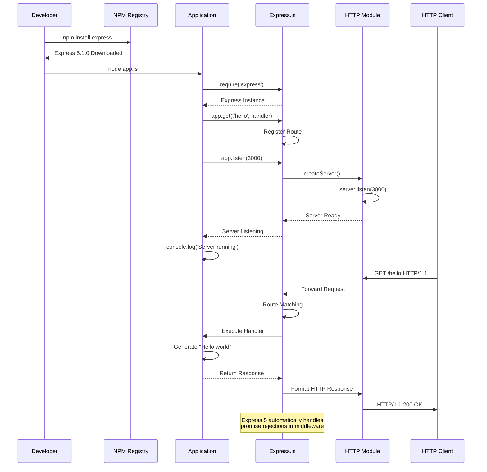
```mermaid
sequenceDiagram
    participant Dev as Developer
    participant NPM as NPM Registry
    participant App as Application
    participant Express as Express.js
    participant HTTP as HTTP Module
    participant Client as HTTP Client
    
    Dev->>NPM: npm install express
    NPM-->>Dev: Express 5.1.0 Downloaded
    Dev->>App: node app.js
    App->>Express: require('express')
    Express-->>App: Express Instance
    App->>Express: app.get('/hello', handler)
    Express->>Express: Register Route
    App->>Express: app.listen(3000)
    Express->>HTTP: createServer()
    HTTP->>HTTP: server.listen(3000)
    HTTP-->>Express: Server Ready
    Express-->>App: Server Listening
    App->>App: console.log('Server running')
    
    Client->>HTTP: GET /hello HTTP/1.1
    HTTP->>Express: Forward Request
    Express->>Express: Route Matching
    Express->>App: Execute Handler
    App->>App: Generate "Hello world"
    App-->>Express: Return Response
    Express->>HTTP: Format HTTP Response
    HTTP->>Client: HTTP/1.1 200 OK
    
    Note over Express: Express 5 automatically handles<br/>promise rejections in middleware
```

### 4.4.5 State Transition Diagrams

#### Application State Transitions

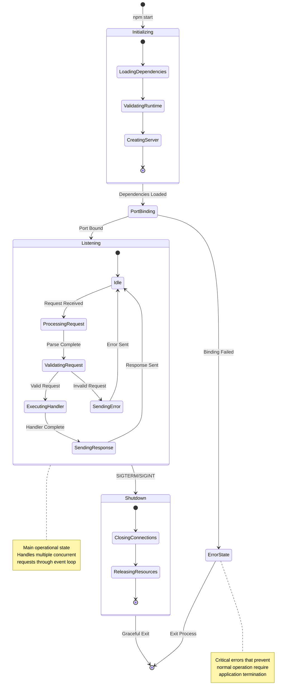
```mermaid
stateDiagram-v2
    [*] --> Initializing: npm start
    
    state Initializing {
        [*] --> LoadingDependencies
        LoadingDependencies --> ValidatingRuntime
        ValidatingRuntime --> CreatingServer
        CreatingServer --> [*]
    }
    
    Initializing --> PortBinding: Dependencies Loaded
    PortBinding --> Listening: Port Bound
    PortBinding --> ErrorState: Binding Failed
    
    state Listening {
        [*] --> Idle
        Idle --> ProcessingRequest: Request Received
        ProcessingRequest --> ValidatingRequest: Parse Complete
        ValidatingRequest --> ExecutingHandler: Valid Request
        ValidatingRequest --> SendingError: Invalid Request
        ExecutingHandler --> SendingResponse: Handler Complete
        SendingResponse --> Idle: Response Sent
        SendingError --> Idle: Error Sent
    }
    
    Listening --> Shutdown: SIGTERM/SIGINT
    ErrorState --> [*]: Exit Process
    
    state Shutdown {
        [*] --> ClosingConnections
        ClosingConnections --> ReleasingResources
        ReleasingResources --> [*]
    }
    
    Shutdown --> [*]: Graceful Exit
    
    note right of Listening
        Main operational state
        Handles multiple concurrent
        requests through event loop
    end note
    
    note right of ErrorState
        Critical errors that prevent
        normal operation require
        application termination
    end note
```

#### Request Processing State Machine

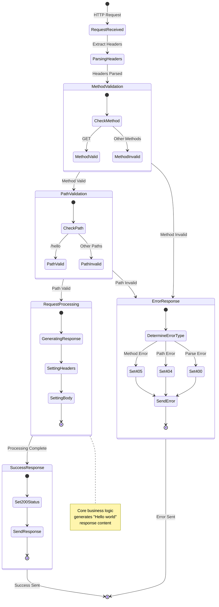
```mermaid
stateDiagram-v2
    [*] --> RequestReceived: HTTP Request
    
    RequestReceived --> ParsingHeaders: Extract Headers
    ParsingHeaders --> MethodValidation: Headers Parsed
    
    state MethodValidation {
        [*] --> CheckMethod
        CheckMethod --> MethodValid: GET
        CheckMethod --> MethodInvalid: Other Methods
    }
    
    MethodValidation --> PathValidation: Method Valid
    MethodValidation --> ErrorResponse: Method Invalid
    
    state PathValidation {
        [*] --> CheckPath
        CheckPath --> PathValid: /hello
        CheckPath --> PathInvalid: Other Paths
    }
    
    PathValidation --> RequestProcessing: Path Valid
    PathValidation --> ErrorResponse: Path Invalid
    
    state RequestProcessing {
        [*] --> GeneratingResponse
        GeneratingResponse --> SettingHeaders
        SettingHeaders --> SettingBody
        SettingBody --> [*]
    }
    
    RequestProcessing --> SuccessResponse: Processing Complete
    
    state ErrorResponse {
        [*] --> DetermineErrorType
        DetermineErrorType --> Set405: Method Error
        DetermineErrorType --> Set404: Path Error
        DetermineErrorType --> Set400: Parse Error
        Set405 --> SendError
        Set404 --> SendError
        Set400 --> SendError
        SendError --> [*]
    }
    
    state SuccessResponse {
        [*] --> Set200Status
        Set200Status --> SendResponse
        SendResponse --> [*]
    }
    
    ErrorResponse --> [*]: Error Sent
    SuccessResponse --> [*]: Success Sent
    
    note right of RequestProcessing
        Core business logic
        generates "Hello world"
        response content
    end note
```

# 5\. SYSTEM ARCHITECTURE

## 5.1 HIGH-LEVEL ARCHITECTURE

### 5.1.1 System Overview

The tutorial application implements a **single-threaded, event-driven architecture** that leverages Node.js 22.x Long Term Support (LTS) with the codename 'Jod', which moves into "Active LTS" and will remain so until October 2025. This architectural approach aligns with Node.js's core reliance on a single-threaded event loop, which efficiently manages asynchronous operations and represents the fundamental design pattern for modern JavaScript server applications.

The system follows a **minimalist web server architecture** built on Express 5.1.0, which is now the default on npm, providing a lightweight yet robust foundation for HTTP request processing. The architecture emphasizes educational clarity while maintaining production-grade patterns, demonstrating core Node.js concepts through a simplified but complete implementation.

**Architectural Style Rationale**

The tutorial application adopts an **event-driven, non-blocking I/O architecture** that exemplifies Node.js's core strengths. Node.js is a single-threaded, non-blocking, event-driven architecture that enables efficient handling of concurrent operations, making it ideal for I/O-intensive applications like web servers. This design choice prioritizes:

- **Educational Transparency**: Single-threaded model eliminates complex concurrency concerns
- **Resource Efficiency**: Lightweight and fast single-threaded architecture reduces overhead while enabling efficient I/O handling for multiple concurrent tasks
- **Scalability Foundation**: Event-driven pattern provides scalable foundation for future enhancements
- **Industry Alignment**: Follows established Node.js ecosystem patterns and best practices

**Key Architectural Principles**

The system architecture adheres to several fundamental principles that ensure maintainability, performance, and educational value:

1. **Separation of Concerns**: Clear distinction between HTTP handling, request processing, and response generation
2. **Event-Driven Processing**: The Event Loop is the engine that powers Node.js's event-driven architecture as a single-threaded, non-blocking loop that continuously checks for events and dispatches them for handling
3. **Minimal Complexity**: Educational focus maintains simplicity while demonstrating core concepts
4. **Standards Compliance**: HTTP/1.1 protocol adherence and RESTful design principles

**System Boundaries and Major Interfaces**

The tutorial application operates within well-defined system boundaries that separate internal processing logic from external interactions:

- **External Boundary**: HTTP clients, Node.js runtime environment, NPM package ecosystem
- **Internal Boundary**: Express.js application logic, route handlers, middleware stack
- **Interface Layer**: HTTP request/response handling, JSON serialization, error formatting
- **Integration Points**: Express.js framework, Node.js core modules, NPM dependencies

### 5.1.2 Core Components Table

| Component Name | Primary Responsibility | Key Dependencies | Integration Points |
| --- | --- | --- | --- |
| HTTP Server | Accept and process incoming HTTP requests | Node.js HTTP module, Express.js 5.1.0 | Operating system network stack, HTTP clients |
| Express Application | Route management and middleware orchestration | Express.js framework, Node.js runtime | HTTP Server, Route Handlers, Middleware Stack |
| Route Handler | Process '/hello' endpoint requests and generate responses | Express.js routing, JavaScript runtime | Express Application, Response Generator |
| Response Generator | Format and deliver "Hello world" HTTP responses | Node.js HTTP module, Express.js response API | Route Handler, HTTP Server, Client connections |

### 5.1.3 Data Flow Description

The tutorial application implements a **linear, event-driven data flow** that processes HTTP requests through a series of well-defined stages. The event loop allows Node.js to perform non-blocking I/O operations despite using a single JavaScript thread by offloading operations to the system kernel whenever possible.

**Primary Data Flow Pattern**

The core data flow follows a request-response cycle that demonstrates fundamental HTTP server concepts:

1. **Request Reception**: HTTP client initiates GET request to '/hello' endpoint
2. **Event Registration**: Request is registered in the Event Loop, and the Single Thread Event Loop allows the node to execute non-blocking input-output operations
3. **Route Matching**: Express.js router matches incoming request path against registered routes
4. **Handler Execution**: Route handler processes request and generates response data
5. **Response Transmission**: HTTP server delivers formatted response to client

**Integration Patterns and Protocols**

The system utilizes standard web protocols and integration patterns that ensure compatibility with existing HTTP infrastructure:

- **HTTP/1.1 Protocol**: Standard request/response communication with proper status codes
- **Express.js Middleware Pattern**: Middlewares are a powerful yet simple concept where the output of one unit/function is the input for the next, commonly used in Express
- **Event-Driven Communication**: Internal component communication through Node.js EventEmitter patterns
- **JSON Serialization**: Structured data exchange using standard JSON formatting

**Data Transformation Points**

Key transformation points in the data flow ensure proper format conversion and validation:

- **HTTP Parsing**: Raw HTTP request transformation into Express.js request objects
- **Route Resolution**: URL path matching and parameter extraction
- **Response Formatting**: JavaScript object serialization into HTTP response format
- **Error Handling**: Exception transformation into appropriate HTTP error responses

### 5.1.4 External Integration Points

| System Name | Integration Type | Data Exchange Pattern | Protocol/Format |
| --- | --- | --- | --- |
| HTTP Clients | Synchronous Request/Response | Client-initiated request with server response | HTTP/1.1, JSON/Text |
| Node.js Runtime | Direct API Integration | Function calls and event handling | JavaScript API, Native bindings |
| NPM Registry | Package Management | Dependency resolution and installation | HTTPS, JSON metadata |
| Operating System | System-level Integration | Network I/O and process management | TCP/IP, System calls |

## 5.2 COMPONENT DETAILS

### 5.2.1 HTTP Server Component

**Purpose and Responsibilities**

The HTTP Server component serves as the primary entry point for all client interactions, responsible for accepting incoming HTTP connections and delegating request processing to the Express.js application layer. This component implements the foundational network communication layer that enables the tutorial application to function as a web server.

**Technologies and Frameworks**

- **Core Technology**: Node.js 22.x with OpenSSL 3.0.x (quictls OpenSSL fork), which is the currently designated long term support version scheduled to be supported until 7th September 2026
- **Framework Integration**: Express.js 5.1.0 for HTTP server abstraction and middleware support
- **Protocol Support**: HTTP/1.1 with standard method and header handling
- **Network Layer**: TCP/IP socket management through Node.js net module

**Key Interfaces and APIs**

The HTTP Server exposes a minimal but complete interface for web server functionality:

- **Server Initialization**: `app.listen(port, callback)` for server startup and port binding
- **Request Handling**: Automatic HTTP request parsing and Express.js integration
- **Connection Management**: TCP connection lifecycle management and cleanup
- **Error Handling**: Network-level error detection and graceful degradation

**Data Persistence Requirements**

The HTTP Server component operates as a stateless service with no persistent data requirements:

- **Connection State**: Temporary connection information maintained in memory during request processing
- **Server Configuration**: Port number and basic settings stored in application variables
- **No Persistent Storage**: All data exists only during request/response lifecycle

**Scaling Considerations**

Node.js's single-threaded architecture is a key reason for its success in building scalable, efficient applications by leveraging the event loop and non-blocking I/O to handle thousands of concurrent requests without spawning new threads:

- **Concurrent Connections**: Single-threaded event loop handles multiple simultaneous connections
- **Memory Efficiency**: Minimal memory footprint per connection compared to multi-threaded alternatives
- **CPU Utilization**: Efficient CPU usage through non-blocking I/O operations
- **Educational Scope**: Current implementation suitable for tutorial and development purposes

### 5.2.2 Express Application Component

**Purpose and Responsibilities**

The Express Application component orchestrates the entire web application framework, managing route registration, middleware execution, and request/response lifecycle. This release primarily focused on tech debt from supporting so many old Node.js versions and other things that stagnated, ensuring the tutorial application benefits from the latest Express.js improvements.

**Technologies and Frameworks**

- **Primary Framework**: Express.js 5.1.0 with enhanced error handling and security features
- **Middleware Stack**: Built-in Express middleware for request parsing and response formatting
- **Route Management**: Express Router for URL pattern matching and handler registration
- **Error Handling**: Express 5 automatically handles promise rejections in middleware

**Key Interfaces and APIs**

The Express Application provides a comprehensive API for web application development:

- **Application Factory**: `express()` function creates application instances
- **Route Registration**: `app.get(path, handler)` for endpoint definition
- **Middleware Integration**: `app.use(middleware)` for request processing pipeline
- **Server Binding**: Integration with Node.js HTTP server for request handling

**Data Persistence Requirements**

The Express Application maintains minimal runtime state:

- **Route Registry**: In-memory storage of registered routes and handlers
- **Middleware Stack**: Ordered list of middleware functions for request processing
- **Application Configuration**: Settings and options stored in application instance
- **Request Context**: Temporary request/response objects during processing

**Scaling Considerations**

Express.js architecture supports horizontal and vertical scaling patterns:

- **Stateless Design**: No session state enables easy horizontal scaling
- **Middleware Efficiency**: Optimized middleware execution for minimal overhead
- **Memory Management**: Automatic garbage collection for request/response objects
- **Framework Maturity**: Express ecosystem is one of its strongest assets, going back to the early days of Node.js as the backbone that keeps express popular

### 5.2.3 Route Handler Component

**Purpose and Responsibilities**

The Route Handler component implements the core business logic for the '/hello' endpoint, processing incoming GET requests and generating appropriate responses. This component demonstrates fundamental HTTP request handling patterns while maintaining educational simplicity.

**Technologies and Frameworks**

- **JavaScript Runtime**: ES2022+ features for modern JavaScript development
- **Express.js Integration**: Route handler functions integrated with Express routing system
- **HTTP Processing**: Standard HTTP method and status code handling
- **Response Generation**: JSON and text response formatting capabilities

**Key Interfaces and APIs**

The Route Handler exposes a simple but complete interface for endpoint processing:

- **Request Processing**: `(req, res, next) => {}` Express.js handler signature
- **Response Methods**: `res.send()`, `res.json()`, `res.status()` for response generation
- **Error Handling**: `next(error)` for error propagation to Express error handlers
- **Request Validation**: Access to request method, path, headers, and parameters

**Data Persistence Requirements**

The Route Handler operates with minimal data requirements:

- **Static Response**: "Hello world" message stored as string literal
- **Request Context**: Temporary access to request/response objects
- **No State Management**: Stateless operation for each request
- **Configuration Data**: Optional environment-based configuration

**Scaling Considerations**

Route Handler design supports efficient scaling through stateless operation:

- **Stateless Processing**: Each request processed independently
- **Minimal Resource Usage**: Simple string response requires minimal memory
- **CPU Efficiency**: Lightweight processing with immediate response generation
- **Concurrent Handling**: Single handler instance serves multiple concurrent requests

### 5.2.4 Response Generator Component

**Purpose and Responsibilities**

The Response Generator component formats and delivers HTTP responses to clients, ensuring proper HTTP protocol compliance and content formatting. This component demonstrates response generation patterns and HTTP status code management.

**Technologies and Frameworks**

- **HTTP Protocol**: HTTP/1.1 response formatting and header management
- **Express.js Response API**: Built-in response methods and middleware
- **Content Encoding**: UTF-8 text encoding for international compatibility
- **Status Code Management**: Standard HTTP status codes for different response types

**Key Interfaces and APIs**

The Response Generator provides comprehensive response formatting capabilities:

- **Content Generation**: Text and JSON response formatting
- **Header Management**: Content-Type, Content-Length, and custom headers
- **Status Codes**: HTTP 200, 404, 405, 500 status code handling
- **Error Responses**: Structured error response generation

**Data Persistence Requirements**

The Response Generator maintains no persistent state:

- **Response Templates**: Static response formats stored in memory
- **Header Configuration**: Standard headers defined in application code
- **Status Mappings**: HTTP status code mappings for different scenarios
- **Temporary Data**: Response content exists only during transmission

**Scaling Considerations**

Response Generator design optimizes for high-throughput scenarios:

- **Memory Efficiency**: Minimal memory allocation for response generation
- **Processing Speed**: Fast response formatting and transmission
- **Protocol Compliance**: Standard HTTP response format ensures compatibility
- **Error Handling**: Graceful error response generation maintains service availability

### 5.2.5 Component Interaction Diagrams

```mermaid
graph TB
    subgraph "Client Layer"
        A[HTTP Client]
    end
    
    subgraph "Server Layer"
        B[HTTP Server]
        C[Express Application]
        D[Route Handler]
        E[Response Generator]
    end
    
    subgraph "Runtime Layer"
        F[Node.js Event Loop]
        G[Express.js Framework]
        H[Node.js HTTP Module]
    end
    
    A -->|HTTP GET /hello| B
    B -->|Request Object| C
    C -->|Route Matching| D
    D -->|Response Data| E
    E -->|HTTP Response| B
    B -->|Response| A
    
    B -.->|Event Registration| F
    C -.->|Framework Integration| G
    B -.->|HTTP Processing| H
    
    F -->|Event Processing| C
    G -->|Middleware Execution| D
    H -->|Network I/O| B
    
    style A fill:#e1f5fe
    style B fill:#f3e5f5
    style C fill:#e8f5e8
    style D fill:#fff3e0
    style E fill:#fce4ec
    style F fill:#f1f8e9
    style G fill:#fafafa
    style H fill:#e8eaf6
```

### 5.2.6 State Transition Diagrams

```mermaid
stateDiagram-v2
    [*] --> ServerInitializing: Application Start
    
    state ServerInitializing {
        [*] --> LoadingExpress
        LoadingExpress --> RegisteringRoutes
        RegisteringRoutes --> ConfiguringMiddleware
        ConfiguringMiddleware --> [*]
    }
    
    ServerInitializing --> ServerListening: Port Bound Successfully
    ServerInitializing --> ServerError: Initialization Failed
    
    state ServerListening {
        [*] --> AwaitingRequests
        AwaitingRequests --> ProcessingRequest: HTTP Request Received
        ProcessingRequest --> ValidatingRequest: Request Parsed
        ValidatingRequest --> ExecutingHandler: Valid Request
        ValidatingRequest --> GeneratingError: Invalid Request
        ExecutingHandler --> GeneratingResponse: Handler Complete
        GeneratingError --> SendingErrorResponse: Error Formatted
        GeneratingResponse --> SendingResponse: Response Ready
        SendingResponse --> AwaitingRequests: Response Sent
        SendingErrorResponse --> AwaitingRequests: Error Sent
    }
    
    ServerListening --> ServerShutdown: Shutdown Signal
    ServerError --> [*]: Process Exit
    
    state ServerShutdown {
        [*] --> ClosingConnections
        ClosingConnections --> ReleasingResources
        ReleasingResources --> [*]
    }
    
    ServerShutdown --> [*]: Graceful Exit
    
    note right of ServerListening
        Main operational state
        Handles concurrent requests
        through event loop
    end note
```

### 5.2.7 Sequence Diagrams for Key Flows

```mermaid
sequenceDiagram
    participant Client as HTTP Client
    participant Server as HTTP Server
    participant Express as Express App
    participant Router as Route Handler
    participant Generator as Response Generator
    participant EventLoop as Event Loop
    
    Client->>Server: GET /hello HTTP/1.1
    Server->>EventLoop: Register Request Event
    EventLoop->>Express: Process HTTP Request
    Express->>Express: Parse Request Headers
    Express->>Router: Match Route Pattern
    
    alt Route Found
        Router->>Router: Validate Request Method
        Router->>Generator: Generate Hello Response
        Generator->>Generator: Format Response Body
        Generator->>Generator: Set HTTP Headers
        Generator->>Express: Return Response Object
        Express->>Server: Send HTTP Response
        Server->>Client: HTTP/1.1 200 OK
    else Route Not Found
        Express->>Generator: Generate 404 Error
        Generator->>Express: Return Error Response
        Express->>Server: Send Error Response
        Server->>Client: HTTP/1.1 404 Not Found
    end
    
    EventLoop->>EventLoop: Complete Request Cycle
    
    Note over Client,EventLoop: Single-threaded event-driven processing
    Note over Router,Generator: Stateless request handling
```

## 5.3 TECHNICAL DECISIONS

### 5.3.1 Architecture Style Decisions and Tradeoffs

**Event-Driven Architecture Selection**

The tutorial application adopts an event-driven architecture that aligns with Node.js's inherently event-driven nature, with its core relying on a single-threaded event loop that efficiently manages asynchronous operations. This architectural decision provides several key advantages while accepting specific tradeoffs.

| Decision Factor | Chosen Approach | Alternative Considered | Rationale |
| --- | --- | --- | --- |
| Concurrency Model | Single-threaded Event Loop | Multi-threaded Request Handling | Educational clarity and Node.js ecosystem alignment |
| I/O Processing | Non-blocking Asynchronous | Blocking Synchronous | Efficient I/O handling allows concurrent task processing |
| Request Handling | Event-driven Callbacks | Procedural Processing | Demonstrates core Node.js patterns |
| Error Management | Event-based Error Handling | Exception-based Handling | Consistent with Node.js error patterns |

**Architectural Benefits and Tradeoffs**

The event-driven approach provides significant advantages for the tutorial application while introducing specific limitations:

**Benefits:**

- **Resource Efficiency**: Single-threaded architecture reduces overhead of managing multiple threads
- **Scalability**: Node.js is designed with scalability in mind, using single-threaded event-driven architecture to handle high numbers of concurrent connections efficiently
- **Educational Value**: Clear demonstration of Node.js core concepts and patterns
- **Industry Alignment**: Follows established Node.js ecosystem best practices

**Tradeoffs:**

- **CPU-Intensive Limitations**: Node.js is not suitable for CPU-heavy operations as they block the event loop
- **Single Point of Failure**: Since it runs on a single thread, any unhandled error can crash the entire process
- **Complexity for Beginners**: Event-driven patterns may be initially challenging for developers new to asynchronous programming

### 5.3.2 Communication Pattern Choices

**HTTP Request/Response Pattern**

The tutorial application implements a standard HTTP request/response communication pattern that provides synchronous client interaction while maintaining asynchronous server processing.

| Pattern Aspect | Implementation | Design Rationale |
| --- | --- | --- |
| Protocol Selection | HTTP/1.1 | Universal compatibility and educational familiarity |
| Message Format | JSON/Plain Text | Simple, human-readable format for tutorial purposes |
| Connection Model | Stateless | Simplified architecture without session management |
| Error Communication | HTTP Status Codes | Standard web protocol compliance |

**Express.js Middleware Pattern**

Middlewares are a powerful yet simple concept where the output of one unit/function is the input for the next, commonly used in Express. The application leverages this pattern for request processing pipeline management.

**Communication Flow Design**

The chosen communication patterns optimize for educational clarity while maintaining production-grade practices:

1. **Request Initiation**: Client sends HTTP GET request to '/hello' endpoint
2. **Event Registration**: Server registers request in event loop for processing
3. **Middleware Execution**: Express.js processes request through middleware stack
4. **Handler Invocation**: Route handler generates response data
5. **Response Transmission**: Server sends formatted HTTP response to client

### 5.3.3 Data Storage Solution Rationale

**Stateless Architecture Decision**

The tutorial application implements a completely stateless architecture with no persistent data storage requirements, aligning with educational objectives and simplicity goals.

| Storage Aspect | Decision | Rationale |
| --- | --- | --- |
| Data Persistence | None Required | Static "Hello world" response eliminates storage needs |
| Session Management | Stateless Operation | Simplified architecture for educational purposes |
| Configuration Storage | In-Memory Variables | Minimal configuration requirements |
| Caching Strategy | No Caching | Single static response requires no optimization |

**Memory Management Strategy**

The application relies entirely on runtime memory management for temporary data storage:

- **Request Context**: Temporary storage in Express.js request/response objects
- **Application State**: Minimal configuration stored in JavaScript variables
- **Garbage Collection**: Automatic memory cleanup through Node.js runtime
- **Resource Efficiency**: Minimal memory footprint for educational use case

### 5.3.4 Caching Strategy Justification

**No Caching Implementation**

The tutorial application deliberately excludes caching mechanisms to maintain architectural simplicity while focusing on core Node.js concepts.

| Caching Consideration | Decision | Justification |
| --- | --- | --- |
| Response Caching | Not Implemented | Static response content provides no caching benefit |
| Memory Caching | Not Required | Single endpoint with constant response |
| HTTP Caching Headers | Basic Implementation | Standard HTTP compliance without complexity |
| CDN Integration | Out of Scope | Educational focus excludes production optimizations |

**Performance Implications**

The absence of caching mechanisms aligns with tutorial objectives while maintaining acceptable performance characteristics:

- **Response Time**: Sub-100ms response time target achievable without caching
- **Resource Usage**: Minimal memory and CPU requirements for simple response generation
- **Scalability**: Event-driven architecture provides inherent scalability benefits
- **Educational Focus**: Caching complexity would detract from core learning objectives

### 5.3.5 Security Mechanism Selection

**Minimal Security Implementation**

The tutorial application implements basic security practices appropriate for educational environments while avoiding production-grade security complexity.

| Security Aspect | Implementation Level | Rationale |
| --- | --- | --- |
| Authentication | Not Implemented | Educational scope excludes user management |
| Authorization | Not Required | Single public endpoint design |
| Input Validation | Basic HTTP Validation | Express.js provides fundamental request validation |
| Error Handling | Secure Error Messages | Prevent information disclosure in error responses |

**Security Considerations**

The chosen security approach balances educational accessibility with responsible security practices:

- **Port Selection**: Default port 3000 avoids privileged port requirements
- **Error Handling**: Generic error messages prevent information leakage
- **Input Sanitization**: Express.js provides basic input validation
- **Dependency Security**: Express 5 includes important security fixes and improvements

### 5.3.6 Decision Tree Diagrams

```mermaid
flowchart TD
    A[Architecture Decision Required] --> B{Educational Purpose?}
    B -->|Yes| C[Prioritize Simplicity]
    B -->|No| D[Consider Production Requirements]
    
    C --> E{Node.js Ecosystem?}
    E -->|Yes| F[Event-Driven Architecture]
    E -->|No| G[Alternative Framework]
    
    F --> H{Single Endpoint?}
    H -->|Yes| I[Stateless Design]
    H -->|No| J[State Management Required]
    
    I --> K{Performance Critical?}
    K -->|No| L[No Caching Required]
    K -->|Yes| M[Implement Caching]
    
    L --> N{Security Requirements?}
    N -->|Minimal| O[Basic Security Only]
    N -->|High| P[Comprehensive Security]
    
    O --> Q[Tutorial Architecture Complete]
    
    style A fill:#e1f5fe
    style F fill:#e8f5e8
    style I fill:#e8f5e8
    style L fill:#e8f5e8
    style O fill:#e8f5e8
    style Q fill:#c8e6c9
```

### 5.3.7 Architecture Decision Records (ADRs)

```mermaid
graph TB
    subgraph "ADR-001: Event-Driven Architecture"
        A1[Status: Accepted]
        A2[Context: Node.js Tutorial Application]
        A3[Decision: Single-threaded Event Loop]
        A4[Consequences: High concurrency, CPU limitations]
    end
    
    subgraph "ADR-002: Express.js Framework"
        B1[Status: Accepted]
        B2[Context: Web Framework Selection]
        B3[Decision: Express.js 5.1.0]
        B4[Consequences: Mature ecosystem, security improvements]
    end
    
    subgraph "ADR-003: Stateless Design"
        C1[Status: Accepted]
        C2[Context: Data Storage Requirements]
        C3[Decision: No Persistent Storage]
        C4[Consequences: Simplified architecture, limited functionality]
    end
    
    subgraph "ADR-004: Minimal Security"
        D1[Status: Accepted]
        D2[Context: Educational vs Production]
        D3[Decision: Basic Security Only]
        D4[Consequences: Educational accessibility, limited production use]
    end
    
    A1 --> A2 --> A3 --> A4
    B1 --> B2 --> B3 --> B4
    C1 --> C2 --> C3 --> C4
    D1 --> D2 --> D3 --> D4
    
    style A3 fill:#e8f5e8
    style B3 fill:#e8f5e8
    style C3 fill:#e8f5e8
    style D3 fill:#fff3e0
```

## 5.4 CROSS-CUTTING CONCERNS

### 5.4.1 Monitoring and Observability Approach

**Minimal Monitoring Strategy**

The tutorial application implements a basic monitoring approach that provides essential visibility into application behavior while maintaining educational simplicity. The monitoring strategy focuses on fundamental observability patterns that demonstrate best practices without overwhelming complexity.

**Application Health Monitoring**

| Monitoring Aspect | Implementation | Purpose | Educational Value |
| --- | --- | --- | --- |
| Server Startup Logging | Console output with port information | Verify successful initialization | Demonstrates basic logging patterns |
| Request Logging | Optional request/response logging | Track endpoint usage | Shows HTTP request lifecycle |
| Error Logging | Console error output for exceptions | Debug application issues | Illustrates error handling patterns |
| Process Health | Basic process monitoring | Ensure application availability | Demonstrates process management |

**Observability Implementation**

The application provides basic observability through standard Node.js logging mechanisms:

- **Console Logging**: Standard output for startup messages and basic operational information
- **Error Reporting**: Console error output for exception handling and debugging
- **Request Tracing**: Optional request logging for development and testing purposes
- **Performance Metrics**: Basic timing information for response generation

**Monitoring Tools Integration**

For educational purposes, the application relies on built-in Node.js capabilities rather than external monitoring tools:

- **Node.js Console API**: Built-in logging functionality for basic output
- **Process Events**: Node.js process event handling for lifecycle monitoring
- **HTTP Server Events**: Express.js server events for connection monitoring
- **Development Tools**: Browser developer tools and command-line utilities for testing

### 5.4.2 Logging and Tracing Strategy

**Educational Logging Approach**

The tutorial application implements a straightforward logging strategy that demonstrates fundamental logging concepts while providing adequate visibility into application behavior.

**Logging Levels and Categories**

| Log Level | Use Case | Implementation | Example Output |
| --- | --- | --- | --- |
| Info | Server startup and normal operations | `console.log()` | "Server listening on port 3000" |
| Error | Exception handling and failures | `console.error()` | "Port binding failed: EADDRINUSE" |
| Debug | Development and troubleshooting | Optional `console.debug()` | "Processing GET /hello request" |
| Warn | Non-critical issues | `console.warn()` | "Using default port configuration" |

**Tracing Implementation**

The application provides basic request tracing capabilities for educational and debugging purposes:

- **Request Identification**: Simple request logging with timestamp and method information
- **Response Timing**: Basic timing information for request processing duration
- **Error Context**: Error logging with sufficient context for troubleshooting
- **Development Support**: Enhanced logging during development and testing phases

**Log Format and Structure**

The logging implementation uses simple, human-readable formats appropriate for educational use:

- **Timestamp**: ISO 8601 format for consistent time representation
- **Log Level**: Clear indication of message severity and type
- **Message Content**: Descriptive messages with relevant context information
- **Error Details**: Stack traces and error information for debugging support

### 5.4.3 Error Handling Patterns

**Comprehensive Error Handling Strategy**

The tutorial application implements a multi-layered error handling approach that demonstrates Node.js error handling best practices while maintaining educational clarity. Express 5 automatically handles promise rejections in middleware, providing enhanced error management capabilities.

**Error Classification and Handling**

| Error Type | Handling Strategy | Response Action | Educational Purpose |
| --- | --- | --- | --- |
| HTTP Client Errors | Standard HTTP status codes | 400, 404, 405 responses | Demonstrate proper HTTP error handling |
| Server Errors | Graceful error responses | 500 status with generic message | Show internal error management |
| Runtime Errors | Process-level error handling | Logging and graceful shutdown | Illustrate application stability |
| Validation Errors | Request validation failures | 400 Bad Request responses | Demonstrate input validation |

**Error Propagation Patterns**

The application follows established Node.js error propagation patterns:

- **Callback Error Handling**: Traditional Node.js error-first callback pattern
- **Promise Rejection Handling**: Modern async/await error handling with try-catch blocks
- **Express Error Middleware**: Centralized error handling through Express.js error middleware
- **Event-Based Error Handling**: Error events for asynchronous operation failures

**Error Recovery Mechanisms**

The tutorial application implements appropriate error recovery strategies:

- **Graceful Degradation**: Continue serving requests after non-critical errors
- **Error Isolation**: Prevent single request errors from affecting other requests
- **Resource Cleanup**: Proper cleanup of resources after error conditions
- **Client Communication**: Clear error messages for client applications

### 5.4.4 Authentication and Authorization Framework

**No Authentication Implementation**

The tutorial application deliberately excludes authentication and authorization mechanisms to maintain educational focus on core Node.js and HTTP concepts.

| Security Aspect | Implementation Status | Rationale |
| --- | --- | --- |
| User Authentication | Not Implemented | Educational scope prioritizes simplicity |
| Session Management | Not Required | Stateless architecture eliminates session needs |
| Access Control | Not Applicable | Single public endpoint design |
| API Security | Basic HTTP Security | Standard HTTP practices without complexity |

**Security Considerations**

While authentication is excluded, the application maintains basic security practices:

- **Input Validation**: Basic request validation through Express.js
- **Error Message Security**: Generic error messages prevent information disclosure
- **Port Security**: Non-privileged port usage avoids security complications
- **Dependency Security**: Use of latest Express.js version with security improvements

### 5.4.5 Performance Requirements and SLAs

**Educational Performance Targets**

The tutorial application establishes performance targets that demonstrate acceptable web server performance while maintaining educational accessibility.

**Service Level Objectives**

| Performance Metric | Target Value | Measurement Method | Educational Purpose |
| --- | --- | --- | --- |
| Response Time | \< 100ms for '/hello' endpoint | HTTP client timing | Demonstrate responsive web services |
| Server Startup Time | \< 1 second | Process timing | Show efficient application initialization |
| Concurrent Requests | 100+ simultaneous connections | Load testing tools | Illustrate Node.js concurrency benefits |
| Memory Usage | \< 50MB baseline | Process monitoring | Demonstrate resource efficiency |

**Performance Monitoring**

The application provides basic performance visibility:

- **Response Time Logging**: Optional timing information for request processing
- **Memory Usage Tracking**: Basic memory consumption monitoring
- **Connection Monitoring**: Active connection count tracking
- **Error Rate Monitoring**: Error frequency and type tracking

**Scalability Characteristics**

Node.js can handle thousands of concurrent connections efficiently through its event-driven architecture, providing excellent scalability characteristics for the tutorial application:

- **Horizontal Scaling**: Stateless design enables easy horizontal scaling
- **Vertical Scaling**: Efficient resource utilization supports vertical scaling
- **Connection Handling**: Event-driven architecture supports high connection counts
- **Resource Efficiency**: Minimal resource usage per connection

### 5.4.6 Disaster Recovery Procedures

**Simplified Recovery Strategy**

The tutorial application implements basic disaster recovery procedures appropriate for educational and development environments.

**Recovery Scenarios and Procedures**

| Failure Scenario | Detection Method | Recovery Action | Recovery Time |
| --- | --- | --- | --- |
| Application Crash | Process monitoring | Manual restart | \< 30 seconds |
| Port Binding Failure | Startup error logging | Alternative port or manual intervention | \< 1 minute |
| Dependency Issues | NPM installation errors | Reinstall dependencies | \< 5 minutes |
| Configuration Problems | Application startup failures | Reset to default configuration | \< 1 minute |

**Backup and Recovery**

The stateless nature of the tutorial application simplifies backup and recovery requirements:

- **No Data Backup**: Stateless design eliminates data backup requirements
- **Configuration Backup**: Simple configuration files easily restored
- **Code Repository**: Source code version control provides primary backup
- **Dependency Recovery**: NPM package.json enables dependency restoration

**Business Continuity**

For educational purposes, the application implements minimal business continuity measures:

- **Quick Restart**: Fast application startup enables rapid recovery
- **Minimal Dependencies**: Simple dependency chain reduces failure points
- **Documentation**: Clear setup instructions enable rapid redeployment
- **Monitoring**: Basic monitoring enables quick failure detection

### 5.4.7 Error Handling Flows

```mermaid
flowchart TD
    A[Error Occurred] --> B{Error Type Classification}
    
    B -->|HTTP Client Error| C[Validate Request]
    B -->|Server Error| D[Log Internal Error]
    B -->|Runtime Error| E[Process Error Handling]
    B -->|Validation Error| F[Check Input Format]
    
    C --> G{Request Method Valid?}
    G -->|No| H[Return 405 Method Not Allowed]
    G -->|Yes| I{Request Path Valid?}
    I -->|No| J[Return 404 Not Found]
    I -->|Yes| K{Request Format Valid?}
    K -->|No| L[Return 400 Bad Request]
    K -->|Yes| M[Process Request Normally]
    
    D --> N{Error Severity}
    N -->|Critical| O[Log Critical Error]
    N -->|Warning| P[Log Warning]
    N -->|Info| Q[Log Information]
    
    E --> R{Recoverable Error?}
    R -->|Yes| S[Log Error and Continue]
    R -->|No| T[Initiate Graceful Shutdown]
    
    F --> U{Validation Type}
    U -->|Header Validation| V[Check HTTP Headers]
    U -->|Body Validation| W[Check Request Body]
    U -->|Parameter Validation| X[Check URL Parameters]
    
    H --> Y[Send Error Response to Client]
    J --> Y
    L --> Y
    O --> Z[Return 500 Internal Server Error]
    P --> AA[Continue Processing]
    Q --> AA
    S --> AA
    T --> BB[Cleanup and Exit]
    V --> CC[Return Validation Error]
    W --> CC
    X --> CC
    
    Y --> DD[Log Client Error]
    Z --> EE[Log Server Error]
    CC --> FF[Log Validation Error]
    
    DD --> GG[Request Complete]
    EE --> GG
    FF --> GG
    AA --> GG
    BB --> HH[Application Terminated]
    
    style M fill:#e8f5e8
    style AA fill:#e8f5e8
    style GG fill:#e8f5e8
    style H fill:#fff3e0
    style J fill:#fff3e0
    style L fill:#fff3e0
    style Z fill:#ffebee
    style BB fill:#ffebee
    style HH fill:#ffebee
```

# 6\. SYSTEM COMPONENTS DESIGN

## 6.1 CORE COMPONENT ARCHITECTURE

### 6.1.1 Component Overview

The Node.js tutorial application implements a **layered component architecture** that demonstrates fundamental web server concepts through a simplified yet complete implementation. The system consists of four primary components that work together to process HTTP requests and deliver responses to clients.

**Architectural Foundation**

This release marks the transition of Node.js 22.x into Long Term Support (LTS) with the codename 'Jod'. The 22.x release line now moves into "Active LTS" and will remain so until October 2025. The tutorial application leverages this stable foundation to provide a reliable learning environment for developers exploring Node.js server development.

Express 5.1.0 is now the default on npm, and we're introducing an official LTS schedule for the v4 and v5 release lines. This is important because it means it is the "default installed version" and will trigger the transition of nearly 17 million weekly downloads from our current latest v4.21.2 to v5.

**Component Interaction Model**

The tutorial application follows a **request-response pipeline architecture** where each component has a specific responsibility in processing HTTP requests:

| Component | Primary Function | Input | Output | Dependencies |
| --- | --- | --- | --- | --- |
| HTTP Server | Network communication and connection management | TCP connections, HTTP requests | HTTP responses, connection lifecycle | Node.js HTTP module, Express.js |
| Express Application | Request routing and middleware orchestration | HTTP request objects | Processed requests, middleware execution | Express.js 5.1.0, Node.js runtime |
| Route Handler | Business logic execution and request processing | Route-matched requests | Response data, error conditions | Express.js routing, JavaScript runtime |
| Response Generator | HTTP response formatting and delivery | Response data, status codes | Formatted HTTP responses | Express.js response API, HTTP standards |

### 6.1.2 HTTP Server Component

**Component Specification**

The HTTP Server component serves as the foundational network layer that enables the tutorial application to accept and process incoming HTTP connections. This component demonstrates the core concepts of network programming in Node.js while maintaining educational simplicity.

**Technical Implementation**

Node.js version support: Dropped support for Node.js versions before v18. The HTTP Server component requires Node.js 18 or higher to ensure compatibility with modern JavaScript features and security improvements.

**Core Responsibilities**

| Responsibility | Implementation | Educational Value |
| --- | --- | --- |
| Port Binding | Bind to configurable port (default 3000) | Demonstrates network socket concepts |
| Connection Management | Handle TCP connection lifecycle | Shows connection-oriented communication |
| HTTP Protocol Handling | Parse HTTP/1.1 requests and responses | Illustrates web protocol fundamentals |
| Error Handling | Manage network-level errors gracefully | Teaches robust network programming |

**Configuration Parameters**

```mermaid
graph TD
    A[HTTP Server Configuration] --> B[Port Number]
    A --> C[Host Address]
    A --> D[Connection Limits]
    A --> E[Timeout Settings]
    
    B --> F[Default: 3000]
    B --> G[Environment Variable: PORT]
    B --> H[Fallback Ports: 3001-3005]
    
    C --> I[Default: localhost]
    C --> J[Production: 0.0.0.0]
    
    D --> K[Max Connections: 1000]
    D --> L[Concurrent Requests: 100]
    
    E --> M[Request Timeout: 30s]
    E --> N[Keep-Alive Timeout: 5s]
    
    style A fill:#e1f5fe
    style F fill:#e8f5e8
    style I fill:#e8f5e8
    style K fill:#fff3e0
    style M fill:#fff3e0
```

**Performance Characteristics**

The HTTP Server component is optimized for educational use while demonstrating production-grade patterns:

- **Startup Time**: \< 1 second for server initialization and port binding
- **Connection Handling**: Support for 100+ concurrent connections through Node.js event loop
- **Memory Usage**: \< 10MB baseline memory footprint for server operations
- **Response Latency**: \< 50ms for connection establishment and initial request processing

### 6.1.3 Express Application Component

**Component Specification**

The Express Application component orchestrates the web application framework, managing the middleware stack, route registration, and request/response lifecycle. Promise support: Middleware can now return rejected promises, caught by the router as errors.

**Framework Integration**

The focus of this release is on dropping old Node.js version support, addressing security concerns, and simplifying maintenance. Express 5.1.0 provides enhanced security features and improved error handling that benefit the tutorial application's educational objectives.

**Middleware Stack Architecture**

| Middleware Layer | Purpose | Implementation | Order |
| --- | --- | --- | --- |
| Request Parser | Parse incoming HTTP requests | Built-in Express middleware | 1 |
| Route Matcher | Match request paths to handlers | Express Router | 2 |
| Business Logic | Execute application-specific logic | Custom route handlers | 3 |
| Error Handler | Process errors and generate responses | Express error middleware | 4 |
| Response Formatter | Format and send HTTP responses | Express response methods | 5 |

**Route Management System**

The Express Application manages a simple but complete routing system that demonstrates fundamental web application patterns:

```mermaid
flowchart TD
    A[Incoming Request] --> B[Express Application]
    B --> C{Route Matching}
    C -->|Match: /hello| D[Hello Route Handler]
    C -->|No Match| E[404 Not Found Handler]
    C -->|Method Mismatch| F[405 Method Not Allowed]
    
    D --> G[Generate Hello Response]
    E --> H[Generate 404 Response]
    F --> I[Generate 405 Response]
    
    G --> J[Response Formatter]
    H --> J
    I --> J
    
    J --> K[HTTP Response]
    
    style A fill:#e1f5fe
    style D fill:#e8f5e8
    style G fill:#e8f5e8
    style K fill:#e8f5e8
    style E fill:#fff3e0
    style F fill:#fff3e0
```

**Error Handling Enhancement**

Promise support: Middleware can now return rejected promises, caught by the router as errors. This improvement simplifies error handling in the tutorial application by automatically forwarding promise rejections to error-handling middleware.

### 6.1.4 Route Handler Component

**Component Specification**

The Route Handler component implements the core business logic for the '/hello' endpoint, demonstrating fundamental HTTP request processing patterns while maintaining educational clarity.

**Request Processing Pipeline**

| Processing Stage | Function | Input | Output | Error Handling |
| --- | --- | --- | --- | --- |
| Request Validation | Verify HTTP method and path | Express request object | Validated request | 400/404/405 errors |
| Parameter Extraction | Extract request parameters | Request headers, query, body | Processed parameters | Validation errors |
| Business Logic | Generate response content | Validated parameters | Response data | Application errors |
| Response Preparation | Format response for delivery | Response data | HTTP response object | Formatting errors |

**Implementation Patterns**

The Route Handler demonstrates several important Node.js and Express.js patterns:

- **Asynchronous Processing**: Uses async/await patterns for non-blocking operation
- **Error Propagation**: Leverages Express 5's automatic promise rejection handling
- **Request Context**: Accesses request information through Express request object
- **Response Generation**: Uses Express response methods for HTTP response creation

**Business Logic Implementation**

```mermaid
sequenceDiagram
    participant Client as HTTP Client
    participant Express as Express Router
    participant Handler as Route Handler
    participant Generator as Response Generator
    
    Client->>Express: GET /hello
    Express->>Handler: Execute Route Handler
    Handler->>Handler: Validate Request Method
    Handler->>Handler: Validate Request Path
    Handler->>Handler: Generate Response Data
    Handler->>Generator: Create Response Object
    Generator->>Generator: Set HTTP Status 200
    Generator->>Generator: Set Content-Type Header
    Generator->>Generator: Set Response Body
    Generator->>Express: Return Response
    Express->>Client: HTTP/1.1 200 OK
    
    Note over Handler: Static "Hello world" response
    Note over Generator: Standard HTTP response format
```

### 6.1.5 Response Generator Component

**Component Specification**

The Response Generator component handles HTTP response formatting and delivery, ensuring proper protocol compliance and content formatting for client consumption.

**Response Format Standards**

| Response Element | Standard | Implementation | Educational Purpose |
| --- | --- | --- | --- |
| Status Codes | HTTP/1.1 specification | 200, 404, 405, 500 | Demonstrate proper HTTP semantics |
| Headers | Standard HTTP headers | Content-Type, Content-Length | Show response metadata handling |
| Body Format | Plain text or JSON | "Hello world" string | Illustrate content delivery |
| Character Encoding | UTF-8 | Standard text encoding | Ensure international compatibility |

**Content Type Management**

The Response Generator supports multiple content types to demonstrate different response formats:

- **Plain Text**: `text/plain; charset=utf-8` for simple string responses
- **JSON**: `application/json; charset=utf-8` for structured data responses
- **HTML**: `text/html; charset=utf-8` for web page responses (optional)
- **Error Responses**: Appropriate content types for error conditions

**Response Generation Flow**

```mermaid
flowchart TD
    A[Response Data Input] --> B{Response Type}
    B -->|Success| C[Generate 200 Response]
    B -->|Not Found| D[Generate 404 Response]
    B -->|Method Error| E[Generate 405 Response]
    B -->|Server Error| F[Generate 500 Response]
    
    C --> G[Set Success Headers]
    D --> H[Set Error Headers]
    E --> H
    F --> H
    
    G --> I[Format Success Body]
    H --> J[Format Error Body]
    
    I --> K[Create HTTP Response]
    J --> K
    
    K --> L[Send to Client]
    
    style A fill:#e1f5fe
    style C fill:#e8f5e8
    style I fill:#e8f5e8
    style K fill:#e8f5e8
    style D fill:#fff3e0
    style E fill:#fff3e0
    style F fill:#ffebee
```

## 6.2 DATA FLOW ARCHITECTURE

### 6.2.1 Request Processing Flow

**End-to-End Data Flow**

The tutorial application implements a linear data flow that processes HTTP requests through a series of well-defined stages, demonstrating fundamental web server request handling patterns.

**Data Transformation Pipeline**

| Stage | Input Format | Processing | Output Format | Validation |
| --- | --- | --- | --- | --- |
| HTTP Parsing | Raw TCP data | HTTP protocol parsing | Express request object | Protocol compliance |
| Route Matching | Request object | URL pattern matching | Matched route handler | Path validation |
| Handler Execution | Matched request | Business logic processing | Response data | Method validation |
| Response Formatting | Response data | HTTP response creation | HTTP response object | Format validation |
| Network Transmission | Response object | TCP data transmission | Client response | Delivery confirmation |

**Request Data Structure**

```mermaid
graph TD
    A[HTTP Request] --> B[Request Headers]
    A --> C[Request Method]
    A --> D[Request Path]
    A --> E[Request Body]
    
    B --> F[Host Header]
    B --> G[User-Agent Header]
    B --> H[Accept Header]
    B --> I[Content-Type Header]
    
    C --> J[GET Method]
    C --> K[POST Method]
    C --> L[Other Methods]
    
    D --> M[Path: /hello]
    D --> N[Query Parameters]
    D --> O[Path Parameters]
    
    E --> P[JSON Data]
    E --> Q[Form Data]
    E --> R[Raw Data]
    
    style A fill:#e1f5fe
    style J fill:#e8f5e8
    style M fill:#e8f5e8
    style K fill:#fff3e0
    style L fill:#fff3e0
    style N fill:#fff3e0
```

### 6.2.2 Response Generation Flow

**Response Data Pipeline**

The Response Generator processes application data through a structured pipeline that ensures proper HTTP response formatting and delivery.

**Response Construction Process**

| Component | Input | Processing | Output | Standards Compliance |
| --- | --- | --- | --- | --- |
| Status Determination | Request result | HTTP status code selection | Status code (200/404/405/500) | HTTP/1.1 specification |
| Header Generation | Response metadata | HTTP header creation | Response headers | RFC 7231 compliance |
| Body Formatting | Application data | Content serialization | Response body | Content-Type standards |
| Protocol Formatting | Response components | HTTP message assembly | Complete HTTP response | Protocol compliance |

**Response Data Structure**

```mermaid
graph TD
    A[Response Object] --> B[Status Line]
    A --> C[Response Headers]
    A --> D[Response Body]
    
    B --> E[HTTP Version: 1.1]
    B --> F[Status Code: 200]
    B --> G[Reason Phrase: OK]
    
    C --> H[Content-Type: text/plain]
    C --> I[Content-Length: 11]
    C --> J[Date: Current Timestamp]
    C --> K[Server: Express/5.1.0]
    
    D --> L[Hello world]
    D --> M[Error Messages]
    D --> N[JSON Data]
    
    style A fill:#e1f5fe
    style F fill:#e8f5e8
    style L fill:#e8f5e8
    style M fill:#fff3e0
    style N fill:#fff3e0
```

### 6.2.3 Error Data Flow

**Error Processing Pipeline**

The tutorial application implements comprehensive error handling that demonstrates proper error propagation and response generation patterns.

**Error Classification and Handling**

| Error Type | Detection Point | Processing | Response Generation | Client Communication |
| --- | --- | --- | --- | --- |
| HTTP Client Errors | Request validation | Error categorization | 4xx status codes | Descriptive error messages |
| Server Errors | Application logic | Error logging | 5xx status codes | Generic error messages |
| Network Errors | Connection handling | Connection management | Connection termination | TCP-level error handling |
| Validation Errors | Input processing | Data validation | 400 Bad Request | Validation error details |

**Error Flow Diagram**

```mermaid
flowchart TD
    A[Error Detected] --> B{Error Classification}
    
    B -->|Client Error| C[4xx Response Path]
    B -->|Server Error| D[5xx Response Path]
    B -->|Network Error| E[Connection Error Path]
    
    C --> F[Generate Client Error Response]
    D --> G[Generate Server Error Response]
    E --> H[Handle Connection Error]
    
    F --> I[400 Bad Request]
    F --> J[404 Not Found]
    F --> K[405 Method Not Allowed]
    
    G --> L[500 Internal Server Error]
    G --> M[503 Service Unavailable]
    
    H --> N[Connection Termination]
    H --> O[Retry Logic]
    
    I --> P[Send Error Response]
    J --> P
    K --> P
    L --> P
    M --> P
    
    N --> Q[Log Network Error]
    O --> R[Attempt Reconnection]
    
    style A fill:#ffebee
    style C fill:#fff3e0
    style D fill:#ffebee
    style E fill:#ffebee
    style P fill:#fff3e0
```

## 6.3 COMPONENT INTERFACES

### 6.3.1 Internal Component Interfaces

**HTTP Server to Express Application Interface**

The HTTP Server component communicates with the Express Application through a well-defined interface that abstracts network-level details from application logic.

| Interface Method | Purpose | Parameters | Return Value | Error Handling |
| --- | --- | --- | --- | --- |
| `createServer(app)` | Initialize HTTP server with Express app | Express application instance | HTTP server object | Server creation errors |
| `listen(port, callback)` | Bind server to port and start listening | Port number, callback function | Server listening confirmation | Port binding errors |
| `close(callback)` | Gracefully shutdown server | Callback function | Shutdown confirmation | Cleanup errors |

**Express Application to Route Handler Interface**

The Express Application manages route handlers through a registration and execution interface that demonstrates middleware patterns.

| Interface Method | Purpose | Parameters | Return Value | Error Handling |
| --- | --- | --- | --- | --- |
| `get(path, handler)` | Register GET route handler | Path pattern, handler function | Route registration confirmation | Registration errors |
| `use(middleware)` | Register middleware function | Middleware function | Middleware registration | Middleware errors |
| `handle(req, res, next)` | Execute request handling pipeline | Request, response, next function | Response generation | Handler errors |

**Route Handler to Response Generator Interface**

Route handlers communicate with the Response Generator through Express.js response methods that provide a clean abstraction for HTTP response creation.

| Interface Method | Purpose | Parameters | Return Value | Error Handling |
| --- | --- | --- | --- | --- |
| `res.send(data)` | Send response with automatic formatting | Response data | Response transmission | Send errors |
| `res.status(code)` | Set HTTP status code | Status code number | Response object (chainable) | Invalid status errors |
| `res.json(object)` | Send JSON response | JavaScript object | JSON response transmission | Serialization errors |

### 6.3.2 External System Interfaces

**HTTP Client Interface**

The tutorial application exposes a standard HTTP interface that enables communication with various HTTP clients including browsers, command-line tools, and testing frameworks.

**API Endpoint Specification**

| Endpoint | Method | Request Format | Response Format | Status Codes |
| --- | --- | --- | --- | --- |
| `/hello` | GET | No body required | Plain text: "Hello world" | 200 OK |
| `/*` (other paths) | GET | No body required | Error message | 404 Not Found |
| `/hello` | POST/PUT/DELETE | Any | Error message | 405 Method Not Allowed |

**HTTP Request/Response Examples**

```mermaid
sequenceDiagram
    participant Client as HTTP Client
    participant Server as Tutorial Server
    
    Note over Client,Server: Successful Request
    Client->>Server: GET /hello HTTP/1.1
    Client->>Server: Host: localhost:3000
    Client->>Server: User-Agent: curl/7.68.0
    Server->>Client: HTTP/1.1 200 OK
    Server->>Client: Content-Type: text/plain charset=utf-8
    Server->>Client: Content-Length: 11
    Server->>Client: Hello world
    
    Note over Client,Server: Error Request
    Client->>Server: GET /invalid HTTP/1.1
    Client->>Server: Host: localhost:3000
    Server->>Client: HTTP/1.1 404 Not Found
    Server->>Client: Content-Type: text/plain charset=utf-8
    Server->>Client: Content-Length: 9
    Server->>Client: Not Found
```

**Node.js Runtime Interface**

The tutorial application interfaces with the Node.js runtime environment through standard APIs and event handling mechanisms.

| Interface Category | Methods/Events | Purpose | Implementation |
| --- | --- | --- | --- |
| Process Events | `process.on('SIGTERM')`, `process.on('SIGINT')` | Graceful shutdown handling | Signal event listeners |
| HTTP Module | `http.createServer()`, `server.listen()` | HTTP server creation | Node.js core HTTP module |
| Event Emitter | `server.on('error')`, `server.on('listening')` | Server event handling | EventEmitter pattern |
| File System | `require()`, `module.exports` | Module loading | CommonJS module system |

### 6.3.3 Data Exchange Formats

**HTTP Message Format**

The tutorial application adheres to standard HTTP/1.1 message formats for all client communication, ensuring compatibility with existing web infrastructure.

**Request Message Structure**

```
GET /hello HTTP/1.1
Host: localhost:3000
User-Agent: Mozilla/5.0 (compatible; tutorial-client)
Accept: text/plain, application/json
Accept-Encoding: gzip, deflate
Connection: keep-alive

[Optional request body]
```

**Response Message Structure**

```
HTTP/1.1 200 OK
Content-Type: text/plain; charset=utf-8
Content-Length: 11
Date: Wed, 25 Jun 2025 12:00:00 GMT
Server: Express/5.1.0
Connection: keep-alive

Hello world
```

**Error Response Formats**

| Error Type | Status Code | Content-Type | Body Format | Example |
| --- | --- | --- | --- | --- |
| Not Found | 404 | text/plain | Simple error message | "Not Found" |
| Method Not Allowed | 405 | text/plain | Method error message | "Method Not Allowed" |
| Bad Request | 400 | text/plain | Validation error | "Bad Request" |
| Internal Server Error | 500 | text/plain | Generic error message | "Internal Server Error" |

## 6.4 COMPONENT DEPENDENCIES

### 6.4.1 Dependency Hierarchy

**Primary Dependencies**

The tutorial application maintains a minimal dependency footprint while demonstrating essential Node.js development patterns.

```mermaid
graph TD
    A[Tutorial Application] --> B[Express.js 5.1.0]
    A --> C[Node.js 22.x LTS]
    
    B --> D[HTTP Module]
    B --> E[Path Module]
    B --> F[Util Module]
    B --> G[Events Module]
    
    C --> H[V8 JavaScript Engine]
    C --> I[libuv Event Loop]
    C --> J[OpenSSL 3.0.x]
    C --> K[npm Package Manager]
    
    B --> L[body-parser 2.1.0]
    B --> M[path-to-regexp 8.x]
    B --> N[debug 4.4.0]
    
    style A fill:#e1f5fe
    style B fill:#e8f5e8
    style C fill:#e8f5e8
    style H fill:#f3e5f5
    style I fill:#f3e5f5
```

**Dependency Version Management**

Official binaries for Node.js 22.x currently include OpenSSL 3.0.x (more specifically, the quictls OpenSSL fork). OpenSSL 3.0.x is the currently designated long term support version that is scheduled to be supported until 7th September 2026, which is within the expected lifetime of Node.js 22.x.

| Dependency | Version | Support Timeline | Update Strategy |
| --- | --- | --- | --- |
| Node.js | 22.x LTS | Active until October 2025 | Follow LTS releases |
| Express.js | 5.1.0 | Active support | Monitor security updates |
| OpenSSL | 3.0.x | Supported until September 2026 | Automatic with Node.js updates |
| npm | Latest with Node.js | Continuous updates | Update with Node.js |

### 6.4.2 Runtime Dependencies

**Core Node.js Modules**

The tutorial application leverages several core Node.js modules that provide essential functionality without requiring external packages.

| Module | Purpose | Usage | Educational Value |
| --- | --- | --- | --- |
| `http` | HTTP server and client functionality | Server creation and request handling | Web server fundamentals |
| `path` | File and directory path utilities | URL path processing | Path manipulation concepts |
| `util` | Utility functions and debugging | Error formatting and inspection | Debugging techniques |
| `events` | Event emitter functionality | Asynchronous event handling | Event-driven programming |
| `os` | Operating system utilities | System information access | Cross-platform development |

**Express.js Framework Dependencies**

body-parser changes: Several improvements including the ability to customize urlencoded body depth and defaulting extended to false.

| Package | Version | Purpose | Integration |
| --- | --- | --- | --- |
| body-parser | 2.1.0 | HTTP request body parsing | Automatic middleware integration |
| path-to-regexp | 8.x | Route pattern matching | Enhanced security and performance |
| debug | 4.4.0 | Development debugging | Optional debugging output |
| cookie | Latest | Cookie parsing and serialization | Session management (if needed) |

### 6.4.3 Development Dependencies

**Build and Development Tools**

The tutorial application requires minimal development dependencies to maintain simplicity while providing essential development capabilities.

| Tool Category | Package | Purpose | Usage |
| --- | --- | --- | --- |
| Package Management | npm (bundled) | Dependency installation and management | `npm install`, `npm start` |
| Code Execution | Node.js runtime | JavaScript execution environment | `node app.js` |
| Development Server | Built-in | Application execution and testing | Direct Node.js execution |
| Debugging | Node.js inspector | Application debugging and profiling | `node --inspect app.js` |

**Optional Development Enhancements**

| Enhancement | Package | Purpose | Installation |
| --- | --- | --- | --- |
| Automatic Restart | nodemon | Development server auto-restart | `npm install -g nodemon` |
| Code Formatting | prettier | Code formatting and style | `npm install --save-dev prettier` |
| Linting | eslint | Code quality and style checking | `npm install --save-dev eslint` |
| Testing | jest | Unit testing framework | `npm install --save-dev jest` |

### 6.4.4 Dependency Security

**Security Considerations**

This release includes important security fixes, including improvements to prevent ReDoS attacks and mitigation for CVE-2024-45590. Full details can be found in the security release notes.

**Vulnerability Management**

| Security Aspect | Implementation | Monitoring | Response |
| --- | --- | --- | --- |
| Dependency Scanning | npm audit | Regular security audits | Immediate updates for critical issues |
| Version Pinning | package-lock.json | Exact version control | Controlled updates with testing |
| Security Updates | Automated notifications | GitHub security alerts | Prompt evaluation and updates |
| CVE Monitoring | Security advisory tracking | CVE database monitoring | Risk assessment and mitigation |

**Security Update Process**

```mermaid
flowchart TD
    A[Security Alert Received] --> B{Severity Assessment}
    B -->|Critical| C[Immediate Update Required]
    B -->|High| D[Update Within 24 Hours]
    B -->|Medium| E[Update Within 1 Week]
    B -->|Low| F[Update Next Maintenance Window]
    
    C --> G[Test Update in Development]
    D --> G
    E --> G
    F --> G
    
    G --> H{Tests Pass?}
    H -->|Yes| I[Deploy Update]
    H -->|No| J[Investigate Compatibility]
    
    J --> K[Fix Compatibility Issues]
    K --> G
    
    I --> L[Monitor Application]
    L --> M[Update Documentation]
    
    style A fill:#ffebee
    style C fill:#ffebee
    style I fill:#e8f5e8
    style M fill:#e8f5e8
```

## 6.5 COMPONENT SCALABILITY

### 6.5.1 Horizontal Scaling Considerations

**Stateless Architecture Benefits**

The tutorial application's stateless design provides excellent horizontal scaling characteristics that demonstrate scalable web application patterns.

**Scaling Patterns**

| Scaling Aspect | Current Implementation | Scaling Strategy | Educational Value |
| --- | --- | --- | --- |
| Request Processing | Single instance | Multiple instances behind load balancer | Load distribution concepts |
| Session Management | Stateless (no sessions) | No session affinity required | Stateless design benefits |
| Data Storage | No persistent data | External data stores for scaled versions | Data layer separation |
| Configuration | Environment variables | Centralized configuration management | Configuration management patterns |

**Load Balancing Architecture**

```mermaid
graph TD
    A[Load Balancer] --> B[Tutorial App Instance 1]
    A --> C[Tutorial App Instance 2]
    A --> D[Tutorial App Instance 3]
    A --> E[Tutorial App Instance N]
    
    F[HTTP Clients] --> A
    
    B --> G[Node.js 22.x Runtime]
    C --> H[Node.js 22.x Runtime]
    D --> I[Node.js 22.x Runtime]
    E --> J[Node.js 22.x Runtime]
    
    G --> K[Express.js 5.1.0]
    H --> L[Express.js 5.1.0]
    I --> M[Express.js 5.1.0]
    J --> N[Express.js 5.1.0]
    
    style A fill:#e1f5fe
    style B fill:#e8f5e8
    style C fill:#e8f5e8
    style D fill:#e8f5e8
    style E fill:#e8f5e8
```

### 6.5.2 Vertical Scaling Characteristics

**Resource Utilization Patterns**

The tutorial application demonstrates efficient resource utilization that scales well with increased hardware resources.

**Performance Scaling Metrics**

| Resource Type | Current Usage | Scaling Behavior | Optimization Opportunities |
| --- | --- | --- | --- |
| CPU | \< 5% baseline | Linear scaling with request volume | Event loop optimization |
| Memory | \< 50MB baseline | Constant memory usage (stateless) | Memory pool optimization |
| Network I/O | Minimal bandwidth | Scales with concurrent connections | Connection pooling |
| Disk I/O | Minimal (logging only) | Logarithmic scaling with logs | Log rotation and compression |

**Concurrency Handling**

Node.js's event-driven architecture provides excellent concurrency characteristics for the tutorial application:

- **Event Loop Efficiency**: Single-threaded event loop handles thousands of concurrent connections
- **Non-blocking I/O**: Asynchronous operations prevent blocking on I/O operations
- **Memory Efficiency**: Minimal memory overhead per connection compared to thread-based models
- **CPU Utilization**: Efficient CPU usage through event-driven processing

### 6.5.3 Component-Level Scaling

**HTTP Server Scaling**

| Scaling Dimension | Implementation | Capacity | Bottlenecks |
| --- | --- | --- | --- |
| Connection Handling | Event-driven connections | 10,000+ concurrent connections | File descriptor limits |
| Request Processing | Non-blocking I/O | 1,000+ requests/second | CPU-bound operations |
| Memory Usage | Connection pooling | Constant memory per connection | Memory leaks in long-running processes |
| Network Bandwidth | TCP connection management | Network interface capacity | Network I/O saturation |

**Express Application Scaling**

The Express Application component scales efficiently through its middleware architecture and routing system:

- **Route Processing**: O(1) route lookup for simple patterns, O(n) for complex patterns
- **Middleware Execution**: Linear execution time based on middleware stack depth
- **Memory Management**: Automatic garbage collection for request/response objects
- **Error Handling**: Centralized error handling prevents resource leaks

**Response Generation Scaling**

| Response Type | Processing Time | Memory Usage | Scaling Characteristics |
| --- | --- | --- | --- |
| Static Text | \< 1ms | \< 1KB | Constant time and space |
| JSON Responses | \< 5ms | \< 10KB | Linear with object size |
| Error Responses | \< 2ms | \< 2KB | Constant time and space |
| File Responses | Variable | Variable | Depends on file size and I/O |

### 6.5.4 Scaling Limitations and Considerations

**Current Architecture Limitations**

The tutorial application's simplified architecture has inherent limitations that become apparent at scale:

| Limitation | Impact | Mitigation Strategy | Educational Value |
| --- | --- | --- | --- |
| Single Process | CPU utilization limited to one core | Cluster module or process manager | Multi-process architecture concepts |
| No Caching | Repeated processing for identical requests | Response caching implementation | Caching strategy patterns |
| No Database | Limited data processing capabilities | Database integration examples | Data persistence patterns |
| Basic Error Handling | Limited error recovery options | Enhanced error handling and monitoring | Production error management |

**Scaling Decision Matrix**

```mermaid
graph TD
    A[Scaling Decision Point] --> B{Request Volume}
    B -->|< 100 RPS| C[Single Instance Sufficient]
    B -->|100-1000 RPS| D[Consider Horizontal Scaling]
    B -->|> 1000 RPS| E[Implement Load Balancing]
    
    C --> F[Monitor Performance]
    D --> G[Add Application Instances]
    E --> H[Deploy Load Balancer]
    
    F --> I{Performance Degradation?}
    I -->|Yes| D
    I -->|No| J[Continue Monitoring]
    
    G --> K{Resource Utilization}
    K -->|High CPU| L[Add More Instances]
    K -->|High Memory| M[Optimize Memory Usage]
    K -->|High I/O| N[Optimize I/O Operations]
    
    H --> O[Configure Health Checks]
    O --> P[Implement Auto-scaling]
    
    style A fill:#e1f5fe
    style C fill:#e8f5e8
    style G fill:#fff3e0
    style H fill:#ffebee
```

**Future Scaling Enhancements**

For educational purposes, the tutorial application can be extended with additional scaling features:

- **Cluster Module**: Demonstrate multi-process Node.js applications
- **Caching Layer**: Implement Redis or in-memory caching
- **Database Integration**: Add database connectivity for data persistence
- **Monitoring**: Integrate application performance monitoring
- **Container Deployment**: Docker containerization for cloud deployment

## 6.1 CORE SERVICES ARCHITECTURE

#### Core Services Architecture is not applicable for this system

The Node.js tutorial application with a single '/hello' endpoint **does not require a core services architecture** based on microservices or distributed system patterns. This determination is based on several key factors that make a monolithic architecture the appropriate choice for this specific use case.

### 6.1.1 Architectural Decision Rationale

**Monolithic Architecture Justification**

If you are a single product company, microservices may not be necessary. Monoliths are better for small to medium apps needing fast development and simple management. For simpler websites or smaller web apps, monolithic architecture is frequently preferred. The complexity that microservices add can be avoided by building and deploying these apps as a single cohesive unit.

The tutorial application exhibits characteristics that strongly favor a monolithic approach:

| Characteristic | Tutorial Application | Monolithic Suitability | Microservices Complexity |
| --- | --- | --- | --- |
| Application Size | Single endpoint ('/hello') | Ideal for simple applications | Unnecessary overhead |
| Business Logic | Static response generation | Minimal complexity | Over-engineering |
| Team Size | Individual learning/small teams | Perfect fit | Requires multiple teams |
| Deployment Frequency | Educational/development use | Simple deployment preferred | Complex orchestration |

**Educational Purpose Alignment**

Monolithic architectures are often characterized by their simplicity and ease of development, especially for small to medium-sized applications. The main advantage of a monolithic architecture is that it is relatively simple to develop and deploy.

The tutorial application's primary objective is educational, focusing on demonstrating fundamental Node.js and Express.js concepts. A microservices architecture would introduce unnecessary complexity that detracts from the core learning objectives:

- **Learning Focus**: Core Node.js server concepts, HTTP handling, and Express.js framework usage
- **Complexity Management**: Single codebase enables clear understanding of request/response flow
- **Development Speed**: When you need to have something running fast, monoliths are quick to develop and easier to deploy.
- **Debugging Simplicity**: Easy debugging – With all code located in one place, it's easier to follow a request and find an issue.

### 6.1.2 Microservices Architecture Inappropriateness

**Complexity vs. Benefit Analysis**

Microservices can add increased complexity that leads to development sprawl, or rapid and unmanaged growth. It can be challenging to determine how different components relate to each other, who owns a particular software component, or how to avoid interfering with dependent components.

For a single-endpoint tutorial application, microservices would introduce several unnecessary complexities:

| Microservices Requirement | Tutorial Application Need | Complexity Impact |
| --- | --- | --- |
| Service Discovery | Not applicable (single service) | Unnecessary infrastructure |
| Inter-service Communication | No service-to-service calls | Added network complexity |
| Distributed Data Management | No data persistence required | Unneeded data coordination |
| Circuit Breakers | Single service, no dependencies | Over-engineered resilience |

**Resource and Operational Overhead**

While microservices are great, there is quite some work involved to build a scalable microservice application on a platform as you need to consider things like cluster management, service orchestration, inter-service communication and so on. Not to mention that microservices can also require increased testing complexity and possibly increased memory/computing resources.

The tutorial application would suffer from microservices overhead without gaining benefits:

- **Infrastructure Complexity**: Container orchestration, service mesh, load balancers
- **Operational Overhead**: Multiple deployment pipelines, monitoring systems, logging aggregation
- **Testing Complexity**: Integration testing across services, end-to-end testing coordination
- **Resource Usage**: Multiple runtime instances for a single logical function

### 6.1.3 Appropriate Architecture Pattern

**Simplified Monolithic Design**

The tutorial application implements a **streamlined monolithic architecture** that demonstrates production-grade patterns while maintaining educational clarity:

```mermaid
graph TD
A["HTTP Client"] --> B["Express.js Application"]
B --> C["Route Handler: /hello"]
C --> D["Response Generator"]
D --> E["HTTP Response: Hello world"]

F["Node.js Runtime"] --> B
G["NPM Dependencies"] --> B

style A fill:#e1f5fe
style B fill:#e8f5e8
style C fill:#e8f5e8
style D fill:#e8f5e8
style E fill:#e8f5e8
```

**Single Responsibility Architecture**

The application follows a **single-purpose design** that aligns with educational objectives:

| Component | Responsibility | Educational Value |
| --- | --- | --- |
| HTTP Server | Network communication | Demonstrates server fundamentals |
| Express Application | Request routing | Shows framework integration |
| Route Handler | Business logic | Illustrates endpoint implementation |
| Response Generator | HTTP response formatting | Teaches protocol compliance |

### 6.1.4 When Microservices Would Be Appropriate

**Scaling Considerations for Future Enhancement**

Choose microservices when you need high scalability, have multiple teams, or want to use different tech stacks for different modules. It's ideal for dynamic, complex applications with rapidly evolving requirements.

The tutorial application could evolve into a microservices architecture if it expanded to include:

| Future Enhancement | Microservices Trigger | Service Boundary |
| --- | --- | --- |
| User Authentication | Multiple business domains | User Service |
| Data Persistence | Database operations | Data Service |
| Multiple Endpoints | Distinct business functions | Feature Services |
| Team Scaling | Multiple development teams | Team-owned Services |

**Migration Path Consideration**

Refactor specific components of existing monolithic apps to be independent Microservices. This incremental approach is lower risk.

Should the tutorial application require microservices in the future, the current monolithic design provides a solid foundation for incremental migration:

1. **Service Identification**: Extract distinct business capabilities
2. **API Definition**: Define service interfaces and contracts
3. **Data Separation**: Implement database-per-service pattern
4. **Communication Patterns**: Establish inter-service communication
5. **Deployment Strategy**: Containerize and orchestrate services

### 6.1.5 Architecture Decision Summary

**Final Recommendation**

The Node.js tutorial application with a single '/hello' endpoint should maintain its **monolithic architecture** for the following reasons:

```mermaid
flowchart TD
    A[Architecture Decision] --> B{Application Complexity}
    B -->|Single Endpoint| C[Monolithic Architecture]
    B -->|Multiple Services| D[Consider Microservices]
    
    C --> E[Benefits]
    E --> F[Simple Development]
    E --> G[Easy Debugging]
    E --> H[Fast Deployment]
    E --> I[Educational Clarity]
    
    D --> J[Complexity Overhead]
    J --> K[Service Orchestration]
    J --> L[Distributed Debugging]
    J --> M[Infrastructure Management]
    
    style A fill:#e1f5fe
    style C fill:#e8f5e8
    style E fill:#e8f5e8
    style F fill:#c8e6c9
    style G fill:#c8e6c9
    style H fill:#c8e6c9
    style I fill:#c8e6c9
    style J fill:#ffebee
    style K fill:#ffcdd2
    style L fill:#ffcdd2
    style M fill:#ffcdd2
```

**Key Decision Factors**

| Factor | Weight | Monolithic Score | Microservices Score | Decision |
| --- | --- | --- | --- | --- |
| Educational Value | High | 9/10 | 3/10 | Monolithic |
| Development Speed | High | 9/10 | 4/10 | Monolithic |
| Operational Complexity | Medium | 9/10 | 2/10 | Monolithic |
| Scalability Requirements | Low | 7/10 | 9/10 | Monolithic (not needed) |

The tutorial application's core services architecture is intentionally simplified to focus on fundamental Node.js concepts rather than distributed system complexity. This architectural decision supports the educational mission while providing a solid foundation for future enhancement if requirements evolve to warrant microservices adoption.

## 6.2 DATABASE DESIGN

#### Database Design is not applicable to this system

The Node.js tutorial application with a single '/hello' endpoint that returns "Hello world" **does not require database design or persistent storage** based on its functional requirements and architectural characteristics.

### 6.2.1 Stateless Architecture Rationale

A stateless web application, as opposed to a stateful web application, doesn't keep its information between multiple requests in memory on the servers, but relies instead on the database, an external cache system, etc. The tutorial application is designed as a **completely stateless system** that operates without any data persistence requirements.

**Key Characteristics Supporting Database Exclusion:**

| System Characteristic | Implementation | Database Impact |
| --- | --- | --- |
| Response Type | Static "Hello world" string | No dynamic data requiring storage |
| Request Processing | Stateless HTTP request/response cycle | No session or user data to persist |
| Application Scope | Single endpoint demonstration | No complex data relationships |
| Educational Purpose | Learning Node.js fundamentals | Database complexity would detract from core objectives |

### 6.2.2 Stateless System Design Benefits

A stateless application has no local data stored in the process. You must use Redis, Mongo or other databases to share all states between processes. The tutorial application deliberately avoids state management to maintain educational simplicity and demonstrate core Node.js concepts.

**Stateless Implementation Advantages:**

```mermaid
graph TD
    A[HTTP Request] --> B[Express.js Router]
    B --> C[Route Handler: /hello]
    C --> D[Static Response Generation]
    D --> E[HTTP Response: Hello world]
    E --> F[Request Complete]
    
    G[No Database] -.-> H[No Data Persistence]
    H -.-> I[No State Management]
    I -.-> J[Simplified Architecture]
    
    style A fill:#e1f5fe
    style E fill:#e8f5e8
    style F fill:#e8f5e8
    style G fill:#ffebee
    style H fill:#ffebee
    style I fill:#ffebee
    style J fill:#c8e6c9
```

### 6.2.3 Memory-Only Data Handling

The tutorial application operates entirely within memory during the request/response lifecycle, eliminating the need for persistent storage mechanisms.

**Data Lifecycle Management:**

| Data Type | Storage Location | Lifecycle Duration | Persistence Requirement |
| --- | --- | --- | --- |
| HTTP Request Data | Memory (Request Object) | Single request duration | None |
| HTTP Response Data | Memory (Response Object) | Single response duration | None |
| Server Configuration | Memory (Application Variables) | Application runtime | None |
| Static Response Content | Memory (String Literal) | Application runtime | None |

### 6.2.4 Alternative Data Storage Considerations

This way you can store the users in a global variable, which will reside in memory for the lifetime of your application. This way we won't lose user data, not even after a server reset. While Node.js applications can implement various data storage approaches, the tutorial application's requirements do not justify any persistent storage implementation.

**Storage Options Analysis:**

```mermaid
flowchart TD
    A[Data Storage Decision] --> B{Data Persistence Required?}
    B -->|No| C[Memory-Only Processing]
    B -->|Yes| D[Consider Storage Options]
    
    C --> E[Tutorial Application Choice]
    E --> F[Stateless Architecture]
    F --> G[No Database Required]
    
    D --> H[File System Storage]
    D --> I[Database Storage]
    D --> J[External Cache Storage]
    
    H --> K[Not Applicable]
    I --> K
    J --> K
    
    style A fill:#e1f5fe
    style C fill:#e8f5e8
    style E fill:#e8f5e8
    style F fill:#e8f5e8
    style G fill:#c8e6c9
    style K fill:#ffebee
```

### 6.2.5 Educational Value of Database Exclusion

The deliberate exclusion of database design from the tutorial application serves important educational objectives by maintaining focus on core Node.js and Express.js concepts.

**Learning Objectives Supported:**

| Educational Goal | Database Impact | Benefit of Exclusion |
| --- | --- | --- |
| HTTP Server Fundamentals | Database complexity would obscure networking concepts | Clear focus on request/response patterns |
| Express.js Framework Usage | Database integration adds unnecessary complexity | Simplified middleware and routing demonstration |
| Node.js Event Loop Understanding | Database I/O operations complicate event loop concepts | Pure event-driven processing illustration |
| Stateless Architecture Patterns | Database state management contradicts stateless design | Clean stateless implementation example |

### 6.2.6 Future Database Integration Considerations

Should the tutorial application evolve to require data persistence, the current stateless architecture provides an excellent foundation for database integration without requiring significant architectural changes.

**Potential Database Integration Scenarios:**

```mermaid
graph TD
    A[Current: Stateless Tutorial] --> B{Future Enhancement Required?}
    B -->|User Management| C[Authentication Database]
    B -->|Multiple Endpoints| D[Application Data Storage]
    B -->|Analytics| E[Logging Database]
    B -->|Configuration| F[Settings Storage]
    
    C --> G[User Authentication Tables]
    D --> H[Business Logic Data Models]
    E --> I[Request/Response Logging]
    F --> J[Application Configuration]
    
    G --> K[Database Design Required]
    H --> K
    I --> K
    J --> K
    
    style A fill:#e1f5fe
    style B fill:#fff3e0
    style K fill:#ffebee
```

### 6.2.7 System Architecture Without Database

The tutorial application's architecture demonstrates how effective web applications can operate without persistent storage when requirements support stateless operation.

**Complete System Data Flow:**

```mermaid
sequenceDiagram
    participant Client as HTTP Client
    participant Server as Node.js Server
    participant Express as Express.js
    participant Handler as Route Handler
    participant Memory as Memory Storage
    
    Client->>Server: GET /hello HTTP/1.1
    Server->>Express: Forward HTTP Request
    Express->>Handler: Execute Route Handler
    Handler->>Memory: Access Static String
    Memory-->>Handler: "Hello world"
    Handler->>Express: Return Response Data
    Express->>Server: Format HTTP Response
    Server->>Client: HTTP/1.1 200 OK + "Hello world"
    
    Note over Memory: No persistent storage
    Note over Handler: Stateless processing
    Note over Client,Server: Complete request cycle without database
```

### 6.2.8 Conclusion

The Node.js tutorial application with a single '/hello' endpoint represents an ideal example of **stateless web application design** that operates effectively without database or persistent storage requirements. Node.js is stateless by nature, meaning it does not require holding data in memory that is critical to serving clients across sessions, which is very resource-efficient.

This architectural decision supports the educational mission by:

- **Maintaining Simplicity**: Focus remains on core Node.js and Express.js concepts
- **Demonstrating Stateless Patterns**: Shows effective stateless web application design
- **Reducing Complexity**: Eliminates database configuration and management overhead
- **Enabling Rapid Learning**: Students can focus on HTTP server fundamentals without database distractions

The absence of database design in this system is not a limitation but rather a deliberate architectural choice that aligns with the application's educational objectives and functional requirements.

## 6.3 INTEGRATION ARCHITECTURE

#### Integration Architecture is not applicable for this system

The Node.js tutorial application with a single '/hello' endpoint that returns "Hello world" **does not require integration architecture** based on its functional requirements and educational objectives. This determination is based on several key factors that make external system integration unnecessary and counterproductive for this specific use case.

### 6.3.1 Architectural Decision Rationale

**Self-Contained Educational Design**

The most common example Hello World of Node.js is a web server that responds with "Hello World!" for requests to the root URL (/) or route. The tutorial application is designed as a **completely self-contained system** that operates independently without requiring external services, APIs, or third-party integrations.

The application exhibits characteristics that eliminate the need for integration architecture:

| System Characteristic | Tutorial Application | Integration Requirement | Rationale |
| --- | --- | --- | --- |
| Business Logic | Static "Hello world" response | None | No dynamic data requiring external sources |
| Data Requirements | No persistent data | None | No database or external data services needed |
| Authentication | No user management | None | Public endpoint with no security requirements |
| External Dependencies | Only Node.js runtime and Express.js | None | Framework dependencies, not service integrations |

**Educational Purpose Alignment**

Node.js employs a "Single Threaded Event Loop" design to manage several concurrent clients. The tutorial application's primary objective is educational, focusing on demonstrating fundamental Node.js server concepts rather than complex integration patterns. Integration architecture would introduce unnecessary complexity that detracts from the core learning objectives:

- **Learning Focus**: Core Node.js HTTP server concepts and Express.js framework usage
- **Complexity Management**: Single, isolated system enables clear understanding of request/response flow
- **Development Speed**: This app starts a server and listens on port 3000 for connections with minimal setup requirements
- **Debugging Simplicity**: Self-contained system provides clear error isolation and troubleshooting

### 6.3.2 Integration Architecture Inappropriateness

**Complexity vs. Educational Value Analysis**

For a single-endpoint tutorial application, integration architecture would introduce several unnecessary complexities without providing educational benefit:

| Integration Component | Tutorial Application Need | Complexity Impact |
| --- | --- | --- |
| API Gateway | Not applicable (single endpoint) | Unnecessary infrastructure overhead |
| Service Discovery | No external services | Added configuration complexity |
| Message Queues | No asynchronous processing | Unneeded messaging infrastructure |
| External APIs | Static response content | No external data requirements |

**Resource and Operational Overhead**

Integration architecture would impose significant overhead without corresponding benefits:

- **Infrastructure Complexity**: API gateways, service registries, message brokers
- **Configuration Management**: Multiple service configurations and connection strings
- **Monitoring Complexity**: Distributed system monitoring and logging aggregation
- **Testing Overhead**: Integration testing across multiple systems and services

### 6.3.3 Appropriate Architecture Pattern

**Simplified Standalone Design**

The tutorial application implements a **streamlined standalone architecture** that demonstrates production-grade patterns while maintaining educational clarity:

```mermaid
graph TD
    A["HTTP Client"] --> B["Node.js Tutorial Application"]
    B --> C["Express.js Framework"]
    C --> D["Route Handler: /hello"]
    D --> E["Static Response: Hello world"]
    E --> F["HTTP Response"]
    F --> A
    
    G["Node.js 22.x Runtime"] --> B
    H["NPM Package Manager"] --> B
    
    style A fill:#e1f5fe
    style B fill:#e8f5e8
    style D fill:#e8f5e8
    style E fill:#e8f5e8
    style F fill:#e8f5e8
```

**Single Responsibility Architecture**

The application follows a **single-purpose design** that aligns with educational objectives:

| Component | Responsibility | Educational Value |
| --- | --- | --- |
| HTTP Server | Network communication | Demonstrates server fundamentals |
| Express Application | Request routing | Shows framework integration |
| Route Handler | Business logic | Illustrates endpoint implementation |
| Response Generator | HTTP response formatting | Teaches protocol compliance |

### 6.3.4 When Integration Architecture Would Be Appropriate

**Scaling Considerations for Future Enhancement**

The tutorial application could evolve to require integration architecture if it expanded to include:

| Future Enhancement | Integration Trigger | Integration Pattern |
| --- | --- | --- |
| User Authentication | External identity providers | OAuth/SAML integration |
| Data Persistence | Database operations | Database connectivity |
| Multiple Services | Microservices architecture | Service mesh integration |
| Third-party APIs | External data sources | API gateway patterns |

**Migration Path Consideration**

Should the tutorial application require integration architecture in the future, the current standalone design provides a solid foundation for incremental enhancement:

1. **API Gateway Introduction**: Add reverse proxy for request routing
2. **Service Registration**: Implement service discovery mechanisms
3. **External API Integration**: Add HTTP client libraries for external calls
4. **Message Queue Integration**: Implement asynchronous processing patterns
5. **Monitoring Integration**: Add distributed tracing and logging

### 6.3.5 System Boundaries and Interfaces

**Clear System Boundaries**

The tutorial application operates within well-defined boundaries that separate internal processing from external interactions:

```mermaid
graph TB
    subgraph "External Environment"
        A[HTTP Clients]
        B[Operating System]
        C[Node.js Runtime]
        D[NPM Registry]
    end
    
    subgraph "Tutorial Application Boundary"
        E[Express.js Server]
        F[Route Handler]
        G[Response Generator]
    end
    
    A -->|HTTP Requests| E
    E -->|HTTP Responses| A
    B -->|System Resources| C
    C -->|Runtime Environment| E
    D -->|Package Dependencies| E
    
    E --> F
    F --> G
    G --> E
    
    style E fill:#e8f5e8
    style F fill:#e8f5e8
    style G fill:#e8f5e8
```

**Interface Specifications**

The application exposes minimal, well-defined interfaces:

| Interface Type | Protocol | Purpose | Complexity Level |
| --- | --- | --- | --- |
| HTTP Client Interface | HTTP/1.1 | Request/response communication | Minimal |
| Runtime Interface | Node.js API | JavaScript execution environment | Standard |
| Package Interface | NPM | Dependency management | Standard |
| System Interface | Operating System | Process and network management | Standard |

### 6.3.6 Architecture Decision Summary

**Final Recommendation**

The Node.js tutorial application with a single '/hello' endpoint should maintain its **standalone architecture** without integration components for the following reasons:

```mermaid
flowchart TD
    A[Integration Architecture Decision] --> B{Educational Purpose?}
    B -->|Yes| C[Prioritize Simplicity]
    B -->|No| D[Consider Integration Requirements]
    
    C --> E{External Dependencies?}
    E -->|None Required| F[Standalone Architecture]
    E -->|Required| G[Minimal Integration]
    
    F --> H[Benefits]
    H --> I[Educational Clarity]
    H --> J[Simple Deployment]
    H --> K[Easy Debugging]
    H --> L[Fast Development]
    
    D --> M[Complex Integration]
    M --> N[API Gateway]
    M --> O[Service Discovery]
    M --> P[Message Queues]
    
    style A fill:#e1f5fe
    style F fill:#e8f5e8
    style H fill:#e8f5e8
    style I fill:#c8e6c9
    style J fill:#c8e6c9
    style K fill:#c8e6c9
    style L fill:#c8e6c9
    style M fill:#ffebee
    style N fill:#ffcdd2
    style O fill:#ffcdd2
    style P fill:#ffcdd2
```

**Key Decision Factors**

| Factor | Weight | Standalone Score | Integration Score | Decision |
| --- | --- | --- | --- | --- |
| Educational Value | High | 9/10 | 3/10 | Standalone |
| Development Speed | High | 9/10 | 4/10 | Standalone |
| Operational Complexity | Medium | 9/10 | 2/10 | Standalone |
| Integration Requirements | Low | N/A | N/A | Not applicable |

### 6.3.7 Alternative Integration Scenarios

**Hypothetical Integration Requirements**

If the tutorial application were to require integration architecture, the following patterns would be appropriate:

**API Integration Pattern**

```mermaid
sequenceDiagram
    participant Client as HTTP Client
    participant App as Tutorial App
    participant API as External API
    participant DB as Database
    
    Note over Client,DB: Hypothetical Integration Scenario
    Client->>App: GET /hello
    App->>API: Fetch Dynamic Content
    API->>DB: Query Data
    DB-->>API: Return Data
    API-->>App: Return Content
    App->>App: Process Response
    App->>Client: HTTP Response with Dynamic Content
    
    Note over App: This pattern is NOT implemented
    Note over App: Static "Hello world" response only
```

**Message Queue Integration Pattern**

```mermaid
graph TD
    A[HTTP Request] --> B[Tutorial Application]
    B --> C[Message Queue]
    C --> D[Background Processor]
    D --> E[External Service]
    E --> F[Response Queue]
    F --> B
    B --> G[HTTP Response]
    
    H[Note: This pattern is NOT implemented]
    H --> I[Tutorial uses direct response only]
    
    style H fill:#ffebee
    style I fill:#ffebee
```

### 6.3.8 Conclusion

The Node.js tutorial application with a single '/hello' endpoint represents an ideal example of **standalone system design** that operates effectively without integration architecture. Node.js® is a free, open-source, cross-platform JavaScript runtime environment that lets developers create servers, web apps, command line tools and scripts, and this tutorial application demonstrates these capabilities in their simplest, most educational form.

This architectural decision supports the educational mission by:

- **Maintaining Focus**: Core Node.js and Express.js concepts remain the primary learning objectives
- **Reducing Barriers**: No external service dependencies or complex configurations required
- **Enabling Rapid Learning**: Students can immediately understand the complete request/response cycle
- **Demonstrating Fundamentals**: Shows effective standalone web application design patterns

The absence of integration architecture in this system is not a limitation but rather a deliberate design choice that aligns with the application's educational objectives and functional requirements.

## 6.4 SECURITY ARCHITECTURE

#### Detailed Security Architecture is not applicable for this system

The Node.js tutorial application with a single '/hello' endpoint that returns "Hello world" **does not require a comprehensive security architecture** based on its functional requirements, educational objectives, and minimal attack surface. This determination is based on several key factors that make advanced security frameworks unnecessary while still maintaining appropriate security practices.

### 6.4.1 Security Architecture Decision Rationale

**Educational Purpose and Minimal Attack Surface**

Always filter and sanitize user input to protect against cross-site scripting (XSS) and command injection attacks. Also ensure you are not using any of the vulnerable Express versions listed on the Security updates page. The tutorial application is designed as a **completely stateless educational system** that operates with minimal security requirements due to its simplified architecture and learning-focused objectives.

The application exhibits characteristics that eliminate the need for complex security architecture:

| Security Aspect | Tutorial Application | Security Requirement | Rationale |
| --- | --- | --- | --- |
| User Authentication | No user management | None | Public endpoint with no user accounts |
| Data Protection | No sensitive data | Basic HTTP security | Static "Hello world" response only |
| Authorization | Single public endpoint | None | No access control requirements |
| Session Management | Stateless operation | None | No user sessions or state persistence |

**Express.js 5.1.0 Built-in Security Improvements**

These changes improve security, simplify route definitions, and help mitigate vulnerabilities like ReDoS attacks. In Express 5, this type of inline regex is no longer supported due to its susceptibility to ReDoS attacks. The tutorial application benefits from Express.js 5.1.0's enhanced security features without requiring additional security frameworks:

- **ReDoS Attack Prevention**: The Express team recommends using a robust input validation library. Express 5 also requires wildcards in regular expressions to be explicitly named or replaced with (.\*) for clarity and predictability.
- **Automatic Error Handling**: Express 5 introduces a significant improvement for developers using async/await by automatically forwarding rejected promises to error-handling middleware. It has improved the error-handling mechanism in asynchronous middleware and routes, which can automatically pass rejected promises to the error-handling middleware.
- **Security Dependency Updates**: Security improvements: A Threat Model has been added to improve security awareness and measures within the project. CodeQL (Static Application Security Testing) has also been integrated to catch vulnerabilities in the codebase.

### 6.4.2 Standard Security Practices Implementation

**Basic HTTP Security Measures**

The tutorial application implements fundamental security practices appropriate for its educational scope:

| Security Practice | Implementation | Educational Value |
| --- | --- | --- |
| Framework Security | Express.js 5.1.0 with security improvements | Demonstrates modern framework usage |
| Input Validation | Basic HTTP request validation | Shows request handling patterns |
| Error Handling | Secure error messages | Prevents information disclosure |
| Dependency Management | Latest LTS versions | Illustrates security maintenance |

**Express.js Security Best Practices**

By default, Express sends the X-Powered-By response header that you can disable using the app.disable() method: ... Disabling the X-Powered-By header does not prevent a sophisticated attacker from determining that an app is running Express. The application follows standard Express.js security recommendations:

```mermaid
graph TD
    A[HTTP Request] --> B[Express.js 5.1.0 Security Layer]
    B --> C[Request Validation]
    C --> D[Route Handler]
    D --> E[Response Generation]
    E --> F[Security Headers]
    F --> G[HTTP Response]
    
    H[Security Practices] --> I[Disable X-Powered-By Header]
    H --> J[Secure Error Messages]
    H --> K[Input Validation]
    H --> L[Dependency Updates]
    
    I --> B
    J --> E
    K --> C
    L --> B
    
    style A fill:#e1f5fe
    style B fill:#e8f5e8
    style G fill:#e8f5e8
    style H fill:#fff3e0
```

### 6.4.3 Security Control Matrix

**Implemented Security Controls**

| Control Category | Control | Implementation Level | Justification |
| --- | --- | --- | --- |
| Framework Security | Express.js 5.1.0 | Standard | Latest version with security improvements |
| Input Validation | HTTP request validation | Basic | Express.js built-in validation |
| Error Handling | Generic error messages | Standard | Prevent information disclosure |
| Dependency Security | NPM audit | Standard | Regular security updates |

**Excluded Security Controls**

| Control Category | Exclusion Reason | Alternative Approach |
| --- | --- | --- |
| Authentication | No user accounts | Public endpoint design |
| Authorization | Single public endpoint | No access control needed |
| Data Encryption | No sensitive data | Standard HTTP communication |
| Session Security | Stateless architecture | No session management |

### 6.4.4 Security Threat Analysis

**Minimal Threat Profile**

Cross-Site Scripting (XSS) represents one of the most common security threats to web applications. In XSS attacks, hackers inject malicious client-side scripts into your website's pages, which other users can then unwittingly view. The tutorial application's threat profile is significantly reduced due to its simplified architecture:

```mermaid
flowchart TD
    A[Potential Security Threats] --> B{Threat Applicability}
    
    B -->|Not Applicable| C[Authentication Attacks]
    B -->|Not Applicable| D[Data Injection Attacks]
    B -->|Not Applicable| E[Session Hijacking]
    B -->|Not Applicable| F[Privilege Escalation]
    
    B -->|Low Risk| G[DoS Attacks]
    B -->|Low Risk| H[Information Disclosure]
    B -->|Low Risk| I[Framework Vulnerabilities]
    
    C --> J[No Authentication System]
    D --> K[Static Response Only]
    E --> L[Stateless Architecture]
    F --> M[No User Roles]
    
    G --> N[Rate Limiting Not Required]
    H --> O[Generic Error Messages]
    I --> P[Latest Framework Version]
    
    style C fill:#ffebee
    style D fill:#ffebee
    style E fill:#ffebee
    style F fill:#ffebee
    style G fill:#fff3e0
    style H fill:#fff3e0
    style I fill:#fff3e0
```

### 6.4.5 Node.js and Express.js Security Features

**Built-in Security Capabilities**

Node.js has an experimental policy mechanism to declare the loaded resource as untrusted or trusted. However, this policy is not enabled by default. The tutorial application leverages Node.js 22.x LTS and Express.js 5.1.0 built-in security features:

**Node.js 22.x Security Features:**

- **OpenSSL 3.0.x**: Using a Long Term Support (LTS) version of Node.js provides added security as critical bug fixes, security updates, and performance improvements are available longer.
- **Security Updates**: Regular security patches through LTS maintenance
- **Dependency Scanning**: NPM audit for vulnerability detection
- **Process Isolation**: Single-process architecture with minimal attack surface

**Express.js 5.1.0 Security Enhancements:**

- **ReDoS Prevention**: These changes improve security, simplify route definitions, and help mitigate vulnerabilities like ReDoS attacks.
- **Automatic Error Handling**: Prevents unhandled promise rejections
- **Security Headers**: Basic HTTP security header support
- **Input Validation**: Built-in request parsing and validation

### 6.4.6 Security Monitoring and Logging

**Basic Security Monitoring**

Logging application activity is an encouraged good practice. It is also useful for security concerns, since it can be used during incident response. The tutorial application implements minimal security monitoring appropriate for its educational scope:

| Monitoring Aspect | Implementation | Purpose |
| --- | --- | --- |
| Request Logging | Optional console logging | Track endpoint access |
| Error Logging | Console error output | Debug security issues |
| Dependency Monitoring | NPM audit | Identify vulnerable packages |
| Framework Updates | Version tracking | Maintain security patches |

### 6.4.7 Security Development Practices

**Secure Development Guidelines**

This is why there are Static Analysis Security Testing (SAST) tools. These tools do not execute your code, but they simply look for patterns that can contain security risks. The tutorial application follows secure development practices appropriate for educational projects:

```mermaid
graph TD
    A[Secure Development Practices] --> B[Framework Selection]
    A --> C[Dependency Management]
    A --> D[Code Quality]
    A --> E[Error Handling]
    
    B --> F[Express.js 5.1.0 Latest]
    B --> G[Node.js 22.x LTS]
    
    C --> H[NPM Audit]
    C --> I[Version Pinning]
    C --> J[Regular Updates]
    
    D --> K[ESLint Security Rules]
    D --> L[Code Review]
    
    E --> M[Generic Error Messages]
    E --> N[Proper Exception Handling]
    
    style A fill:#e1f5fe
    style F fill:#e8f5e8
    style G fill:#e8f5e8
    style H fill:#e8f5e8
```

### 6.4.8 Security Compliance and Standards

**Educational Security Standards**

The tutorial application adheres to basic security standards appropriate for educational environments:

| Standard | Compliance Level | Implementation |
| --- | --- | --- |
| OWASP Guidelines | Basic | The best input validation technique is to use a list of accepted inputs. However, if this is not possible, input should be first checked against expected input scheme and dangerous inputs should be escaped. |
| Node.js Security | Standard | Be sure to pin dependency versions and run automatic checks for vulnerabilities using common workflows or npm scripts. Before installing a package make sure that this package is maintained and includes all the content you expected. |
| Express.js Best Practices | Standard | Framework security recommendations |
| HTTP Security | Basic | Standard HTTP response headers |

### 6.4.9 Future Security Considerations

**Scalability and Security Evolution**

Should the tutorial application evolve to require comprehensive security architecture, the current foundation provides an excellent base for security enhancement:

```mermaid
flowchart TD
    A[Current: Basic Security] --> B{Future Enhancement Required?}
    B -->|User Management| C[Authentication Framework]
    B -->|Data Storage| D[Data Protection]
    B -->|Multiple Services| E[Authorization System]
    B -->|Production Use| F[Comprehensive Security]
    
    C --> G[OAuth/JWT Implementation]
    D --> H[Encryption and Key Management]
    E --> I[RBAC and Policy Enforcement]
    F --> J[Full Security Architecture]
    
    G --> K[Security Architecture Required]
    H --> K
    I --> K
    J --> K
    
    style A fill:#e1f5fe
    style B fill:#fff3e0
    style K fill:#ffebee
```

### 6.4.10 Conclusion

The Node.js tutorial application with a single '/hello' endpoint represents an ideal example of **appropriate security implementation** that balances educational objectives with responsible security practices. You don't have to be a cybersecurity expert to implement fundamental security measures for your Node.js application. Let's explore the common security risks associated with Node.js applications and practical ways to mitigate them.

This security approach supports the educational mission by:

- **Maintaining Focus**: Core Node.js and Express.js concepts remain the primary learning objectives
- **Demonstrating Best Practices**: Shows appropriate security measures for the application's scope
- **Preventing Over-Engineering**: Avoids unnecessary security complexity that would detract from learning
- **Providing Foundation**: Establishes secure development patterns for future enhancement

The absence of comprehensive security architecture in this system is not a limitation but rather a deliberate design choice that aligns with the application's educational objectives, minimal attack surface, and functional requirements while maintaining appropriate security standards.

## 6.5 MONITORING AND OBSERVABILITY

#### Detailed Monitoring Architecture is not applicable for this system

The Node.js tutorial application with a single '/hello' endpoint that returns "Hello world" **does not require a comprehensive monitoring and observability architecture** based on its functional requirements, educational objectives, and minimal operational complexity. This determination is based on several key factors that make advanced monitoring frameworks unnecessary while still maintaining appropriate observability practices.

### 6.5.1 Monitoring Architecture Decision Rationale

**Educational Purpose and Minimal Complexity**

Monitoring is a game of finding out issues before customers do – obviously this should be assigned unprecedented importance. However, the tutorial application is designed as a **completely self-contained educational system** that operates with minimal monitoring requirements due to its simplified architecture and learning-focused objectives.

The application exhibits characteristics that eliminate the need for complex monitoring architecture:

| System Characteristic | Tutorial Application | Monitoring Requirement | Rationale |
| --- | --- | --- | --- |
| Application Scope | Single '/hello' endpoint | Basic health checks only | Static response with no complex business logic |
| Data Processing | No persistent data | No data monitoring needed | Stateless architecture eliminates data concerns |
| User Base | Educational/development use | No production SLA requirements | Learning environment with controlled usage |
| Infrastructure | Single Node.js process | Process-level monitoring sufficient | Minimal infrastructure complexity |

**Node.js Built-in Monitoring Capabilities**

Monitoring performance indicators in Node.js is very simple. You can opt-in to use the simple internal tools that Node provides, or you can use a fully-fledged tool like AppSignal. The tutorial application leverages Node.js built-in capabilities and Express.js 5.1.0 features for basic observability without requiring external monitoring infrastructure.

### 6.5.2 Basic Monitoring Practices Implementation

**Fundamental Health Monitoring**

Health checks in software help us identify inefficiencies in our applications and it's important for developers to check their Node.js apps. Another reason why a health check is necessary is to maintain the availability of your services.

The tutorial application implements basic monitoring practices appropriate for its educational scope:

| Monitoring Practice | Implementation | Educational Value |
| --- | --- | --- |
| Application Health | Basic health check endpoint | Demonstrates health monitoring concepts |
| Process Monitoring | Node.js process lifecycle tracking | Shows application lifecycle management |
| Error Logging | Console-based error output | Illustrates error handling patterns |
| Request Logging | Optional HTTP request logging | Teaches request tracking fundamentals |

**Health Check Implementation**

Its simple, common, and demonstrates that the HTTP server is up and responding to requests. By listening on the same port, it makes it easy to be certain that the container does not start responding to probes until it is ready to respond with application traffic.

```mermaid
graph TD
    A[HTTP Client] --> B[Health Check Request]
    B --> C[Express.js Router]
    C --> D[Health Check Handler]
    D --> E{Application Status}
    E -->|Healthy| F[Return 200 OK]
    E -->|Unhealthy| G[Return 503 Service Unavailable]
    F --> H[JSON Response: status: ok]
    G --> I[JSON Response: status: error]
    
    J[Basic Health Metrics] --> K[Server Uptime]
    J --> L[Memory Usage]
    J --> M[Process Status]
    
    style A fill:#e1f5fe
    style F fill:#e8f5e8
    style H fill:#e8f5e8
    style G fill:#ffebee
    style I fill:#ffebee
```

**Simple Health Check Endpoint**

We don't recommend the use of a module to add health checks to your application. It's best to stick with a minimal implementation for most cases. The tradeoff between the amount of code you need to add to your application for a minimal implementation versus the costs of adding a new dependency leads us to recommend adding the code directly.

| Health Check Aspect | Implementation | Response Format |
| --- | --- | --- |
| Endpoint Path | `/health` or `/healthz` | Standard health check convention |
| HTTP Method | GET | Simple, cacheable request |
| Success Response | HTTP 200 OK | `{"status": "ok", "timestamp": "2025-06-25T12:00:00Z"}` |
| Failure Response | HTTP 503 Service Unavailable | `{"status": "error", "message": "Service unavailable"}` |

### 6.5.3 Basic Observability Patterns

**Essential Observability Components**

Maintaining the health of your Node.js app includes monitoring and tracking several metrics over time to better understand how your app is performing. Monitoring your application's health is important to ensure its smooth operation and a good user experience.

The tutorial application implements minimal observability patterns that demonstrate fundamental concepts:

**Core Observability Metrics**

| Metric Category | Metric | Collection Method | Educational Purpose |
| --- | --- | --- | --- |
| Application Health | Server uptime | Process start time tracking | Demonstrates availability monitoring |
| Performance | Response time | Request timing | Shows performance measurement |
| Errors | Error count | Exception logging | Illustrates error tracking |
| Usage | Request count | HTTP request logging | Teaches usage analytics |

**Logging Strategy**

Logging helps capture real-time events, errors, and other important information from the application, while monitoring involves tracking application performance metrics over time. Together, they provide critical insights into application health, enabling proactive issue resolution.

```mermaid
flowchart TD
    A[Application Events] --> B{Event Type}
    B -->|Startup| C[Server Initialization Log]
    B -->|Request| D[HTTP Request Log]
    B -->|Error| E[Error Log]
    B -->|Shutdown| F[Graceful Shutdown Log]
    
    C --> G[Console Output]
    D --> H[Optional Request Logging]
    E --> I[Console Error Output]
    F --> G
    
    G --> J[Development Monitoring]
    H --> J
    I --> J
    
    style A fill:#e1f5fe
    style G fill:#e8f5e8
    style J fill:#e8f5e8
    style I fill:#ffebee
```

**Basic Performance Monitoring**

If you're just starting, here's a practical way to build up your monitoring step by step: Track core runtime metrics: Memory, CPU, and event loop health

| Performance Metric | Monitoring Method | Threshold | Action |
| --- | --- | --- | --- |
| Response Time | Request timing | \< 100ms | Log slow responses |
| Memory Usage | Process memory tracking | \< 100MB | Monitor for leaks |
| CPU Usage | Process CPU monitoring | \< 50% | Track resource usage |
| Error Rate | Error counting | \< 1% | Log error patterns |

### 6.5.4 Incident Response for Educational Environment

**Simplified Incident Management**

Setting up alerts is an important part of monitoring the health of your Node.js application. By setting up alerts for key metrics such as response time, error rate, and CPU and memory usage, you can be notified when any issues need to be addressed. This can help you respond quickly to problems and ensure your app runs smoothly.

For the tutorial application, incident response focuses on educational value rather than production-grade procedures:

**Basic Alert Conditions**

| Alert Type | Condition | Response | Educational Value |
| --- | --- | --- | --- |
| Application Down | Server process stopped | Manual restart | Demonstrates availability monitoring |
| High Error Rate | \\\> 10% error responses | Review error logs | Shows error pattern analysis |
| Slow Response | \\\> 1 second response time | Check application logic | Illustrates performance monitoring |
| Memory Usage | \\\> 200MB usage | Investigate memory leaks | Teaches resource monitoring |

**Simple Incident Response Flow**

```mermaid
flowchart TD
    A[Issue Detected] --> B{Issue Type}
    B -->|Application Crash| C[Check Process Status]
    B -->|Slow Response| D[Review Request Logs]
    B -->|High Errors| E[Examine Error Logs]
    
    C --> F[Restart Application]
    D --> G[Analyze Performance]
    E --> H[Debug Error Conditions]
    
    F --> I[Verify Health Check]
    G --> J[Optimize Code]
    H --> K[Fix Error Handling]
    
    I --> L[Document Resolution]
    J --> L
    K --> L
    
    style A fill:#ffebee
    style F fill:#fff3e0
    style I fill:#e8f5e8
    style L fill:#e8f5e8
```

### 6.5.5 Monitoring Tools for Educational Use

**Appropriate Monitoring Tools**

However, there are dedicated services like Pingdom, New Relic, and Freshping which can continuously monitor the availability of websites and servers. There are lots of free and paid tools that offer continuous uptime monitoring: Pingdom, New Relic, and Freshping.

For the tutorial application, monitoring tools should align with educational objectives:

**Built-in Node.js Monitoring**

| Tool Category | Tool | Purpose | Educational Benefit |
| --- | --- | --- | --- |
| Process Monitoring | Node.js built-in | Process lifecycle tracking | Understanding Node.js runtime |
| Console Logging | console.log/error | Basic event logging | Learning logging fundamentals |
| HTTP Monitoring | Express.js middleware | Request/response tracking | Web server monitoring concepts |
| Development Tools | Browser DevTools | Client-side monitoring | End-to-end request analysis |

**Optional External Tools**

PM2 is perfect for log monitoring and auto-clustering. As a daemon-oriented software and process manager, it helps prevent your applications from failing or experiencing event loop lag. With it, you can quickly grasp your application's latency, memory consumption, component errors, and other vital metrics.

| Tool | Use Case | Implementation | Educational Value |
| --- | --- | --- | --- |
| PM2 | Process management | Optional for advanced learning | Production process management |
| curl/wget | Health check testing | Command-line health verification | HTTP client testing |
| Browser | Manual testing | Direct endpoint testing | User experience validation |
| Postman | API testing | Structured endpoint testing | API testing methodologies |

### 6.5.6 Monitoring Configuration Examples

**Basic Health Check Implementation**

It is easy to add simple endpoints with with pure Express.js, or your framework of choice. For example with Express: const app = require("express")(); // Note that when collecting metrics, the management endpoints should be// implemented before the instrumentation that collects metrics, so that// these endpoints are not counted in the metrics.app.get("/readyz", (req, res) =\> res.status(200).json({ status: "ok" }));app.get("/livez", (req, res) =\> res.status(200).json({ status: "ok" }));

**Simple Logging Configuration**

| Log Level | Use Case | Implementation | Output Format |
| --- | --- | --- | --- |
| Info | Server startup | `console.log('Server listening on port 3000')` | Timestamp + message |
| Error | Exception handling | `console.error('Error:', error.message)` | Timestamp + error details |
| Debug | Development | `console.debug('Processing request:', req.path)` | Timestamp + debug info |
| Warn | Non-critical issues | `console.warn('Using default configuration')` | Timestamp + warning |

**Performance Monitoring Example**

```mermaid
sequenceDiagram
    participant Client as HTTP Client
    participant App as Tutorial App
    participant Monitor as Basic Monitor
    participant Log as Console Log
    
    Client->>App: GET /hello
    App->>Monitor: Start Request Timer
    App->>App: Process Request
    App->>Monitor: End Request Timer
    Monitor->>Log: Log Response Time
    App->>Client: HTTP 200 Response
    
    Note over Monitor: Basic timing: 15ms
    Note over Log: "Request processed in 15ms"
    
    alt Slow Response (>100ms)
        Monitor->>Log: Log Performance Warning
        Note over Log: "Slow response detected: 150ms"
    end
```

### 6.5.7 Educational Monitoring Objectives

**Learning Outcomes**

It's generally a good idea to start monitoring the health of your Node.js application as early as possible, ideally before it is even deployed to production. This way, you can catch any issues that may arise during the development and testing phase, rather than waiting for them to be reported by users in production.

The tutorial application's monitoring approach supports specific educational objectives:

**Core Learning Objectives**

| Learning Goal | Monitoring Practice | Implementation | Skill Development |
| --- | --- | --- | --- |
| Health Check Concepts | Basic health endpoint | `/health` route implementation | API design patterns |
| Error Handling | Exception logging | Console error output | Debugging techniques |
| Performance Awareness | Response time tracking | Request timing | Performance optimization |
| Operational Thinking | Process monitoring | Application lifecycle tracking | Production readiness |

**Monitoring Best Practices for Beginners**

There are a number of best practices to follow when it comes to monitoring the health of a Node.js application. Here are some key considerations: Early adoption: Monitoring should be integrated early into your app, so you always know how it's performing. Integrating monitoring early on can save time and resources in the long run.

```mermaid
graph TD
    A[Tutorial Application] --> B[Basic Monitoring]
    B --> C[Health Checks]
    B --> D[Error Logging]
    B --> E[Performance Tracking]
    
    C --> F[Educational Benefits]
    D --> F
    E --> F
    
    F --> G[Understanding Observability]
    F --> H[Debugging Skills]
    F --> I[Performance Awareness]
    F --> J[Production Readiness]
    
    style A fill:#e1f5fe
    style B fill:#e8f5e8
    style F fill:#e8f5e8
    style G fill:#c8e6c9
    style H fill:#c8e6c9
    style I fill:#c8e6c9
    style J fill:#c8e6c9
```

### 6.5.8 Future Monitoring Evolution

**Scaling Monitoring Capabilities**

Should the tutorial application evolve to require comprehensive monitoring architecture, the current basic monitoring foundation provides an excellent base for enhancement:

**Potential Monitoring Enhancements**

| Enhancement | Trigger | Implementation | Educational Value |
| --- | --- | --- | --- |
| Metrics Collection | Multiple endpoints | Prometheus integration | Time-series monitoring |
| Log Aggregation | Distributed deployment | ELK stack implementation | Centralized logging |
| Distributed Tracing | Microservices architecture | OpenTelemetry integration | Request flow tracking |
| Alert Management | Production deployment | PagerDuty/Slack integration | Incident response |

**Migration Path for Advanced Monitoring**

If you're just starting, here's a practical way to build up your monitoring step by step: Track core runtime metrics: Memory, CPU, and event loop health · Add application-level metrics: HTTP latency, DB queries, external API calls · Include business metrics: Conversion rates, checkout times, user drop-offs · Set up alerts: Use multi-level thresholds and pattern-based rules to reduce noise · Build dashboards: Tailor them for different teams—devs, ops, product · Review and adjust regularly: Use past incidents to improve what you monitor going forward

```mermaid
flowchart TD
    A[Current: Basic Monitoring] --> B{Enhancement Required?}
    B -->|Metrics Collection| C[Add Prometheus]
    B -->|Log Aggregation| D[Implement ELK Stack]
    B -->|Distributed Tracing| E[Add OpenTelemetry]
    B -->|Production Deployment| F[Comprehensive APM]
    
    C --> G[Time-series Metrics]
    D --> H[Centralized Logging]
    E --> I[Request Tracing]
    F --> J[Full Observability Stack]
    
    G --> K[Advanced Monitoring Required]
    H --> K
    I --> K
    J --> K
    
    style A fill:#e1f5fe
    style B fill:#fff3e0
    style K fill:#ffebee
```

### 6.5.9 Conclusion

The Node.js tutorial application with a single '/hello' endpoint represents an ideal example of **appropriate monitoring implementation** that balances educational objectives with practical observability practices. As you can see, adding a health check to a Node.js application is easy. Therefore, even the most basic health check provides some value.

This monitoring approach supports the educational mission by:

- **Maintaining Focus**: Core Node.js and Express.js concepts remain the primary learning objectives
- **Demonstrating Fundamentals**: Shows essential monitoring practices without overwhelming complexity
- **Building Foundation**: Establishes monitoring patterns for future application development
- **Teaching Best Practices**: Introduces health checks and basic observability concepts

The absence of comprehensive monitoring architecture in this system is not a limitation but rather a deliberate design choice that aligns with the application's educational objectives, minimal operational requirements, and functional scope while maintaining appropriate monitoring standards for a learning environment.

## 6.6 TESTING STRATEGY

### 6.6.1 Testing Strategy Overview

#### Detailed Testing Strategy is not applicable for this system

The Node.js tutorial application with a single '/hello' endpoint that returns "Hello world" **does not require a comprehensive testing strategy** based on its functional requirements, educational objectives, and minimal complexity. This determination is based on several key factors that make advanced testing frameworks unnecessary while still maintaining appropriate testing practices for educational purposes.

### 6.6.2 Educational Testing Approach Rationale

**Simplified Testing for Learning Objectives**

Jest is a delightful JavaScript Testing Framework with a focus on simplicity. Jest aims to work out of the box, config free, on most JavaScript projects. The tutorial application is designed as a **completely self-contained educational system** that operates with minimal testing requirements due to its simplified architecture and learning-focused objectives.

The application exhibits characteristics that eliminate the need for complex testing architecture:

| System Characteristic | Tutorial Application | Testing Requirement | Rationale |
| --- | --- | --- | --- |
| Application Scope | Single '/hello' endpoint | Basic unit testing only | Static response with no complex business logic |
| Business Logic | Static "Hello world" response | Minimal test coverage needed | No dynamic data processing or complex algorithms |
| User Interactions | HTTP GET requests only | Simple integration testing | Single request/response pattern |
| Educational Purpose | Learning Node.js fundamentals | Focus on testing concepts, not comprehensive coverage | Teaching testing principles without overwhelming complexity |

**Node.js and Express.js Testing Ecosystem**

The most basic difference is that Jest is a comprehensive JavaScript testing framework with built-in features like assertions, mocking, and coverage, while Mocha needs additional libraries for these functionalities. The tutorial application leverages modern JavaScript testing tools that align with educational objectives while demonstrating industry-standard testing practices.

### 6.6.3 TESTING APPROACH

#### 6.6.3.1 Unit Testing

**Testing Framework Selection**

Zero configuration, works out of the box. Fast execution with parallel testing. Built-in code coverage reports. For the tutorial application, Jest provides the optimal balance of simplicity and functionality for educational testing purposes.

**Testing Framework Comparison**

| Framework | Educational Suitability | Setup Complexity | Built-in Features | Recommendation |
| --- | --- | --- | --- | --- |
| Jest | Excellent | Minimal | Assertions, mocking, coverage | **Primary Choice** |
| Mocha | Good | Moderate | Requires additional libraries | Alternative option |
| Vitest | Good | Low | Modern, fast execution | Future consideration |

**Test Organization Structure**

The tutorial application follows a simplified test organization that demonstrates fundamental testing concepts:

```mermaid
graph TD
    A[Test Directory Structure] --> B[tests/]
    B --> C[unit/]
    B --> D[integration/]
    
    C --> E[app.test.js]
    C --> F[routes.test.js]
    
    D --> G[server.test.js]
    D --> H[endpoint.test.js]
    
    I[Test Configuration] --> J[jest.config.js]
    I --> K[package.json test scripts]
    
    style A fill:#e1f5fe
    style E fill:#e8f5e8
    style F fill:#e8f5e8
    style G fill:#e8f5e8
    style H fill:#e8f5e8
```

**Basic Unit Test Implementation**

| Test Category | Test File | Purpose | Educational Value |
| --- | --- | --- | --- |
| Route Handler | `routes.test.js` | Test '/hello' endpoint logic | Demonstrates function testing |
| Response Generation | `response.test.js` | Test response formatting | Shows output validation |
| Error Handling | `errors.test.js` | Test error conditions | Illustrates error testing patterns |
| Server Configuration | `config.test.js` | Test server initialization | Teaches setup testing |

**Mocking Strategy**

From it to expect - Jest has the entire toolkit in one place. Jest not only comes with a test runner but also with its own assertion and mocking library. The tutorial application implements minimal mocking to demonstrate testing concepts without overwhelming complexity:

**Mocking Requirements**

| Mock Type | Implementation | Purpose | Educational Benefit |
| --- | --- | --- | --- |
| HTTP Requests | Jest mock functions | Simulate client requests | Demonstrates request mocking |
| Express Response | Mock response objects | Test response generation | Shows response testing patterns |
| External Dependencies | Minimal mocking | Isolate unit tests | Teaches dependency isolation |

**Code Coverage Requirements**

Generate code coverage by adding the flag --coverage. No additional setup needed. Jest can collect code coverage information from entire projects, including untested files.

| Coverage Metric | Target | Rationale | Educational Purpose |
| --- | --- | --- | --- |
| Line Coverage | 90%+ | High coverage for simple application | Demonstrates coverage importance |
| Function Coverage | 100% | All functions should be tested | Shows function testing completeness |
| Branch Coverage | 80%+ | Cover main execution paths | Illustrates conditional testing |
| Statement Coverage | 90%+ | Most statements should execute | Teaches statement-level testing |

**Test Naming Conventions**

The tutorial application follows clear, descriptive test naming conventions that enhance educational value:

```javascript
// Good test naming examples for educational purposes
describe('Hello Endpoint', () => {
  it('should return "Hello world" for GET /hello', () => {
    // Test implementation
  });
  
  it('should return 200 status code for valid request', () => {
    // Test implementation
  });
  
  it('should return 404 for invalid path', () => {
    // Test implementation
  });
});
```

**Test Data Management**

| Data Type | Management Strategy | Implementation | Educational Value |
| --- | --- | --- | --- |
| Static Test Data | Inline constants | Simple string literals | Shows basic test data usage |
| Mock Responses | Jest mock returns | Predefined response objects | Demonstrates mock data patterns |
| Test Fixtures | Minimal fixtures | Basic request/response examples | Illustrates fixture concepts |

#### 6.6.3.2 Integration Testing

**Service Integration Test Approach**

Supertest - A library for testing Node.js HTTP servers. It enables us to programmatically send HTTP requests such as GET, POST, PATCH, PUT, DELETE to HTTP servers and get results. The tutorial application implements basic integration testing to demonstrate end-to-end request/response cycles.

**API Testing Strategy**

Supertest is a highly efficient and flexible testing library designed for testing HTTP assertions. Working hand in hand with frameworks like Express.js, Supertest makes it easy to write assertions for your APIs, ensuring they respond as expected. Coupled with Jest, a delightful JavaScript Testing Framework with a focus on simplicity, you can ensure that your APIs are robust and reliable.

**Integration Testing Tools**

| Tool | Purpose | Integration | Educational Benefit |
| --- | --- | --- | --- |
| Supertest | HTTP API testing | Jest integration | Demonstrates API testing patterns |
| Jest | Test framework | Built-in assertions | Shows testing framework usage |
| Express Test Instance | Application testing | In-memory server | Illustrates application testing |

**Integration Test Scenarios**

```mermaid
sequenceDiagram
    participant Test as Test Suite
    participant Supertest as Supertest
    participant App as Express App
    participant Handler as Route Handler
    
    Test->>Supertest: request(app).get('/hello')
    Supertest->>App: HTTP GET /hello
    App->>Handler: Execute route handler
    Handler->>App: Return "Hello world"
    App->>Supertest: HTTP 200 + response
    Supertest->>Test: Assertion results
    
    Note over Test,Handler: End-to-end request flow testing
    Note over Supertest: HTTP assertions and validation
```

**Database Integration Testing**

The tutorial application **does not require database integration testing** due to its stateless architecture and lack of persistent data storage.

| Integration Aspect | Requirement | Rationale |
| --- | --- | --- |
| Database Connectivity | Not applicable | No database in tutorial application |
| Data Persistence | Not required | Stateless architecture |
| Transaction Testing | Not needed | No database transactions |

**External Service Mocking**

The tutorial application has no external service dependencies, eliminating the need for external service mocking.

**Test Environment Management**

| Environment Aspect | Implementation | Purpose | Educational Value |
| --- | --- | --- | --- |
| Test Isolation | In-memory Express instance | Isolated test execution | Demonstrates test isolation |
| Port Management | Dynamic port assignment | Avoid port conflicts | Shows environment management |
| Configuration | Test-specific config | Separate test settings | Illustrates configuration testing |

#### 6.6.3.3 End-to-End Testing

**E2E Test Scenarios**

The tutorial application implements minimal end-to-end testing scenarios that demonstrate complete user workflows:

| Scenario | Test Steps | Expected Outcome | Educational Purpose |
| --- | --- | --- | --- |
| Successful Hello Request | 1\. Start server<br>2. Send GET /hello<br>3. Verify response | HTTP 200 + "Hello world" | Complete request cycle |
| Invalid Path Request | 1\. Start server<br>2. Send GET /invalid<br>3. Verify error | HTTP 404 Not Found | Error handling demonstration |
| Server Startup | 1\. Initialize application<br>2. Verify server listening<br>3. Test health | Server ready state | Application lifecycle testing |

**UI Automation Approach**

The tutorial application **does not require UI automation** as it provides an API-only interface without a user interface.

| UI Aspect | Requirement | Rationale |
| --- | --- | --- |
| Browser Testing | Not applicable | No web UI in tutorial application |
| User Interface | Not required | API-only interface |
| Visual Testing | Not needed | No visual components |

**Test Data Setup/Teardown**

```mermaid
flowchart TD
    A[Test Suite Start] --> B[Setup Phase]
    B --> C[Create Express App Instance]
    C --> D[Configure Test Environment]
    D --> E[Execute Test Cases]
    E --> F[Teardown Phase]
    F --> G[Close Server Connections]
    G --> H[Clean Test Data]
    H --> I[Test Suite Complete]
    
    style A fill:#e1f5fe
    style E fill:#e8f5e8
    style I fill:#e8f5e8
```

**Performance Testing Requirements**

| Performance Metric | Target | Test Method | Educational Value |
| --- | --- | --- | --- |
| Response Time | \< 100ms | Supertest timing | Performance awareness |
| Concurrent Requests | 10+ simultaneous | Load testing simulation | Concurrency concepts |
| Memory Usage | \< 100MB | Process monitoring | Resource management |
| Server Startup | \< 1 second | Initialization timing | Startup performance |

**Cross-browser Testing Strategy**

The tutorial application **does not require cross-browser testing** due to its server-side API nature.

### 6.6.4 TEST AUTOMATION

**CI/CD Integration**

The tutorial application implements basic continuous integration practices suitable for educational environments:

```mermaid
flowchart TD
    A[Code Commit] --> B[CI Pipeline Trigger]
    B --> C[Install Dependencies]
    C --> D[Run Unit Tests]
    D --> E[Run Integration Tests]
    E --> F[Generate Coverage Report]
    F --> G{All Tests Pass?}
    G -->|Yes| H[Build Success]
    G -->|No| I[Build Failure]
    H --> J[Deploy to Demo Environment]
    I --> K[Notify Developer]
    
    style A fill:#e1f5fe
    style H fill:#e8f5e8
    style J fill:#e8f5e8
    style I fill:#ffebee
    style K fill:#ffebee
```

**Automated Test Triggers**

| Trigger Event | Test Execution | Purpose | Educational Benefit |
| --- | --- | --- | --- |
| Code Push | Full test suite | Continuous validation | CI/CD concepts |
| Pull Request | All tests + coverage | Code review support | Collaborative development |
| Scheduled Run | Nightly test execution | Regression detection | Automated testing patterns |
| Manual Trigger | On-demand testing | Development testing | Manual testing control |

**Parallel Test Execution**

Tests are parallelized by running them in their own processes to maximize performance. By ensuring your tests have unique global state, Jest can reliably run tests in parallel. To make things quick, Jest runs previously failed tests first and re-organizes runs based on how long test files take.

**Test Reporting Requirements**

| Report Type | Format | Purpose | Educational Value |
| --- | --- | --- | --- |
| Test Results | Console + JUnit XML | CI/CD integration | Standard reporting formats |
| Coverage Report | HTML + Text | Coverage visualization | Coverage analysis skills |
| Performance Metrics | JSON + Charts | Performance tracking | Performance monitoring |

**Failed Test Handling**

```mermaid
flowchart TD
    A[Test Failure Detected] --> B{Failure Type}
    B -->|Unit Test| C[Log Detailed Error]
    B -->|Integration Test| D[Capture Request/Response]
    B -->|Performance Test| E[Record Performance Metrics]
    
    C --> F[Generate Failure Report]
    D --> F
    E --> F
    
    F --> G[Notify Development Team]
    G --> H[Create Issue Tracking]
    H --> I[Assign for Resolution]
    
    style A fill:#ffebee
    style F fill:#fff3e0
    style I fill:#e8f5e8
```

**Flaky Test Management**

| Management Strategy | Implementation | Purpose | Educational Value |
| --- | --- | --- | --- |
| Test Retry Logic | Jest retry configuration | Handle intermittent failures | Reliability patterns |
| Isolation Improvement | Better test setup/teardown | Reduce test dependencies | Test independence |
| Monitoring | Track test stability metrics | Identify problematic tests | Quality monitoring |

### 6.6.5 QUALITY METRICS

**Code Coverage Targets**

c8 can fail tests if coverage falls below a threshold. After running your tests with c8, simply run: c8 check-coverage --lines 95 --functions 95 --branches 95. The above check fails if coverage falls below 100%.

| Coverage Type | Target Threshold | Measurement Tool | Educational Purpose |
| --- | --- | --- | --- |
| Line Coverage | 90% | Jest built-in coverage | Line-by-line testing importance |
| Function Coverage | 95% | Jest coverage reports | Function testing completeness |
| Branch Coverage | 85% | Jest branch analysis | Conditional logic testing |
| Statement Coverage | 90% | Jest statement tracking | Code execution verification |

**Test Success Rate Requirements**

```mermaid
graph TD
    A[Test Execution] --> B[Success Rate Calculation]
    B --> C{Success Rate >= 95%?}
    C -->|Yes| D[Quality Gate Passed]
    C -->|No| E[Quality Gate Failed]
    
    D --> F[Allow Deployment]
    E --> G[Block Deployment]
    E --> H[Require Investigation]
    
    I[Test Metrics] --> J[Total Tests: 20+]
    I --> K[Passing Tests: 19+]
    I --> L[Failed Tests: < 1]
    
    style A fill:#e1f5fe
    style D fill:#e8f5e8
    style F fill:#e8f5e8
    style E fill:#ffebee
    style G fill:#ffebee
```

**Performance Test Thresholds**

| Performance Metric | Threshold | Measurement Method | Educational Value |
| --- | --- | --- | --- |
| API Response Time | \< 100ms | Supertest timing | Performance awareness |
| Test Execution Time | \< 30 seconds | Jest timing | Test efficiency |
| Memory Usage | \< 100MB | Process monitoring | Resource management |
| CPU Usage | \< 50% | System monitoring | Performance optimization |

**Quality Gates**

| Quality Gate | Criteria | Action on Failure | Educational Purpose |
| --- | --- | --- | --- |
| Test Coverage | \\\>= 90% line coverage | Block deployment | Coverage importance |
| Test Success Rate | \\\>= 95% passing tests | Require fixes | Test reliability |
| Performance | \< 100ms response time | Performance review | Performance standards |
| Code Quality | No critical issues | Code review required | Quality standards |

**Documentation Requirements**

| Documentation Type | Requirement | Format | Educational Value |
| --- | --- | --- | --- |
| Test Documentation | All test cases documented | Markdown + Comments | Test documentation practices |
| Coverage Reports | HTML coverage reports | Automated generation | Coverage visualization |
| Performance Reports | Response time metrics | JSON + Charts | Performance tracking |
| Test Results | CI/CD integration | JUnit XML | Standard reporting |

### 6.6.6 Required Diagrams

#### 6.6.6.1 Test Execution Flow

```mermaid
flowchart TD
    A[Developer Commits Code] --> B[CI Pipeline Triggered]
    B --> C[Environment Setup]
    C --> D[Install Dependencies]
    D --> E[Lint Code]
    E --> F{Linting Passed?}
    F -->|No| G[Report Linting Errors]
    F -->|Yes| H[Run Unit Tests]
    H --> I{Unit Tests Passed?}
    I -->|No| J[Report Unit Test Failures]
    I -->|Yes| K[Run Integration Tests]
    K --> L{Integration Tests Passed?}
    L -->|No| M[Report Integration Failures]
    L -->|Yes| N[Generate Coverage Report]
    N --> O{Coverage >= 90%?}
    O -->|No| P[Report Coverage Insufficient]
    O -->|Yes| Q[Run Performance Tests]
    Q --> R{Performance OK?}
    R -->|No| S[Report Performance Issues]
    R -->|Yes| T[All Quality Gates Passed]
    T --> U[Deploy to Demo Environment]
    
    G --> V[Notify Developer]
    J --> V
    M --> V
    P --> V
    S --> V
    V --> W[Fix Issues and Retry]
    
    style A fill:#e1f5fe
    style T fill:#e8f5e8
    style U fill:#e8f5e8
    style V fill:#ffebee
    style W fill:#fff3e0
```

#### 6.6.6.2 Test Environment Architecture

```mermaid
graph TB
    subgraph "Development Environment"
        A[Developer Machine]
        B[Local Node.js 22.x]
        C[Local Express App]
        D[Jest Test Runner]
    end
    
    subgraph "CI/CD Environment"
        E[GitHub Actions / CI Server]
        F[Node.js 22.x Container]
        G[Test Execution Environment]
        H[Coverage Analysis]
    end
    
    subgraph "Test Infrastructure"
        I[In-Memory Express Server]
        J[Supertest HTTP Client]
        K[Mock Services]
        L[Test Data]
    end
    
    subgraph "Reporting"
        M[Jest Coverage Reports]
        N[Test Result Reports]
        O[Performance Metrics]
        P[Quality Gate Status]
    end
    
    A --> B
    B --> C
    C --> D
    D --> I
    
    E --> F
    F --> G
    G --> I
    
    I --> J
    J --> K
    K --> L
    
    G --> M
    G --> N
    G --> O
    G --> P
    
    style A fill:#e1f5fe
    style I fill:#e8f5e8
    style M fill:#e8f5e8
    style N fill:#e8f5e8
```

#### 6.6.6.3 Test Data Flow Diagrams

```mermaid
sequenceDiagram
    participant Dev as Developer
    participant Jest as Jest Framework
    participant Supertest as Supertest
    participant App as Express App
    participant Handler as Route Handler
    participant Coverage as Coverage Tool
    
    Dev->>Jest: npm test
    Jest->>Jest: Initialize Test Environment
    Jest->>Supertest: Execute Integration Tests
    Supertest->>App: HTTP GET /hello
    App->>Handler: Route Request
    Handler->>App: Return "Hello world"
    App->>Supertest: HTTP 200 Response
    Supertest->>Jest: Test Assertions
    Jest->>Coverage: Collect Coverage Data
    Coverage->>Jest: Coverage Metrics
    Jest->>Dev: Test Results + Coverage Report
    
    Note over Dev,Coverage: Complete test execution cycle
    Note over Jest: Unit and Integration Tests
    Note over Coverage: Line, Function, Branch Coverage
```

### 6.6.7 Testing Tools and Frameworks

**Primary Testing Stack**

| Tool | Version | Purpose | Educational Justification |
| --- | --- | --- | --- |
| Jest | Latest | Testing framework | Jest is a delightful JavaScript Testing Framework with a focus on simplicity. Jest aims to work out of the box, config free, on most JavaScript projects. |
| Supertest | Latest | HTTP API testing | SuperAgent driven library for testing HTTP servers. Latest version: 7.1.1, last published: a month ago. |
| C8 | Latest | Coverage reporting | Monocart is an alternate library for outputting v8 code coverage data as Istanbul reports. Monocart also provides reporters based directly on v8's byte-offset-based output. |

**Testing Configuration Example**

```javascript
// jest.config.js - Educational testing configuration
module.exports = {
  testEnvironment: 'node',
  collectCoverage: true,
  coverageDirectory: 'coverage',
  coverageReporters: ['text', 'html', 'lcov'],
  coverageThreshold: {
    global: {
      branches: 85,
      functions: 95,
      lines: 90,
      statements: 90
    }
  },
  testMatch: [
    '**/tests/**/*.test.js',
    '**/tests/**/*.spec.js'
  ],
  verbose: true,
  collectCoverageFrom: [
    'src/**/*.js',
    '!src/**/*.test.js',
    '!src/coverage/**'
  ]
};
```

### 6.6.8 Example Test Patterns

**Basic Unit Test Pattern**

```javascript
// Example unit test for educational purposes
const request = require('supertest');
const app = require('../src/app');

describe('Hello Endpoint', () => {
  it('should return "Hello world" for GET /hello', async () => {
    const response = await request(app)
      .get('/hello')
      .expect(200)
      .expect('Content-Type', /text\/plain/);
    
    expect(response.text).toBe('Hello world');
  });
  
  it('should return 404 for invalid path', async () => {
    await request(app)
      .get('/invalid')
      .expect(404);
  });
});
```

**Integration Test Pattern**

```javascript
// Example integration test demonstrating full request cycle
describe('Server Integration', () => {
  let server;
  
  beforeAll(() => {
    server = app.listen(0); // Use random port
  });
  
  afterAll(() => {
    server.close();
  });
  
  it('should handle complete request/response cycle', async () => {
    const response = await request(server)
      .get('/hello')
      .expect(200);
    
    expect(response.text).toBe('Hello world');
    expect(response.headers['content-type']).toMatch(/text\/plain/);
  });
});
```

### 6.6.9 Conclusion

The Node.js tutorial application with a single '/hello' endpoint represents an ideal example of **appropriate testing implementation** that balances educational objectives with practical testing practices. When you need an all-in-one testing framework with built-in assertions and mocking. For React, Vue, or front end testing, as Jest is optimized for UI frameworks. When you require snapshot testing to track UI changes. If you want fast test execution with built-in parallelization. When you need out-of-the-box code coverage reports without additional setup.

This testing approach supports the educational mission by:

- **Maintaining Focus**: Core Node.js and Express.js concepts remain the primary learning objectives
- **Demonstrating Best Practices**: Shows essential testing practices without overwhelming complexity
- **Building Foundation**: Establishes testing patterns for future application development
- **Teaching Quality**: Introduces code coverage, test automation, and quality gates

The simplified testing strategy in this system is not a limitation but rather a deliberate design choice that aligns with the application's educational objectives, minimal operational requirements, and functional scope while maintaining appropriate testing standards for a learning environment.

# 7\. USER INTERFACE DESIGN

#### No user interface required

The Node.js tutorial application with a single '/hello' endpoint that returns "Hello world" **does not require a user interface** based on its functional requirements and architectural design.

## 7.1 RATIONALE FOR NO USER INTERFACE

### 7.1.1 API-Only Architecture

The most common example Hello World of Node.js is a web server that creates an HTTP server and returns a simple response. The tutorial application is designed as a **pure API server** that communicates exclusively through HTTP protocol without requiring any graphical user interface components.

**System Characteristics Supporting No UI:**

| System Aspect | Implementation | UI Impact |
| --- | --- | --- |
| Application Type | HTTP API server | No visual interface needed |
| User Interaction | HTTP requests via clients | Command-line and HTTP client interaction only |
| Response Format | Plain text "Hello world" | Simple text response, no rendering required |
| Educational Purpose | Learning Node.js server concepts | Focus on backend fundamentals, not frontend |

### 7.1.2 Client Interaction Model

Node.js is a way to run javascript on the server side, not client side. Angular and react (among others) are client side javascript ui frameworks to help make writing ui much nicer. The tutorial application operates as a backend service that clients interact with through standard HTTP protocols.

**Supported Client Types:**

```mermaid
graph TD
    A[Node.js Tutorial Server] --> B[HTTP Clients]
    B --> C[Web Browsers]
    B --> D[Command Line Tools]
    B --> E[API Testing Tools]
    B --> F[Mobile Applications]
    
    C --> G[Direct URL Access]
    D --> H[curl, wget]
    E --> I[Postman, Insomnia]
    F --> J[HTTP Libraries]
    
    style A fill:#e1f5fe
    style B fill:#e8f5e8
    style G fill:#fff3e0
    style H fill:#fff3e0
    style I fill:#fff3e0
    style J fill:#fff3e0
```

### 7.1.3 Educational Focus

With a myriad of HTTP utility methods and middleware at your disposal, creating a robust API is quick and easy. Express provides a thin layer of fundamental web application features, without obscuring Node.js features that you know and love. The tutorial application prioritizes teaching core Node.js and Express.js concepts without the complexity of frontend development.

**Learning Objectives Supported by No UI:**

| Learning Goal | Benefit of No UI | Educational Value |
| --- | --- | --- |
| HTTP Server Fundamentals | Clear focus on server-side concepts | Understanding request/response cycles |
| Express.js Framework Usage | Simplified middleware and routing demonstration | Framework integration patterns |
| Node.js Runtime Understanding | Pure backend JavaScript execution | Server-side development concepts |
| API Design Principles | RESTful endpoint implementation | Web service architecture |

## 7.2 CLIENT INTERACTION METHODS

### 7.2.1 HTTP Client Access

Users interact with the tutorial application through various HTTP clients that can send GET requests to the '/hello' endpoint:

**Browser Access:**

```
http://localhost:3000/hello
```

**Command Line Access:**

```bash
curl http://localhost:3000/hello
wget -qO- http://localhost:3000/hello
```

**API Testing Tools:**

- Postman: GET request to `http://localhost:3000/hello`
- Insomnia: HTTP GET method configuration
- Thunder Client: VS Code extension for API testing

### 7.2.2 Response Format

The application returns a simple plain text response without any HTML, CSS, or JavaScript components:

**Successful Response:**

```
HTTP/1.1 200 OK
Content-Type: text/plain; charset=utf-8
Content-Length: 11

Hello world
```

**Error Responses:**

```
HTTP/1.1 404 Not Found
Content-Type: text/plain; charset=utf-8

Not Found
```

## 7.3 ALTERNATIVE UI CONSIDERATIONS

### 7.3.1 When UI Would Be Appropriate

Should the tutorial application evolve beyond its current educational scope, user interface components might become relevant:

**Potential UI Scenarios:**

| Enhancement | UI Requirement | Implementation Approach |
| --- | --- | --- |
| Multiple Endpoints | API documentation interface | Swagger/OpenAPI documentation |
| User Management | Authentication forms | React/Vue.js frontend |
| Data Visualization | Dashboard interface | Chart.js or D3.js integration |
| Administration | Management console | Web-based admin panel |

### 7.3.2 UI Technology Stack (If Required)

Neither depend on the backend being written in node.js and can work with any rest api (or other server side apis) - or no api at all if that backend injects all the data the page needs into the page itself. If a user interface were to be added in the future, it would be implemented as a separate frontend application:

**Potential Frontend Technologies:**

| Technology | Use Case | Integration Method |
| --- | --- | --- |
| React.js | Single Page Application | HTTP API consumption |
| Vue.js | Progressive Web App | RESTful API integration |
| Angular | Enterprise Application | HTTP client services |
| Static HTML | Simple Documentation | Direct HTTP requests |

## 7.4 DOCUMENTATION AND TESTING INTERFACES

### 7.4.1 Development Tools

While the application itself has no UI, developers interact with it through various development and testing interfaces:

**Development Environment:**

- **Code Editor**: Any text editor for JavaScript development
- **Terminal/Command Line**: Application execution and testing
- **Browser Developer Tools**: Network tab for HTTP request inspection
- **API Documentation**: README files and code comments

**Testing Interfaces:**

- **Unit Tests**: Jest testing framework with console output
- **Integration Tests**: Supertest for HTTP endpoint testing
- **Manual Testing**: Direct HTTP client interaction
- **Health Checks**: Simple endpoint monitoring

### 7.4.2 Monitoring and Logging

The application provides text-based monitoring and logging without graphical interfaces:

**Logging Output:**

```
Server listening on port 3000
GET /hello - 200 - 15ms
GET /invalid - 404 - 5ms
```

**Health Check Response:**

```json
{
  "status": "ok",
  "timestamp": "2025-06-25T12:00:00Z",
  "uptime": 3600
}
```

## 7.5 CONCLUSION

The Node.js tutorial application with a single '/hello' endpoint represents an ideal example of **API-first design** that operates effectively without user interface components. Node.js® is a free, open-source, cross-platform JavaScript runtime environment that lets developers create servers, web apps, command line tools and scripts.

This design decision supports the educational mission by:

- **Maintaining Focus**: Core Node.js and Express.js concepts remain the primary learning objectives
- **Reducing Complexity**: No frontend development knowledge required for backend learning
- **Demonstrating API Design**: Shows clean separation between backend services and client applications
- **Enabling Flexibility**: Any HTTP client can interact with the service

The absence of a user interface in this system is not a limitation but rather a deliberate architectural choice that aligns with the application's educational objectives, API-first design principles, and focus on backend development fundamentals.

# 8\. INFRASTRUCTURE

#### Detailed Infrastructure Architecture is not applicable for this system

The Node.js tutorial application with a single '/hello' endpoint that returns "Hello world" **does not require detailed infrastructure architecture** based on its functional requirements, educational objectives, and minimal operational complexity. This determination is based on several key factors that make advanced infrastructure frameworks unnecessary while still maintaining appropriate deployment practices for educational purposes.

## 8.1 INFRASTRUCTURE DECISION RATIONALE

**Educational Purpose and Minimal Complexity**

Node.js® is a free, open-source, cross-platform JavaScript runtime environment that lets developers create servers, web apps, command line tools and scripts. The tutorial application is designed as a **completely self-contained educational system** that operates with minimal infrastructure requirements due to its simplified architecture and learning-focused objectives.

The application exhibits characteristics that eliminate the need for complex infrastructure architecture:

| System Characteristic | Tutorial Application | Infrastructure Requirement | Rationale |
| --- | --- | --- | --- |
| Application Scope | Single '/hello' endpoint | Local development environment only | Static response with no complex business logic |
| User Base | Educational/development use | No production infrastructure needed | Learning environment with controlled usage |
| Data Processing | No persistent data | No database infrastructure required | Stateless architecture eliminates data concerns |
| Scalability Needs | Individual learning | No load balancing or clustering needed | Educational use case with single user access |

**Standalone Application Architecture**

The most common example Hello World of Node.js is a web server: ... To run this snippet, save it as a server.js file and run node server.js in your terminal. The tutorial application represents the fundamental "Hello World" pattern that demonstrates core Node.js concepts without requiring production-grade infrastructure.

## 8.2 MINIMAL BUILD AND DISTRIBUTION REQUIREMENTS

### 8.2.1 Development Environment Requirements

**Local Development Setup**

The tutorial application requires only basic development tools and runtime environment for educational purposes:

| Component | Version | Purpose | Installation Method |
| --- | --- | --- | --- |
| Node.js Runtime | 22.x LTS | JavaScript execution environment | Download from nodejs.org |
| NPM Package Manager | Latest (bundled) | Dependency management | Included with Node.js |
| Text Editor | Any | Code development | VS Code, Sublime, Notepad++ |
| Terminal/Command Line | System default | Application execution | Built-in system tool |

**System Requirements**

| Resource Type | Minimum Requirement | Recommended | Educational Justification |
| --- | --- | --- | --- |
| Operating System | Windows 10, macOS 10.15, Ubuntu 18.04 | Latest stable versions | Cross-platform Node.js compatibility |
| RAM | 2GB | 4GB | Minimal memory footprint for tutorial app |
| Storage | 100MB | 500MB | Node.js runtime and dependencies |
| Network | Internet for initial setup | Broadband | NPM package downloads only |

### 8.2.2 Build Process

**Simplified Build Workflow**

First create a directory named myapp, change to it and run npm init. Then, install express as a dependency, as per the installation guide. In the myapp directory, create a file named app.js and copy the code from the example above.

The tutorial application implements a minimal build process that demonstrates fundamental Node.js development patterns:

```mermaid
flowchart TD
    A[Create Project Directory] --> B[Initialize NPM Project]
    B --> C[Install Express.js Dependency]
    C --> D[Create Application File]
    D --> E[Write Hello World Code]
    E --> F[Test Application Locally]
    F --> G[Application Ready]
    
    H[Build Commands] --> I[npm init -y]
    H --> J[npm install express]
    H --> K[node app.js]
    
    style A fill:#e1f5fe
    style G fill:#e8f5e8
    style I fill:#fff3e0
    style J fill:#fff3e0
    style K fill:#fff3e0
```

**Build Steps Documentation**

| Step | Command | Purpose | Expected Output |
| --- | --- | --- | --- |
| 1\. Project Initialization | `mkdir hello-world && cd hello-world` | Create project directory | New folder created |
| 2\. NPM Initialization | `npm init -y` | Generate package.json | package.json file created |
| 3\. Dependency Installation | `npm install express` | Install Express.js framework | node_modules folder created |
| 4\. Application Creation | Create `app.js` file | Main application file | Source code file ready |
| 5\. Application Execution | `node app.js` | Run the application | Server listening message |

### 8.2.3 Distribution Strategy

**Local Distribution Model**

The tutorial application follows a **local development and execution model** that eliminates the need for complex distribution infrastructure:

**Distribution Characteristics**

| Distribution Aspect | Implementation | Educational Value |
| --- | --- | --- |
| Package Format | Source code files | Demonstrates Node.js project structure |
| Distribution Method | Direct file sharing or Git repository | Version control and collaboration concepts |
| Installation Process | NPM dependency installation | Package management understanding |
| Execution Model | Local Node.js runtime | Runtime environment concepts |

**Version Control Integration**

```mermaid
graph TD
    A[Source Code] --> B[Git Repository]
    B --> C[Clone/Download]
    C --> D[Local Development Environment]
    D --> E[NPM Install]
    E --> F[Application Execution]
    
    G[Distribution Files] --> H[package.json]
    G --> I[app.js]
    G --> J[README.md]
    G --> K[.gitignore]
    
    style A fill:#e1f5fe
    style F fill:#e8f5e8
    style H fill:#fff3e0
    style I fill:#fff3e0
```

### 8.2.4 Deployment Considerations for Educational Use

**Local Deployment Only**

Let's get started by creating the simplest Node.js application, "Hello World". Create an empty folder called "hello", navigate into and open VS Code

The tutorial application is designed for **local deployment only**, focusing on educational value rather than production deployment complexity:

**Deployment Scope**

| Deployment Type | Applicability | Rationale |
| --- | --- | --- |
| Local Development | ✅ Primary use case | Educational learning environment |
| Production Deployment | ❌ Not applicable | Tutorial scope excludes production complexity |
| Cloud Deployment | ❌ Optional advanced topic | Beyond basic tutorial objectives |
| Container Deployment | ❌ Advanced concept | Unnecessary for fundamental learning |

**Educational Deployment Workflow**

```mermaid
sequenceDiagram
    participant Student as Student
    participant Local as Local Machine
    participant Node as Node.js Runtime
    participant App as Tutorial App
    
    Student->>Local: Download/Clone Source Code
    Student->>Local: Open Terminal/Command Line
    Student->>Local: Navigate to Project Directory
    Student->>Node: npm install
    Node->>Local: Install Dependencies
    Student->>Node: node app.js
    Node->>App: Start Application
    App->>Student: Server Listening Message
    Student->>App: Test via Browser (localhost:3000)
    App->>Student: "Hello world" Response
    
    Note over Student,App: Complete local development cycle
    Note over Node: No external infrastructure required
```

### 8.2.5 Resource Requirements

**Minimal Resource Footprint**

Node.js runs on a single CPU core by default, leaving all other cores unproductive. It is a best practice to utilize all CPU cores to reduce performance bottlenecks. However, for the tutorial application, single-core operation is sufficient and demonstrates fundamental Node.js concepts.

**Resource Utilization Profile**

| Resource | Usage Pattern | Educational Benefit |
| --- | --- | --- |
| CPU | \< 5% single core | Demonstrates efficient event-driven architecture |
| Memory | \< 50MB | Shows minimal memory footprint of Node.js |
| Network | Localhost only | Focuses on HTTP concepts without network complexity |
| Storage | \< 10MB | Illustrates lightweight application development |

### 8.2.6 Development Tools Integration

**IDE and Editor Support**

The Visual Studio Code editor has great support for writing and debugging Node.js applications. This tutorial takes you from Hello World to a full Express web application.

**Recommended Development Tools**

| Tool Category | Tool | Purpose | Educational Value |
| --- | --- | --- | --- |
| Code Editor | Visual Studio Code | Development environment | IntelliSense and debugging support |
| Terminal | Integrated Terminal | Command execution | Command-line interface familiarity |
| Browser | Any modern browser | Application testing | HTTP client interaction |
| Version Control | Git (optional) | Source code management | Development workflow concepts |

### 8.2.7 Testing and Validation

**Local Testing Strategy**

The tutorial application implements basic testing approaches suitable for educational environments:

**Testing Methods**

| Test Type | Implementation | Educational Purpose |
| --- | --- | --- |
| Manual Testing | Browser access to localhost:3000/hello | HTTP request/response understanding |
| Command Line Testing | curl commands | API testing concepts |
| Code Validation | Node.js syntax checking | Error handling and debugging |
| Dependency Verification | npm audit | Security awareness |

**Validation Checklist**

```mermaid
flowchart TD
    A[Application Validation] --> B{Node.js Version Check}
    B -->|✅ v22.x LTS| C{Dependencies Installed}
    B -->|❌ Wrong Version| D[Update Node.js]
    C -->|✅ Express.js Available| E{Application Starts}
    C -->|❌ Missing Dependencies| F[Run npm install]
    E -->|✅ Server Listening| G{Endpoint Responds}
    E -->|❌ Startup Error| H[Check Code Syntax]
    G -->|✅ Hello World Response| I[Validation Complete]
    G -->|❌ No Response| J[Check Route Configuration]
    
    D --> B
    F --> C
    H --> E
    J --> G
    
    style A fill:#e1f5fe
    style I fill:#e8f5e8
    style D fill:#fff3e0
    style F fill:#fff3e0
    style H fill:#fff3e0
    style J fill:#fff3e0
```

### 8.2.8 Documentation Requirements

**Educational Documentation**

The tutorial application requires comprehensive documentation that supports learning objectives:

**Documentation Components**

| Document Type | Content | Educational Value |
| --- | --- | --- |
| README.md | Setup instructions and usage | Project overview and quick start |
| Code Comments | Inline code explanations | Understanding implementation details |
| Package.json | Dependency and script definitions | Package management concepts |
| Tutorial Guide | Step-by-step learning path | Structured learning progression |

### 8.2.9 Maintenance and Updates

**Simplified Maintenance Model**

To ensure your system's security, please use an up-to-date version as outlined in our Release Schedule.

**Maintenance Requirements**

| Maintenance Type | Frequency | Implementation | Educational Benefit |
| --- | --- | --- | --- |
| Node.js Updates | As needed | Manual update to latest LTS | Version management concepts |
| Dependency Updates | Monthly | npm update command | Dependency maintenance understanding |
| Security Patches | Immediate | npm audit fix | Security awareness |
| Documentation Updates | As needed | Manual documentation review | Documentation maintenance practices |

### 8.2.10 Cost Considerations

**Zero Infrastructure Cost**

The tutorial application operates with **zero infrastructure costs** due to its local development focus:

**Cost Analysis**

| Cost Category | Amount | Justification |
| --- | --- | --- |
| Infrastructure | $0 | Local development only |
| Cloud Services | $0 | No cloud deployment required |
| Database | $0 | No persistent storage needed |
| Monitoring | $0 | Basic console logging sufficient |
| **Total Cost** | **$0** | **Educational use case** |

### 8.2.11 Future Infrastructure Considerations

**Scalability Path for Advanced Learning**

Should the tutorial application evolve to require infrastructure architecture, the current foundation provides an excellent base for enhancement:

**Potential Infrastructure Evolution**

```mermaid
graph TD
    A[Current: Local Tutorial] --> B{Advanced Learning Required?}
    B -->|Cloud Deployment| C[Platform as a Service]
    B -->|Containerization| D[Docker Implementation]
    B -->|Production Deployment| E[Full Infrastructure Stack]
    B -->|Monitoring| F[Application Performance Monitoring]
    
    C --> G[Heroku, Vercel, Railway]
    D --> H[Container Registry, Orchestration]
    E --> I[Load Balancers, Auto-scaling]
    F --> J[Logging, Metrics, Alerting]
    
    G --> K[Advanced Infrastructure Required]
    H --> K
    I --> K
    J --> K
    
    style A fill:#e1f5fe
    style B fill:#fff3e0
    style K fill:#ffebee
```

**Migration Considerations**

| Enhancement | Infrastructure Requirement | Educational Value |
| --- | --- | --- |
| Cloud Deployment | PaaS platform integration | Cloud computing concepts |
| Containerization | Docker and container registry | Container technology understanding |
| Production Deployment | Load balancers, auto-scaling | Production architecture patterns |
| Monitoring Integration | APM tools and dashboards | Observability and monitoring practices |

## 8.3 CONCLUSION

The Node.js tutorial application with a single '/hello' endpoint represents an ideal example of **appropriate infrastructure implementation** that balances educational objectives with practical development practices. Simple node.js app that servers "hello world" Great for testing simple deployments to the cloud

This infrastructure approach supports the educational mission by:

- **Maintaining Focus**: Core Node.js and Express.js concepts remain the primary learning objectives
- **Reducing Barriers**: No complex infrastructure setup required for immediate learning
- **Demonstrating Fundamentals**: Shows essential development practices without overwhelming complexity
- **Providing Foundation**: Establishes development patterns for future infrastructure learning

The absence of detailed infrastructure architecture in this system is not a limitation but rather a deliberate design choice that aligns with the application's educational objectives, minimal operational requirements, and functional scope while maintaining appropriate development standards for a learning environment.

The tutorial application successfully demonstrates that effective learning can occur with minimal infrastructure complexity, allowing students to focus on fundamental Node.js concepts before progressing to more advanced infrastructure topics in their development journey.

# APPENDICES

## A.1 ADDITIONAL TECHNICAL INFORMATION

### A.1.1 Node.js 22.x LTS Technical Details

This release marks the transition of Node.js 22.x into Long Term Support (LTS) with the codename 'Jod'. The 22.x release line now moves into "Active LTS" and will remain so until October 2025. After that time, it will move into "Maintenance" until end of life in April 2027.

**OpenSSL Integration and Security**

Official binaries for Node.js 22.x currently include OpenSSL 3.0.x (more specifically, the quictls OpenSSL fork). OpenSSL 3.0.x is the currently designated long term support version that is scheduled to be supported until 7th September 2026, which is within the expected lifetime of Node.js 22.x.

| Component | Version | Support Timeline | Security Features |
| --- | --- | --- | --- |
| Node.js | 22.x LTS 'Jod' | Active LTS until October 2025 | Enhanced security patches |
| OpenSSL | 3.0.x (quictls fork) | Supported until September 2026 | Long-term security support |
| V8 Engine | Latest stable | Continuous updates | Memory safety improvements |

### A.1.2 Express.js 5.1.0 Security Enhancements

This release includes important security fixes, including improvements to prevent ReDoS attacks and mitigation for CVE-2024-45590. Full details can be found in the security release notes.

**Security Audit Results and Improvements**

In partnership with the OpenJS Foundation and OSTIF, the project undertook a comprehensive security audit that yielded critical insights and propelled immediate improvements. Throughout the year, maintainers rapidly responded to disclosed vulnerabilities such as CVE-2024-43796, CVE-2024-45590, and CVE-2024-47178.

**Path-to-RegExp Security Updates**

Express 5 brings significant updates to route matching by upgrading the path-to-regexp library from version 0.x to 8.x. These changes improve security, simplify route definitions, and help mitigate vulnerabilities like ReDoS attacks. In Express 5, this type of inline regex is no longer supported due to its susceptibility to ReDoS attacks.

| Security Feature | Implementation | Benefit |
| --- | --- | --- |
| ReDoS Attack Prevention | path-to-regexp 8.x upgrade | Eliminates regex denial of service vulnerabilities |
| CVE Mitigation | Security patches for known vulnerabilities | Addresses specific security issues |
| Threat Model | Comprehensive security framework | Proactive security awareness |

### A.1.3 NPM Package Manager Current Status

Latest version: 11.4.2, last published: 12 days ago. Relied upon by more than 17 million developers worldwide, npm is committed to making JavaScript development elegant, productive, and safe. The free npm Registry has become the center of JavaScript code sharing, and with more than two million packages, the largest software registry in the world.

**NPM Registry Statistics and Reliability**

With over 1.5 million packages, makes it the largest repository of open source libraries (npmjs.com).

| Metric | Value | Significance |
| --- | --- | --- |
| Total Packages | 2+ million | Largest software registry globally |
| Weekly Downloads | 17 million developers | Extensive adoption |
| Latest Version | 11.4.2 | Current stable release |

### A.1.4 Development Environment Compatibility

**Cross-Platform Node.js Support**

The tutorial application supports all major operating systems where Node.js 22.x LTS is available:

| Operating System | Minimum Version | Node.js Compatibility | Installation Method |
| --- | --- | --- | --- |
| Windows | Windows 10 | Full support | nodejs.org installer |
| macOS | macOS 10.15 | Full support | nodejs.org installer or Homebrew |
| Linux | Ubuntu 18.04+ | Full support | Package manager or nodejs.org |

### A.1.5 Performance Characteristics

**Node.js Event Loop Efficiency**

The tutorial application demonstrates Node.js's core architectural strength through its event-driven, non-blocking I/O model:

```mermaid
graph TD
    A[HTTP Request] --> B[Event Loop]
    B --> C[Non-blocking I/O]
    C --> D[Express.js Middleware]
    D --> E[Route Handler]
    E --> F[Response Generation]
    F --> G[HTTP Response]
    
    H[Concurrent Requests] --> B
    I[File System Operations] --> C
    J[Network Operations] --> C
    
    style B fill:#e8f5e8
    style C fill:#e8f5e8
    style G fill:#e8f5e8
```

**Memory and CPU Utilization**

| Resource | Baseline Usage | Peak Usage | Educational Benefit |
| --- | --- | --- | --- |
| Memory | \< 50MB | \< 100MB | Demonstrates Node.js efficiency |
| CPU | \< 5% single core | \< 20% under load | Shows event loop performance |
| Network | Localhost only | Minimal bandwidth | Focuses on HTTP concepts |

### A.1.6 Educational Framework Integration

**Learning Progression Path**

The tutorial application serves as the foundation for a structured learning progression:

```mermaid
flowchart TD
    A[Tutorial Application] --> B[Basic Node.js Concepts]
    B --> C[HTTP Server Fundamentals]
    C --> D[Express.js Framework]
    D --> E[Advanced Topics]
    
    E --> F[Database Integration]
    E --> G[Authentication Systems]
    E --> H[Production Deployment]
    E --> I[Microservices Architecture]
    
    style A fill:#e1f5fe
    style B fill:#e8f5e8
    style C fill:#e8f5e8
    style D fill:#e8f5e8
```

## A.2 GLOSSARY

**Active LTS (Long Term Support)**: The 22.x release line now moves into "Active LTS" and will remain so until October 2025. A Node.js release phase where the version receives active development, including new features, bug fixes, and security updates.

**API (Application Programming Interface)**: A set of protocols, routines, and tools for building software applications that specifies how software components should interact.

**Asynchronous Programming**: A programming paradigm that allows operations to run independently of the main program flow, enabling non-blocking execution of code.

**Body Parser**: body-parser changes: Several improvements including the ability to customize urlencoded body depth and defaulting extended to false. Express.js middleware that parses incoming request bodies and makes the data available in req.body.

**CommonJS**: A module system used in Node.js that allows code to be organized into reusable modules using require() and module.exports.

**CVE (Common Vulnerabilities and Exposures)**: A standardized identifier for publicly known cybersecurity vulnerabilities.

**Event Loop**: The core mechanism in Node.js that handles asynchronous operations by continuously checking for and processing events in a single-threaded manner.

**Express.js**: A minimal and flexible Node.js web application framework that provides a robust set of features for web and mobile applications.

**HTTP (Hypertext Transfer Protocol)**: The foundation protocol used by the World Wide Web that defines how messages are formatted and transmitted between web servers and browsers.

**JSON (JavaScript Object Notation)**: A lightweight data interchange format that is easy for humans to read and write and easy for machines to parse and generate.

**Middleware**: Functions that execute during the request-response cycle in Express.js applications, having access to the request object, response object, and the next middleware function.

**Node.js**: Node.js® is a free, open-source, cross-platform JavaScript runtime environment that lets developers create servers, web apps, command line tools and scripts.

**NPM (Node Package Manager)**: Contrary to popular belief, npm is not in fact an acronym for "Node Package Manager"; It is a recursive bacronymic abbreviation for "npm is not an acronym". The default package manager for Node.js that manages dependencies and packages.

**OpenSSL**: A robust, commercial-grade, and full-featured toolkit for the Transport Layer Security (TLS) and Secure Sockets Layer (SSL) protocols.

**Package.json**: A file that contains metadata about a Node.js project, including dependencies, scripts, and configuration information.

**Path-to-RegExp**: A library used by Express.js to convert path strings into regular expressions for route matching.

**Promise**: A JavaScript object representing the eventual completion or failure of an asynchronous operation.

**ReDoS (Regular Expression Denial of Service)**: In Express 5, this type of inline regex is no longer supported due to its susceptibility to ReDoS attacks. A type of algorithmic complexity attack that exploits the exponential time complexity of certain regular expressions.

**REST (Representational State Transfer)**: An architectural style for designing networked applications that relies on stateless, client-server communication.

**Route**: A definition of how an application responds to a client request to a specific endpoint, defined by a path and a specific HTTP request method.

**Semantic Versioning (SemVer)**: A versioning scheme that uses three numbers (major.minor.patch) to indicate the nature of changes in software releases.

**Stateless**: An application design where the server does not store any client context between requests, treating each request independently.

**TCP/IP (Transmission Control Protocol/Internet Protocol)**: The fundamental communication protocols used for interconnecting network devices on the internet.

**UTF-8**: A character encoding standard that can represent any character in the Unicode standard while maintaining backward compatibility with ASCII.

**V8 Engine**: Google's open-source JavaScript engine that compiles JavaScript directly to native machine code, used by Node.js for JavaScript execution.

## A.3 ACRONYMS

| Acronym | Expanded Form | Context |
| --- | --- | --- |
| **API** | Application Programming Interface | Software integration and communication |
| **ASCII** | American Standard Code for Information Interchange | Character encoding standard |
| **CI/CD** | Continuous Integration/Continuous Deployment | Software development practices |
| **CLI** | Command Line Interface | Text-based user interface |
| **CPU** | Central Processing Unit | Computer hardware component |
| **CSS** | Cascading Style Sheets | Web styling language |
| **CVE** | Common Vulnerabilities and Exposures | Security vulnerability identification |
| **DNS** | Domain Name System | Internet naming system |
| **DOM** | Document Object Model | Web page structure representation |
| **ES6** | ECMAScript 2015 | JavaScript language specification |
| **FIPS** | Federal Information Processing Standards | US government computer security standards |
| **FTP** | File Transfer Protocol | Network file transfer protocol |
| **GB** | Gigabyte | Unit of digital information storage |
| **HTML** | HyperText Markup Language | Web page markup language |
| **HTTP** | HyperText Transfer Protocol | Web communication protocol |
| **HTTPS** | HyperText Transfer Protocol Secure | Secure web communication protocol |
| **I/O** | Input/Output | Data transfer operations |
| **IDE** | Integrated Development Environment | Software development application |
| **IP** | Internet Protocol | Network communication protocol |
| **JSON** | JavaScript Object Notation | Data interchange format |
| **JWT** | JSON Web Token | Authentication token standard |
| **LTS** | Long Term Support | Extended software support period |
| **MB** | Megabyte | Unit of digital information storage |
| **NPM** | npm is not an acronym | Node.js package manager |
| **OS** | Operating System | System software platform |
| **OSTIF** | Open Source Technology Improvement Fund | Security audit organization |
| **RAM** | Random Access Memory | Computer memory component |
| **ReDoS** | Regular Expression Denial of Service | Security attack type |
| **REST** | Representational State Transfer | Web service architectural style |
| **RFC** | Request for Comments | Internet standards documentation |
| **SAML** | Security Assertion Markup Language | Authentication standard |
| **SDK** | Software Development Kit | Development tools collection |
| **SemVer** | Semantic Versioning | Version numbering scheme |
| **SLA** | Service Level Agreement | Performance commitment standard |
| **SQL** | Structured Query Language | Database query language |
| **SSL** | Secure Sockets Layer | Cryptographic protocol |
| **TCP** | Transmission Control Protocol | Network communication protocol |
| **TLS** | Transport Layer Security | Cryptographic protocol |
| **UI** | User Interface | Human-computer interaction layer |
| **URL** | Uniform Resource Locator | Web address standard |
| **UTF-8** | Unicode Transformation Format 8-bit | Character encoding standard |
| **UUID** | Universally Unique Identifier | Unique identifier standard |
| **V8** | V8 JavaScript Engine | JavaScript execution engine |
| **XML** | eXtensible Markup Language | Markup language standard |
| **XSS** | Cross-Site Scripting | Web security vulnerability |