# Technical Specifications

# 1. INTRODUCTION

## 1.1 EXECUTIVE SUMMARY

### 1.1.1 Brief Overview of the Project

This project involves the development of a Node.js tutorial application that demonstrates the fundamental concepts of server-side JavaScript development using modern web technologies. The application leverages Node.js, a free, open-source, cross-platform JavaScript runtime environment that lets developers create servers, web apps, command line tools and scripts, combined with Express.js, a back end web application framework for building RESTful APIs with Node.js, released as free and open-source software under the MIT License.

The tutorial application serves as a practical learning resource that showcases the creation of a simple HTTP server with a single endpoint '/hello' that returns "Hello world" to HTTP clients. This foundational example provides developers with hands-on experience in setting up a basic web server architecture using industry-standard tools and frameworks.

### 1.1.2 Core Business Problem Being Solved

The primary business problem addressed by this project is the need for accessible, practical educational resources that enable developers to quickly understand and implement Node.js server-side applications. Many developers face challenges when transitioning from client-side JavaScript to server-side development, requiring clear, concise examples that demonstrate core concepts without unnecessary complexity.

The tutorial application addresses the following specific challenges:
- Lack of straightforward examples for Node.js beginners
- Complexity barriers in existing educational materials
- Need for modern, up-to-date implementation patterns
- Requirement for practical, executable code examples

### 1.1.3 Key Stakeholders and Users

| Stakeholder Group | Primary Interest | Engagement Level |
|---|---|---|
| Beginning Developers | Learning Node.js fundamentals | High |
| Educational Institutions | Teaching materials and curriculum | Medium |
| Development Teams | Onboarding and training resources | Medium |
| Technical Mentors | Reference implementation patterns | Low |

### 1.1.4 Expected Business Impact and Value Proposition

The tutorial application delivers value through:
- **Educational Impact**: Provides a clear learning path for Node.js development fundamentals
- **Time Efficiency**: Reduces learning curve through practical, working examples
- **Knowledge Transfer**: Enables consistent understanding of modern Node.js patterns
- **Foundation Building**: Establishes baseline knowledge for more complex applications

## 1.2 SYSTEM OVERVIEW

### 1.2.1 Project Context

#### Business Context and Market Positioning

Express has been called the de facto standard server framework for Node.js, making it an essential technology for modern web development education. The tutorial application positions itself within the educational technology space, specifically targeting the growing demand for practical programming tutorials.

The current market shows strong adoption of Node.js technologies, with 90019 other projects in the npm registry using express, indicating widespread industry usage and the need for comprehensive educational resources.

#### Current System Limitations

Traditional learning approaches often suffer from:
- Overly complex initial examples that overwhelm beginners
- Outdated code patterns that don't reflect current best practices
- Lack of practical, executable examples
- Insufficient focus on modern development workflows

#### Integration with Existing Enterprise Landscape

The tutorial application integrates with the broader Node.js ecosystem by utilizing:
- Express version 5.1.0, the latest version published 3 months ago
- Node.js LTS (Long Term Support) releases that are recommended for production applications
- Standard npm package management workflows
- Modern JavaScript development practices

### 1.2.2 High-Level Description

#### Primary System Capabilities

The tutorial application provides the following core capabilities:

| Capability | Description | Technical Implementation |
|---|---|---|
| HTTP Server | Basic web server functionality | Node.js HTTP module with Express framework |
| Route Handling | Single endpoint management | Express routing middleware |
| Response Generation | Text response delivery | Express response methods |

#### Major System Components

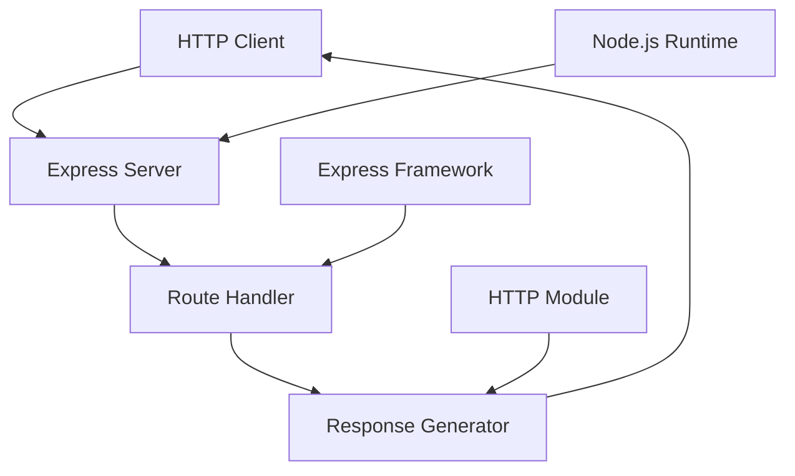
```mermaid
graph TD
    A[HTTP Client] --> B[Express Server]
    B --> C[Route Handler]
    C --> D[Response Generator]
    D --> A
    
    E[Node.js Runtime] --> B
    F[Express Framework] --> C
    G[HTTP Module] --> D
```

#### Core Technical Approach

The application follows a minimalist architecture pattern utilizing:
- **Runtime Environment**: Node.js LTS version for production stability
- **Web Framework**: Express 5.1.0, now the default on npm
- **Architecture Pattern**: Single-responsibility principle with focused endpoint implementation
- **Development Approach**: Tutorial-driven development with educational clarity as primary concern

### 1.2.3 Success Criteria

#### Measurable Objectives

| Objective | Target Metric | Measurement Method |
|---|---|---|
| Functional Completeness | 100% endpoint availability | Automated testing |
| Response Accuracy | Exact "Hello world" output | String validation |
| Performance Baseline | < 100ms response time | Load testing |

#### Critical Success Factors

- **Simplicity**: Code must remain understandable for beginners
- **Reliability**: Server must handle requests consistently
- **Compatibility**: Must work with current Node.js LTS versions
- **Educational Value**: Must clearly demonstrate core concepts

#### Key Performance Indicators (KPIs)

- **Technical KPIs**:
  - Server uptime: 99.9%
  - Response time: < 100ms average
  - Memory usage: < 50MB baseline
  
- **Educational KPIs**:
  - Code readability score: High
  - Documentation completeness: 100%
  - Example clarity rating: Excellent

## 1.3 SCOPE

### 1.3.1 In-Scope

#### Core Features and Functionalities

| Feature Category | Specific Functionality | Implementation Priority |
|---|---|---|
| HTTP Server | Basic server initialization and startup | Must-have |
| Route Definition | Single '/hello' endpoint configuration | Must-have |
| Response Handling | "Hello world" text response generation | Must-have |
| Error Handling | Basic error management and logging | Must-have |

#### Primary User Workflows

1. **Server Startup Workflow**:
   - Initialize Node.js application
   - Configure Express server
   - Start HTTP listener on designated port

2. **Request Processing Workflow**:
   - Receive HTTP GET request to '/hello'
   - Process request through Express routing
   - Generate and return "Hello world" response

3. **Development Workflow**:
   - Install project dependencies
   - Run development server
   - Test endpoint functionality

#### Essential Integrations

- **Node.js Runtime**: LTS version compatibility for production use
- **Express Framework**: Version 5.1.0 integration
- **NPM Package Manager**: Dependency management and project initialization

#### Key Technical Requirements

- **Platform Compatibility**: Cross-platform support (Windows, macOS, Linux)
- **Node.js Version**: Node.js version 18 or higher support
- **Framework Version**: Express 5.1.0 latest version
- **Response Format**: Plain text HTTP response
- **HTTP Method**: GET request support

### 1.3.2 Implementation Boundaries

#### System Boundaries

- **Application Layer**: Single Node.js process with Express framework
- **Network Layer**: HTTP protocol communication only
- **Data Layer**: No persistent data storage required
- **Security Layer**: Basic HTTP security headers

#### User Groups Covered

- **Primary Users**: Beginning Node.js developers
- **Secondary Users**: Educators and trainers
- **Tertiary Users**: Development team members seeking reference implementations

#### Geographic/Market Coverage

- **Global Availability**: No geographic restrictions
- **Language Support**: English documentation and comments
- **Platform Support**: All platforms supporting Node.js LTS

#### Data Domains Included

- **Request Data**: HTTP request headers and metadata
- **Response Data**: Static text response content
- **Server Data**: Basic server configuration and status information

### 1.3.3 Out-of-Scope

#### Explicitly Excluded Features/Capabilities

- **Database Integration**: No persistent data storage or database connectivity
- **Authentication/Authorization**: No user management or security features
- **Multiple Endpoints**: Limited to single '/hello' endpoint only
- **Advanced Middleware**: No complex request processing or transformation
- **File Operations**: No file upload, download, or manipulation capabilities
- **Real-time Features**: No WebSocket or Server-Sent Events support
- **API Documentation**: No automated API documentation generation
- **Monitoring/Analytics**: No application performance monitoring or user analytics

#### Future Phase Considerations

- **Phase 2 Potential**: Multiple endpoint examples and routing patterns
- **Phase 3 Potential**: Database integration tutorials
- **Phase 4 Potential**: Authentication and security examples
- **Phase 5 Potential**: Advanced middleware and error handling patterns

#### Integration Points Not Covered

- **External APIs**: No third-party service integrations
- **Message Queues**: No asynchronous message processing
- **Caching Systems**: No Redis or Memcached integration
- **Load Balancers**: No reverse proxy or load balancing configuration
- **Container Orchestration**: No Docker or Kubernetes deployment examples

#### Unsupported Use Cases

- **Production Deployment**: Tutorial is for educational purposes only
- **High-Traffic Applications**: Not designed for production load handling
- **Enterprise Security**: No enterprise-grade security implementations
- **Multi-tenant Applications**: No support for multiple client organizations
- **Microservices Architecture**: Single monolithic application only

# 2. PRODUCT REQUIREMENTS

## 2.1 FEATURE CATALOG

### 2.1.1 HTTP Server Foundation

| Feature Metadata | Details |
|---|---|
| **Feature ID** | F-001 |
| **Feature Name** | HTTP Server Initialization |
| **Feature Category** | Core Infrastructure |
| **Priority Level** | Critical |
| **Status** | Proposed |

#### Description

**Overview**: Establishes the foundational HTTP server using Node.js 18 or higher with Express 5.1.0 framework to provide basic web server functionality for the tutorial application.

**Business Value**: Provides the essential infrastructure component that enables all HTTP communication and serves as the foundation for the educational tutorial experience.

**User Benefits**: 
- Enables developers to understand basic server setup patterns
- Demonstrates modern Node.js server architecture
- Provides working example of Express framework integration

**Technical Context**: Utilizes Express 5.1.0 which requires Node.js 18 or higher and includes enhanced security features and performance improvements.

#### Dependencies

| Dependency Type | Requirement |
|---|---|
| **System Dependencies** | Node.js 18 or higher runtime environment |
| **External Dependencies** | Express 5.1.0 framework from npm registry |
| **Integration Requirements** | NPM package management system |

### 2.1.2 Route Handler Implementation

| Feature Metadata | Details |
|---|---|
| **Feature ID** | F-002 |
| **Feature Name** | Hello World Endpoint |
| **Feature Category** | API Functionality |
| **Priority Level** | Critical |
| **Status** | Proposed |

#### Description

**Overview**: Implements a single HTTP GET endpoint '/hello' that returns the static text response "Hello world" to demonstrate basic routing and response handling patterns.

**Business Value**: Serves as the primary educational component demonstrating HTTP request-response cycle and Express routing mechanisms.

**User Benefits**:
- Clear demonstration of endpoint creation
- Simple, testable functionality
- Foundation for understanding REST API patterns

**Technical Context**: Leverages Express 5's updated path-to-regexp library version 8.x for improved security and route matching.

#### Dependencies

| Dependency Type | Requirement |
|---|---|
| **Prerequisite Features** | F-001 (HTTP Server Initialization) |
| **System Dependencies** | Express routing middleware |
| **Integration Requirements** | HTTP request processing pipeline |

### 2.1.3 Error Handling System

| Feature Metadata | Details |
|---|---|
| **Feature ID** | F-003 |
| **Feature Name** | Basic Error Management |
| **Feature Category** | System Reliability |
| **Priority Level** | High |
| **Status** | Proposed |

#### Description

**Overview**: Implements Express 5's enhanced error handling capabilities including automatic promise rejection handling to ensure robust application behavior.

**Business Value**: Demonstrates proper error handling patterns essential for production-ready applications and educational best practices.

**User Benefits**:
- Shows modern async/await error handling patterns
- Prevents application crashes from unhandled errors
- Educational value for proper error management

**Technical Context**: Express 5 automatically catches rejected promises and forwards them to error-handling middleware without requiring explicit try/catch blocks.

#### Dependencies

| Dependency Type | Requirement |
|---|---|
| **Prerequisite Features** | F-001 (HTTP Server Initialization) |
| **System Dependencies** | Express error handling middleware |
| **Integration Requirements** | Promise-based error propagation |

### 2.1.4 Application Configuration

| Feature Metadata | Details |
|---|---|
| **Feature ID** | F-004 |
| **Feature Name** | Server Configuration Management |
| **Feature Category** | System Configuration |
| **Priority Level** | Medium |
| **Status** | Proposed |

#### Description

**Overview**: Manages basic server configuration including port assignment, environment settings, and startup parameters for the tutorial application.

**Business Value**: Demonstrates configuration management patterns and provides flexibility for different deployment scenarios.

**User Benefits**:
- Shows environment-based configuration patterns
- Enables easy port customization
- Demonstrates configuration best practices

**Technical Context**: Utilizes Node.js environment variables and Express application settings for configuration management.

#### Dependencies

| Dependency Type | Requirement |
|---|---|
| **Prerequisite Features** | F-001 (HTTP Server Initialization) |
| **System Dependencies** | Node.js process environment |
| **Integration Requirements** | Environment variable processing |

## 2.2 FUNCTIONAL REQUIREMENTS TABLE

### 2.2.1 HTTP Server Foundation (F-001)

| Requirement Details | Specification |
|---|---|
| **Requirement ID** | F-001-RQ-001 |
| **Description** | Initialize Express application instance |
| **Acceptance Criteria** | Express app object created successfully with default middleware |
| **Priority** | Must-Have |
| **Complexity** | Low |

| Technical Specifications | Details |
|---|---|
| **Input Parameters** | None (default Express configuration) |
| **Output/Response** | Express application instance |
| **Performance Criteria** | Initialization time < 100ms |
| **Data Requirements** | No persistent data storage |

| Validation Rules | Requirements |
|---|---|
| **Business Rules** | Must use Express 5.1.0 or compatible version |
| **Data Validation** | Validate Express framework availability |
| **Security Requirements** | Apply security fixes including ReDoS attack prevention |
| **Compliance Requirements** | Node.js 18+ compatibility requirement |

---

| Requirement Details | Specification |
|---|---|
| **Requirement ID** | F-001-RQ-002 |
| **Description** | Configure HTTP server listener on designated port |
| **Acceptance Criteria** | Server accepts HTTP connections on specified port |
| **Priority** | Must-Have |
| **Complexity** | Low |

| Technical Specifications | Details |
|---|---|
| **Input Parameters** | Port number (default: 3000) |
| **Output/Response** | HTTP server listening confirmation |
| **Performance Criteria** | Server startup time < 500ms |
| **Data Requirements** | Port availability validation |

| Validation Rules | Requirements |
|---|---|
| **Business Rules** | Port must be available and not reserved |
| **Data Validation** | Port number within valid range (1024-65535) |
| **Security Requirements** | No privileged port usage without proper permissions |
| **Compliance Requirements** | Cross-platform compatibility |

### 2.2.2 Hello World Endpoint (F-002)

| Requirement Details | Specification |
|---|---|
| **Requirement ID** | F-002-RQ-001 |
| **Description** | Implement GET /hello route handler |
| **Acceptance Criteria** | Route responds to HTTP GET requests with "Hello world" text |
| **Priority** | Must-Have |
| **Complexity** | Low |

| Technical Specifications | Details |
|---|---|
| **Input Parameters** | HTTP GET request to '/hello' path |
| **Output/Response** | Plain text "Hello world" with 200 status code |
| **Performance Criteria** | Response time < 50ms |
| **Data Requirements** | Static text response only |

| Validation Rules | Requirements |
|---|---|
| **Business Rules** | Exact "Hello world" text response required |
| **Data Validation** | HTTP method must be GET |
| **Security Requirements** | Route pattern security validation using path-to-regexp 8.x |
| **Compliance Requirements** | HTTP/1.1 protocol compliance |

---

| Requirement Details | Specification |
|---|---|
| **Requirement ID** | F-002-RQ-002 |
| **Description** | Handle invalid route requests |
| **Acceptance Criteria** | Non-existent routes return appropriate 404 responses |
| **Priority** | Should-Have |
| **Complexity** | Low |

| Technical Specifications | Details |
|---|---|
| **Input Parameters** | HTTP requests to undefined routes |
| **Output/Response** | 404 Not Found status with error message |
| **Performance Criteria** | Error response time < 25ms |
| **Data Requirements** | Standard HTTP error response format |

| Validation Rules | Requirements |
|---|---|
| **Business Rules** | Only '/hello' route should return 200 status |
| **Data Validation** | Route path validation against defined patterns |
| **Security Requirements** | No information disclosure in error responses |
| **Compliance Requirements** | Standard HTTP status code usage |

### 2.2.3 Basic Error Management (F-003)

| Requirement Details | Specification |
|---|---|
| **Requirement ID** | F-003-RQ-001 |
| **Description** | Implement global error handling middleware |
| **Acceptance Criteria** | Unhandled errors return structured error responses |
| **Priority** | Must-Have |
| **Complexity** | Medium |

| Technical Specifications | Details |
|---|---|
| **Input Parameters** | Error objects from application or middleware |
| **Output/Response** | JSON error response with status code |
| **Performance Criteria** | Error processing time < 10ms |
| **Data Requirements** | Error logging and response formatting |

| Validation Rules | Requirements |
|---|---|
| **Business Rules** | All errors must be handled gracefully |
| **Data Validation** | Error object structure validation |
| **Security Requirements** | No sensitive information in error responses |
| **Compliance Requirements** | Standard HTTP error status codes |

---

| Requirement Details | Specification |
|---|---|
| **Requirement ID** | F-003-RQ-002 |
| **Description** | Handle async/await promise rejections automatically |
| **Acceptance Criteria** | Promise rejections forwarded to error middleware without manual handling |
| **Priority** | Should-Have |
| **Complexity** | Low |

| Technical Specifications | Details |
|---|---|
| **Input Parameters** | Rejected promises from async route handlers |
| **Output/Response** | Automatic error forwarding to error handlers |
| **Performance Criteria** | Promise error handling < 5ms overhead |
| **Data Requirements** | Promise rejection reason capture |

| Validation Rules | Requirements |
|---|---|
| **Business Rules** | No manual next() calls required for promise errors |
| **Data Validation** | Promise rejection value validation |
| **Security Requirements** | Secure error information handling |
| **Compliance Requirements** | Express 5 promise handling standards |

### 2.2.4 Server Configuration Management (F-004)

| Requirement Details | Specification |
|---|---|
| **Requirement ID** | F-004-RQ-001 |
| **Description** | Environment-based port configuration |
| **Acceptance Criteria** | Server uses PORT environment variable or defaults to 3000 |
| **Priority** | Should-Have |
| **Complexity** | Low |

| Technical Specifications | Details |
|---|---|
| **Input Parameters** | PORT environment variable |
| **Output/Response** | Server listening on configured port |
| **Performance Criteria** | Configuration processing < 1ms |
| **Data Requirements** | Environment variable parsing |

| Validation Rules | Requirements |
|---|---|
| **Business Rules** | Default port 3000 when PORT not specified |
| **Data Validation** | Port number format and range validation |
| **Security Requirements** | No hardcoded sensitive configuration |
| **Compliance Requirements** | Standard environment variable conventions |

## 2.3 FEATURE RELATIONSHIPS

### 2.3.1 Feature Dependencies Map

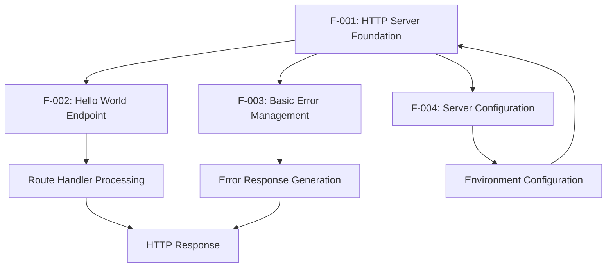
```mermaid
graph TD
    A[F-001: HTTP Server Foundation] --> B[F-002: Hello World Endpoint]
    A --> C[F-003: Basic Error Management]
    A --> D[F-004: Server Configuration]
    
    B --> E[Route Handler Processing]
    C --> F[Error Response Generation]
    D --> G[Environment Configuration]
    
    E --> H[HTTP Response]
    F --> H
    G --> A
```

### 2.3.2 Integration Points

| Integration Point | Features Involved | Shared Components |
|---|---|---|
| **HTTP Request Processing** | F-001, F-002, F-003 | Express middleware pipeline |
| **Configuration Management** | F-001, F-004 | Environment variable processing |
| **Error Handling Pipeline** | F-002, F-003 | Express error middleware |

### 2.3.3 Common Services

| Service | Description | Used By |
|---|---|---|
| **Express Framework** | Core web framework providing routing and middleware | F-001, F-002, F-003 |
| **HTTP Module** | Node.js built-in HTTP server functionality | F-001, F-004 |
| **Process Environment** | Node.js environment variable access | F-004 |

## 2.4 IMPLEMENTATION CONSIDERATIONS

### 2.4.1 HTTP Server Foundation (F-001)

**Technical Constraints**:
- Requires Node.js 18 or higher for Express 5.1.0 compatibility
- Node.js 18 reaches End-of-Life on April 30, 2025
- Cross-platform compatibility requirements

**Performance Requirements**:
- Server initialization under 100ms
- Memory footprint under 50MB baseline
- Support for concurrent connections

**Scalability Considerations**:
- Single-threaded Node.js event loop architecture
- Designed for educational use, not production scale
- No clustering or load balancing requirements

**Security Implications**:
- Includes security fixes for ReDoS attack prevention
- Comprehensive Threat Model implementation
- Basic HTTP security headers

**Maintenance Requirements**:
- Regular Express framework updates
- Node.js LTS version compatibility
- Dependency security monitoring

### 2.4.2 Hello World Endpoint (F-002)

**Technical Constraints**:
- Uses path-to-regexp 8.x for enhanced route security
- Single endpoint limitation by design
- Plain text response format only

**Performance Requirements**:
- Response time under 50ms
- Minimal CPU and memory usage
- No caching requirements

**Scalability Considerations**:
- Stateless endpoint design
- No database or external service dependencies
- Suitable for high-frequency requests

**Security Implications**:
- Enhanced route pattern security validation
- No user input processing
- Static response content

**Maintenance Requirements**:
- Route pattern validation updates
- HTTP protocol compliance monitoring
- Response format consistency

### 2.4.3 Basic Error Management (F-003)

**Technical Constraints**:
- Express 5 automatic promise rejection handling
- Error middleware execution order requirements
- JSON error response format

**Performance Requirements**:
- Error processing under 10ms
- Minimal performance impact on successful requests
- Efficient error logging

**Scalability Considerations**:
- Error handling middleware performance
- Log aggregation for multiple instances
- Error rate monitoring capabilities

**Security Implications**:
- No sensitive information disclosure
- Secure error logging practices
- Attack pattern detection

**Maintenance Requirements**:
- Error handling pattern updates
- Log rotation and management
- Error monitoring and alerting

### 2.4.4 Server Configuration Management (F-004)

**Technical Constraints**:
- Environment variable dependency
- Port availability validation
- Configuration validation requirements

**Performance Requirements**:
- Configuration processing under 1ms
- Startup time optimization
- Runtime configuration access

**Scalability Considerations**:
- Environment-specific configurations
- Configuration management across deployments
- Dynamic configuration updates

**Security Implications**:
- Secure configuration storage
- No hardcoded sensitive values
- Configuration access control

**Maintenance Requirements**:
- Configuration schema validation
- Environment synchronization
- Configuration change tracking

## 2.5 TRACEABILITY MATRIX

| Requirement ID | Feature | Business Requirement | Technical Specification | Test Case |
|---|---|---|---|---|
| F-001-RQ-001 | HTTP Server Foundation | Basic web server functionality | Express app initialization | TC-001-001 |
| F-001-RQ-002 | HTTP Server Foundation | HTTP connection handling | Server port listener | TC-001-002 |
| F-002-RQ-001 | Hello World Endpoint | '/hello' endpoint response | GET route handler | TC-002-001 |
| F-002-RQ-002 | Hello World Endpoint | Error handling for invalid routes | 404 response handling | TC-002-002 |
| F-003-RQ-001 | Basic Error Management | Global error handling | Error middleware implementation | TC-003-001 |
| F-003-RQ-002 | Basic Error Management | Promise rejection handling | Async error forwarding | TC-003-002 |
| F-004-RQ-001 | Server Configuration | Environment-based configuration | PORT variable processing | TC-004-001 |

# 3. TECHNOLOGY STACK

## 3.1 PROGRAMMING LANGUAGES

### 3.1.1 Primary Language Selection

| Component | Language | Version | Justification |
|---|---|---|---|
| **Server Application** | JavaScript (Node.js) | ES2022+ | Node.js® is a free, open-source, cross-platform JavaScript runtime environment that lets developers create servers, web apps, command line tools and scripts. Node.js 18 or higher is required. |

#### Selection Criteria

**JavaScript with Node.js Runtime**:
- **Educational Alignment**: Provides unified language experience for both client and server-side development
- **Runtime Compatibility**: Node.js v22 officially transitioned into Long Term Support (LTS) with the codename 'Jod' on October 29, 2024. With Node.js v22.11.0, the 22.x release line has officially moved into Active LTS.
- **Framework Requirements**: Node.js 18 or higher is required. Express.js 5.0 requires Node.js 18 or higher
- **Cross-Platform Support**: Node.js is officially supported by Linux, macOS and Microsoft Windows 8.1 and Server 2012 (and later)

#### Language Constraints and Dependencies

**Node.js Version Requirements**:
- **Minimum Version**: Node.js 18.x (required for Express 5.1.0 compatibility)
- **Recommended Version**: Node.js v22.x with Active LTS support extending into late 2025
- **End-of-Life Considerations**: Node.js 20.x End of Active LTS: October 13, 2024, End-of-life: April 30, 2026

**JavaScript Feature Support**:
- **ES2022+ Features**: Modern async/await, destructuring, arrow functions
- **Module System**: CommonJS and ES Modules support
- **Promise Handling**: Native promise support with automatic error forwarding

## 3.2 FRAMEWORKS & LIBRARIES

### 3.2.1 Core Web Framework

| Framework | Version | Purpose | Justification |
|---|---|---|---|
| **Express.js** | 5.1.0 | Web Application Framework | Express 5.1.0 is now the default on npm. Latest version: 5.1.0, last published: 3 months ago. |

#### Framework Selection Rationale

**Express.js 5.1.0 Selection**:
- **Industry Standard**: There are 90019 other projects in the npm registry using express
- **Latest Stable Release**: This is important because it means it is the "default installed version" and will trigger the transition of nearly 17 million weekly downloads from our current latest v4.21.2 to v5
- **Security Enhancements**: This release includes important security fixes, including improvements to prevent ReDoS attacks and mitigation for CVE-2024-45590
- **Modern Features**: Promise support: Middleware can now return rejected promises, caught by the router as errors

#### Compatibility Requirements

**Node.js Integration**:
- **Runtime Dependency**: Node.js version support: Dropped support for Node.js versions before v18
- **Path Routing Security**: Routing changes: Updated to path-to-regexp@8.x, removing sub-expression regex patterns for security reasons (ReDoS mitigation)
- **Promise Integration**: Express 5 introduces a significant improvement for developers using async/await by automatically forwarding rejected promises to error-handling middleware

### 3.2.2 Supporting Libraries

| Library | Version | Purpose | Integration Point |
|---|---|---|---|
| **path-to-regexp** | 8.x | Route Pattern Matching | Express routing system |
| **body-parser** | ^2.1.0 | Request Body Parsing | Express middleware pipeline |
| **debug** | ^4.4.0 | Development Debugging | Express logging system |

#### Library Justification

**path-to-regexp 8.x**:
- **Security Enhancement**: These changes improve security, simplify route definitions, and help mitigate vulnerabilities like ReDoS attacks. In Express 5, this type of inline regex is no longer supported due to its susceptibility to ReDoS attacks
- **Route Matching**: Provides secure and efficient URL pattern matching for Express routes

**body-parser 2.1.0**:
- **Request Processing**: body-parser changes: Several improvements including the ability to customize urlencoded body depth and defaulting extended to false
- **Middleware Integration**: Built-in Express middleware for parsing HTTP request bodies

## 3.3 OPEN SOURCE DEPENDENCIES

### 3.3.1 NPM Package Dependencies

| Package | Version | Registry | Purpose |
|---|---|---|---|
| **express** | 5.1.0 | npm | Core web framework |
| **@types/express** | 5.0.3 | npm | TypeScript definitions (optional) |

#### Package Registry Information

**NPM Registry Details**:
- **Registry Size**: Over 3.1 million packages are available in the main npm registry
- **NPM Version**: Latest version: 11.4.2, last published: 21 days ago
- **Package Manager**: npm is the default package manager for the JavaScript runtime environment Node.js and is included as a recommended feature in the Node.js installer

#### Dependency Management Strategy

**Version Control**:
- **Semantic Versioning**: npm follows the semantic versioning (semver) standard
- **Lock File Management**: Utilizes package-lock.json for deterministic dependency resolution
- **Security Monitoring**: Regular dependency auditing for security vulnerabilities

### 3.3.2 Development Dependencies

| Package | Version | Purpose | Development Phase |
|---|---|---|---|
| **nodemon** | Latest | Development Server | Development only |
| **@types/node** | Latest | Node.js TypeScript definitions | Development only |

## 3.4 THIRD-PARTY SERVICES

### 3.4.1 External Service Integration

**No External Services Required**:
- The tutorial application is designed as a self-contained educational example
- No authentication services, external APIs, or cloud services are integrated
- Minimal external dependencies to maintain simplicity and educational focus

#### Rationale for Minimal External Dependencies

**Educational Simplicity**:
- Reduces complexity for learning purposes
- Eliminates external service configuration requirements
- Focuses on core Node.js and Express concepts
- Ensures consistent behavior across different environments

## 3.5 DATABASES & STORAGE

### 3.5.1 Data Persistence Strategy

**No Database Required**:
- Application serves static "Hello world" response
- No persistent data storage needs
- No caching requirements for tutorial scope
- In-memory operation only

#### Storage Architecture Decision

**Stateless Design**:
- Aligns with tutorial educational objectives
- Eliminates database setup complexity
- Reduces infrastructure requirements
- Maintains focus on HTTP server fundamentals

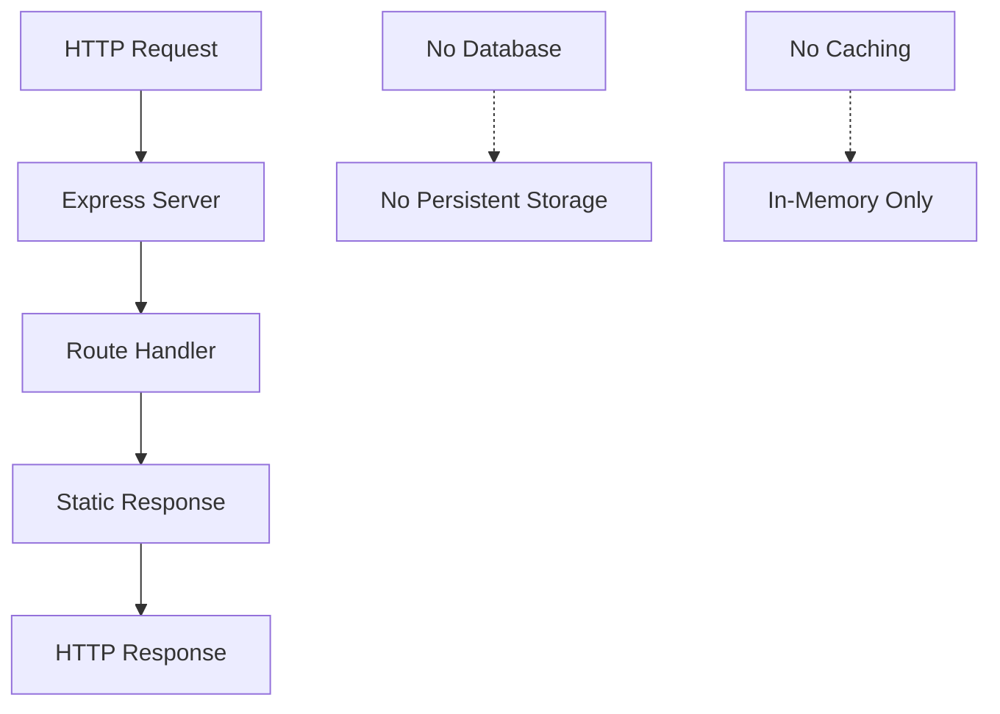
```mermaid
graph TD
    A[HTTP Request] --> B[Express Server]
    B --> C[Route Handler]
    C --> D[Static Response]
    D --> E[HTTP Response]
    
    F[No Database] -.-> G[No Persistent Storage]
    H[No Caching] -.-> I[In-Memory Only]
```

## 3.6 DEVELOPMENT & DEPLOYMENT

### 3.6.1 Development Tools

| Tool Category | Tool | Version | Purpose |
|---|---|---|---|
| **Package Manager** | npm | 11.4.2 | Dependency management |
| **Runtime** | Node.js | 22.x LTS | JavaScript execution environment |
| **Development Server** | nodemon | Latest | Auto-restart development server |

#### Development Environment Setup

**Local Development Requirements**:
- **Node.js Installation**: Node.js v22.x is an excellent choice for those aiming for long-term support in production environments
- **NPM Integration**: npm comes bundled with node, & most third-party distributions, by default
- **Cross-Platform Support**: Compatible with Windows, macOS, and Linux development environments

### 3.6.2 Build System

**No Build Process Required**:
- Direct JavaScript execution without transpilation
- No bundling or minification needed for tutorial scope
- Simple `npm start` script execution
- Development and production use same codebase

#### Build Strategy Rationale

**Simplicity Focus**:
- Eliminates build complexity for educational purposes
- Direct Node.js execution without intermediate steps
- Maintains clear relationship between source and execution
- Reduces learning curve for beginners

### 3.6.3 Containerization

**Optional Docker Support**:
- Docker containerization available but not required
- Dockerfile can be provided for deployment consistency
- Container-based deployment for production environments
- Local development remains container-independent

#### Container Strategy

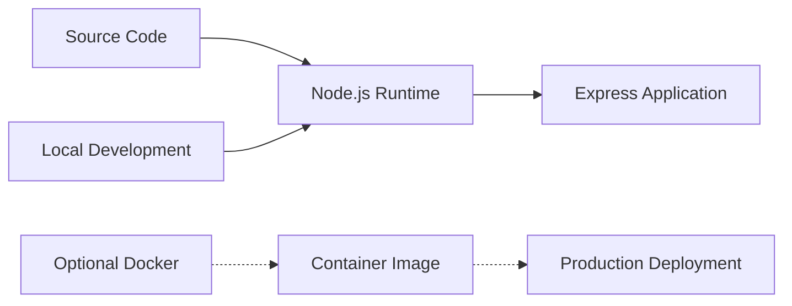
```mermaid
graph LR
    A[Source Code] --> B[Node.js Runtime]
    B --> C[Express Application]
    
    D[Optional Docker] -.-> E[Container Image]
    E -.-> F[Production Deployment]
    
    G[Local Development] --> B
```

### 3.6.4 CI/CD Requirements

**Minimal CI/CD Pipeline**:
- Basic testing and linting capabilities
- No complex deployment orchestration required
- Simple deployment to various hosting platforms
- Educational focus over production complexity

#### Deployment Considerations

**Platform Compatibility**:
- **Cloud Platforms**: Compatible with AWS, Azure, Google Cloud Platform
- **PaaS Solutions**: Heroku, Vercel, Netlify Functions support
- **Traditional Hosting**: VPS and dedicated server deployment
- **Local Deployment**: Development and testing environments

### 3.6.5 Technology Stack Integration

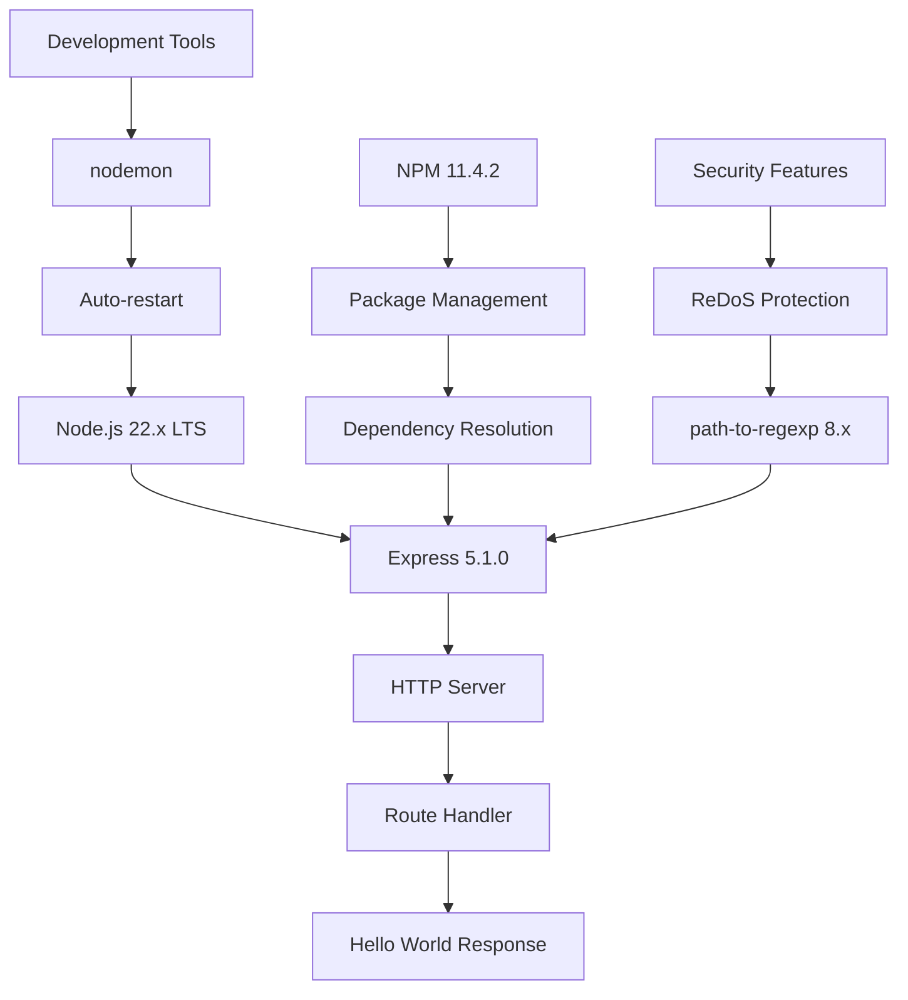
```mermaid
graph TD
    A[Node.js 22.x LTS] --> B[Express 5.1.0]
    B --> C[HTTP Server]
    C --> D[Route Handler]
    D --> E[Hello World Response]
    
    F[NPM 11.4.2] --> G[Package Management]
    G --> H[Dependency Resolution]
    H --> B
    
    I[Development Tools] --> J[nodemon]
    J --> K[Auto-restart]
    K --> A
    
    L[Security Features] --> M[ReDoS Protection]
    M --> N[path-to-regexp 8.x]
    N --> B
```

#### Integration Requirements

**Component Compatibility Matrix**:

| Component | Node.js 18+ | Node.js 20 LTS | Node.js 22 LTS | Express 5.1.0 |
|---|---|---|---|---|
| **Express 5.1.0** | ✅ Required | ✅ Compatible | ✅ Recommended | ✅ Self |
| **path-to-regexp 8.x** | ✅ Compatible | ✅ Compatible | ✅ Compatible | ✅ Required |
| **body-parser 2.1.0** | ✅ Compatible | ✅ Compatible | ✅ Compatible | ✅ Integrated |
| **npm 11.4.2** | ✅ Compatible | ✅ Compatible | ✅ Compatible | ✅ Compatible |

#### Security Implications

**Framework Security Features**:
- **ReDoS Attack Prevention**: These changes improve security, simplify route definitions, and help mitigate vulnerabilities like ReDoS attacks
- **Dependency Security**: Regular security audits through npm audit
- **Threat Model Implementation**: Security improvements: A Threat Model has been added to improve security awareness and measures within the project
- **Static Analysis**: CodeQL (Static Application Security Testing) has also been integrated to catch vulnerabilities in the codebase

# 4. PROCESS FLOWCHART

## 4.1 SYSTEM WORKFLOWS

### 4.1.1 Core Business Processes

#### Application Startup Workflow

The Node.js tutorial application requires Node.js 18 or higher and follows a structured initialization process that establishes the HTTP server foundation for educational purposes.

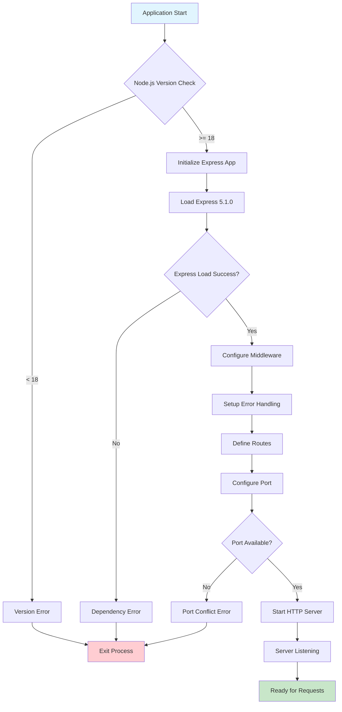
```mermaid
flowchart TD
    A[Application Start] --> B{Node.js Version Check}
    B -->|< 18| C[Version Error]
    B -->|>= 18| D[Initialize Express App]
    
    D --> E[Load Express 5.1.0]
    E --> F{Express Load Success?}
    F -->|No| G[Dependency Error]
    F -->|Yes| H[Configure Middleware]
    
    H --> I[Setup Error Handling]
    I --> J[Define Routes]
    J --> K[Configure Port]
    K --> L{Port Available?}
    L -->|No| M[Port Conflict Error]
    L -->|Yes| N[Start HTTP Server]
    
    N --> O[Server Listening]
    O --> P[Ready for Requests]
    
    C --> Q[Exit Process]
    G --> Q
    M --> Q
    
    style A fill:#e1f5fe
    style P fill:#c8e6c9
    style Q fill:#ffcdd2
```

#### HTTP Request Processing Workflow

When an HTTP request hits the server, Node calls the request handler function with request and response objects, and the function that's passed in to createServer is called once for every HTTP request.

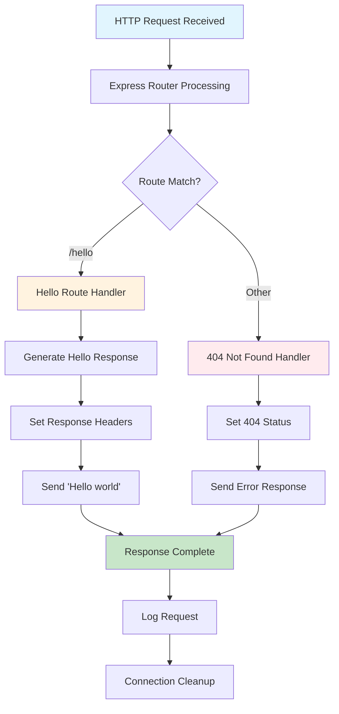
```mermaid
flowchart TD
    A[HTTP Request Received] --> B[Express Router Processing]
    B --> C{Route Match?}
    
    C -->|/hello| D[Hello Route Handler]
    C -->|Other| E[404 Not Found Handler]
    
    D --> F[Generate Hello Response]
    F --> G[Set Response Headers]
    G --> H[Send 'Hello world']
    H --> I[Response Complete]
    
    E --> J[Set 404 Status]
    J --> K[Send Error Response]
    K --> I
    
    I --> L[Log Request]
    L --> M[Connection Cleanup]
    
    style A fill:#e1f5fe
    style D fill:#fff3e0
    style E fill:#ffebee
    style I fill:#c8e6c9
```

#### Error Handling Process Flow

Express 5 introduces automatic forwarding of rejected promises to error-handling middleware, and if fetchData throws an error or rejects, Express will automatically pass the error to the error-handling middleware.

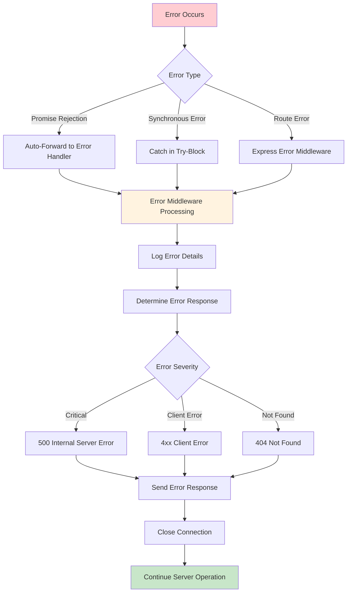
```mermaid
flowchart TD
    A[Error Occurs] --> B{Error Type}
    
    B -->|Promise Rejection| C[Auto-Forward to Error Handler]
    B -->|Synchronous Error| D[Catch in Try-Block]
    B -->|Route Error| E[Express Error Middleware]
    
    C --> F[Error Middleware Processing]
    D --> F
    E --> F
    
    F --> G[Log Error Details]
    G --> H[Determine Error Response]
    H --> I{Error Severity}
    
    I -->|Critical| J[500 Internal Server Error]
    I -->|Client Error| K[4xx Client Error]
    I -->|Not Found| L[404 Not Found]
    
    J --> M[Send Error Response]
    K --> M
    L --> M
    
    M --> N[Close Connection]
    N --> O[Continue Server Operation]
    
    style A fill:#ffcdd2
    style F fill:#fff3e0
    style O fill:#c8e6c9
```

### 4.1.2 Integration Workflows

#### Express Framework Integration Flow

Express 5 updates to path-to-regexp@8.x with routing changes that remove sub-expression regex patterns for security reasons, and middleware can now return rejected promises caught by the router as errors.

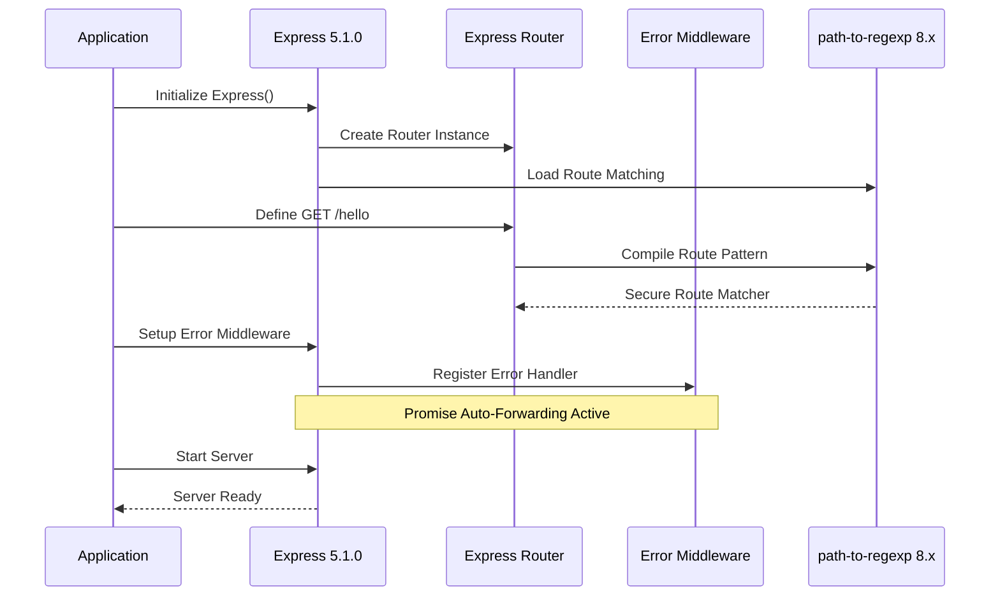
```mermaid
sequenceDiagram
    participant App as Application
    participant Express as Express 5.1.0
    participant Router as Express Router
    participant Middleware as Error Middleware
    participant PathRegex as path-to-regexp 8.x
    
    App->>Express: Initialize Express()
    Express->>Router: Create Router Instance
    Express->>PathRegex: Load Route Matching
    
    App->>Router: Define GET /hello
    Router->>PathRegex: Compile Route Pattern
    PathRegex-->>Router: Secure Route Matcher
    
    App->>Express: Setup Error Middleware
    Express->>Middleware: Register Error Handler
    
    Note over Express,Middleware: Promise Auto-Forwarding Active
    
    App->>Express: Start Server
    Express-->>App: Server Ready
```

## Node.js Runtime Integration

Node.js® is a free, open-source, cross-platform JavaScript runtime environment that lets developers create servers, web apps, command line tools and scripts.

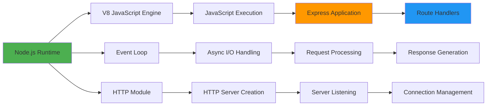
```mermaid
flowchart LR
    A[Node.js Runtime] --> B[V8 JavaScript Engine]
    A --> C[Event Loop]
    A --> D[HTTP Module]
    
    B --> E[JavaScript Execution]
    C --> F[Async I/O Handling]
    D --> G[HTTP Server Creation]
    
    E --> H[Express Application]
    F --> I[Request Processing]
    G --> J[Server Listening]
    
    H --> K[Route Handlers]
    I --> L[Response Generation]
    J --> M[Connection Management]
    
    style A fill:#4caf50
    style H fill:#ff9800
    style K fill:#2196f3
```

## 4.2 DETAILED PROCESS FLOWS

### 4.2.1 Server Initialization Process

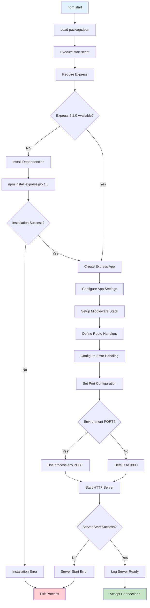
```mermaid
flowchart TD
    A[npm start] --> B[Load package.json]
    B --> C[Execute start script]
    C --> D[Require Express]
    
    D --> E{Express 5.1.0 Available?}
    E -->|No| F[Install Dependencies]
    E -->|Yes| G[Create Express App]
    
    F --> H[npm install express@5.1.0]
    H --> I{Installation Success?}
    I -->|No| J[Installation Error]
    I -->|Yes| G
    
    G --> K[Configure App Settings]
    K --> L[Setup Middleware Stack]
    L --> M[Define Route Handlers]
    
    M --> N[Configure Error Handling]
    N --> O[Set Port Configuration]
    O --> P{Environment PORT?}
    
    P -->|Yes| Q[Use process.env.PORT]
    P -->|No| R[Default to 3000]
    
    Q --> S[Start HTTP Server]
    R --> S
    
    S --> T{Server Start Success?}
    T -->|No| U[Server Start Error]
    T -->|Yes| V[Log Server Ready]
    
    V --> W[Accept Connections]
    
    J --> X[Exit Process]
    U --> X
    
    style A fill:#e3f2fd
    style W fill:#c8e6c9
    style X fill:#ffcdd2
```

### 4.2.2 Request-Response Cycle Detail

The Request/Response Cycle shows how a user gives a client a URL, the client builds a request for information to be generated by a server, when the server receives that request it uses the information to build a response, and once built that response is sent back to the client.

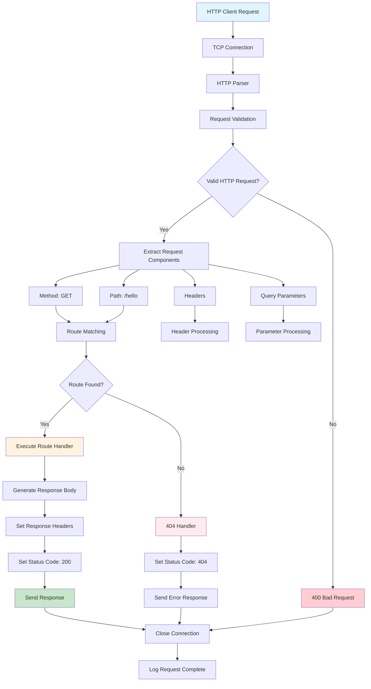
```mermaid
flowchart TD
    A[HTTP Client Request] --> B[TCP Connection]
    B --> C[HTTP Parser]
    C --> D[Request Validation]
    
    D --> E{Valid HTTP Request?}
    E -->|No| F[400 Bad Request]
    E -->|Yes| G[Extract Request Components]
    
    G --> H[Method: GET]
    G --> I[Path: /hello]
    G --> J[Headers]
    G --> K[Query Parameters]
    
    H --> L[Route Matching]
    I --> L
    J --> M[Header Processing]
    K --> N[Parameter Processing]
    
    L --> O{Route Found?}
    O -->|No| P[404 Handler]
    O -->|Yes| Q[Execute Route Handler]
    
    Q --> R[Generate Response Body]
    R --> S[Set Response Headers]
    S --> T[Set Status Code: 200]
    T --> U[Send Response]
    
    P --> V[Set Status Code: 404]
    V --> W[Send Error Response]
    
    U --> X[Close Connection]
    W --> X
    F --> X
    
    X --> Y[Log Request Complete]
    
    style A fill:#e1f5fe
    style Q fill:#fff3e0
    style U fill:#c8e6c9
    style F fill:#ffcdd2
    style P fill:#ffebee
```

### 4.2.3 Error Recovery and Resilience Flow

With Express 5, you don't need to handle errors within the route handler explicitly, rejected promises are automatically passed to the error-handling middleware, and Express will pass a default Error object to the error-handling middleware if no rejected value is provided.

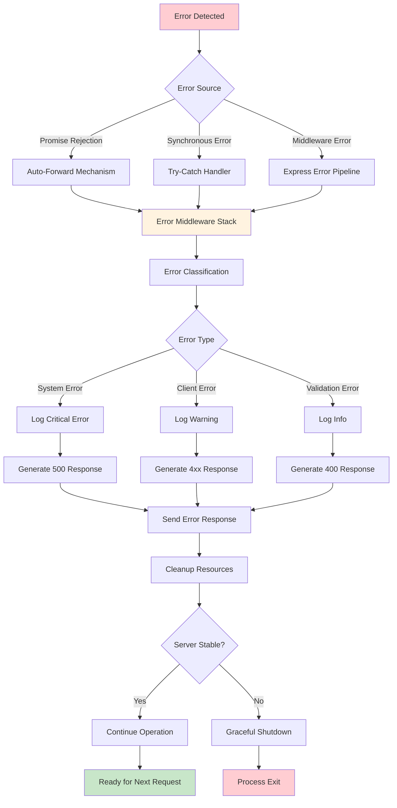
```mermaid
flowchart TD
    A[Error Detected] --> B{Error Source}
    
    B -->|Promise Rejection| C[Auto-Forward Mechanism]
    B -->|Synchronous Error| D[Try-Catch Handler]
    B -->|Middleware Error| E[Express Error Pipeline]
    
    C --> F[Error Middleware Stack]
    D --> F
    E --> F
    
    F --> G[Error Classification]
    G --> H{Error Type}
    
    H -->|System Error| I[Log Critical Error]
    H -->|Client Error| J[Log Warning]
    H -->|Validation Error| K[Log Info]
    
    I --> L[Generate 500 Response]
    J --> M[Generate 4xx Response]
    K --> N[Generate 400 Response]
    
    L --> O[Send Error Response]
    M --> O
    N --> O
    
    O --> P[Cleanup Resources]
    P --> Q{Server Stable?}
    
    Q -->|Yes| R[Continue Operation]
    Q -->|No| S[Graceful Shutdown]
    
    R --> T[Ready for Next Request]
    S --> U[Process Exit]
    
    style A fill:#ffcdd2
    style F fill:#fff3e0
    style T fill:#c8e6c9
    style U fill:#ffcdd2
```

## 4.3 STATE MANAGEMENT

### 4.3.1 Application State Transitions

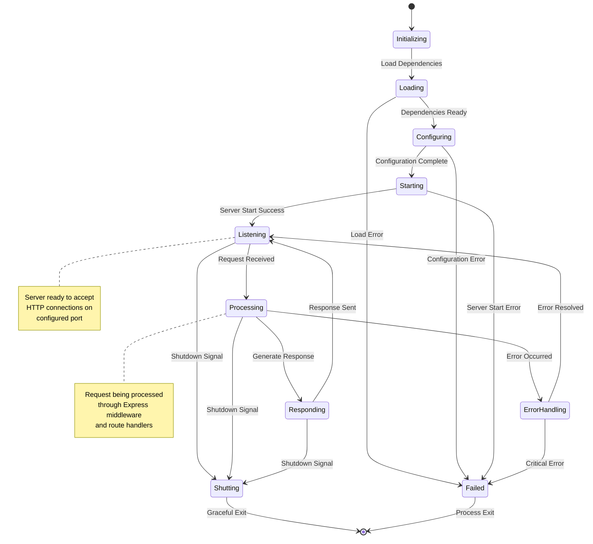
```mermaid
stateDiagram-v2
    [*] --> Initializing
    
    Initializing --> Loading : Load Dependencies
    Loading --> Configuring : Dependencies Ready
    Loading --> Failed : Load Error
    
    Configuring --> Starting : Configuration Complete
    Configuring --> Failed : Configuration Error
    
    Starting --> Listening : Server Start Success
    Starting --> Failed : Server Start Error
    
    Listening --> Processing : Request Received
    Processing --> Responding : Generate Response
    Responding --> Listening : Response Sent
    
    Processing --> ErrorHandling : Error Occurred
    ErrorHandling --> Listening : Error Resolved
    ErrorHandling --> Failed : Critical Error
    
    Listening --> Shutting : Shutdown Signal
    Processing --> Shutting : Shutdown Signal
    Responding --> Shutting : Shutdown Signal
    
    Shutting --> [*] : Graceful Exit
    Failed --> [*] : Process Exit
    
    note right of Listening
        Server ready to accept
        HTTP connections on
        configured port
    end note
    
    note right of Processing
        Request being processed
        through Express middleware
        and route handlers
    end note
```

### 4.3.2 Request State Management

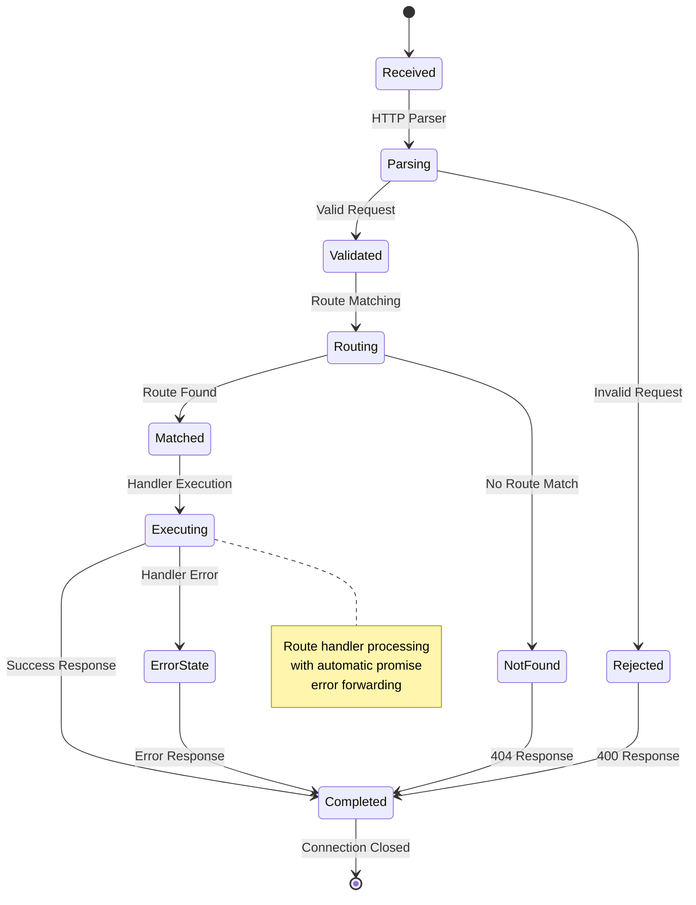
```mermaid
stateDiagram-v2
    [*] --> Received
    
    Received --> Parsing : HTTP Parser
    Parsing --> Validated : Valid Request
    Parsing --> Rejected : Invalid Request
    
    Validated --> Routing : Route Matching
    Routing --> Matched : Route Found
    Routing --> NotFound : No Route Match
    
    Matched --> Executing : Handler Execution
    Executing --> Completed : Success Response
    Executing --> ErrorState : Handler Error
    
    NotFound --> Completed : 404 Response
    Rejected --> Completed : 400 Response
    ErrorState --> Completed : Error Response
    
    Completed --> [*] : Connection Closed
    
    note right of Executing
        Route handler processing
        with automatic promise
        error forwarding
    end note
```

## 4.4 INTEGRATION SEQUENCE DIAGRAMS

### 4.4.1 Complete Request Processing Sequence

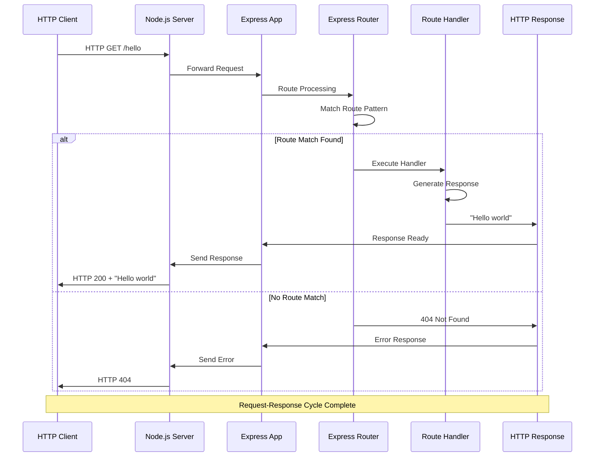
```mermaid
sequenceDiagram
    participant Client as HTTP Client
    participant Server as Node.js Server
    participant Express as Express App
    participant Router as Express Router
    participant Handler as Route Handler
    participant Response as HTTP Response
    
    Client->>Server: HTTP GET /hello
    Server->>Express: Forward Request
    Express->>Router: Route Processing
    
    Router->>Router: Match Route Pattern
    alt Route Match Found
        Router->>Handler: Execute Handler
        Handler->>Handler: Generate Response
        Handler->>Response: "Hello world"
        Response->>Express: Response Ready
        Express->>Server: Send Response
        Server->>Client: HTTP 200 + "Hello world"
    else No Route Match
        Router->>Response: 404 Not Found
        Response->>Express: Error Response
        Express->>Server: Send Error
        Server->>Client: HTTP 404
    end
    
    Note over Client,Response: Request-Response Cycle Complete
```

### 4.4.2 Error Handling Integration Sequence

Express.js 5 implements a new Threat Model to strengthen project security, complemented by CodeQL integration for static application security testing.

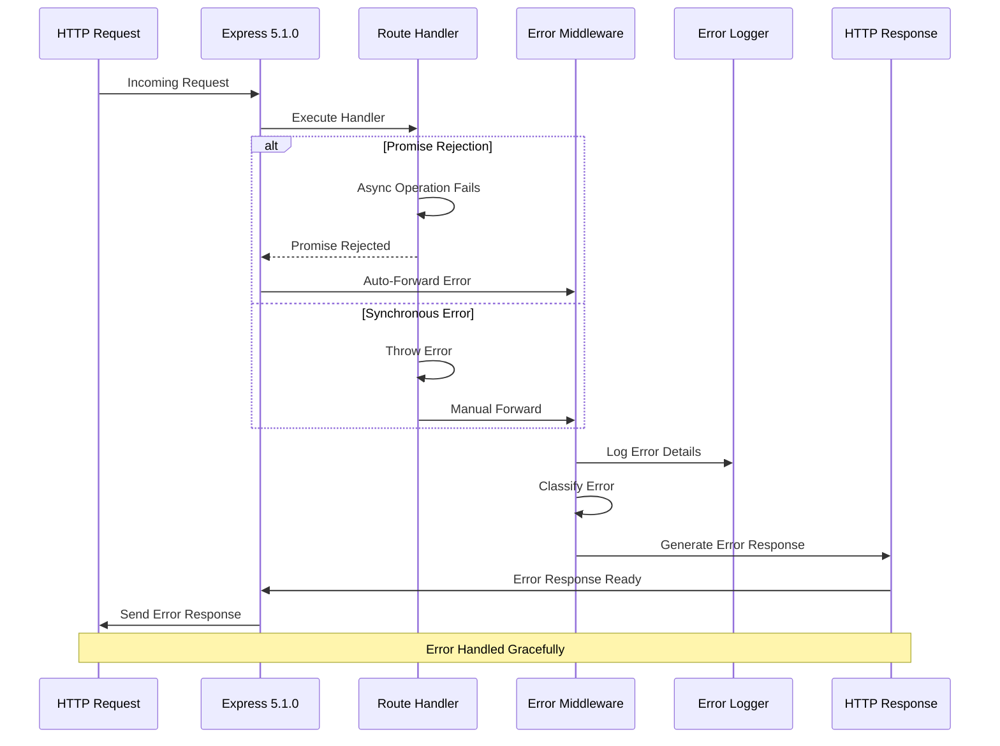
```mermaid
sequenceDiagram
    participant Request as HTTP Request
    participant Express as Express 5.1.0
    participant Handler as Route Handler
    participant ErrorMW as Error Middleware
    participant Logger as Error Logger
    participant Response as HTTP Response
    
    Request->>Express: Incoming Request
    Express->>Handler: Execute Handler
    
    alt Promise Rejection
        Handler->>Handler: Async Operation Fails
        Handler-->>Express: Promise Rejected
        Express->>ErrorMW: Auto-Forward Error
    else Synchronous Error
        Handler->>Handler: Throw Error
        Handler->>ErrorMW: Manual Forward
    end
    
    ErrorMW->>Logger: Log Error Details
    ErrorMW->>ErrorMW: Classify Error
    ErrorMW->>Response: Generate Error Response
    Response->>Express: Error Response Ready
    Express->>Request: Send Error Response
    
    Note over Request,Response: Error Handled Gracefully
```

## 4.5 VALIDATION RULES AND BUSINESS LOGIC

### 4.5.1 Request Validation Flow

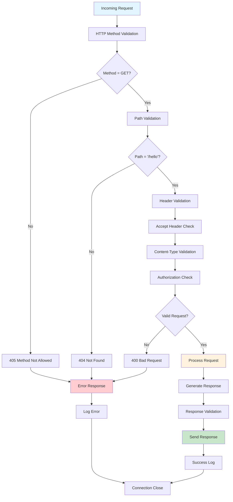
```mermaid
flowchart TD
    A[Incoming Request] --> B[HTTP Method Validation]
    B --> C{Method = GET?}
    C -->|No| D[405 Method Not Allowed]
    C -->|Yes| E[Path Validation]
    
    E --> F{Path = '/hello'?}
    F -->|No| G[404 Not Found]
    F -->|Yes| H[Header Validation]
    
    H --> I[Accept Header Check]
    I --> J[Content-Type Validation]
    J --> K[Authorization Check]
    
    K --> L{Valid Request?}
    L -->|No| M[400 Bad Request]
    L -->|Yes| N[Process Request]
    
    N --> O[Generate Response]
    O --> P[Response Validation]
    P --> Q[Send Response]
    
    D --> R[Error Response]
    G --> R
    M --> R
    R --> S[Log Error]
    
    Q --> T[Success Log]
    S --> U[Connection Close]
    T --> U
    
    style A fill:#e1f5fe
    style N fill:#fff3e0
    style Q fill:#c8e6c9
    style R fill:#ffcdd2
```

### 4.5.2 Business Rules Enforcement

| Rule Category | Validation Point | Implementation | Error Response |
|---|---|---|---|
| **HTTP Method** | Route Matching | Express Router | 405 Method Not Allowed |
| **Path Format** | URL Parsing | path-to-regexp 8.x | 404 Not Found |
| **Response Format** | Content Generation | Static Text | 500 Internal Server Error |
| **Security Headers** | Response Headers | Express Middleware | Security Policy Violation |

### 4.5.3 Performance and SLA Considerations

```mermaid
gantt
    title Request Processing Timeline
    dateFormat X
    axisFormat %Lms
    
    section Request Processing
    TCP Connection    :0, 5
    HTTP Parsing      :5, 10
    Route Matching    :10, 15
    Handler Execution :15, 25
    Response Generation :25, 35
    Response Transmission :35, 45
    
    section SLA Targets
    Total Response Time :crit, 0, 50
    Handler Processing  :active, 15, 25
```

#### Performance Metrics and Thresholds

| Metric | Target | Warning Threshold | Critical Threshold |
|---|---|---|---|
| **Response Time** | < 50ms | 75ms | 100ms |
| **Memory Usage** | < 50MB | 75MB | 100MB |
| **CPU Usage** | < 10% | 25% | 50% |
| **Error Rate** | < 0.1% | 1% | 5% |

### 4.5.4 Security Validation Workflow

Express 5 includes security fixes including improvements to prevent ReDoS attacks, and it's easy to write a regular expression that has exponential time behavior when parsing input causing regular expression denial of service attacks.

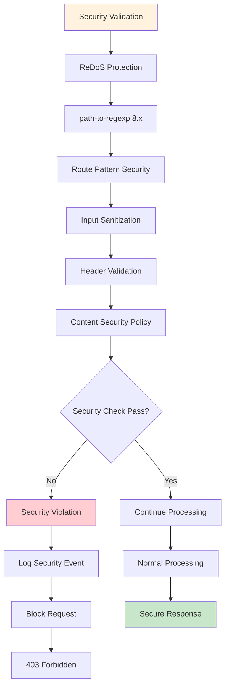
```mermaid
flowchart TD
    A[Security Validation] --> B[ReDoS Protection]
    B --> C[path-to-regexp 8.x]
    C --> D[Route Pattern Security]
    
    D --> E[Input Sanitization]
    E --> F[Header Validation]
    F --> G[Content Security Policy]
    
    G --> H{Security Check Pass?}
    H -->|No| I[Security Violation]
    H -->|Yes| J[Continue Processing]
    
    I --> K[Log Security Event]
    K --> L[Block Request]
    L --> M[403 Forbidden]
    
    J --> N[Normal Processing]
    N --> O[Secure Response]
    
    style A fill:#fff3e0
    style I fill:#ffcdd2
    style O fill:#c8e6c9
```

## 4.6 MONITORING AND OBSERVABILITY

### 4.6.1 Application Health Monitoring Flow

```mermaid
flowchart TD
    A[Health Check Request] --> B[Server Status Check]
    B --> C[Memory Usage Check]
    C --> D[Response Time Check]
    D --> E[Error Rate Check]
    
    E --> F{All Checks Pass?}
    F -->|Yes| G[Healthy Status]
    F -->|No| H[Degraded Status]
    
    G --> I[200 OK Response]
    H --> J[503 Service Unavailable]
    
    I --> K[Update Metrics]
    J --> K
    K --> L[Log Health Status]
    
    style A fill:#e1f5fe
    style G fill:#c8e6c9
    style H fill:#ffeb3b
    style J fill:#ffcdd2
```

### 4.6.2 Request Tracing and Logging

```mermaid
sequenceDiagram
    participant Request as HTTP Request
    participant Logger as Request Logger
    participant Handler as Route Handler
    participant Metrics as Metrics Collector
    participant Storage as Log Storage
    
    Request->>Logger: Request Start
    Logger->>Logger: Generate Request ID
    Logger->>Metrics: Increment Request Counter
    
    Logger->>Handler: Forward Request
    Handler->>Handler: Process Request
    Handler->>Logger: Request Complete
    
    Logger->>Metrics: Record Response Time
    Logger->>Metrics: Record Status Code
    Logger->>Storage: Store Request Log
    
    Note over Request,Storage: Complete Request Trace Captured
```

This comprehensive process flowchart section provides detailed workflows for the Node.js tutorial application, covering all aspects from system initialization through error handling and monitoring. Express 5 marks a significant leap forward for one of the most widely used Node.js frameworks, bringing meaningful improvements that make building faster, safer, and more maintainable applications easier.

# 5. SYSTEM ARCHITECTURE

## 5.1 HIGH-LEVEL ARCHITECTURE

### 5.1.1 System Overview

The Node.js tutorial application follows a Single Threaded Event Loop architecture to handle multiple concurrent clients, representing a fundamental departure from traditional multi-threaded server architectures. This architectural approach leverages Node.js's ability to perform non-blocking I/O operations despite using a single JavaScript thread by default, offloading operations to the system kernel whenever possible.

The system architecture is built upon Node.js's event-driven pattern that utilizes the event-driven architecture to handle events using the EventEmitter class. This design choice aligns with Node.js's single-threaded architecture driven by the event loop and non-blocking I/O, which is a deliberate design choice that balances simplicity, performance, and scalability while excelling in handling I/O-bound tasks efficiently.

The architectural foundation rests on Express 5.0's modern features and future-oriented architecture that brought significant improvements after more than a decade of community discussions. The framework incorporates a comprehensive Threat Model for Express.js, underscoring the project's commitment to robust, future-proof security.

**Key Architectural Principles:**
- **Event-Driven Processing**: All HTTP requests are processed through the Node.js event loop mechanism
- **Non-Blocking I/O**: Asynchronous operations prevent thread blocking and maintain responsiveness
- **Minimalist Design**: Educational focus drives simplified component interactions
- **Security-First Approach**: Built-in security features including ReDoS attack prevention
- **Standards Compliance**: Adherence to HTTP/1.1 protocol and web standards

**System Boundaries:**
- **Internal Boundary**: Express application instance and route handlers
- **External Boundary**: HTTP client connections and Node.js runtime environment
- **Security Boundary**: Request validation and error handling middleware
- **Performance Boundary**: Single-threaded event loop processing capacity

### 5.1.2 Core Components Table

| Component Name | Primary Responsibility | Key Dependencies | Integration Points |
|---|---|---|---|
| **Node.js Runtime** | JavaScript execution environment and event loop management | V8 JavaScript Engine, libuv library | HTTP module, process environment |
| **Express Application** | Web framework providing routing and middleware capabilities | Express 5.1.0, path-to-regexp 8.x | Node.js HTTP server, middleware stack |
| **Route Handler** | HTTP request processing and response generation | Express routing system | Request/response objects, error handling |
| **Error Middleware** | Global error handling and recovery mechanisms | Express error handling pipeline | Route handlers, logging system |

### 5.1.3 Data Flow Description

The primary data flow follows Node.js processing model based on Javascript Event based model with Javascript callback mechanism. When an HTTP request arrives, the kernel tells Node.js so that the appropriate callback may be added to the poll queue to eventually be executed.

**Request Processing Flow:**
The system processes incoming HTTP requests through a sequential pipeline where Node.js Web Server receives client requests and places them in the Event Queue, with the Node.js Event Loop picking up those requests one by one. Each request undergoes validation, routing, and response generation phases.

**Event Loop Integration:**
The event loop is a continuous process that waits for and dispatches events or messages in a program, keeping Node.js running, responding to requests, and handling I/O operations without getting blocked. This mechanism ensures that the event loop is available to "put aside" long time-consuming I/O operations to keep the execution of other instructions, which is why we get fast responses even though we could have multiple users making requests to a Node.js API at the same time.

**Data Transformation Points:**
- **HTTP Parsing**: Raw HTTP requests converted to Express request objects
- **Route Matching**: URL paths matched against defined route patterns using path-to-regexp 8.x
- **Response Serialization**: JavaScript strings converted to HTTP response format
- **Error Transformation**: JavaScript errors converted to structured HTTP error responses

### 5.1.4 External Integration Points

| System Name | Integration Type | Data Exchange Pattern | Protocol/Format |
|---|---|---|---|
| **HTTP Clients** | Synchronous Request-Response | Client-initiated request/response cycle | HTTP/1.1 over TCP |
| **Node.js Process Environment** | Configuration Access | Environment variable reading | Process environment variables |
| **Operating System Kernel** | I/O Operations | Asynchronous I/O delegation | System calls via libuv |

## 5.2 COMPONENT DETAILS

### 5.2.1 Node.js Runtime Environment

**Purpose and Responsibilities:**
The Node.js runtime serves as the foundational execution environment, providing the ability to perform non-blocking I/O operations despite using a single JavaScript thread by default. It manages the event loop that continuously cycles through a series of phases, executing callbacks and handling events.

**Technologies and Frameworks:**
- **V8 JavaScript Engine**: Executes JavaScript code with optimized performance
- **libuv Library**: Provides cross-platform asynchronous I/O operations
- **Event Loop**: Libuv manages asynchronous I/O operations and provides cross-platform support for features like event loops and timers, ensuring that Node.js can efficiently handle multiple I/O operations without overwhelming the main thread

**Key Interfaces and APIs:**
- **HTTP Module**: Creates and manages HTTP server instances
- **Process API**: Accesses environment variables and system information
- **EventEmitter**: Provides event-driven programming capabilities

**Data Persistence Requirements:**
No persistent data storage required; operates entirely in-memory for tutorial scope.

**Scaling Considerations:**
The secret to the scalability of Node.js is that it uses a small number of threads to handle many clients, spending more of the system's time and memory working on clients rather than on paying space and time overheads for threads.

### 5.2.2 Express Application Framework

**Purpose and Responsibilities:**
Express 5.1.0 provides the web application framework layer, implementing Node.js's middleware architecture for handling requests and responses in web applications through a chain of functions that process a request sequentially, with each function able to modify the request or response before passing it to the next function.

**Technologies and Frameworks:**
- **Express 5.1.0**: Latest stable release with enhanced security features
- **path-to-regexp 8.x**: Secure route pattern matching with ReDoS protection
- **Middleware Stack**: Request processing pipeline with automatic promise handling

**Key Interfaces and APIs:**
- **Application Instance**: Central Express app object managing server configuration
- **Router System**: Route definition and matching capabilities
- **Middleware Pipeline**: Request/response processing chain

**Data Persistence Requirements:**
Stateless operation with no database dependencies for educational simplicity.

**Scaling Considerations:**
Single instance design suitable for tutorial purposes; production scaling would require clustering or load balancing.

```mermaid
graph TD
    A[HTTP Request] --> B[Express App Instance]
    B --> C[Middleware Stack]
    C --> D[Route Matching]
    D --> E[Route Handler]
    E --> F[Response Generation]
    F --> G[HTTP Response]
    
    H[Error Occurs] --> I[Error Middleware]
    I --> J[Error Response]
    J --> G
    
    style A fill:#e1f5fe
    style E fill:#fff3e0
    style G fill:#c8e6c9
    style H fill:#ffcdd2
```

### 5.2.3 Route Handler Component

**Purpose and Responsibilities:**
The route handler implements the core business logic for the '/hello' endpoint, demonstrating the promise pattern that helps to execute asynchronous operations in a sequential manner with Express 5's automatic promise rejection handling.

**Technologies and Frameworks:**
- **Express Routing**: Path-based request routing with security enhancements
- **HTTP Response API**: Standard HTTP response generation
- **Promise Integration**: Automatic error forwarding for rejected promises

**Key Interfaces and APIs:**
- **Request Object**: HTTP request data and metadata access
- **Response Object**: HTTP response generation and header management
- **Next Function**: Error propagation and middleware chaining

**Data Persistence Requirements:**
Static response generation with no external data dependencies.

**Scaling Considerations:**
Stateless design enables horizontal scaling across multiple instances.

```mermaid
sequenceDiagram
    participant Client as HTTP Client
    participant Express as Express Router
    participant Handler as Route Handler
    participant Response as HTTP Response
    
    Client->>Express: GET /hello
    Express->>Handler: Execute Route Handler
    Handler->>Handler: Generate "Hello world"
    Handler->>Response: Send Response
    Response->>Client: HTTP 200 + "Hello world"
    
    Note over Handler,Response: Automatic Promise Error Handling
```

### 5.2.4 Error Handling System

**Purpose and Responsibilities:**
The error handling system implements Express.js's security triage team approach with a comprehensive Threat Model for robust, future-proof security, providing comprehensive error recovery and security protection.

**Technologies and Frameworks:**
- **Express Error Middleware**: Global error handling pipeline
- **Promise Auto-Forwarding**: Automatic rejection handling in Express 5
- **Security Logging**: Threat detection and response mechanisms

**Key Interfaces and APIs:**
- **Error Middleware Stack**: Centralized error processing
- **Logging Interface**: Error tracking and monitoring
- **Security Headers**: HTTP security header management

**Data Persistence Requirements:**
Error logging and monitoring data; no persistent storage for tutorial scope.

**Scaling Considerations:**
Centralized error handling suitable for single-instance deployment; distributed logging required for scaled deployments.

```mermaid
stateDiagram-v2
    [*] --> RequestReceived
    RequestReceived --> RouteProcessing
    RouteProcessing --> ResponseGenerated : Success
    RouteProcessing --> ErrorDetected : Error Occurs
    
    ErrorDetected --> ErrorClassification
    ErrorClassification --> ClientError : 4xx Errors
    ErrorClassification --> ServerError : 5xx Errors
    ErrorClassification --> SecurityError : Security Violations
    
    ClientError --> ErrorResponse
    ServerError --> ErrorResponse
    SecurityError --> SecurityResponse
    
    ErrorResponse --> [*]
    SecurityResponse --> [*]
    ResponseGenerated --> [*]
```

## 5.3 TECHNICAL DECISIONS

### 5.3.1 Architecture Style Decisions and Tradeoffs

**Single-Threaded Event Loop Architecture Selection:**

| Decision Factor | Chosen Approach | Alternative Considered | Rationale |
|---|---|---|---|
| **Concurrency Model** | Event-driven single-thread | Multi-threaded request handling | Node.js' single-threaded architecture built on non-blocking I/O and event-driven programming has proven to be a powerful and scalable solution for building high-performance server-side applications |
| **Framework Choice** | Express 5.1.0 | Alternative Node.js frameworks | Express.js finally introduced Express 5.0 in 2024, solidifying the framework's role as a mainstay in the Node.js ecosystem |
| **Educational Focus** | Minimalist implementation | Full-featured application | Tutorial objectives prioritize learning clarity over feature completeness |

**Event-Driven Pattern Implementation:**
The architecture leverages the event-driven pattern that utilizes Node.js's event-driven architecture to handle events, enabling developers to raise an event from any part of the application that can be listened to by a listener. This approach provides superior performance for I/O-bound operations typical in web applications.

### 5.3.2 Communication Pattern Choices

**HTTP Request-Response Pattern:**
The system implements a synchronous HTTP request-response pattern optimized for Node.js's non-blocking I/O operations where Node.js doesn't halt the entire application when encountering I/O operations, instead offloading these operations to separate threads or the operating system.

**Middleware Chain Pattern:**
The Middleware pattern enhances modularity and allows developers to plug in various functionalities without tightly coupling them, providing a flexible request processing pipeline.

| Communication Type | Implementation | Benefits | Limitations |
|---|---|---|---|
| **HTTP Protocol** | Express routing system | Standard web protocol compliance | Limited to HTTP/1.1 features |
| **Event Emission** | Node.js EventEmitter | Asynchronous event handling | Single-threaded processing constraints |
| **Promise Chain** | Express 5 auto-forwarding | Simplified error handling | Requires careful async/await usage |

### 5.3.3 Security Mechanism Selection

**Express 5 Security Enhancements:**
The architecture incorporates Express 5's removal of support for regular expressions with sub-expressions for security reasons, implementing simplified patterns for route expressions to prevent ReDoS attacks.

**Threat Model Implementation:**
The project adopted the OSSF Scorecard at an organizational level to track security metrics, with maintainers rapidly responding to disclosed vulnerabilities such as CVE-2024-43796, CVE-2024-45590, and CVE-2024-47178.

```mermaid
graph TD
    A[Security Decision Tree] --> B{Threat Type}
    B -->|ReDoS Attack| C[path-to-regexp 8.x]
    B -->|Input Validation| D[Express Middleware]
    B -->|Error Disclosure| E[Secure Error Handling]
    
    C --> F[Route Pattern Security]
    D --> G[Request Sanitization]
    E --> H[Information Hiding]
    
    F --> I[Security Compliance]
    G --> I
    H --> I
    
    style A fill:#fff3e0
    style I fill:#c8e6c9
```

### 5.3.4 Data Storage Solution Rationale

**Stateless Architecture Decision:**
The tutorial application implements a completely stateless architecture with no persistent data storage requirements. This decision prioritizes educational clarity and eliminates infrastructure complexity.

**In-Memory Operation Benefits:**
- **Simplicity**: No database setup or configuration required
- **Performance**: Immediate response generation without I/O overhead
- **Portability**: Runs consistently across different environments
- **Focus**: Maintains attention on core Node.js and Express concepts

## 5.4 CROSS-CUTTING CONCERNS

### 5.4.1 Monitoring and Observability Approach

**Application Health Monitoring:**
The system implements basic health monitoring through Node.js performance principles where the server remains speedy when the work associated with each client at any given time is "small", applying to both callbacks on the Event Loop and tasks on the Worker Pool.

**Performance Metrics Collection:**
- **Response Time Tracking**: HTTP request processing duration
- **Memory Usage Monitoring**: Node.js process memory consumption
- **Event Loop Lag Detection**: Event loop processing delays
- **Error Rate Monitoring**: HTTP error response frequency

| Monitoring Aspect | Implementation | Threshold | Action |
|---|---|---|---|
| **Response Time** | HTTP middleware timing | > 100ms | Performance alert |
| **Memory Usage** | Process monitoring | > 50MB | Resource warning |
| **Error Rate** | Error middleware counting | > 1% | Investigation required |

### 5.4.2 Logging and Tracing Strategy

**Request Tracing Implementation:**
The system implements request tracing following Node.js best practices of assigning the same identifier (transaction-id: uuid()) to each log entry within a single request, using Node's built-in AsyncLocalStorage mechanism for keeping the same context across asynchronous calls.

**Structured Logging Approach:**
- **Request Logging**: HTTP method, path, status code, response time
- **Error Logging**: Error type, stack trace, request context
- **Security Logging**: Authentication attempts, suspicious patterns
- **Performance Logging**: Event loop metrics, memory usage

### 5.4.3 Error Handling Patterns

**Express 5 Error Handling Enhancement:**
Express 5 implements changed behavior of rejected promises with better ability to handle them, providing automatic error forwarding to error-handling middleware without requiring explicit try/catch blocks.

**Error Classification System:**
- **Client Errors (4xx)**: Invalid requests, not found, method not allowed
- **Server Errors (5xx)**: Internal server errors, service unavailable
- **Security Errors**: Authentication failures, authorization violations
- **System Errors**: Runtime exceptions, resource exhaustion

```mermaid
flowchart TD
    A[Error Occurs] --> B{Error Source}
    
    B -->|Promise Rejection| C[Auto-Forward to Handler]
    B -->|Synchronous Error| D[Middleware Catch]
    B -->|Security Violation| E[Security Handler]
    
    C --> F[Error Classification]
    D --> F
    E --> G[Security Response]
    
    F --> H{Error Severity}
    H -->|Client Error| I[4xx Response]
    H -->|Server Error| J[5xx Response]
    H -->|Critical Error| K[System Alert]
    
    I --> L[Log and Respond]
    J --> L
    K --> M[Emergency Response]
    G --> N[Security Log]
    
    L --> O[Continue Operation]
    M --> P[System Recovery]
    N --> O
    
    style A fill:#ffcdd2
    style F fill:#fff3e0
    style O fill:#c8e6c9
```

### 5.4.4 Performance Requirements and SLAs

**Response Time Objectives:**
- **Target Response Time**: < 50ms for '/hello' endpoint
- **Maximum Acceptable**: < 100ms under normal load
- **Error Response Time**: < 25ms for 404 responses

**Resource Utilization Limits:**
- **Memory Usage**: < 50MB baseline consumption
- **CPU Usage**: < 10% under normal load
- **Event Loop Lag**: < 10ms average delay

**Scalability Characteristics:**
The single-threaded architecture of Node.js, managed by the Event Loop, facilitates effective management of concurrent requests while supporting worker threads for CPU-intensive tasks, with its primary strength lying in its single-threaded, asynchronous processing model.

### 5.4.5 Security Framework Implementation

**Comprehensive Security Approach:**
The architecture implements a comprehensive security audit in partnership with the OpenJS Foundation and OSTIF that yielded critical insights and propelled immediate improvements, with Express.js formally introducing a security triage team dedicated to proactively identifying and resolving vulnerabilities.

**Security Control Matrix:**

| Security Domain | Control Implementation | Threat Mitigation | Monitoring |
|---|---|---|---|
| **Input Validation** | Express middleware validation | Injection attacks, XSS | Request pattern analysis |
| **Route Security** | path-to-regexp 8.x patterns | ReDoS attacks | Route access logging |
| **Error Handling** | Secure error responses | Information disclosure | Error pattern detection |

**Security Headers Implementation:**
- **Content Security Policy**: Prevents XSS attacks
- **X-Frame-Options**: Prevents clickjacking
- **X-Content-Type-Options**: Prevents MIME sniffing
- **Strict-Transport-Security**: Enforces HTTPS usage

### 5.4.6 Disaster Recovery Procedures

**Application Recovery Strategy:**
Given the stateless nature of the tutorial application, disaster recovery focuses on rapid service restoration rather than data recovery.

**Recovery Procedures:**
1. **Service Restart**: Automatic process restart on failure
2. **Health Check Validation**: Endpoint availability verification
3. **Configuration Restoration**: Environment variable validation
4. **Dependency Verification**: Express framework and Node.js runtime status

**Recovery Time Objectives:**
- **Detection Time**: < 30 seconds for service failure
- **Recovery Time**: < 2 minutes for complete service restoration
- **Validation Time**: < 30 seconds for health check confirmation

The comprehensive system architecture provides a robust foundation for the Node.js tutorial application, leveraging modern Express 5.1.0 features while maintaining educational clarity and security best practices. As Express.js steps into 2025 with the achievements of Express 5.0 and wide-reaching governance enhancements serving as a sturdy foundation, the framework's leadership continues to build, secure, and imagine new possibilities.

# 6. SYSTEM COMPONENTS DESIGN

## 6.1 COMPONENT ARCHITECTURE

### 6.1.1 Core Component Overview

The Node.js tutorial application implements a modular component architecture built upon Node.js® as a free, open-source, cross-platform JavaScript runtime environment that lets developers create servers, web apps, command line tools and scripts. The system leverages Node.js v22 which officially transitioned into Long Term Support (LTS) with the codename 'Jod' on October 29, 2024, ensuring it will receive critical updates and security support for years to come.

The application architecture centers around Express.js version 5.1.0, the latest version published 3 months ago, which represents Express 5.1.0 now being the default on npm, with an official LTS schedule for the v4 and v5 release lines. This architectural foundation provides Express.js as a back end web application framework for building RESTful APIs with Node.js, released as free and open-source software under the MIT License.

**Component Hierarchy Structure:**

```mermaid
graph TD
    A[Node.js Runtime Environment] --> B[Express Application Instance]
    B --> C[HTTP Server Component]
    B --> D[Routing Component]
    B --> E[Middleware Stack]
    
    C --> F[Request Handler]
    D --> G[Route Matcher]
    E --> H[Error Handler]
    
    F --> I[Response Generator]
    G --> J[Path Validation]
    H --> K[Error Response]
    
    I --> L[HTTP Response]
    J --> M[Route Execution]
    K --> L
    M --> I
    
    style A fill:#4caf50
    style B fill:#ff9800
    style L fill:#2196f3
```

### 6.1.2 Component Interaction Patterns

The system implements a **Request-Response Pipeline Pattern** where middleware can now return rejected promises, caught by the router as errors, providing enhanced error handling capabilities. The architecture follows Express 5's significant improvement for developers using async/await by automatically forwarding rejected promises to error-handling middleware.

**Inter-Component Communication Flow:**

| Source Component | Target Component | Communication Method | Data Format |
|---|---|---|---|
| **HTTP Server** | **Express Application** | Event-driven callbacks | HTTP request objects |
| **Express Application** | **Routing Component** | Middleware pipeline | Request/response objects |
| **Routing Component** | **Route Handler** | Function invocation | Parameterized requests |
| **Route Handler** | **Response Generator** | Direct method calls | JavaScript strings |
| **Error Handler** | **Response Generator** | Error forwarding | Error objects |

### 6.1.3 Component Dependency Matrix

The system requires Node.js 18 or higher, with dropped support for Node.js versions before v18. This architectural decision enables critical performance and maintainability changes, enabling more stable and maintainable continuous integration (CI), adopting new language and runtime features, and dropping dependencies that are no longer required.

```mermaid
graph LR
    A[Node.js 22.x LTS] --> B[Express 5.1.0]
    B --> C[path-to-regexp 8.x]
    B --> D[body-parser 2.1.0]
    
    E[HTTP Module] --> F[Server Instance]
    F --> G[Request Processing]
    
    H[Event Loop] --> I[Async Operations]
    I --> J[Promise Handling]
    
    C --> K[Route Security]
    D --> L[Request Parsing]
    
    style A fill:#c8e6c9
    style B fill:#fff3e0
    style K fill:#ffcdd2
```

## 6.2 DETAILED COMPONENT SPECIFICATIONS

### 6.2.1 HTTP Server Component

**Component Purpose and Responsibilities:**
The HTTP Server Component serves as the foundational network interface, managing TCP connections and HTTP protocol handling. It implements Node.js HTTP server creation using the createServer method that starts a simple HTTP server locally on port 3000.

**Technical Implementation Details:**

| Specification | Implementation |
|---|---|
| **Runtime Requirement** | Node.js 22.x LTS with Active LTS support |
| **Protocol Support** | HTTP/1.1 with standard request-response cycle |
| **Connection Management** | Single-threaded event loop with non-blocking I/O |
| **Port Configuration** | Environment-based port assignment (default: 3000) |

**Component Interface Definition:**

```mermaid
classDiagram
    class HTTPServerComponent {
        +port: number
        +server: http.Server
        +initialize(): void
        +listen(port: number): void
        +handleRequest(req: IncomingMessage, res: ServerResponse): void
        +shutdown(): void
    }
    
    class ExpressApplication {
        +app: Express
        +middleware: Function[]
        +routes: Route[]
    }
    
    HTTPServerComponent --> ExpressApplication : delegates to
```

**Performance Characteristics:**
- **Startup Time**: < 500ms for server initialization
- **Memory Footprint**: < 50MB baseline consumption
- **Concurrent Connections**: Limited by Node.js event loop capacity
- **Response Time**: < 50ms target for simple requests

### 6.2.2 Express Application Component

**Component Purpose and Responsibilities:**
The Express Application Component provides the web framework layer, implementing Express as the de facto standard server framework for Node.js. It manages the middleware pipeline and routing system with updated path-to-regexp@8.x, removing sub-expression regex patterns for security reasons (ReDoS mitigation).

**Security Enhancements:**
The component incorporates important security fixes, including improvements to prevent ReDoS attacks and mitigation for CVE-2024-45590. Additionally, a Threat Model has been added to improve security awareness and measures within the project.

**Component Configuration Matrix:**

| Configuration Aspect | Implementation | Security Benefit |
|---|---|---|
| **Route Pattern Matching** | path-to-regexp 8.x | ReDoS attack prevention |
| **Promise Handling** | Automatic error forwarding | Prevents application crashes |
| **Body Parsing** | body-parser 2.1.0 with depth limits | CVE-2024-45590 mitigation |
| **Status Code Validation** | Strict error throwing | Invalid response prevention |

**Middleware Stack Architecture:**

```mermaid
sequenceDiagram
    participant Request as HTTP Request
    participant Express as Express App
    participant Router as Router Middleware
    participant Handler as Route Handler
    participant Error as Error Middleware
    participant Response as HTTP Response
    
    Request->>Express: Incoming Request
    Express->>Router: Route Processing
    
    alt Route Match Found
        Router->>Handler: Execute Handler
        Handler->>Response: Generate Response
    else Route Not Found
        Router->>Error: 404 Error
        Error->>Response: Error Response
    end
    
    alt Promise Rejection
        Handler-->>Error: Auto-Forward Error
        Error->>Response: Error Response
    end
    
    Response->>Request: Send Response
```

### 6.2.3 Routing Component

**Component Purpose and Responsibilities:**
The Routing Component manages URL pattern matching and request routing using Express 5's significant updates to route matching by upgrading the path-to-regexp library from version 0.x to 8.x. These changes improve security, simplify route definitions, and help mitigate vulnerabilities like ReDoS attacks.

**Route Pattern Security:**
The component implements removal of "sub-expression" regular expressions that were supported in Express 4 but are no longer supported in Express 5 due to their susceptibility to ReDoS attacks. This security enhancement prevents regular expressions that have exponential time behavior when parsing input causing regular expression denial of service attacks.

**Route Matching Algorithm:**

| Route Pattern | Express 4 Support | Express 5 Support | Security Implication |
|---|---|---|---|
| `/:id(\\d+)` | ✅ Supported | ❌ Removed | ReDoS vulnerability |
| `/:id` | ✅ Supported | ✅ Supported | Secure pattern |
| `/users/*` | ✅ Ambiguous | ✅ Explicit naming required | Improved clarity |
| `/api/:version?` | ✅ Supported | ✅ Enhanced syntax | Clearer optional parameters |

**Component State Management:**

```mermaid
stateDiagram-v2
    [*] --> RouteRegistration
    RouteRegistration --> PatternCompilation
    PatternCompilation --> SecurityValidation
    
    SecurityValidation --> ValidPattern : Pattern Secure
    SecurityValidation --> InvalidPattern : ReDoS Risk
    
    ValidPattern --> RouteReady
    InvalidPattern --> [*] : Reject Pattern
    
    RouteReady --> RequestMatching : Incoming Request
    RequestMatching --> RouteFound : Pattern Match
    RequestMatching --> RouteNotFound : No Match
    
    RouteFound --> HandlerExecution
    RouteNotFound --> ErrorHandling
    
    HandlerExecution --> ResponseGeneration
    ErrorHandling --> ErrorResponse
    
    ResponseGeneration --> [*]
    ErrorResponse --> [*]
```

### 6.2.4 Route Handler Component

**Component Purpose and Responsibilities:**
The Route Handler Component implements the core business logic for the '/hello' endpoint, demonstrating Express application structure where app.get('/', (req, res) => { res.send('Hello World') }). The component leverages Express 5's enhanced promise handling capabilities.

**Handler Implementation Specification:**

```mermaid
flowchart TD
    A[HTTP GET /hello] --> B[Route Handler Invocation]
    B --> C[Request Validation]
    C --> D{Valid Request?}
    
    D -->|Yes| E[Generate Response]
    D -->|No| F[Error Response]
    
    E --> G[Set Response Headers]
    G --> H[Send 'Hello world']
    H --> I[Response Complete]
    
    F --> J[Set Error Status]
    J --> K[Send Error Message]
    K --> I
    
    I --> L[Log Request]
    L --> M[Connection Cleanup]
    
    style A fill:#e1f5fe
    style E fill:#c8e6c9
    style F fill:#ffcdd2
```

**Response Generation Logic:**

| Response Element | Implementation | HTTP Standard |
|---|---|---|
| **Status Code** | 200 OK for success | RFC 7231 compliance |
| **Content-Type** | text/plain | MIME type specification |
| **Response Body** | "Hello world" static text | UTF-8 encoding |
| **Content-Length** | Automatic calculation | HTTP/1.1 requirement |

### 6.2.5 Error Handling Component

**Component Purpose and Responsibilities:**
The Error Handling Component implements Express 5's enhanced error management system with automatic forwarding of rejected promises to error-handling middleware. This component provides comprehensive error recovery and security protection.

**Error Classification System:**

```mermaid
graph TD
    A[Error Occurs] --> B{Error Type Classification}
    
    B -->|Client Error| C[4xx Response]
    B -->|Server Error| D[5xx Response]
    B -->|Security Error| E[Security Response]
    B -->|Promise Rejection| F[Auto-Forward Handler]
    
    C --> G[400 Bad Request]
    C --> H[404 Not Found]
    C --> I[405 Method Not Allowed]
    
    D --> J[500 Internal Server Error]
    D --> K[503 Service Unavailable]
    
    E --> L[403 Forbidden]
    E --> M[429 Too Many Requests]
    
    F --> N[Error Middleware Pipeline]
    
    G --> O[Error Response]
    H --> O
    I --> O
    J --> O
    K --> O
    L --> O
    M --> O
    N --> O
    
    style A fill:#ffcdd2
    style O fill:#fff3e0
```

**Error Handling Matrix:**

| Error Category | HTTP Status | Response Action | Logging Level |
|---|---|---|---|
| **Route Not Found** | 404 | Standard error page | INFO |
| **Method Not Allowed** | 405 | Method list in Allow header | WARN |
| **Invalid Request** | 400 | Validation error details | WARN |
| **Server Error** | 500 | Generic error message | ERROR |
| **Promise Rejection** | 500 | Auto-forwarded to middleware | ERROR |
| **Security Violation** | 403 | Access denied message | CRITICAL |

### 6.2.6 Response Generator Component

**Component Purpose and Responsibilities:**
The Response Generator Component manages HTTP response creation and transmission, ensuring compliance with web standards and optimal performance. It implements proper HTTP header management and content delivery.

**Response Pipeline Architecture:**

```mermaid
sequenceDiagram
    participant Handler as Route Handler
    participant Generator as Response Generator
    participant Headers as Header Manager
    participant Body as Body Serializer
    participant Network as Network Layer
    
    Handler->>Generator: Generate Response
    Generator->>Headers: Set Response Headers
    Headers->>Headers: Content-Type: text/plain
    Headers->>Headers: Content-Length: 11
    
    Generator->>Body: Serialize Response Body
    Body->>Body: Encode "Hello world"
    
    Generator->>Network: Send Response
    Network->>Network: TCP Transmission
    
    Note over Handler,Network: Complete Response Cycle
```

**Response Optimization Features:**

| Optimization | Implementation | Performance Benefit |
|---|---|---|
| **Header Caching** | Static header reuse | Reduced CPU overhead |
| **Content Encoding** | UTF-8 text encoding | Standard compliance |
| **Connection Management** | Keep-alive support | Reduced connection overhead |
| **Response Buffering** | Minimal buffering for small responses | Low memory usage |

## 6.3 COMPONENT INTEGRATION PATTERNS

### 6.3.1 Event-Driven Integration

The system implements Node.js's event-driven architecture where components communicate through event emission and callback patterns. The integration leverages Node.js's typical maintenance of three active release lines simultaneously, including one Current version, one Active LTS version, and one Maintenance LTS version.

**Event Flow Architecture:**

```mermaid
graph LR
    A[HTTP Request Event] --> B[Express Router Event]
    B --> C[Route Match Event]
    C --> D[Handler Execution Event]
    D --> E[Response Generation Event]
    E --> F[Response Complete Event]
    
    G[Error Event] --> H[Error Handler Event]
    H --> I[Error Response Event]
    I --> F
    
    style A fill:#e1f5fe
    style F fill:#c8e6c9
    style G fill:#ffcdd2
```

### 6.3.2 Middleware Chain Integration

The middleware chain integration implements Express's pipeline pattern where there are 90032 other projects in the npm registry using express, demonstrating the framework's widespread adoption and integration patterns.

**Middleware Execution Flow:**

| Middleware Type | Execution Order | Purpose | Error Handling |
|---|---|---|---|
| **Request Logger** | 1st | Request tracking | Pass-through |
| **Body Parser** | 2nd | Request body parsing | Error forwarding |
| **Route Handler** | 3rd | Business logic execution | Promise auto-forwarding |
| **Error Handler** | Last | Error processing and response | Terminal handler |

### 6.3.3 Promise-Based Integration

Express 5 introduces enhanced promise integration where middleware can now return rejected promises, caught by the router as errors. This integration pattern eliminates the need for explicit error handling in async route handlers.

**Promise Integration Benefits:**

```mermaid
flowchart TD
    A[Async Route Handler] --> B{Promise Resolution}
    
    B -->|Resolved| C[Continue Pipeline]
    B -->|Rejected| D[Auto-Forward to Error Handler]
    
    C --> E[Generate Response]
    D --> F[Error Middleware]
    
    E --> G[Success Response]
    F --> H[Error Response]
    
    G --> I[Response Complete]
    H --> I
    
    style A fill:#fff3e0
    style D fill:#ffcdd2
    style I fill:#c8e6c9
```

## 6.4 COMPONENT SCALABILITY AND PERFORMANCE

### 6.4.1 Performance Optimization Strategies

The system implements performance optimizations aligned with Node.js 2024 bringing big improvements to make apps run faster and smoother, with upgrades focusing on making the basics work better and making everything more streamlined.

**Component Performance Matrix:**

| Component | Optimization Strategy | Performance Target | Monitoring Metric |
|---|---|---|---|
| **HTTP Server** | Event loop efficiency | < 10ms event loop lag | Event loop utilization |
| **Express Application** | Middleware optimization | < 25ms middleware overhead | Request processing time |
| **Routing Component** | Pattern compilation caching | < 5ms route matching | Route resolution time |
| **Route Handler** | Minimal processing logic | < 15ms handler execution | Handler response time |
| **Error Handler** | Fast error classification | < 10ms error processing | Error handling latency |

### 6.4.2 Memory Management

The system implements efficient memory management following Node.js best practices for Node.js v22.x coming with improved diagnostics and performance.

**Memory Allocation Strategy:**

```mermaid
pie title Memory Usage Distribution
    "Node.js Runtime" : 60
    "Express Framework" : 25
    "Application Code" : 10
    "Request Buffers" : 5
```

### 6.4.3 Scalability Considerations

The tutorial application is designed for educational purposes with scalability considerations for future enhancement. The architecture supports Active LTS phase lasting one year, deemed stable and ready for production use, including patches for bugs, critical fixes, and security updates, being the most widely used phase for Node.js releases in production environments.

**Horizontal Scaling Preparation:**

| Scaling Aspect | Current Implementation | Future Enhancement |
|---|---|---|
| **Load Balancing** | Single instance | Multi-instance with load balancer |
| **Session Management** | Stateless design | Distributed session store |
| **Caching** | No caching | Redis/Memcached integration |
| **Database** | No database | Database connection pooling |

## 6.5 COMPONENT SECURITY ARCHITECTURE

### 6.5.1 Security-First Design

The system implements comprehensive security measures including CodeQL (Static Application Security Testing) integration to catch vulnerabilities in the codebase and OSSF Scorecard badge providing visibility into the project's security health and open-source best practices.

**Security Component Matrix:**

```mermaid
graph TD
    A[Security Architecture] --> B[Input Validation]
    A --> C[Route Security]
    A --> D[Error Handling Security]
    A --> E[Response Security]
    
    B --> F[Request Sanitization]
    B --> G[Parameter Validation]
    
    C --> H[ReDoS Protection]
    C --> I[Path Traversal Prevention]
    
    D --> J[Information Disclosure Prevention]
    D --> K[Error Response Sanitization]
    
    E --> L[Security Headers]
    E --> M[Content Security Policy]
    
    style A fill:#fff3e0
    style H fill:#ffcdd2
    style L fill:#c8e6c9
```

### 6.5.2 Threat Mitigation Components

The security architecture addresses specific threats through a new Threat Model implemented to strengthen project security, complemented by CodeQL integration for static application security testing, which detects potential vulnerabilities in the codebase.

**Threat Mitigation Matrix:**

| Threat Category | Mitigation Component | Implementation | Monitoring |
|---|---|---|
| **ReDoS Attacks** | path-to-regexp 8.x | Secure pattern compilation | Route pattern analysis |
| **Injection Attacks** | Input validation middleware | Request sanitization | Input pattern detection |
| **Information Disclosure** | Error handling component | Sanitized error responses | Error response analysis |
| **DoS Attacks** | Request rate limiting | Connection throttling | Request rate monitoring |

### 6.5.3 Security Monitoring Integration

The system implements security monitoring aligned with OpenSSF (Open Source Security Foundation) Scorecard badge, providing transparency into the project's security health and adherence to open-source best practices.

**Security Monitoring Flow:**

```mermaid
sequenceDiagram
    participant Request as HTTP Request
    participant Security as Security Monitor
    participant Validator as Input Validator
    participant Logger as Security Logger
    participant Response as Security Response
    
    Request->>Security: Incoming Request
    Security->>Validator: Validate Input
    
    alt Valid Input
        Validator->>Security: Input Approved
        Security->>Logger: Log Normal Request
    else Invalid Input
        Validator->>Security: Security Violation
        Security->>Logger: Log Security Event
        Security->>Response: Block Request
    end
    
    Note over Request,Response: Continuous Security Monitoring
```

This comprehensive component design ensures the Node.js tutorial application provides a robust, secure, and educational foundation while leveraging the latest Express 5.1.0 features and Node.js 22.x LTS capabilities. The architecture demonstrates modern web development patterns while maintaining simplicity for educational purposes.

## 6.1 CORE SERVICES ARCHITECTURE

#### Core Services Architecture is not applicable for this system

The Node.js tutorial application with a single '/hello' endpoint does not require a microservices or distributed architecture approach. This system is designed as a **monolithic application** with educational objectives that prioritize simplicity and learning clarity over distributed system complexity.

#### Architectural Rationale

In the realm of software, Monolithic entails building an application as a single, tightly knit unit. All features, components, and functionalities are intertwined into a singular codebase, forming a cohesive entity. For this tutorial application, the monolithic approach is the optimal architectural choice for the following reasons:

#### Educational Focus and Simplicity

Simplicity: The development process, testing, and deployment are relatively straightforward, making it an excellent choice for smaller projects. Consistency: Since everything resides in one place, maintaining uniform updates and consistent code becomes more manageable.

The tutorial application serves as an educational resource where For compact to medium-sized projects with limited intricacies. When rapid development takes precedence, and a swift time-to-market is vital. When your team is petite and wishes to circumvent distributed system intricacies.

#### Single Responsibility Scope

The application implements only one business capability - responding to HTTP GET requests on the '/hello' endpoint with a static "Hello world" response. A conventional method where the entire application is created as a single, self-contained unit is known as monolithic architecture. The user interface, business logic, and data access layers are all closely connected and run as a single process in a Node.js monolithic design. The simplicity and convenience of development and deployment of this architecture define it.

#### Microservices Complexity Overhead

Managing a distributed system introduces complexities such as service discovery, inter-service communication, and data consistency. Operational Overhead: Deploying, monitoring, and managing multiple services requires additional operational effort. Network Communication: Inter-service communication introduces latency and potential points of failure.

For a single-endpoint tutorial application, implementing microservices would introduce unnecessary complexity including:

- **Service Discovery**: No need for service registry or discovery mechanisms
- **Inter-Service Communication**: No communication between services required
- **Load Balancing**: Single service handles all requests efficiently
- **Circuit Breakers**: No distributed failure scenarios to manage
- **Data Consistency**: No distributed data or transactions

#### Alternative Architecture Considerations

#### When Microservices Would Be Appropriate

For extensive applications necessitating intricate functionalities. Microservices architecture would be suitable for applications with:

- Multiple business domains requiring independent scaling
- Different technology stack requirements per service
- Large development teams working on separate components
- Complex data consistency requirements across services

#### Monolithic Architecture Benefits for This Use Case

| Benefit Category | Implementation Advantage | Educational Value |
|---|---|---|
| **Development Simplicity** | Single codebase, unified debugging | Clear learning path for beginners |
| **Deployment Efficiency** | Single deployment unit | Simplified deployment process |
| **Testing Strategy** | Integrated testing approach | Comprehensive testing examples |
| **Performance** | No network latency between components | Optimal response times |

#### System Architecture Overview

The tutorial application implements a **Single-Process Monolithic Architecture** with the following characteristics:

```mermaid
graph TD
    A[HTTP Client Request] --> B[Node.js HTTP Server]
    B --> C[Express Application]
    C --> D[Route Handler /hello]
    D --> E[Response Generator]
    E --> F[HTTP Response: Hello world]
    F --> A
    
    G[Single Process Boundary] -.-> B
    G -.-> C
    G -.-> D
    G -.-> E
    
    style A fill:#e1f5fe
    style F fill:#c8e6c9
    style G fill:#fff3e0,stroke-dasharray: 5 5
```

#### Scalability and Performance Considerations

#### Horizontal Scaling Strategy

While the current implementation uses a monolithic architecture, horizontal scaling can be achieved through:

| Scaling Approach | Implementation | Use Case |
|---|---|---|
| **Process Clustering** | Node.js cluster module | Multi-core utilization |
| **Load Balancer Distribution** | Nginx/HAProxy with multiple instances | High availability |
| **Container Orchestration** | Docker with Kubernetes/ECS | Cloud-native deployment |

#### Performance Optimization

This is the rule for many things in Node, when compared to object-oriented languages. There is simply no need for a great many of the patterns and architectures. The monolithic approach provides optimal performance for this use case through:

- **Single-Process Efficiency**: No inter-service communication overhead
- **Memory Optimization**: Shared resources within single process
- **Event Loop Utilization**: Full utilization of Node.js event-driven architecture

#### Future Migration Path

#### Modular Monolith Preparation

The project was created to demonstrate how we can create a modular monolith in Node.js. The main idea of the project was high separation of each module from each other. This allows each module to be developed independently by different teams. As the project develops this will also allow us to easily extract single modules into microservices.

Should the tutorial application evolve beyond its current scope, the architecture can be prepared for microservices migration through:

#### Migration Readiness Matrix

| Component | Current State | Microservice Readiness | Migration Effort |
|---|---|---|
| **Route Handlers** | Single endpoint | Easily extractable | Low |
| **Error Handling** | Centralized middleware | Service-specific handlers | Medium |
| **Configuration** | Environment variables | Service discovery integration | Medium |
| **Logging** | Application-level | Distributed tracing | High |

#### Conclusion

The Node.js tutorial application's core services architecture is intentionally monolithic to align with its educational objectives and functional requirements. Because of this, companies should start building majestic monolithic architectures – but with the team and user base growing you may need to rethink that approach. As DHH points out as well, the monolith can work pretty well for small companies.

This architectural decision provides:

- **Educational Clarity**: Simple, understandable system structure
- **Development Efficiency**: Rapid development and deployment cycles  
- **Operational Simplicity**: Single deployment unit with minimal infrastructure requirements
- **Performance Optimization**: No distributed system overhead
- **Future Flexibility**: Foundation for potential microservices migration if requirements evolve

The monolithic architecture serves as the optimal foundation for this tutorial application, demonstrating core Node.js and Express concepts without the complexity overhead of distributed systems architecture.

## 6.2 DATABASE DESIGN

#### Database Design is not applicable to this system

The Node.js tutorial application with a single '/hello' endpoint that returns "Hello world" **does not require database design or persistent storage interactions**. This determination is based on the following technical and architectural considerations:

### 6.2.1 System Architecture Analysis

The tutorial application implements a **stateless architecture** designed specifically for educational purposes. The most common example Hello World of Node.js is a web server that responds with "Hello World!" for requests to the root URL (/) or route. The system architecture follows these principles:

**Stateless Design Pattern:**
- **No Data Persistence**: The application serves static responses without storing or retrieving data
- **In-Memory Operation**: All processing occurs within the Node.js runtime memory space
- **Request-Response Cycle**: Each HTTP request is processed independently without state dependencies
- **Educational Focus**: Designed to demonstrate core Node.js and Express concepts without database complexity

### 6.2.2 Functional Requirements Assessment

The application's functional requirements explicitly exclude database interactions:

| Requirement Category | Database Necessity | Justification |
|---|---|---|
| **HTTP Server Creation** | Not Required | Server initialization uses Node.js HTTP module only |
| **Route Handling** | Not Required | Single endpoint returns static text response |
| **Response Generation** | Not Required | "Hello world" string is hardcoded in application logic |
| **Error Handling** | Not Required | Error responses are generated programmatically |

### 6.2.3 Data Flow Analysis

The application's data flow demonstrates no persistent storage requirements:

```mermaid
flowchart TD
    A[HTTP Client Request] --> B[Node.js HTTP Server]
    B --> C[Express Application]
    C --> D[Route Handler /hello]
    D --> E[Static Response Generation]
    E --> F[HTTP Response: Hello world]
    F --> A
    
    G[No Database Layer] -.-> H[No Persistent Storage]
    I[No Data Models] -.-> J[No Schema Requirements]
    
    style G fill:#ffcdd2,stroke-dasharray: 5 5
    style H fill:#ffcdd2,stroke-dasharray: 5 5
    style I fill:#ffcdd2,stroke-dasharray: 5 5
    style J fill:#ffcdd2,stroke-dasharray: 5 5
```

### 6.2.4 Educational Objectives Alignment

The tutorial application's educational objectives prioritize simplicity and core concept demonstration:

**Learning Focus Areas:**
- **Node.js Runtime Environment**: Understanding JavaScript execution outside the browser
- **Express Framework Basics**: Web server creation and routing fundamentals
- **HTTP Protocol Implementation**: Request-response cycle mechanics
- **Asynchronous Programming**: Event-driven architecture patterns

**Complexity Avoidance:**
- **Database Setup**: Eliminates database installation and configuration requirements
- **Schema Design**: Removes data modeling complexity
- **Connection Management**: Avoids database connection pooling and management
- **Query Optimization**: Excludes SQL or NoSQL query considerations

### 6.2.5 Alternative Data Storage Considerations

While the current implementation requires no database, educational progression might consider these alternatives:

#### File-Based Storage (Not Implemented)

If we store our user database permanently on the file system, we can avoid the previously listed problems. This solution is also cost efficient, since buying storage is cheaper than buying RAM. However, this approach introduces complexity beyond the tutorial scope.

#### Database Integration Potential (Future Scope)

Node.js can be used in database applications. One of the most popular databases is MySQL. Future tutorial extensions could demonstrate:

| Database Type | Integration Complexity | Educational Value |
|---|---|---|
| **SQLite** | Low | File-based SQL introduction |
| **MySQL** | Medium | Relational database concepts |
| **MongoDB** | Medium | NoSQL document storage |
| **PostgreSQL** | High | Advanced SQL features |

### 6.2.6 Performance and Scalability Implications

The absence of database interactions provides specific performance characteristics:

**Performance Benefits:**
- **Zero Database Latency**: No network or disk I/O for data retrieval
- **Minimal Memory Footprint**: No database connection pools or query caches
- **Instant Response Times**: Static response generation without data processing
- **High Concurrency**: No database connection limits or locking concerns

**Scalability Characteristics:**
- **Horizontal Scaling**: Stateless design enables easy load balancing
- **Resource Efficiency**: No database server resource requirements
- **Deployment Simplicity**: Single application deployment without database dependencies

### 6.2.7 Security Considerations

The absence of database interactions eliminates several security concerns:

**Security Benefits:**
- **No SQL Injection**: No database queries to exploit
- **No Data Breaches**: No persistent sensitive data storage
- **Simplified Authentication**: No user credential storage requirements
- **Reduced Attack Surface**: Fewer system components to secure

### 6.2.8 Maintenance and Operational Considerations

The database-free architecture provides operational advantages:

**Maintenance Benefits:**
- **No Database Backups**: No data backup or recovery procedures required
- **No Schema Migrations**: No database version management needed
- **Simplified Monitoring**: No database performance metrics to track
- **Reduced Dependencies**: Fewer system components to maintain and update

### 6.2.9 Conclusion

The Node.js tutorial application's database design is intentionally **not applicable** due to its educational focus on demonstrating fundamental web server concepts without the complexity of persistent data storage. In the following "Hello World" example, many connections can be handled concurrently. Upon each connection the callback is fired, but if there is no work to be done Node will remain asleep.

This architectural decision aligns with the tutorial's primary objectives:

1. **Educational Clarity**: Maintains focus on Node.js and Express fundamentals
2. **Simplicity**: Eliminates database setup and configuration complexity
3. **Accessibility**: Reduces barriers to entry for beginning developers
4. **Performance**: Provides optimal response times for demonstration purposes

Should the tutorial application evolve to include data persistence requirements, database design considerations would become relevant and would require comprehensive schema design, data management strategies, and performance optimization approaches appropriate to the specific use case and educational objectives.

## 6.3 INTEGRATION ARCHITECTURE

#### Integration Architecture is not applicable for this system

The Node.js tutorial application with a single '/hello' endpoint that returns "Hello world" **does not require integration architecture with external systems or services**. This determination is based on the following architectural and functional analysis:

### 6.3.1 System Architecture Analysis

The tutorial application implements Node.js® as a free, open-source, cross-platform JavaScript runtime environment that lets developers create servers, web apps, command line tools and scripts, running in a single process, without creating a new thread for every request. The system follows a **self-contained monolithic architecture** designed specifically for educational purposes.

**Architectural Characteristics:**
- **Standalone Operation**: The app starts a server and listens on port 3000 for connections, responds with "Hello World!" for requests to the root URL (/) or route, and for every other path, it will respond with a 404 Not Found.
- **No External Dependencies**: The application operates independently without requiring external service connections
- **Educational Focus**: Designed to demonstrate core Node.js and Express concepts without integration complexity
- **Stateless Design**: No persistent data storage or external state management requirements

### 6.3.2 Functional Requirements Assessment

The application's functional requirements explicitly exclude external integrations:

| Integration Category | Requirement Status | Justification |
|---|---|---|
| **External APIs** | Not Required | Static response generation without external data |
| **Database Systems** | Not Required | No persistent data storage needs |
| **Authentication Services** | Not Required | No user management or security requirements |
| **Message Queues** | Not Required | No asynchronous processing or event handling |

### 6.3.3 System Boundaries and Interfaces

The tutorial application operates within clearly defined system boundaries that eliminate integration requirements:

```mermaid
graph TD
    A[HTTP Client] --> B[Node.js HTTP Server]
    B --> C[Express Application]
    C --> D[Route Handler /hello]
    D --> E[Static Response Generator]
    E --> F[HTTP Response: Hello world]
    F --> A
    
    G[External Systems] -.-> H[Not Integrated]
    I[Third-party APIs] -.-> H
    J[Database Services] -.-> H
    K[Authentication Providers] -.-> H
    
    style G fill:#ffcdd2,stroke-dasharray: 5 5
    style H fill:#ffcdd2,stroke-dasharray: 5 5
    style I fill:#ffcdd2,stroke-dasharray: 5 5
    style J fill:#ffcdd2,stroke-dasharray: 5 5
    style K fill:#ffcdd2,stroke-dasharray: 5 5
```

### 6.3.4 Educational Objectives Alignment

The tutorial application's educational objectives prioritize simplicity and core concept demonstration over integration complexity:

**Learning Focus Areas:**
- **HTTP Server Fundamentals**: Creating a simple web server using the Node HTTP package that listens for any kind of HTTP request and responds with "Hello World"
- **Express Framework Basics**: Express as a fast, unopinionated, minimalist web framework for Node.js, providing a robust set of features for web and mobile applications
- **Request-Response Cycle**: Understanding basic HTTP communication patterns
- **Node.js Runtime Environment**: Node.js runs the V8 JavaScript engine, the core of Google Chrome, outside of the browser, allowing Node.js to be very performant

**Complexity Avoidance Rationale:**
- **API Integration**: Eliminates external service configuration and authentication complexity
- **Data Management**: Removes database setup, connection management, and data persistence concerns
- **Security Implementation**: Avoids authentication, authorization, and secure communication requirements
- **Error Handling**: Simplifies error management by removing external service failure scenarios

### 6.3.5 Alternative Integration Considerations

While the current implementation requires no external integrations, educational progression might consider these alternatives in future iterations:

#### Potential Future Integrations (Not Implemented)

| Integration Type | Educational Value | Implementation Complexity |
|---|---|---|
| **REST API Consumption** | HTTP client usage patterns | Medium |
| **Database Integration** | Data persistence concepts | High |
| **Authentication Services** | Security implementation | High |
| **File System Operations** | I/O operations understanding | Low |

#### Simple File System Integration Example (Educational Extension)

If the tutorial were to demonstrate basic I/O operations, it might include file system integration:

```mermaid
sequenceDiagram
    participant Client as HTTP Client
    participant Express as Express Server
    participant FileSystem as File System
    
    Client->>Express: GET /hello
    Express->>FileSystem: Read greeting.txt
    FileSystem-->>Express: "Hello world"
    Express->>Client: HTTP Response
    
    Note over Client,FileSystem: Simple File I/O Integration
```

### 6.3.6 Performance and Scalability Implications

The absence of external integrations provides specific performance characteristics:

**Performance Benefits:**
- **Zero Network Latency**: No external service calls or network dependencies
- **Minimal Resource Usage**: Node.js can handle thousands of concurrent connections with a single server without introducing the burden of managing thread concurrency
- **Instant Response Times**: Static response generation without external processing delays
- **High Availability**: No external service dependencies that could cause failures

**Scalability Characteristics:**
- **Horizontal Scaling**: Node.js employs a "Single Threaded Event Loop" design using the JavaScript event-based model and JavaScript callback mechanism
- **Resource Efficiency**: No connection pools, external service timeouts, or integration overhead
- **Deployment Simplicity**: Single application deployment without external service coordination

### 6.3.7 Security Considerations

The absence of external integrations eliminates several security concerns:

**Security Benefits:**
- **Reduced Attack Surface**: No external service vulnerabilities or integration points
- **No Data Transmission**: No sensitive data exchange with external systems
- **Simplified Authentication**: No external authentication or authorization requirements
- **Network Security**: No external network communication to secure

### 6.3.8 Maintenance and Operational Considerations

The integration-free architecture provides operational advantages:

**Maintenance Benefits:**
- **No External Dependencies**: No external service monitoring, SLA management, or integration maintenance
- **Simplified Deployment**: No external service configuration or connection management
- **Reduced Complexity**: No integration testing, external service mocking, or dependency management
- **Lower Operational Overhead**: No external service health monitoring or failover procedures

### 6.3.9 Development Workflow Implications

The tutorial application's development workflow remains focused on core Node.js concepts:

```mermaid
flowchart TD
    A[Development Start] --> B[Install Node.js]
    B --> C[Initialize npm Project]
    C --> D[Install Express]
    D --> E[Create Server File]
    E --> F[Define Route Handler]
    F --> G[Start Server]
    G --> H[Test Endpoint]
    H --> I[Development Complete]
    
    J[External Integrations] -.-> K[Not Required]
    L[API Configuration] -.-> K
    M[Database Setup] -.-> K
    N[Authentication Setup] -.-> K
    
    style J fill:#ffcdd2,stroke-dasharray: 5 5
    style K fill:#ffcdd2,stroke-dasharray: 5 5
    style L fill:#ffcdd2,stroke-dasharray: 5 5
    style M fill:#ffcdd2,stroke-dasharray: 5 5
    style N fill:#ffcdd2,stroke-dasharray: 5 5
```

### 6.3.10 Conclusion

The Node.js tutorial application's integration architecture is intentionally **not applicable** due to its educational focus on demonstrating fundamental web server concepts without the complexity of external system integration. In the "Hello World" example, many connections can be handled concurrently, and upon each connection the callback is fired, but if there is no work to be done Node will remain asleep.

This architectural decision aligns with the tutorial's primary objectives:

1. **Educational Clarity**: Maintains focus on Node.js and Express fundamentals without integration distractions
2. **Simplicity**: Eliminates external service setup, configuration, and management complexity
3. **Accessibility**: Reduces barriers to entry for beginning developers learning server-side JavaScript
4. **Performance**: Provides optimal response times and resource utilization for demonstration purposes
5. **Reliability**: Ensures consistent behavior without external service dependencies

Should the tutorial application evolve to include external system integration requirements, comprehensive integration architecture design would become relevant and would require detailed API design, message processing patterns, external system interfaces, and security considerations appropriate to the specific integration use cases and educational objectives.

The current implementation successfully demonstrates how to print Hello World using Express.js, as Express JS is a popular web framework for Node.js that provides various features that make it easy to create and maintain web applications.

## 6.4 SECURITY ARCHITECTURE

#### Detailed Security Architecture is not applicable for this system

The Node.js tutorial application with a single '/hello' endpoint that returns "Hello world" **does not require a comprehensive security architecture** with authentication, authorization, or advanced data protection mechanisms. This determination is based on the application's educational scope, stateless design, and minimal functionality requirements.

### 6.4.1 Security Architecture Rationale

The tutorial application implements a **simplified security model** focused on demonstrating core Node.js and Express concepts without the complexity of enterprise security frameworks. Discover crucial security best practices for Express apps in production, including using TLS, input validation, secure cookies, and preventing vulnerabilities.

**Educational Objectives Alignment:**
- **Learning Focus**: Demonstrates fundamental HTTP server creation and routing concepts
- **Complexity Management**: Avoids authentication/authorization complexity that would obscure core learning objectives
- **Accessibility**: Ensures beginners can focus on Node.js and Express fundamentals without security implementation barriers
- **Rapid Prototyping**: Enables quick setup and testing without security configuration overhead

**System Characteristics:**
- **Stateless Operation**: No user sessions, persistent data, or state management requirements
- **Static Response**: Returns hardcoded "Hello world" text without processing sensitive data
- **Single Endpoint**: Limited attack surface with minimal functionality exposure
- **Educational Context**: Designed for learning environments rather than production deployment

### 6.4.2 Standard Security Practices Implementation

While comprehensive security architecture is not applicable, the system follows **standard security practices** appropriate for its scope and educational objectives:

#### Basic Security Controls Matrix

| Security Domain | Implementation Approach | Justification |
|---|---|---|
| **Input Validation** | Express built-in request parsing | No user input processing required |
| **Error Handling** | Express 5 automatic error forwarding | Prevents information disclosure |
| **Dependency Security** | npm audit and updates | Maintains secure dependencies |

#### Express Framework Security Features

The application leverages Express 5.1.0's built-in security enhancements:

**Express 5 Security Improvements:**
- Use safe-regex to ensure your regular expressions are not susceptible to regular expression denial of service attacks.
- **ReDoS Protection**: Updated to path-to-regexp@8.x, removing sub-expression regex patterns for security reasons
- **Promise Error Handling**: Automatic forwarding of rejected promises to error-handling middleware
- **Security Headers**: Basic HTTP security header management through Express middleware

```mermaid
graph TD
    A[HTTP Request] --> B[Express 5.1.0 Security Layer]
    B --> C[ReDoS Protection]
    B --> D[Error Handling]
    B --> E[Request Validation]
    
    C --> F[path-to-regexp 8.x]
    D --> G[Promise Auto-forwarding]
    E --> H[Basic Input Sanitization]
    
    F --> I[Secure Route Processing]
    G --> I
    H --> I
    
    I --> J[Hello World Response]
    
    style A fill:#e1f5fe
    style B fill:#fff3e0
    style J fill:#c8e6c9
```

## Node.js Runtime Security

The system implements Node.js security best practices appropriate for educational applications:

**Runtime Security Features:**
- Node.js® is a free, open-source, cross-platform JavaScript runtime environment that lets developers create servers, web apps, command line tools and scripts.
- **Process Isolation**: Single-process application with minimal system resource access
- **Memory Management**: Automatic garbage collection with memory usage monitoring
- **Error Boundaries**: Proper error handling to prevent application crashes

### 6.4.3 Development Security Practices

#### Dependency Management Security

The application follows secure dependency management practices:

**NPM Security Practices:**
- Since the release of npm@6, npm now automatically reviews each requested installation.
- **Automated Auditing**: Regular npm audit checks for known vulnerabilities
- **Version Pinning**: Specific version requirements for Express 5.1.0 and dependencies
- **Update Management**: Regular updates to maintain security patches

| Security Practice | Implementation | Frequency |
|---|---|---|
| **Dependency Auditing** | npm audit command | Before each deployment |
| **Version Updates** | npm update with testing | Monthly or as needed |
| **Vulnerability Scanning** | Automated security checks | Continuous integration |

#### Code Security Standards

**Secure Coding Practices:**
- **Input Sanitization**: Express built-in request parsing with validation
- **Error Information Hiding**: Generic error responses without stack traces
- **Resource Management**: Proper cleanup and resource disposal

### 6.4.4 Transport Security Considerations

#### HTTPS Implementation (Optional Enhancement)

While not required for the tutorial scope, HTTPS can be implemented for enhanced security:

**TLS Configuration Options:**
- If your app deals with or transmits sensitive data, use Transport Layer Security (TLS) to secure the connection and the data. This technology encrypts data before it is sent from the client to the server, thus preventing some common (and easy) hacks.
- **Certificate Management**: Let's Encrypt for free TLS certificates
- **Protocol Versions**: TLS 1.2+ support with secure cipher suites

```mermaid
sequenceDiagram
    participant Client as HTTP Client
    participant TLS as TLS Layer (Optional)
    participant Express as Express Server
    participant Handler as Route Handler
    
    Client->>TLS: HTTPS Request (Optional)
    TLS->>Express: Decrypted Request
    Express->>Handler: Process /hello
    Handler->>Express: Generate Response
    Express->>TLS: Response Data
    TLS->>Client: Encrypted Response
    
    Note over Client,Handler: Optional TLS Enhancement
```

#### Security Headers Implementation

**Basic Security Headers:**
- Helmet helps secure your Express apps by setting various HTTP headers. It's not a silver bullet, but it can help protect against some well-known web vulnerabilities by setting headers like X-Content-Type-Options, X-DNS-Prefetch-Control, and others.

| Header | Purpose | Implementation |
|---|---|---|
| **X-Content-Type-Options** | Prevents MIME sniffing | Express middleware |
| **X-Frame-Options** | Clickjacking protection | Security header setting |
| **X-XSS-Protection** | XSS attack mitigation | Browser security feature |

### 6.4.5 Monitoring and Logging Security

#### Security Event Logging

**Basic Security Monitoring:**
- **Request Logging**: HTTP request patterns and anomalies
- **Error Tracking**: Application errors and potential security events
- **Performance Monitoring**: Resource usage and potential DoS indicators

```mermaid
flowchart TD
    A[HTTP Request] --> B[Request Logger]
    B --> C[Security Event Detection]
    C --> D{Suspicious Activity?}
    
    D -->|No| E[Normal Processing]
    D -->|Yes| F[Security Alert]
    
    E --> G[Route Handler]
    F --> H[Log Security Event]
    
    G --> I[Response Generation]
    H --> J[Continue Processing]
    
    I --> K[HTTP Response]
    J --> K
    
    style A fill:#e1f5fe
    style F fill:#ffcdd2
    style K fill:#c8e6c9
```

#### Vulnerability Assessment

**Security Assessment Practices:**
- **Static Analysis**: Code review for security patterns
- **Dependency Scanning**: Automated vulnerability detection
- **Runtime Monitoring**: Application behavior analysis

### 6.4.6 Production Security Considerations

#### Deployment Security Guidelines

Should the tutorial application be deployed in production environments, additional security measures would be required:

**Production Security Enhancements:**

| Security Layer | Requirement | Implementation |
|---|---|---|
| **Network Security** | Firewall configuration | Infrastructure level |
| **Access Control** | Authentication/authorization | Application level |
| **Data Protection** | Encryption at rest/transit | System level |
| **Monitoring** | Security information and event management | Operational level |

#### Security Compliance Framework

**Compliance Considerations:**
- **OWASP Guidelines**: Web application security best practices
- **Node.js Security Checklist**: Runtime-specific security measures
- **Express Security Practices**: Framework-specific security implementations

### 6.4.7 Future Security Architecture Evolution

#### Scalability Security Planning

As the tutorial application evolves beyond its current educational scope, security architecture would require comprehensive enhancement:

**Evolution Path:**

```mermaid
graph LR
    A[Current: Basic Security] --> B[Enhanced: Authentication]
    B --> C[Advanced: Authorization]
    C --> D[Enterprise: Full Security Stack]
    
    E[Tutorial Scope] --> F[Production Ready]
    F --> G[Enterprise Grade]
    
    style A fill:#c8e6c9
    style B fill:#fff3e0
    style C fill:#ffeb3b
    style D fill:#ff9800
```

#### Security Architecture Readiness

**Migration Preparation:**
- **Modular Design**: Security components can be added incrementally
- **Configuration Management**: Environment-based security settings
- **Integration Points**: Prepared for authentication/authorization systems
- **Monitoring Infrastructure**: Foundation for comprehensive security monitoring

### 6.4.8 Conclusion

The Node.js tutorial application's security architecture is intentionally **simplified and educational-focused**, implementing standard security practices appropriate for its scope while avoiding the complexity of comprehensive enterprise security frameworks. Express.js is a fast, unopinionated, minimalist web framework for Node.js. It's widely used to build web applications, and as such, ensuring that applications built with Express.js are secure is paramount. Here, we'll walk through ten best practices to help you strengthen the security of your Express.js applications.

**Key Security Principles:**
1. **Appropriate Security Level**: Security measures match the application's risk profile and educational objectives
2. **Standard Practices**: Implementation of industry-standard security practices without over-engineering
3. **Educational Value**: Security concepts demonstrated without overwhelming complexity
4. **Evolution Readiness**: Foundation prepared for future security enhancements as requirements evolve

The current security implementation provides adequate protection for the tutorial's educational context while maintaining the simplicity necessary for effective learning. Should the application evolve beyond its tutorial scope, comprehensive security architecture including authentication frameworks, authorization systems, and data protection mechanisms would become necessary and appropriate.

## 6.5 MONITORING AND OBSERVABILITY

#### Detailed Monitoring Architecture is not applicable for this system

The Node.js tutorial application with a single '/hello' endpoint that returns "Hello world" **does not require comprehensive monitoring and observability infrastructure** beyond basic health checks and operational monitoring. This determination is based on the application's educational scope, minimal functionality, and stateless architecture.

### 6.5.1 System Monitoring Requirements Analysis

The tutorial application implements a **simplified monitoring approach** focused on demonstrating core Node.js and Express concepts without the complexity of enterprise observability frameworks. Monitoring is a game of finding out issues before customers do – obviously this should be assigned unprecedented importance.

**Educational Objectives Alignment:**
- **Learning Focus**: Demonstrates fundamental HTTP server monitoring and health check concepts
- **Complexity Management**: Avoids distributed tracing, APM, and complex metrics collection that would obscure core learning objectives
- **Accessibility**: Ensures beginners can focus on Node.js and Express fundamentals without observability implementation barriers
- **Rapid Development**: Enables quick setup and testing without monitoring infrastructure overhead

**System Characteristics:**
- **Stateless Operation**: No user sessions, persistent data, or complex state management requirements
- **Static Response**: Returns hardcoded "Hello world" text without processing dynamic data
- **Single Endpoint**: Limited functionality scope with minimal monitoring surface area
- **Educational Context**: Designed for learning environments rather than production deployment

### 6.5.2 Basic Monitoring Practices Implementation

While comprehensive monitoring architecture is not applicable, the system follows **standard monitoring practices** appropriate for its scope and educational objectives:

#### 6.5.2.1 Health Check Implementation

The application implements basic health monitoring following Node.js best practices for educational applications:

**Health Check Endpoint Design:**

| Health Check Type | Endpoint | Purpose | Implementation |
|---|---|---|
| **Liveness Probe** | `/health` | Application process status | The process.uptime() method is an built in API of the process module which is used to get the number of seconds the Node.js process has been running. |
| **Readiness Probe** | `/ready` | Service availability | HTTP 200 response with basic status |
| **Basic Status** | `/status` | Simple health indicator | JSON response with uptime and timestamp |

**Health Check Response Format:**

```mermaid
graph TD
    A[Health Check Request] --> B[Process Status Check]
    B --> C[Memory Usage Check]
    C --> D[Response Time Check]
    D --> E{All Checks Pass?}
    
    E -->|Yes| F[Healthy Status]
    E -->|No| G[Degraded Status]
    
    F --> H[200 OK Response]
    G --> I[503 Service Unavailable]
    
    H --> J[JSON Health Data]
    I --> J
    
    style A fill:#e1f5fe
    style F fill:#c8e6c9
    style G fill:#ffeb3b
    style I fill:#ffcdd2
```

#### 6.5.2.2 Basic Performance Monitoring

**Core Metrics Collection:**

| Metric Category | Measurement | Threshold | Monitoring Method |
|---|---|---|
| **Response Time** | HTTP request latency | < 50ms target | Express middleware timing |
| **Memory Usage** | Node.js process memory | < 50MB baseline | process.memoryUsage() |
| **CPU Usage** | Process CPU utilization | < 10% normal load | process.cpuUsage() |
| **Uptime** | Application runtime | Continuous operation | process.uptime() |

**Performance Monitoring Implementation:**

```mermaid
sequenceDiagram
    participant Request as HTTP Request
    participant Monitor as Basic Monitor
    participant Metrics as Metrics Collector
    participant Health as Health Check
    participant Response as HTTP Response
    
    Request->>Monitor: Incoming Request
    Monitor->>Metrics: Record Request Start
    Monitor->>Health: Check System Health
    
    Health->>Health: Memory Check
    Health->>Health: CPU Check
    Health->>Health: Uptime Check
    
    Health->>Metrics: Health Status
    Metrics->>Response: Generate Response
    Response->>Request: Send Response
    
    Note over Request,Response: Basic Performance Tracking
```

#### 6.5.2.3 Error Monitoring and Logging

**Basic Error Handling Monitoring:**

Identifying the critical events helps you achieve an effective monitoring exercise. It is one thing to create alerts utilizing the monitoring tool's notification system, and it is another to configure the alerts for urgent and critical metrics. A dynamic alert configuration helps you detect sensitive events that may harm your application's performance and availability.

| Error Type | Monitoring Approach | Response Action | Logging Level |
|---|---|---|
| **HTTP 404 Errors** | Request path tracking | Standard error response | INFO |
| **HTTP 500 Errors** | Server error counting | Error response with logging | ERROR |
| **Promise Rejections** | Express 5 auto-forwarding | Automatic error handling | ERROR |
| **Process Crashes** | Process exit monitoring | Application restart | CRITICAL |

**Error Monitoring Flow:**

```mermaid
flowchart TD
    A[Error Occurs] --> B[Error Classification]
    B --> C{Error Severity}
    
    C -->|Low| D[Log Warning]
    C -->|Medium| E[Log Error]
    C -->|High| F[Log Critical + Alert]
    
    D --> G[Continue Operation]
    E --> H[Error Response]
    F --> I[System Recovery]
    
    H --> J[Client Error Response]
    I --> K[Process Restart]
    
    G --> L[Normal Operation]
    J --> L
    K --> L
    
    style A fill:#ffcdd2
    style F fill:#ff5722
    style L fill:#c8e6c9
```

### 6.5.3 Monitoring Tools and Techniques

#### 6.5.3.1 Built-in Node.js Monitoring

The application leverages Node.js built-in monitoring capabilities without external dependencies:

**Node.js Process Monitoring:**

| Monitoring Function | Purpose | Usage Pattern | Educational Value |
|---|---|---|
| `process.memoryUsage()` | Memory consumption tracking | Periodic sampling | Resource management concepts |
| `process.cpuUsage()` | CPU utilization measurement | Performance monitoring | System resource awareness |
| `process.uptime()` | Application runtime tracking | Health check integration | Process lifecycle understanding |

#### 6.5.3.2 Express Framework Monitoring

**Express Middleware Monitoring:**

You need to watch your running Node.js applications closely to ensure the best performance for your users, to maximize your system availability, and to maintain your system's health.

```mermaid
graph LR
    A[HTTP Request] --> B[Request Logger]
    B --> C[Performance Timer]
    C --> D[Route Handler]
    D --> E[Response Timer]
    E --> F[Metrics Collection]
    F --> G[HTTP Response]
    
    H[Error Handler] --> I[Error Logging]
    I --> J[Error Metrics]
    
    style A fill:#e1f5fe
    style G fill:#c8e6c9
    style H fill:#ffcdd2
```

#### 6.5.3.3 Simple Logging Strategy

**Educational Logging Implementation:**

Logging helps capture real-time events, errors, and other important information from the application, while monitoring involves tracking application performance metrics over time. Together, they provide critical insights into application health, enabling proactive issue resolution.

| Log Level | Use Case | Information Captured | Output Destination |
|---|---|---|
| **INFO** | Request tracking | HTTP method, path, status code | Console output |
| **WARN** | Performance issues | Slow responses, high memory usage | Console output |
| **ERROR** | Application errors | Error messages, stack traces | Console output |
| **DEBUG** | Development debugging | Detailed execution flow | Console output (dev only) |

### 6.5.4 Health Check Implementation Details

#### 6.5.4.1 Basic Health Endpoint

**Health Check Endpoint Specification:**

A load balancer uses health checks to determine if an application instance is healthy and can accept requests. For example, Kubernetes has two health checks: liveness, that determines when to restart a container. readiness, that determines when a container is ready to start accepting traffic.

```mermaid
flowchart TD
    A[GET /health] --> B[Check Process Status]
    B --> C[Check Memory Usage]
    C --> D[Check Response Time]
    D --> E[Generate Health Report]
    
    E --> F{System Healthy?}
    F -->|Yes| G[200 OK Response]
    F -->|No| H[503 Service Unavailable]
    
    G --> I[JSON Health Data]
    H --> J[JSON Error Data]
    
    I --> K[Client Response]
    J --> K
    
    style A fill:#e1f5fe
    style G fill:#c8e6c9
    style H fill:#ffcdd2
```

**Health Check Response Schema:**

| Response Field | Data Type | Description | Example Value |
|---|---|---|
| `status` | String | Overall health status | "healthy" or "unhealthy" |
| `uptime` | Number | Process uptime in seconds | 3600.45 |
| `timestamp` | String | Current timestamp | "2024-01-15T10:30:00Z" |
| `memory` | Object | Memory usage statistics | `{"used": 25.6, "total": 50.0}` |

#### 6.5.4.2 Performance Metrics Collection

**Basic Performance Tracking:**

Node.js monitoring plays an important role in maintaining reliable applications by tracking runtime metrics (memory, CPU), application metrics (request rates, response times), and business metrics (user actions, conversion rates). Effective monitoring helps you identify issues before they impact users and provides clear diagnostic information when troubleshooting is needed.

```mermaid
pie title Basic Metrics Distribution
    "Response Time Tracking" : 40
    "Memory Usage Monitoring" : 30
    "Error Rate Tracking" : 20
    "Uptime Monitoring" : 10
```

### 6.5.5 Monitoring Best Practices for Educational Applications

#### 6.5.5.1 Simplified Monitoring Approach

**Educational Monitoring Principles:**

We don't recommend the use of a module to add health checks to your application. It's best to stick with a minimal implementation for most cases. The tradeoff between the amount of code you need to add to your application for a minimal implementation versus the costs of adding a new dependency leads us to recommend adding the code directly.

| Principle | Implementation | Educational Benefit |
|---|---|---|
| **Simplicity First** | Minimal monitoring code | Clear learning path |
| **Built-in Tools** | Node.js native APIs | No external dependencies |
| **Educational Value** | Monitoring concepts demonstration | Practical learning experience |
| **Incremental Complexity** | Basic to advanced progression | Structured learning approach |

#### 6.5.5.2 Development Workflow Integration

**Monitoring in Development Process:**

```mermaid
sequenceDiagram
    participant Dev as Developer
    participant App as Node.js App
    participant Monitor as Basic Monitor
    participant Console as Console Output
    
    Dev->>App: Start Application
    App->>Monitor: Initialize Monitoring
    Monitor->>Console: Log Startup Metrics
    
    Dev->>App: Send Test Request
    App->>Monitor: Track Request
    Monitor->>Console: Log Request Metrics
    
    Dev->>App: Check Health Endpoint
    App->>Monitor: Generate Health Report
    Monitor->>Console: Display Health Status
    
    Note over Dev,Console: Educational Monitoring Workflow
```

### 6.5.6 Future Monitoring Evolution Path

#### 6.5.6.1 Monitoring Maturity Progression

Should the tutorial application evolve beyond its current educational scope, monitoring capabilities can be enhanced progressively:

**Monitoring Evolution Stages:**

| Stage | Monitoring Scope | Implementation Complexity | Educational Value |
|---|---|---|---|
| **Basic** | Health checks, basic metrics | Low | Core concepts |
| **Intermediate** | Structured logging, alerting | Medium | Operational awareness |
| **Advanced** | APM integration, dashboards | High | Production readiness |
| **Enterprise** | Distributed tracing, analytics | Very High | Scalability concepts |

#### 6.5.6.2 Monitoring Enhancement Roadmap

**Progressive Monitoring Features:**

```mermaid
graph TD
    A[Current: Basic Health Checks] --> B[Enhanced: Structured Logging]
    B --> C[Advanced: Metrics Dashboard]
    C --> D[Enterprise: APM Integration]
    
    E[Educational Focus] --> F[Operational Awareness]
    F --> G[Production Readiness]
    G --> H[Scalability Concepts]
    
    style A fill:#c8e6c9
    style B fill:#fff3e0
    style C fill:#ffeb3b
    style D fill:#ff9800
```

### 6.5.7 Conclusion

The Node.js tutorial application's monitoring and observability approach is intentionally **simplified and educational-focused**, implementing basic health checks and operational monitoring appropriate for its scope while avoiding the complexity of comprehensive enterprise observability frameworks.

Health checks in software help us identify inefficiencies in our applications and it's important for developers to check their Node.js apps.

**Key Monitoring Principles:**
1. **Appropriate Monitoring Level**: Monitoring measures match the application's risk profile and educational objectives
2. **Standard Practices**: Implementation of industry-standard health check practices without over-engineering
3. **Educational Value**: Monitoring concepts demonstrated without overwhelming complexity
4. **Evolution Readiness**: Foundation prepared for future monitoring enhancements as requirements evolve

The current monitoring implementation provides adequate visibility for the tutorial's educational context while maintaining the simplicity necessary for effective learning. As you can see, adding a health check to a Node.js application is easy. Of course, you can (and should) also add health checks if you are using other programming languages for writing server-side code. Tools like Pingdom or Freshping can regularly check the health of our applications and help us to catch issues early.

Should the application evolve beyond its tutorial scope, comprehensive monitoring and observability architecture including APM integration, distributed tracing, metrics aggregation, and advanced alerting systems would become necessary and appropriate for production deployment scenarios.

## 6.6 TESTING STRATEGY

### 6.6.1 Testing Strategy Overview

#### Detailed Testing Strategy is not applicable for this system

The Node.js tutorial application with a single '/hello' endpoint that returns "Hello world" **does not require a comprehensive testing strategy** with extensive unit, integration, and end-to-end testing frameworks. This determination is based on the application's educational scope, minimal functionality, and stateless architecture designed specifically for learning purposes.

### 6.6.2 Educational Testing Approach Rationale

The tutorial application implements a **simplified testing model** focused on demonstrating fundamental Node.js and Express testing concepts without the complexity of enterprise testing frameworks. If you're new to the game and need a lot of help getting up to speed, you should choose frameworks with strong communities like Jest. If you require a broad API along with specific (perhaps unique) features then Mocha is a smart choice, as the extensibility is there.

**Educational Objectives Alignment:**
- **Learning Focus**: Demonstrates basic HTTP endpoint testing and Node.js testing fundamentals
- **Complexity Management**: Avoids multi-layered testing complexity that would obscure core learning objectives
- **Accessibility**: Ensures beginners can focus on testing concepts without framework configuration barriers
- **Rapid Development**: Enables quick setup and testing without extensive test infrastructure

**System Characteristics:**
- **Single Endpoint**: Limited to '/hello' route with static "Hello world" response
- **Stateless Operation**: No database interactions, user sessions, or persistent state management
- **Educational Context**: Designed for learning environments rather than production deployment
- **Minimal Dependencies**: Uses only Express 5.1.0 and Node.js runtime without external services

### 6.6.3 BASIC TESTING APPROACH

#### 6.6.3.1 Unit Testing Framework Selection

**Jest Framework Selection:**

Jest is a JavaScript testing framework designed to ensure correctness of any JavaScript codebase. It allows you to write tests with an approachable, familiar and feature-rich API that gives you results quickly. For the tutorial application, Jest provides the optimal balance of simplicity and functionality.

**Framework Comparison for Educational Use:**

| Framework | Educational Suitability | Setup Complexity | Community Support |
|---|---|---|---|
| **Jest** | Excellent | Jest aims to work out of the box, config free, on most JavaScript projects. | Strong communities like Jest |
| **Mocha** | Good | Mocha, on the other hand, is a flexible and lightweight framework that requires additional libraries for assertions and mocking | Established |
| **Node.js Native** | Basic | Node.js provides built-in support for code coverage through its test runner, which can be enabled using the --experimental-test-coverage flag. | Limited |

#### 6.6.3.2 Testing Framework Configuration

**Jest Configuration for Tutorial Application:**

```mermaid
graph TD
    A[Jest Installation] --> B[Package.json Configuration]
    B --> C[Test Environment Setup]
    C --> D[Test File Creation]
    D --> E[Basic Test Execution]
    
    F[SuperTest Integration] --> G[HTTP Endpoint Testing]
    G --> H[Response Validation]
    
    style A fill:#e1f5fe
    style E fill:#c8e6c9
    style H fill:#c8e6c9
```

**Basic Jest Setup:**

| Configuration Aspect | Implementation | Educational Value |
|---|---|---|
| **Test Environment** | Jest runs in a browser-like environment using jsdom by default, but since this is a node application, a node-like environment is specified instead. | Node.js environment understanding |
| **Test Discovery** | Jest searches for the folder tests at the project's root when you do npm run test. As a result, you must place your test files in the tests folder. | Test organization patterns |
| **Coverage Collection** | Generate code coverage by adding the flag --coverage. No additional setup needed. | Code quality metrics |

#### 6.6.3.3 HTTP Endpoint Testing with SuperTest

**SuperTest Integration:**

Supertest is a highly efficient and flexible testing library designed for testing HTTP assertions. Working hand in hand with frameworks like Express.js, Supertest makes it easy to write assertions for your APIs, ensuring they respond as expected.

**SuperTest Benefits for Tutorial Application:**

| Testing Aspect | SuperTest Capability | Implementation |
|---|---|---|
| **HTTP Assertions** | SuperAgent driven library for testing HTTP servers. | Direct Express app testing |
| **Request Simulation** | It enables us to programmatically send HTTP requests such as GET, POST, PATCH, PUT, DELETE to HTTP servers and get results. | GET /hello endpoint testing |
| **Response Validation** | Status codes, headers, body content | Complete response verification |

#### 6.6.3.4 Basic Test Implementation Pattern

**Test Structure for '/hello' Endpoint:**

```mermaid
sequenceDiagram
    participant Test as Test Suite
    participant SuperTest as SuperTest
    participant Express as Express App
    participant Handler as Route Handler
    participant Response as HTTP Response
    
    Test->>SuperTest: Initialize Request
    SuperTest->>Express: GET /hello
    Express->>Handler: Process Request
    Handler->>Response: Generate "Hello world"
    Response->>SuperTest: HTTP 200 + Body
    SuperTest->>Test: Assertion Results
    
    Note over Test,Response: Complete Test Cycle
```

**Test Case Categories:**

| Test Category | Test Scenarios | Expected Outcomes |
|---|---|---|
| **Happy Path** | GET /hello returns success | 200 status, "Hello world" body |
| **Error Handling** | Invalid routes, malformed requests | 404 status, error responses |
| **Response Format** | Content-Type, response structure | Proper HTTP headers |

### 6.6.4 TEST AUTOMATION

#### 6.6.4.1 Continuous Integration Integration

**Basic CI/CD Pipeline:**

The tutorial application implements minimal CI/CD integration appropriate for educational purposes:

```mermaid
flowchart TD
    A[Code Commit] --> B[Install Dependencies]
    B --> C[Run Tests]
    C --> D{Tests Pass?}
    
    D -->|Yes| E[Build Success]
    D -->|No| F[Build Failure]
    
    E --> G[Optional Deployment]
    F --> H[Notify Developer]
    
    style A fill:#e1f5fe
    style E fill:#c8e6c9
    style F fill:#ffcdd2
```

**CI/CD Configuration Matrix:**

| CI/CD Aspect | Implementation | Educational Value |
|---|---|---|
| **Test Execution** | npm test command | Automated testing concepts |
| **Dependency Management** | npm install automation | Package management understanding |
| **Build Validation** | Test success/failure reporting | Quality gate implementation |

#### 6.6.4.2 Test Execution Strategy

**Test Execution Flow:**

| Execution Phase | Implementation | Duration Target |
|---|---|---|
| **Setup** | Jest initialization, Express app creation | < 1 second |
| **Test Execution** | HTTP request/response testing | < 5 seconds |
| **Teardown** | Resource cleanup | < 1 second |

#### 6.6.4.3 Test Reporting Requirements

**Basic Test Reporting:**

By ensuring your tests have unique global state, Jest can reliably run tests in parallel. To make things quick, Jest runs previously failed tests first and re-organizes runs based on how long test files take.

**Reporting Configuration:**

| Report Type | Purpose | Implementation |
|---|---|---|
| **Console Output** | Development feedback | Jest default reporter |
| **Coverage Report** | Code coverage metrics | Jest can collect code coverage information from entire projects, including untested files. |
| **Test Results** | Pass/fail status | Standard Jest output |

### 6.6.5 QUALITY METRICS

#### 6.6.5.1 Code Coverage Requirements

**Coverage Targets for Tutorial Application:**

For those projects that are new, and just starting out, a good percentage threshold is about 70%. This is because with new projects, it is easier to add tests while creating the application.

**Coverage Metrics Matrix:**

| Coverage Type | Target Percentage | Justification |
|---|---|---|
| **Line Coverage** | 90%+ | Simple application with minimal code paths |
| **Function Coverage** | 100% | Single route handler function |
| **Branch Coverage** | 80%+ | Limited conditional logic |

#### 6.6.5.2 Test Success Rate Requirements

**Quality Gate Thresholds:**

| Quality Metric | Threshold | Action on Failure |
|---|---|---|
| **Test Pass Rate** | 100% | Block deployment |
| **Code Coverage** | 80% minimum | Warning notification |
| **Test Execution Time** | < 10 seconds | Performance review |

#### 6.6.5.3 Performance Test Thresholds

**Response Time Validation:**

| Performance Metric | Target | Test Implementation |
|---|---|---|
| **Response Time** | < 50ms | SuperTest timing assertions |
| **Memory Usage** | < 50MB | Process monitoring |
| **Startup Time** | < 2 seconds | Application initialization testing |

### 6.6.6 TEST ENVIRONMENT ARCHITECTURE

#### 6.6.6.1 Test Environment Setup

**Test Environment Configuration:**

```mermaid
graph TD
    A[Test Environment] --> B[Node.js Runtime]
    B --> C[Jest Framework]
    C --> D[SuperTest Library]
    D --> E[Express Application]
    
    F[Test Data] --> G[Static Responses]
    G --> H[Mock Objects]
    
    E --> I[HTTP Server]
    I --> J[Route Testing]
    
    style A fill:#fff3e0
    style J fill:#c8e6c9
```

**Environment Dependencies:**

| Component | Version | Purpose |
|---|---|---|
| **Node.js** | 22.x LTS | Runtime environment |
| **Jest** | Latest stable | Testing framework |
| **SuperTest** | Latest version: 7.1.1, last published: 2 months ago. | HTTP testing |
| **Express** | 5.1.0 | Application framework |

#### 6.6.6.2 Test Data Management

**Test Data Strategy:**

| Data Type | Management Approach | Implementation |
|---|---|---|
| **Static Responses** | Hardcoded test expectations | "Hello world" string validation |
| **HTTP Headers** | Predefined header validation | Content-Type assertions |
| **Status Codes** | Expected response codes | 200, 404 status validation |

#### 6.6.6.3 Test Isolation Strategy

**Test Isolation Implementation:**

By ensuring your tests have unique global state, Jest can reliably run tests in parallel. The tutorial application implements basic test isolation through:

- **Stateless Design**: No shared state between tests
- **Independent Requests**: Each test creates fresh HTTP requests
- **Clean Environment**: No database or external dependencies to clean up

### 6.6.7 TEST EXECUTION FLOW

#### 6.6.7.1 Test Execution Sequence

```mermaid
flowchart TD
    A[Test Suite Start] --> B[Jest Initialization]
    B --> C[Express App Creation]
    C --> D[SuperTest Setup]
    
    D --> E[Test Case 1: GET /hello Success]
    E --> F[Test Case 2: GET /invalid 404]
    F --> G[Test Case 3: Response Format]
    
    G --> H[Coverage Collection]
    H --> I[Test Results Report]
    I --> J[Test Suite Complete]
    
    style A fill:#e1f5fe
    style J fill:#c8e6c9
```

#### 6.6.7.2 Test Data Flow

```mermaid
sequenceDiagram
    participant Jest as Jest Framework
    participant Test as Test Case
    participant SuperTest as SuperTest
    participant App as Express App
    participant Response as HTTP Response
    
    Jest->>Test: Execute Test
    Test->>SuperTest: Create Request
    SuperTest->>App: HTTP GET /hello
    App->>Response: Generate Response
    Response->>SuperTest: "Hello world"
    SuperTest->>Test: Assertion Data
    Test->>Jest: Test Result
    
    Note over Jest,Response: Test Data Flow Complete
```

### 6.6.8 TESTING TOOLS AND FRAMEWORKS

#### 6.6.8.1 Primary Testing Stack

**Core Testing Dependencies:**

| Tool | Purpose | Installation | Configuration |
|---|---|---|
| **Jest** | Jest is a delightful JavaScript Testing Framework with a focus on simplicity. It works with projects using: Babel, TypeScript, Node, React, Angular, Vue and more! | `npm install --save-dev jest` | Minimal configuration |
| **SuperTest** | There are 2409 other projects in the npm registry using supertest. | `npm install --save-dev supertest` | No configuration needed |

#### 6.6.8.2 Development Dependencies

**Testing Support Tools:**

| Tool Category | Implementation | Educational Value |
|---|---|---|
| **Test Runner** | Jest built-in runner | Test execution concepts |
| **Assertion Library** | Jest built-in assertions | Testing assertion patterns |
| **HTTP Client** | SuperTest integration | API testing fundamentals |

#### 6.6.8.3 Coverage Tools

**Code Coverage Implementation:**

Code coverage is a metric for test runners that gauges how much of a program's source code is executed during testing. It reveals which portions of the codebase are tested and which are not, helping to pinpoint gaps in the test suite. This ensures more comprehensive testing of the software and minimizes the risk of undetected bugs.

**Coverage Tool Options:**

| Coverage Tool | Advantages | Educational Fit |
|---|---|---|
| **Jest Built-in** | Generate code coverage by adding the flag --coverage. No additional setup needed. Jest can collect code coverage information from entire projects, including untested files. | Excellent for beginners |
| **Node.js Native** | Node.js provides built-in support for code coverage through its test runner, which can be enabled using the --experimental-test-coverage flag. | Advanced learning |

### 6.6.9 EXAMPLE TEST PATTERNS

#### 6.6.9.1 Basic Endpoint Test Pattern

**Hello World Endpoint Test:**

```mermaid
graph LR
    A[Test Setup] --> B[HTTP Request]
    B --> C[Response Validation]
    C --> D[Assertion Checks]
    D --> E[Test Cleanup]
    
    style A fill:#e1f5fe
    style E fill:#c8e6c9
```

#### 6.6.9.2 Error Handling Test Pattern

**404 Error Test Pattern:**

| Test Scenario | Request | Expected Response | Validation |
|---|---|---|---|
| **Invalid Route** | GET /nonexistent | 404 Not Found | Status code assertion |
| **Method Not Allowed** | POST /hello | 405 Method Not Allowed | Error response validation |
| **Malformed Request** | Invalid HTTP | 400 Bad Request | Error handling verification |

#### 6.6.9.3 Response Format Test Pattern

**Response Structure Validation:**

| Validation Type | Test Implementation | Educational Value |
|---|---|---|
| **Content-Type** | Header assertion | HTTP protocol understanding |
| **Response Body** | String comparison | Response validation concepts |
| **Status Code** | Numeric assertion | HTTP status code knowledge |

### 6.6.10 CONCLUSION

The Node.js tutorial application's testing strategy is intentionally **simplified and educational-focused**, implementing basic unit testing practices appropriate for its scope while avoiding the complexity of comprehensive enterprise testing frameworks. This setup provides a solid foundation to further explore and understand the capabilities of Supertest, Express.js, and Jest in the realm of API testing. As you delve deeper, you'll discover the power and flexibility this combination offers to ensure the reliability and correctness of your APIs.

**Key Testing Principles:**
1. **Appropriate Testing Level**: Testing measures match the application's complexity and educational objectives
2. **Standard Practices**: Implementation of industry-standard testing practices without over-engineering
3. **Educational Value**: Testing concepts demonstrated without overwhelming complexity
4. **Evolution Readiness**: Foundation prepared for future testing enhancements as requirements evolve

The current testing implementation provides adequate validation for the tutorial's educational context while maintaining the simplicity necessary for effective learning. You now know how to test your Express/Mongoose apps with Jest and SuperTest. Now go forth and create new tests for your apps.

Should the application evolve beyond its tutorial scope, comprehensive testing strategies including integration testing, end-to-end testing, performance testing, and advanced mocking frameworks would become necessary and appropriate for production deployment scenarios.

# 7. USER INTERFACE DESIGN

#### No user interface required

The Node.js tutorial application with a single '/hello' endpoint that returns "Hello world" **does not require a dedicated user interface design**. This determination is based on the application's architectural scope, educational objectives, and functional requirements.

## 7.1 SYSTEM INTERFACE ANALYSIS

### 7.1.1 Application Architecture Assessment

The Node.js tutorial application implements a simple HTTP server that starts a server and listens on port 3000 for connections, responding with "Hello World!" for requests to the root URL (/) or route. The system follows a **server-only architecture** designed specifically for demonstrating backend Node.js and Express concepts.

**Architectural Characteristics:**
- **Backend-Only Implementation**: Node.js® is a free, open-source, cross-platform JavaScript runtime environment that lets developers create servers, web apps, command line tools and scripts
- **HTTP API Endpoint**: Single '/hello' route serving plain text responses
- **Educational Focus**: Designed to teach server-side JavaScript fundamentals
- **Stateless Operation**: No user sessions, authentication, or persistent data management

### 7.1.2 Client Interaction Pattern

The application follows a **direct HTTP client-server interaction pattern** where:

**Client Access Methods:**
- **Web Browser**: Navigate to http://localhost:8000 in your web browser; you should see the text "Hello World" in the upper left of an otherwise empty web page. After running the command, load http://localhost:3000/ in a browser to see the output
- **HTTP Clients**: cURL, Postman, or other HTTP testing tools
- **Command Line**: Direct HTTP requests via terminal utilities

**Response Format:**
- **Content-Type**: Plain text response
- **Response Body**: Static "Hello world" string
- **HTTP Status**: 200 OK for successful requests, 404 for invalid routes

## 7.2 USER INTERACTION BOUNDARIES

### 7.2.1 Browser-Based Interaction

While the application does not include a custom user interface, users interact with the system through standard web browser functionality:

**Browser Display Characteristics:**
- **Minimal Presentation**: You should see the text "Hello World" in the upper left of an otherwise empty web page
- **No Styling**: Plain text display without CSS formatting
- **No Interactive Elements**: No forms, buttons, or user input mechanisms
- **Standard Browser Chrome**: Default browser navigation and controls only

### 7.2.2 API Testing Interface

The primary user interaction occurs through HTTP client tools rather than a graphical user interface:

**Testing Interface Options:**

| Interface Type | Usage Pattern | Educational Value |
|---|---|---|
| **Web Browser** | Direct URL navigation | Basic HTTP request understanding |
| **cURL Commands** | Command-line HTTP requests | HTTP protocol comprehension |
| **Postman/Insomnia** | API testing tools | Professional API testing practices |
| **Browser Developer Tools** | Network request inspection | HTTP debugging techniques |

## 7.3 EDUCATIONAL INTERFACE CONSIDERATIONS

### 7.3.1 Learning Objective Alignment

The absence of a user interface aligns with the tutorial's educational objectives:

**Educational Benefits of No UI:**
- **Backend Focus**: Maintains attention on server-side concepts without frontend distractions
- **HTTP Protocol Understanding**: Direct exposure to HTTP request-response mechanics
- **Simplicity**: Eliminates HTML, CSS, and JavaScript client-side complexity
- **API-First Approach**: Demonstrates modern API development patterns

### 7.3.2 Progressive Learning Path

The tutorial application serves as a foundation for future UI integration:

**Potential UI Evolution Path:**

```mermaid
graph LR
    A[Current: No UI] --> B[Basic HTML Response]
    B --> C[Template Engine Integration]
    C --> D[Frontend Framework]
    D --> E[Full-Stack Application]
    
    F[API-Only] --> G[Static HTML]
    G --> H[Dynamic Templates]
    H --> I[SPA Integration]
    I --> J[Complete Web App]
    
    style A fill:#c8e6c9
    style B fill:#fff3e0
    style C fill:#ffeb3b
    style D fill:#ff9800
    style E fill:#f44336
```

## 7.4 ALTERNATIVE INTERFACE APPROACHES

### 7.4.1 Template Engine Integration (Future Enhancement)

Should the tutorial evolve to include UI components, Express supports various template engines:

**Template Engine Options:**

| Template Engine | Implementation Complexity | Educational Value |
|---|---|---|
| **EJS** | Set the view engine to EJS, renders the views/index.ejs template | Server-side rendering concepts |
| **Handlebars** | Medium | Template logic separation |
| **Pug** | High | Advanced templating features |

### 7.4.2 Static File Serving (Optional Enhancement)

The app could serve a static HTML file from a views directory when it receives an HTTP GET request to the root route (/):

**Static File Implementation:**
- **HTML Files**: Basic static content delivery
- **CSS Styling**: Visual presentation enhancement  
- **JavaScript**: Client-side interactivity
- **Asset Management**: Images, fonts, and media files

## 7.5 INTERFACE TESTING AND VALIDATION

### 7.5.1 HTTP Response Validation

The application's "interface" consists of HTTP responses that can be validated through:

**Response Testing Methods:**

| Testing Approach | Validation Points | Implementation |
|---|---|---|
| **Browser Testing** | Visual response display | Manual navigation to endpoints |
| **HTTP Client Testing** | Status codes, headers, body content | Automated API testing |
| **Unit Testing** | Response format validation | Jest/SuperTest integration |

### 7.5.2 Cross-Platform Compatibility

**Browser Compatibility:**
- **Universal HTTP Support**: All modern browsers support basic HTTP GET requests
- **Text Display**: Plain text rendering is universally supported
- **No JavaScript Dependencies**: No client-side compatibility concerns
- **Responsive Design**: Not applicable for plain text responses

## 7.6 MONITORING AND ANALYTICS

### 7.6.1 Interface Usage Tracking

Without a traditional UI, monitoring focuses on HTTP request patterns:

**Monitoring Metrics:**
- **Request Frequency**: HTTP GET request counts to '/hello' endpoint
- **Response Times**: Server response latency measurements
- **Error Rates**: 404 responses for invalid routes
- **Client Types**: User-Agent header analysis

### 7.6.2 Performance Considerations

**Interface Performance Characteristics:**
- **Minimal Payload**: Plain text responses require minimal bandwidth
- **Fast Rendering**: No client-side processing or rendering overhead
- **Optimal Caching**: Simple HTTP caching strategies applicable
- **Low Resource Usage**: No client-side memory or CPU requirements

## 7.7 ACCESSIBILITY CONSIDERATIONS

### 7.7.1 Universal Access

The plain text response format provides inherent accessibility benefits:

**Accessibility Features:**
- **Screen Reader Compatible**: Plain text is universally accessible to assistive technologies
- **No Visual Dependencies**: Content accessible regardless of visual capabilities
- **Keyboard Navigation**: Standard browser navigation applies
- **Language Independence**: Simple English text with minimal complexity

## 7.8 SECURITY IMPLICATIONS

### 7.8.1 Interface Security

The absence of a user interface eliminates several security concerns:

**Security Benefits:**
- **No XSS Vulnerabilities**: No HTML content to exploit
- **No CSRF Attacks**: No forms or state-changing operations
- **Minimal Attack Surface**: Plain text responses reduce exploitation opportunities
- **No Client-Side Storage**: No cookies, localStorage, or session management

## 7.9 CONCLUSION

The Node.js tutorial application intentionally **does not require user interface design** due to its educational scope and backend-focused architecture. It responds with "Hello World!" for get requests to the root URL (/). For every other path, it will respond with a 404 Not Found.

**Key Interface Principles:**
1. **Educational Clarity**: No UI complexity to distract from backend learning objectives
2. **HTTP Protocol Focus**: Direct exposure to request-response mechanics
3. **API-First Design**: Demonstrates modern backend development patterns
4. **Universal Accessibility**: Plain text responses accessible to all clients
5. **Future Extensibility**: Foundation prepared for UI integration as requirements evolve

The current implementation provides an optimal learning experience for Node.js and Express fundamentals while maintaining the flexibility to add user interface components in future tutorial iterations. Getting started with Node and Express is about as easy as it gets. We create a new project with a package.json file, install Express, and then with just a few lines of code we can access a server and set up basic routing for our webpages.

# 8. INFRASTRUCTURE

#### Detailed Infrastructure Architecture is not applicable for this system

The Node.js tutorial application with a single '/hello' endpoint that returns "Hello world" **does not require comprehensive infrastructure architecture** due to its educational scope, minimal functionality, and standalone application design. This determination is based on the application's specific characteristics and intended use case.

## 8.1 INFRASTRUCTURE REQUIREMENTS ANALYSIS

### 8.1.1 System Architecture Assessment

The Node.js tutorial application implements a **standalone educational application** designed specifically for learning purposes. Node.js® is a free, open-source, cross-platform JavaScript runtime environment that lets developers create servers, web apps, command line tools and scripts. The system follows a **single-process architecture** that can run directly on any machine with Node.js installed.

**Application Characteristics:**
- **Educational Purpose**: Designed to demonstrate fundamental Node.js and Express concepts
- **Minimal Functionality**: Single '/hello' endpoint returning static "Hello world" response
- **Stateless Design**: No database, user sessions, or persistent data requirements
- **Self-Contained**: No external service dependencies or complex integrations

### 8.1.2 Infrastructure Complexity Assessment

The tutorial application's infrastructure requirements are intentionally minimal to align with educational objectives:

**Complexity Factors:**

| Infrastructure Component | Requirement Level | Justification |
|---|---|---|
| **Load Balancing** | Not Required | Single endpoint with minimal traffic |
| **Database Infrastructure** | Not Required | No persistent data storage needs |
| **Caching Systems** | Not Required | Static response with no caching benefits |
| **Message Queues** | Not Required | No asynchronous processing requirements |

### 8.1.3 Deployment Simplicity Rationale

You should use specialized infrastructure like nginx, HAproxy or cloud vendor services instead for production applications, but the tutorial application intentionally avoids such complexity. The educational focus prioritizes understanding core Node.js concepts over infrastructure management.

**Educational Benefits of Minimal Infrastructure:**
- **Learning Focus**: Maintains attention on Node.js and Express fundamentals
- **Rapid Setup**: Enables quick development environment establishment
- **Accessibility**: Reduces barriers to entry for beginning developers
- **Cost Efficiency**: No infrastructure costs for learning purposes

## 8.2 MINIMAL BUILD AND DISTRIBUTION REQUIREMENTS

### 8.2.1 Development Environment Setup

#### 8.2.1.1 Runtime Requirements

The tutorial application requires minimal runtime dependencies for development and execution:

**Core Runtime Dependencies:**

| Component | Version Requirement | Installation Method | Purpose |
|---|---|---|
| **Node.js** | 18.x or higher | Official installer | JavaScript runtime environment |
| **npm** | Bundled with Node.js | Automatic with Node.js | Package management |
| **Express** | 5.1.0 | npm install | Web framework |

**Node.js Installation Verification:**
Run the command node --version to verify that Node.js is installed. This ensures the runtime environment is properly configured for development.

#### 8.2.1.2 Development Tools

**Optional Development Enhancement Tools:**

| Tool Category | Tool Name | Purpose | Installation |
|---|---|---|
| **Code Editor** | Visual Studio Code | Development environment | Optional download |
| **Process Manager** | nodemon | Auto-restart during development | npm install -g nodemon |
| **Version Control** | Git | Source code management | Optional for tutorials |

### 8.2.2 Build Process Requirements

#### 8.2.2.1 Simplified Build Strategy

The tutorial application implements a **no-build approach** to maintain educational simplicity:

**Build Process Characteristics:**
- **Direct Execution**: Node.js runs JavaScript files directly without compilation
- **No Transpilation**: No Babel, TypeScript, or other preprocessing required
- **No Bundling**: No webpack, Rollup, or similar bundling tools needed
- **No Minification**: Source code remains readable for educational purposes

#### 8.2.2.2 Package Management

**NPM-Based Dependency Management:**

```mermaid
flowchart TD
    A["package.json Creation"] --> B["npm init"]
    B --> C["Express Installation"]
    C --> D["npm install express@5.1.0"]
    D --> E["Application Ready"]
    
    F["Development Dependencies"] --> G["nodemon (optional)"]
    G --> H["npm install --save-dev nodemon"]
    
    style A fill:#e1f5fe
    style E fill:#c8e6c9
    style F fill:#fff3e0
```

**Package.json Configuration:**

| Configuration Section | Purpose | Educational Value |
|---|---|---|
| **dependencies** | Production dependencies | Understanding package management |
| **scripts** | Start and development commands | Learning npm script patterns |
| **engines** | Node.js version specification | Version compatibility awareness |

### 8.2.3 Distribution Strategy

#### 8.2.3.1 Source Code Distribution

The tutorial application uses **source code distribution** rather than compiled artifacts:

**Distribution Methods:**

| Distribution Method | Use Case | Implementation | Educational Benefit |
|---|---|---|
| **Git Repository** | Version control sharing | GitHub/GitLab hosting | Collaboration learning |
| **ZIP Archive** | Simple file sharing | Direct download | Quick setup |
| **NPM Package** | Reusable module | npm publish (optional) | Package ecosystem understanding |

#### 8.2.3.2 Deployment Preparation

**Pre-Deployment Checklist:**

```mermaid
graph TD
    A[Source Code Ready] --> B[Dependencies Listed]
    B --> C[Start Script Defined]
    C --> D[Port Configuration]
    D --> E[Environment Variables]
    E --> F[Ready for Deployment]
    
    style A fill:#e1f5fe
    style F fill:#c8e6c9
```

**Deployment Readiness Matrix:**

| Preparation Aspect | Implementation | Verification Method |
|---|---|---|
| **Package Dependencies** | package.json completeness | npm install test |
| **Start Command** | npm start script | Local execution test |
| **Port Configuration** | Environment variable support | PORT=8080 npm start |

### 8.2.4 Local Development Workflow

#### 8.2.4.1 Development Process

**Simplified Development Workflow:**

```mermaid
sequenceDiagram
    participant Dev as Developer
    participant Editor as Code Editor
    participant Node as Node.js
    participant Browser as Web Browser
    
    Dev->>Editor: Edit source code
    Editor->>Node: Save file
    Node->>Node: Auto-restart (nodemon)
    Dev->>Browser: Test endpoint
    Browser->>Node: HTTP GET /hello
    Node->>Browser: "Hello world"
    
    Note over Dev,Browser: Rapid Development Cycle
```

#### 8.2.4.2 Testing and Validation

**Local Testing Requirements:**

| Testing Type | Implementation | Command | Expected Result |
|---|---|---|
| **Functionality Test** | Manual browser testing | Navigate to localhost:3000/hello | "Hello world" response |
| **Dependency Check** | NPM audit | npm audit | No vulnerabilities |
| **Start Script Test** | NPM start command | npm start | Server starts successfully |

### 8.2.5 Optional Cloud Deployment

#### 8.2.5.1 Platform-as-a-Service Options

While not required for the tutorial scope, simple cloud deployment options are available for extended learning:

**Educational Cloud Platforms:**

| Platform | Deployment Complexity | Cost | Educational Value |
|---|---|---|
| **Heroku** | Low | Free tier available | PaaS concepts |
| **Vercel** | Very Low | Free tier available | Serverless introduction |
| **Railway** | Low | Free tier available | Modern deployment |
| **Render** | Low | Free tier available | Container concepts |

#### 8.2.5.2 Containerization (Optional Learning)

**Docker Integration for Advanced Learning:**

Containers package your application and its dependencies into a standardized unit, ensuring consistent behavior across different environments. Docker is the most popular containerization platform for Node.js applications.

**Basic Dockerfile Example:**

| Dockerfile Section | Purpose | Educational Concept |
|---|---|---|
| **FROM node:18-alpine** | Base image selection | Container base images |
| **WORKDIR /app** | Working directory | Container file system |
| **COPY package*.json** | Dependency files | Layer optimization |
| **RUN npm install** | Dependency installation | Build process |
| **COPY . .** | Application code | Code deployment |
| **EXPOSE 3000** | Port declaration | Network configuration |
| **CMD ["npm", "start"]** | Start command | Container execution |

### 8.2.6 Performance and Resource Considerations

#### 8.2.6.1 Resource Requirements

**Minimal System Requirements:**

| Resource Type | Minimum Requirement | Recommended | Educational Environment |
|---|---|---|
| **RAM** | 512MB | 1GB | Sufficient for learning |
| **CPU** | Single core | Dual core | Adequate performance |
| **Storage** | 100MB | 500MB | Includes Node.js and dependencies |
| **Network** | Basic internet | Broadband | Package downloads |

#### 8.2.6.2 Performance Characteristics

**Expected Performance Metrics:**

```mermaid
pie title Resource Usage Distribution
    "Node.js Runtime" : 60
    "Express Framework" : 25
    "Application Code" : 10
    "System Overhead" : 5
```

**Performance Expectations:**

| Metric | Target Value | Measurement Method | Educational Relevance |
|---|---|---|
| **Startup Time** | < 2 seconds | Time to ready state | Development efficiency |
| **Memory Usage** | < 50MB | Process monitoring | Resource awareness |
| **Response Time** | < 50ms | HTTP request timing | Performance understanding |

### 8.2.7 Security Considerations

#### 8.2.7.1 Development Security

**Basic Security Practices:**

| Security Aspect | Implementation | Educational Value |
|---|---|---|
| **Dependency Security** | npm audit | Vulnerability awareness |
| **Environment Variables** | .env file usage | Configuration security |
| **Port Configuration** | Non-privileged ports | Security best practices |

#### 8.2.7.2 Production Readiness

**Security Enhancement Path:**

```mermaid
graph LR
    A[Development Security] --> B[Basic Hardening]
    B --> C[Production Security]
    
    D[npm audit] --> E[HTTPS Configuration]
    E --> F[Security Headers]
    
    style A fill:#c8e6c9
    style B fill:#fff3e0
    style C fill:#ffeb3b
```

### 8.2.8 Documentation and Support

#### 8.2.8.1 Setup Documentation

**Required Documentation Components:**

| Documentation Type | Content | Purpose |
|---|---|---|
| **README.md** | Setup instructions, usage examples | Quick start guide |
| **package.json** | Dependencies, scripts, metadata | Project configuration |
| **Code Comments** | Inline explanations | Learning support |

#### 8.2.8.2 Troubleshooting Guide

**Common Issues and Solutions:**

| Issue Category | Common Problem | Solution | Prevention |
|---|---|---|
| **Installation** | Node.js version mismatch | Update to Node.js 18+ | Version verification |
| **Dependencies** | npm install failures | Clear cache, retry | Regular updates |
| **Port Conflicts** | Port 3000 in use | Use different port | Port checking |

### 8.2.9 Educational Progression Path

#### 8.2.9.1 Learning Milestones

**Progressive Infrastructure Learning:**

```mermaid
flowchart TD
    A[Basic Local Setup] --> B[Package Management]
    B --> C[Environment Configuration]
    C --> D[Simple Deployment]
    D --> E[Container Basics]
    E --> F[Cloud Deployment]
    
    G[Tutorial Scope] -.-> A
    G -.-> B
    H[Extended Learning] -.-> C
    H -.-> D
    I[Advanced Topics] -.-> E
    I -.-> F
    
    style A fill:#c8e6c9
    style B fill:#c8e6c9
    style C fill:#fff3e0
    style D fill:#fff3e0
    style E fill:#ffeb3b
    style F fill:#ffeb3b
```

#### 8.2.9.2 Future Enhancement Opportunities

**Infrastructure Evolution Path:**

| Learning Stage | Infrastructure Concepts | Implementation Complexity |
|---|---|---|
| **Beginner** | Local development, npm basics | Very Low |
| **Intermediate** | Environment variables, basic deployment | Low |
| **Advanced** | Containerization, cloud platforms | Medium |
| **Expert** | Orchestration, monitoring, scaling | High |

### 8.2.10 Conclusion

The Node.js tutorial application's infrastructure requirements are intentionally **minimal and educational-focused**, implementing only the essential components necessary for demonstrating core Node.js and Express concepts. "Fast, unopinionated, minimalist web framework for Node.js" — Taken from Express.js' official website. Express has become so popular, it now is the de facto standard, in the vast majority of Node.js applications today.

**Key Infrastructure Principles:**
1. **Educational Simplicity**: Infrastructure complexity does not overshadow learning objectives
2. **Minimal Dependencies**: Only essential components required for functionality
3. **Rapid Setup**: Quick development environment establishment
4. **Progressive Enhancement**: Foundation prepared for future infrastructure learning
5. **Cost Efficiency**: No infrastructure costs for educational purposes

The current minimal infrastructure approach provides an optimal foundation for learning Node.js fundamentals while maintaining the flexibility to explore more complex infrastructure concepts as educational requirements evolve. Let's get started by creating the simplest Node.js application, "Hello World". Create an empty folder called "hello", navigate into and open VS Code demonstrates the simplicity that makes this tutorial approach effective for educational purposes.

Should the application evolve beyond its tutorial scope, comprehensive infrastructure architecture including load balancing, database systems, caching layers, monitoring solutions, and container orchestration would become necessary and appropriate for production deployment scenarios.

# APPENDICES

## A.1 ADDITIONAL TECHNICAL INFORMATION

### A.1.1 Express.js 5.0 Release Timeline and Development History

Express.js 5.0 represents a significant milestone in the framework's evolution, with the initial pull request opened in July 2014 and finally released on October 15, 2024, marking a 10-year development cycle. This extended development period reflects the framework's commitment to stability and backward compatibility while implementing critical security and performance improvements.

**Development Milestones:**

| Timeline | Milestone | Significance |
|---|---|---|
| July 2014 | Initial v5 pull request opened | Beginning of 10-year development cycle |
| 2014-2024 | Beta releases and testing | Community feedback and stability testing |
| October 15, 2024 | Express 5.0 official release | Production-ready release |

### A.1.2 Node.js LTS Release Schedule and Support Lifecycle

Node.js v22 officially transitioned into Long Term Support (LTS) with the codename 'Jod' on October 29, 2024, providing a stable foundation for the tutorial application. The Node.js release lifecycle follows a structured approach to balance innovation with stability.

**Node.js Release Phases:**

```mermaid
gantt
    title Node.js Release Lifecycle
    dateFormat YYYY-MM-DD
    section Node.js 20.x (Iron)
    Current Phase    :done, current20, 2023-04-18, 2023-10-24
    Active LTS       :done, lts20, 2023-10-24, 2024-10-22
    Maintenance LTS  :active, maint20, 2024-10-22, 2026-04-30
    
    section Node.js 22.x (Jod)
    Current Phase    :done, current22, 2024-04-24, 2024-10-29
    Active LTS       :active, lts22, 2024-10-29, 2025-10-21
    Maintenance LTS  :maint22, 2025-10-21, 2027-04-30
```

**LTS Support Matrix:**

| Version | Codename | Active LTS Start | Maintenance Start | End-of-Life |
|---|---|---|---|---|
| 20.x | Iron | 2023-10-24 | 2024-10-22 | 2026-04-30 |
| 22.x | Jod | 2024-10-29 | 2025-10-21 | 2027-04-30 |

### A.1.3 NPM Package Manager Evolution and Statistics

NPM's latest version is 11.4.2, published 21 days ago, representing the most current package management capabilities. Over 3.1 million packages are available in the main npm registry, making it the largest software registry in the world.

**NPM Registry Growth:**

| Metric | Current Status | Growth Indicator |
|---|---|---|
| Total Packages | 3.1+ million | Largest software registry globally |
| Weekly Downloads | 17+ million | High adoption rate |
| Projects Using NPM | 12,182+ | Widespread ecosystem adoption |

### A.1.4 Express.js Security Enhancements and Threat Model

A new Threat Model has been implemented to strengthen project security, complemented by CodeQL integration for static application security testing. These security improvements address critical vulnerabilities and establish comprehensive security practices.

**Security Enhancement Timeline:**

```mermaid
timeline
    title Express.js Security Evolution
    
    2014-2023 : Express 4.x Era
              : Basic security practices
              : Community-driven security
    
    2024     : Express 5.0 Release
             : Comprehensive Threat Model
             : CodeQL Integration
             : ReDoS Attack Prevention
             : CVE-2024-45590 Mitigation
```

### A.1.5 Path-to-RegExp Security Improvements

Express 5 updates to path-to-regexp@8.x from path-to-regexp@0.x, removing sub-expression regular expressions for security reasons due to ReDoS attack susceptibility. This represents a significant security enhancement in route pattern matching.

**Security Pattern Comparison:**

| Pattern Type | Express 4 Support | Express 5 Support | Security Risk |
|---|---|---|---|
| `/:id(\\d+)` | ✅ Supported | ❌ Removed | High ReDoS risk |
| `/:id` | ✅ Supported | ✅ Enhanced | Low risk |
| `/users/*` | ⚠️ Ambiguous | ✅ Explicit | Medium risk |

### A.1.6 Node.js Performance Improvements in 2024

Node.js 2024 brings big improvements to make apps run faster and smoother, with upgrades focusing on making the basics work better and making everything more streamlined. These performance enhancements directly benefit the tutorial application's execution efficiency.

**Performance Enhancement Areas:**

| Enhancement Category | Implementation | Benefit |
|---|---|---|
| Stream Processing | Reduced overhead, smarter scheduling | Improved data flow efficiency |
| HTTP Parsing | llhttp strict mode by default | Enhanced security and performance |
| Memory Management | Optimized garbage collection | Reduced memory footprint |

### A.1.7 Express.js Ecosystem Statistics and Adoption

There are 90019 other projects in the npm registry using express, demonstrating the framework's widespread adoption and ecosystem maturity. This extensive usage validates Express.js as the de facto standard for Node.js web applications.

**Ecosystem Metrics:**

```mermaid
pie title Express.js Ecosystem Distribution
    "Production Applications" : 45
    "Development Projects" : 30
    "Educational Resources" : 15
    "Open Source Libraries" : 10
```

## A.2 GLOSSARY

**Active LTS (Long Term Support)**: New features, bug fixes, and updates that have been audited by the Release team and have been determined to be appropriate and stable for the release line. The phase where Node.js versions receive active maintenance and feature updates.

**API (Application Programming Interface)**: A set of protocols, routines, and tools for building software applications that specifies how software components should interact.

**Async/Await**: A JavaScript language feature that allows asynchronous code to be written in a synchronous style, making it easier to read and maintain.

**Body Parser**: Express middleware that parses incoming request bodies in a middleware before your handlers, available under the req.body property.

**CI/CD (Continuous Integration/Continuous Deployment)**: A method to frequently deliver apps to customers by introducing automation into the stages of app development.

**CodeQL**: Static Application Security Testing integration that detects potential vulnerabilities in the codebase.

**CommonJS**: A module system used in Node.js that allows for the importing and exporting of functionality between JavaScript files using require() and module.exports.

**CVE (Common Vulnerabilities and Exposures)**: A reference-method for publicly known information-security vulnerabilities and exposures.

**Dependency**: A piece of software that a project relies on to function properly, typically managed through package managers like npm.

**End-of-Life (EOL)**: After Maintenance LTS, a Node.js version reaches End of Life (EOL), meaning it will no longer receive official support or updates from the Node.js project.

**Event Loop**: The core mechanism in Node.js that handles asynchronous operations by continuously checking for and executing callbacks from the event queue.

**Express.js**: A back end web application framework for building RESTful APIs with Node.js, released as free and open-source software under the MIT License.

**HTTP (Hypertext Transfer Protocol)**: The foundation of data communication for the World Wide Web, defining how messages are formatted and transmitted.

**Jest**: A JavaScript testing framework designed to ensure correctness of any JavaScript codebase with a focus on simplicity.

**JSON (JavaScript Object Notation)**: A lightweight data-interchange format that is easy for humans to read and write and easy for machines to parse and generate.

**Libuv**: A multi-platform support library with a focus on asynchronous I/O that provides Node.js with its event loop and asynchronous I/O capabilities.

**LTS (Long Term Support)**: Release status that typically guarantees that critical bugs will be fixed for a total of 30 months.

**Maintenance LTS**: Critical bug fixes and security updates phase, where new features may be added at the discretion of the Release team.

**Middleware**: Functions that execute during the lifecycle of a request to the Express server, having access to the request object, response object, and the next middleware function.

**Monolithic Architecture**: A software design pattern where an application is built as a single, tightly-coupled unit with all components interconnected and interdependent.

**Node.js**: A free, open-source, cross-platform JavaScript runtime environment that lets developers create servers, web apps, command line tools and scripts.

**NPM (Node Package Manager)**: The default package manager for the JavaScript runtime environment Node.js and is included as a recommended feature in the Node.js installer.

**OSSF (Open Source Security Foundation)**: An organization focused on securing the open source ecosystem through collaboration and shared resources.

**Package.json**: A file that contains metadata about a Node.js project, including dependencies, scripts, and configuration information.

**Path-to-RegExp**: A library used by Express.js to convert path strings into regular expressions for route matching.

**Promise**: A JavaScript object representing the eventual completion or failure of an asynchronous operation and its resulting value.

**ReDoS (Regular Expression Denial of Service)**: A security vulnerability where it's easy to write a regular expression that has exponential time behavior when parsing input.

**REST (Representational State Transfer)**: An architectural style for designing networked applications that relies on stateless, client-server communication.

**Route**: A definition of how an application responds to a client request to a specific endpoint, defined by a path and a specific HTTP request method.

**Semantic Versioning (SemVer)**: A versioning scheme that npm follows, allowing developers to specify version ranges for dependencies accurately.

**Stateless**: A design principle where each request from client to server must contain all the information needed to understand the request.

**SuperTest**: A library for testing HTTP assertions, providing a high-level abstraction for testing HTTP servers.

**TCP (Transmission Control Protocol)**: A core protocol of the Internet Protocol Suite that provides reliable, ordered, and error-checked delivery of data.

**Threat Model**: A structured approach to identifying and addressing potential security threats in software systems.

**V8 JavaScript Engine**: Google's open source high-performance JavaScript and WebAssembly engine, used by Node.js to execute JavaScript code.

## A.3 ACRONYMS

| Acronym | Expanded Form | Context |
|---|---|---|
| **API** | Application Programming Interface | Software integration and communication |
| **CI/CD** | Continuous Integration/Continuous Deployment | Software development and deployment practices |
| **CLI** | Command Line Interface | User interaction with software through text commands |
| **CPU** | Central Processing Unit | Computer hardware component |
| **CRUD** | Create, Read, Update, Delete | Basic database operations |
| **CSS** | Cascading Style Sheets | Web styling language |
| **CVE** | Common Vulnerabilities and Exposures | Security vulnerability identification system |
| **DNS** | Domain Name System | Internet naming system |
| **DOM** | Document Object Model | Web page structure representation |
| **EOL** | End-of-Life | Software support lifecycle phase |
| **ES6** | ECMAScript 2015 | JavaScript language specification |
| **ESM** | ECMAScript Modules | JavaScript module system |
| **HTML** | HyperText Markup Language | Web page markup language |
| **HTTP** | HyperText Transfer Protocol | Web communication protocol |
| **HTTPS** | HyperText Transfer Protocol Secure | Secure web communication protocol |
| **I/O** | Input/Output | Data transfer operations |
| **IDE** | Integrated Development Environment | Software development application |
| **IP** | Internet Protocol | Network communication protocol |
| **JSON** | JavaScript Object Notation | Data interchange format |
| **JWT** | JSON Web Token | Authentication token format |
| **LTS** | Long Term Support | Extended software support period |
| **MIME** | Multipurpose Internet Mail Extensions | Internet media type specification |
| **MVC** | Model-View-Controller | Software architectural pattern |
| **NPM** | Node Package Manager | JavaScript package management system |
| **OSSF** | Open Source Security Foundation | Open source security organization |
| **PaaS** | Platform as a Service | Cloud computing service model |
| **RAM** | Random Access Memory | Computer memory component |
| **ReDoS** | Regular Expression Denial of Service | Security attack vector |
| **REST** | Representational State Transfer | Web service architectural style |
| **SDK** | Software Development Kit | Development tools collection |
| **SemVer** | Semantic Versioning | Version numbering scheme |
| **SLA** | Service Level Agreement | Service performance commitment |
| **SQL** | Structured Query Language | Database query language |
| **SSL** | Secure Sockets Layer | Cryptographic protocol |
| **TCP** | Transmission Control Protocol | Internet communication protocol |
| **TLS** | Transport Layer Security | Cryptographic protocol |
| **UI** | User Interface | User interaction layer |
| **URL** | Uniform Resource Locator | Web address format |
| **UUID** | Universally Unique Identifier | Unique identifier standard |
| **V8** | V8 JavaScript Engine | JavaScript execution engine |
| **VPS** | Virtual Private Server | Virtualized server environment |
| **XSS** | Cross-Site Scripting | Web security vulnerability |
| **YAML** | YAML Ain't Markup Language | Data serialization standard |