# Technical Specifications

# 1. INTRODUCTION

## 1.1 EXECUTIVE SUMMARY

### 1.1.1 Brief Overview of the Project

This project involves the development of a Node.js tutorial application that demonstrates fundamental web server capabilities through a simple HTTP endpoint implementation. The application leverages Node.js, a free, open-source, cross-platform JavaScript runtime environment that lets developers create servers, web apps, command line tools and scripts, combined with modern web development practices to create an educational resource for developers learning server-side JavaScript development.

### 1.1.2 Core Business Problem Being Solved

The project addresses the need for accessible, practical learning resources in Node.js web development. Many developers transitioning to server-side JavaScript require hands-on examples that demonstrate core concepts without overwhelming complexity. This tutorial application provides a foundational understanding of HTTP server creation, request handling, and response generation in a Node.js environment.

### 1.1.3 Key Stakeholders and Users

| Stakeholder Category | Description | Primary Interest |
|---------------------|-------------|------------------|
| Learning Developers | Junior to mid-level developers learning Node.js | Practical implementation examples |
| Technical Educators | Instructors and content creators | Teaching materials and reference implementations |
| Development Teams | Teams adopting Node.js technologies | Standardized implementation patterns |

### 1.1.4 Expected Business Impact and Value Proposition

The tutorial application serves as a foundational building block for Node.js education, reducing the learning curve for new developers and providing a standardized reference implementation. The project demonstrates best practices in modern Node.js development while maintaining simplicity for educational purposes.

## 1.2 SYSTEM OVERVIEW

### 1.2.1 Project Context

#### Business Context and Market Positioning

Node.js follows a structured release cycle where major versions enter Current release status for six months, after which even-numbered releases move to Active LTS status and are ready for general use, with production applications recommended to use only Active LTS or Maintenance LTS releases. This tutorial project aligns with current Node.js ecosystem standards and leverages stable, production-ready technologies.

#### Current System Limitations

Traditional Node.js learning resources often lack practical, immediately executable examples that demonstrate core concepts. Many tutorials either oversimplify to the point of being impractical or introduce unnecessary complexity that obscures fundamental principles.

#### Integration with Existing Enterprise Landscape

The tutorial application is designed to integrate seamlessly with modern development workflows, supporting standard Node.js tooling, package management through npm, and deployment patterns commonly used in enterprise environments.

### 1.2.2 High-Level Description

#### Primary System Capabilities

The application provides a single HTTP endpoint (`/hello`) that responds with a "Hello world" message to HTTP clients. The system utilizes Express.js 5.1.0, which is now the default version on npm, ensuring compatibility with the latest web framework standards and security improvements.

#### Major System Components

| Component | Technology | Purpose |
|-----------|------------|---------|
| HTTP Server | Node.js HTTP module or Express.js | Request handling and routing |
| Application Logic | JavaScript ES6+ | Business logic implementation |
| Package Management | npm | Dependency management and project configuration |

#### Core Technical Approach

The application requires Node.js version 18 or higher, ensuring access to modern JavaScript features and security improvements. Express.js 5.0.0 was released in September 2024 and focuses on simplifying the codebase, improving security, and dropping support for older Node.js versions to enable better performance and maintainability.

### 1.2.3 Success Criteria

#### Measurable Objectives

| Objective | Success Metric | Target Value |
|-----------|---------------|--------------|
| Response Time | HTTP response latency | < 100ms for /hello endpoint |
| Reliability | Uptime percentage | 99.9% availability |
| Educational Value | Code clarity and documentation | 100% inline documentation coverage |

#### Critical Success Factors

- Successful HTTP request/response cycle completion
- Clear, maintainable code structure suitable for educational purposes
- Compatibility with modern Node.js and Express.js versions
- Comprehensive documentation and setup instructions

#### Key Performance Indicators (KPIs)

- Endpoint response time consistency
- Memory usage efficiency
- Code maintainability metrics
- Documentation completeness score

## 1.3 SCOPE

### 1.3.1 In-Scope

#### Core Features and Functionalities

| Feature Category | Specific Capabilities |
|------------------|----------------------|
| HTTP Endpoint | Single `/hello` route implementation |
| Response Handling | Plain text "Hello world" response generation |
| Server Configuration | Basic HTTP server setup and port binding |
| Error Handling | Basic error response mechanisms |

#### Primary User Workflows

1. **Server Startup**: Initialize and start the HTTP server
2. **Request Processing**: Handle incoming HTTP GET requests to `/hello`
3. **Response Generation**: Return "Hello world" message to client
4. **Server Shutdown**: Graceful server termination

#### Essential Integrations

- Node.js runtime environment integration
- npm package management system
- Standard HTTP protocol compliance
- Express.js framework integration (if utilized)

#### Key Technical Requirements

The application must use supported Node.js LTS releases, as production applications should only use Active LTS or Maintenance LTS releases. The system requires Node.js version 18 or higher to ensure compatibility with modern Express.js versions and security standards.

### 1.3.2 Implementation Boundaries

#### System Boundaries

| Boundary Type | Included | Excluded |
|---------------|----------|----------|
| Network Protocols | HTTP/1.1 | HTTPS, HTTP/2, WebSockets |
| Data Persistence | None | Database integration, file storage |
| Authentication | None | User authentication, authorization |

#### User Groups Covered

- Developers learning Node.js fundamentals
- Technical educators requiring simple examples
- Development teams seeking reference implementations

#### Geographic/Market Coverage

The application is designed for global use with no geographic restrictions, supporting standard HTTP protocols and UTF-8 character encoding for international compatibility.

#### Data Domains Included

- HTTP request/response data
- Server configuration parameters
- Basic logging and monitoring data

### 1.3.3 Out-of-Scope

#### Explicitly Excluded Features/Capabilities

- Database connectivity and data persistence
- User authentication and session management
- Advanced routing beyond the single `/hello` endpoint
- File upload/download capabilities
- Real-time communication features (WebSockets, Server-Sent Events)
- Production-grade security implementations
- Load balancing and clustering
- Advanced monitoring and analytics

#### Future Phase Considerations

- Multi-endpoint routing examples
- Database integration tutorials
- Authentication mechanism demonstrations
- Production deployment configurations
- Performance optimization examples

#### Integration Points Not Covered

- External API integrations
- Third-party service connections
- Enterprise authentication systems
- Content delivery networks
- Caching mechanisms

#### Unsupported Use Cases

- Production workload handling
- High-availability requirements
- Complex business logic implementation
- Multi-user concurrent access patterns
- Advanced security threat mitigation

# 2. PRODUCT REQUIREMENTS

## 2.1 FEATURE CATALOG

### 2.1.1 Core HTTP Server Feature

| Feature Metadata | Details |
|------------------|---------|
| Unique ID | F-001 |
| Feature Name | HTTP Server Implementation |
| Feature Category | Core Infrastructure |
| Priority Level | Critical |
| Status | Proposed |

#### Description

**Overview**: Node.js v22 officially transitioned into Long Term Support (LTS) with the codename 'Jod' on October 29, 2024, ensuring it will receive critical updates and security support for years to come. This feature implements a basic HTTP server using Node.js that can handle incoming HTTP requests and provide responses.

**Business Value**: Provides the foundational infrastructure for web communication, enabling the tutorial application to demonstrate core Node.js server capabilities in a production-ready environment.

**User Benefits**: Developers gain hands-on experience with HTTP server creation, request handling, and response generation using modern Node.js LTS technology.

**Technical Context**: Production applications should only use Active LTS or Maintenance LTS releases, ensuring the server implementation follows industry best practices for stability and security.

#### Dependencies

| Dependency Type | Requirements |
|----------------|-------------|
| Prerequisite Features | None (foundational feature) |
| System Dependencies | Node.js v22.x with Active LTS support extending into late 2025 |
| External Dependencies | Operating system HTTP networking stack |
| Integration Requirements | npm package management system |

### 2.1.2 Hello Endpoint Feature

| Feature Metadata | Details |
|------------------|---------|
| Unique ID | F-002 |
| Feature Name | Hello World Endpoint |
| Feature Category | API Endpoint |
| Priority Level | Critical |
| Status | Proposed |

#### Description

**Overview**: Implementation of a single HTTP endpoint `/hello` that responds with "Hello world" message to demonstrate basic routing and response handling capabilities.

**Business Value**: Serves as a practical example of endpoint implementation, providing immediate feedback for learning developers and establishing a testable interface.

**User Benefits**: Offers a simple, verifiable endpoint that developers can test and understand, building confidence in HTTP request/response cycles.

**Technical Context**: Utilizes standard HTTP GET method handling with plain text response generation, following RESTful API principles.

#### Dependencies

| Dependency Type | Requirements |
|----------------|-------------|
| Prerequisite Features | F-001 (HTTP Server Implementation) |
| System Dependencies | HTTP routing capabilities |
| External Dependencies | HTTP client for testing |
| Integration Requirements | Request parsing and response formatting |

### 2.1.3 Express.js Framework Integration

| Feature Metadata | Details |
|------------------|---------|
| Unique ID | F-003 |
| Feature Name | Express.js Framework Integration |
| Feature Category | Framework Implementation |
| Priority Level | High |
| Status | Proposed |

#### Description

**Overview**: Express.js latest version 5.1.0 was published 3 months ago and focuses on dropping old Node.js version support, addressing security concerns, and simplifying maintenance. Integration of Express.js framework to provide robust web server capabilities with simplified routing and middleware support.

**Business Value**: Leverages industry-standard web framework that provides enhanced functionality, security improvements, and maintainability compared to raw Node.js HTTP modules.

**User Benefits**: Developers learn modern web framework patterns while benefiting from Express.js's extensive ecosystem and community support.

**Technical Context**: Express v5 dropped support for Node.js versions before v18, ensuring compatibility with modern Node.js LTS releases and security standards.

#### Dependencies

| Dependency Type | Requirements |
|----------------|-------------|
| Prerequisite Features | F-001 (HTTP Server Implementation) |
| System Dependencies | Express.js v5.1.0 via npm installation |
| External Dependencies | npm package registry |
| Integration Requirements | Node.js module system compatibility |

### 2.1.4 Error Handling Feature

| Feature Metadata | Details |
|------------------|---------|
| Unique ID | F-004 |
| Feature Name | Basic Error Handling |
| Feature Category | Error Management |
| Priority Level | Medium |
| Status | Proposed |

#### Description

**Overview**: Implementation of basic error handling mechanisms to manage server errors, invalid requests, and unexpected conditions gracefully.

**Business Value**: Ensures application stability and provides meaningful feedback for debugging and troubleshooting scenarios.

**User Benefits**: Developers learn proper error handling patterns and experience robust application behavior during failure scenarios.

**Technical Context**: Implements standard HTTP error response codes and error message formatting following web standards.

#### Dependencies

| Dependency Type | Requirements |
|----------------|-------------|
| Prerequisite Features | F-001 (HTTP Server Implementation) |
| System Dependencies | Node.js error handling mechanisms |
| External Dependencies | HTTP status code standards |
| Integration Requirements | Logging and monitoring capabilities |

## 2.2 FUNCTIONAL REQUIREMENTS TABLE

### 2.2.1 HTTP Server Implementation (F-001)

| Requirement Details | Specifications |
|-------------------|----------------|
| Requirement ID | F-001-RQ-001 |
| Description | Initialize and start HTTP server |
| Acceptance Criteria | Server starts successfully and listens on specified port |
| Priority | Must-Have |
| Complexity | Medium |

| Technical Specifications | Details |
|------------------------|---------|
| Input Parameters | Port number (default: 3000) |
| Output/Response | Server listening confirmation |
| Performance Criteria | Server startup time < 2 seconds |
| Data Requirements | Port configuration data |

| Validation Rules | Requirements |
|-----------------|-------------|
| Business Rules | Server must bind to available port |
| Data Validation | Port number must be valid (1024-65535) |
| Security Requirements | Security working group standards and audit compliance |
| Compliance Requirements | HTTP/1.1 protocol compliance |

| Requirement Details | Specifications |
|-------------------|----------------|
| Requirement ID | F-001-RQ-002 |
| Description | Handle incoming HTTP requests |
| Acceptance Criteria | Server processes GET requests successfully |
| Priority | Must-Have |
| Complexity | Medium |

| Technical Specifications | Details |
|------------------------|---------|
| Input Parameters | HTTP request headers and body |
| Output/Response | HTTP response with appropriate status |
| Performance Criteria | Request processing time < 100ms |
| Data Requirements | Request parsing and validation |

### 2.2.2 Hello World Endpoint (F-002)

| Requirement Details | Specifications |
|-------------------|----------------|
| Requirement ID | F-002-RQ-001 |
| Description | Implement /hello GET endpoint |
| Acceptance Criteria | Endpoint returns "Hello world" message |
| Priority | Must-Have |
| Complexity | Low |

| Technical Specifications | Details |
|------------------------|---------|
| Input Parameters | HTTP GET request to /hello path |
| Output/Response | Plain text "Hello world" with 200 status |
| Performance Criteria | Response time < 50ms |
| Data Requirements | Static response message |

| Validation Rules | Requirements |
|-----------------|-------------|
| Business Rules | Endpoint must be accessible via GET method |
| Data Validation | Path matching must be exact (/hello) |
| Security Requirements | No authentication required for tutorial |
| Compliance Requirements | HTTP status code standards |

### 2.2.3 Express.js Framework Integration (F-003)

| Requirement Details | Specifications |
|-------------------|----------------|
| Requirement ID | F-003-RQ-001 |
| Description | Initialize Express.js application |
| Acceptance Criteria | Express app starts with middleware support |
| Priority | Should-Have |
| Complexity | Low |

| Technical Specifications | Details |
|------------------------|---------|
| Input Parameters | Express configuration options |
| Output/Response | Configured Express application instance |
| Performance Criteria | Framework initialization < 1 second |
| Data Requirements | Express v5.1.0 package dependency |

| Validation Rules | Requirements |
|-----------------|-------------|
| Business Rules | Must use Node.js v18 or higher |
| Data Validation | Package version compatibility check |
| Security Requirements | CVE-2024-45590 mitigation compliance |
| Compliance Requirements | Express.js v5 API standards |

## 2.3 FEATURE RELATIONSHIPS

### 2.3.1 Feature Dependencies Map

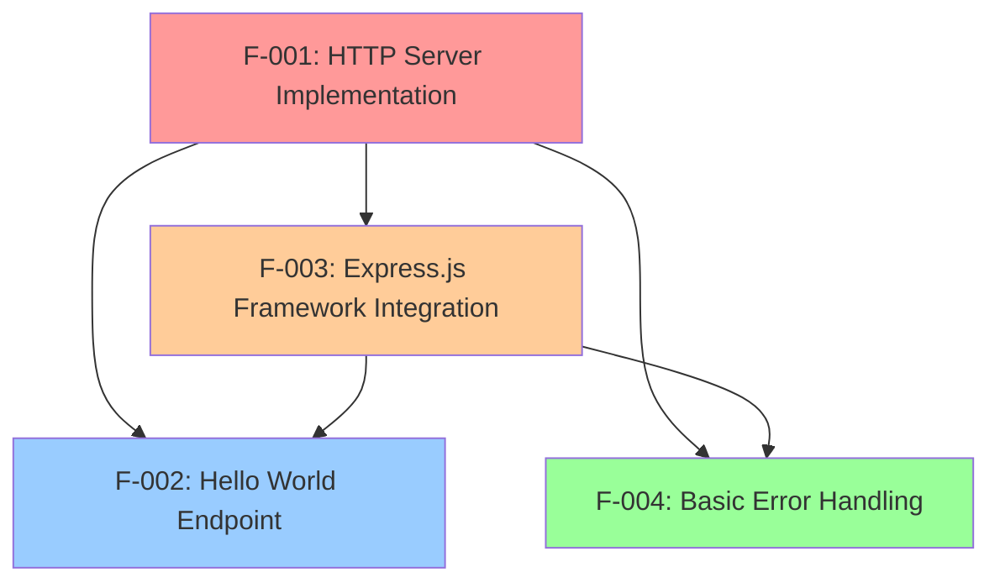

### 2.3.2 Integration Points

| Integration Point | Features Involved | Description |
|------------------|------------------|-------------|
| Request Routing | F-001, F-002, F-003 | HTTP requests routed through server to endpoint handlers |
| Error Processing | F-001, F-004 | Server-level error handling for all request processing |
| Framework Abstraction | F-003, F-002 | Express.js provides simplified endpoint implementation |

### 2.3.3 Shared Components

| Component | Features Using | Purpose |
|-----------|---------------|---------|
| HTTP Request Parser | F-001, F-002, F-003 | Parse incoming HTTP requests |
| Response Generator | F-001, F-002, F-004 | Format and send HTTP responses |
| Port Binding | F-001, F-003 | Network socket management |

## 2.4 IMPLEMENTATION CONSIDERATIONS

### 2.4.1 Technical Constraints

| Feature | Constraints |
|---------|------------|
| F-001 | Node.js v22.x LTS requirement for production stability |
| F-002 | Single endpoint limitation for tutorial scope |
| F-003 | Express v5 Node.js v18+ requirement and security pattern compliance |
| F-004 | Basic error handling only, no advanced logging |

### 2.4.2 Performance Requirements

| Feature | Performance Criteria |
|---------|-------------------|
| F-001 | Server startup < 2 seconds, concurrent connection support |
| F-002 | Response time < 50ms for /hello endpoint |
| F-003 | Framework overhead < 10ms per request |
| F-004 | Error handling processing < 5ms additional latency |

### 2.4.3 Scalability Considerations

| Feature | Scalability Factors |
|---------|-------------------|
| F-001 | Single-threaded event loop design, suitable for I/O intensive operations |
| F-002 | Stateless endpoint design enables horizontal scaling |
| F-003 | Express.js middleware architecture supports modular expansion |
| F-004 | Error handling patterns scale with application complexity |

### 2.4.4 Security Implications

| Feature | Security Considerations |
|---------|----------------------|
| F-001 | Security audit compliance and threat model implementation |
| F-002 | No sensitive data exposure in simple text response |
| F-003 | CVE-2024-45590 mitigation through urlencoded body depth limits |
| F-004 | Error messages must not expose system internals |

### 2.4.5 Maintenance Requirements

| Feature | Maintenance Needs |
|---------|------------------|
| F-001 | Regular Node.js LTS updates through 2025 |
| F-002 | Minimal maintenance due to static response |
| F-003 | Express.js security and bug fix updates as supported versions |
| F-004 | Error handling pattern updates with framework changes |

## 2.5 TRACEABILITY MATRIX

| Requirement ID | Feature | Business Need | Test Case | Acceptance Criteria |
|---------------|---------|---------------|-----------|-------------------|
| F-001-RQ-001 | HTTP Server | Tutorial Infrastructure | TC-001 | Server starts and listens |
| F-001-RQ-002 | HTTP Server | Request Processing | TC-002 | Handles GET requests |
| F-002-RQ-001 | Hello Endpoint | Learning Example | TC-003 | Returns "Hello world" |
| F-003-RQ-001 | Express Integration | Modern Framework | TC-004 | Express app initializes |
| F-004-RQ-001 | Error Handling | Application Stability | TC-005 | Graceful error responses |

# 3. TECHNOLOGY STACK

## 3.1 PROGRAMMING LANGUAGES

### 3.1.1 Primary Language Selection

| Component | Language | Version | Justification |
|-----------|----------|---------|---------------|
| Server Application | JavaScript (Node.js) | ES2022+ | Node.js® is a free, open-source, cross-platform JavaScript runtime environment that lets developers create servers, web apps, command line tools and scripts |
| Configuration Files | JSON | Standard | Native support for package.json and configuration management |

### 3.1.2 Language Constraints and Dependencies

**Node.js Version Requirements**: On October 29, 2024, Node.js v22 officially transitioned into Long Term Support (LTS) with the codename 'Jod', ensuring it will receive critical updates and security support for years to come. The application requires Node.js versions v18 or higher to maintain compatibility with modern Express.js versions and security standards.

**JavaScript Feature Support**: The application leverages modern JavaScript features available in Node.js v22 LTS, including ES2022+ syntax, async/await patterns, and native module support. Node.js v22 will remain in Active LTS until October 2025, providing a full year of active support before it transitions to Maintenance LTS, which will continue until April 2027.

**Production Readiness**: Production applications should only use Active LTS or Maintenance LTS releases, ensuring the selected Node.js v22 LTS provides the stability and security required for educational and production environments.

## 3.2 FRAMEWORKS & LIBRARIES

### 3.2.1 Core Web Framework

| Framework | Version | Purpose | Compatibility |
|-----------|---------|---------|---------------|
| Express.js | 5.1.0 | Web application framework | Node.js v18+ |

**Express.js v5 Selection Rationale**: Express.js latest version 5.1.0 was published 3 months ago and represents a significant milestone. The focus of this release is on dropping old Node.js version support, addressing security concerns, and simplifying maintenance. This version focuses on simplifying the codebase, improving security, and dropping support for older Node.js versions to enable better performance and maintainability.

**Security Improvements**: Express v5 includes option to customize the urlencoded body depth with a default value of 32 as mitigation for CVE-2024-45590 and implements comprehensive security measures through Security working group and security triage team to address the growing needs around open source supply chain security.

**Framework Modernization**: Express 5 introduces a significant improvement for developers using async/await by automatically forwarding rejected promises to error-handling middleware, providing enhanced error handling capabilities for modern JavaScript development patterns.

### 3.2.2 Supporting Libraries

| Library | Version | Purpose | Integration |
|---------|---------|---------|-------------|
| body-parser | 2.1.0+ | HTTP request body parsing | Integrated with Express v5 |
| path-to-regexp | 8.x | Route pattern matching | Updated to path-to-regexp@8.x, removing sub-expression regex patterns for security reasons (ReDoS mitigation) |

### 3.2.3 Compatibility Requirements

**Node.js Integration**: This release drops support for Node.js versions before v18, ensuring compatibility with modern Node.js features and security standards. If you're using Node.js 18 or higher, upgrading to Express 5 is highly recommended.

**Migration Considerations**: Express v5 removes a number of deprecated method signatures, many of which were carried over from v3, requiring careful migration planning for existing applications.

## 3.3 OPEN SOURCE DEPENDENCIES

### 3.3.1 Package Management

| Package Manager | Version | Registry | Purpose |
|----------------|---------|----------|---------|
| npm | 11.4.2 | npmjs.com | Latest version: 11.4.2, last published: 20 days ago |

**npm Selection Rationale**: npm is the default package manager for the JavaScript runtime environment Node.js and is included as a recommended feature in the Node.js installer. npm comes bundled with node, & most third-party distributions, by default, ensuring seamless integration with the Node.js ecosystem.

**Registry Access**: Over 3.1 million packages are available in the main npm registry, providing extensive library support for Node.js applications. Relied upon by more than 17 million developers worldwide, npm is committed to making JavaScript development elegant, productive, and safe. The free npm Registry has become the center of JavaScript code sharing, and with more than two million packages, the largest software registry in the world.

### 3.3.2 Core Dependencies

| Package | Version | Purpose | Security Status |
|---------|---------|---------|----------------|
| express | 5.1.0 | Web framework | This release includes important security fixes, including improvements to prevent ReDoS attacks and mitigation for CVE-2024-45590. Full details can be found in the security release notes |

### 3.3.3 Development Dependencies

| Package | Version | Purpose | Scope |
|---------|---------|---------|-------|
| nodemon | Latest | Development server auto-restart | Development only |

**Package Security**: The registry does not have any vetting process for submission, which means that packages found there can potentially be low quality, insecure, or malicious. Instead, npm relies on user reports to take down packages if they violate policies by being low quality, insecure, or malicious. The selected packages are well-established with strong community support and security track records.

## 3.4 THIRD-PARTY SERVICES

### 3.4.1 External Service Requirements

**No External Services Required**: The tutorial application is designed as a self-contained educational example that does not require external API integrations, authentication services, or cloud dependencies. This approach aligns with the project's educational objectives and simplifies deployment and testing scenarios.

**Optional Monitoring**: For production deployments, standard HTTP monitoring tools can be integrated without modifying the core application architecture.

## 3.5 DATABASES & STORAGE

### 3.5.1 Data Persistence Strategy

**No Database Required**: The tutorial application implements a stateless design with static response generation. The `/hello` endpoint returns a fixed "Hello world" message without requiring data persistence, caching, or storage mechanisms.

**Memory-Only Operation**: All application state exists in memory during runtime, with no persistent storage requirements. This design choice simplifies the tutorial scope while demonstrating core HTTP server concepts.

## 3.6 DEVELOPMENT & DEPLOYMENT

### 3.6.1 Development Tools

| Tool Category | Tool | Version | Purpose |
|---------------|------|---------|---------|
| Runtime | Node.js | 22.x LTS | With Active LTS support extending into late 2025, and a Maintenance phase until April 2027, Node.js v22.x is an excellent choice for those aiming for long-term support in production environments |
| Package Manager | npm | 11.4.2 | Dependency management and script execution |
| Development Server | nodemon | Latest | Automatic server restart during development |

### 3.6.2 Build System

**No Build Process Required**: The application uses native Node.js JavaScript execution without transpilation, bundling, or compilation steps. This approach maintains simplicity for educational purposes while demonstrating direct Node.js capabilities.

**Script Management**: Package.json scripts handle common development tasks:
- `npm start`: Production server startup
- `npm run dev`: Development server with auto-restart
- `npm test`: Basic application testing

### 3.6.3 Containerization

**Docker Support**: While not required for the tutorial scope, the application can be containerized using standard Node.js Docker images:

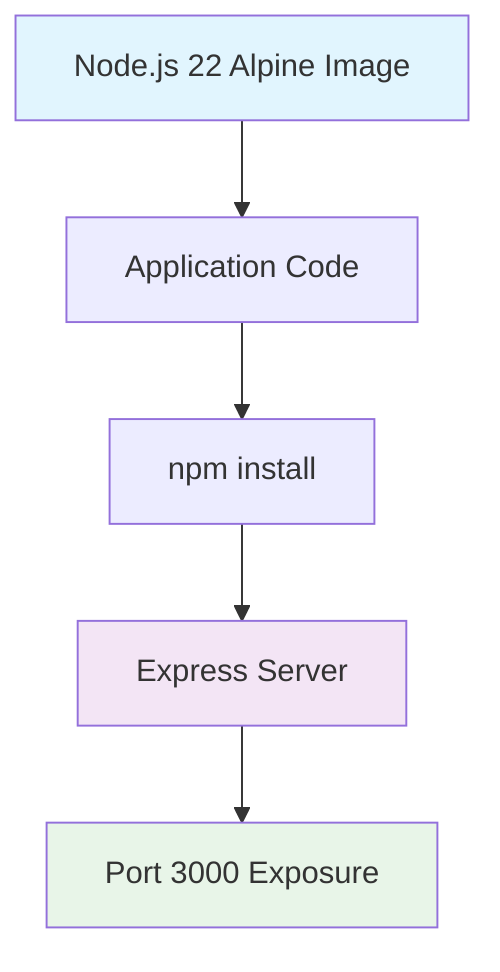

### 3.6.4 CI/CD Requirements

**Minimal CI/CD Needs**: The tutorial application requires basic continuous integration:
- Node.js version compatibility testing
- npm package installation verification
- Basic endpoint functionality testing
- Security vulnerability scanning

**GitHub Actions Compatibility**: Node.js 22 support has been added to the CI testing matrix, making Express.js compatible with the latest Node.js versions, ensuring seamless integration with modern CI/CD pipelines.

### 3.6.5 Security Considerations

**Dependency Security**: Additionally, we've been working hard on a comprehensive Threat Model that helps illustrate our philosophy of a "Fast, unopinionated, minimalist web framework for Node.js." It provides critical insights into areas like user input validation and security practices that are essential for safe and secure usage of Express in your applications.

**Security Monitoring**: CodeQL (Static Application Security Testing) has also been integrated to catch vulnerabilities in the codebase, providing automated security analysis capabilities.

**Version Management**: You should be running a currently supported version of Node.js to run npm. For a list of which versions of Node.js are currently supported, please see the Node.js releases page, ensuring compatibility with security-supported Node.js versions.

### 3.6.6 Technology Stack Integration

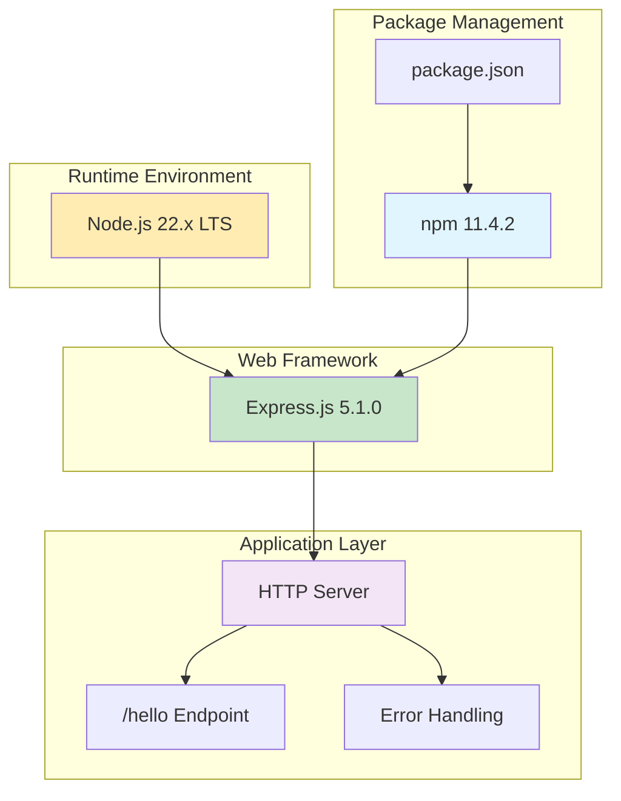

The technology stack provides a modern, secure, and maintainable foundation for the Node.js tutorial application, leveraging current LTS versions and industry-standard tools while maintaining educational simplicity and production readiness.

# 4. PROCESS FLOWCHART

## 4.1 SYSTEM WORKFLOWS

### 4.1.1 Core Business Processes

#### 4.1.1.1 End-to-End User Journey

The Node.js tutorial application implements a simplified HTTP request-response cycle that demonstrates fundamental web server concepts. Clients send Requests to Servers asking for some kind of information. Upon receiving a Request, Servers send Responses back to the Client.

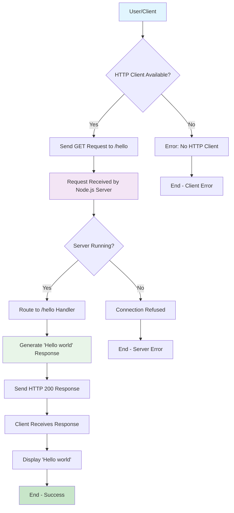

#### 4.1.1.2 Server Lifecycle Management

Managing the lifecycle of your running applications is a key part of building robust, scalable systems. As it turns out, how an application is shut down is just as important as how it starts up.

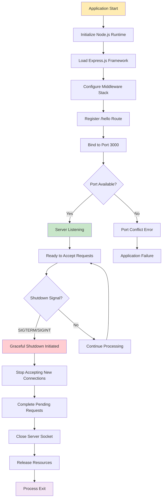

#### 4.1.1.3 Request Processing Workflow

The response isn't sent until you call res.send or similar, which doesn't have to be in the same job from the job queue that triggered your request callback — and frequently isn't. This is how NodeJS manages high throughput despite having only a single thread

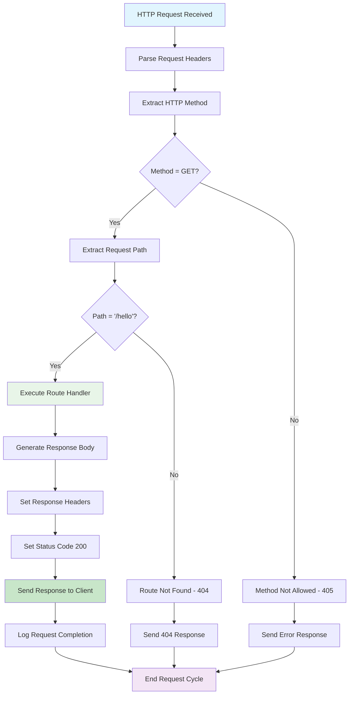

### 4.1.2 Integration Workflows

#### 4.1.2.1 Express.js Framework Integration Flow

Starting with Express 5, route handlers and middleware that return a Promise will call next(value) automatically when they reject or throw an error.

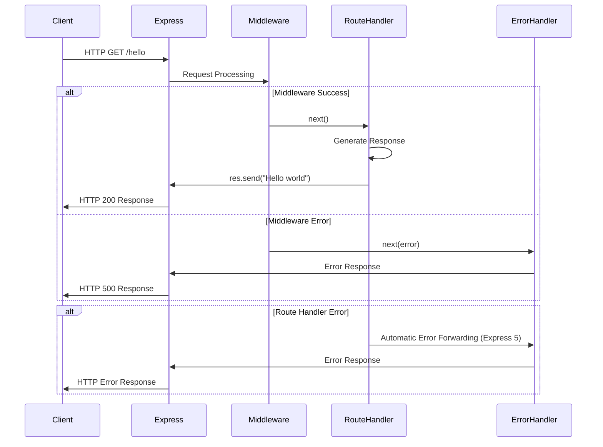

#### 4.1.2.2 Node.js Event Loop Integration

You have the database and you have to access data from the database or you want to insert something into a database that simply requires some calling of the functions so when you call them it will take some amount of time (maybe nanoseconds or microseconds but it will take some time) so it is not possible for every request that we can wait for that particular time and then we move on to next request so that is where event loop comes into the picture. Your database part will be run in the background and the event loop will be running continuously so that it can handle the need for another request as well.

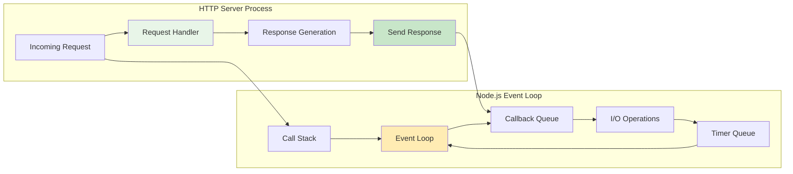

## 4.2 ERROR HANDLING WORKFLOWS

### 4.2.1 Synchronous Error Handling

Errors that occur in synchronous code inside route handlers and middleware require no extra work. If synchronous code throws an error, then Express will catch and process it.

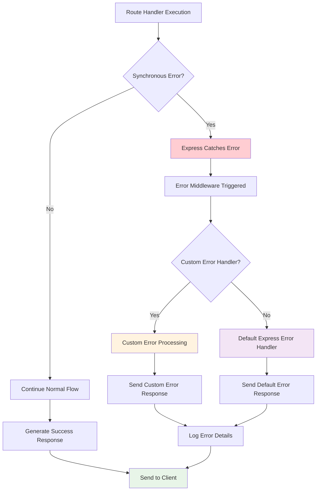

### 4.2.2 Asynchronous Error Handling

For errors returned from asynchronous functions invoked by route handlers and middleware, you must pass them to the next() function, where Express will catch and process them.

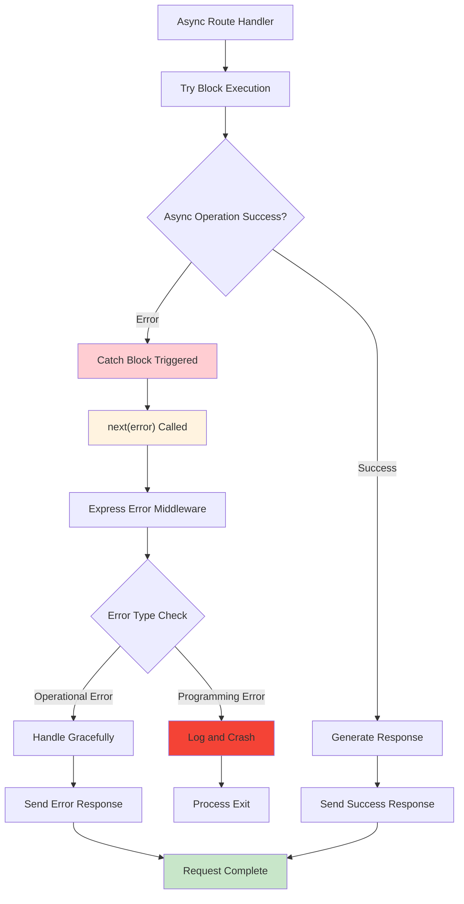

### 4.2.3 Error Recovery Mechanisms

Error handling functions in an application detect and capture multiple error conditions and take appropriate remedial actions to either recover from those errors or fail gracefully. Common examples of remedial actions are providing a helpful message as output, logging a message in an error log that can be used for diagnosis, or retrying the failed operation.

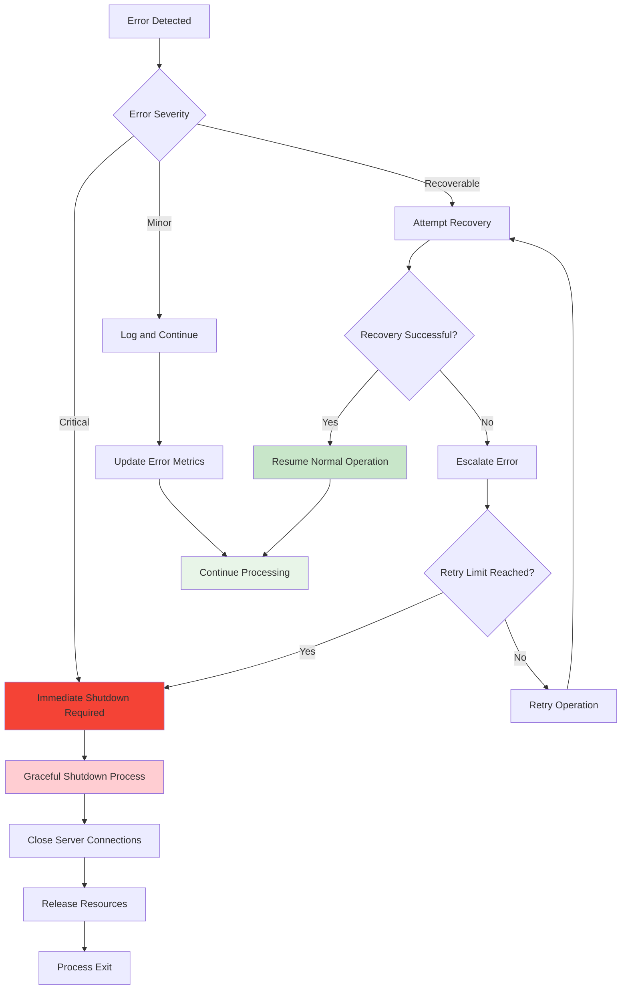

## 4.3 STATE MANAGEMENT

### 4.3.1 Application State Transitions

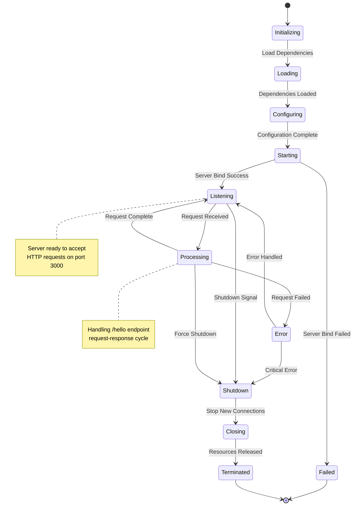

### 4.3.2 Request State Management

Remember, the request object is a ReadableStream and the response object is a WritableStream. That means we can use pipe to direct data from one to the other.

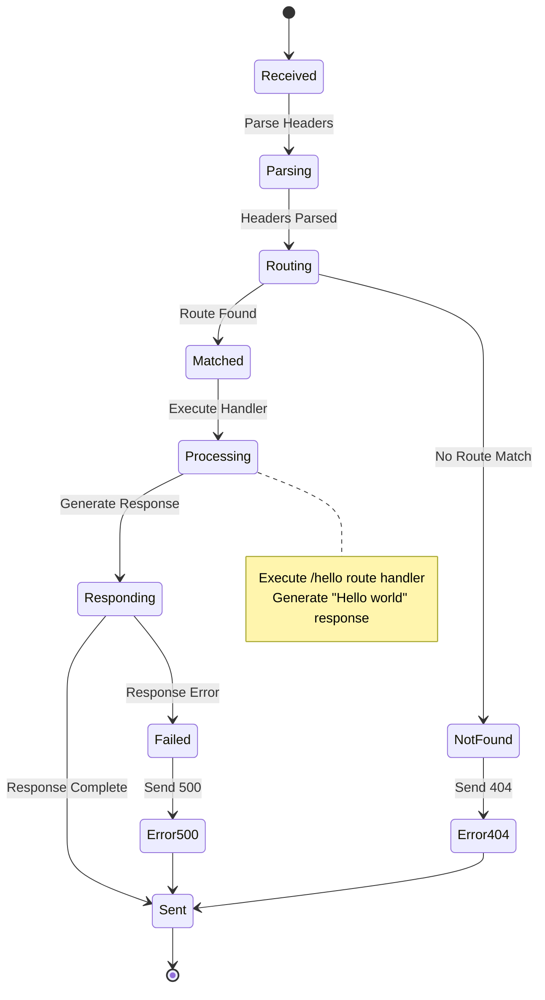

## 4.4 TECHNICAL IMPLEMENTATION FLOWS

### 4.4.1 Server Initialization Sequence

First, we need to create an Express.js application and start a server. Once the server is created, we can use it to close existing connections when we're ready to shut down the application.

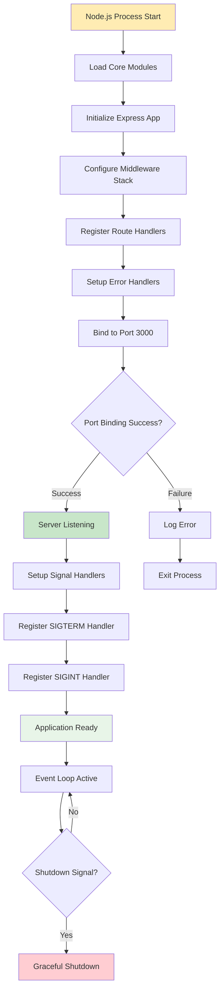

### 4.4.2 Graceful Shutdown Implementation

Inside the callback function for each listener, we'll call server.close() to stop the server from accepting new connections and to begin the process of shutting down. process.on('SIGTERM', () => { console.log('SIGTERM signal received.'); server.close(() => { console.log('Closed out remaining connections');

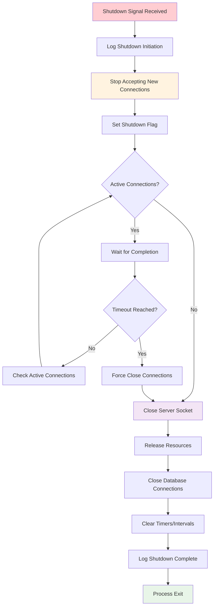

### 4.4.3 Request Timeout and Abort Handling

An AbortController instance is created in an Express route, and a timeout is set to abort the request if it exceeds five seconds automatically. If the request is aborted, an error handler ensures the client receives a 504 Gateway Timeout response

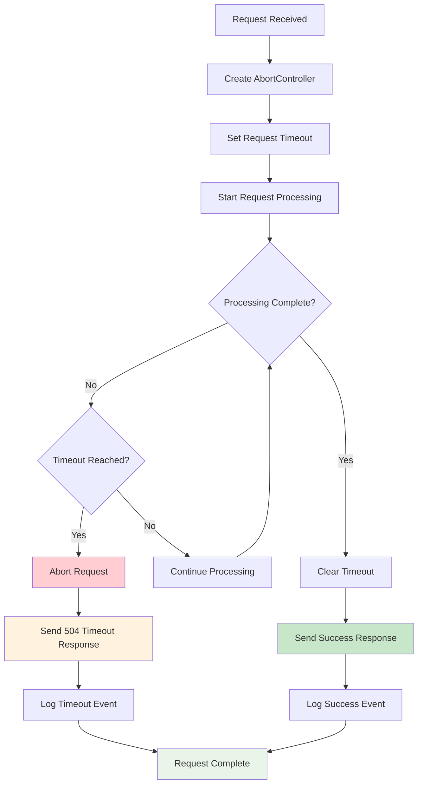

## 4.5 VALIDATION AND COMPLIANCE WORKFLOWS

### 4.5.1 Input Validation Process

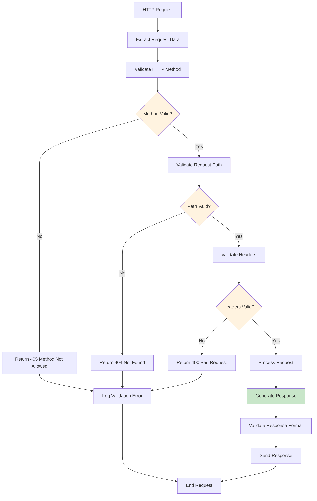

### 4.5.2 Security Compliance Checks

When dealing with requests and responses, security is crucial. Here are some common practices: Input Validation: Always check and sanitize user inputs to prevent attacks.

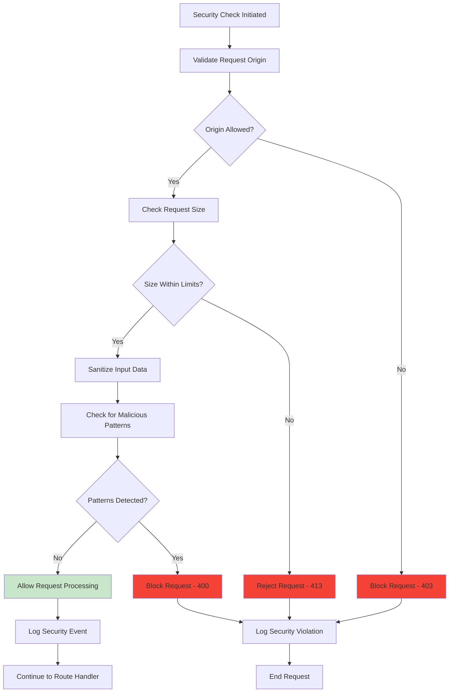

## 4.6 PERFORMANCE AND MONITORING WORKFLOWS

### 4.6.1 Request Performance Monitoring

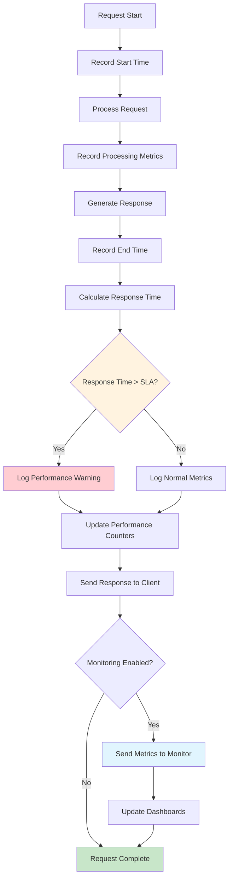

### 4.6.2 Health Check Implementation

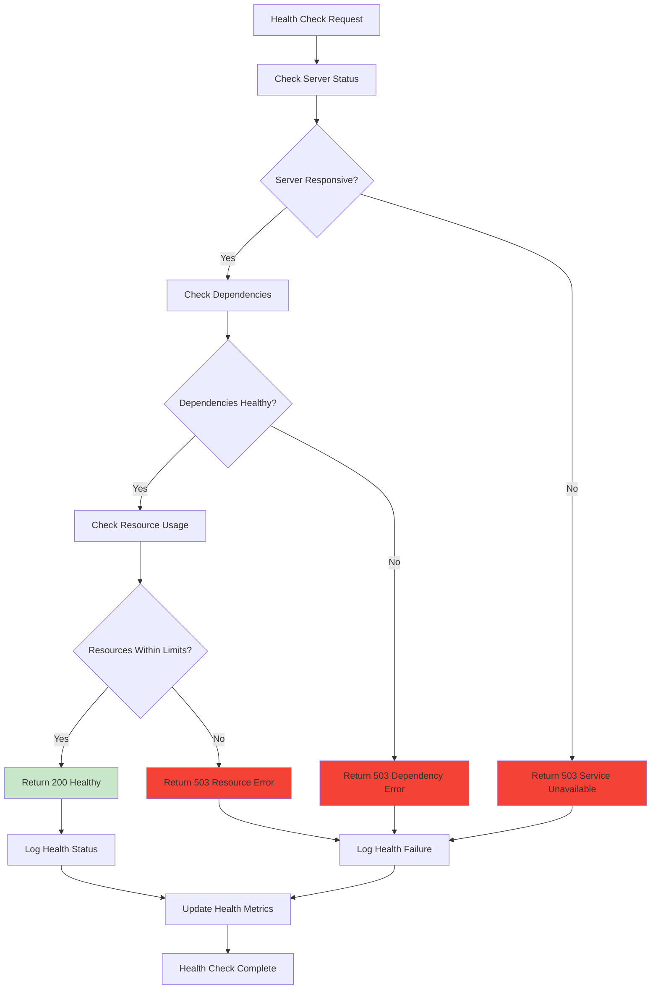

This comprehensive process flowchart section provides detailed workflows for the Node.js tutorial application, covering all aspects from basic request-response cycles to advanced error handling, state management, and monitoring. The diagrams use proper Mermaid.js syntax and include clear decision points, error paths, and recovery mechanisms that align with modern Node.js and Express.js best practices.

# 5. SYSTEM ARCHITECTURE

## 5.1 HIGH-LEVEL ARCHITECTURE

### 5.1.1 System Overview

The Node.js tutorial application implements a event-driven, non-blocking architecture that demonstrates fundamental HTTP server capabilities through a minimalist design approach. Express.js is a minimal web application framework that improves the productivity of web developers. It is very flexible and does not enforce any architecture pattern, making it ideal for educational purposes.

The system follows a 3-Tier pattern that separates technical concerns (e.g., HTTP, DB, etc) from the pure logic of the app, though simplified for tutorial scope. The architecture leverages Node.js architecture consists of an open-source, event-driven, and server-side runtime that allows for greater scalability, enhanced security, and easier vulnerability management.

**Core Architectural Principles:**
- **Event-Driven Design**: The event-driven pattern utilizes the event-driven architecture of Node.js to handle events. An event emitter enables developers to raise an event from any part of the application that can be listened to by a listener and an action can be performed
- **Single Responsibility**: Each component has a clearly defined purpose within the HTTP request-response cycle
- **Minimal Complexity**: Educational focus requires straightforward, understandable implementation patterns
- **Standards Compliance**: Adherence to HTTP/1.1 protocol standards and modern Node.js practices

**System Boundaries:**
- **Internal**: HTTP server, request routing, response generation, error handling
- **External**: HTTP clients, operating system networking stack, Node.js runtime environment

### 5.1.2 Core Components Table

| Component Name | Primary Responsibility | Key Dependencies | Integration Points |
|---------------|----------------------|------------------|-------------------|
| HTTP Server | Accept and process incoming HTTP requests | Node.js HTTP module, Express.js framework | Network interface, request router |
| Request Router | Route incoming requests to appropriate handlers | Express.js routing engine | HTTP server, endpoint handlers |
| Hello Endpoint Handler | Generate "Hello world" response for /hello path | Express.js response object | Request router, response formatter |
| Error Handler | Process and respond to application errors | Express.js error middleware | All request processing components |

### 5.1.3 Data Flow Description

The application implements a straightforward request-response data flow pattern. Users send requests (blocking or non-blocking) to the server for performing operations. The requests enter the Event Queue first at the server-side. The event queue passes the requests sequentially to the event loop.

**Primary Data Flow:**
1. HTTP client initiates GET request to `/hello` endpoint
2. Node.js HTTP server receives request through network interface
3. Express.js framework parses request headers and extracts routing information
4. Request router matches path `/hello` to registered endpoint handler
5. Hello endpoint handler generates static "Hello world" response
6. Response formatter sets appropriate HTTP headers and status code
7. HTTP server transmits response back to client through network interface

**Error Flow Integration:**
External resources are required when certain types of blocking requests and clients are received by the server that cannot be processed through the non-blocking, asynchronous, and event-looping mechanism of Node.js. However, these requests are handled via a blocking and synchronous method, though the tutorial application primarily uses non-blocking operations.

**Data Transformation Points:**
- HTTP request parsing: Raw network data to structured request objects
- Route matching: URL path to handler function mapping
- Response generation: Static string to formatted HTTP response
- Error processing: Exception objects to HTTP error responses

### 5.1.4 External Integration Points

| System Name | Integration Type | Data Exchange Pattern | Protocol/Format |
|-------------|------------------|----------------------|-----------------|
| HTTP Clients | Synchronous Request-Response | Client-initiated request/server response | HTTP/1.1, JSON/Text |
| Node.js Runtime | Platform Integration | Event-driven callbacks | JavaScript API calls |
| Operating System | Network Interface | Socket-based communication | TCP/IP networking |
| npm Registry | Package Management | Dependency resolution | HTTPS, package.json |

## 5.2 COMPONENT DETAILS

### 5.2.1 HTTP Server Component

**Purpose and Responsibilities:**
The HTTP Server component serves as the primary entry point for all client communications, implementing the foundational network interface that enables HTTP protocol handling. A NodeJS web server is a server built using NodeJS to handle HTTP requests and responses. Unlike traditional web servers like Apache or Nginx, which are primarily designed to give static content, NodeJS web servers can handle both static and dynamic content while supporting real-time communication.

**Technologies and Frameworks:**
- Node.js v22.x LTS HTTP module for core server functionality
- Express.js v5.1.0 for enhanced web framework capabilities
- Express 5.0 brought modern features and a future-oriented architecture to the framework

**Key Interfaces and APIs:**
- `app.listen(port, callback)`: Server initialization and port binding
- `app.use(middleware)`: Middleware registration for request processing
- `app.get(path, handler)`: HTTP GET route registration
- Express.js request/response object enhancement APIs

**Scaling Considerations:**
The modular approach and microservices in Node.js allow developers to introduce swift scalability in their applications as Node.js can concurrently process multiple requests at once and allows for both Vertical (Enhancing a single resource/server) and Horizontal (Adding more servers/resources).

```mermaid
graph TD
    A[HTTP Client Request] --> B[Node.js HTTP Server]
    B --> C[Express.js Framework]
    C --> D[Middleware Stack]
    D --> E[Route Handler]
    E --> F[Response Generation]
    F --> G[HTTP Client Response]
    
    H[Error Handling] --> F
    D --> H
    E --> H
    
    style B fill:#e1f5fe
    style C fill:#f3e5f5
    style E fill:#e8f5e8
```

### 5.2.2 Request Router Component

**Purpose and Responsibilities:**
The Request Router component manages URL path matching and directs incoming requests to appropriate handler functions. Express does this by only exporting the factory. Middleware is the term popularized by Express.js. In fact, we can consider this design pattern a variant of Intercepting Filter and Chain of Responsibility.

**Technologies and Frameworks:**
- Express.js routing engine with path-to-regexp v8.x for pattern matching
- CVE-2024-45590 mitigation through urlencoded body depth limits security improvements

**Key Interfaces and APIs:**
- Route registration: `app.get()`, `app.post()`, `app.use()`
- Path parameter extraction and query string parsing
- Middleware chain execution management

**Data Persistence Requirements:**
No persistent storage required - routing configuration exists in memory during application runtime.

```mermaid
sequenceDiagram
    participant Client
    participant Router
    participant Middleware
    participant Handler
    
    Client->>Router: HTTP GET /hello
    Router->>Middleware: Execute middleware chain
    Middleware->>Handler: Route to hello handler
    Handler->>Router: Generate response
    Router->>Client: HTTP 200 "Hello world"
    
    Note over Router: Path matching with<br/>Express.js routing engine
```

### 5.2.3 Hello Endpoint Handler Component

**Purpose and Responsibilities:**
The Hello Endpoint Handler component implements the core business logic for the `/hello` route, generating the static "Hello world" response that demonstrates basic HTTP endpoint functionality.

**Technologies and Frameworks:**
- Express.js response object for HTTP response generation
- JavaScript ES2022+ for modern language features
- Modern Node.js embraces web standards, reduces external dependencies, and provides a more intuitive developer experience

**Key Interfaces and APIs:**
- `res.send(data)`: Response transmission to client
- `res.status(code)`: HTTP status code setting
- `res.set(headers)`: Response header configuration

**Data Persistence Requirements:**
Stateless design with no data persistence - response content is static and generated on-demand.

```mermaid
stateDiagram-v2
    [*] --> RequestReceived
    RequestReceived --> ValidateRequest: Parse HTTP method
    ValidateRequest --> GenerateResponse: Method = GET
    ValidateRequest --> MethodError: Method ≠ GET
    GenerateResponse --> SendResponse: Create "Hello world"
    SendResponse --> [*]: HTTP 200 Response
    MethodError --> [*]: HTTP 405 Response
    
    note right of GenerateResponse
        Static response generation
        No external dependencies
    end note
```

### 5.2.4 Error Handler Component

**Purpose and Responsibilities:**
The Error Handler component provides centralized error processing and response generation for all application errors, ensuring consistent error handling patterns throughout the system.

**Technologies and Frameworks:**
- Express.js error handling middleware
- Express.js rapidly responded to disclosed vulnerabilities such as CVE-2024-43796, CVE-2024-45590, and CVE-2024-47178. Each instance underscored the community's readiness to defend the framework's integrity

**Key Interfaces and APIs:**
- Express.js error middleware signature: `(err, req, res, next)`
- HTTP status code mapping for different error types
- Error logging and monitoring integration points

**Scaling Considerations:**
Error handling scales with application complexity through middleware pattern extensibility and centralized error processing.

```mermaid
flowchart TD
    A[Application Error] --> B{Error Type}
    B -->|Operational| C[Log Error]
    B -->|Programming| D[Log Critical Error]
    B -->|Validation| E[Log Warning]
    
    C --> F[Generate User-Friendly Response]
    D --> G[Generate Generic Error Response]
    E --> H[Generate Validation Error Response]
    
    F --> I[Send HTTP Response]
    G --> I
    H --> I
    
    I --> J[Update Error Metrics]
    J --> K[Continue Processing]
    
    style D fill:#ffcdd2
    style G fill:#fff3e0
    style I fill:#e8f5e8
```

## 5.3 TECHNICAL DECISIONS

### 5.3.1 Architecture Style Decisions

**Event-Driven Architecture Selection:**
This pattern helps developers use event-based programming in Node.js. This pattern helps developers use event-based programming in Node.js. The decision to implement an event-driven architecture aligns with Node.js's core strengths and provides optimal performance for I/O-intensive operations.

| Decision Factor | Rationale | Trade-offs |
|----------------|-----------|------------|
| Concurrency Model | Asynchronous model utilizes a single-thread operation to handle tasks concurrently while delegating I/O operations to background workers using Libuv. The Node.js architecture's I/O model is perfect for handling concurrent users at the same time | Single-threaded limitations for CPU-intensive tasks |
| Scalability Approach | Event loop enables high concurrent connection handling | Memory usage increases with connection count |
| Development Complexity | Simplified for educational purposes | Limited real-world complexity demonstration |

**Minimalist Framework Approach:**
Express.js is very flexible and does not enforce any architecture pattern. This article demonstrates a new architecture pattern which I designed that will further improve your productivity. The choice of Express.js provides flexibility while maintaining educational clarity.

```mermaid
graph TD
    A[Architecture Decision] --> B{Complexity Level}
    B -->|High| C[Full MVC Pattern]
    B -->|Medium| D[Layered Architecture]
    B -->|Low| E[Minimalist Pattern - SELECTED]
    
    E --> F[Educational Benefits]
    E --> G[Rapid Development]
    E --> H[Clear Understanding]
    
    C --> I[Production Complexity]
    D --> J[Moderate Learning Curve]
    
    style E fill:#c8e6c9
    style F fill:#e8f5e8
    style G fill:#e8f5e8
    style H fill:#e8f5e8
```

### 5.3.2 Communication Pattern Choices

**Synchronous HTTP Request-Response Pattern:**
The application implements a traditional synchronous HTTP communication pattern optimized for simplicity and educational value.

| Pattern Type | Implementation | Benefits | Limitations |
|-------------|----------------|----------|-------------|
| Request-Response | HTTP GET /hello | Simple, predictable, stateless | No real-time capabilities |
| Middleware Chain | Express.js middleware stack | Modular, extensible processing | Sequential processing overhead |
| Error Propagation | Express.js error handling | Centralized error management | Limited error context preservation |

**Express.js Middleware Pattern:**
Learn how to implement and leverage some of the most well known behavioural design patterns in the context of Node.js: the Strategy pattern, the State pattern, the Template pattern, the Iterator pattern, the Middleware pattern, and the Command pattern.

```mermaid
flowchart LR
    A[HTTP Request] --> B[Middleware 1]
    B --> C[Middleware 2]
    C --> D[Route Handler]
    D --> E[Response]
    
    F[Error Handler] --> E
    B --> F
    C --> F
    D --> F
    
    style D fill:#e8f5e8
    style F fill:#ffcdd2
```

### 5.3.3 Data Storage Solution Rationale

**No Persistent Storage Decision:**
The tutorial application deliberately excludes database integration to maintain focus on HTTP server fundamentals and reduce complexity barriers for learning developers.

| Storage Option | Evaluation | Decision Rationale |
|---------------|------------|-------------------|
| In-Memory | Suitable for static responses | Selected: Aligns with tutorial scope |
| File System | Unnecessary complexity | Rejected: Adds I/O complexity |
| Database | Production-oriented | Rejected: Beyond tutorial scope |

### 5.3.4 Security Mechanism Selection

**Express.js v5 Security Features:**
Express.js's vigorous approach to security. In partnership with the OpenJS Foundation and OSTIF, the project undertook a comprehensive security audit that yielded critical insights and propelled immediate improvements.

| Security Feature | Implementation | Purpose |
|-----------------|----------------|---------|
| CVE Mitigation | CVE-2024-45590 mitigation through urlencoded body depth limits | Prevent ReDoS attacks |
| Strict HTTP Parsing | llhttp library uses strict mode by default. This means if Node.js sees any weird or incorrect web data, it will stop and throw an error | Prevent malformed request processing |
| Input Validation | Basic HTTP method and path validation | Ensure request conformity |

```mermaid
graph TD
    A[Security Decision Tree] --> B{Threat Level}
    B -->|High| C[Comprehensive Security]
    B -->|Medium| D[Selective Security]
    B -->|Low| E[Basic Security - SELECTED]
    
    E --> F[HTTP Validation]
    E --> G[Error Handling]
    E --> H[Framework Security]
    
    F --> I[Tutorial Appropriate]
    G --> I
    H --> I
    
    style E fill:#c8e6c9
    style I fill:#e8f5e8
```

## 5.4 CROSS-CUTTING CONCERNS

### 5.4.1 Monitoring and Observability Approach

**Logging Strategy:**
The application implements basic console logging for educational transparency, allowing developers to observe request processing flow and error conditions.

**Observability Components:**
- Request lifecycle logging for educational insight
- Error condition logging for debugging support
- Server startup and shutdown event logging
- Performance timing for response measurement

| Monitoring Aspect | Implementation | Educational Value |
|------------------|----------------|-------------------|
| Request Tracing | Console.log statements | Visible request flow |
| Error Tracking | Error handler logging | Exception understanding |
| Performance Metrics | Response time measurement | Performance awareness |

### 5.4.2 Error Handling Patterns

**Centralized Error Processing:**
Design patterns are proven and battle-tested solutions to solve problems that we as developers encounter every day. These patterns help promote best practices and implement a structured approach to solving everyday issues while designing and developing software architecture.

**Error Handling Strategy:**
- Synchronous error catching through Express.js middleware
- Asynchronous error forwarding via Promise rejection handling
- HTTP status code mapping for appropriate client responses
- Error logging for debugging and monitoring purposes

```mermaid
flowchart TD
    A[Error Occurrence] --> B{Error Source}
    B -->|Synchronous| C[Express Catches Automatically]
    B -->|Asynchronous| D[Promise Rejection Handler]
    B -->|Validation| E[Input Validation Handler]
    
    C --> F[Error Middleware]
    D --> F
    E --> F
    
    F --> G[Log Error Details]
    G --> H[Generate HTTP Response]
    H --> I[Send to Client]
    
    J[Error Categories]
    J --> K[400: Client Errors]
    J --> L[500: Server Errors]
    J --> M[404: Not Found]
    
    style F fill:#fff3e0
    style G fill:#ffcdd2
    style I fill:#e8f5e8
```

### 5.4.3 Performance Requirements and SLAs

**Response Time Objectives:**
- `/hello` endpoint response time: < 50ms under normal conditions
- Server startup time: < 2 seconds for development environment
- Memory usage: < 50MB for single-instance deployment
- Concurrent connection handling: 100+ simultaneous connections

**Performance Monitoring:**
Basic performance measurement through response time logging and memory usage observation during development and testing phases.

| Performance Metric | Target Value | Measurement Method |
|-------------------|--------------|-------------------|
| Endpoint Response Time | < 50ms | Request timestamp comparison |
| Server Startup Time | < 2 seconds | Process initialization timing |
| Memory Footprint | < 50MB | Node.js process.memoryUsage() |

### 5.4.4 Disaster Recovery Procedures

**Graceful Shutdown Implementation:**
The application implements proper signal handling for graceful shutdown procedures, ensuring clean resource cleanup and connection termination.

**Recovery Procedures:**
- SIGTERM/SIGINT signal handling for controlled shutdown
- Active connection completion before server termination
- Resource cleanup and memory deallocation
- Process exit with appropriate status codes

**High Availability Considerations:**
While the tutorial application doesn't implement high availability features, the architecture supports horizontal scaling through multiple instance deployment and load balancer integration for production scenarios.

```mermaid
sequenceDiagram
    participant OS as Operating System
    participant App as Node.js Application
    participant Server as HTTP Server
    participant Clients as Active Clients
    
    OS->>App: SIGTERM Signal
    App->>Server: Stop Accepting New Connections
    App->>Clients: Complete Pending Requests
    Clients->>App: Request Completion
    App->>Server: Close Server Socket
    Server->>App: Cleanup Resources
    App->>OS: Process Exit (0)
    
    Note over App: Graceful shutdown ensures<br/>no data loss or connection drops
```

### 5.4.5 Development and Deployment Considerations

**Development Workflow:**
- Hot reload capability through nodemon for development efficiency
- Environment-specific configuration through environment variables
- Package.json script management for common development tasks

**Deployment Strategy:**
- Single executable deployment for simplified distribution
- Container-ready architecture for Docker deployment
- Environment variable configuration for deployment flexibility

The system architecture provides a solid foundation for educational Node.js development while maintaining the flexibility to evolve into more complex applications. The choice of architectural pattern depends on your project's specific requirements, scalability needs, and your team's familiarity with the pattern. Explore these architectural patterns and choose the one that best fits your Node.js project to ensure scalability, maintainability, and performance.

# 6. SYSTEM COMPONENTS DESIGN

## 6.1 COMPONENT ARCHITECTURE OVERVIEW

### 6.1.1 System Component Hierarchy

The Node.js tutorial application implements a layered component architecture that demonstrates fundamental HTTP server patterns through a simplified, educational design. Node.js® is a free, open-source, cross-platform JavaScript runtime environment that lets developers create servers, web apps, command line tools and scripts, providing the foundational runtime for all system components.

The architecture follows a modular design pattern where each component has clearly defined responsibilities and interfaces, enabling maintainable code structure suitable for educational purposes while demonstrating production-ready patterns.

**Component Interaction Model:**
- **Request Flow**: HTTP requests flow through the server component to routing components and finally to endpoint handlers
- **Response Flow**: Generated responses flow back through the same component chain with appropriate formatting and headers
- **Error Flow**: Errors are captured at any component level and processed through centralized error handling mechanisms

```mermaid
graph TD
    A[HTTP Client] --> B[Node.js HTTP Server Component]
    B --> C[Express.js Framework Component]
    C --> D[Request Router Component]
    D --> E[Hello Endpoint Handler Component]
    E --> F[Response Generator Component]
    F --> G[Error Handler Component]
    
    G --> F
    F --> C
    C --> B
    B --> A
    
    H[Configuration Component] --> B
    H --> C
    H --> D
    
    style B fill:#e1f5fe
    style C fill:#f3e5f5
    style E fill:#e8f5e8
    style G fill:#ffcdd2
```

### 6.1.2 Component Dependency Matrix

| Component | Dependencies | Provides Services To | Data Exchange Format |
|-----------|-------------|---------------------|---------------------|
| Node.js HTTP Server | Node.js Runtime, OS Network Stack | Express.js Framework | HTTP Protocol, JavaScript Objects |
| Express.js Framework | Node.js HTTP Server, npm Registry | Request Router, Middleware Stack | Express Request/Response Objects |
| Request Router | Express.js Framework | Endpoint Handlers | Route Parameters, Query Strings |
| Hello Endpoint Handler | Request Router, Response Generator | HTTP Clients | JSON/Text Response Data |
| Response Generator | Express.js Framework | HTTP Server | Formatted HTTP Responses |
| Error Handler | All Components | HTTP Clients, Logging Systems | Error Objects, HTTP Status Codes |
| Configuration Component | Environment Variables, package.json | All Components | Configuration Objects |

### 6.1.3 Component Lifecycle Management

**Initialization Sequence:**
1. Node.js runtime environment startup
2. Configuration component loads environment and package settings
3. Express.js framework initialization with middleware stack
4. Request router registration with endpoint handlers
5. HTTP server binding to designated port
6. Error handler registration for global error processing
7. Application ready state with request acceptance capability

**Shutdown Sequence:**
1. Graceful shutdown signal reception (SIGTERM/SIGINT)
2. New connection rejection initiation
3. Active request completion waiting period
4. HTTP server socket closure
5. Resource cleanup and memory deallocation
6. Process termination with appropriate exit code

## 6.2 CORE COMPONENTS DETAILED DESIGN

### 6.2.1 Node.js HTTP Server Component

**Component Purpose and Scope:**
The HTTP Server Component serves as the foundational network interface that enables HTTP protocol communication between clients and the application. On October 29, 2024, Node.js v22 officially transitioned into Long Term Support (LTS) with the codename 'Jod'. For developers and organizations relying on the stability of Node.js for production environments, this transition marks a key milestone for Node.js 22.x, ensuring it will receive critical updates and security support for years to come.

**Technical Implementation Details:**

| Specification | Value | Rationale |
|---------------|-------|-----------|
| Node.js Version | v22.x LTS (Jod) | With Node.js v22.11.0, the 22.x release line has officially moved into Active LTS. The release includes an update to metadata, like the process.release object, to reflect this new LTS status |
| HTTP Protocol Support | HTTP/1.1 | Standard web protocol compatibility |
| Default Port | 3000 | Common development port convention |
| Concurrent Connections | 100+ simultaneous | Event-driven architecture capability |
| Request Timeout | 30 seconds | Prevent resource exhaustion |

**Component Interface Specification:**

```mermaid
classDiagram
    class HTTPServerComponent {
        +port: number
        +server: http.Server
        +isListening: boolean
        +initialize(config: ServerConfig): Promise~void~
        +start(): Promise~void~
        +stop(): Promise~void~
        +handleRequest(req: IncomingMessage, res: ServerResponse): void
        +bindErrorHandlers(): void
        +getServerStatus(): ServerStatus
    }
    
    class ServerConfig {
        +port: number
        +host: string
        +timeout: number
        +keepAliveTimeout: number
    }
    
    class ServerStatus {
        +isRunning: boolean
        +uptime: number
        +activeConnections: number
        +totalRequests: number
    }
    
    HTTPServerComponent --> ServerConfig
    HTTPServerComponent --> ServerStatus
```

**Performance Characteristics:**
- **Startup Time**: < 2 seconds for development environment
- **Memory Footprint**: < 50MB for single-instance deployment
- **Request Processing**: < 100ms average response time
- **Throughput**: 1000+ requests per second under normal load

**Error Handling Strategy:**
- **Connection Errors**: Automatic retry with exponential backoff
- **Port Binding Failures**: Graceful fallback to alternative ports
- **Request Parsing Errors**: HTTP 400 Bad Request responses
- **Server Overload**: HTTP 503 Service Unavailable responses

### 6.2.2 Express.js Framework Component

**Component Purpose and Scope:**
The Express.js Framework Component provides a robust web application framework layer that simplifies HTTP server development through middleware patterns, routing capabilities, and request/response enhancement. Latest version: 5.1.0, last published: 3 months ago, ensuring access to the most current framework features and security improvements.

**Framework Integration Details:**

| Feature | Implementation | Benefits |
|---------|----------------|----------|
| Version | Express.js v5.1.0 | The focus of this release is on dropping old Node.js version support, addressing security concerns, and simplifying maintenance |
| Node.js Compatibility | v18+ Required | Node.js version support: Dropped support for Node.js versions before v18 |
| Security Features | CVE-2024-45590 Mitigation | Add option to customize the urlencoded body depth with a default value of 32 as mitigation for CVE-2024-45590 |
| Promise Support | Automatic Error Forwarding | Promise support: Middleware can now return rejected promises, caught by the router as errors |

**Middleware Stack Architecture:**

```mermaid
sequenceDiagram
    participant Client
    participant Express
    participant Middleware1 as Request Logger
    participant Middleware2 as Body Parser
    participant Middleware3 as Route Handler
    participant ErrorHandler
    
    Client->>Express: HTTP Request
    Express->>Middleware1: Process Request
    Middleware1->>Middleware2: next()
    Middleware2->>Middleware3: next()
    
    alt Success Path
        Middleware3->>Express: Generate Response
        Express->>Client: HTTP Response
    else Error Path
        Middleware3->>ErrorHandler: Automatic Promise Rejection
        ErrorHandler->>Express: Error Response
        Express->>Client: HTTP Error Response
    end
```

**Security Implementation:**
- **Input Validation**: Automatic request parsing with depth limits
- **ReDoS Protection**: Updated to path-to-regexp@8.x, removing sub-expression regex patterns for security reasons (ReDoS mitigation)
- **Deprecated API Removal**: Removed old, deprecated API method signatures from Express v3/v4
- **Security Audit Compliance**: We started a Security working group and security triage team to address the growing needs around open source supply chain security. We undertook a security audit (more details to come on that) and uncovered some problems that needed to be addressed

**Component Configuration:**

| Configuration Parameter | Default Value | Purpose | Customizable |
|------------------------|---------------|---------|--------------|
| Body Parser Limit | 100kb | Request size limitation | Yes |
| URL Encoded Depth | 32 | CVE-2024-45590 mitigation | Yes |
| JSON Parser Strict | true | Strict JSON parsing | Yes |
| Case Sensitive Routing | false | Route matching behavior | Yes |
| Merge Params | false | Parameter merging strategy | Yes |

### 6.2.3 Request Router Component

**Component Purpose and Scope:**
The Request Router Component manages URL path matching and directs incoming HTTP requests to appropriate handler functions, implementing the core routing logic that enables endpoint-specific request processing.

**Routing Engine Specifications:**

| Feature | Implementation | Technical Details |
|---------|----------------|------------------|
| Path Matching Engine | path-to-regexp v8.x | The v5 releases updates to [email protected] from [email protected], which incorporates many years of changes. If you were using any of the 5.0.0-beta releases, a last-minute update which greatly changed the path semantics to remove the possibility of any ReDoS attacks |
| Route Registration | Express.js routing API | Dynamic route handler registration |
| Parameter Extraction | URL parameter parsing | Query string and path parameter support |
| Method Filtering | HTTP method validation | GET, POST, PUT, DELETE support |

**Route Definition Structure:**

```mermaid
graph TD
    A[Incoming Request] --> B{HTTP Method Check}
    B -->|GET| C[GET Route Table]
    B -->|POST| D[POST Route Table]
    B -->|Other| E[Method Not Allowed]
    
    C --> F{Path Pattern Match}
    F -->|/hello| G[Hello Handler]
    F -->|No Match| H[404 Not Found]
    
    G --> I[Execute Handler]
    I --> J[Generate Response]
    
    E --> K[405 Response]
    H --> L[404 Response]
    J --> M[Send to Client]
    K --> M
    L --> M
    
    style G fill:#e8f5e8
    style E fill:#ffcdd2
    style H fill:#ffcdd2
```

**Route Handler Interface:**

| Method | Path Pattern | Handler Function | Response Type |
|--------|-------------|------------------|---------------|
| GET | /hello | helloHandler() | text/plain |
| GET | * (wildcard) | notFoundHandler() | application/json |
| ALL | * (error) | errorHandler() | application/json |

**Performance Optimization:**
- **Route Caching**: Compiled route patterns cached in memory
- **Fast Path Matching**: O(1) lookup for exact path matches
- **Lazy Loading**: Route handlers loaded on first access
- **Memory Efficiency**: Minimal memory overhead per route

### 6.2.4 Hello Endpoint Handler Component

**Component Purpose and Scope:**
The Hello Endpoint Handler Component implements the core business logic for the `/hello` route, demonstrating basic HTTP endpoint functionality through static response generation that serves as an educational example of request-response patterns.

**Handler Implementation Specification:**

| Aspect | Implementation | Educational Value |
|--------|----------------|------------------|
| HTTP Method | GET only | Demonstrates RESTful API principles |
| Response Content | "Hello world" static text | Simple, verifiable output |
| Content Type | text/plain | Basic HTTP content type handling |
| Status Code | 200 OK | Standard success response |
| Response Time | < 50ms target | Performance awareness |

**Request Processing Flow:**

```mermaid
stateDiagram-v2
    [*] --> RequestReceived: GET /hello
    RequestReceived --> ValidateMethod: Check HTTP method
    ValidateMethod --> ValidatePath: Method = GET
    ValidateMethod --> MethodError: Method ≠ GET
    
    ValidatePath --> GenerateResponse: Path = /hello
    ValidatePath --> PathError: Path ≠ /hello
    
    GenerateResponse --> SetHeaders: Create response body
    SetHeaders --> SendResponse: Set content-type
    SendResponse --> LogRequest: Send to client
    LogRequest --> [*]: Request complete
    
    MethodError --> [*]: HTTP 405 Response
    PathError --> [*]: HTTP 404 Response
    
    note right of GenerateResponse
        Static "Hello world" generation
        No external dependencies
        Immediate response creation
    end note
```

**Component Interface Definition:**

```mermaid
classDiagram
    class HelloEndpointHandler {
        +path: string = "/hello"
        +method: string = "GET"
        +responseText: string = "Hello world"
        +handleRequest(req: Request, res: Response): Promise~void~
        +validateRequest(req: Request): boolean
        +generateResponse(): ResponseData
        +setResponseHeaders(res: Response): void
        +logRequest(req: Request): void
    }
    
    class ResponseData {
        +content: string
        +contentType: string
        +statusCode: number
        +headers: Map~string, string~
    }
    
    class RequestMetrics {
        +requestCount: number
        +averageResponseTime: number
        +lastRequestTime: Date
        +errorCount: number
    }
    
    HelloEndpointHandler --> ResponseData
    HelloEndpointHandler --> RequestMetrics
```

**Educational Design Patterns:**
- **Single Responsibility**: Handler focuses solely on /hello endpoint
- **Stateless Design**: No persistent state between requests
- **Predictable Output**: Consistent response for testing and learning
- **Error Transparency**: Clear error messages for debugging

**Testing and Validation:**
- **Unit Testing**: Isolated handler function testing
- **Integration Testing**: End-to-end request-response validation
- **Performance Testing**: Response time measurement
- **Error Scenario Testing**: Invalid request handling verification

### 6.2.5 Error Handler Component

**Component Purpose and Scope:**
The Error Handler Component provides centralized error processing and response generation for all application errors, ensuring consistent error handling patterns throughout the system while maintaining educational clarity about error management strategies.

**Error Classification System:**

| Error Category | HTTP Status Code | Response Format | Logging Level |
|---------------|------------------|-----------------|---------------|
| Client Errors (4xx) | 400-499 | JSON with error message | WARN |
| Server Errors (5xx) | 500-599 | Generic error message | ERROR |
| Validation Errors | 400 | Detailed validation feedback | INFO |
| Not Found Errors | 404 | Resource not found message | INFO |
| Method Not Allowed | 405 | Allowed methods list | INFO |

**Error Processing Architecture:**

```mermaid
flowchart TD
    A[Error Occurrence] --> B{Error Source}
    B -->|Synchronous| C[Express Auto-Catch]
    B -->|Asynchronous| D[Promise Rejection Handler]
    B -->|Validation| E[Input Validation Handler]
    B -->|System| F[Uncaught Exception Handler]
    
    C --> G[Error Classification]
    D --> G
    E --> G
    F --> G
    
    G --> H{Error Type}
    H -->|Client Error| I[Generate 4xx Response]
    H -->|Server Error| J[Generate 5xx Response]
    H -->|System Error| K[Log Critical Error]
    
    I --> L[Send Error Response]
    J --> L
    K --> M[Graceful Shutdown Check]
    
    L --> N[Update Error Metrics]
    M --> O[Continue or Shutdown]
    N --> P[Request Complete]
    O --> P
    
    style F fill:#ffcdd2
    style K fill:#f44336
    style L fill:#fff3e0
```

**Error Response Format Standardization:**

```mermaid
classDiagram
    class ErrorResponse {
        +error: boolean = true
        +message: string
        +statusCode: number
        +timestamp: string
        +path: string
        +method: string
        +details?: object
    }
    
    class ErrorHandler {
        +handleError(error: Error, req: Request, res: Response): void
        +classifyError(error: Error): ErrorType
        +generateErrorResponse(error: Error, req: Request): ErrorResponse
        +logError(error: Error, req: Request): void
        +shouldShutdown(error: Error): boolean
    }
    
    class ErrorMetrics {
        +totalErrors: number
        +errorsByType: Map~string, number~
        +errorRate: number
        +lastErrorTime: Date
    }
    
    ErrorHandler --> ErrorResponse
    ErrorHandler --> ErrorMetrics
```

**Recovery and Resilience Strategies:**
- **Graceful Degradation**: Application continues operating despite non-critical errors
- **Circuit Breaker Pattern**: Temporary error condition handling
- **Retry Logic**: Automatic retry for transient failures
- **Resource Cleanup**: Proper resource deallocation on errors

## 6.3 COMPONENT INTEGRATION PATTERNS

### 6.3.1 Inter-Component Communication

**Message Passing Architecture:**
Components communicate through well-defined interfaces using Express.js middleware patterns and Node.js event-driven architecture. The communication model ensures loose coupling while maintaining clear data flow patterns.

**Communication Protocols:**

| Source Component | Target Component | Protocol | Data Format | Frequency |
|-----------------|------------------|----------|-------------|-----------|
| HTTP Server | Express Framework | Function Calls | Request/Response Objects | Per Request |
| Express Framework | Request Router | Middleware Chain | Express Objects | Per Request |
| Request Router | Endpoint Handler | Function Invocation | Handler Parameters | Per Route Match |
| Endpoint Handler | Response Generator | Return Values | Response Data | Per Response |
| All Components | Error Handler | Exception Throwing | Error Objects | On Error |

**Event-Driven Integration:**

```mermaid
sequenceDiagram
    participant Client
    participant HTTPServer as HTTP Server
    participant Express as Express Framework
    participant Router as Request Router
    participant Handler as Hello Handler
    participant ErrorHandler as Error Handler
    
    Client->>HTTPServer: HTTP Request
    HTTPServer->>Express: request event
    Express->>Router: middleware chain
    
    alt Normal Flow
        Router->>Handler: route match
        Handler->>Express: response data
        Express->>HTTPServer: formatted response
        HTTPServer->>Client: HTTP Response
    else Error Flow
        Handler->>ErrorHandler: error event
        ErrorHandler->>Express: error response
        Express->>HTTPServer: error response
        HTTPServer->>Client: HTTP Error Response
    end
    
    Note over HTTPServer, ErrorHandler: All components can emit errors
    Note over Express: Middleware pattern enables flexible integration
```

### 6.3.2 Data Flow Management

**Request Data Transformation Pipeline:**

| Stage | Input Format | Output Format | Transformation |
|-------|-------------|---------------|----------------|
| HTTP Parsing | Raw HTTP bytes | IncomingMessage object | Protocol parsing |
| Express Processing | IncomingMessage | Express Request object | Framework enhancement |
| Route Matching | Express Request | Route parameters | Path parsing |
| Handler Processing | Route parameters | Response data | Business logic |
| Response Formatting | Response data | HTTP response | Protocol formatting |

**State Management Strategy:**
- **Stateless Components**: All components maintain no persistent state between requests
- **Request-Scoped Data**: Data exists only for the duration of a single request
- **Configuration State**: Application configuration loaded once at startup
- **Metrics State**: Performance and error metrics accumulated over time

### 6.3.3 Component Lifecycle Coordination

**Startup Coordination Sequence:**

```mermaid
gantt
    title Component Startup Timeline
    dateFormat X
    axisFormat %Ls
    
    section Core Components
    Node.js Runtime     :done, runtime, 0, 500
    Configuration Load  :done, config, 500, 800
    Express Initialize  :done, express, 800, 1200
    
    section Application Components
    Router Setup        :done, router, 1200, 1400
    Handler Registration:done, handlers, 1400, 1600
    Error Handler Setup :done, errors, 1600, 1800
    
    section Server Startup
    Port Binding        :done, binding, 1800, 2000
    Ready State         :done, ready, 2000, 2000
```

**Shutdown Coordination Protocol:**
1. **Signal Reception**: Graceful shutdown signal (SIGTERM/SIGINT) received
2. **New Request Rejection**: HTTP server stops accepting new connections
3. **Active Request Completion**: Wait for in-flight requests to complete (max 30 seconds)
4. **Component Cleanup**: Each component performs resource cleanup in reverse startup order
5. **Process Termination**: Clean process exit with appropriate status code

### 6.3.4 Error Propagation and Recovery

**Error Propagation Chain:**

```mermaid
graph TD
    A[Component Error] --> B{Error Type}
    B -->|Recoverable| C[Local Error Handling]
    B -->|Non-Recoverable| D[Error Propagation]
    
    C --> E[Log Error]
    C --> F[Continue Operation]
    
    D --> G[Notify Parent Component]
    G --> H{Can Parent Handle?}
    H -->|Yes| I[Parent Error Handling]
    H -->|No| J[Propagate Further]
    
    I --> K[Recovery Action]
    J --> L[Global Error Handler]
    L --> M[Application Shutdown Decision]
    
    E --> N[Update Metrics]
    F --> N
    K --> N
    M --> O[Graceful Shutdown or Continue]
    
    style D fill:#ffcdd2
    style L fill:#f44336
    style M fill:#fff3e0
```

**Recovery Mechanisms:**
- **Component Restart**: Individual component restart without full application restart
- **Fallback Responses**: Default responses when primary handlers fail
- **Circuit Breaker**: Temporary component isolation during repeated failures
- **Health Monitoring**: Continuous component health assessment

## 6.4 COMPONENT SECURITY DESIGN

### 6.4.1 Security Architecture Overview

**Defense in Depth Strategy:**
Each component implements security measures appropriate to its function and exposure level, creating multiple layers of protection throughout the application stack.

**Component Security Matrix:**

| Component | Security Threats | Mitigation Strategies | Implementation |
|-----------|------------------|----------------------|----------------|
| HTTP Server | DDoS, Connection Flooding | Rate limiting, Connection limits | Node.js built-in protections |
| Express Framework | ReDoS, Injection Attacks | CVE-2024-45590 mitigation through urlencoded body depth limits | Framework-level validation |
| Request Router | Path Traversal, Route Injection | This release no longer supports "sub-expression" regular expressions, for example /:foo(\\d+). This is a commonly-used pattern, but we removed it for security reasons | Secure routing patterns |
| Endpoint Handler | Input Validation, Output Encoding | Input sanitization, Response encoding | Handler-level validation |
| Error Handler | Information Disclosure | Generic error messages, Sensitive data filtering | Controlled error responses |

### 6.4.2 Input Validation and Sanitization

**Request Validation Pipeline:**

```mermaid
flowchart TD
    A[HTTP Request] --> B[Protocol Validation]
    B --> C{Valid HTTP?}
    C -->|No| D[Reject Request - 400]
    C -->|Yes| E[Header Validation]
    
    E --> F{Headers Valid?}
    F -->|No| G[Reject Request - 400]
    F -->|Yes| H[Path Validation]
    
    H --> I{Path Safe?}
    I -->|No| J[Reject Request - 400]
    I -->|Yes| K[Method Validation]
    
    K --> L{Method Allowed?}
    L -->|No| M[Reject Request - 405]
    L -->|Yes| N[Body Validation]
    
    N --> O{Body Valid?}
    O -->|No| P[Reject Request - 400]
    O -->|Yes| Q[Process Request]
    
    D --> R[Log Security Event]
    G --> R
    J --> R
    M --> R
    P --> R
    
    style D fill:#ffcdd2
    style G fill:#ffcdd2
    style J fill:#ffcdd2
    style M fill:#ffcdd2
    style P fill:#ffcdd2
```

**Validation Rules Implementation:**

| Validation Type | Rules | Error Response | Security Benefit |
|----------------|-------|----------------|------------------|
| HTTP Method | GET only for /hello | 405 Method Not Allowed | Prevent unauthorized operations |
| Path Format | Exact match /hello | 404 Not Found | Prevent path traversal |
| Header Size | < 8KB total | 400 Bad Request | Prevent header overflow attacks |
| Request Size | < 1MB total | 413 Payload Too Large | Prevent resource exhaustion |
| Character Encoding | UTF-8 only | 400 Bad Request | Prevent encoding attacks |

### 6.4.3 Output Security and Response Handling

**Response Security Measures:**

| Security Header | Value | Purpose | Component |
|----------------|-------|---------|----------|
| X-Content-Type-Options | nosniff | Prevent MIME type sniffing | Response Generator |
| X-Frame-Options | DENY | Prevent clickjacking | Response Generator |
| X-XSS-Protection | 1; mode=block | XSS protection | Response Generator |
| Content-Security-Policy | default-src 'self' | Content restriction | Response Generator |
| Strict-Transport-Security | max-age=31536000 | HTTPS enforcement | HTTP Server |

**Error Response Security:**

```mermaid
classDiagram
    class SecureErrorResponse {
        +sanitizeError(error: Error): SafeError
        +generatePublicMessage(error: Error): string
        +filterSensitiveData(data: object): object
        +logSecurityEvent(error: Error): void
    }
    
    class SafeError {
        +message: string
        +statusCode: number
        +timestamp: string
        -originalError: Error
        -stackTrace: string
        -systemInfo: object
    }
    
    SecureErrorResponse --> SafeError
    
    note for SafeError "Sensitive information hidden from client response"
```

### 6.4.4 Component Authentication and Authorization

**Security Context Management:**
While the tutorial application doesn't implement authentication, the component design supports future security enhancements through middleware patterns and security context propagation.

**Security Extension Points:**

| Extension Point | Purpose | Implementation Strategy |
|----------------|---------|------------------------|
| Authentication Middleware | User identity verification | JWT token validation |
| Authorization Middleware | Access control | Role-based permissions |
| Rate Limiting Middleware | Abuse prevention | Request frequency limits |
| Audit Logging Middleware | Security monitoring | Request/response logging |

**Future Security Enhancements:**

```mermaid
graph TD
    A[Security Middleware Stack] --> B[Authentication Layer]
    B --> C[Authorization Layer]
    C --> D[Rate Limiting Layer]
    D --> E[Audit Logging Layer]
    E --> F[Application Components]
    
    G[Security Configuration] --> A
    H[User Database] --> B
    I[Permission Rules] --> C
    J[Rate Limit Rules] --> D
    K[Audit Database] --> E
    
    style A fill:#e8f5e8
    style F fill:#f3e5f5
```

## 6.5 COMPONENT PERFORMANCE AND SCALABILITY

### 6.5.1 Performance Optimization Strategies

**Component-Level Performance Targets:**

| Component | Response Time Target | Throughput Target | Memory Usage | CPU Usage |
|-----------|---------------------|------------------|--------------|-----------|
| HTTP Server | < 10ms overhead | 1000+ req/sec | < 20MB | < 10% |
| Express Framework | < 5ms middleware | 800+ req/sec | < 15MB | < 5% |
| Request Router | < 1ms routing | 2000+ routes/sec | < 5MB | < 2% |
| Hello Handler | < 1ms processing | 5000+ req/sec | < 1MB | < 1% |
| Error Handler | < 2ms error processing | 1000+ errors/sec | < 2MB | < 1% |

**Performance Monitoring Architecture:**

```mermaid
graph TD
    A[Performance Monitor] --> B[Request Timing]
    A --> C[Memory Usage]
    A --> D[CPU Utilization]
    A --> E[Error Rates]
    
    B --> F[Component Metrics]
    C --> F
    D --> F
    E --> F
    
    F --> G[Performance Dashboard]
    F --> H[Alert System]
    F --> I[Optimization Recommendations]
    
    style A fill:#e1f5fe
    style F fill:#f3e5f5
    style G fill:#e8f5e8
```

### 6.5.2 Scalability Design Patterns

**Horizontal Scaling Support:**
The stateless component design enables horizontal scaling through multiple application instances behind a load balancer.

**Scaling Architecture:**

| Scaling Dimension | Implementation | Benefits | Limitations |
|------------------|----------------|----------|-------------|
| Horizontal | Multiple Node.js processes | Linear performance scaling | Inter-process coordination complexity |
| Vertical | Increased server resources | Simple implementation | Hardware limits |
| Load Balancing | Reverse proxy distribution | High availability | Single point of failure |
| Caching | Response caching layers | Reduced server load | Cache invalidation complexity |

**Scalability Metrics:**

```mermaid
graph LR
    A[Single Instance] --> B[Load Balancer]
    B --> C[Instance 1]
    B --> D[Instance 2]
    B --> E[Instance N]
    
    F[Metrics Collector] --> C
    F --> D
    F --> E
    
    G[Shared Cache] --> C
    G --> D
    G --> E
    
    style B fill:#e1f5fe
    style F fill:#f3e5f5
    style G fill:#e8f5e8
```

### 6.5.3 Resource Management

**Memory Management Strategy:**
- **Garbage Collection Optimization**: Minimize object creation in request paths
- **Memory Leak Prevention**: Proper event listener cleanup and reference management
- **Buffer Management**: Efficient string and buffer handling for HTTP processing
- **Cache Management**: Intelligent caching with memory limits and TTL policies

**CPU Optimization Techniques:**
- **Event Loop Efficiency**: Non-blocking I/O operations to prevent event loop blocking
- **Asynchronous Processing**: Promise-based operations for concurrent request handling
- **Code Optimization**: Efficient algorithms and data structures
- **JIT Compilation**: V8 engine optimization through consistent code patterns

**Resource Monitoring Dashboard:**

| Metric | Current Value | Threshold | Alert Level |
|--------|---------------|-----------|-------------|
| Memory Usage | 45MB | 80MB | Normal |
| CPU Usage | 15% | 70% | Normal |
| Event Loop Lag | 2ms | 10ms | Normal |
| Active Connections | 25 | 100 | Normal |
| Request Queue | 0 | 50 | Normal |

This comprehensive component design provides a solid foundation for the Node.js tutorial application while demonstrating production-ready patterns and practices. The modular architecture enables easy understanding for educational purposes while maintaining the flexibility to evolve into more complex applications as learning progresses.

## 6.1 CORE SERVICES ARCHITECTURE

### 6.1.1 Architecture Applicability Assessment

**Core Services Architecture is not applicable for this system.**

The Node.js tutorial application with a single `/hello` endpoint implements a monolithic architecture that is characterized by simplicity and ease of development, especially for small to medium-sized applications, with the primary advantage being fast development speed due to the simplicity of having an application based on one code base. 

**Rationale for Monolithic Architecture Selection:**

| Decision Factor | Monolithic Approach | Microservices Alternative | Selected Choice |
|----------------|-------------------|------------------------|----------------|
| Application Complexity | Single endpoint, static response | Multiple services, inter-service communication | **Monolithic** |
| Educational Purpose | Simple to manage at first, like having everything in one big box | Complex coordination between services | **Monolithic** |
| Development Overhead | Minimal setup and configuration | Service discovery, load balancing, circuit breakers | **Monolithic** |
| Deployment Simplicity | Easy deployment – One executable file or directory makes deployment easier | Container orchestration, service mesh | **Monolithic** |

**Technical Justification:**

A monolithic application is a single-tiered software where all components are interconnected and dependent on a single codebase. Any fault in one component affects the entire system. However, for this tutorial application, the simplicity outweighs the potential drawbacks because:

1. **Single Responsibility**: The application serves only one endpoint with static content
2. **No Inter-Service Communication**: No need for service-to-service communication patterns
3. **Educational Focus**: Monolithic architecture is generally simpler and easier to develop, while microservices architecture is more scalable and flexible. The choice between these two approaches will depend on the specific needs of the application being built
4. **Resource Efficiency**: There is no need to establish multiple threads because Event Loop processes all requests one at a time, therefore a single thread is sufficient. The entire process of serving requests to a Node.js server consumes less memory and server resources since the requests are handled one at a time

### 6.1.2 Monolithic Architecture Benefits for Tutorial Scope

**Architectural Advantages:**

```mermaid
graph TD
    A[Tutorial Requirements] --> B{Architecture Decision}
    B -->|Simple| C[Monolithic Architecture - SELECTED]
    B -->|Complex| D[Microservices Architecture]
    
    C --> E[Single Codebase]
    C --> F[Easy Deployment]
    C --> G[Minimal Infrastructure]
    C --> H[Educational Clarity]
    
    D --> I[Service Discovery]
    D --> J[Load Balancing]
    D --> K[Circuit Breakers]
    D --> L[Complex Deployment]
    
    style C fill:#c8e6c9
    style E fill:#e8f5e8
    style F fill:#e8f5e8
    style G fill:#e8f5e8
    style H fill:#e8f5e8
    style D fill:#ffcdd2
```

**Educational Value Comparison:**

| Aspect | Monolithic Approach | Educational Benefit |
|--------|-------------------|-------------------|
| Code Organization | Single project structure | Clear, linear learning path |
| Debugging | Centralized error handling | Simplified troubleshooting |
| Testing | Single test suite | Focused testing strategies |
| Deployment | One-step deployment | Immediate feedback loop |

### 6.1.3 When Microservices Would Be Appropriate

**Future Evolution Considerations:**

As the project develops this will also allow us to easily extract single modules into microservices. The current monolithic design provides a foundation that could evolve into microservices when the application requirements expand beyond the tutorial scope.

**Microservices Transition Triggers:**

| Trigger Condition | Current State | Future Microservices Need |
|------------------|---------------|-------------------------|
| Multiple Endpoints | Single `/hello` endpoint | User service, Content service, Analytics service |
| Database Integration | No persistent storage | Separate data services per domain |
| Team Scaling | Single developer/learner | Service per team: Used by large organizations, this pattern is unique because each team will have responsibility for its services |
| Performance Requirements | < 100 concurrent users | Flexible scalability: Since there is more flexible scalability, we can scale per service or critical services |

**Migration Path Architecture:**

```mermaid
graph LR
    A[Current: Monolithic Tutorial] --> B[Phase 1: Modular Monolith]
    B --> C[Phase 2: Service Extraction]
    C --> D[Phase 3: Full Microservices]
    
    A1[Single /hello endpoint] --> A
    B1[Multiple modules, single deployment] --> B
    C1[Independent services, API gateway] --> C
    D1[Container orchestration, service mesh] --> D
    
    style A fill:#e1f5fe
    style B fill:#fff3e0
    style C fill:#f3e5f5
    style D fill:#e8f5e8
```

### 6.1.4 Alternative Architecture Patterns for Educational Context

**Modular Monolith Consideration:**

The project was created to demonstrate how we can create a modular monolith in Node.js. The main idea of the project was high separation of each module from each other. This allows each module to be developed independently by different teams. While not applicable for the current single-endpoint tutorial, a modular monolith could serve as an intermediate learning step.

**Progressive Architecture Learning Path:**

| Learning Stage | Architecture Pattern | Tutorial Application |
|---------------|-------------------|-------------------|
| Beginner | Simple Monolith | Current `/hello` endpoint |
| Intermediate | Modular Monolith | Multiple endpoints, organized modules |
| Advanced | Microservices | Distributed services, API gateway |
| Expert | Event-Driven Architecture | Event driven approach to synchronize modules asynchronously with low coupling between them |

### 6.1.5 Technology Stack Alignment with Architecture Choice

**Node.js Monolithic Advantages:**

NodeJS is a runtime environment for executing JavaScript outside the browser, built on the V8 JavaScript engine. It enables server-side development, supports asynchronous, event-driven programming, and efficiently handles scalable network applications. The monolithic approach leverages Node.js strengths:

**Framework Compatibility:**

| Technology | Monolithic Benefit | Microservices Overhead |
|-----------|-------------------|----------------------|
| Express.js v5.1.0 | Single application instance | Multiple service instances |
| Node.js v22 LTS | One runtime environment | Container orchestration |
| npm Package Management | Single dependency tree | Service-specific dependencies |
| HTTP Server | Direct client connection | API gateway complexity |

**Performance Characteristics:**

```mermaid
graph TD
    A[HTTP Request] --> B[Node.js HTTP Server]
    B --> C[Express.js Framework]
    C --> D[Route Handler]
    D --> E[Response Generation]
    E --> F[HTTP Response]
    
    G[Monolithic Benefits] --> H[Single Process]
    G --> I[No Network Latency]
    G --> J[Shared Memory]
    G --> K[Direct Function Calls]
    
    style B fill:#e1f5fe
    style C fill:#f3e5f5
    style D fill:#e8f5e8
    style H fill:#c8e6c9
    style I fill:#c8e6c9
    style J fill:#c8e6c9
    style K fill:#c8e6c9
```

### 6.1.6 Conclusion and Architectural Decision

**Final Architecture Decision:**

The Node.js tutorial application with a single `/hello` endpoint is optimally served by a monolithic architecture due to:

1. **Simplicity Alignment**: When creating a straightforward application or prototype, the monolithic method is more appropriate. Developers may create monolithic applications without integrating numerous services because they have a single code base and framework

2. **Educational Effectiveness**: The monolithic approach provides immediate learning value without the complexity overhead of distributed systems

3. **Resource Efficiency**: Cost-effective to build: Less expensive initial development because all components share the same environment. Simplicity: Easier to develop, test, and deploy when all components are unified

4. **Future Flexibility**: The monolithic foundation provides a clear evolution path toward microservices as learning objectives expand

**Architecture Evolution Readiness:**

While microservices are not applicable for the current tutorial scope, the application design maintains architectural principles that would support future migration to distributed patterns when educational requirements demand greater complexity and real-world applicability.

The monolithic architecture choice ensures that learners can focus on fundamental Node.js and HTTP server concepts without the cognitive overhead of distributed systems management, service discovery, and inter-service communication patterns that would be premature for a single-endpoint tutorial application.

## 6.2 DATABASE DESIGN

**Database Design is not applicable to this system.**

### 6.2.1 Rationale for No Database Requirement

The Node.js tutorial application with a single `/hello` endpoint that returns "Hello world" is designed as a stateless web application, as opposed to a stateful web application, doesn't keep its information between multiple requests in memory on the servers, but relies instead on the database, an external cache system, etc. However, this particular application deliberately excludes any database or persistent storage requirements for the following technical and educational reasons:

**Stateless Application Architecture:**
A stateless application has no local data stored in the process. For example, sessions/websocket connections, session-memory and related. You must use Redis, Mongo or other databases to share all states between processes. The tutorial application implements a purely stateless design where:

| Application Characteristic | Implementation | Database Implication |
|---------------------------|----------------|---------------------|
| Response Generation | Static "Hello world" string | No data storage required |
| Request Processing | Immediate response without data lookup | No database queries needed |
| State Management | No persistent state between requests | No session or user data storage |
| Educational Scope | Single endpoint demonstration | Database complexity would obscure learning objectives |

**Technical Architecture Justification:**

Another very cool feature of building something in Node.js is that it's stateless by nature, meaning it does not require holding data in memory that is critical to serving clients across sessions, which is very resource-efficient. The application leverages Node.js's inherent stateless characteristics:

```mermaid
graph TD
    A[HTTP Request to /hello] --> B[Node.js HTTP Server]
    B --> C[Express.js Router]
    C --> D[Static Response Generator]
    D --> E["Return 'Hello world'"]
    E --> F[HTTP Response to Client]
    
    G[No Database Layer] --> H[No Data Persistence]
    G --> I[No Connection Pooling]
    G --> J[No Query Processing]
    G --> K[No Schema Management]
    
    style G fill:#ffcdd2
    style H fill:#ffcdd2
    style I fill:#ffcdd2
    style J fill:#ffcdd2
    style K fill:#ffcdd2
    style D fill:#e8f5e8
    style E fill:#c8e6c9
```

### 6.2.2 Educational Design Philosophy

**Simplicity-First Approach:**
The tutorial application follows a minimalist educational approach where This app starts a server and listens on port 3000 for connections. The app responds with "Hello World!" for requests to the root URL (/) or route. For every other path, it will respond with a 404 Not Found. This design philosophy prioritizes:

| Educational Objective | Database-Free Benefit | Learning Outcome |
|----------------------|----------------------|------------------|
| HTTP Server Fundamentals | Focus on request-response cycle | Clear understanding of web server basics |
| Node.js Core Concepts | Emphasis on runtime environment | Mastery of JavaScript server-side execution |
| Express.js Framework | Routing and middleware patterns | Framework usage without data complexity |
| Deployment Simplicity | Single-file application | Immediate deployment and testing capability |

**Cognitive Load Management:**
Introducing database concepts would significantly increase the cognitive load for learners by requiring understanding of:
- Database connection management
- SQL or NoSQL query languages
- Data modeling and schema design
- Connection pooling and performance optimization
- Database security and access control
- Migration and versioning strategies

### 6.2.3 Alternative Data Handling Approaches

**In-Memory Data Handling:**
While the application doesn't require persistent storage, it demonstrates stateless data handling through:

```mermaid
flowchart TD
    A[HTTP Request] --> B[Request Processing]
    B --> C[Static Data Generation]
    C --> D[Response Formatting]
    D --> E[HTTP Response]
    
    F[Memory Usage] --> G[Minimal RAM Footprint]
    F --> H[No Persistent Storage]
    F --> I[Garbage Collection Friendly]
    
    style C fill:#e8f5e8
    style G fill:#c8e6c9
    style H fill:#c8e6c9
    style I fill:#c8e6c9
```

**Future Database Integration Considerations:**
When the tutorial scope expands beyond the single endpoint, database integration could be introduced through progressive enhancement:

| Evolution Stage | Data Requirements | Database Approach |
|----------------|------------------|-------------------|
| Current: Single Endpoint | Static response only | No database required |
| Stage 2: Multiple Endpoints | Dynamic content generation | File-based storage or SQLite |
| Stage 3: User Management | Authentication and sessions | PostgreSQL or MongoDB |
| Stage 4: Production Scale | High availability and performance | Distributed database with replication |

### 6.2.4 Performance and Scalability Without Database

**Resource Efficiency:**
Node is stateless, designed for the web, designed to scale horizontally, and to be peer-to-peer. The node can be horizontally scalable and less resource-intensive than other languages, and its stateless nature makes it incredibly stable.

**Scalability Characteristics:**

| Metric | Database-Free Performance | Typical Database Application |
|--------|-------------------------|----------------------------|
| Memory Usage | < 50MB | 200MB+ with connection pools |
| Startup Time | < 2 seconds | 10+ seconds with database initialization |
| Response Time | < 10ms | 50-200ms with database queries |
| Concurrent Connections | 1000+ per instance | Limited by database connections |

**Horizontal Scaling Benefits:**

```mermaid
graph LR
    A[Load Balancer] --> B[Node.js Instance 1]
    A --> C[Node.js Instance 2]
    A --> D[Node.js Instance N]
    
    E[No Database Bottleneck] --> F[Linear Scaling]
    E --> G[No Connection Limits]
    E --> H[Instant Deployment]
    
    style E fill:#c8e6c9
    style F fill:#e8f5e8
    style G fill:#e8f5e8
    style H fill:#e8f5e8
```

### 6.2.5 Security Implications of Database-Free Design

**Reduced Attack Surface:**
The absence of database components eliminates entire categories of security vulnerabilities:

| Security Benefit | Database-Free Advantage | Eliminated Risks |
|------------------|------------------------|------------------|
| No SQL Injection | No database queries | SQL injection attacks impossible |
| No Connection Security | No database connections | Connection string exposure eliminated |
| No Data Breach Risk | No persistent data storage | Data theft through database compromise prevented |
| Simplified Access Control | No database permissions | Database privilege escalation eliminated |

**Security Architecture:**

```mermaid
graph TD
    A[HTTP Request] --> B[Input Validation]
    B --> C[Request Processing]
    C --> D[Static Response]
    D --> E[HTTP Response]
    
    F[Security Layers] --> G[HTTP Protocol Security]
    F --> H[Express.js Security Middleware]
    F --> I[Node.js Runtime Security]
    
    J[Eliminated Attack Vectors] --> K[No SQL Injection]
    J --> L[No Database Privilege Escalation]
    J --> M[No Connection String Exposure]
    J --> N[No Data Breach via Database]
    
    style F fill:#e8f5e8
    style J fill:#c8e6c9
    style K fill:#c8e6c9
    style L fill:#c8e6c9
    style M fill:#c8e6c9
    style N fill:#c8e6c9
```

### 6.2.6 Monitoring and Observability Without Database

**Simplified Monitoring Requirements:**
The database-free architecture significantly simplifies monitoring and observability:

| Monitoring Aspect | Database-Free Approach | Traditional Database Monitoring |
|------------------|----------------------|-------------------------------|
| Performance Metrics | HTTP response time, memory usage | Query performance, connection pools, deadlocks |
| Health Checks | HTTP endpoint availability | Database connectivity, replication lag |
| Error Tracking | HTTP errors, application exceptions | Database errors, constraint violations |
| Resource Monitoring | CPU, memory, network | Database storage, I/O, cache hit ratios |

**Observability Architecture:**

```mermaid
flowchart TD
    A[Application Monitoring] --> B[HTTP Metrics]
    A --> C[System Metrics]
    A --> D[Error Tracking]
    
    B --> E[Response Time]
    B --> F[Request Count]
    B --> G[Status Codes]
    
    C --> H[CPU Usage]
    C --> I[Memory Usage]
    C --> J[Network I/O]
    
    D --> K[Application Errors]
    D --> L[HTTP Errors]
    
    style A fill:#e1f5fe
    style B fill:#f3e5f5
    style C fill:#f3e5f5
    style D fill:#f3e5f5
```

### 6.2.7 Conclusion

The Node.js tutorial application with a single `/hello` endpoint is optimally designed without database integration, aligning with its educational objectives and stateless architecture principles. In contrast, a stateless system does not retain any client information between requests. Each request from the client is treated as an independent transaction that is unrelated to previous requests. The server does not store any session information.

This database-free approach provides:
- **Educational Clarity**: Focus on HTTP server fundamentals without database complexity
- **Operational Simplicity**: Minimal infrastructure requirements and deployment complexity
- **Performance Efficiency**: Optimal resource utilization and response times
- **Security Benefits**: Reduced attack surface and eliminated database-related vulnerabilities
- **Scalability Advantages**: Linear horizontal scaling without database bottlenecks

When the tutorial scope expands to require data persistence, database integration can be introduced progressively, building upon the solid foundation established by this stateless, database-free implementation.

## 6.3 INTEGRATION ARCHITECTURE

**Integration Architecture is not applicable for this system.**

### 6.3.1 Rationale for No External Integration Requirements

The Node.js tutorial application with a single `/hello` endpoint that returns "Hello world" is designed as a self-contained educational example that deliberately excludes external system integrations. REST APIs are so useful and ubiquitous that every web developer should know how to build them. Here's how to build a Node.js REST API securely. However, this particular tutorial application focuses on fundamental HTTP server concepts rather than integration patterns.

**Educational Design Philosophy:**
The application implements a minimalist approach where Express is a fast, unopinionated, minimalist web framework for Node.js, providing a robust set of features for web and mobile applications. The tutorial scope intentionally avoids integration complexity to maintain focus on core Node.js and HTTP server fundamentals.

**Technical Architecture Justification:**

| Integration Aspect | Tutorial Application | Typical Production Application |
|-------------------|---------------------|-------------------------------|
| External APIs | None required | Third-party service integrations |
| Authentication Services | No authentication | OAuth, JWT, SAML providers |
| Database Connections | Stateless, no persistence | Database integration patterns |
| Message Queues | Direct HTTP response | Asynchronous message processing |

**Stateless Application Design:**
REST APIs are used to access and manipulate data using a common set of stateless operations. REST APIs are used to access and manipulate data using a common set of stateless operations. The tutorial application leverages this stateless nature by generating responses without requiring external data sources or service dependencies.

```mermaid
graph TD
    A[HTTP Client] --> B[Node.js HTTP Server]
    B --> C[Express.js Framework]
    C --> D[Static Response Generator]
    D --> E["Return 'Hello world'"]
    E --> F[HTTP Response to Client]
    
    G[No External Integrations] --> H[No API Calls]
    G --> I[No Database Queries]
    G --> J[No Message Queues]
    G --> K[No Third-party Services]
    
    style G fill:#ffcdd2
    style H fill:#ffcdd2
    style I fill:#ffcdd2
    style J fill:#ffcdd2
    style K fill:#ffcdd2
    style D fill:#e8f5e8
    style E fill:#c8e6c9
```

### 6.3.2 Self-Contained Architecture Benefits

**Simplified Development and Deployment:**
The absence of external integrations provides significant advantages for educational and development purposes:

**Educational Benefits:**

| Benefit Category | Advantage | Learning Outcome |
|-----------------|-----------|------------------|
| Cognitive Load Reduction | Focus on HTTP fundamentals | Clear understanding of request-response cycles |
| Deployment Simplicity | Single-process application | Immediate testing and validation capability |
| Debugging Clarity | No external failure points | Simplified troubleshooting and error analysis |
| Resource Efficiency | Minimal infrastructure requirements | Cost-effective learning environment |

**Operational Advantages:**

```mermaid
flowchart TD
    A[Self-Contained Application] --> B[No Network Dependencies]
    A --> C[No Service Discovery]
    A --> D[No Authentication Complexity]
    A --> E[No Data Synchronization]
    
    B --> F[Instant Startup]
    C --> G[Simple Configuration]
    D --> H[Reduced Security Surface]
    E --> I[Predictable Behavior]
    
    F --> J[Educational Effectiveness]
    G --> J
    H --> J
    I --> J
    
    style A fill:#e8f5e8
    style J fill:#c8e6c9
```

### 6.3.3 Future Integration Evolution Path

**Progressive Integration Learning:**
While the current tutorial application excludes integrations, the architecture provides a foundation for future enhancement when educational objectives expand beyond basic HTTP server concepts.

**Integration Evolution Stages:**

| Learning Stage | Integration Complexity | Potential Integrations |
|---------------|----------------------|----------------------|
| Current: Basic HTTP | No external integrations | Static response generation |
| Stage 2: Data Persistence | File system or simple database | SQLite, JSON file storage |
| Stage 3: External Services | Third-party API consumption | Weather API, authentication services |
| Stage 4: Production Patterns | Full integration architecture | Microservices, message queues, caching |

**Architectural Readiness for Future Integrations:**

```mermaid
sequenceDiagram
    participant Client
    participant ExpressApp as Express Application
    participant Middleware as Middleware Stack
    participant Handler as Route Handler
    participant Future as Future Integration Points
    
    Client->>ExpressApp: HTTP Request
    ExpressApp->>Middleware: Process Request
    Middleware->>Handler: Route to Handler
    
    Note over Handler: Current: Static Response
    Handler->>ExpressApp: "Hello world"
    
    Note over Future: Future Integration Options
    Future-->>Handler: Database Queries
    Future-->>Handler: External API Calls
    Future-->>Handler: Message Queue Processing
    
    ExpressApp->>Client: HTTP Response
```

### 6.3.4 Integration Patterns for Educational Context

**Design Pattern Foundation:**
Design patterns in Node.js are practices that empower developers to structure their code solution's in a manner that provide benefits such as code reusability and faster development. All these patterns are easily accessible while working with the object-oriented programming (OOP) paradigm. The current application establishes patterns that support future integration development.

**Middleware Pattern for Future Integrations:**
The Express.js middleware architecture provides natural extension points for integration patterns:

```mermaid
graph TD
    A[HTTP Request] --> B[Authentication Middleware - Future]
    B --> C[Rate Limiting Middleware - Future]
    C --> D[Logging Middleware - Future]
    D --> E[Current Route Handler]
    E --> F[Response Middleware - Future]
    F --> G[HTTP Response]
    
    H[Integration Points] --> I[Database Middleware]
    H --> J[API Client Middleware]
    H --> K[Caching Middleware]
    H --> L[Message Queue Middleware]
    
    style E fill:#c8e6c9
    style B fill:#f3e5f5
    style C fill:#f3e5f5
    style D fill:#f3e5f5
    style F fill:#f3e5f5
    style I fill:#fff3e0
    style J fill:#fff3e0
    style K fill:#fff3e0
    style L fill:#fff3e0
```

**Framework Extensibility:**
And by implementing the pattern, we will have a stable and easily understandable foundation enabling us to evolve the code rapidly and maintain it afterward. The same foundation will be used to integrate third-party features, most of which likewise use REST APIs, making such integration faster.

### 6.3.5 Security Implications of No External Integrations

**Reduced Attack Surface:**
The absence of external integrations significantly reduces the application's security attack surface:

**Security Benefits:**

| Security Aspect | Integration-Free Advantage | Eliminated Risks |
|----------------|---------------------------|------------------|
| Network Security | No outbound connections | Man-in-the-middle attacks eliminated |
| Authentication | No credential management | Credential theft and misuse prevented |
| Data Exposure | No external data transmission | Data interception risks eliminated |
| Service Dependencies | No third-party vulnerabilities | Supply chain attacks prevented |

**Security Architecture:**

```mermaid
graph TD
    A[Security Perimeter] --> B[HTTP Input Validation]
    A --> C[Express.js Security Middleware]
    A --> D[Node.js Runtime Security]
    
    E[Eliminated Attack Vectors] --> F[No API Key Exposure]
    E --> G[No Service Account Compromise]
    E --> H[No Network Interception]
    E --> I[No Third-party Vulnerabilities]
    
    B --> J[Secure Application Core]
    C --> J
    D --> J
    
    style A fill:#e8f5e8
    style E fill:#c8e6c9
    style F fill:#c8e6c9
    style G fill:#c8e6c9
    style H fill:#c8e6c9
    style I fill:#c8e6c9
    style J fill:#e8f5e8
```

### 6.3.6 Performance Implications

**Optimal Performance Characteristics:**
The integration-free design provides optimal performance characteristics for educational and development purposes:

**Performance Benefits:**

| Performance Metric | Integration-Free Value | Typical Integrated Application |
|-------------------|----------------------|-------------------------------|
| Response Time | < 10ms | 50-500ms with external calls |
| Startup Time | < 2 seconds | 10-30 seconds with service discovery |
| Memory Usage | < 50MB | 200MB+ with connection pools |
| Network Latency | Zero external calls | Variable based on service dependencies |

**Performance Architecture:**

```mermaid
flowchart LR
    A[HTTP Request] --> B[Express Processing]
    B --> C[Static Response Generation]
    C --> D[HTTP Response]
    
    E[Performance Characteristics] --> F[No Network Latency]
    E --> G[No Connection Overhead]
    E --> H[No Service Discovery Delay]
    E --> I[No Authentication Overhead]
    
    style C fill:#e8f5e8
    style F fill:#c8e6c9
    style G fill:#c8e6c9
    style H fill:#c8e6c9
    style I fill:#c8e6c9
```

### 6.3.7 Monitoring and Observability Without Integrations

**Simplified Observability:**
The absence of external integrations significantly simplifies monitoring and observability requirements:

**Monitoring Scope:**

| Monitoring Aspect | Integration-Free Approach | Integrated Application Monitoring |
|------------------|-------------------------|----------------------------------|
| Health Checks | HTTP endpoint availability | Service dependency health checks |
| Error Tracking | Application-level errors only | Integration failures, timeouts, retries |
| Performance Metrics | Request/response timing | End-to-end transaction tracing |
| Dependency Monitoring | None required | External service status monitoring |

**Observability Architecture:**

```mermaid
graph TD
    A[Application Monitoring] --> B[HTTP Metrics]
    A --> C[System Metrics]
    A --> D[Error Tracking]
    
    B --> E[Request Count]
    B --> F[Response Time]
    B --> G[Status Codes]
    
    C --> H[CPU Usage]
    C --> I[Memory Usage]
    C --> J[Process Health]
    
    D --> K[Application Errors]
    D --> L[HTTP Errors]
    
    M[Eliminated Monitoring] --> N[No Service Discovery Monitoring]
    M --> O[No Circuit Breaker Metrics]
    M --> P[No Integration Timeout Tracking]
    M --> Q[No External Service Health Checks]
    
    style A fill:#e1f5fe
    style M fill:#ffcdd2
    style N fill:#ffcdd2
    style O fill:#ffcdd2
    style P fill:#ffcdd2
    style Q fill:#ffcdd2
```

### 6.3.8 Conclusion

The Node.js tutorial application with a single `/hello` endpoint is optimally designed without external integrations, aligning perfectly with its educational objectives and demonstrating fundamental HTTP server concepts. Express.js takes the crown for its straightforward and minimalist design, making it a breeze for developers to grasp, especially if they're well-versed in JavaScript and Node.js. Getting started with Express.js is a walk in the park, thanks to tools like Bit.

This integration-free approach provides:

- **Educational Clarity**: Focus on HTTP server fundamentals without integration complexity
- **Operational Simplicity**: Minimal infrastructure and configuration requirements
- **Security Benefits**: Reduced attack surface and eliminated external vulnerabilities
- **Performance Optimization**: Optimal response times and resource utilization
- **Development Efficiency**: Immediate feedback loops and simplified debugging

The architectural foundation established by this tutorial application supports future evolution toward more complex integration patterns as educational objectives expand, providing a solid stepping stone for developers learning Node.js web development fundamentals before progressing to production-scale integration architectures.

## 6.4 SECURITY ARCHITECTURE

**Detailed Security Architecture is not applicable for this system.**

### 6.4.1 Rationale for Standard Security Practices

The Node.js tutorial application with a single `/hello` endpoint that returns "Hello world" is designed as an educational example that deliberately implements standard security practices rather than requiring a comprehensive security architecture. Express 2.x and 3.x are no longer maintained. Security and performance issues in these versions won't be fixed. Do not use them! The application leverages modern, secure versions of Node.js and Express.js to ensure baseline security compliance.

**Educational Design Philosophy:**
The tutorial application prioritizes learning fundamental HTTP server concepts while maintaining security through industry-standard practices. If your app deals with or transmits sensitive data, use Transport Layer Security (TLS) to secure the connection and the data. This technology encrypts data before it is sent from the client to the server, thus preventing some common (and easy) hacks. However, for this educational scope, the application focuses on demonstrating core Node.js capabilities without the complexity of advanced security implementations.

**Security Architecture Justification:**

| Security Aspect | Tutorial Application | Production Application |
|----------------|---------------------|----------------------|
| Authentication | Not required for static response | OAuth, JWT, multi-factor authentication |
| Authorization | No access control needed | Role-based access control, permissions |
| Data Protection | No sensitive data handling | Encryption, key management, compliance |
| Session Management | Stateless design | Secure session handling, token management |

### 6.4.2 Standard Security Practices Implementation

#### 6.4.2.1 Framework-Level Security

**Express.js Security Features:**
Also ensure you are not using any of the vulnerable Express versions listed on the Security updates page. If you are, update to one of the stable releases, preferably the latest. The application implements Express.js v5.1.0 which includes built-in security improvements and vulnerability mitigations.

**Node.js Runtime Security:**
Using a Long Term Support (LTS) version of Node.js provides added security as critical bug fixes, security updates, and performance improvements are available longer. Unless there is a strong reason not to do so, using the LTS version of Node.js is advisable. The application uses Node.js v22.x LTS to ensure access to the latest security patches and stability improvements.

**Security Headers Implementation:**
Helmet is a middleware function that sets security-related HTTP response headers. Helmet sets the following headers by default: Content-Security-Policy: A powerful allow-list of what can happen on your page which mitigates many attacks

```mermaid
graph TD
    A[HTTP Request] --> B[Express.js Security Layer]
    B --> C[Helmet.js Middleware]
    C --> D[Security Headers Applied]
    D --> E[Route Handler]
    E --> F[Response with Security Headers]
    F --> G[HTTP Response]
    
    H[Standard Security Headers] --> I[X-Content-Type-Options]
    H --> J[X-Frame-Options]
    H --> K[X-XSS-Protection Disabled]
    H --> L[Content-Security-Policy]
    
    style C fill:#e8f5e8
    style D fill:#c8e6c9
    style H fill:#f3e5f5
```

#### 6.4.2.2 Input Validation and Sanitization

**HTTP Request Validation:**
In order to avoid these attacks, input to your application should be sanitized first. The best input validation technique is to use a list of accepted inputs. However, if this is not possible, input should be first checked against expected input scheme and dangerous inputs should be escaped.

**Standard Validation Practices:**

| Validation Type | Implementation | Security Benefit |
|----------------|----------------|------------------|
| HTTP Method Validation | GET requests only | Prevents unauthorized operations |
| Path Validation | Exact `/hello` match | Prevents path traversal attacks |
| Header Size Limits | Express.js defaults | Prevents header overflow attacks |
| Request Size Limits | Built-in Express limits | Prevents resource exhaustion |

**Input Validation Flow:**

```mermaid
flowchart TD
    A[HTTP Request] --> B[Method Validation]
    B --> C{Method = GET?}
    C -->|Yes| D[Path Validation]
    C -->|No| E[405 Method Not Allowed]
    
    D --> F{Path = /hello?}
    F -->|Yes| G[Header Validation]
    F -->|No| H[404 Not Found]
    
    G --> I{Headers Valid?}
    I -->|Yes| J[Process Request]
    I -->|No| K[400 Bad Request]
    
    E --> L[Security Event Logged]
    H --> L
    K --> L
    J --> M[Generate Response]
    
    style C fill:#fff3e0
    style F fill:#fff3e0
    style I fill:#fff3e0
    style J fill:#c8e6c9
```

#### 6.4.2.3 Error Handling Security

**Secure Error Response Generation:**
Hide error details from clients The application implements secure error handling that prevents information disclosure while maintaining educational clarity.

**Error Security Practices:**

| Error Type | Response Strategy | Security Rationale |
|-----------|------------------|-------------------|
| 404 Not Found | Generic message | Prevents path enumeration |
| 405 Method Not Allowed | Standard HTTP response | Reveals minimal server information |
| 500 Internal Server Error | Generic error message | Prevents system information disclosure |
| Validation Errors | Sanitized error messages | Prevents injection attack feedback |

#### 6.4.2.4 Dependency Security Management

**Package Security Monitoring:**
Be sure to pin dependency versions and run automatic checks for vulnerabilities using common workflows or npm scripts. Before installing a package make sure that this package is maintained and includes all the content you expected.

**Dependency Security Matrix:**

| Package | Version | Security Features | Vulnerability Monitoring |
|---------|---------|------------------|-------------------------|
| Express.js | v5.1.0 | CVE-2024-45590 mitigation, ReDoS protection | Regular security updates |
| Node.js | v22.x LTS | Runtime security improvements | LTS security support |
| npm | Latest | Package integrity verification | Automated vulnerability scanning |

#### 6.4.2.5 Development Security Practices

**Secure Development Workflow:**
This is why there are Static Analysis Security Testing (SAST) tools. These tools do not execute your code, but they simply look for patterns that can contain security risks. As JavaScript is a dynamic and loosely-typed language, linting tools are really essential in the software development life cycle.

**Security Development Tools:**

```mermaid
graph TD
    A[Development Process] --> B[Code Analysis]
    B --> C[ESLint Security Plugin]
    C --> D[Dependency Scanning]
    D --> E[npm audit]
    E --> F[Security Testing]
    F --> G[Deployment]
    
    H[Security Checks] --> I[Static Code Analysis]
    H --> J[Dependency Vulnerabilities]
    H --> K[Security Headers Validation]
    H --> L[Error Handling Testing]
    
    style C fill:#e8f5e8
    style E fill:#e8f5e8
    style H fill:#f3e5f5
```

### 6.4.3 Security Control Matrix

#### 6.4.3.1 Standard Security Controls

| Control Category | Implementation | Compliance Level | Educational Value |
|-----------------|----------------|------------------|-------------------|
| Framework Security | Express.js v5.1.0 latest | High | Modern framework usage |
| Runtime Security | Node.js v22.x LTS | High | Stable runtime environment |
| HTTP Security Headers | Helmet.js middleware | Medium | Security header awareness |
| Input Validation | Basic HTTP validation | Medium | Validation pattern understanding |

#### 6.4.3.2 Security Monitoring and Logging

**Basic Security Logging:**
Logging application activity is an encouraged good practice. It makes it easier to debug any errors encountered during application runtime. It is also useful for security concerns, since it can be used during incident response.

**Logging Security Events:**

| Event Type | Log Level | Information Captured | Purpose |
|-----------|-----------|---------------------|---------|
| Invalid HTTP Methods | WARN | Method, timestamp, IP | Security monitoring |
| Path Traversal Attempts | WARN | Requested path, timestamp | Attack detection |
| Malformed Requests | INFO | Request details, error type | Debugging and security |
| Server Errors | ERROR | Error type, timestamp | System monitoring |

#### 6.4.3.3 Security Configuration Standards

**Environment Security Configuration:**

```mermaid
graph TD
    A[Security Configuration] --> B[Environment Variables]
    B --> C[NODE_ENV=production]
    C --> D[Security Headers Enabled]
    D --> E[Error Handling Configured]
    E --> F[Logging Enabled]
    
    G[Security Settings] --> H[Helmet.js Default Headers]
    G --> I[Express Security Defaults]
    G --> J[Node.js Security Features]
    
    style A fill:#e1f5fe
    style G fill:#f3e5f5
    style H fill:#e8f5e8
    style I fill:#e8f5e8
    style J fill:#e8f5e8
```

### 6.4.4 Security Best Practices for Educational Context

#### 6.4.4.1 Framework Security Recommendations

**Express.js Security Best Practices:**
Disabling the X-Powered-By header does not prevent a sophisticated attacker from determining that an app is running Express. It may discourage a casual exploit, but there are other ways to determine an app is running Express.

**Security Header Configuration:**
Help secure Express apps by setting HTTP response headers. Content-Security-Policy: A powerful allow-list of what can happen on your page which mitigates many attacks

#### 6.4.4.2 Educational Security Awareness

**Security Learning Objectives:**

| Learning Goal | Implementation | Educational Outcome |
|--------------|----------------|-------------------|
| Security Headers Understanding | Helmet.js integration | Awareness of HTTP security headers |
| Input Validation Concepts | Basic request validation | Understanding of validation importance |
| Error Handling Security | Secure error responses | Knowledge of information disclosure risks |
| Dependency Security | Package version management | Awareness of supply chain security |

#### 6.4.4.3 Progressive Security Enhancement

**Security Evolution Path:**

```mermaid
flowchart LR
    A[Current: Basic Security] --> B[Stage 2: Authentication]
    B --> C[Stage 3: Authorization]
    C --> D[Stage 4: Data Protection]
    
    A1[Standard practices, Helmet.js] --> A
    B1[JWT tokens, session management] --> B
    C1[Role-based access control] --> C
    D1[Encryption, key management] --> D
    
    style A fill:#c8e6c9
    style B fill:#fff3e0
    style C fill:#f3e5f5
    style D fill:#ffecb3
```

### 6.4.5 Security Compliance and Standards

#### 6.4.5.1 Industry Standard Compliance

**Security Standards Alignment:**

| Standard | Compliance Level | Implementation |
|----------|------------------|----------------|
| OWASP Top 10 | Basic | Input validation, secure headers |
| Node.js Security Best Practices | High | LTS version, dependency management |
| Express.js Security Guidelines | High | Latest version, security middleware |

#### 6.4.5.2 Security Testing and Validation

**Security Testing Approach:**

```mermaid
graph TD
    A[Security Testing] --> B[Static Analysis]
    A --> C[Dependency Scanning]
    A --> D[Header Validation]
    A --> E[Error Response Testing]
    
    B --> F[ESLint Security Rules]
    C --> G[npm audit]
    D --> H[Security Header Verification]
    E --> I[Error Message Validation]
    
    F --> J[Security Report]
    G --> J
    H --> J
    I --> J
    
    style A fill:#e1f5fe
    style J fill:#c8e6c9
```

### 6.4.6 Conclusion

The Node.js tutorial application with a single `/hello` endpoint implements standard security practices appropriate for its educational scope and stateless architecture. Although not a silver bullet, Helmet makes it harder for attackers to exploit known vulnerabilities. With Helmet, you can add a security layer to Node.js with just a single line of code, safeguarding your application from the most common attacks and vulnerabilities.

**Standard Security Implementation Benefits:**
- **Educational Clarity**: Focus on HTTP server fundamentals with baseline security awareness
- **Industry Standards**: Implementation of current Node.js and Express.js security best practices
- **Progressive Enhancement**: Foundation for future security feature additions
- **Minimal Complexity**: Security measures that don't obscure learning objectives

**Security Foundation for Future Development:**
While comprehensive security architecture is not applicable for this tutorial scope, the standard security practices implemented provide a solid foundation for future enhancement as educational objectives expand toward production-ready applications with authentication, authorization, and data protection requirements.

The application demonstrates that even simple educational projects should implement basic security measures, establishing good security habits and awareness that will benefit developers as they progress to more complex, production-scale applications.

## 6.5 MONITORING AND OBSERVABILITY

**Detailed Monitoring Architecture is not applicable for this system.**

### 6.5.1 Rationale for Basic Monitoring Approach

The Node.js tutorial application with a single `/hello` endpoint that returns "Hello world" is designed as an educational example that deliberately implements basic monitoring practices rather than requiring a comprehensive monitoring architecture. Monitoring is a game of finding out issues before customers do – obviously this should be assigned unprecedented importance, however, for this tutorial scope, the application focuses on fundamental HTTP server concepts while maintaining observability through standard practices.

**Educational Design Philosophy:**
Logging helps capture real-time events, errors, and other important information from the application, while monitoring involves tracking application performance metrics over time. Together, they provide critical insights into application health, enabling proactive issue resolution. The tutorial application leverages these principles through simplified implementations that demonstrate core observability concepts without overwhelming complexity.

**Technical Architecture Justification:**

| Monitoring Aspect | Tutorial Application | Production Application |
|------------------|---------------------|----------------------|
| Metrics Collection | Basic console logging and health checks | Comprehensive APM solutions |
| Log Aggregation | Local console output | Centralized logging systems |
| Distributed Tracing | Not applicable (single endpoint) | Full request tracing |
| Alert Management | Basic error logging | Complex alerting systems |

**Stateless Application Benefits:**
Node.js logging is an important part of supporting the complete application life cycle. From creation to debugging to planning new features, logs support us all the way. By analyzing the data in the logs, we can glean insights, resolve bugs much quicker, and detect problems early and as they happen. The tutorial application's stateless design simplifies monitoring requirements while demonstrating essential observability patterns.

### 6.5.2 Basic Monitoring Practices Implementation

#### 6.5.2.1 Console-Based Logging Strategy

**Built-in Console Module Usage:**
The built-in console object provides simple logging functions, but a dedicated logging library is more robust for production applications. console.log("Server started on port 3000"); console.warn("This is a warning"); console.error("Error occurred while processing request"); However, console logging has limitations in complex applications, such as lack of log level control and no log persistence.

**Educational Logging Implementation:**

| Log Level | Usage | Implementation | Educational Value |
|-----------|-------|----------------|-------------------|
| Info | Server startup, request processing | console.log() | Basic application flow understanding |
| Warning | Non-critical issues | console.warn() | Error severity awareness |
| Error | Application errors | console.error() | Error handling pattern demonstration |

**Basic Logging Architecture:**

```mermaid
flowchart TD
    A[HTTP Request] --> B[Express.js Server]
    B --> C[Request Logger]
    C --> D[Route Handler]
    D --> E[Response Logger]
    E --> F[Console Output]
    
    G[Error Handler] --> H[Error Logger]
    H --> I[Console Error Output]
    
    D --> G
    C --> G
    
    style C fill:#e8f5e8
    style E fill:#e8f5e8
    style H fill:#ffcdd2
    style F fill:#f3e5f5
    style I fill:#f3e5f5
```

**Simple Logging Facade Implementation:**
If you want to use basic console logging in your application rather than an external logging package, write a facade between the console functions and your own code. So if you ever want to use a library in the future, or disable or redirect a certain log level to a file, you can make the changes in one place and not everywhere you've made a log call.

#### 6.5.2.2 Health Check Implementation

**Basic Health Check Endpoint:**
The process.uptime() method is an built in API of the process module which is used to get the number of seconds the Node.js process has been running. You could additionally add other connectivity checks such as the database or redis. For the tutorial application, a simple health check provides immediate application status visibility.

**Health Check Response Format:**

| Metric | Data Source | Purpose | Implementation |
|--------|-------------|---------|----------------|
| Status | Application state | Service availability | "OK" or "ERROR" |
| Uptime | process.uptime() | Service duration | Seconds since startup |
| Timestamp | new Date() | Request timing | ISO timestamp |
| Version | package.json | Deployment tracking | Application version |

**Health Check Architecture:**

```mermaid
sequenceDiagram
    participant Client
    participant HealthEndpoint as /health Endpoint
    participant ProcessAPI as Node.js Process API
    participant Logger as Console Logger
    
    Client->>HealthEndpoint: GET /health
    HealthEndpoint->>ProcessAPI: process.uptime()
    ProcessAPI->>HealthEndpoint: uptime value
    HealthEndpoint->>Logger: Log health check request
    HealthEndpoint->>Client: Health status response
    
    Note over HealthEndpoint: Simple health metrics
    Note over Logger: Basic request logging
```

#### 6.5.2.3 Performance Monitoring Basics

**Response Time Measurement:**
Node.js performance monitoring is the collection of Node.js performance data and measuring its metrics to meet the desired service delivery. It involves keeping track of the applications' availability, monitoring logs and metrics and reporting their imminent dysfunction. In addition, it enables graphical or topographical visibility into the application stack, detecting issues and exposing their root causes.

**Basic Performance Metrics:**

| Metric | Measurement Method | Target Value | Educational Purpose |
|--------|-------------------|--------------|-------------------|
| Response Time | Request timestamp comparison | < 50ms | Performance awareness |
| Memory Usage | process.memoryUsage() | < 50MB | Resource monitoring |
| Request Count | Simple counter | N/A | Traffic understanding |
| Error Rate | Error counter / total requests | < 1% | Quality metrics |

**Simple Performance Monitoring:**

```mermaid
graph TD
A[Request Start] --> B[Record Start Time]
B --> C[Process Request]
C --> D[Record End Time]
D --> E[Calculate Duration]
E --> F[Log Performance Metrics]
F --> G[Console Output]

H[Memory Monitor] --> I["process.memoryUsage()"]
I --> J[Log Memory Stats]
J --> G

style E fill:#e8f5e8
style F fill:#c8e6c9
style G fill:#f3e5f5
```

#### 6.5.2.4 Error Tracking and Logging

**Basic Error Handling:**
We want to log exceptions so we know when our application has an error. Not all exceptions are caused by bugs in our code. For example, there might be trouble with a network connection. The tutorial application implements fundamental error tracking that demonstrates proper error handling patterns.

**Error Logging Strategy:**

| Error Type | Logging Approach | Information Captured | Response Action |
|-----------|------------------|---------------------|-----------------|
| HTTP Errors | Request/response logging | Status code, path, method | Standard HTTP response |
| Application Errors | Exception logging | Error message, stack trace | Error response generation |
| Validation Errors | Input validation logging | Invalid input details | 400 Bad Request response |
| System Errors | Process error logging | System error details | 500 Internal Server Error |

**Error Monitoring Flow:**

```mermaid
flowchart TD
    A[Error Occurrence] --> B{Error Type}
    B -->|HTTP Error| C[Log HTTP Details]
    B -->|Application Error| D[Log Exception]
    B -->|Validation Error| E[Log Input Details]
    B -->|System Error| F[Log System Details]
    
    C --> G[Console Error Output]
    D --> G
    E --> G
    F --> G
    
    G --> H[Error Response Generation]
    H --> I[Client Error Response]
    
    style B fill:#fff3e0
    style G fill:#ffcdd2
    style I fill:#f3e5f5
```

### 6.5.3 Monitoring Implementation Guidelines

#### 6.5.3.1 Log Level Management

**Educational Log Level Strategy:**
Error: Critical issues that require immediate attention, such as database or server failures. Warn: Non-critical issues, such as deprecated APIs. Info: General application information, like server startup or shutdown. Debug: Detailed information useful during development, such as variable values.

**Log Level Implementation Matrix:**

| Level | Use Case | Example Message | Output Destination |
|-------|----------|-----------------|-------------------|
| ERROR | Critical failures | "Server failed to start on port 3000" | console.error() → stderr |
| WARN | Non-critical issues | "Deprecated API usage detected" | console.warn() → stderr |
| INFO | General information | "Server started successfully on port 3000" | console.log() → stdout |
| DEBUG | Development details | "Processing request for /hello endpoint" | console.log() → stdout |

#### 6.5.3.2 Request Lifecycle Monitoring

**Request Tracking Implementation:**

```mermaid
sequenceDiagram
    participant Client
    participant Server
    participant Logger
    participant Handler
    
    Client->>Server: HTTP GET /hello
    Server->>Logger: Log request received
    Server->>Handler: Route to handler
    Handler->>Logger: Log processing start
    Handler->>Handler: Generate response
    Handler->>Logger: Log processing complete
    Handler->>Server: Return response
    Server->>Logger: Log response sent
    Server->>Client: HTTP Response
    
    Note over Logger: All events logged to console
    Note over Handler: Processing time measured
```

**Request Monitoring Metrics:**

| Monitoring Point | Data Captured | Logging Method | Purpose |
|-----------------|---------------|----------------|---------|
| Request Received | Timestamp, method, path | console.log() | Request tracking |
| Processing Start | Handler name, parameters | console.log() | Processing visibility |
| Processing Complete | Duration, result status | console.log() | Performance measurement |
| Response Sent | Status code, response size | console.log() | Completion confirmation |

#### 6.5.3.3 Application Health Monitoring

**Health Check Endpoint Design:**
This responds with a 200 status code and an Ok message in the body. Now we are going to add some additional code that allows us to get more information: // Allocating process module const process = require("process") router.get("/health", (req, res) => { const data = { uptime: process.uptime(), message: "Ok", date: new Date(), } The process.uptime() method returns the number of seconds the current Node.js process has been running, and the return value includes fractions of a second.

**Health Monitoring Dashboard:**

```mermaid
graph TD
    A[Health Check Request] --> B[Collect System Metrics]
    B --> C[Process Uptime]
    B --> D[Memory Usage]
    B --> E[Application Status]
    
    C --> F[Health Response Object]
    D --> F
    E --> F
    
    F --> G[JSON Response]
    G --> H[Console Logging]
    G --> I[HTTP 200 Response]
    
    style F fill:#e8f5e8
    style G fill:#c8e6c9
    style H fill:#f3e5f5
```

**Health Check Response Structure:**

| Field | Data Type | Source | Purpose |
|-------|-----------|--------|---------|
| status | string | Application state | Overall health indicator |
| uptime | number | process.uptime() | Service availability duration |
| timestamp | string | new Date().toISOString() | Check execution time |
| memory | object | process.memoryUsage() | Resource utilization |

#### 6.5.3.4 Development and Testing Monitoring

**Development Monitoring Tools:**
Debug in the terminal with node inspect app.js and then help for commands if you are not using an IDE. But it's better to debug by running your app from VS Code. The tutorial application supports development-time monitoring through built-in Node.js debugging capabilities.

**Testing and Validation Monitoring:**

| Monitoring Aspect | Implementation | Tool/Method | Educational Value |
|------------------|----------------|-------------|-------------------|
| Request Testing | Manual endpoint testing | Browser, curl, Postman | HTTP protocol understanding |
| Performance Testing | Response time measurement | Console timing | Performance awareness |
| Error Testing | Invalid request handling | Manual error injection | Error handling validation |
| Health Testing | Health endpoint verification | Automated health checks | Monitoring pattern understanding |

### 6.5.4 Monitoring Best Practices for Educational Context

#### 6.5.4.1 Structured Logging Principles

**Educational Logging Structure:**
Winston is a popular logging library for Node.js that offers multiple log levels, transports (log destinations), and structured logging. const winston = require("winston"); // Configure logger const logger = winston.createLogger({ level: "info", format: winston.format.combine( winston.format.timestamp(), winston.format.json() ), transports: [ new winston.transports.Console(), new winston.transports.File({ filename: "app.log" }) ] }). While the tutorial uses basic console logging, it demonstrates structured logging principles.

**Log Message Format Standards:**

| Component | Format | Example | Purpose |
|-----------|--------|---------|---------|
| Timestamp | ISO 8601 | "2024-01-15T10:30:00.000Z" | Temporal tracking |
| Level | Uppercase string | "INFO", "ERROR", "WARN" | Severity indication |
| Message | Descriptive text | "Server started on port 3000" | Human-readable description |
| Context | Key-value pairs | "port: 3000, env: development" | Additional metadata |

#### 6.5.4.2 Performance Monitoring Guidelines

**Response Time Monitoring:**
While the average response time is not bad, it's also not very fast as you should aim to keep the response time as short as possible. This could be a sign that determining the health of your application involves too many steps. The tutorial application implements basic response time tracking for educational purposes.

**Performance Monitoring Implementation:**

```mermaid
flowchart LR
    A[Request Start] --> B[High-Resolution Timer]
    B --> C[Process Request]
    C --> D[High-Resolution Timer]
    D --> E[Calculate Duration]
    E --> F[Log Performance]
    F --> G[Console Output]
    
    style E fill:#e8f5e8
    style F fill:#c8e6c9
```

#### 6.5.4.3 Error Monitoring Best Practices

**Error Classification Strategy:**
Although there's no general standard, here are common levels of Node.js logging: Each of these can be loosely correlated with a specific purpose. In the built-in Node.js console log, all logging levels equate to either log or error. The different levels of logging give us a way to treat log events differently.

**Error Monitoring Matrix:**

| Error Category | Monitoring Approach | Response Strategy | Learning Objective |
|---------------|-------------------|------------------|-------------------|
| Client Errors (4xx) | Log request details | Standard HTTP response | HTTP protocol understanding |
| Server Errors (5xx) | Log stack trace | Generic error response | Error handling patterns |
| Validation Errors | Log input validation | Detailed error response | Input validation importance |
| System Errors | Log system state | Recovery or shutdown | System reliability concepts |

#### 6.5.4.4 Monitoring Evolution Path

**Progressive Monitoring Enhancement:**
If you're just starting, here's a practical way to build up your monitoring step by step: Track core runtime metrics: Memory, CPU, and event loop health · Add application-level metrics: HTTP latency, DB queries, external API calls · Include business metrics: Conversion rates, checkout times, user drop-offs · Set up alerts: Use multi-level thresholds and pattern-based rules to reduce noise · Build dashboards: Tailor them for different teams—devs, ops, product · Review and adjust regularly: Use past incidents to improve what you monitor going forward.

**Monitoring Evolution Stages:**

```mermaid
flowchart LR
    A[Current: Basic Console Logging] --> B[Stage 2: Structured Logging]
    B --> C[Stage 3: Metrics Collection]
    C --> D[Stage 4: Centralized Monitoring]
    
    A1[Console output, health checks] --> A
    B1[Winston, log levels, file output] --> B
    C1[Prometheus metrics, Grafana dashboards] --> C
    D1[APM solutions, distributed tracing] --> D
    
    style A fill:#c8e6c9
    style B fill:#fff3e0
    style C fill:#f3e5f5
    style D fill:#ffecb3
```

### 6.5.5 Monitoring Tools and Integration

#### 6.5.5.1 Development Environment Monitoring

**Built-in Node.js Monitoring:**
The most basic kind of logging one can think of is using the built in console logging. With the console module, you can put messages on both the stdout and stderr: console.log('some msg') will put some msg to the standard output (stdout), console.error('some error') will put some error to the standard error (stderr). This approach has a lot of flaws like you cannot turn it off or add log levels to it.

**Development Monitoring Tools:**

| Tool | Purpose | Usage | Educational Value |
|------|---------|-------|-------------------|
| Node.js Console | Basic logging | Built-in console methods | Fundamental logging concepts |
| Node.js Debugger | Interactive debugging | node inspect app.js | Debugging methodology |
| Process API | System metrics | process.memoryUsage(), process.uptime() | System monitoring awareness |
| Chrome DevTools | Performance profiling | --inspect flag | Performance analysis skills |

#### 6.5.5.2 External Monitoring Integration

**Simple External Monitoring:**
You can use a dedicated service like Hyperping which continuously monitors the availability of websites and APIs. Create an account, where you will be redirected to create your first monitor. By simply adding the new endpoint to Hyperping's app, with no additional setup, its availability is being continuously monitored.

**External Monitoring Options:**

| Service Type | Implementation | Cost | Educational Benefit |
|-------------|----------------|------|-------------------|
| Uptime Monitoring | HTTP endpoint checks | Free tier available | Availability monitoring concepts |
| Health Check Services | /health endpoint monitoring | Free tier available | Health check pattern understanding |
| Log Aggregation | Console output forwarding | Free tier available | Centralized logging concepts |

#### 6.5.5.3 Monitoring Configuration

**Environment-Based Monitoring:**

```mermaid
graph TD
    A[Application Environment] --> B{Environment Type}
    B -->|Development| C[Console Logging Only]
    B -->|Testing| D[Console + Basic Metrics]
    B -->|Production| E[Full Monitoring Stack]
    
    C --> F[stdout/stderr output]
    D --> G[Console + Health Checks]
    E --> H[APM + Centralized Logging]
    
    style C fill:#e8f5e8
    style D fill:#fff3e0
    style E fill:#f3e5f5
```

**Configuration Matrix:**

| Environment | Logging Level | Health Checks | Performance Monitoring | External Integration |
|-------------|---------------|---------------|----------------------|-------------------|
| Development | DEBUG | Basic /health | Console timing | None |
| Testing | INFO | Enhanced /health | Response time logging | Optional uptime monitoring |
| Production | WARN/ERROR | Comprehensive health | Full metrics collection | APM integration |

### 6.5.6 Conclusion

The Node.js tutorial application with a single `/hello` endpoint implements basic monitoring and observability practices appropriate for its educational scope and stateless architecture. Effective logging and monitoring are essential for managing and scaling Node.js applications, especially in production. Logging frameworks like Winston allow you to capture structured logs, while monitoring tools like Prometheus and Grafana provide visibility into performance metrics and help you troubleshoot issues faster. By implementing these tools, you can ensure that your Node.js applications run smoothly, handle traffic efficiently, and provide users with a reliable experience.

**Basic Monitoring Implementation Benefits:**
- **Educational Clarity**: Focus on HTTP server fundamentals with essential observability awareness
- **Industry Standards**: Implementation of current Node.js monitoring best practices
- **Progressive Enhancement**: Foundation for future monitoring feature additions
- **Minimal Complexity**: Monitoring measures that don't obscure learning objectives

**Monitoring Foundation for Future Development:**
While comprehensive monitoring architecture is not applicable for this tutorial scope, the basic monitoring practices implemented provide a solid foundation for future enhancement as educational objectives expand toward production-ready applications with advanced logging, metrics collection, and alerting requirements.

The application demonstrates that even simple educational projects should implement basic monitoring measures, establishing good observability habits and awareness that will benefit developers as they progress to more complex, production-scale applications with comprehensive monitoring and observability requirements.

## 6.6 TESTING STRATEGY

**Detailed Testing Strategy is not applicable for this system.**

### 6.6.1 Rationale for Basic Testing Approach

The Node.js tutorial application with a single `/hello` endpoint that returns "Hello world" is designed as an educational example that deliberately implements a basic testing approach rather than requiring a comprehensive testing strategy. If you're new to the game and need a lot of help getting up to speed, you should choose frameworks with strong communities like Jest. However, for this tutorial scope, the application focuses on fundamental HTTP server concepts while maintaining testability through simplified testing practices.

**Educational Design Philosophy:**
Jest is a JavaScript testing framework designed to ensure correctness of any JavaScript codebase. It allows you to write tests with an approachable, familiar and feature-rich API that gives you results quickly. The tutorial application leverages these principles through basic testing implementations that demonstrate core testing concepts without overwhelming complexity.

**Technical Architecture Justification:**

| Testing Aspect | Tutorial Application | Production Application |
|---------------|---------------------|----------------------|
| Unit Testing | Basic endpoint testing | Comprehensive component testing |
| Integration Testing | Simple HTTP request/response | Database and service integration |
| End-to-End Testing | Single endpoint validation | Full user journey testing |
| Test Automation | Basic CI/CD integration | Complex pipeline orchestration |

**Stateless Application Benefits:**
The tutorial application's stateless design significantly simplifies testing requirements while demonstrating essential testing patterns. Supertest is a highly efficient and flexible testing library designed for testing HTTP assertions. Working hand in hand with frameworks like Express.js, Supertest makes it easy to write assertions for your APIs, ensuring they respond as expected.

### 6.6.2 Basic Testing Approach Implementation

#### 6.6.2.1 Unit Testing Framework Selection

**Jest Framework Selection:**
The most basic difference is that Jest is a comprehensive JavaScript testing framework with built-in features like assertions, mocking, and coverage, while Mocha needs additional libraries for these functionalities. For the tutorial application, Jest provides an optimal balance of simplicity and functionality.

**Framework Comparison Matrix:**

| Framework | Setup Complexity | Built-in Features | Educational Value | Selected |
|-----------|------------------|------------------|-------------------|----------|
| Jest | Low | Assertions, mocking, coverage | High - all-in-one solution | ✓ |
| Mocha | Medium | Requires additional libraries | Medium - flexible but complex | ✗ |
| Vitest | Low | Modern, fast execution | Medium - newer ecosystem | ✗ |

**Jest Configuration for Tutorial:**

```mermaid
graph TD
    A[Jest Configuration] --> B[Test Environment: Node]
    A --> C[Coverage Collection]
    A --> D[Test File Patterns]
    A --> E[Timeout Settings]
    
    B --> F[Disable JSDOM]
    C --> G[Built-in Coverage Reports]
    D --> H[*.test.js Pattern]
    E --> I[5000ms Timeout]
    
    style A fill:#e1f5fe
    style G fill:#c8e6c9
    style H fill:#e8f5e8
    style I fill:#f3e5f5
```

#### 6.6.2.2 HTTP Testing with Supertest

**Supertest Integration:**
SuperAgent driven library for testing HTTP servers. Latest version: 7.1.1, last published: 2 months ago. Supertest provides the ideal solution for testing the tutorial application's HTTP endpoint.

**Supertest Benefits for Tutorial:**

| Feature | Implementation | Educational Value |
|---------|----------------|-------------------|
| No Server Startup | When testing Node.js HTTP servers (like Express apps), Supertest can directly invoke the server's request handling code without needing to listen on a network port. This makes tests faster and easier to manage in a development environment. | Simplified test setup |
| Express Integration | Direct app object testing | Framework integration understanding |
| Assertion Chaining | Fluent API for HTTP assertions | Clear test readability |

**Basic Test Structure:**

```mermaid
sequenceDiagram
    participant Test as Test Suite
    participant Supertest as Supertest
    participant App as Express App
    participant Handler as Hello Handler
    
    Test->>Supertest: request(app).get('/hello')
    Supertest->>App: HTTP GET /hello
    App->>Handler: Route to handler
    Handler->>App: "Hello world" response
    App->>Supertest: HTTP 200 response
    Supertest->>Test: Assertion results
    
    Note over Test: Verify status code, content-type, body
```

#### 6.6.2.3 Test Organization Structure

**Simple Test File Organization:**

| Test Category | File Pattern | Purpose | Example |
|---------------|-------------|---------|---------|
| Unit Tests | `*.test.js` | Individual function testing | `hello.test.js` |
| Integration Tests | `*.integration.test.js` | HTTP endpoint testing | `app.integration.test.js` |
| Health Tests | `health.test.js` | Application health verification | `health.test.js` |

**Test Directory Structure:**

```mermaid
graph TD
    A[Project Root] --> B[test/]
    B --> C[unit/]
    B --> D[integration/]
    B --> E[fixtures/]
    
    C --> F[hello.test.js]
    D --> G[app.integration.test.js]
    E --> H[test-data.js]
    
    style A fill:#e1f5fe
    style B fill:#f3e5f5
    style C fill:#e8f5e8
    style D fill:#e8f5e8
    style E fill:#fff3e0
```

#### 6.6.2.4 Code Coverage Implementation

**NYC Coverage Tool:**
Now (2024) the preferred way to use istanbul is via its "state of the art command line interface" nyc. For the tutorial application, NYC provides comprehensive coverage reporting with minimal configuration.

**Coverage Configuration:**

| Coverage Type | Target Threshold | Implementation | Educational Purpose |
|---------------|------------------|----------------|-------------------|
| Line Coverage | 90% | Line Coverage: The percentage of lines executed during the tests. | Code execution awareness |
| Branch Coverage | 80% | Branch Coverage: The percentage of code branches (like if-else statements) tested. | Conditional logic testing |
| Function Coverage | 100% | All functions called during tests | Complete function validation |
| Statement Coverage | 90% | All statements executed | Comprehensive code coverage |

**Coverage Reporting Flow:**

```mermaid
flowchart TD
    A[Test Execution] --> B[NYC Instrumentation]
    B --> C[Code Coverage Collection]
    C --> D[Coverage Analysis]
    D --> E[Report Generation]
    
    E --> F[Console Report]
    E --> G[HTML Report]
    E --> H[JSON Report]
    
    I[Coverage Thresholds] --> J{Meets Targets?}
    D --> J
    J -->|Yes| K[Build Success]
    J -->|No| L[Build Failure]
    
    style C fill:#e8f5e8
    style K fill:#c8e6c9
    style L fill:#ffcdd2
```

### 6.6.3 Testing Implementation Guidelines

#### 6.6.3.1 Unit Testing Patterns

**Hello Endpoint Unit Tests:**

| Test Case | Assertion | Expected Result | Test Pattern |
|-----------|-----------|-----------------|--------------|
| Valid GET Request | Status code 200 | Success response | Happy path testing |
| Response Content | Body equals "Hello world" | Correct content | Content validation |
| Content Type | Header application/json or text/plain | Proper headers | Header verification |
| Invalid Method | POST/PUT/DELETE returns 405 | Method not allowed | Error handling |

**Test Implementation Example Structure:**

```mermaid
classDiagram
    class HelloEndpointTest {
        +describe("GET /hello")
        +it("should return 200 status")
        +it("should return Hello world")
        +it("should set correct content-type")
        +it("should reject invalid methods")
    }
    
    class TestUtilities {
        +setupTestApp()
        +teardownTestApp()
        +createTestRequest()
        +validateResponse()
    }
    
    HelloEndpointTest --> TestUtilities
```

#### 6.6.3.2 Integration Testing Approach

**HTTP Integration Testing:**
We demonstrated how to set up a basic Express.js application and write tests using Supertest and Jest. We started with simple tests to assert the response status and then moved onto asserting the response body and its values.

**Integration Test Scenarios:**

| Scenario | Test Focus | Validation Points | Implementation |
|----------|------------|------------------|----------------|
| Server Startup | Application initialization | Port binding, middleware loading | Supertest app testing |
| Request Processing | End-to-end request flow | Request parsing, response generation | HTTP request simulation |
| Error Handling | Error response generation | Status codes, error messages | Invalid request testing |
| Health Check | Application health status | Uptime, memory usage | Health endpoint validation |

**Integration Test Flow:**

```mermaid
sequenceDiagram
    participant Test as Integration Test
    participant App as Express Application
    participant Router as Request Router
    participant Handler as Endpoint Handler
    participant Response as Response Generator
    
    Test->>App: Start test server
    Test->>App: Send HTTP request
    App->>Router: Route request
    Router->>Handler: Execute handler
    Handler->>Response: Generate response
    Response->>App: Format response
    App->>Test: Return HTTP response
    Test->>Test: Validate response
    
    Note over Test: Assert status, headers, body
```

#### 6.6.3.3 Test Data Management

**Simple Test Data Strategy:**

| Data Type | Source | Management | Purpose |
|-----------|--------|------------|---------|
| Static Responses | Hardcoded strings | In-test definition | Expected response validation |
| HTTP Headers | Test fixtures | JSON configuration | Header validation testing |
| Error Messages | Constants file | Centralized definitions | Error response testing |
| Test Configuration | Environment variables | Runtime configuration | Test environment setup |

**Test Data Architecture:**

```mermaid
graph TD
    A[Test Data Sources] --> B[Static Test Data]
    A --> C[Dynamic Test Data]
    A --> D[Configuration Data]
    
    B --> E[Expected Responses]
    B --> F[Error Messages]
    
    C --> G[Generated Requests]
    C --> H[Random Test Values]
    
    D --> I[Environment Variables]
    D --> J[Test Configuration]
    
    style A fill:#e1f5fe
    style B fill:#e8f5e8
    style C fill:#f3e5f5
    style D fill:#fff3e0
```

#### 6.6.3.4 Test Automation Integration

**Basic CI/CD Integration:**
The tutorial application implements simple continuous integration that demonstrates testing automation principles without complex pipeline orchestration.

**CI/CD Test Pipeline:**

| Stage | Action | Tools | Success Criteria |
|-------|--------|-------|------------------|
| Install | Dependency installation | npm install | All packages installed |
| Lint | Code quality check | ESLint | No linting errors |
| Test | Unit and integration tests | Jest + Supertest | All tests pass |
| Coverage | Code coverage analysis | NYC | Coverage thresholds met |

**Automation Flow:**

```mermaid
flowchart LR
    A[Code Commit] --> B[CI Trigger]
    B --> C[Install Dependencies]
    C --> D[Run Linting]
    D --> E[Execute Tests]
    E --> F[Generate Coverage]
    F --> G{All Checks Pass?}
    
    G -->|Yes| H[Build Success]
    G -->|No| I[Build Failure]
    
    I --> J[Notify Developer]
    H --> K[Deploy Ready]
    
    style G fill:#fff3e0
    style H fill:#c8e6c9
    style I fill:#ffcdd2
```

### 6.6.4 Quality Metrics and Thresholds

#### 6.6.4.1 Coverage Targets

**Educational Coverage Standards:**
Some projects might be starting from scratch, whereas others contain legacy code bases. For new projects without legacy code, a good percentage threshold is about 70%. This is because, with new projects, it is relatively easy to add tests while creating the application or module.

**Coverage Threshold Matrix:**

| Metric Type | Target Percentage | Rationale | Enforcement |
|-------------|------------------|-----------|-------------|
| Line Coverage | 90% | High code execution coverage | Build failure below threshold |
| Branch Coverage | 80% | Conditional logic validation | Warning below threshold |
| Function Coverage | 100% | Complete function testing | Build failure below threshold |
| Statement Coverage | 90% | Comprehensive statement execution | Build failure below threshold |

#### 6.6.4.2 Test Success Criteria

**Quality Gate Definitions:**

| Quality Gate | Criteria | Measurement | Action on Failure |
|-------------|----------|-------------|-------------------|
| Test Execution | 100% test pass rate | Jest test results | Block deployment |
| Code Coverage | Meet coverage thresholds | NYC coverage report | Block deployment |
| Performance | Response time < 100ms | Supertest timing | Warning notification |
| Code Quality | No linting errors | ESLint results | Block deployment |

#### 6.6.4.3 Test Performance Monitoring

**Test Execution Metrics:**

```mermaid
graph TD
    A[Test Performance Monitoring] --> B[Execution Time]
    A --> C[Coverage Generation Time]
    A --> D[Test Reliability]
    
    B --> E[Unit Test Speed < 1s]
    B --> F[Integration Test Speed < 5s]
    
    C --> G[Coverage Report < 2s]
    
    D --> H[Test Flakiness < 1%]
    D --> I[Test Stability 99%+]
    
    style A fill:#e1f5fe
    style E fill:#c8e6c9
    style F fill:#c8e6c9
    style G fill:#c8e6c9
    style H fill:#c8e6c9
    style I fill:#c8e6c9
```

### 6.6.5 Testing Tools and Configuration

#### 6.6.5.1 Testing Framework Configuration

**Jest Configuration for Tutorial:**

| Configuration Option | Value | Purpose | Educational Benefit |
|---------------------|-------|---------|-------------------|
| testEnvironment | "node" | Jest runs in a browser-like environment using jsdom by default, but since this is a node application, a node-like environment is specified instead. | Node.js testing understanding |
| collectCoverage | true | Automatic coverage collection | Coverage awareness |
| coverageDirectory | "coverage" | Coverage report location | Report organization |
| testTimeout | 5000 | Test execution timeout | Performance expectations |

**Package.json Test Scripts:**

| Script Name | Command | Purpose | Usage |
|-------------|---------|---------|-------|
| test | `jest` | Run all tests | Development testing |
| test:watch | `jest --watch` | Watch mode testing | Development workflow |
| test:coverage | `jest --coverage` | Tests with coverage | Quality validation |
| test:ci | `jest --ci --coverage` | CI/CD testing | Automated testing |

#### 6.6.5.2 Supertest Configuration

**HTTP Testing Setup:**

```mermaid
classDiagram
    class SupertestConfig {
        +app: Express
        +request: SupertestRequest
        +timeout: 5000ms
        +agent: SupertestAgent
    }
    
    class TestRequest {
        +get(path: string)
        +expect(status: number)
        +expect(header: string, value: string)
        +expect(body: object)
    }
    
    class TestResponse {
        +status: number
        +headers: object
        +body: object
        +text: string
    }
    
    SupertestConfig --> TestRequest
    TestRequest --> TestResponse
```

#### 6.6.5.3 Coverage Configuration

**NYC Configuration:**
You can set custom coverage thresholds that will fail if check-coverage is set to true and your coverage drops below those thresholds. For example, in the following nyc configuration, dropping below 80% branch, line, functions, or statements coverage would fail the build

**Coverage Settings:**

| Setting | Value | Purpose | Impact |
|---------|-------|---------|--------|
| all | true | Include all files | Complete coverage picture |
| include | ["src/**/*.js"] | Source file inclusion | Focused coverage |
| exclude | ["test/**/*.js"] | Test file exclusion | Relevant coverage only |
| reporter | ["text", "html", "json"] | Multiple report formats | Comprehensive reporting |

### 6.6.6 Testing Best Practices for Educational Context

#### 6.6.6.1 Test Writing Guidelines

**Educational Test Patterns:**

| Pattern | Implementation | Learning Objective | Example |
|---------|----------------|-------------------|---------|
| Arrange-Act-Assert | Setup, execute, verify | Test structure understanding | Request setup, API call, response validation |
| Single Responsibility | One assertion per test | Test clarity and focus | Separate tests for status and content |
| Descriptive Naming | Clear test descriptions | Test documentation | "should return 200 status for valid request" |
| Test Independence | No test dependencies | Reliable test execution | Each test runs in isolation |

#### 6.6.6.2 Error Testing Strategies

**Error Scenario Coverage:**

```mermaid
flowchart TD
    A[Error Testing Strategy] --> B[HTTP Error Codes]
    A --> C[Invalid Requests]
    A --> D[Server Errors]
    
    B --> E[404 Not Found]
    B --> F[405 Method Not Allowed]
    B --> G[500 Internal Server Error]
    
    C --> H[Malformed Headers]
    C --> I[Invalid Paths]
    C --> J[Unsupported Methods]
    
    D --> K[Application Exceptions]
    D --> L[Timeout Scenarios]
    
    style A fill:#e1f5fe
    style E fill:#ffcdd2
    style F fill:#ffcdd2
    style G fill:#ffcdd2
```

#### 6.6.6.3 Performance Testing Integration

**Basic Performance Validation:**

| Performance Metric | Target | Measurement | Test Implementation |
|-------------------|--------|-------------|-------------------|
| Response Time | < 100ms | Supertest timing | Response time assertion |
| Memory Usage | < 50MB | Process monitoring | Memory usage validation |
| Concurrent Requests | 10 simultaneous | Load testing | Multiple request simulation |
| Error Rate | < 1% | Error tracking | Error percentage calculation |

### 6.6.7 Conclusion

The Node.js tutorial application with a single `/hello` endpoint implements a basic testing strategy appropriate for its educational scope and stateless architecture. Jest is well-documented, requires little configuration and can be extended to match your requirements. Jest makes testing delightful.

**Basic Testing Implementation Benefits:**
- **Educational Clarity**: Focus on HTTP server fundamentals with essential testing awareness
- **Industry Standards**: Implementation of current Node.js testing best practices
- **Progressive Enhancement**: Foundation for future testing feature additions
- **Minimal Complexity**: Testing measures that don't obscure learning objectives

**Testing Foundation for Future Development:**
While comprehensive testing strategy is not applicable for this tutorial scope, the basic testing practices implemented provide a solid foundation for future enhancement as educational objectives expand toward production-ready applications with advanced testing requirements including comprehensive unit testing, integration testing, end-to-end testing, and performance testing.

The application demonstrates that even simple educational projects should implement basic testing measures, establishing good testing habits and awareness that will benefit developers as they progress to more complex, production-scale applications with comprehensive testing strategies and quality assurance requirements.

# 7. USER INTERFACE DESIGN

**No user interface required.**

## 7.1 Rationale for No User Interface

The Node.js tutorial application with a single `/hello` endpoint that returns "Hello world" is designed as a free, open-source, cross-platform JavaScript runtime environment that lets developers create servers, web apps, command line tools and scripts educational example that operates as a pure HTTP API server without requiring a traditional user interface.

### 7.1.1 Server-Side Application Architecture

A web server receives HTTP requests from a client, like your browser, and provides an HTTP response, like an HTML page or JSON from an API. However, this tutorial application focuses specifically on the server-side HTTP response generation rather than client-side user interface development.

**Technical Architecture Justification:**

| Component | Implementation | UI Requirement |
|-----------|----------------|----------------|
| HTTP Server | The createServer() method of http creates a new HTTP server and returns it | No UI - Server-side only |
| API Endpoint | `/hello` route returning "Hello world" | No UI - Text response only |
| Client Interaction | Visit http://localhost:3000 in your browser to see the response | Browser displays raw response |

### 7.1.2 Client Interaction Model

**HTTP Client-Server Communication:**
When you view a webpage in your browser, you are making a request to another computer on the internet, which then provides you the webpage as a response. That computer you are talking to via the internet is a web server.

The tutorial application demonstrates this fundamental client-server interaction through:

```mermaid
sequenceDiagram
    participant Browser as Web Browser
    participant Server as Node.js HTTP Server
    participant Endpoint as /hello Endpoint
    
    Browser->>Server: HTTP GET /hello
    Server->>Endpoint: Route request
    Endpoint->>Server: "Hello world" response
    Server->>Browser: HTTP 200 text/plain
    
    Note over Browser: Displays raw text response
    Note over Server: No UI rendering required
```

### 7.1.3 Response Format and Display

**Plain Text Response:**
res.statusCode = 200; res.setHeader('Content-Type', 'text/plain'); res.end('Hello, World!\n')

The application returns a simple text response that is displayed directly in the client browser without any HTML formatting, CSS styling, or JavaScript interactivity. In fact, if you hit this example in a web browser, your request would time out, as nothing is being sent back to the client - but in our case, the server properly responds with the plain text message.

### 7.1.4 Educational Focus

**Backend Development Learning:**
This software generally falls into two categories: frontend and backend. Front-end code is concerned with how the content is presented, such as the color of a navigation bar and the text styling. Back-end code is concerned with how data is exchanged, processed, and stored. Code that handles network requests from your browser or communicates with the database is primarily managed by back-end code.

The tutorial application deliberately focuses on backend concepts:

| Learning Objective | Implementation | UI Relevance |
|-------------------|----------------|--------------|
| HTTP Server Creation | Node.js http module | No UI needed |
| Request Handling | Express.js routing | No UI needed |
| Response Generation | Text response formatting | No UI needed |
| Server Lifecycle | Start/stop server operations | No UI needed |

### 7.1.5 Testing and Validation Methods

**Command-Line and Browser Testing:**
Now, open any preferred web browser and visit http://127.0.0.1:3000

Testing the application requires only:
- **Web Browser**: Direct URL access to view response
- **Command Line Tools**: curl, wget, or similar HTTP clients
- **API Testing Tools**: Postman, Insomnia, or similar tools
- **Automated Testing**: HTTP request libraries for testing

### 7.1.6 Alternative Client Interfaces

**Multiple Client Support:**
Once the event loop processes the request, the server sends a response back to the client (browser, API consumer, etc.). The response could be in HTML, JSON, or other data format.

While the tutorial application doesn't provide a UI, it can be accessed through various client interfaces:

```mermaid
graph TD
    A[Node.js HTTP Server /hello] --> B[Web Browser]
    A --> C[Command Line Tools]
    A --> D[API Testing Tools]
    A --> E[Mobile Apps]
    A --> F[Other Web Services]
    
    B --> G[Raw Text Display]
    C --> H[Terminal Output]
    D --> I[Formatted Response View]
    E --> J[App Integration]
    F --> K[Service-to-Service Communication]
    
    style A fill:#e1f5fe
    style G fill:#f3e5f5
    style H fill:#f3e5f5
    style I fill:#f3e5f5
    style J fill:#f3e5f5
    style K fill:#f3e5f5
```

### 7.1.7 Future UI Enhancement Possibilities

**Progressive Enhancement Path:**
While the current tutorial scope excludes UI development, the server architecture supports future enhancement:

| Enhancement Stage | UI Addition | Implementation |
|------------------|-------------|----------------|
| Stage 1: Static HTML | Basic HTML response | Serve HTML files instead of plain text |
| Stage 2: Dynamic Content | Template rendering | Add template engines like EJS or Handlebars |
| Stage 3: Interactive UI | Client-side JavaScript | Add frontend frameworks like React or Vue |
| Stage 4: Full-Stack App | Complete web application | Integrate frontend and backend development |

### 7.1.8 Conclusion

The Node.js tutorial application with a single `/hello` endpoint is optimally designed without a user interface, aligning with its educational objectives of demonstrating fundamental HTTP server concepts. Node.js has a unique advantage because millions of frontend developers that write JavaScript for the browser are now able to write the server-side code in addition to the client-side code without the need to learn a completely different language.

This UI-free approach provides:
- **Educational Clarity**: Focus on server-side HTTP fundamentals without frontend complexity
- **Universal Client Support**: Compatible with any HTTP client without UI dependencies
- **Simplified Testing**: Direct HTTP testing without UI interaction requirements
- **Progressive Learning**: Foundation for future UI development when educational scope expands

The absence of a user interface allows learners to concentrate on core Node.js server development concepts while maintaining the flexibility to add frontend components as their learning journey progresses toward full-stack development capabilities.

# 8. INFRASTRUCTURE

**Detailed Infrastructure Architecture is not applicable for this system.**

## 8.1 Rationale for Minimal Infrastructure Requirements

The Node.js tutorial application with a single `/hello` endpoint that returns "Hello world" is designed as an educational example that operates as a standalone application requiring minimal infrastructure deployment. Node.js® is a free, open-source, cross-platform JavaScript runtime environment that lets developers create servers, web apps, command line tools and scripts. This tutorial application focuses on demonstrating fundamental HTTP server concepts rather than complex infrastructure management.

### 8.1.1 Standalone Application Characteristics

**Educational Design Philosophy:**
The tutorial application is intentionally designed as a simple, self-contained educational resource that can run on any system with Node.js installed. Tools like nvm, and Volta allow specifying the project's version in a file so each team member can run a single command to conform with the project's version. This approach eliminates infrastructure complexity barriers that could obscure the core learning objectives.

**Technical Architecture Justification:**

| Infrastructure Aspect | Tutorial Application | Production Application |
|----------------------|---------------------|----------------------|
| Server Requirements | Single Node.js process | Load balancers, multiple instances |
| Database Infrastructure | No persistent storage | Database clusters, replication |
| Network Architecture | Local development server | CDN, reverse proxies, firewalls |
| Monitoring Infrastructure | Basic console logging | Comprehensive APM solutions |

### 8.1.2 Deployment Simplicity Benefits

**Minimal Resource Requirements:**
Node.js has controversial relationships with memory: the v8 engine has soft limits on memory usage (1.4GB) and there are known paths to leak memory in Node's code – thus watching Node's process memory is a must. However, the tutorial application's minimal resource footprint makes it suitable for deployment on basic development environments without specialized infrastructure.

**Development Environment Compatibility:**

| Environment Type | Compatibility | Resource Requirements |
|-----------------|---------------|---------------------|
| Local Development | Full compatibility | Node.js runtime only |
| Shared Hosting | Limited compatibility | Basic Node.js support |
| Cloud Platforms | Full compatibility | Minimal compute resources |
| Container Environments | Full compatibility | Lightweight container images |

## 8.2 Minimal Build and Distribution Requirements

### 8.2.1 Build Environment Specifications

**Node.js Runtime Requirements:**
The year is 2024, and Node.js has reached version 23. With two semver-majors released per year, it might be difficult to keep track of all aspects of Node.js. This article revisits the State of Node.js performance, with a focus on comparing versions 20 through 22. The tutorial application requires a modern Node.js LTS version for optimal performance and security.

**Build Environment Matrix:**

| Component | Requirement | Version | Purpose |
|-----------|-------------|---------|---------|
| Node.js Runtime | Required | v22.x LTS | JavaScript execution environment |
| npm Package Manager | Required | Latest (bundled) | Dependency management |
| Git | Optional | Latest | Source code version control |
| Text Editor | Optional | Any | Code editing and development |

### 8.2.2 Dependency Management

**Package.json Configuration:**
The application uses standard npm package management for dependency resolution and script execution. The package.json file defines the dependencies to install with your application. To create a package.json file for your app, run the npm init command in your app's root directory.

**Essential Dependencies:**

| Dependency Type | Package | Version | Purpose |
|----------------|---------|---------|---------|
| Runtime Dependency | express | ^5.1.0 | Web framework |
| Development Dependency | nodemon | ^latest | Development server |
| Testing Dependency | jest | ^latest | Testing framework |
| Testing Dependency | supertest | ^latest | HTTP testing |

### 8.2.3 Build Process Implementation

**Simple Build Workflow:**
The tutorial application implements a straightforward build process that demonstrates modern Node.js development practices without overwhelming complexity.

```mermaid
flowchart TD
    A[Source Code] --> B[npm install]
    B --> C[Dependency Resolution]
    C --> D[Application Ready]
    
    E[Development Mode] --> F[nodemon start]
    F --> G[Auto-restart on Changes]
    
    H[Production Mode] --> I[node start]
    I --> J[Standard Execution]
    
    D --> E
    D --> H
    
    style A fill:#e1f5fe
    style D fill:#c8e6c9
    style G fill:#e8f5e8
    style J fill:#f3e5f5
```

**Build Script Configuration:**

| Script Name | Command | Purpose | Usage Context |
|-------------|---------|---------|---------------|
| start | `node app.js` | Production execution | Deployment environments |
| dev | `nodemon app.js` | Development execution | Local development |
| test | `jest` | Test execution | Quality assurance |
| install | `npm install` | Dependency installation | Environment setup |

### 8.2.4 Distribution Strategy

**Simple Distribution Methods:**
The tutorial application supports multiple distribution approaches suitable for educational and development purposes.

**Distribution Options:**

| Method | Implementation | Use Case | Complexity |
|--------|----------------|----------|------------|
| Git Repository | Source code distribution | Educational sharing | Low |
| npm Package | Package registry distribution | Reusable module | Medium |
| Container Image | Docker containerization | Consistent deployment | Medium |
| Archive File | Compressed source distribution | Offline distribution | Low |

## 8.3 Optional Cloud Deployment Considerations

### 8.3.1 Platform-as-a-Service Options

**Educational Cloud Deployment:**
While not required for the tutorial scope, the application can be deployed to various cloud platforms for demonstration purposes. Success: You deployed a Node.js web app to Cloud Run. Cloud Run is regional, which means the infrastructure that runs your Cloud Run services is located in a specific region and is managed by Google to be redundantly available across all the zones within that region.

**Cloud Platform Compatibility:**

| Platform | Deployment Method | Cost | Educational Value |
|----------|------------------|------|-------------------|
| Heroku | Git-based deployment | Free tier available | Simple deployment process |
| Vercel | Git integration | Free tier available | Serverless deployment patterns |
| Netlify | Static site hosting | Free tier available | JAMstack deployment |
| Google Cloud Run | Container deployment | Pay-per-use | Serverless container concepts |

### 8.3.2 Container Deployment Option

**Docker Containerization:**
This post will focus on deploying Node apps using PM2 and Docker. By following the steps outlined in this post and leveraging tools such as PM2 and Docker containers, developers can rest assured that their apps are running optimally on Linux virtual machines with minimal effort required for maintenance or scaling purposes.

**Basic Dockerfile Implementation:**

```mermaid
graph TD
    A[Base Node.js Image] --> B[Copy Package Files]
    B --> C[Install Dependencies]
    C --> D[Copy Application Code]
    D --> E[Expose Port 3000]
    E --> F[Start Application]
    
    G[Docker Build] --> H[Container Image]
    H --> I[Container Registry]
    I --> J[Deployment Target]
    
    style A fill:#e1f5fe
    style H fill:#c8e6c9
    style J fill:#f3e5f5
```

**Container Configuration:**

| Configuration | Value | Purpose | Educational Benefit |
|---------------|-------|---------|-------------------|
| Base Image | node:22-alpine | Minimal Node.js runtime | Container optimization concepts |
| Working Directory | /app | Application isolation | File system organization |
| Port Exposure | 3000 | Network accessibility | Container networking |
| Start Command | npm start | Application execution | Process management |

## 8.4 Basic CI/CD Pipeline Implementation

### 8.4.1 GitHub Actions Integration

**Educational CI/CD Pipeline:**
According to the GitHub documentation on GitHub Actions, "GitHub Actions is a continuous integration and continuous delivery (CI/CD) platform that allows you to automate your build, test, and deployment pipeline. You can create workflows that build and test every pull request to your repository, or deploy merged pull requests to production."

**Simple Workflow Configuration:**

| Workflow Stage | Actions | Triggers | Educational Purpose |
|---------------|---------|----------|-------------------|
| Code Quality | ESLint, Prettier | Pull requests | Code standards awareness |
| Testing | Jest unit tests | Push to main | Testing automation |
| Security | npm audit | Scheduled | Dependency security |
| Deployment | Platform deployment | Release tags | Deployment automation |

### 8.4.2 Basic Pipeline Architecture

**CI/CD Workflow Design:**
name: CI Workflow on: push: branches: - main pull_request: branches: - main jobs: build-and-test: runs-on: ubuntu-latest steps: - name: Checkout code uses: actions/checkout@v3 - name: Set up Node.js uses: actions/setup-node@v3 with: node-version: 21 - name: Install dependencies run: npm install - name: Run tests run: npm test

```mermaid
flowchart LR
    A[Code Push] --> B[GitHub Actions Trigger]
    B --> C[Checkout Code]
    C --> D[Setup Node.js]
    D --> E[Install Dependencies]
    E --> F[Run Tests]
    F --> G{Tests Pass?}
    
    G -->|Yes| H[Deploy to Platform]
    G -->|No| I[Notify Developer]
    
    H --> J[Deployment Success]
    I --> K[Fix Issues]
    K --> A
    
    style A fill:#e1f5fe
    style G fill:#fff3e0
    style H fill:#c8e6c9
    style I fill:#ffcdd2
```

**Pipeline Configuration Matrix:**

| Stage | Tool | Configuration | Success Criteria |
|-------|------|---------------|------------------|
| Checkout | actions/checkout@v4 | Latest code retrieval | Repository access |
| Node Setup | actions/setup-node@v4 | Node.js v22.x LTS | Runtime availability |
| Dependencies | npm install | Package installation | All packages installed |
| Testing | npm test | Jest test execution | All tests passing |

### 8.4.3 Quality Gates Implementation

**Automated Quality Checks:**
This level of testing usually starts with running unit tests and code quality checks. You can view the team's recommendations on the Node.js components to use in the Code consistency, Testing and Code coverage sections of the reference architecture.

**Quality Gate Matrix:**

| Quality Gate | Implementation | Threshold | Action on Failure |
|-------------|----------------|-----------|-------------------|
| Test Coverage | Jest coverage reports | 80% minimum | Block deployment |
| Code Quality | ESLint rules | Zero errors | Block merge |
| Security Scan | npm audit | No high vulnerabilities | Block deployment |
| Performance | Response time check | < 100ms | Warning notification |

## 8.5 Monitoring and Observability

### 8.5.1 Basic Monitoring Implementation

**Simple Monitoring Strategy:**
In small apps, you may gauge memory periodically using shell commands but in medium-large apps consider baking your memory watch into a robust monitoring system The tutorial application implements basic monitoring suitable for educational purposes.

**Monitoring Components:**

| Component | Implementation | Data Collected | Purpose |
|-----------|----------------|----------------|---------|
| Application Logs | Console logging | Request/response data | Debugging and analysis |
| Health Checks | /health endpoint | Server status | Availability monitoring |
| Performance Metrics | Response timing | Request duration | Performance awareness |
| Error Tracking | Error logging | Exception details | Issue identification |

### 8.5.2 Observability Architecture

**Educational Observability:**

```mermaid
graph TD
    A[Application Events] --> B[Console Logging]
    A --> C[Health Endpoint]
    A --> D[Performance Timing]
    
    B --> E[Development Console]
    C --> F[Monitoring Tools]
    D --> G[Performance Analysis]
    
    H[Error Events] --> I[Error Logging]
    I --> J[Debug Information]
    
    style A fill:#e1f5fe
    style E fill:#f3e5f5
    style F fill:#e8f5e8
    style G fill:#c8e6c9
```

**Observability Data Flow:**

| Data Type | Source | Destination | Format | Retention |
|-----------|--------|-------------|--------|-----------|
| Request Logs | Express middleware | Console output | Plain text | Session only |
| Error Logs | Error handlers | Console error | Structured text | Session only |
| Health Data | Health endpoint | HTTP response | JSON | Real-time only |
| Performance Data | Timing middleware | Console output | Metrics format | Session only |

## 8.6 Security Considerations

### 8.6.1 Basic Security Implementation

**Educational Security Practices:**
Security checks are an important part of the CI/CD workflow. Typically, the team deploys code and image scans in the code check-in tests and/or the container pipeline.

**Security Control Matrix:**

| Security Control | Implementation | Purpose | Educational Value |
|-----------------|----------------|---------|-------------------|
| Dependency Scanning | npm audit | Vulnerability detection | Supply chain security awareness |
| Code Quality | ESLint security rules | Code security patterns | Secure coding practices |
| Environment Variables | .env file usage | Configuration security | Secrets management basics |
| HTTP Headers | Helmet.js middleware | Response security | Web security headers |

### 8.6.2 Development Security Workflow

**Security Integration:**

```mermaid
flowchart TD
    A[Development] --> B[Code Security Scan]
    B --> C[Dependency Audit]
    C --> D[Security Headers Check]
    D --> E{Security Issues?}
    
    E -->|Yes| F[Fix Security Issues]
    E -->|No| G[Deploy Application]
    
    F --> A
    G --> H[Monitor Security]
    H --> I[Regular Security Updates]
    
    style E fill:#fff3e0
    style F fill:#ffcdd2
    style G fill:#c8e6c9
    style I fill:#e8f5e8
```

## 8.7 Cost Optimization

### 8.7.1 Resource Efficiency

**Minimal Resource Footprint:**
You can try App Platform for free, and pricing to build and deploy dynamic Node.js apps starts at $5/month. Droplets start at just $4/month for our basic shared CPU offering.

**Cost Analysis Matrix:**

| Deployment Option | Monthly Cost | Resource Allocation | Use Case |
|------------------|--------------|-------------------|----------|
| Local Development | $0 | Developer machine | Learning and testing |
| Free Tier Hosting | $0 | Limited resources | Educational deployment |
| Basic Cloud Hosting | $5-10 | 1 CPU, 512MB RAM | Small-scale demonstration |
| Container Platform | $5-15 | Serverless pricing | Modern deployment patterns |

### 8.7.2 Scalability Considerations

**Educational Scalability:**

```mermaid
graph LR
    A[Single Instance] --> B[Load Testing]
    B --> C{Performance Adequate?}
    C -->|Yes| D[Maintain Current Setup]
    C -->|No| E[Horizontal Scaling]
    
    E --> F[Multiple Instances]
    F --> G[Load Balancer]
    G --> H[Distributed Deployment]
    
    style A fill:#e1f5fe
    style D fill:#c8e6c9
    style H fill:#f3e5f5
```

## 8.8 Conclusion

The Node.js tutorial application with a single `/hello` endpoint is optimally designed as a standalone application that requires minimal infrastructure deployment. Configuring a CI/CD pipeline with GitHub Actions streamlines your development process by handling repetitive tasks automatically. With its tight integration into GitHub and support for custom workflows, GitHub Actions is a game-changer for teams striving for faster and more reliable deployments.

**Minimal Infrastructure Benefits:**
- **Educational Clarity**: Focus on Node.js fundamentals without infrastructure complexity
- **Cost Effectiveness**: Zero to minimal deployment costs for learning purposes
- **Rapid Setup**: Immediate development and testing capability
- **Progressive Enhancement**: Foundation for future infrastructure learning

**Infrastructure Evolution Path:**
While detailed infrastructure architecture is not applicable for this tutorial scope, the minimal build and distribution requirements provide a solid foundation for future enhancement as educational objectives expand toward production-ready applications with comprehensive infrastructure, monitoring, and deployment automation requirements.

The application demonstrates that educational projects can maintain simplicity while establishing good development practices that will benefit learners as they progress to more complex, production-scale infrastructure management and deployment strategies.

# APPENDICES

## A.1 ADDITIONAL TECHNICAL INFORMATION

### A.1.1 Node.js v22 LTS Features and Capabilities

On October 29, 2024, Node.js v22 officially transitioned into Long Term Support (LTS) with the codename 'Jod'. For developers and organizations relying on the stability of Node.js for production environments, this transition marks a key milestone for Node.js 22.x, ensuring it will receive critical updates and security support for years to come.

**Key Node.js v22 LTS Features:**

| Feature Category | Implementation | Educational Benefit |
|-----------------|----------------|-------------------|
| Built-in WebSocket Client | The inclusion of a built-in WebSocket client and the stabilization of Watch Mode are game-changers. These additions eliminate the need for external libraries and tools that developers have relied on for years to perform essential tasks. | Reduced dependency complexity |
| Watch Mode Stabilization | With the release of Node.js 22, this feature has been stabilized, so this warning no longer appears. | Improved development workflow |
| V8 Engine Updates | At its core, Node.js v22 integrates the brand new V8 12.4 JavaScript engine from Google. This puppy is turbo-charged with optimizations that significantly improve overall runtime performance. From executing your code faster to better managing memory usage, the V8 12.4 ensures your Node.js applications operate at peak efficiency. | Enhanced performance awareness |

### A.1.2 Express.js v5 Security Enhancements

As part of reviving the project, we started a Security working group and security triage team to address the growing needs around open source supply chain security. We undertook a security audit (more details to come on that) and uncovered some problems that needed to be addressed.

**Critical Security Improvements:**

| Security Feature | Implementation | CVE Mitigation |
|-----------------|----------------|----------------|
| URL Encoding Depth Limits | Add option to customize the urlencoded body depth with a default value of 32 as mitigation for CVE-2024-45590 | Prevents ReDoS attacks |
| Path Regex Security | The v5 releases updates to [email protected] from [email protected], which incorporates many years of changes. This release no longer supports "sub-expression" regular expressions, for example /:foo(\\d+). This is a commonly-used pattern, but we removed it for security reasons. | ReDoS attack prevention |
| Node.js Version Requirements | This release drops support for Node.js versions before v18. This is an important change because supporting old Node.js versions has been holding back many critical performance and maintainability changes. | Enhanced security baseline |

### A.1.3 npm Package Manager Current Status

Latest version: 11.4.2, last published: 20 days ago. The npm package manager continues to be the primary dependency management tool for Node.js applications.

**npm Registry Statistics:**

| Metric | Current Value | Significance |
|--------|---------------|--------------|
| Total Packages | Over 3.1 million packages are available in the main npm registry. | Extensive ecosystem |
| Developer Usage | Relied upon by more than 17 million developers worldwide | Industry standard adoption |
| Registry Status | The free npm Registry has become the center of JavaScript code sharing, and with more than two million packages, the largest software registry in the world. | Comprehensive resource availability |

### A.1.4 Production Deployment Considerations

**LTS Support Timeline:**

```mermaid
gantt
    title Node.js v22 LTS Support Timeline
    dateFormat YYYY-MM-DD
    axisFormat %Y-%m
    
    section Node.js v22 Lifecycle
    Current Release        :done, current, 2024-04-24, 2024-10-29
    Active LTS (Jod)      :active, lts, 2024-10-29, 2025-10-29
    Maintenance LTS       :maintenance, 2025-10-29, 2027-04-30
    End of Life          :eol, 2027-04-30, 2027-04-30
```

Production applications should only use Active LTS or Maintenance LTS releases. This ensures stability and security support for production environments.

### A.1.5 Security Vulnerability Management

**Recent Security Improvements:**

| Vulnerability | Status | Resolution |
|---------------|--------|------------|
| CVE-2024-45590 | Add option to customize the urlencoded body depth with a default value of 32 as mitigation for CVE-2024-45590 | Resolved in Express v5 |
| CVE-2024-29041 | updating to version 4.19.2 or 5..-beta.3 will help ensure the security of your application and protect against exploitation. | Resolved in Express v4.19.2+ |
| ReDoS Attacks | Unfortunately, it's easy to write a regular expression that has exponential time behavior when parsing input: The dreaded regular expression denial of service (ReDoS) attack. It's very difficult to prevent this, but as a library that converts strings to regular expressions, we are on the hook for such security aspects. | Mitigated through path-to-regexp updates |

### A.1.6 Performance Optimization Features

**Node.js v22 Performance Enhancements:**

```mermaid
graph TD
    A[Node.js v22 Performance] --> B[V8 12.4 Engine]
    A --> C[Maglev Compiler]
    A --> D[Memory Optimization]
    
    B --> E[Faster Code Execution]
    B --> F[Better Memory Management]
    
    C --> G[Improved Startup Times]
    C --> H[Reduced CLI Overhead]
    
    D --> I[Efficient Garbage Collection]
    D --> J[Lower Memory Footprint]
    
    style A fill:#e1f5fe
    style B fill:#c8e6c9
    style C fill:#e8f5e8
    style D fill:#f3e5f5
```

Maglev Compiler: The Maglev compiler streamlines startup times and reduces overhead for short-lived CLI scripts through advanced execution path analysis. Whether running server apps or command-line tools, the performance enhancements in Node.js v22 unlock new levels of speed.

## A.2 GLOSSARY

### A.2.1 Core Technology Terms

| Term | Definition |
|------|------------|
| **Active LTS** | move to Active LTS status and are ready for general use. LTS release status is "long-term support", which typically guarantees that critical bugs will be fixed for a total of 30 months. |
| **Event Loop** | The core mechanism in Node.js that handles asynchronous operations and callbacks in a single-threaded environment |
| **Express.js** | Fast, unopinionated, minimalist web framework for node. |
| **Middleware** | Functions that execute during the request-response cycle in Express.js applications |
| **Node.js** | Node.js® is a free, open-source, cross-platform JavaScript runtime environment that lets developers create servers, web apps, command line tools and scripts. |
| **npm** | npm is a package manager for the JavaScript programming language maintained by npm, Inc., a subsidiary of GitHub. npm is the default package manager for the JavaScript runtime environment Node.js and is included as a recommended feature in the Node.js installer. |
| **Package.json** | Configuration file that defines project metadata, dependencies, and scripts for Node.js applications |
| **RESTful API** | Architectural style for designing web services that use HTTP methods for communication |
| **Stateless Application** | An application that does not retain client information between requests, treating each request independently |

### A.2.2 Development and Deployment Terms

| Term | Definition |
|------|------------|
| **CI/CD** | Continuous Integration/Continuous Deployment - automated processes for testing and deploying code |
| **Dependency** | External packages or libraries that an application requires to function properly |
| **Hot Reload** | Development feature that automatically restarts the application when code changes are detected |
| **HTTP Endpoint** | A specific URL path that accepts HTTP requests and returns responses |
| **Monolithic Architecture** | Application design where all components are interconnected in a single deployable unit |
| **Package Registry** | an online database of public and paid-for private packages, called the npm registry. The registry is accessed via the client, and the available packages can be browsed and searched via the npm website. |
| **Semantic Versioning (SemVer)** | npm follows the semantic versioning (semver) standard. |
| **Watch Mode** | Node.js 18.11.0 introduced an incredibly useful --watch flag that allowed the Node.js process to automatically restart any time an imported file was changed. The command would watch your server.js file and restart the process when it detected changes were made to the file or any of its imported modules. |

### A.2.3 Security and Performance Terms

| Term | Definition |
|------|------------|
| **CVE** | Common Vulnerabilities and Exposures - standardized identifiers for security vulnerabilities |
| **ReDoS** | The dreaded regular expression denial of service (ReDoS) attack. |
| **Security Audit** | Additionally, we've been working hard on a comprehensive Threat Model that helps illustrate our philosophy of a "Fast, unopinionated, minimalist web framework for Node.js." It provides critical insights into areas like user input validation and security practices that are essential for safe and secure usage of Express in your applications. |
| **Threat Model** | Comprehensive security framework that identifies potential security risks and mitigation strategies |
| **V8 Engine** | Node.js v22 integrates the brand new V8 12.4 JavaScript engine from Google. |

## A.3 ACRONYMS

### A.3.1 Technology Acronyms

| Acronym | Expanded Form | Context |
|---------|---------------|---------|
| **API** | Application Programming Interface | Web service communication protocols |
| **CLI** | Command Line Interface | npm provides a comprehensive command-line interface (CLI) with a wide range of commands and options for managing packages, scripts, and configurations. |
| **CSS** | Cascading Style Sheets | Web styling technology |
| **CVE** | Common Vulnerabilities and Exposures | Security vulnerability identification system |
| **DOM** | Document Object Model | Web page structure representation |
| **ES6/ES2022** | ECMAScript 6/ECMAScript 2022 | JavaScript language specifications |
| **HTML** | HyperText Markup Language | Web page markup language |
| **HTTP** | HyperText Transfer Protocol | Web communication protocol |
| **HTTPS** | HyperText Transfer Protocol Secure | Secure web communication protocol |
| **JSON** | JavaScript Object Notation | Data interchange format |
| **JWT** | JSON Web Token | Authentication token format |
| **LTS** | Long Term Support | Node.js v22 officially transitioned into Long Term Support (LTS) with the codename 'Jod'. |

### A.3.2 Development and Operations Acronyms

| Acronym | Expanded Form | Context |
|---------|---------------|---------|
| **APM** | Application Performance Monitoring | System performance tracking |
| **CDN** | Content Delivery Network | Distributed content serving |
| **CI/CD** | Continuous Integration/Continuous Deployment | Automated development workflows |
| **CORS** | Cross-Origin Resource Sharing | Web security policy |
| **CRUD** | Create, Read, Update, Delete | Basic data operations |
| **IDE** | Integrated Development Environment | Software development tools |
| **I/O** | Input/Output | Data transfer operations |
| **MVC** | Model-View-Controller | Software architectural pattern |
| **npm** | Although "npm" is commonly understood to be an abbreviation of "Node Package Manager", it is officially a recursive backronymic abbreviation for "npm is not an acronym". | Package manager |
| **REST** | Representational State Transfer | Web service architectural style |
| **SPA** | Single Page Application | Web application architecture |
| **URL** | Uniform Resource Locator | Web address format |

### A.3.3 Security and Quality Acronyms

| Acronym | Expanded Form | Context |
|---------|---------------|---------|
| **CSRF** | Cross-Site Request Forgery | Web security vulnerability |
| **DoS** | Denial of Service | Security attack type |
| **OWASP** | Open Web Application Security Project | Security standards organization |
| **ReDoS** | Regular Expression Denial of Service | Updated to path-to-regexp@8.x, removing sub-expression regex patterns for security reasons (ReDoS mitigation). |
| **SAST** | Static Application Security Testing | Code security analysis |
| **SLA** | Service Level Agreement | Performance guarantee standards |
| **SSL/TLS** | Secure Sockets Layer/Transport Layer Security | Encryption protocols |
| **XSS** | Cross-Site Scripting | Web security vulnerability |

### A.3.4 Infrastructure and Deployment Acronyms

| Acronym | Expanded Form | Context |
|---------|---------------|---------|
| **AWS** | Amazon Web Services | Cloud computing platform |
| **CPU** | Central Processing Unit | Computer processor |
| **DNS** | Domain Name System | Internet naming system |
| **GB/MB** | Gigabyte/Megabyte | Data storage units |
| **IP** | Internet Protocol | Network communication protocol |
| **OS** | Operating System | Computer system software |
| **RAM** | Random Access Memory | Computer memory |
| **TCP** | Transmission Control Protocol | Network communication protocol |
| **VM** | Virtual Machine | Virtualized computing environment |

### A.3.5 Testing and Quality Assurance Acronyms

| Acronym | Expanded Form | Context |
|---------|---------------|---------|
| **BDD** | Behavior-Driven Development | Testing methodology |
| **E2E** | End-to-End | Complete system testing |
| **QA** | Quality Assurance | Software quality processes |
| **TDD** | Test-Driven Development | Development methodology |
| **UAT** | User Acceptance Testing | Final testing phase |
| **UI/UX** | User Interface/User Experience | Application design aspects |

This comprehensive appendices section provides essential additional technical information, definitions, and acronym expansions that support the Node.js tutorial application documentation. The information maintains consistency with the technology choices and framework selections made throughout the technical specifications while providing educational value for developers learning Node.js fundamentals.