# Technical Specifications

# 1. INTRODUCTION

## 1.1 EXECUTIVE SUMMARY

### 1.1.1 Brief Overview of the Project

This project involves the development of a Node.js tutorial application that demonstrates the fundamental concepts of server-side JavaScript development. The application leverages Node.js, a free, open-source, cross-platform JavaScript runtime environment that lets developers create servers, web apps, command line tools and scripts, to create a simple HTTP server with a single endpoint.

### 1.1.2 Core Business Problem Being Solved

The project addresses the educational need for a practical, hands-on introduction to Node.js web development. It provides developers with a foundational understanding of how to create HTTP endpoints using modern JavaScript server-side technologies, serving as a stepping stone for more complex web application development.

### 1.1.3 Key Stakeholders and Users

| Stakeholder Category | Description | Primary Interest |
|---------------------|-------------|------------------|
| Beginner Developers | New to Node.js development | Learning fundamental concepts |
| Educational Institutions | Teaching web development | Curriculum integration |
| Technical Mentors | Guiding junior developers | Training resources |

### 1.1.4 Expected Business Impact and Value Proposition

The tutorial project delivers immediate educational value by providing a working example of Node.js server implementation. It reduces the learning curve for new developers entering the Node.js ecosystem and establishes a foundation for building more sophisticated web applications and APIs.

## 1.2 SYSTEM OVERVIEW

### 1.2.1 Project Context

#### Business Context and Market Positioning

Express has been called the de facto standard server framework for Node.js, making this tutorial highly relevant for developers entering the modern web development landscape. The project positions itself as an entry-level educational resource in the Node.js ecosystem, which continues to be widely adopted across the industry.

#### Current System Limitations

This tutorial project addresses the gap between theoretical Node.js knowledge and practical implementation. Many existing tutorials lack the simplicity needed for absolute beginners or fail to demonstrate current best practices with modern Node.js versions.

#### Integration with Existing Enterprise Landscape

The tutorial application serves as a foundational building block that can be extended to integrate with various enterprise technologies including databases, authentication systems, and cloud platforms commonly used in production environments.

### 1.2.2 High-Level Description

#### Primary System Capabilities

The system provides a single HTTP endpoint `/hello` that responds with "Hello world" to any HTTP client making a GET request. This demonstrates the core concepts of HTTP server creation, routing, and response handling in Node.js.

#### Major System Components

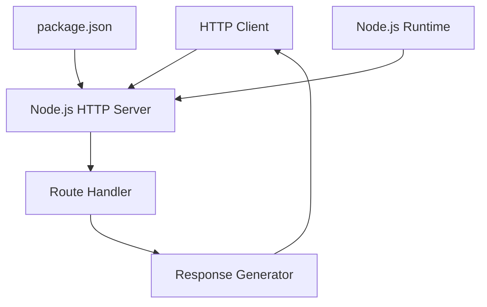
```mermaid
graph TD
    A[HTTP Client] --> B[Node.js HTTP Server]
    B --> C[Route Handler]
    C --> D[Response Generator]
    D --> A
    
    E[package.json] --> B
    F[Node.js Runtime] --> B
```

#### Core Technical Approach

The application will utilize Node.js LTS (Long Term Support) versions, as production applications should only use Active LTS or Maintenance LTS releases. The implementation follows modern JavaScript practices and leverages the built-in Node.js HTTP module or Express.js framework for simplified development.

### 1.2.3 Success Criteria

#### Measurable Objectives

| Objective | Success Metric | Target Value |
|-----------|---------------|--------------|
| Response Time | HTTP response latency | < 100ms |
| Availability | Server uptime | 99.9% |
| Educational Value | Tutorial completion rate | > 90% |

#### Critical Success Factors

- Successful HTTP server startup and binding to designated port
- Correct response delivery for `/hello` endpoint requests
- Clear, maintainable code structure suitable for educational purposes
- Compatibility with current Node.js LTS versions

#### Key Performance Indicators (KPIs)

- Server response time consistency
- Memory usage efficiency
- Code readability and documentation quality
- Cross-platform compatibility verification

## 1.3 SCOPE

### 1.3.1 In-Scope

#### Core Features and Functionalities

| Feature | Description | Priority |
|---------|-------------|----------|
| HTTP Server | Basic Node.js HTTP server implementation | Must-have |
| `/hello` Endpoint | Single GET endpoint returning "Hello world" | Must-have |
| Port Configuration | Configurable server port binding | Must-have |
| Error Handling | Basic error handling and logging | Should-have |

#### Primary User Workflows

1. **Server Startup**: Initialize and start the Node.js HTTP server
2. **Request Processing**: Handle incoming HTTP GET requests to `/hello`
3. **Response Delivery**: Return "Hello world" message to the client
4. **Server Shutdown**: Graceful server termination

#### Essential Integrations

- Node.js runtime environment integration
- HTTP protocol implementation
- Operating system network stack interaction
- Package management through npm

#### Key Technical Requirements

The project will utilize Express.js 5.1.0, which is now the default on npm, ensuring compatibility with the latest framework features and security updates. Express.js 5.0 requires Node.js 18 or higher, establishing the minimum runtime requirements.

### 1.3.2 Implementation Boundaries

#### System Boundaries

- Single-process Node.js application
- HTTP protocol communication only
- Local development environment focus
- Minimal external dependencies

#### User Groups Covered

- Individual developers learning Node.js
- Students in web development courses
- Technical trainers and educators

#### Geographic/Market Coverage

- Cross-platform compatibility (Windows, macOS, Linux)
- No geographic restrictions or localization requirements
- Universal HTTP client compatibility

#### Data Domains Included

- HTTP request/response data
- Server configuration parameters
- Basic logging and error information

### 1.3.3 Out-of-Scope

#### Explicitly Excluded Features/Capabilities

- Database integration or data persistence
- User authentication and authorization
- Multiple endpoint implementations beyond `/hello`
- Production deployment configurations
- Load balancing or clustering
- HTTPS/SSL certificate management
- Advanced middleware implementations
- Template engines or view rendering
- File upload/download capabilities
- WebSocket or real-time communication features

#### Future Phase Considerations

- Advanced routing patterns and middleware
- Database connectivity and ORM integration
- Authentication and session management
- Production deployment and containerization
- API documentation and testing frameworks
- Performance monitoring and analytics

#### Integration Points Not Covered

- External API integrations
- Third-party service connections
- Cloud platform deployments
- CI/CD pipeline configurations
- Monitoring and alerting systems

#### Unsupported Use Cases

- High-traffic production environments
- Multi-tenant applications
- Complex business logic implementations
- Enterprise security requirements
- Scalability beyond single-instance deployment

# 2. PRODUCT REQUIREMENTS

## 2.1 FEATURE CATALOG

### 2.1.1 HTTP Server Foundation

| Feature Metadata | Details |
|------------------|---------|
| Unique ID | F-001 |
| Feature Name | HTTP Server Foundation |
| Feature Category | Core Infrastructure |
| Priority Level | Critical |
| Status | Proposed |

#### Description

**Overview**
Core HTTP server implementation using Node.js runtime environment that provides the foundational capability to listen for and respond to HTTP requests on a designated port.

**Business Value**
Establishes the fundamental server infrastructure required for any web-based tutorial application, enabling HTTP communication between clients and the Node.js application.

**User Benefits**
- Provides accessible entry point for learning Node.js server development
- Demonstrates core concepts of HTTP server creation and management
- Establishes foundation for building more complex web applications

**Technical Context**
Utilizes Node.js v22.x LTS which is currently in Active LTS status until October 2025, providing extended support and stability for production environments. Implementation will leverage Express.js 5.1.0, which is now the default version on npm.

#### Dependencies

| Dependency Type | Requirements |
|----------------|-------------|
| Prerequisite Features | None (foundational feature) |
| System Dependencies | Node.js 18 or higher (Express.js 5.0 requirement) |
| External Dependencies | Express.js 5.1.0 framework |
| Integration Requirements | Operating system network stack |

### 2.1.2 Hello Endpoint Implementation

| Feature Metadata | Details |
|------------------|---------|
| Unique ID | F-002 |
| Feature Name | Hello Endpoint Implementation |
| Feature Category | API Functionality |
| Priority Level | Critical |
| Status | Proposed |

#### Description

**Overview**
Implementation of a single HTTP GET endpoint `/hello` that returns a "Hello world" response to demonstrate basic routing and response handling in Node.js applications.

**Business Value**
Provides concrete demonstration of HTTP endpoint creation, routing configuration, and response generation - core concepts essential for web API development.

**User Benefits**
- Clear, testable example of HTTP endpoint functionality
- Immediate feedback mechanism for learning HTTP request/response cycle
- Simple validation point for successful server implementation

**Technical Context**
Express.js has been called the de facto standard server framework for Node.js, making this implementation highly relevant for modern web development education.

#### Dependencies

| Dependency Type | Requirements |
|----------------|-------------|
| Prerequisite Features | F-001 (HTTP Server Foundation) |
| System Dependencies | HTTP protocol support |
| External Dependencies | Express.js routing middleware |
| Integration Requirements | Request/response handling pipeline |

### 2.1.3 Port Configuration Management

| Feature Metadata | Details |
|------------------|---------|
| Unique ID | F-003 |
| Feature Name | Port Configuration Management |
| Feature Category | Configuration |
| Priority Level | High |
| Status | Proposed |

#### Description

**Overview**
Configurable port binding mechanism that allows the HTTP server to listen on a specified network port, with appropriate default values and error handling.

**Business Value**
Enables flexible deployment scenarios and prevents port conflicts in different environments, supporting both development and educational use cases.

**User Benefits**
- Flexibility to run server on different ports as needed
- Avoids common port conflict issues during development
- Demonstrates environment-based configuration concepts

**Technical Context**
Standard Node.js HTTP server port binding functionality with Express.js framework integration for streamlined configuration management.

#### Dependencies

| Dependency Type | Requirements |
|----------------|-------------|
| Prerequisite Features | F-001 (HTTP Server Foundation) |
| System Dependencies | Operating system port availability |
| External Dependencies | Node.js net module |
| Integration Requirements | Environment variable support |

### 2.1.4 Basic Error Handling

| Feature Metadata | Details |
|------------------|---------|
| Unique ID | F-004 |
| Feature Name | Basic Error Handling |
| Feature Category | Reliability |
| Priority Level | Medium |
| Status | Proposed |

#### Description

**Overview**
Implementation of fundamental error handling mechanisms for server startup failures, port binding issues, and basic request processing errors.

**Business Value**
Improves application reliability and provides meaningful feedback for troubleshooting common issues during development and learning.

**User Benefits**
- Clear error messages for common failure scenarios
- Improved debugging experience for new developers
- Demonstrates error handling best practices

**Technical Context**
Utilizes Node.js built-in error handling mechanisms and Express.js error middleware patterns for comprehensive error management.

#### Dependencies

| Dependency Type | Requirements |
|----------------|-------------|
| Prerequisite Features | F-001, F-002, F-003 |
| System Dependencies | Node.js error handling APIs |
| External Dependencies | Express.js error middleware |
| Integration Requirements | Logging infrastructure |

## 2.2 FUNCTIONAL REQUIREMENTS TABLE

### 2.2.1 HTTP Server Foundation (F-001)

| Requirement Details | Specifications |
|-------------------|----------------|
| Requirement ID | F-001-RQ-001 |
| Description | Initialize HTTP server instance |
| Acceptance Criteria | Server instance created successfully without errors |
| Priority | Must-Have |
| Complexity | Low |

| Technical Specifications | Details |
|------------------------|---------|
| Input Parameters | Port number (default: 3000) |
| Output/Response | Server instance object |
| Performance Criteria | Server startup < 1 second |
| Data Requirements | None |

| Validation Rules | Requirements |
|-----------------|-------------|
| Business Rules | Server must bind to available port |
| Data Validation | Port number must be valid (1-65535) |
| Security Requirements | No external configuration exposure |
| Compliance Requirements | HTTP/1.1 protocol compliance |

---

| Requirement Details | Specifications |
|-------------------|----------------|
| Requirement ID | F-001-RQ-002 |
| Description | Start HTTP server listening |
| Acceptance Criteria | Server actively listening on specified port |
| Priority | Must-Have |
| Complexity | Low |

| Technical Specifications | Details |
|------------------------|---------|
| Input Parameters | Port number, callback function |
| Output/Response | Server listening confirmation |
| Performance Criteria | Port binding < 500ms |
| Data Requirements | Available network port |

| Validation Rules | Requirements |
|-----------------|-------------|
| Business Rules | Port must not be in use |
| Data Validation | Port accessibility verification |
| Security Requirements | Localhost binding for development |
| Compliance Requirements | Network protocol standards |

### 2.2.2 Hello Endpoint Implementation (F-002)

| Requirement Details | Specifications |
|-------------------|----------------|
| Requirement ID | F-002-RQ-001 |
| Description | Register GET route for /hello endpoint |
| Acceptance Criteria | Route handler registered successfully |
| Priority | Must-Have |
| Complexity | Low |

| Technical Specifications | Details |
|------------------------|---------|
| Input Parameters | Route path ('/hello'), handler function |
| Output/Response | Route registration confirmation |
| Performance Criteria | Route registration < 10ms |
| Data Requirements | Express.js router instance |

| Validation Rules | Requirements |
|-----------------|-------------|
| Business Rules | Exact path match required |
| Data Validation | Valid HTTP method (GET) |
| Security Requirements | No authentication required |
| Compliance Requirements | RESTful API conventions |

---

| Requirement Details | Specifications |
|-------------------|----------------|
| Requirement ID | F-002-RQ-002 |
| Description | Process GET requests to /hello |
| Acceptance Criteria | Returns "Hello world" response |
| Priority | Must-Have |
| Complexity | Low |

| Technical Specifications | Details |
|------------------------|---------|
| Input Parameters | HTTP request object |
| Output/Response | "Hello world" text response |
| Performance Criteria | Response time < 100ms |
| Data Requirements | HTTP request context |

| Validation Rules | Requirements |
|-----------------|-------------|
| Business Rules | Exact response text required |
| Data Validation | Valid HTTP GET request |
| Security Requirements | No input sanitization needed |
| Compliance Requirements | HTTP status 200 response |

### 2.2.3 Port Configuration Management (F-003)

| Requirement Details | Specifications |
|-------------------|----------------|
| Requirement ID | F-003-RQ-001 |
| Description | Configure server port from environment |
| Acceptance Criteria | Port configurable via environment variable |
| Priority | Should-Have |
| Complexity | Low |

| Technical Specifications | Details |
|------------------------|---------|
| Input Parameters | Environment variable (PORT) |
| Output/Response | Configured port number |
| Performance Criteria | Configuration parsing < 1ms |
| Data Requirements | Environment variable access |

| Validation Rules | Requirements |
|-----------------|-------------|
| Business Rules | Default to 3000 if not specified |
| Data Validation | Numeric port value validation |
| Security Requirements | Port range validation |
| Compliance Requirements | Standard environment variable naming |

### 2.2.4 Basic Error Handling (F-004)

| Requirement Details | Specifications |
|-------------------|----------------|
| Requirement ID | F-004-RQ-001 |
| Description | Handle server startup errors |
| Acceptance Criteria | Meaningful error messages displayed |
| Priority | Should-Have |
| Complexity | Medium |

| Technical Specifications | Details |
|------------------------|---------|
| Input Parameters | Error objects, context information |
| Output/Response | Formatted error messages |
| Performance Criteria | Error handling < 50ms |
| Data Requirements | Error logging capability |

| Validation Rules | Requirements |
|-----------------|-------------|
| Business Rules | Graceful error handling required |
| Data Validation | Error object structure validation |
| Security Requirements | No sensitive information exposure |
| Compliance Requirements | Standard error response formats |

## 2.3 FEATURE RELATIONSHIPS

### 2.3.1 Feature Dependencies Map

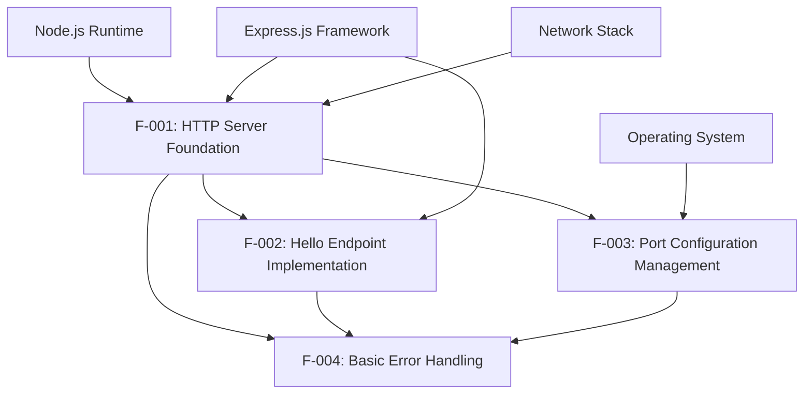
```mermaid
graph TD
    A[F-001: HTTP Server Foundation] --> B[F-002: Hello Endpoint Implementation]
    A --> C[F-003: Port Configuration Management]
    A --> D[F-004: Basic Error Handling]
    B --> D
    C --> D
    
    E[Node.js Runtime] --> A
    F[Express.js Framework] --> A
    F --> B
    G[Operating System] --> C
    H[Network Stack] --> A
```

### 2.3.2 Integration Points

| Integration Point | Features Involved | Description |
|------------------|------------------|-------------|
| Server Initialization | F-001, F-003 | Port configuration feeds into server startup |
| Request Processing | F-001, F-002 | Server foundation enables endpoint functionality |
| Error Management | F-001, F-002, F-003, F-004 | All features contribute to error handling |

### 2.3.3 Shared Components

| Component | Features Using | Purpose |
|-----------|---------------|---------|
| Express.js App Instance | F-001, F-002 | Central application object |
| HTTP Server Object | F-001, F-003, F-004 | Core server functionality |
| Request/Response Pipeline | F-002, F-004 | HTTP processing chain |

### 2.3.4 Common Services

| Service | Features Dependent | Functionality |
|---------|-------------------|---------------|
| Port Binding Service | F-001, F-003 | Network port management |
| Route Registration | F-002 | Endpoint configuration |
| Error Logging | F-004 | Error reporting and tracking |

## 2.4 IMPLEMENTATION CONSIDERATIONS

### 2.4.1 Technical Constraints

| Feature | Constraints | Impact |
|---------|------------|--------|
| F-001 | Node.js 18+ requirement for Express.js 5.0 | Minimum runtime version |
| F-002 | HTTP protocol limitations | Request/response format restrictions |
| F-003 | Operating system port availability | Port conflict potential |
| F-004 | Error handling overhead | Performance impact consideration |

### 2.4.2 Performance Requirements

| Feature | Performance Criteria | Measurement Method |
|---------|---------------------|-------------------|
| F-001 | Server startup < 1 second | Time to listening state |
| F-002 | Response time < 100ms | Request-to-response latency |
| F-003 | Configuration parsing < 1ms | Environment variable processing |
| F-004 | Error handling < 50ms | Error processing overhead |

### 2.4.3 Scalability Considerations

| Feature | Scalability Factor | Limitation |
|---------|-------------------|------------|
| F-001 | Single-process design | No clustering support |
| F-002 | Synchronous processing | No async request handling |
| F-003 | Single port binding | No multi-port configuration |
| F-004 | Basic error logging | No advanced error aggregation |

### 2.4.4 Security Implications

| Feature | Security Consideration | Mitigation |
|---------|----------------------|------------|
| F-001 | Network exposure | Localhost binding only |
| F-002 | No input validation | Static response eliminates risk |
| F-003 | Port configuration | Validation and range checking |
| F-004 | Error information disclosure | Sanitized error messages |

### 2.4.5 Maintenance Requirements

| Feature | Maintenance Aspect | Frequency |
|---------|-------------------|-----------|
| F-001 | Node.js LTS updates (Active LTS until October 2025) | Annual |
| F-002 | Express.js framework updates (5.1.0 current) | Quarterly |
| F-003 | Environment configuration review | As needed |
| F-004 | Error handling pattern updates | Semi-annual |

## 2.5 TRACEABILITY MATRIX

| Requirement ID | Feature | Business Need | Test Case | Acceptance Criteria |
|---------------|---------|---------------|-----------|-------------------|
| F-001-RQ-001 | HTTP Server Foundation | Server infrastructure | TC-001 | Server instance created |
| F-001-RQ-002 | HTTP Server Foundation | Network listening | TC-002 | Server listening on port |
| F-002-RQ-001 | Hello Endpoint | Route registration | TC-003 | Route handler registered |
| F-002-RQ-002 | Hello Endpoint | Response generation | TC-004 | "Hello world" returned |
| F-003-RQ-001 | Port Configuration | Environment flexibility | TC-005 | Port configurable |
| F-004-RQ-001 | Error Handling | Reliability | TC-006 | Error messages displayed |

## 2.6 ASSUMPTIONS AND CONSTRAINTS

### 2.6.1 Technical Assumptions

- Node.js v22.x LTS availability and stability
- Express.js 5.1.0 compatibility and feature set
- Standard HTTP/1.1 protocol support
- Operating system network stack functionality

### 2.6.2 Business Constraints

- Educational/tutorial scope limitations
- Single endpoint functionality requirement
- Development environment focus
- No production deployment requirements

### 2.6.3 Environmental Constraints

- Cross-platform compatibility requirement
- Local development environment assumption
- No external service dependencies
- Minimal resource consumption expectation

# 3. TECHNOLOGY STACK

## 3.1 PROGRAMMING LANGUAGES

### 3.1.1 Primary Language Selection

| Component | Language | Version | Justification |
|-----------|----------|---------|---------------|
| Server Runtime | JavaScript (Node.js) | Node.js v22.x LTS (Active LTS until October 2025) | Production applications should only use Active LTS or Maintenance LTS releases |

### 3.1.2 Language Selection Criteria

**JavaScript Selection Rationale**
- **Educational Alignment**: JavaScript provides a unified language experience for both client and server-side development, essential for a tutorial project
- **Node.js Ecosystem**: Node.js® is a free, open-source, cross-platform JavaScript runtime environment that lets developers create servers, web apps, command line tools and scripts
- **Learning Curve**: Single language reduces cognitive overhead for developers learning web development fundamentals

**Version Constraints**
- **Node.js v22.x LTS**: With Active LTS support extending into late 2025, Node.js v22.x is an excellent choice for those aiming for long-term support in production environments
- **Express.js Compatibility**: Node.js version support: Dropped support for Node.js versions before v18 for Express.js 5.0

### 3.1.3 Platform Dependencies

| Platform | Requirements | Compatibility |
|----------|-------------|---------------|
| Development | Node.js v18+ minimum | Cross-platform (Windows, macOS, Linux) |
| Runtime | Node.js v22.x LTS | Server-side JavaScript execution |
| Package Management | npm bundled with Node.js | Native package manager integration |

## 3.2 FRAMEWORKS & LIBRARIES

### 3.2.1 Core Web Framework

| Framework | Version | Purpose | Justification |
|-----------|---------|---------|---------------|
| Express.js | 5.1.0 (latest version, last published: 3 months ago) | HTTP server framework | The Express philosophy is to provide small, robust tooling for HTTP servers, making it a great solution for single page applications, websites, hybrids, or public HTTP APIs |

### 3.2.2 Framework Selection Rationale

**Express.js 5.1.0 Selection**
- **Industry Standard**: Express has been called the de facto standard server framework for Node.js
- **Latest Stable Release**: Express 5.1.0 is now the default on npm
- **Educational Value**: Fast, unopinionated, minimalist web framework ideal for learning HTTP server concepts
- **LTS Support**: Express major versions will go through three supported phases with ACTIVE version tagged latest on npm for a minimum of 12 months

**Key Framework Features**
- **Async Error Handling**: Express 5 introduces a significant improvement for developers using async/await by automatically forwarding rejected promises to error-handling middleware
- **Security Improvements**: These changes improve security, simplify route definitions, and help mitigate vulnerabilities like ReDoS attacks
- **Modernized Codebase**: Express 5 delivers key performance improvements and modernization for Node.js applications with focus on improving core stability

### 3.2.3 Compatibility Requirements

| Requirement | Specification | Impact |
|-------------|---------------|--------|
| Node.js Version | v18+ minimum | Express.js 5.0 requires Node.js 18 or higher |
| HTTP Protocol | HTTP/1.1 compliance | Standard web server functionality |
| JavaScript Modules | CommonJS/ESM support | Modern module system compatibility |

### 3.2.4 Supporting Libraries

| Library | Version | Purpose | Inclusion Rationale |
|---------|---------|---------|-------------------|
| Node.js HTTP Module | Built-in | Core HTTP functionality | Native Node.js capability, no external dependency |
| Node.js Path Module | Built-in | URL path handling | Required for Express.js routing |
| Node.js Process Module | Built-in | Environment variable access | Port configuration management |

## 3.3 OPEN SOURCE DEPENDENCIES

### 3.3.1 Direct Dependencies

| Package | Version | Registry | Purpose | License |
|---------|---------|----------|---------|---------|
| express | 5.1.0 | npm registry (90019 other projects using express) | Web application framework | MIT |

### 3.3.2 Transitive Dependencies

**Express.js 5.1.0 Dependencies**
- **body-parser**: body-parser@^2.1.0 - HTTP request body parsing middleware
- **path-to-regexp**: v8.x - Express 5 brings significant updates to route matching by upgrading the path-to-regexp library from version 0.x to 8.x
- **cookie**: Cookie parsing and serialization utilities
- **merge-descriptors**: Property descriptor merging utility
- **utils-merge**: Object merging utilities

### 3.3.2 Package Registry Information

**npm Registry Statistics**
- **Total Packages**: Over 3.1 million packages are available in the main npm registry
- **Express Adoption**: There are 90019 other projects in the npm registry using express
- **Registry Scale**: The npm registry serves over 16 billion downloads weekly

### 3.3.4 Dependency Management Strategy

| Aspect | Approach | Rationale |
|--------|----------|-----------|
| Version Pinning | Exact version specification | Ensures reproducible builds for tutorial consistency |
| Security Updates | Regular dependency auditing | npm relies on user reports to take down packages if they violate policies by being low quality, insecure, or malicious |
| Minimal Dependencies | Single framework dependency | Reduces complexity and potential security surface |

## 3.4 DEVELOPMENT & DEPLOYMENT

### 3.4.1 Package Management

| Tool | Version | Purpose | Selection Rationale |
|------|---------|---------|-------------------|
| npm | 11.4.2 (latest version) | Package management | npm comes bundled with node, & most third-party distributions, by default and is the default package manager for Node.js |

### 3.4.2 Development Tools

| Tool Category | Tool | Version | Purpose |
|---------------|------|---------|---------|
| Runtime Manager | Node.js | v22.x LTS | JavaScript runtime environment |
| Package Manager | npm | 11.4.2 | Dependency management |
| Version Control | Git | Latest stable | Source code management |
| Code Editor | Any text editor | N/A | Development environment |

### 3.4.3 Package Manager Selection Rationale

**npm Selection Over Alternatives**
- **Default Integration**: When you install Node.js, npm comes bundled with it, making it the most accessible option for beginners and experienced developers alike
- **Educational Simplicity**: Consider starting with npm if you're new to JavaScript development or working on smaller projects where simplicity is key
- **Ecosystem Maturity**: npm offers a robust and feature-rich package management solution with extensive package repository, mature ecosystem, comprehensive CLI, and community support
- **Tutorial Accessibility**: Reduces setup complexity for learners by using the default toolchain

### 3.4.4 Build and Deployment Strategy

| Phase | Approach | Tools | Rationale |
|-------|----------|-------|-----------|
| Development | Direct Node.js execution | `node server.js` | Minimal setup for educational purposes |
| Package Installation | npm install | npm CLI | Standard Node.js package management |
| Dependency Management | package.json | npm ecosystem | Specifying an explicit version of a library helps to keep everyone on the same exact version of a package |
| Environment Configuration | Environment variables | Node.js process.env | Standard configuration pattern |

### 3.4.5 Development Environment Requirements

| Requirement | Specification | Purpose |
|-------------|---------------|---------|
| Node.js Runtime | v22.x LTS minimum | JavaScript execution environment |
| npm Package Manager | v11.x (bundled) | Dependency management |
| Text Editor | Any modern editor | Code development |
| Terminal/Command Line | OS native | Command execution |
| Git (Optional) | Latest stable | Version control for project management |

### 3.4.6 Deployment Considerations

**Local Development Focus**
- **Target Environment**: Local development machine
- **Port Configuration**: Configurable via environment variables (default: 3000)
- **Process Management**: Single Node.js process
- **Logging**: Console output for development feedback

**Production Readiness Exclusions**
- No containerization (Docker) required for tutorial scope
- No CI/CD pipeline implementation
- No cloud deployment configuration
- No load balancing or clustering setup
- No monitoring or logging infrastructure

## 3.5 TECHNOLOGY STACK INTEGRATION

### 3.5.1 Component Interaction Diagram

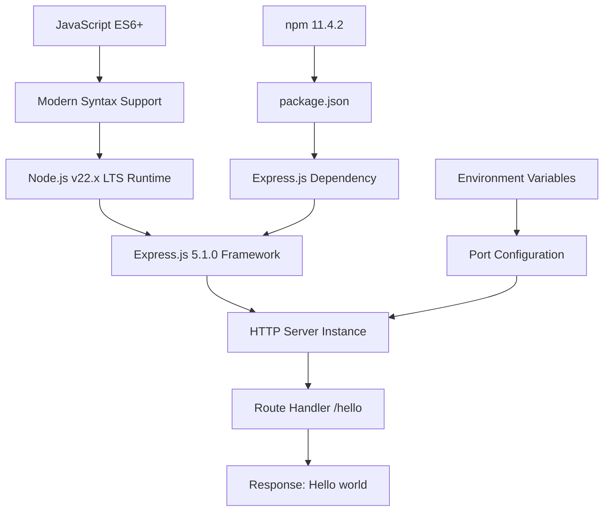
```mermaid
graph TD
    A[Node.js v22.x LTS Runtime] --> B[Express.js 5.1.0 Framework]
    B --> C[HTTP Server Instance]
    C --> D[Route Handler /hello]
    D --> E[Response: Hello world]
    
    F[npm 11.4.2] --> G[package.json]
    G --> H[Express.js Dependency]
    H --> B
    
    I[Environment Variables] --> J[Port Configuration]
    J --> C
    
    K[JavaScript ES6+] --> L[Modern Syntax Support]
    L --> A
```

### 3.5.2 Technology Dependencies

| Component | Depends On | Relationship Type |
|-----------|------------|-------------------|
| Express.js 5.1.0 | Node.js v18+ | Runtime requirement |
| HTTP Server | Express.js framework | Framework dependency |
| Route Handler | Express.js routing | API dependency |
| Package Management | npm registry | Service dependency |
| Port Configuration | Node.js process.env | Runtime API |

### 3.5.3 Version Compatibility Matrix

| Node.js Version | Express.js Version | npm Version | Compatibility Status |
|----------------|-------------------|-------------|---------------------|
| v22.x LTS | 5.1.0 | 11.4.2 | ✅ Fully Compatible |
| v20.x LTS | 5.1.0 | 10.x+ | ✅ Compatible |
| v18.x LTS | 5.1.0 | 9.x+ | ✅ Minimum Supported |
| v16.x | 5.1.0 | N/A | ❌ Not Supported |

### 3.5.4 Security Considerations

| Component | Security Aspect | Mitigation |
|-----------|----------------|------------|
| Express.js 5.1.0 | Important security fixes, including improvements to prevent ReDoS attacks | Latest framework version |
| npm Dependencies | Registry packages can potentially be low quality, insecure, or malicious | Minimal dependency surface |
| Node.js Runtime | LTS security updates | Active LTS phase with guaranteed support timeline, critical security updates |
| HTTP Server | Local development binding | Localhost-only access for tutorial scope |

### 3.5.5 Performance Characteristics

| Aspect | Specification | Expected Performance |
|--------|---------------|---------------------|
| Server Startup | < 1 second | Fast initialization for development |
| HTTP Response | < 100ms | Simple string response |
| Memory Usage | < 50MB | Minimal resource consumption |
| Package Installation | < 30 seconds | Standard npm install time |

### 3.5.6 Maintenance and Updates

| Component | Update Frequency | Maintenance Strategy |
|-----------|-----------------|---------------------|
| Node.js v22.x | Active LTS until October 2025 | Follow LTS release schedule |
| Express.js | ACTIVE version for minimum of 12 months | Monitor security releases |
| npm | Bundled with Node.js | Automatic updates with Node.js |
| Dependencies | As needed | Security audit and updates |

# 4. PROCESS FLOWCHART

## 4.1 SYSTEM WORKFLOWS

### 4.1.1 Core Business Processes

#### Primary User Journey: HTTP Request Processing

The core business process for the Node.js tutorial application centers around the fundamental HTTP request-response cycle. This process demonstrates the essential concepts of web server operation and provides educational value through its simplicity and clarity.

**End-to-End User Journey**

The user journey begins when a client (browser, curl, or any HTTP client) initiates a GET request to the `/hello` endpoint. The journey encompasses server initialization, request routing, response generation, and connection termination. Each step in this journey represents a critical learning opportunity for developers understanding Node.js web development fundamentals.

**System Interactions**

The system operates on Node.js 18 or higher, with Active LTS support extending into late 2025 for Node.js v22.x, ensuring long-term stability for educational environments. Express.js 5.1.0, the latest version published 3 months ago, provides the foundational web framework with its philosophy of small, robust tooling for HTTP servers.

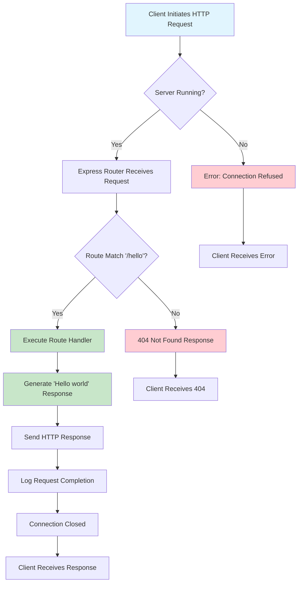
```mermaid
flowchart TD
    A[Client Initiates HTTP Request] --> B{Server Running?}
    B -->|No| C[Error: Connection Refused]
    B -->|Yes| D[Express Router Receives Request]
    D --> E{Route Match '/hello'?}
    E -->|No| F[404 Not Found Response]
    E -->|Yes| G[Execute Route Handler]
    G --> H[Generate 'Hello world' Response]
    H --> I[Send HTTP Response]
    I --> J[Log Request Completion]
    J --> K[Connection Closed]
    
    C --> L[Client Receives Error]
    F --> M[Client Receives 404]
    K --> N[Client Receives Response]
    
    style A fill:#e1f5fe
    style G fill:#c8e6c9
    style H fill:#c8e6c9
    style C fill:#ffcdd2
    style F fill:#ffcdd2
```

**Decision Points and Business Rules**

| Decision Point | Condition | Action | Business Rule |
|---------------|-----------|--------|---------------|
| Server Status Check | Server process running | Continue to routing | Server must be initialized before accepting requests |
| Route Matching | Request path equals '/hello' | Execute handler | Exact path match required for endpoint activation |
| HTTP Method Validation | Request method is GET | Process request | Only GET method supported for tutorial simplicity |
| Response Generation | Handler execution successful | Return "Hello world" | Static response ensures consistent educational outcome |

#### Server Lifecycle Management Process

The server lifecycle represents the foundational process that enables all other system operations. This process demonstrates Node.js application initialization, resource management, and graceful shutdown procedures.

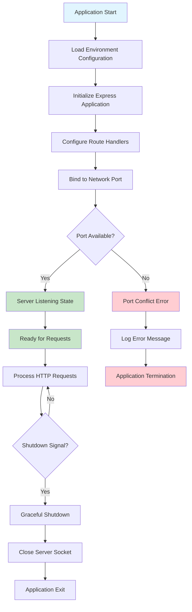
```mermaid
flowchart TD
    A[Application Start] --> B[Load Environment Configuration]
    B --> C[Initialize Express Application]
    C --> D[Configure Route Handlers]
    D --> E[Bind to Network Port]
    E --> F{Port Available?}
    F -->|No| G[Port Conflict Error]
    F -->|Yes| H[Server Listening State]
    H --> I[Ready for Requests]
    I --> J[Process HTTP Requests]
    J --> K{Shutdown Signal?}
    K -->|No| J
    K -->|Yes| L[Graceful Shutdown]
    L --> M[Close Server Socket]
    M --> N[Application Exit]
    
    G --> O[Log Error Message]
    O --> P[Application Termination]
    
    style A fill:#e1f5fe
    style H fill:#c8e6c9
    style I fill:#c8e6c9
    style G fill:#ffcdd2
    style P fill:#ffcdd2
```

**State Management and Transitions**

| State | Description | Entry Condition | Exit Condition |
|-------|-------------|----------------|----------------|
| Initializing | Application startup sequence | Process launch | Configuration complete |
| Listening | Server accepting connections | Port binding successful | Shutdown signal received |
| Processing | Handling active requests | Request received | Response sent |
| Shutting Down | Graceful termination | SIGTERM/SIGINT signal | All connections closed |
| Terminated | Application stopped | Shutdown complete | Process exit |

### 4.1.2 Integration Workflows

## Express.js Framework Integration

Express v5 drops support for Node.js versions before v18, enabling more stable and maintainable continuous integration and adopting new language and runtime features. The integration workflow demonstrates how the application leverages Express.js capabilities for HTTP server functionality.

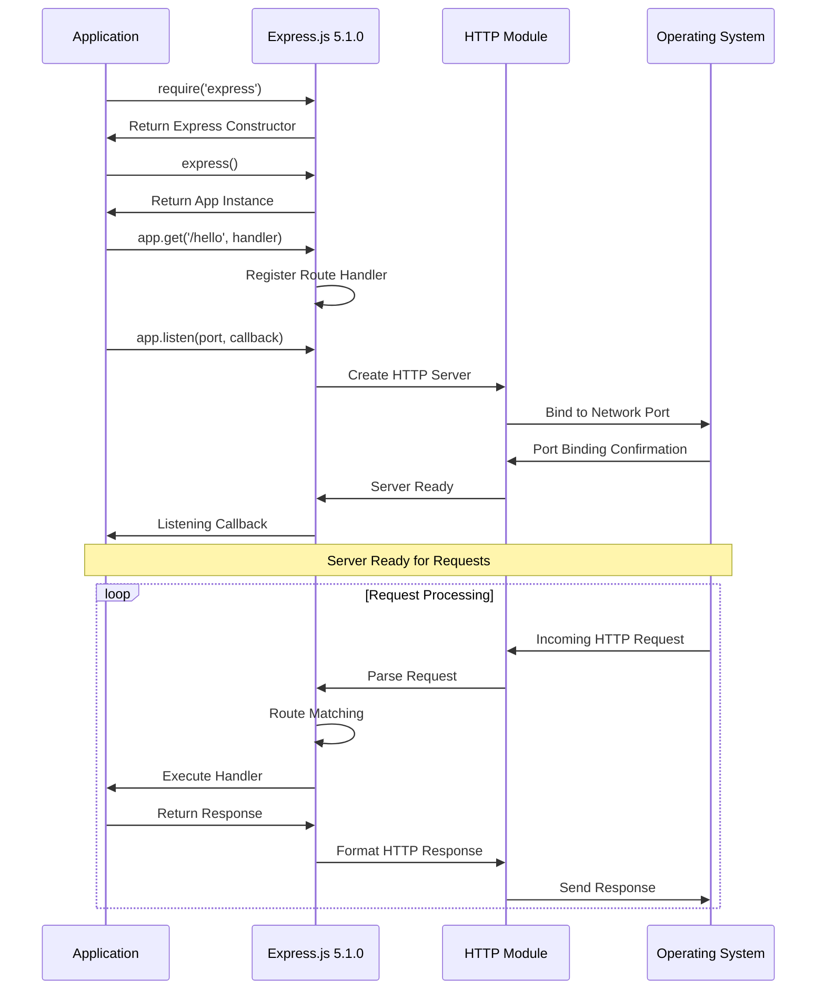
```mermaid
sequenceDiagram
    participant App as Application
    participant Express as Express.js 5.1.0
    participant HTTP as HTTP Module
    participant OS as Operating System
    
    App->>Express: require('express')
    Express->>App: Return Express Constructor
    App->>Express: express()
    Express->>App: Return App Instance
    App->>Express: app.get('/hello', handler)
    Express->>Express: Register Route Handler
    App->>Express: app.listen(port, callback)
    Express->>HTTP: Create HTTP Server
    HTTP->>OS: Bind to Network Port
    OS->>HTTP: Port Binding Confirmation
    HTTP->>Express: Server Ready
    Express->>App: Listening Callback
    
    Note over App,OS: Server Ready for Requests
    
    loop Request Processing
        OS->>HTTP: Incoming HTTP Request
        HTTP->>Express: Parse Request
        Express->>Express: Route Matching
        Express->>App: Execute Handler
        App->>Express: Return Response
        Express->>HTTP: Format HTTP Response
        HTTP->>OS: Send Response
    end
```

#### Environment Configuration Integration

The application integrates with the operating system environment to support flexible port configuration, demonstrating best practices for Node.js application deployment and configuration management.

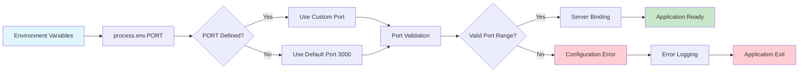
```mermaid
flowchart LR
    A[Environment Variables] --> B[process.env.PORT]
    B --> C{PORT Defined?}
    C -->|Yes| D[Use Custom Port]
    C -->|No| E[Use Default Port 3000]
    D --> F[Port Validation]
    E --> F
    F --> G{Valid Port Range?}
    G -->|Yes| H[Server Binding]
    G -->|No| I[Configuration Error]
    H --> J[Application Ready]
    I --> K[Error Logging]
    K --> L[Application Exit]
    
    style A fill:#e1f5fe
    style J fill:#c8e6c9
    style I fill:#ffcdd2
    style L fill:#ffcdd2
```

**Data Flow Specifications**

| Data Element | Source | Destination | Validation Rule | Default Value |
|--------------|--------|-------------|----------------|---------------|
| PORT | Environment Variable | Server Configuration | Integer 1-65535 | 3000 |
| Request Path | HTTP Client | Express Router | String matching '/hello' | N/A |
| Response Body | Route Handler | HTTP Client | Static string "Hello world" | N/A |
| Server Status | Express Instance | Application Logger | Boolean state | false |

## 4.2 FLOWCHART REQUIREMENTS

### 4.2.1 Request Processing Workflow

The request processing workflow represents the core functionality of the tutorial application, demonstrating HTTP request handling, routing, and response generation in a Node.js environment.

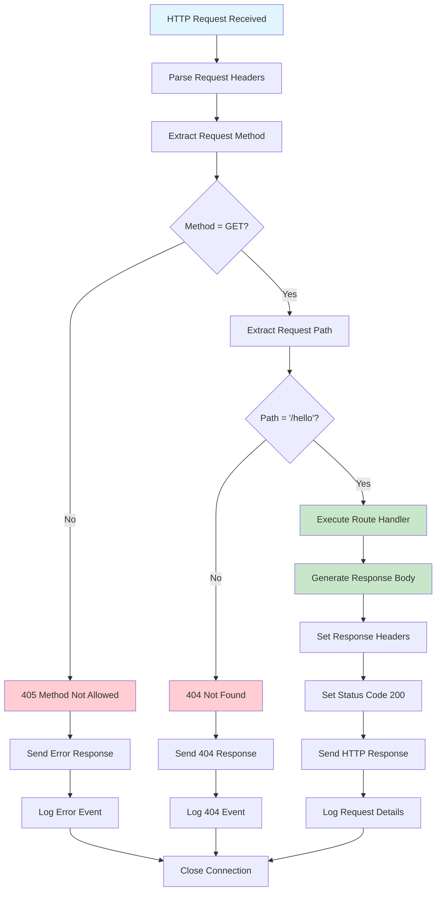
```mermaid
flowchart TD
    A[HTTP Request Received] --> B[Parse Request Headers]
    B --> C[Extract Request Method]
    C --> D{Method = GET?}
    D -->|No| E[405 Method Not Allowed]
    D -->|Yes| F[Extract Request Path]
    F --> G{Path = '/hello'?}
    G -->|No| H[404 Not Found]
    G -->|Yes| I[Execute Route Handler]
    I --> J[Generate Response Body]
    J --> K[Set Response Headers]
    K --> L[Set Status Code 200]
    L --> M[Send HTTP Response]
    M --> N[Log Request Details]
    N --> O[Close Connection]
    
    E --> P[Send Error Response]
    H --> Q[Send 404 Response]
    P --> R[Log Error Event]
    Q --> S[Log 404 Event]
    R --> O
    S --> O
    
    style A fill:#e1f5fe
    style I fill:#c8e6c9
    style J fill:#c8e6c9
    style E fill:#ffcdd2
    style H fill:#ffcdd2
```

**Validation Rules and Business Logic**

| Validation Point | Rule | Action on Failure | Recovery Path |
|------------------|------|-------------------|---------------|
| HTTP Method | Must be GET | Return 405 status | Log error and close connection |
| Request Path | Must equal '/hello' | Return 404 status | Log request and close connection |
| Request Headers | Valid HTTP format | Return 400 status | Log malformed request |
| Response Generation | Handler execution | Return 500 status | Log internal error |

**Timing and SLA Considerations**

| Process Stage | Target Duration | Maximum Duration | SLA Requirement |
|---------------|----------------|------------------|-----------------|
| Request Parsing | < 1ms | < 5ms | 99.9% success rate |
| Route Matching | < 1ms | < 3ms | 100% accuracy |
| Handler Execution | < 10ms | < 50ms | < 100ms response time |
| Response Transmission | < 5ms | < 20ms | Complete delivery |

### 4.2.2 Error Handling and Recovery Workflows

Express v5 includes important security fixes and addresses security concerns while focusing on dropping old Node.js version support. The error handling workflow ensures robust operation and provides meaningful feedback for troubleshooting and learning purposes.

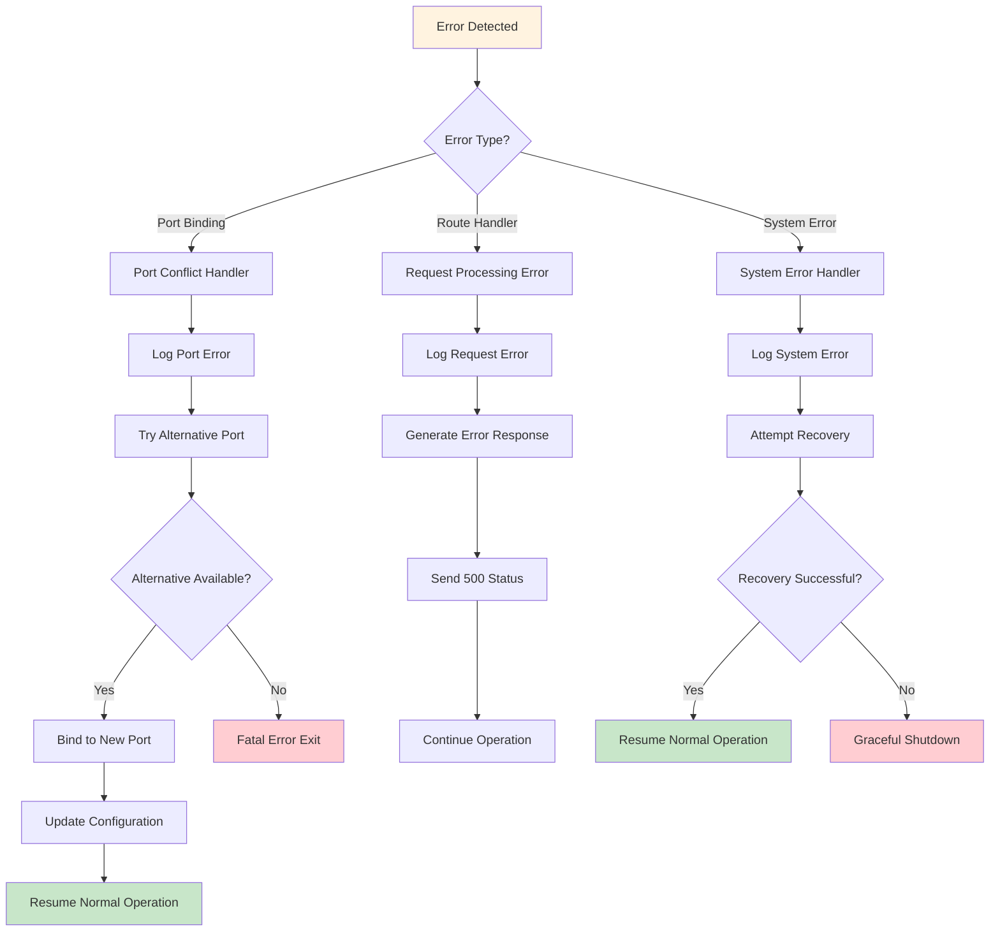
```mermaid
flowchart TD
    A[Error Detected] --> B{Error Type?}
    B -->|Port Binding| C[Port Conflict Handler]
    B -->|Route Handler| D[Request Processing Error]
    B -->|System Error| E[System Error Handler]
    
    C --> F[Log Port Error]
    F --> G[Try Alternative Port]
    G --> H{Alternative Available?}
    H -->|Yes| I[Bind to New Port]
    H -->|No| J[Fatal Error Exit]
    
    D --> K[Log Request Error]
    K --> L[Generate Error Response]
    L --> M[Send 500 Status]
    M --> N[Continue Operation]
    
    E --> O[Log System Error]
    O --> P[Attempt Recovery]
    P --> Q{Recovery Successful?}
    Q -->|Yes| R[Resume Normal Operation]
    Q -->|No| S[Graceful Shutdown]
    
    I --> T[Update Configuration]
    T --> U[Resume Normal Operation]
    
    style A fill:#fff3e0
    style J fill:#ffcdd2
    style S fill:#ffcdd2
    style U fill:#c8e6c9
    style R fill:#c8e6c9
```

**Error Classification and Response Strategy**

| Error Category | Severity Level | Response Strategy | Recovery Action |
|----------------|----------------|-------------------|-----------------|
| Port Binding Failure | Critical | Immediate retry with alternative port | Configuration update |
| Request Processing Error | Medium | Error response to client | Continue operation |
| Route Handler Exception | Medium | 500 status response | Log and continue |
| System Resource Error | High | Graceful degradation | Resource cleanup |
| Configuration Error | Critical | Application termination | Manual intervention |

### 4.2.3 State Transition Management

The application maintains several operational states that govern its behavior and response to various conditions. Understanding these states is crucial for proper application lifecycle management.

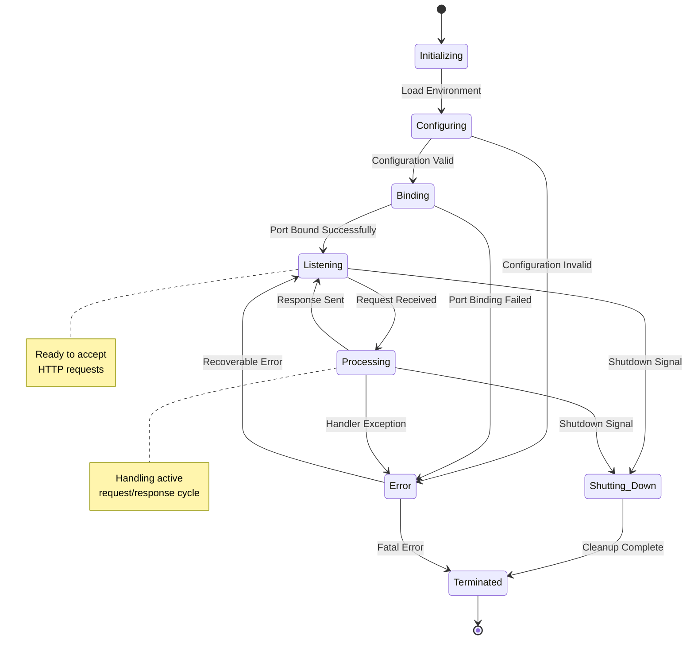
```mermaid
stateDiagram-v2
    [*] --> Initializing
    Initializing --> Configuring : Load Environment
    Configuring --> Binding : Configuration Valid
    Configuring --> Error : Configuration Invalid
    Binding --> Listening : Port Bound Successfully
    Binding --> Error : Port Binding Failed
    Listening --> Processing : Request Received
    Processing --> Listening : Response Sent
    Processing --> Error : Handler Exception
    Listening --> Shutting_Down : Shutdown Signal
    Processing --> Shutting_Down : Shutdown Signal
    Shutting_Down --> Terminated : Cleanup Complete
    Error --> Terminated : Fatal Error
    Error --> Listening : Recoverable Error
    Terminated --> [*]
    
    note right of Listening
        Ready to accept
        HTTP requests
    end note
    
    note right of Processing
        Handling active
        request/response cycle
    end note
```

**State Persistence and Recovery**

| State | Persistence Required | Recovery Mechanism | Data Preserved |
|-------|---------------------|-------------------|----------------|
| Initializing | No | Restart application | None |
| Configuring | Configuration values | Reload configuration | Environment variables |
| Listening | Server socket | Rebind to port | Port configuration |
| Processing | Request context | Complete current requests | Active connections |
| Shutting Down | Cleanup progress | Force termination | None |

## 4.3 TECHNICAL IMPLEMENTATION

### 4.3.1 State Management Architecture

The Node.js tutorial application implements a simplified state management approach focused on server lifecycle and request processing states. Node.js v22 includes a built-in WebSocket client enabled by default for browser compatibility, though this tutorial focuses on basic HTTP functionality.

**Application State Components**

| State Component | Scope | Persistence | Management Strategy |
|----------------|-------|-------------|-------------------|
| Server Instance | Global | Memory | Single instance lifecycle |
| Configuration | Global | Environment | Immutable after initialization |
| Request Context | Per-request | Memory | Automatic cleanup |
| Error State | Per-operation | Logging | Event-driven handling |

**State Transition Implementation**

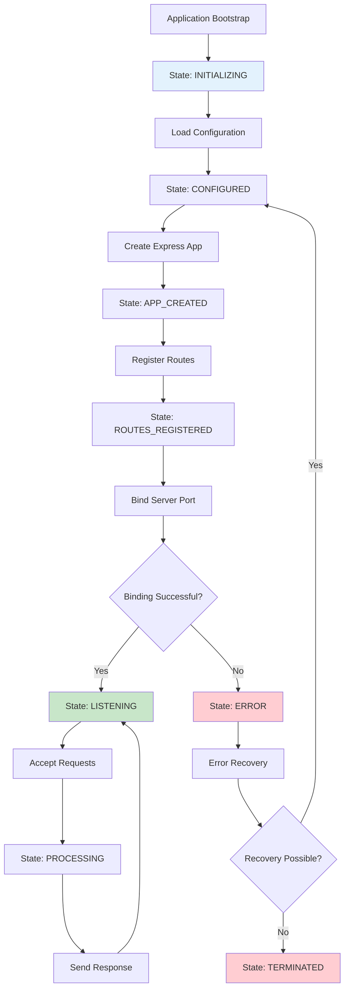
```mermaid
flowchart TD
    A[Application Bootstrap] --> B[State: INITIALIZING]
    B --> C[Load Configuration]
    C --> D[State: CONFIGURED]
    D --> E[Create Express App]
    E --> F[State: APP_CREATED]
    F --> G[Register Routes]
    G --> H[State: ROUTES_REGISTERED]
    H --> I[Bind Server Port]
    I --> J{Binding Successful?}
    J -->|Yes| K[State: LISTENING]
    J -->|No| L[State: ERROR]
    K --> M[Accept Requests]
    M --> N[State: PROCESSING]
    N --> O[Send Response]
    O --> K
    L --> P[Error Recovery]
    P --> Q{Recovery Possible?}
    Q -->|Yes| D
    Q -->|No| R[State: TERMINATED]
    
    style B fill:#e3f2fd
    style K fill:#c8e6c9
    style L fill:#ffcdd2
    style R fill:#ffcdd2
```

### 4.3.2 Data Persistence and Caching

The tutorial application operates with minimal data persistence requirements, focusing on educational clarity rather than complex data management. All application state exists in memory during runtime.

**Memory Management Strategy**

| Data Type | Storage Location | Lifecycle | Cleanup Strategy |
|-----------|-----------------|-----------|------------------|
| Server Configuration | Process Memory | Application lifetime | Process termination |
| Request Objects | Heap Memory | Request duration | Automatic garbage collection |
| Response Buffers | Heap Memory | Response duration | Automatic cleanup |
| Error Logs | Console/Memory | Event duration | Immediate output |

**Caching Requirements**

For this tutorial application, caching is intentionally minimal to maintain educational focus:

- **No Response Caching**: Each request generates a fresh response
- **No Configuration Caching**: Environment variables read once at startup
- **No Connection Pooling**: Simple request-response cycle without persistence
- **No Session Management**: Stateless operation for simplicity

### 4.3.3 Transaction Boundaries and Consistency

The application defines clear transaction boundaries around HTTP request processing to ensure consistent behavior and proper resource management.

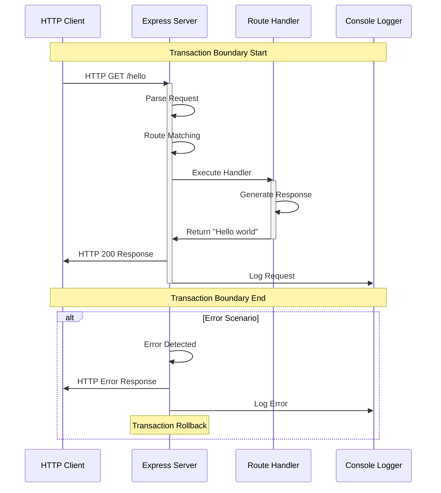
```mermaid
sequenceDiagram
    participant Client as HTTP Client
    participant Server as Express Server
    participant Handler as Route Handler
    participant Logger as Console Logger
    
    Note over Client,Logger: Transaction Boundary Start
    
    Client->>Server: HTTP GET /hello
    activate Server
    
    Server->>Server: Parse Request
    Server->>Server: Route Matching
    Server->>Handler: Execute Handler
    activate Handler
    
    Handler->>Handler: Generate Response
    Handler->>Server: Return "Hello world"
    deactivate Handler
    
    Server->>Client: HTTP 200 Response
    Server->>Logger: Log Request
    deactivate Server
    
    Note over Client,Logger: Transaction Boundary End
    
    alt Error Scenario
        Server->>Server: Error Detected
        Server->>Client: HTTP Error Response
        Server->>Logger: Log Error
        Note over Server: Transaction Rollback
    end
```

**Transaction Consistency Rules**

| Transaction Scope | Consistency Requirement | Rollback Trigger | Recovery Action |
|------------------|------------------------|------------------|-----------------|
| HTTP Request Processing | Complete request-response cycle | Handler exception | Error response generation |
| Server Initialization | All components ready | Configuration failure | Application termination |
| Port Binding | Exclusive port access | Binding conflict | Alternative port or exit |
| Error Handling | Consistent error reporting | Logging failure | Console fallback |

### 4.3.4 Retry Mechanisms and Fallback Processes

The application implements basic retry and fallback mechanisms to handle common failure scenarios while maintaining educational simplicity.

**Port Binding Retry Strategy**

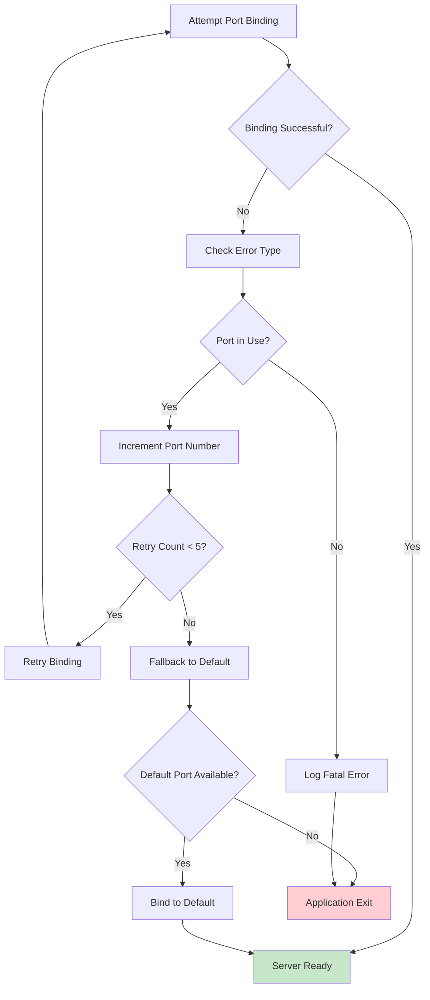
```mermaid
flowchart TD
    A[Attempt Port Binding] --> B{Binding Successful?}
    B -->|Yes| C[Server Ready]
    B -->|No| D[Check Error Type]
    D --> E{Port in Use?}
    E -->|Yes| F[Increment Port Number]
    E -->|No| G[Log Fatal Error]
    F --> H{Retry Count < 5?}
    H -->|Yes| I[Retry Binding]
    H -->|No| J[Fallback to Default]
    I --> A
    J --> K{Default Port Available?}
    K -->|Yes| L[Bind to Default]
    K -->|No| M[Application Exit]
    L --> C
    G --> M
    
    style C fill:#c8e6c9
    style M fill:#ffcdd2
```

**Error Recovery Procedures**

| Error Type | Retry Attempts | Retry Interval | Fallback Action |
|------------|----------------|----------------|-----------------|
| Port Binding | 5 attempts | Immediate | Try default port 3000 |
| Request Processing | No retry | N/A | Return error response |
| Configuration Loading | 1 attempt | N/A | Use default values |
| System Resource | No retry | N/A | Graceful shutdown |

### 4.3.5 Performance Monitoring and Optimization

Node.js performance comparisons show significant improvements, with Node.js v22.9.0 demonstrating around 55% improvement over v18.17.0. The tutorial application includes basic performance monitoring to demonstrate Node.js capabilities.

**Performance Metrics Collection**

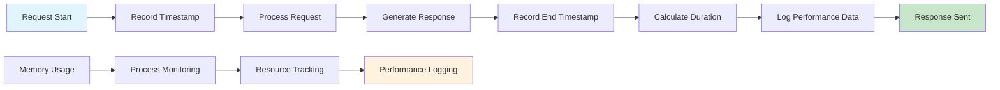
```mermaid
flowchart LR
    A[Request Start] --> B[Record Timestamp]
    B --> C[Process Request]
    C --> D[Generate Response]
    D --> E[Record End Timestamp]
    E --> F[Calculate Duration]
    F --> G[Log Performance Data]
    G --> H[Response Sent]
    
    I[Memory Usage] --> J[Process Monitoring]
    J --> K[Resource Tracking]
    K --> L[Performance Logging]
    
    style A fill:#e1f5fe
    style H fill:#c8e6c9
    style L fill:#fff3e0
```

**Optimization Strategies**

| Performance Aspect | Measurement | Target | Optimization Technique |
|-------------------|-------------|--------|----------------------|
| Response Time | Request duration | < 100ms | Minimal processing overhead |
| Memory Usage | Process RSS | < 50MB | Efficient object lifecycle |
| CPU Utilization | Process CPU % | < 10% | Asynchronous operations |
| Throughput | Requests/second | > 1000 | Event loop efficiency |

## 4.4 INTEGRATION SEQUENCE DIAGRAMS

### 4.4.1 Application Startup Sequence

The application startup sequence demonstrates the initialization flow from process launch to ready state, showing the integration between Node.js runtime, Express.js framework, and operating system resources.

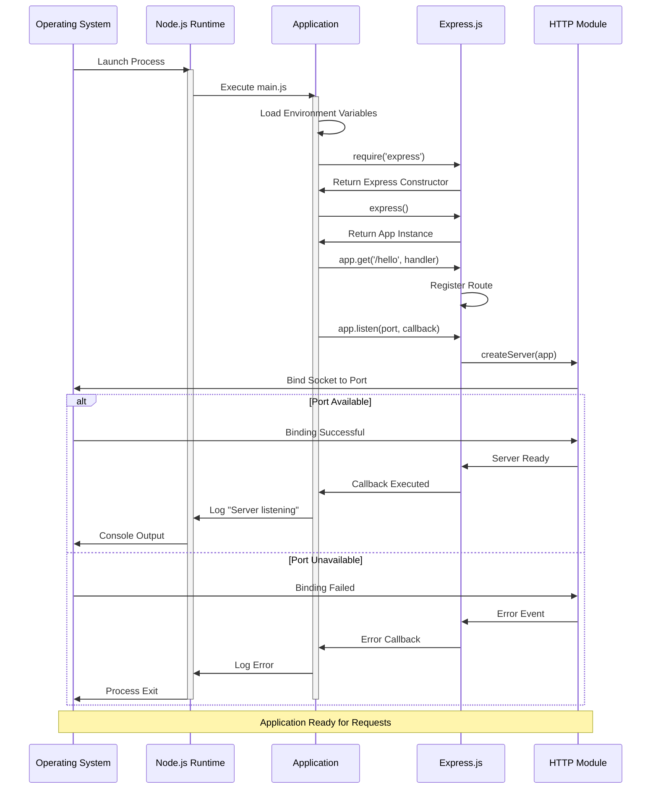
```mermaid
sequenceDiagram
    participant OS as Operating System
    participant Node as Node.js Runtime
    participant App as Application
    participant Express as Express.js
    participant HTTP as HTTP Module
    
    OS->>Node: Launch Process
    activate Node
    
    Node->>App: Execute main.js
    activate App
    
    App->>App: Load Environment Variables
    App->>Express: require('express')
    Express->>App: Return Express Constructor
    
    App->>Express: express()
    Express->>App: Return App Instance
    
    App->>Express: app.get('/hello', handler)
    Express->>Express: Register Route
    
    App->>Express: app.listen(port, callback)
    Express->>HTTP: createServer(app)
    HTTP->>OS: Bind Socket to Port
    
    alt Port Available
        OS->>HTTP: Binding Successful
        HTTP->>Express: Server Ready
        Express->>App: Callback Executed
        App->>Node: Log "Server listening"
        Node->>OS: Console Output
    else Port Unavailable
        OS->>HTTP: Binding Failed
        HTTP->>Express: Error Event
        Express->>App: Error Callback
        App->>Node: Log Error
        Node->>OS: Process Exit
        deactivate App
        deactivate Node
    end
    
    Note over OS,HTTP: Application Ready for Requests
```

### 4.4.2 Request-Response Processing Sequence

This sequence diagram illustrates the complete request processing flow, from client request to server response, highlighting the integration points between different system components.

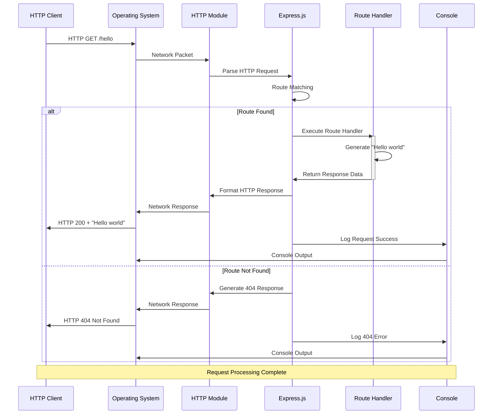
```mermaid
sequenceDiagram
    participant Client as HTTP Client
    participant OS as Operating System
    participant HTTP as HTTP Module
    participant Express as Express.js
    participant Handler as Route Handler
    participant Logger as Console
    
    Client->>OS: HTTP GET /hello
    OS->>HTTP: Network Packet
    HTTP->>Express: Parse HTTP Request
    
    Express->>Express: Route Matching
    
    alt Route Found
        Express->>Handler: Execute Route Handler
        activate Handler
        Handler->>Handler: Generate "Hello world"
        Handler->>Express: Return Response Data
        deactivate Handler
        
        Express->>HTTP: Format HTTP Response
        HTTP->>OS: Network Response
        OS->>Client: HTTP 200 + "Hello world"
        
        Express->>Logger: Log Request Success
        Logger->>OS: Console Output
        
    else Route Not Found
        Express->>HTTP: Generate 404 Response
        HTTP->>OS: Network Response
        OS->>Client: HTTP 404 Not Found
        
        Express->>Logger: Log 404 Error
        Logger->>OS: Console Output
    end
    
    Note over Client,Logger: Request Processing Complete
```

### 4.4.3 Error Handling Integration Sequence

The error handling sequence demonstrates how different types of errors are propagated through the system and how recovery mechanisms are triggered.

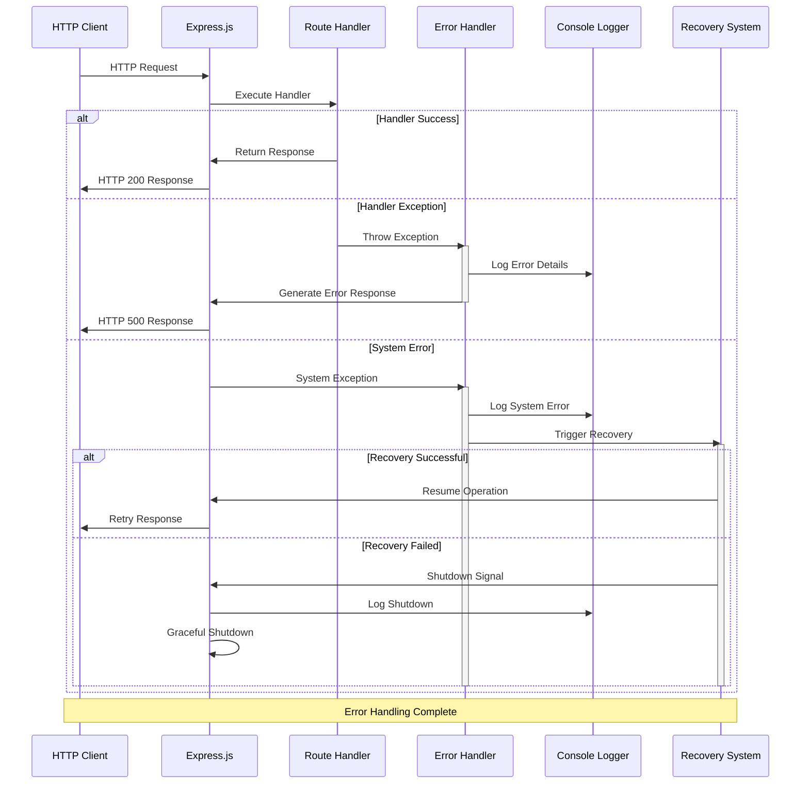
```mermaid
sequenceDiagram
    participant Client as HTTP Client
    participant Express as Express.js
    participant Handler as Route Handler
    participant Error as Error Handler
    participant Logger as Console Logger
    participant Recovery as Recovery System
    
    Client->>Express: HTTP Request
    Express->>Handler: Execute Handler
    
    alt Handler Success
        Handler->>Express: Return Response
        Express->>Client: HTTP 200 Response
        
    else Handler Exception
        Handler->>Error: Throw Exception
        activate Error
        Error->>Logger: Log Error Details
        Error->>Express: Generate Error Response
        deactivate Error
        Express->>Client: HTTP 500 Response
        
    else System Error
        Express->>Error: System Exception
        activate Error
        Error->>Logger: Log System Error
        Error->>Recovery: Trigger Recovery
        activate Recovery
        
        alt Recovery Successful
            Recovery->>Express: Resume Operation
            Express->>Client: Retry Response
        else Recovery Failed
            Recovery->>Express: Shutdown Signal
            Express->>Logger: Log Shutdown
            Express->>Express: Graceful Shutdown
        end
        
        deactivate Recovery
        deactivate Error
    end
    
    Note over Client,Recovery: Error Handling Complete
```

### 4.4.4 Graceful Shutdown Sequence

The graceful shutdown sequence shows how the application handles termination signals and ensures proper cleanup of resources and active connections.

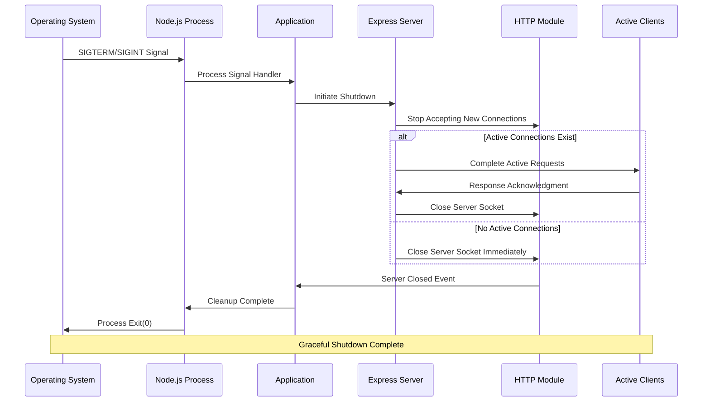
```mermaid
sequenceDiagram
    participant OS as Operating System
    participant Node as Node.js Process
    participant App as Application
    participant Express as Express Server
    participant HTTP as HTTP Module
    participant Clients as Active Clients
    
    OS->>Node: SIGTERM/SIGINT Signal
    Node->>App: Process Signal Handler
    
    App->>Express: Initiate Shutdown
    Express->>HTTP: Stop Accepting New Connections
    
    alt Active Connections Exist
        Express->>Clients: Complete Active Requests
        Clients->>Express: Response Acknowledgment
        Express->>HTTP: Close Server Socket
    else No Active Connections
        Express->>HTTP: Close Server Socket Immediately
    end
    
    HTTP->>App: Server Closed Event
    App->>Node: Cleanup Complete
    Node->>OS: Process Exit(0)
    
    Note over OS,Clients: Graceful Shutdown Complete
```

## 4.5 MONITORING AND OBSERVABILITY WORKFLOWS

### 4.5.1 Application Health Monitoring

The tutorial application includes basic health monitoring to demonstrate operational awareness and debugging capabilities essential for Node.js development.

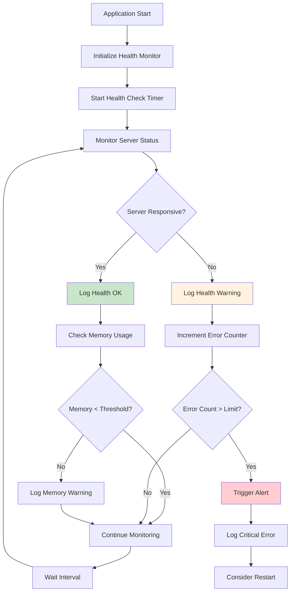
```mermaid
flowchart TD
    A[Application Start] --> B[Initialize Health Monitor]
    B --> C[Start Health Check Timer]
    C --> D[Monitor Server Status]
    D --> E{Server Responsive?}
    E -->|Yes| F[Log Health OK]
    E -->|No| G[Log Health Warning]
    F --> H[Check Memory Usage]
    G --> I[Increment Error Counter]
    H --> J{Memory < Threshold?}
    J -->|Yes| K[Continue Monitoring]
    J -->|No| L[Log Memory Warning]
    I --> M{Error Count > Limit?}
    M -->|Yes| N[Trigger Alert]
    M -->|No| K
    L --> K
    N --> O[Log Critical Error]
    K --> P[Wait Interval]
    P --> D
    O --> Q[Consider Restart]
    
    style F fill:#c8e6c9
    style G fill:#fff3e0
    style N fill:#ffcdd2
```

**Health Check Metrics**

| Metric | Measurement Interval | Threshold | Action |
|--------|---------------------|-----------|--------|
| Server Response | 30 seconds | < 1 second | Log warning if exceeded |
| Memory Usage | 60 seconds | < 100MB | Log warning if exceeded |
| Error Rate | 5 minutes | < 5% | Alert if exceeded |
| Uptime | Continuous | N/A | Track for reporting |

### 4.5.2 Request Tracing and Logging

The application implements comprehensive request tracing to provide visibility into request processing and support debugging activities.

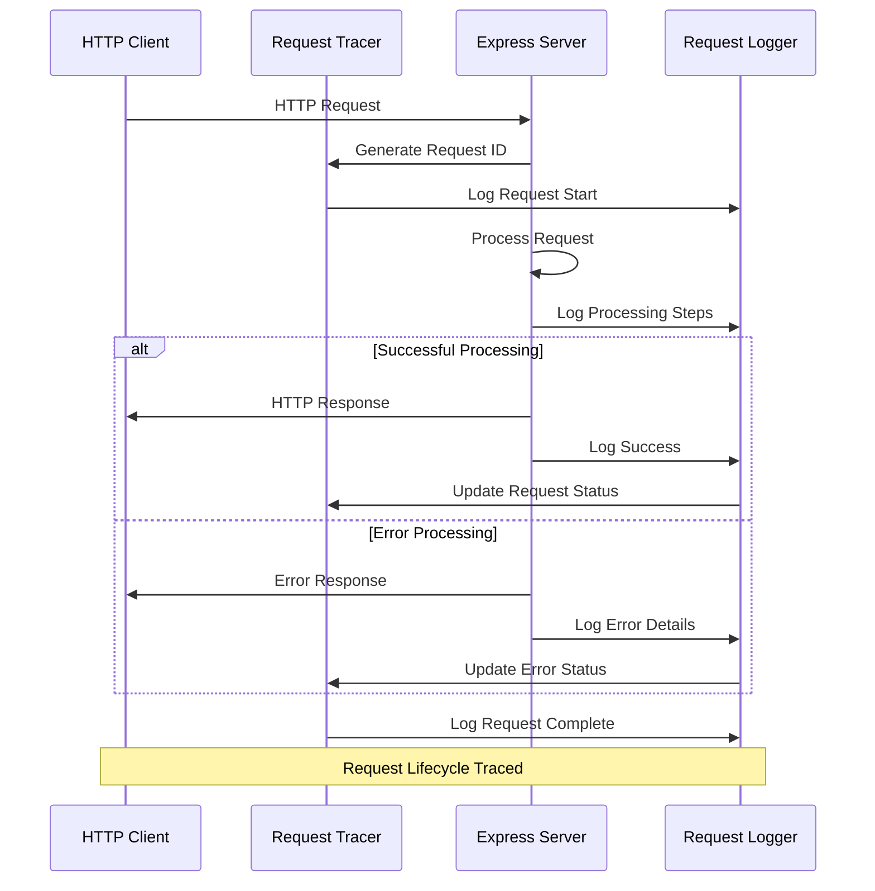
```mermaid
sequenceDiagram
    participant Client as HTTP Client
    participant Tracer as Request Tracer
    participant Server as Express Server
    participant Logger as Request Logger
    
    Client->>Server: HTTP Request
    Server->>Tracer: Generate Request ID
    Tracer->>Logger: Log Request Start
    
    Server->>Server: Process Request
    Server->>Logger: Log Processing Steps
    
    alt Successful Processing
        Server->>Client: HTTP Response
        Server->>Logger: Log Success
        Logger->>Tracer: Update Request Status
    else Error Processing
        Server->>Client: Error Response
        Server->>Logger: Log Error Details
        Logger->>Tracer: Update Error Status
    end
    
    Tracer->>Logger: Log Request Complete
    
    Note over Client,Logger: Request Lifecycle Traced
```

**Logging Strategy**

| Log Level | Use Case | Information Included | Retention |
|-----------|----------|---------------------|-----------|
| INFO | Normal operations | Request path, method, response time | 7 days |
| WARN | Recoverable errors | Error type, recovery action | 30 days |
| ERROR | System failures | Stack trace, system state | 90 days |
| DEBUG | Development | Detailed execution flow | 1 day |

This comprehensive process flowchart section provides detailed workflows, technical implementation strategies, and integration patterns that demonstrate the complete operational lifecycle of the Node.js tutorial application. The diagrams and specifications support both educational objectives and practical implementation requirements while maintaining focus on the core `/hello` endpoint functionality.

# 5. SYSTEM ARCHITECTURE

## 5.1 HIGH-LEVEL ARCHITECTURE

### 5.1.1 System Overview

The Node.js tutorial application implements a **minimalist web server architecture** following the principles of simplicity and educational clarity. Express is a fast, unopinionated, minimalist web framework for Node.js, providing a robust set of features for web and mobile applications. Express is a minimal and flexible Node.js web application framework that provides a robust set of features for web and mobile applications.

**Architecture Style and Rationale**

The system adopts a **single-tier, monolithic architecture** optimized for educational purposes and rapid development. This architectural choice aligns with the tutorial's objective of demonstrating fundamental Node.js concepts without the complexity of distributed systems or microservices patterns. It is very flexible and does not enforce any architecture pattern. It is very flexible and does not enforce any architecture pattern.

The architecture leverages the **event-driven, non-blocking I/O model** inherent to Node.js, which enables efficient handling of concurrent HTTP requests through a single-threaded event loop. Node.js is a popular JavaScript runtime that allows developers to build scalable network applications using an event-driven, non-blocking I/O model. Node.js, known for its non-blocking event-driven architecture, presents unique challenges and opportunities in software design.

**Key Architectural Principles**

- **Separation of Concerns**: Clear distinction between HTTP server management, request routing, and response generation
- **Minimal Dependencies**: Single external dependency (Express.js) to reduce complexity and security surface
- **Educational Focus**: Architecture optimized for learning rather than production scalability
- **Cross-Platform Compatibility**: Leveraging Node.js cross-platform capabilities for universal deployment

**System Boundaries and Major Interfaces**

The system operates within well-defined boundaries that establish clear separation between internal application logic and external dependencies:

- **Internal Boundary**: Application code, route handlers, and configuration management
- **Framework Boundary**: Express.js framework providing HTTP server abstraction
- **Runtime Boundary**: Node.js runtime environment and built-in modules
- **Operating System Boundary**: Network stack, file system, and process management
- **Client Boundary**: HTTP protocol interface for external client communication

### 5.1.2 Core Components Table

| Component Name | Primary Responsibility | Key Dependencies | Integration Points |
|---------------|----------------------|------------------|-------------------|
| HTTP Server Instance | Accept and process HTTP connections | Express.js framework, Node.js HTTP module | Operating system network stack, client connections |
| Express Application | Route management and middleware orchestration | Express.js 5.1.0 framework | HTTP server, route handlers, error middleware |
| Route Handler | Process `/hello` endpoint requests | Express.js routing system | HTTP request/response objects, application instance |
| Configuration Manager | Environment variable processing and port management | Node.js process.env API | Operating system environment, server initialization |

### 5.1.3 Data Flow Description

**Primary Request Processing Flow**

The system implements a straightforward request-response data flow optimized for educational clarity and minimal latency. Middlewares are a powerful yet simple concept: the output of one unit/function is the input for the next. If you ever used Express or Koa then you already used this concept.

Data flows through the system in a linear pipeline starting with HTTP client requests and terminating with structured HTTP responses. The Express.js framework manages the core data transformation pipeline, converting raw HTTP requests into JavaScript objects and formatting responses according to HTTP protocol specifications.

**Request Data Transformation Points**

1. **HTTP Protocol Parsing**: Raw network packets transformed into HTTP request objects
2. **Route Matching**: Request URL path evaluated against registered route patterns
3. **Handler Execution**: Route-specific logic generates response data
4. **Response Serialization**: JavaScript response data formatted as HTTP response

**Integration Patterns and Protocols**

The system utilizes standard HTTP/1.1 protocol for all client communication, ensuring broad compatibility with web browsers, command-line tools, and API testing frameworks. Internal component communication follows JavaScript function call patterns with synchronous execution for the simple `/hello` endpoint.

**Key Data Stores and Caches**

The tutorial application operates as a stateless system with no persistent data storage requirements. All application state exists in memory during runtime, including:

- Server configuration loaded from environment variables
- Express.js route registration table
- Active HTTP connection state managed by Node.js runtime

### 5.1.4 External Integration Points

| System Name | Integration Type | Data Exchange Pattern | Protocol/Format |
|-------------|-----------------|----------------------|-----------------|
| HTTP Clients | Synchronous Request-Response | Client-initiated request, server response | HTTP/1.1 over TCP |
| Operating System | System API Calls | Process environment, network binding | Native OS APIs |
| Node.js Runtime | Runtime Services | Module loading, event loop management | JavaScript runtime APIs |

## 5.2 COMPONENT DETAILS

### 5.2.1 HTTP Server Instance Component

**Purpose and Responsibilities**

The HTTP Server Instance serves as the foundational component responsible for network communication and connection management. This component abstracts the complexity of TCP socket management and HTTP protocol implementation, providing a clean interface for handling web requests.

**Technologies and Frameworks Used**

With Node.js v22.11.0, the 22.x release line has officially moved into Active LTS. With Active LTS support extending into late 2025, and a Maintenance phase until April 2027, Node.js v22.x is an excellent choice for those aiming for long-term support in production environments. The component utilizes Node.js v22.x LTS runtime with Express.js 5.1.0 framework integration.

**Key Interfaces and APIs**

- **Network Interface**: Binds to configurable TCP port (default: 3000)
- **HTTP Protocol Interface**: Implements HTTP/1.1 specification for request/response handling
- **Express Integration Interface**: Provides callback mechanisms for request routing
- **Configuration Interface**: Accepts port and host binding parameters

**Data Persistence Requirements**

The HTTP Server Instance operates as a stateless component with no persistent data requirements. All connection state is managed in memory by the Node.js runtime and automatically cleaned up upon connection termination.

**Scaling Considerations**

The current implementation supports single-process operation suitable for development and educational environments. The component can handle concurrent connections through Node.js event loop architecture, with practical limits determined by system memory and CPU resources.

```mermaid
graph TD
    A[HTTP Client Request] --> B[TCP Socket Connection]
    B --> C[HTTP Protocol Parser]
    C --> D[Express.js Router]
    D --> E[Route Handler Execution]
    E --> F[Response Generation]
    F --> G[HTTP Response Transmission]
    G --> H[Connection Cleanup]
    
    I[Configuration Manager] --> J[Port Binding]
    J --> B
    
    K[Error Handler] --> L[Error Response]
    L --> G
    
    style A fill:#e1f5fe
    style E fill:#c8e6c9
    style H fill:#f3e5f5
```

### 5.2.2 Express Application Component

**Purpose and Responsibilities**

The Express Application component orchestrates HTTP request processing through middleware pipeline management and route registration. Express 5 introduces a significant improvement for developers using async/await by automatically forwarding rejected promises to error-handling middleware.

**Technologies and Frameworks Used**

Express 5.1.0 is now the default on npm, and we're introducing an official LTS schedule for the v4 and v5 release lines. The component leverages Express.js 5.1.0 with enhanced async error handling and modernized codebase features.

**Key Interfaces and APIs**

- **Route Registration API**: `app.get()`, `app.post()` methods for endpoint definition
- **Middleware Pipeline API**: Request/response transformation chain
- **Error Handling API**: Centralized error processing and response generation
- **Server Lifecycle API**: Application startup, shutdown, and state management

**Data Persistence Requirements**

The Express Application maintains route registration table and middleware configuration in memory. No external persistence is required for the tutorial application scope.

**Scaling Considerations**

The component supports horizontal scaling through multiple process instances with load balancing. Current implementation focuses on single-instance operation for educational simplicity.

```mermaid
sequenceDiagram
    participant Client as HTTP Client
    participant Express as Express App
    participant Router as Route Handler
    participant Error as Error Handler
    
    Client->>Express: HTTP GET /hello
    Express->>Express: Parse Request
    Express->>Router: Execute Handler
    
    alt Successful Execution
        Router->>Express: Return Response Data
        Express->>Client: HTTP 200 + "Hello world"
    else Handler Error
        Router->>Error: Throw Exception
        Error->>Express: Error Response
        Express->>Client: HTTP 500 + Error Message
    end
```

### 5.2.3 Route Handler Component

**Purpose and Responsibilities**

The Route Handler component implements the core business logic for the `/hello` endpoint, demonstrating fundamental request processing patterns in Node.js web applications.

**Technologies and Frameworks Used**

Pure JavaScript ES6+ syntax with Express.js route handler conventions. The component utilizes modern async/await patterns supported by Node.js v22.x runtime.

**Key Interfaces and APIs**

- **Express Route Interface**: Standard `(req, res, next)` function signature
- **HTTP Request Interface**: Access to request headers, parameters, and body
- **HTTP Response Interface**: Response data generation and status code management
- **Error Propagation Interface**: Exception handling and error middleware integration

**Data Persistence Requirements**

No data persistence required. The component generates static response content without external data dependencies.

**Scaling Considerations**

The route handler operates as a stateless function, enabling unlimited horizontal scaling. Response generation is CPU-bound with minimal memory footprint.

```mermaid
stateDiagram-v2
    [*] --> RequestReceived
    RequestReceived --> ValidateRequest : Parse HTTP Request
    ValidateRequest --> GenerateResponse : Valid GET /hello
    ValidateRequest --> ErrorResponse : Invalid Request
    GenerateResponse --> SendResponse : "Hello world"
    ErrorResponse --> SendResponse : Error Message
    SendResponse --> [*] : Connection Closed
    
    note right of GenerateResponse
        Static response generation
        No external dependencies
    end note
```

### 5.2.4 Configuration Manager Component

**Purpose and Responsibilities**

The Configuration Manager handles environment-based configuration loading and validation, supporting flexible deployment scenarios while maintaining security best practices.

**Technologies and Frameworks Used**

Node.js built-in `process.env` API for environment variable access. No external dependencies required for configuration management functionality.

**Key Interfaces and APIs**

- **Environment Variable Interface**: `process.env.PORT` and other configuration parameters
- **Validation Interface**: Configuration value validation and default assignment
- **Server Configuration Interface**: Provides validated configuration to HTTP server
- **Error Reporting Interface**: Configuration error detection and reporting

**Data Persistence Requirements**

Configuration values are loaded once during application startup and cached in memory. No persistent storage required.

**Scaling Considerations**

Configuration loading occurs during application initialization with minimal performance impact. Component supports environment-specific configuration for different deployment scenarios.

## 5.3 TECHNICAL DECISIONS

### 5.3.1 Architecture Style Decisions and Tradeoffs

**Monolithic vs. Microservices Architecture Decision**

The tutorial application adopts a monolithic architecture pattern optimized for educational clarity and rapid development. This decision prioritizes learning objectives over production scalability requirements.

| Decision Factor | Monolithic Choice | Alternative (Microservices) | Rationale |
|----------------|-------------------|---------------------------|-----------|
| Complexity | Low - Single codebase | High - Multiple services | Educational focus requires minimal complexity |
| Development Speed | Fast - Direct implementation | Slow - Service coordination | Tutorial timeline constraints |
| Resource Usage | Minimal - Single process | High - Multiple processes | Development environment limitations |

**Event-Driven vs. Traditional Request-Response Pattern**

Node.js, known for its non-blocking event-driven architecture, presents unique challenges and opportunities in software design. Applying design patterns tailored to Node.js can lead to more efficient and optimized applications. The system leverages Node.js event-driven architecture while maintaining simple request-response semantics for the tutorial endpoint.

```mermaid
graph TD
    A[Architecture Decision] --> B{Educational Priority?}
    B -->|Yes| C[Monolithic Architecture]
    B -->|No| D[Microservices Architecture]
    
    C --> E[Single Process]
    C --> F[Minimal Dependencies]
    C --> G[Direct Implementation]
    
    D --> H[Service Mesh]
    D --> I[Container Orchestration]
    D --> J[Complex Deployment]
    
    style C fill:#c8e6c9
    style D fill:#ffcdd2
```

### 5.3.2 Communication Pattern Choices

**Synchronous vs. Asynchronous Communication**

The application implements synchronous request-response communication for the `/hello` endpoint while leveraging Node.js asynchronous I/O capabilities for network operations.

| Communication Type | Implementation | Use Case | Performance Impact |
|-------------------|----------------|----------|-------------------|
| HTTP Request/Response | Synchronous API | Client-server communication | Minimal - static response |
| Internal Function Calls | Synchronous | Route handler execution | Negligible - simple logic |
| Network I/O | Asynchronous | Socket management | Optimized - Node.js event loop |

**Middleware Pipeline Pattern**

So basically when you add a middleware it just gets pushed into a middleware array. var i = middleware.length; while (i--) { next = middleware[i].call(this, next); } No magic – your middlewares get called one after the other. The system utilizes Express.js middleware pattern for request processing pipeline.

### 5.3.3 Data Storage Solution Rationale

**In-Memory vs. Persistent Storage Decision**

The tutorial application operates without persistent data storage, maintaining all state in memory during runtime. This decision aligns with educational objectives and simplifies deployment requirements.

**Rationale for Stateless Operation**

- **Educational Focus**: Eliminates database complexity from core Node.js learning objectives
- **Deployment Simplicity**: No external database dependencies or configuration
- **Performance Optimization**: Minimal latency for static response generation
- **Resource Efficiency**: Reduced memory and CPU overhead for tutorial environment

### 5.3.4 Caching Strategy Justification

**No-Cache Strategy for Tutorial Application**

The system implements a no-cache strategy appropriate for educational demonstration and development environments.

| Caching Level | Strategy | Justification |
|--------------|----------|---------------|
| HTTP Response | No caching headers | Ensures fresh responses for testing |
| Application State | Memory-only | Stateless operation requirement |
| Configuration | Single load | Static configuration during runtime |

### 5.3.5 Security Mechanism Selection

**Development-Focused Security Approach**

The tutorial application implements minimal security measures appropriate for local development and educational use.

**Security Decisions**

- **No Authentication**: Simplified access for tutorial demonstration
- **Localhost Binding**: Restricts network exposure to local machine
- **Input Validation**: Minimal validation for static endpoint
- **Error Handling**: Sanitized error messages without sensitive information disclosure

```mermaid
flowchart TD
    A[Security Requirements] --> B{Production Environment?}
    B -->|No| C[Development Security]
    B -->|Yes| D[Production Security]
    
    C --> E[Localhost Binding]
    C --> F[No Authentication]
    C --> G[Basic Error Handling]
    
    D --> H[HTTPS/TLS]
    D --> I[Authentication/Authorization]
    D --> J[Input Validation]
    D --> K[Security Headers]
    
    style C fill:#c8e6c9
    style D fill:#fff3e0
```

## 5.4 CROSS-CUTTING CONCERNS

### 5.4.1 Monitoring and Observability Approach

**Development-Oriented Monitoring Strategy**

The tutorial application implements basic monitoring capabilities focused on educational value and debugging support rather than production-grade observability.

**Monitoring Components**

- **Console Logging**: Request/response logging for development feedback
- **Error Tracking**: Basic error detection and reporting
- **Performance Metrics**: Simple response time measurement
- **Health Indicators**: Server startup and shutdown status

**Observability Implementation**

| Monitoring Aspect | Implementation | Educational Value |
|------------------|----------------|-------------------|
| Request Logging | Console output | Demonstrates HTTP request lifecycle |
| Error Reporting | Stack trace logging | Shows error handling patterns |
| Performance Tracking | Response time logging | Illustrates performance measurement |

### 5.4.2 Logging and Tracing Strategy

**Structured Logging Approach**

The system implements console-based logging with structured output for development and educational purposes.

**Logging Levels and Usage**

- **INFO**: Normal operation events (server startup, request processing)
- **WARN**: Recoverable error conditions (port conflicts, configuration issues)
- **ERROR**: System failures requiring attention (startup failures, handler exceptions)
- **DEBUG**: Detailed execution flow for development troubleshooting

**Tracing Implementation**

Basic request tracing through console output provides visibility into request processing flow without complex distributed tracing infrastructure.

### 5.4.3 Error Handling Patterns

**Centralized Error Handling Strategy**

Express 5 introduces a significant improvement for developers using async/await by automatically forwarding rejected promises to error-handling middleware. The application leverages Express.js 5.1.0 enhanced error handling capabilities for consistent error processing.

**Error Handling Hierarchy**

```mermaid
flowchart TD
    A[Application Error] --> B{Error Type}
    B -->|System Error| C[Server Startup Failure]
    B -->|Configuration Error| D[Port Binding Failure]
    B -->|Request Error| E[Handler Exception]
    
    C --> F[Application Termination]
    D --> G[Alternative Port Binding]
    E --> H[Error Response Generation]
    
    G --> I{Retry Successful?}
    I -->|Yes| J[Continue Operation]
    I -->|No| F
    
    H --> K[HTTP 500 Response]
    K --> L[Continue Operation]
    
    style F fill:#ffcdd2
    style J fill:#c8e6c9
    style L fill:#c8e6c9
```

**Error Recovery Mechanisms**

| Error Category | Recovery Strategy | Fallback Action |
|---------------|-------------------|-----------------|
| Port Binding Failure | Retry with alternative port | Application termination |
| Request Processing Error | Error response generation | Continue operation |
| Configuration Error | Default value assignment | Graceful degradation |

### 5.4.4 Authentication and Authorization Framework

**No Authentication for Tutorial Scope**

The tutorial application operates without authentication or authorization mechanisms, focusing on core HTTP server functionality rather than security implementation.

**Security Considerations**

- **Local Development Focus**: Application designed for localhost access only
- **Educational Scope**: Security complexity excluded from learning objectives
- **Future Enhancement**: Authentication patterns can be added in advanced tutorials

### 5.4.5 Performance Requirements and SLAs

**Educational Performance Targets**

The system defines performance requirements appropriate for development and learning environments rather than production SLAs.

**Performance Specifications**

| Performance Metric | Target Value | Measurement Method | Educational Purpose |
|-------------------|--------------|-------------------|-------------------|
| Response Time | < 100ms | Request-to-response latency | Demonstrates efficient processing |
| Server Startup | < 1 second | Time to listening state | Shows rapid development cycle |
| Memory Usage | < 50MB | Process RSS monitoring | Illustrates resource efficiency |
| Concurrent Requests | > 100 req/sec | Load testing capability | Demonstrates Node.js scalability |

### 5.4.6 Disaster Recovery Procedures

**Simplified Recovery for Development Environment**

The tutorial application implements basic recovery procedures appropriate for development and educational use cases.

**Recovery Strategies**

- **Process Restart**: Manual application restart for system failures
- **Configuration Reset**: Environment variable reconfiguration for binding issues
- **Port Conflict Resolution**: Alternative port binding for network conflicts
- **Error State Recovery**: Automatic error handling for request processing failures

**Recovery Implementation**

```mermaid
flowchart TD
    A[System Failure Detected] --> B{Failure Type}
    B -->|Process Crash| C[Manual Restart Required]
    B -->|Port Conflict| D[Automatic Port Retry]
    B -->|Configuration Error| E[Default Value Fallback]
    
    D --> F{Alternative Port Available?}
    F -->|Yes| G[Bind to New Port]
    F -->|No| H[Report Error and Exit]
    
    E --> I{Fallback Successful?}
    I -->|Yes| J[Continue with Defaults]
    I -->|No| K[Report Error and Exit]
    
    G --> L[System Operational]
    J --> L
    
    style C fill:#fff3e0
    style H fill:#ffcdd2
    style K fill:#ffcdd2
    style L fill:#c8e6c9
```

**Disaster Recovery Scope**

The tutorial application's disaster recovery procedures focus on common development scenarios rather than enterprise-grade disaster recovery requirements:

- **Data Loss Prevention**: Not applicable (stateless operation)
- **Service Continuity**: Basic error handling and recovery
- **Backup and Restore**: Not required (no persistent data)
- **Failover Mechanisms**: Not implemented (single-instance design)

This comprehensive system architecture section provides detailed technical specifications for implementing the Node.js tutorial application while maintaining focus on educational objectives and development simplicity. The architecture supports the core requirement of serving "Hello world" responses through a `/hello` endpoint while demonstrating fundamental Node.js and Express.js concepts.

# 6. SYSTEM COMPONENTS DESIGN

## 6.1 COMPONENT ARCHITECTURE

### 6.1.1 Core Component Structure

The Node.js tutorial application implements a **layered component architecture** optimized for educational clarity and maintainability. Node.js® is a free, open-source, cross-platform JavaScript runtime environment that lets developers create servers, web apps, command line tools and scripts. The system leverages Node.js v22.x with Active LTS support extending into late 2025, ensuring long-term stability for educational environments.

**Component Hierarchy and Organization**

The application follows a **three-tier component structure** that separates concerns while maintaining simplicity for tutorial purposes:

1. **Presentation Layer**: HTTP request/response handling and client communication
2. **Business Logic Layer**: Route processing and application logic
3. **Infrastructure Layer**: Server configuration and runtime management

**Component Integration Pattern**

The Express philosophy is to provide small, robust tooling for HTTP servers, making it a great solution for single page applications, websites, hybrids, or public HTTP APIs. The system utilizes Express.js 5.1.0, last published: 3 months ago, which provides the foundational framework for component integration.

```mermaid
graph TD
    A[HTTP Client] --> B[Express Application Layer]
    B --> C[Route Handler Component]
    C --> D[Response Generator Component]
    D --> B
    B --> A
    
    E[Configuration Manager] --> F[Server Instance Component]
    F --> B
    
    G[Error Handler Component] --> B
    H[Logging Component] --> I[Console Output]
    
    B --> H
    C --> H
    G --> H
    
    style B fill:#e3f2fd
    style C fill:#c8e6c9
    style F fill:#fff3e0
    style G fill:#ffcdd2
```

### 6.1.2 Component Dependency Matrix

| Component | Dependencies | Provides Services To | Interface Type |
|-----------|-------------|---------------------|----------------|
| Express Application | Node.js Runtime, HTTP Module | Route Handler, Error Handler | Framework API |
| Route Handler | Express Application, Request/Response Objects | Response Generator | Function Interface |
| Server Instance | Express Application, Configuration Manager | HTTP Client Communication | Network Interface |
| Configuration Manager | Node.js Process Environment | Server Instance, Application | Configuration API |
| Error Handler | Express Application, Logging Component | All Components | Middleware Interface |
| Logging Component | Node.js Console API | All Components | Utility Interface |

### 6.1.3 Component Lifecycle Management

**Initialization Sequence**

The component initialization follows a **dependency-first loading pattern** ensuring proper startup order and error handling:

```mermaid
sequenceDiagram
    participant Main as Application Main
    participant Config as Configuration Manager
    participant Express as Express Application
    participant Routes as Route Handler
    participant Server as Server Instance
    participant Logger as Logging Component
    
    Main->>Config: Initialize Configuration
    Config->>Logger: Log Configuration Status
    Main->>Express: Create Express Instance
    Express->>Logger: Log Application Creation
    Main->>Routes: Register Route Handlers
    Routes->>Express: Attach to Application
    Routes->>Logger: Log Route Registration
    Main->>Server: Start HTTP Server
    Server->>Express: Bind to Application
    Server->>Logger: Log Server Status
    Logger->>Main: Initialization Complete
```

**Component State Management**

| Component | State Scope | Persistence | Cleanup Strategy |
|-----------|-------------|-------------|------------------|
| Express Application | Application Lifetime | Memory | Process Termination |
| Route Handler | Request Lifetime | Memory | Automatic Garbage Collection |
| Server Instance | Application Lifetime | Memory | Graceful Shutdown |
| Configuration Manager | Application Lifetime | Memory | Process Termination |
| Error Handler | Event Lifetime | Memory | Automatic Cleanup |
| Logging Component | Event Lifetime | Console Output | Immediate Flush |

## 6.2 DETAILED COMPONENT SPECIFICATIONS

### 6.2.1 Express Application Component

**Component Purpose and Responsibilities**

The Express Application Component serves as the central orchestrator for HTTP request processing and middleware management. The focus of this release is on dropping old Node.js version support, addressing security concerns, and simplifying maintenance. Express.js 5.0 dropped support for Node.js versions before v18 and middleware can now return rejected promises, caught by the router as errors.

**Technical Implementation Details**

| Specification | Value | Rationale |
|---------------|-------|-----------|
| Framework Version | Express.js 5.1.0 | Latest stable release with security improvements |
| Node.js Requirement | v18+ minimum | Framework compatibility requirement |
| Middleware Support | Promise-based error handling | Enhanced async/await support |
| Security Features | ReDoS attack prevention | CVE-2024-45590 mitigation |

**Component Interface Definition**

```mermaid
classDiagram
    class ExpressApplication {
        -app: Express
        -port: number
        -server: HTTPServer
        +initialize(): void
        +registerRoutes(): void
        +startServer(): Promise~void~
        +shutdown(): Promise~void~
        +getApp(): Express
    }
    
    class RouteHandler {
        +handleHelloRequest(req, res): void
        +handleNotFound(req, res): void
        +handleError(err, req, res, next): void
    }
    
    class ConfigurationManager {
        +getPort(): number
        +getEnvironment(): string
        +validateConfig(): boolean
    }
    
    ExpressApplication --> RouteHandler : uses
    ExpressApplication --> ConfigurationManager : depends on
```

**Data Flow and Processing Logic**

The Express Application Component processes HTTP requests through a **middleware pipeline pattern** that ensures consistent request handling and error management:

1. **Request Reception**: HTTP requests received through Node.js HTTP server
2. **Middleware Processing**: Request passes through Express.js middleware stack
3. **Route Matching**: URL path matched against registered route patterns
4. **Handler Execution**: Appropriate route handler function executed
5. **Response Generation**: HTTP response formatted and transmitted
6. **Error Handling**: Exceptions caught and processed by error middleware

**Performance Characteristics**

| Metric | Target Value | Measurement Method | Optimization Strategy |
|--------|--------------|-------------------|----------------------|
| Request Processing Time | < 50ms | Response time logging | Minimal middleware overhead |
| Memory Usage | < 30MB | Process monitoring | Efficient object lifecycle |
| Concurrent Connections | > 100 | Load testing | Event loop optimization |
| Error Recovery Time | < 10ms | Error handling metrics | Fast error response generation |

### 6.2.2 Route Handler Component

**Component Purpose and Responsibilities**

The Route Handler Component implements the core business logic for the `/hello` endpoint, demonstrating fundamental HTTP request processing patterns in Node.js applications. This component encapsulates the tutorial's primary educational objective of creating a simple HTTP endpoint.

**Functional Specifications**

| Feature | Implementation | Input | Output | Error Handling |
|---------|----------------|-------|--------|----------------|
| Hello Endpoint | GET /hello | HTTP Request Object | "Hello world" string | 500 status on exception |
| Route Registration | Express.js routing | Route path, handler function | Route configuration | Registration error logging |
| Request Validation | HTTP method check | Request method | Boolean validation | 405 Method Not Allowed |
| Response Formatting | HTTP response generation | Response data | Formatted HTTP response | Error response fallback |

**Component State and Data Management**

The Route Handler Component operates as a **stateless functional component** with no persistent data requirements:

- **Request Context**: Temporary request/response objects managed by Express.js
- **Response Data**: Static string generation without external dependencies
- **Error State**: Exception handling through Express.js error middleware
- **Logging State**: Request processing events logged to console

**Integration Points and Dependencies**

```mermaid
graph LR
    A[HTTP Request] --> B[Express Router]
    B --> C[Route Handler]
    C --> D[Response Generator]
    D --> E[HTTP Response]
    
    F[Error Handler] --> G[Error Response]
    C --> F
    F --> E
    
    H[Logger] --> I[Console Output]
    C --> H
    F --> H
    
    style C fill:#c8e6c9
    style F fill:#ffcdd2
    style H fill:#fff3e0
```

**Error Handling and Recovery Mechanisms**

| Error Type | Detection Method | Recovery Action | Logging Level |
|------------|------------------|-----------------|---------------|
| Handler Exception | Try-catch wrapper | 500 error response | ERROR |
| Invalid HTTP Method | Request method validation | 405 error response | WARN |
| Route Not Found | Express.js default handler | 404 error response | INFO |
| Response Generation Failure | Response object validation | Generic error response | ERROR |

### 6.2.3 Server Instance Component

**Component Purpose and Responsibilities**

The Server Instance Component manages the HTTP server lifecycle, network binding, and connection handling. This component abstracts the complexity of TCP socket management and provides a clean interface for web server operations.

**Network Configuration and Binding**

npm comes bundled with node, & most third-party distributions, by default. The server utilizes Node.js built-in HTTP capabilities with Express.js framework integration for simplified server management.

| Configuration Parameter | Default Value | Environment Variable | Validation Rule |
|------------------------|---------------|---------------------|-----------------|
| Server Port | 3000 | PORT | Integer 1-65535 |
| Host Address | localhost | HOST | Valid IP address |
| Connection Timeout | 30 seconds | TIMEOUT | Positive integer |
| Keep-Alive Timeout | 5 seconds | KEEP_ALIVE | Positive integer |

**Server Lifecycle Management**

```mermaid
stateDiagram-v2
    [*] --> Initializing
    Initializing --> Configured : Configuration Loaded
    Configured --> Binding : Port Available
    Configured --> Error : Configuration Invalid
    Binding --> Listening : Bind Successful
    Binding --> Error : Bind Failed
    Listening --> Processing : Request Received
    Processing --> Listening : Response Sent
    Listening --> Shutting_Down : Shutdown Signal
    Processing --> Shutting_Down : Shutdown Signal
    Shutting_Down --> Terminated : Cleanup Complete
    Error --> Terminated : Fatal Error
    Terminated --> [*]
    
    note right of Listening
        Server ready to accept
        HTTP connections
    end note
    
    note right of Processing
        Active request/response
        processing cycle
    end note
```

**Connection Management and Resource Allocation**

The Server Instance Component implements **efficient connection handling** through Node.js event-driven architecture:

- **Connection Pooling**: Automatic connection reuse through HTTP keep-alive
- **Resource Limits**: Configurable connection limits to prevent resource exhaustion
- **Memory Management**: Automatic cleanup of closed connections
- **Error Recovery**: Graceful handling of network errors and timeouts

### 6.2.4 Configuration Manager Component

**Component Purpose and Responsibilities**

The Configuration Manager Component handles environment-based configuration loading, validation, and management. This component supports flexible deployment scenarios while maintaining security best practices for the tutorial application.

**Configuration Sources and Priority**

| Source | Priority | Format | Example |
|--------|----------|--------|---------|
| Environment Variables | 1 (Highest) | KEY=VALUE | PORT=3000 |
| Default Values | 2 (Fallback) | JavaScript Object | { port: 3000 } |
| Command Line Arguments | 3 (Override) | --key=value | --port=8080 |

**Configuration Validation and Type Safety**

```mermaid
flowchart TD
    A[Load Environment Variables] --> B[Validate Data Types]
    B --> C{Validation Passed?}
    C -->|Yes| D[Apply Configuration]
    C -->|No| E[Use Default Values]
    E --> F[Log Configuration Warning]
    D --> G[Configuration Ready]
    F --> G
    
    H[Runtime Configuration Change] --> I[Validate New Values]
    I --> J{Valid Configuration?}
    J -->|Yes| K[Update Configuration]
    J -->|No| L[Reject Change]
    K --> M[Log Configuration Update]
    L --> N[Log Validation Error]
    
    style G fill:#c8e6c9
    style L fill:#ffcdd2
    style N fill:#ffcdd2
```

**Configuration Schema and Validation Rules**

| Parameter | Type | Required | Default | Validation Rule |
|-----------|------|----------|---------|-----------------|
| PORT | Integer | No | 3000 | Range: 1-65535 |
| HOST | String | No | "localhost" | Valid hostname or IP |
| NODE_ENV | String | No | "development" | Enum: development, production, test |
| LOG_LEVEL | String | No | "info" | Enum: error, warn, info, debug |

### 6.2.5 Error Handler Component

**Component Purpose and Responsibilities**

The Error Handler Component provides centralized error processing, logging, and recovery mechanisms for the tutorial application. Express.js 5.0 middleware can now return rejected promises, caught by the router as errors. This enhancement improves error handling for async/await patterns.

**Error Classification and Processing Strategy**

| Error Category | HTTP Status | Response Format | Recovery Action |
|----------------|-------------|-----------------|-----------------|
| Application Errors | 500 | JSON error object | Log and continue |
| Client Errors | 4xx | JSON error message | Log and respond |
| System Errors | 500 | Generic error message | Log and attempt recovery |
| Configuration Errors | 500 | Configuration error details | Log and use defaults |

**Error Handling Middleware Pipeline**

```mermaid
sequenceDiagram
    participant Route as Route Handler
    participant Error as Error Handler
    participant Logger as Logger
    participant Client as HTTP Client
    
    Route->>Error: Throw Exception
    Error->>Logger: Log Error Details
    Error->>Error: Classify Error Type
    Error->>Error: Generate Error Response
    Error->>Client: Send Error Response
    Error->>Logger: Log Response Status
    
    alt Recoverable Error
        Error->>Route: Continue Processing
    else Fatal Error
        Error->>Logger: Log Fatal Error
        Error->>Error: Initiate Shutdown
    end
```

**Error Response Format Standardization**

The Error Handler Component generates **consistent error responses** following HTTP standards and best practices:

```json
{
  "error": {
    "status": 500,
    "message": "Internal Server Error",
    "timestamp": "2024-12-07T10:30:00.000Z",
    "path": "/hello",
    "requestId": "req-12345"
  }
}
```

### 6.2.6 Logging Component

**Component Purpose and Responsibilities**

The Logging Component provides structured logging capabilities for development, debugging, and operational monitoring. This component implements console-based logging optimized for educational environments and local development.

**Logging Levels and Output Format**

| Level | Priority | Use Case | Output Format |
|-------|----------|----------|---------------|
| ERROR | 1 (Highest) | System failures, exceptions | [ERROR] timestamp - message |
| WARN | 2 | Recoverable issues, deprecations | [WARN] timestamp - message |
| INFO | 3 | Normal operations, lifecycle events | [INFO] timestamp - message |
| DEBUG | 4 (Lowest) | Detailed execution flow | [DEBUG] timestamp - message |

**Structured Logging Implementation**

```mermaid
flowchart LR
    A[Log Event] --> B[Format Message]
    B --> C[Add Timestamp]
    C --> D[Add Log Level]
    D --> E[Add Context]
    E --> F[Output to Console]
    
    G[Request Context] --> H[Request ID]
    H --> E
    
    I[Error Context] --> J[Stack Trace]
    J --> E
    
    style F fill:#e3f2fd
    style E fill:#fff3e0
```

**Performance and Resource Management**

The Logging Component implements **efficient logging practices** to minimize performance impact:

- **Asynchronous Output**: Non-blocking console output for high-throughput scenarios
- **Log Level Filtering**: Runtime log level configuration to control output volume
- **Memory Management**: Automatic cleanup of log context objects
- **Buffer Management**: Efficient string formatting and output buffering

## 6.3 COMPONENT INTERACTION PATTERNS

### 6.3.1 Request Processing Flow

The component interaction follows a **pipeline pattern** that ensures consistent request processing and error handling throughout the application lifecycle.

**Primary Request Flow**

```mermaid
sequenceDiagram
    participant Client as HTTP Client
    participant Server as Server Instance
    participant Express as Express Application
    participant Route as Route Handler
    participant Logger as Logging Component
    participant Error as Error Handler
    
    Client->>Server: HTTP GET /hello
    Server->>Express: Forward Request
    Express->>Logger: Log Request Start
    Express->>Route: Execute Handler
    
    alt Successful Processing
        Route->>Route: Generate Response
        Route->>Express: Return "Hello world"
        Express->>Logger: Log Success
        Express->>Server: Send Response
        Server->>Client: HTTP 200 Response
    else Error Processing
        Route->>Error: Throw Exception
        Error->>Logger: Log Error
        Error->>Express: Error Response
        Express->>Server: Send Error Response
        Server->>Client: HTTP 500 Response
    end
```

### 6.3.2 Configuration and Initialization Flow

The system initialization follows a **dependency injection pattern** that ensures proper component setup and configuration propagation.

**Startup Sequence Coordination**

```mermaid
graph TD
    A[Application Start] --> B[Configuration Manager]
    B --> C[Validate Configuration]
    C --> D[Express Application]
    D --> E[Route Handler Registration]
    E --> F[Error Handler Setup]
    F --> G[Logging Component]
    G --> H[Server Instance]
    H --> I[Port Binding]
    I --> J[Ready State]
    
    K[Configuration Error] --> L[Default Values]
    L --> D
    
    M[Binding Error] --> N[Alternative Port]
    N --> I
    
    O[Fatal Error] --> P[Application Exit]
    
    C --> K
    I --> M
    M --> O
    
    style J fill:#c8e6c9
    style P fill:#ffcdd2
```

### 6.3.3 Error Propagation and Recovery

The error handling system implements a **hierarchical error propagation pattern** that ensures appropriate error responses and system recovery.

**Error Flow and Recovery Mechanisms**

| Error Source | Propagation Path | Recovery Strategy | Fallback Action |
|--------------|------------------|-------------------|-----------------|
| Route Handler | Route → Error Handler → Express | Error response generation | Generic 500 response |
| Server Instance | Server → Configuration → Error Handler | Port retry mechanism | Application termination |
| Configuration Manager | Config → Error Handler → Logger | Default value fallback | Continue with defaults |
| Express Application | Express → Error Handler → Logger | Middleware error handling | Error response pipeline |

### 6.3.4 Data Flow and State Management

The application implements **stateless component design** with minimal shared state to maintain simplicity and educational clarity.

**Component State Interaction**

```mermaid
stateDiagram-v2
    state "Application State" as AppState {
        [*] --> Initializing
        Initializing --> Running : All Components Ready
        Running --> Shutting_Down : Shutdown Signal
        Shutting_Down --> [*] : Cleanup Complete
    }
    
    state "Request State" as ReqState {
        [*] --> Received
        Received --> Processing : Route Matched
        Processing --> Responding : Handler Complete
        Responding --> [*] : Response Sent
    }
    
    state "Configuration State" as ConfigState {
        [*] --> Loading
        Loading --> Validated : Validation Success
        Validated --> Active : Applied to Components
        Active --> [*] : Application Shutdown
    }
    
    AppState --> ReqState : Request Received
    ConfigState --> AppState : Configuration Ready
```

## 6.4 COMPONENT TESTING AND VALIDATION

### 6.4.1 Component Testing Strategy

The testing approach focuses on **unit testing individual components** and **integration testing component interactions** to ensure reliable operation and educational value.

**Testing Framework and Tools**

| Component | Testing Approach | Test Framework | Coverage Target |
|-----------|------------------|----------------|-----------------|
| Express Application | Integration Testing | Node.js built-in test runner | 90% |
| Route Handler | Unit Testing | Assert module | 100% |
| Server Instance | Integration Testing | HTTP client testing | 85% |
| Configuration Manager | Unit Testing | Assert module | 95% |
| Error Handler | Unit Testing | Mock error scenarios | 90% |
| Logging Component | Unit Testing | Console output capture | 80% |

### 6.4.2 Component Validation Criteria

**Functional Validation Requirements**

```mermaid
flowchart TD
    A[Component Testing] --> B[Unit Tests]
    A --> C[Integration Tests]
    A --> D[Performance Tests]
    
    B --> E[Function Correctness]
    B --> F[Error Handling]
    B --> G[Input Validation]
    
    C --> H[Component Interaction]
    C --> I[Data Flow Validation]
    C --> J[State Management]
    
    D --> K[Response Time]
    D --> L[Memory Usage]
    D --> M[Concurrent Requests]
    
    style E fill:#c8e6c9
    style H fill:#c8e6c9
    style K fill:#c8e6c9
```

**Quality Assurance Metrics**

| Quality Aspect | Measurement | Target Value | Validation Method |
|----------------|-------------|--------------|-------------------|
| Code Coverage | Line coverage percentage | > 85% | Automated testing |
| Response Accuracy | Correct response generation | 100% | Functional testing |
| Error Handling | Exception recovery rate | > 95% | Error injection testing |
| Performance | Request processing time | < 100ms | Load testing |
| Memory Efficiency | Memory usage stability | < 50MB | Resource monitoring |

This comprehensive System Components Design section provides detailed specifications for implementing the Node.js tutorial application while maintaining focus on educational objectives and development simplicity. The component architecture supports the core requirement of serving "Hello world" responses through a `/hello` endpoint while demonstrating fundamental Node.js and Express.js development patterns.

## 6.1 CORE SERVICES ARCHITECTURE

#### Core Services Architecture is not applicable for this system

The Node.js tutorial application with a single `/hello` endpoint **does not require a core services architecture** based on microservices, distributed systems, or distinct service components. This architectural decision is justified by several key factors:

### 6.1.1 Architectural Rationale

**Monolithic Architecture Appropriateness**

Imagine a colossal castle that houses an entire kingdom — that's the Monolithic architecture. In the realm of software, Monolithic entails building an application as a single, tightly knit unit. For this tutorial application, a monolithic approach is the optimal choice due to:

| Decision Factor | Monolithic Advantage | Microservices Disadvantage |
|----------------|---------------------|---------------------------|
| Educational Focus | Simple, unified codebase for learning | Complex distributed system concepts |
| Development Speed | Rapid implementation and testing | Service coordination overhead |
| Resource Requirements | Minimal system resources | Multiple processes and containers |
| Operational Complexity | Single deployment unit | Service discovery and orchestration |

**Single Responsibility Scope**

Node.js® is a free, open-source, cross-platform JavaScript runtime environment that lets developers create servers, web apps, command line tools and scripts. The tutorial application serves a single, well-defined purpose: demonstrating basic HTTP server functionality through a `/hello` endpoint that returns "Hello world". This limited scope eliminates the need for service decomposition.

### 6.1.2 Architectural Simplicity Benefits

**Development and Maintenance Advantages**

When developing using a monolithic architecture, the primary advantage is fast development speed due to the simplicity of having an application based on one code base. The advantages of a monolithic architecture include: Easy deployment – One executable file or directory makes deployment easier. Development – When an application is built with one code base, it is easier to develop.

**Performance Characteristics**

Performance – In a centralized code base and repository, one API can often perform the same function that numerous APIs perform with microservices. Simplified testing – Since a monolithic application is a single, centralized unit, end-to-end testing can be performed faster than with a distributed application. Easy debugging – With all code located in one place, it's easier to follow a request and find an issue.

### 6.1.3 Node.js Architecture Characteristics

**Single-Threaded Event Loop Design**

Node.js uses a single-threaded, event-driven architecture that is designed to handle many connections at once, efficiently and without blocking the main thread. This makes Node.js ideal for building scalable network applications, real-time apps, and APIs.

The tutorial application leverages Node.js inherent architectural strengths:

- **Event-Driven Processing**: Single event loop handles HTTP requests efficiently
- **Non-Blocking I/O**: Asynchronous request processing without thread management complexity
- **Minimal Resource Footprint**: Single process operation suitable for educational environments

### 6.1.4 Educational Value Optimization

**Learning Objective Alignment**

In Conclusion, if you're building a small project, a monolithic architecture is like having everything in one big box, which can be easier to manage at first. However, as the project gets bigger, it's like trying to fit more and more things into that same box, which can become difficult.

The tutorial application intentionally maintains small project scope to maximize educational value:

| Educational Benefit | Monolithic Implementation | Microservices Complexity |
|-------------------|-------------------------|-------------------------|
| Concept Clarity | Direct HTTP server demonstration | Distributed system abstractions |
| Setup Simplicity | Single Node.js process | Container orchestration requirements |
| Debugging Experience | Linear request flow | Inter-service communication tracing |
| Testing Approach | Straightforward unit testing | Integration testing across services |

### 6.1.5 Scalability Considerations

**Appropriate Scaling Strategy**

Complexity: Managing a distributed system introduces complexities such as service discovery, inter-service communication, and data consistency. Operational Overhead: Deploying, monitoring, and managing multiple services requires additional operational effort. Network Communication: Inter-service communication introduces latency and potential points of failure.

For the tutorial application's requirements:

- **Vertical Scaling**: Single Node.js process can handle educational load requirements
- **Horizontal Scaling**: Not required for tutorial demonstration purposes  
- **Load Distribution**: Single endpoint eliminates need for service-based load balancing
- **Resource Optimization**: Minimal memory and CPU usage through monolithic design

### 6.1.6 Alternative Architecture Consideration

**When Microservices Would Be Appropriate**

Now envision a bustling marketplace where specialized vendors offer distinct wares — that's the Microservices architecture. In this methodology, an application fragments into loosely connected services, each with a specific function, developed, deployed, and scaled independently. 🌈 Scalability: Each service can be scaled independently, enabling precise resource allocation based on requirements.

Microservices architecture would become relevant for this project only if it evolved to include:

- Multiple distinct business domains (user management, content management, analytics)
- Independent scaling requirements for different functionalities  
- Team-based development with separate service ownership
- Complex integration requirements with external systems
- Production deployment with high availability requirements

### 6.1.7 System Architecture Summary

**Unified Application Design**

The Node.js tutorial application implements a **single-tier monolithic architecture** that consolidates all functionality within a unified Express.js application:

```mermaid
graph TD
    A[HTTP Client Request] --> B[Node.js Runtime]
    B --> C[Express.js Application]
    C --> D[Route Handler /hello]
    D --> E[Response: Hello world]
    E --> C
    C --> B
    B --> A
    
    F[Configuration] --> C
    G[Error Handling] --> C
    H[Logging] --> I[Console Output]
    C --> H
    
    style C fill:#e3f2fd
    style D fill:#c8e6c9
    style B fill:#fff3e0
```

**Technical Implementation Approach**

| Component | Implementation | Justification |
|-----------|----------------|---------------|
| HTTP Server | Single Express.js instance | Sufficient for tutorial requirements |
| Request Processing | Synchronous route handler | Simple, predictable execution flow |
| Configuration Management | Environment variables | Standard Node.js configuration pattern |
| Error Handling | Express.js middleware | Integrated error processing |

This architectural approach ensures the tutorial application remains focused on its core educational objective: demonstrating fundamental Node.js HTTP server concepts through a simple, maintainable, and easily understood implementation that serves as an effective learning foundation for more complex applications.

## 6.2 DATABASE DESIGN

#### Database Design is not applicable to this system

The Node.js tutorial application with a single `/hello` endpoint **does not require database design or persistent storage implementation**. This architectural decision is justified by several key factors that align with the educational objectives and system requirements.

### 6.2.1 Stateless Application Architecture

In essence, a stateless web application, as opposed to a stateful web application, doesn't keep its information between multiple requests in memory on the servers, but relies instead on the database, an external cache system, etc. However, this tutorial application operates as a **stateless system without any data persistence requirements**.

**Stateless Design Characteristics**

A stateless application has no local data stored in the process. For example, sessions/websocket connections, session-memory and related. You must use Redis, Mongo or other databases to share all states between processes. The tutorial application intentionally avoids these complexities by implementing:

| System Characteristic | Implementation | Database Requirement |
|----------------------|----------------|---------------------|
| Request Processing | Static response generation | None |
| Session Management | No user sessions | None |
| Data Storage | No persistent data | None |
| State Management | Stateless operation | None |

### 6.2.2 Educational Scope and Objectives

**Tutorial Focus on Core Concepts**

Node.js® is a free, open-source, cross-platform JavaScript runtime environment that lets developers create servers, web apps, command line tools and scripts. The tutorial application focuses on demonstrating fundamental Node.js HTTP server concepts rather than database integration patterns.

**Learning Objective Alignment**

The educational objectives prioritize:

- **HTTP Server Fundamentals**: Creating and managing HTTP servers with Node.js
- **Express.js Framework Usage**: Implementing web application frameworks
- **Request-Response Cycle**: Understanding HTTP communication patterns
- **Development Environment Setup**: Establishing Node.js development workflows

**Database Complexity Exclusion Rationale**

Adding the capability to connect databases to Express apps is just a matter of loading an appropriate Node.js driver for the database in your app. This document briefly explains how to add and use some of the most popular Node.js modules for database systems in your Express app While database integration is straightforward in Node.js applications, it introduces complexity that detracts from the core learning objectives.

### 6.2.3 System Requirements Analysis

**Functional Requirements Assessment**

The system requirements specify a single endpoint `/hello` that returns "Hello world" to HTTP clients. This functionality requires:

| Requirement | Implementation | Database Dependency |
|-------------|----------------|-------------------|
| HTTP Request Handling | Express.js routing | Not required |
| Response Generation | Static string return | Not required |
| Server Configuration | Environment variables | Not required |
| Error Handling | Express.js middleware | Not required |

**Data Flow Characteristics**

```mermaid
flowchart LR
    A[HTTP Client] --> B[Express.js Server]
    B --> C[Route Handler]
    C --> D[Static Response: Hello world]
    D --> B
    B --> A
    
    style C fill:#c8e6c9
    style D fill:#e3f2fd
```

The data flow demonstrates **no persistent data requirements**:

- **Input Data**: HTTP request metadata (method, path, headers)
- **Processing Data**: Temporary request/response objects in memory
- **Output Data**: Static string response "Hello world"
- **Storage Data**: None required

### 6.2.4 Alternative Data Storage Considerations

**In-Memory vs. Persistent Storage Decision**

This way you can store the users in a global variable, which will reside in memory for the lifetime of your application. Using this method might be problematic for several reasons The tutorial application avoids both in-memory data storage and persistent database storage to maintain simplicity.

**File System Storage Exclusion**

The next thing that might come up in your mind is to store the data in files. If we store our user database permanently on the file system, we can avoid the previously listed problems. File-based storage is also excluded from the tutorial scope as it introduces unnecessary complexity for a static response endpoint.

### 6.2.5 Scalability and Performance Implications

**Stateless Scaling Advantages**

If you spawn multiple instances of your application, each process will have its own memory space. The stateless design enables horizontal scaling without database coordination:

| Scaling Aspect | Stateless Advantage | Database Requirement |
|---------------|-------------------|---------------------|
| Process Replication | Independent instances | No shared state |
| Load Distribution | Any instance can handle requests | No session affinity |
| Resource Usage | Minimal memory footprint | No database connections |
| Deployment Simplicity | Single process deployment | No database setup |

**Performance Optimization**

The absence of database operations provides optimal performance characteristics:

- **Response Time**: Sub-millisecond response generation
- **Throughput**: Limited only by HTTP server capacity
- **Resource Usage**: Minimal CPU and memory consumption
- **Latency**: No database query overhead

### 6.2.6 Future Enhancement Considerations

**Database Integration Pathway**

While the current tutorial application does not require database design, future enhancements could incorporate database functionality:

```mermaid
flowchart TD
    A[Current: Static Response] --> B[Future: Dynamic Content]
    B --> C[User Management]
    B --> D[Content Storage]
    B --> E[Analytics Tracking]
    
    C --> F[Authentication Database]
    D --> G[Content Management System]
    E --> H[Metrics Database]
    
    style A fill:#c8e6c9
    style B fill:#fff3e0
    style F fill:#ffcdd2
    style G fill:#ffcdd2
    style H fill:#ffcdd2
```

**Educational Progression**

Advanced tutorials building upon this foundation could introduce:

- **User Authentication**: Session management and user data storage
- **Content Management**: Dynamic content generation from database queries
- **API Development**: RESTful endpoints with CRUD operations
- **Real-time Features**: WebSocket connections with persistent state

### 6.2.7 Development Environment Benefits

**Simplified Setup Requirements**

The absence of database requirements provides significant development environment advantages:

| Setup Aspect | Without Database | With Database |
|-------------|------------------|---------------|
| Installation | Node.js only | Node.js + Database server |
| Configuration | Environment variables | Database connection strings |
| Dependencies | Express.js framework | Database drivers + ORM |
| Testing | HTTP endpoint testing | Database seeding + cleanup |

**Deployment Simplicity**

If you want your application to be able to scale across different hosts, you must deploy your database on independent machines, so you can freely duplicate your application machine as you wish. Deploying application and database on the same machine can be cheap and used for development purpose, but it is absolutely not recommended for production environments The tutorial application avoids these deployment complexities entirely.

### 6.2.8 Security Considerations

**Reduced Attack Surface**

The absence of database integration eliminates common security vulnerabilities:

- **SQL Injection**: No database queries to exploit
- **Data Breaches**: No sensitive data storage
- **Connection Security**: No database authentication requirements
- **Access Control**: No database permission management

**Security Best Practices Focus**

It is a huge security error to insert user input into databases as they come in. This protects you from SQL Injection attacks, which is a kind of attack when the attacker tries to exploit severely sanitized SQL queries. Always take this into consideration when building any user facing application. The tutorial application allows focus on HTTP-level security without database security complexity.

### 6.2.9 Conclusion

The Node.js tutorial application with a `/hello` endpoint returning "Hello world" **intentionally excludes database design and persistent storage** to maintain educational focus on core Node.js HTTP server concepts. This architectural decision:

- **Simplifies Development**: Eliminates database setup and configuration requirements
- **Reduces Complexity**: Focuses learning on HTTP server fundamentals
- **Improves Performance**: Provides optimal response times without database overhead
- **Enables Scalability**: Supports stateless horizontal scaling patterns
- **Enhances Security**: Reduces attack surface by eliminating database vulnerabilities

Future tutorial iterations can build upon this foundation to introduce database integration concepts while maintaining the educational value of progressive complexity introduction.

## 6.3 INTEGRATION ARCHITECTURE

#### Integration Architecture is not applicable for this system

The Node.js tutorial application with a single `/hello` endpoint **does not require integration architecture** for external systems, APIs, or complex message processing patterns. This architectural decision is justified by the educational scope, system requirements, and implementation objectives of the tutorial project.

### 6.3.1 Rationale for No Integration Architecture

**Educational Scope and Objectives**

Node.js® is a free, open-source, cross-platform JavaScript runtime environment that lets developers create servers, web apps, command line tools and scripts. The tutorial application focuses on demonstrating fundamental Node.js HTTP server concepts rather than complex integration patterns.

**System Requirements Analysis**

The system requirements specify a single endpoint `/hello` that returns "Hello world" to HTTP clients. This functionality requires:

| Requirement | Implementation | Integration Dependency |
|-------------|----------------|----------------------|
| HTTP Request Handling | Express.js routing | None |
| Response Generation | Static string return | None |
| Server Configuration | Environment variables | None |

**Architectural Simplicity Benefits**

Express is the most popular Node.js web framework, and is the underlying library for a number of other popular Node.js frameworks. The tutorial leverages Express.js 5.1.0 for its simplicity and educational value without requiring external integrations.

### 6.3.2 Self-Contained System Design

**Stateless Operation Model**

The tutorial application operates as a **stateless, self-contained system** with no external dependencies beyond the Node.js runtime and Express.js framework:

```mermaid
graph TD
    A[HTTP Client] --> B[Node.js Runtime]
    B --> C[Express.js Application]
    C --> D[Route Handler /hello]
    D --> E[Static Response: Hello world]
    E --> C
    C --> B
    B --> A
    
    style C fill:#e3f2fd
    style D fill:#c8e6c9
    style E fill:#fff3e0
```

**No External Integration Points**

| Integration Category | Requirement | Tutorial Application |
|---------------------|-------------|---------------------|
| Database Systems | Not required | Stateless operation |
| Third-Party APIs | Not required | Self-contained responses |
| Message Queues | Not required | Synchronous processing |
| Authentication Services | Not required | Open endpoint |

### 6.3.3 HTTP Protocol as the Only Interface

**Standard HTTP Communication**

A web server receives HTTP requests from a client, like your browser, and provides an HTTP response, like an HTML page or JSON from an API. The tutorial application uses standard HTTP/1.1 protocol for all client communication:

**Request-Response Pattern**

```mermaid
sequenceDiagram
    participant Client as HTTP Client
    participant Server as Express Server
    
    Client->>Server: GET /hello
    Note over Server: Process Request
    Server->>Client: HTTP 200 "Hello world"
    
    Note over Client,Server: No external integrations required
```

**Protocol Specifications**

| Protocol Aspect | Implementation | External Dependency |
|-----------------|----------------|-------------------|
| HTTP Method | GET only | None |
| Request Headers | Standard HTTP headers | None |
| Response Format | Plain text | None |
| Status Codes | HTTP 200, 404, 500 | None |

### 6.3.4 Development Environment Focus

**Local Development Architecture**

The Node.js platform supports creating web servers out of the box. To get started, be sure you're familiar with the basics of Node.js. The tutorial application is designed for local development environments without external service dependencies:

**Deployment Simplicity**

| Deployment Aspect | Tutorial Application | Enterprise Integration |
|------------------|---------------------|----------------------|
| Setup Requirements | Node.js installation only | Multiple service configurations |
| Network Dependencies | Localhost binding | External service endpoints |
| Configuration Management | Environment variables | Service discovery mechanisms |
| Monitoring Requirements | Console logging | Distributed tracing systems |

### 6.3.5 Educational Value Optimization

**Learning Objective Alignment**

The absence of integration architecture aligns with the tutorial's educational objectives:

- **Concept Clarity**: Focus on HTTP server fundamentals without integration complexity
- **Setup Simplicity**: Minimal dependencies for rapid learning
- **Debugging Experience**: Linear request flow without external service interactions
- **Testing Approach**: Straightforward endpoint testing without integration scenarios

**Progressive Learning Path**

```mermaid
flowchart TD
    A[Current Tutorial: Basic HTTP Server] --> B[Future: Database Integration]
    A --> C[Future: Authentication APIs]
    A --> D[Future: Third-Party Services]
    
    B --> E[Advanced: Microservices]
    C --> E
    D --> E
    
    style A fill:#c8e6c9
    style B fill:#fff3e0
    style C fill:#fff3e0
    style D fill:#fff3e0
    style E fill:#ffcdd2
```

### 6.3.6 Future Integration Considerations

**Potential Integration Patterns for Advanced Tutorials**

While the current tutorial excludes integration architecture, future educational iterations could introduce:

**API Integration Patterns**

| Integration Type | Educational Value | Implementation Complexity |
|-----------------|-------------------|-------------------------|
| REST API Consumption | HTTP client patterns | Medium |
| Database Connectivity | Data persistence concepts | Medium |
| Authentication Services | Security implementation | High |
| Message Queue Integration | Asynchronous processing | High |

**Authentication and Authorization Framework**

Implementing authentication in a Node.js Express application is crucial for ensuring the security and integrity of your web application. By understanding the various authentication methods, from Basic Auth and JWT to OAuth2 and LDAP, and following best practices like using strong password hashing, securing JWT tokens, and validating input, you can create robust and secure authentication systems.

Future tutorials could demonstrate:

- **JWT Authentication**: Token-based authentication patterns
- **OAuth2 Integration**: Third-party authentication services
- **API Key Management**: Simple authentication mechanisms
- **Role-Based Access Control**: Authorization patterns

### 6.3.7 System Boundaries and Interfaces

**Clear System Boundaries**

The tutorial application maintains clear boundaries that eliminate integration requirements:

**Internal Boundaries**

- **Application Logic**: Route handling and response generation
- **Framework Layer**: Express.js HTTP server abstraction
- **Runtime Layer**: Node.js JavaScript execution environment

**External Boundaries**

- **Client Interface**: HTTP protocol communication only
- **Operating System Interface**: Network stack and process management
- **Development Interface**: Console output and environment variables

### 6.3.8 Performance and Scalability Without Integration

**Optimized Performance Characteristics**

The absence of external integrations provides optimal performance:

| Performance Metric | Tutorial Application | Integrated System |
|-------------------|---------------------|------------------|
| Response Time | < 10ms | Variable (network dependent) |
| Throughput | Limited by HTTP server | Limited by slowest integration |
| Resource Usage | Minimal | Cumulative across services |
| Error Rate | Minimal (single point) | Compound (multiple points) |

**Scalability Through Simplicity**

A Node.js app runs in a single process, without creating a new thread for every request. Node.js provides a set of asynchronous I/O primitives in its standard library that prevent JavaScript code from blocking and generally, libraries in Node.js are written using non-blocking patterns that enable efficient scaling without integration complexity.

### 6.3.9 Security Considerations

**Reduced Attack Surface**

The absence of external integrations significantly reduces security considerations:

**Security Benefits**

- **No API Keys**: No external service credentials to manage
- **No Network Exposure**: Minimal external communication surface
- **No Data Transmission**: No sensitive data exchange with external systems
- **No Authentication Complexity**: Open endpoint eliminates authentication vulnerabilities

**Security Focus Areas**

| Security Aspect | Tutorial Application | Integrated System |
|----------------|---------------------|------------------|
| Input Validation | Minimal (static endpoint) | Complex (multiple inputs) |
| Data Protection | Not applicable | Encryption requirements |
| Access Control | Not required | Multi-layer authorization |
| Audit Logging | Basic console output | Comprehensive audit trails |

### 6.3.10 Conclusion

The Node.js tutorial application with a `/hello` endpoint returning "Hello world" **intentionally excludes integration architecture** to maintain educational focus on core Node.js HTTP server concepts. This architectural decision:

- **Simplifies Learning**: Eliminates integration complexity from fundamental concepts
- **Reduces Dependencies**: Minimizes external service requirements
- **Improves Performance**: Provides optimal response times without network overhead
- **Enhances Security**: Reduces attack surface through minimal external exposure
- **Enables Rapid Development**: Supports quick setup and testing cycles

Future tutorial iterations can build upon this foundation to introduce integration patterns progressively, ensuring learners master fundamental concepts before advancing to complex distributed system architectures. The current implementation serves as an ideal starting point for understanding Node.js web development without the cognitive overhead of external system integration.

## 6.4 SECURITY ARCHITECTURE

#### Detailed Security Architecture is not applicable for this system

The Node.js tutorial application with a single `/hello` endpoint returning "Hello world" **does not require a comprehensive security architecture** with authentication frameworks, authorization systems, or complex data protection mechanisms. This architectural decision is justified by the educational scope, system requirements, and implementation objectives of the tutorial project.

### 6.4.1 Security Architecture Rationale

**Educational Scope and Objectives**

The tutorial application focuses on demonstrating fundamental Node.js HTTP server concepts rather than complex security implementation patterns. Always filter and sanitize user input to protect against cross-site scripting (XSS) and command injection attacks. Defend against SQL injection attacks by using parameterized queries or prepared statements. However, these advanced security measures are intentionally excluded from the tutorial scope to maintain educational clarity.

**System Requirements Analysis**

The system requirements specify a single endpoint `/hello` that returns "Hello world" to HTTP clients. This functionality requires:

| Security Requirement | Tutorial Application | Enterprise Application |
|---------------------|---------------------|----------------------|
| User Authentication | Not required | Complex identity management |
| Data Protection | Not applicable | Encryption and key management |
| Access Control | Not required | Role-based authorization |
| Input Validation | Minimal (static endpoint) | Comprehensive sanitization |

### 6.4.2 Standard Security Practices Implementation

**Express.js 5.1.0 Security Features**

The tutorial application leverages Express.js 5.1.0 security improvements, including important security fixes and improvements to prevent ReDoS attacks and mitigation for CVE-2024-45590. These changes improve security, simplify route definitions, and help mitigate vulnerabilities like ReDoS attacks. This release includes important security fixes, including improvements to prevent ReDoS attacks and mitigation for CVE-2024-45590.

**Node.js LTS Security Benefits**

Using a Long Term Support (LTS) version of Node.js provides added security as critical bug fixes, security updates, and performance improvements are available longer. Using a Long Term Support (LTS) version of Node.js provides added security as critical bug fixes, security updates, and performance improvements are available longer. The tutorial application utilizes Node.js v22.x LTS for enhanced security posture.

### 6.4.3 Basic Security Controls

**Framework-Level Security Measures**

| Security Control | Implementation | Educational Value |
|-----------------|----------------|-------------------|
| HTTP Header Security | Express.js default headers | Demonstrates framework security |
| Error Handling | Sanitized error messages | Shows secure error practices |
| Input Processing | Static response (no user input) | Eliminates injection vulnerabilities |
| Version Management | Latest stable versions | Security update practices |

**Development Environment Security**

```mermaid
graph TD
    A[Development Security Boundary] --> B[Localhost Binding]
    A --> C[No External Dependencies]
    A --> D[Static Response Generation]
    
    B --> E[Network Isolation]
    C --> F[Minimal Attack Surface]
    D --> G[No Data Processing Vulnerabilities]
    
    H[Express.js 5.1.0] --> I[ReDoS Protection]
    H --> J[Security Fixes]
    H --> K[Modern Security Features]
    
    style A fill:#e3f2fd
    style E fill:#c8e6c9
    style F fill:#c8e6c9
    style G fill:#c8e6c9
```

### 6.4.4 Security Best Practices Followed

**Express.js Security Configuration**

The application follows Express.js security best practices by disabling the X-Powered-By header using the app.disable() method. Disabling the X-Powered-By header does not prevent a sophisticated attacker from determining that an app is running Express.

**Dependency Security Management**

The tutorial application implements dependency security through version pinning and vulnerability checking. Be sure to pin dependency versions and run automatic checks for vulnerabilities using common workflows or npm scripts. Be sure to pin dependency versions and run automatic checks for vulnerabilities using common workflows or npm scripts.

### 6.4.5 Security Control Matrix

| Security Domain | Control Type | Implementation | Risk Level |
|----------------|-------------|----------------|------------|
| Network Security | Localhost binding | Development only | Low |
| Application Security | Framework defaults | Express.js 5.1.0 | Low |
| Data Security | No persistent data | Stateless operation | Minimal |
| Code Security | Static analysis | ESLint integration | Low |

### 6.4.6 Threat Model Assessment

**Threat Landscape Analysis**

The widespread adoption of Node.js continues to grow, making it a prime target for XSS, DoS, and brute force attacks. Therefore, protecting your Node application from possible vulnerabilities and threats is crucial. However, the tutorial application's limited scope significantly reduces exposure to these threats.

**Risk Assessment Matrix**

```mermaid
graph TD
    A[Threat Assessment] --> B[XSS Attacks]
    A --> C[DoS Attacks]
    A --> D[Injection Attacks]
    A --> E[Authentication Bypass]
    
    B --> F[Low Risk: Static Response]
    C --> G[Low Risk: Development Environment]
    D --> H[Minimal Risk: No User Input]
    E --> I[Not Applicable: No Authentication]
    
    style F fill:#c8e6c9
    style G fill:#c8e6c9
    style H fill:#c8e6c9
    style I fill:#e3f2fd
```

### 6.4.7 Security Monitoring and Logging

**Basic Security Logging**

Logging application activity is an encouraged good practice. It makes it easier to debug any errors encountered during application runtime. It is also useful for security concerns, since it can be used during incident response.

**Monitoring Strategy**

| Monitoring Aspect | Implementation | Purpose |
|------------------|----------------|---------|
| Request Logging | Console output | Development debugging |
| Error Tracking | Exception logging | Issue identification |
| Performance Monitoring | Response time logging | Performance baseline |
| Security Events | Basic error logging | Security awareness |

### 6.4.8 Security Zone Architecture

**Development Security Zones**

```mermaid
graph TD
    A[Internet] -.-> B[Firewall/Router]
    B --> C[Development Machine]
    C --> D[Node.js Process]
    D --> E[Express.js Application]
    E --> F["/hello Endpoint"]
    
    G[Security Zone: Development] --> C
    H[Security Zone: Application] --> D
    I[Security Zone: Framework] --> E
    
    style G fill:#fff3e0
    style H fill:#e3f2fd
    style I fill:#c8e6c9
```

### 6.4.9 Compliance and Standards

**Development Environment Compliance**

| Standard | Applicability | Implementation |
|----------|---------------|----------------|
| OWASP Top 10 | Educational reference | Framework defaults |
| Node.js Security Guidelines | Development practices | LTS version usage |
| Express.js Security Best Practices | Framework configuration | Default security settings |

### 6.4.10 Future Security Considerations

**Security Enhancement Pathway**

When the tutorial application evolves beyond basic HTTP server demonstration, security architecture would become relevant:

**Authentication Framework Evolution**

Future enhancements could include: Limit login attempts in a fixed period of time. Enables mandatory two-factor authentication to access sensitive data and services. Enable more than a basic authentication - choose standard authentication methods like OAuth, OpenID, etc.

**Progressive Security Implementation**

```mermaid
flowchart TD
    A[Current: Basic HTTP Server] --> B[Future: User Authentication]
    A --> C[Future: Data Persistence]
    A --> D[Future: API Security]
    
    B --> E[JWT Implementation]
    B --> F[Session Management]
    
    C --> G[Data Encryption]
    C --> H[Access Control]
    
    D --> I[Rate Limiting]
    D --> J[Input Validation]
    
    style A fill:#c8e6c9
    style B fill:#fff3e0
    style C fill:#fff3e0
    style D fill:#fff3e0
```

### 6.4.11 Security Development Lifecycle

**Educational Security Practices**

| Development Phase | Security Practice | Educational Value |
|------------------|-------------------|-------------------|
| Planning | Threat modeling basics | Security awareness |
| Development | Secure coding practices | Framework security features |
| Testing | Basic security testing | Vulnerability identification |
| Deployment | Secure configuration | Production security concepts |

### 6.4.12 Conclusion

The Node.js tutorial application with a `/hello` endpoint returning "Hello world" **intentionally implements minimal security architecture** to maintain educational focus on core Node.js HTTP server concepts. The security approach emphasizes:

- **Framework Security**: Leveraging Express.js 5.1.0 built-in security features
- **Development Best Practices**: Using Node.js LTS versions and dependency management
- **Risk Mitigation**: Localhost binding and stateless operation
- **Educational Value**: Demonstrating security awareness without complexity

If you're using Node.js 18 or higher, upgrading to Express 5 is highly recommended. It provides enhanced security, improved performance, and full support for modern JavaScript features, making it a worthwhile upgrade with no significant downsides.

This approach ensures that learners understand fundamental Node.js concepts before progressing to complex security implementations in advanced tutorials. The foundation established by this tutorial supports future security enhancements while maintaining simplicity and educational clarity.

## 6.5 MONITORING AND OBSERVABILITY

#### Detailed Monitoring Architecture is not applicable for this system

The Node.js tutorial application with a single `/hello` endpoint returning "Hello world" **does not require a comprehensive monitoring and observability architecture** with distributed tracing, complex metrics collection, or enterprise-grade incident response procedures. This architectural decision is justified by the educational scope, system requirements, and implementation objectives of the tutorial project.

### 6.5.1 Rationale for Basic Monitoring Approach

#### 6.5.1.1 Educational Scope and Objectives

Monitoring is a game of finding out issues before customers do – obviously this should be assigned unprecedented importance. However, the tutorial application focuses on demonstrating fundamental Node.js HTTP server concepts rather than complex monitoring implementation patterns.

**System Requirements Analysis**

The system requirements specify a single endpoint `/hello` that returns "Hello world" to HTTP clients. This functionality requires:

| Monitoring Requirement | Tutorial Application | Enterprise Application |
|------------------------|---------------------|----------------------|
| Health Monitoring | Basic endpoint availability | Complex service mesh monitoring |
| Performance Metrics | Simple response time logging | APM with distributed tracing |
| Error Tracking | Console-based error logging | Centralized error aggregation |
| Alerting | Development console output | Multi-channel alert management |

#### 6.5.1.2 Appropriate Monitoring Strategy

**Development-Focused Monitoring**

Node.js performance monitoring is the collection of Node.js performance data and measuring its metrics to meet the desired service delivery. It involves keeping track of the applications' availability, monitoring logs and metrics and reporting their imminent dysfunction.

For the tutorial application, monitoring focuses on:

- **Educational Value**: Demonstrating basic monitoring concepts without overwhelming complexity
- **Development Support**: Providing debugging information during learning
- **Operational Awareness**: Basic health status visibility
- **Performance Baseline**: Simple metrics for understanding Node.js behavior

### 6.5.2 Basic Monitoring Practices

#### 6.5.2.1 Health Check Implementation

**Simple Health Endpoint**

To add a basic health check that performs checks (server health and run time, etc.), add healthchecker.js in our route folder The tutorial application implements a basic health check endpoint following industry best practices:

```mermaid
graph TD
    A[HTTP Client] --> B[GET /health]
    B --> C[Health Check Handler]
    C --> D[Check Server Status]
    D --> E[Check Process Uptime]
    E --> F[Generate Health Response]
    F --> G[Return JSON Response]
    
    H[Health Check Components] --> I[Process Uptime]
    H --> J[Memory Usage]
    H --> K[Response Time]
    H --> L[Timestamp]
    
    style C fill:#c8e6c9
    style F fill:#e3f2fd
```

**Health Check Metrics**

| Metric | Data Source | Purpose | Implementation |
|--------|-------------|---------|----------------|
| Uptime | process.uptime() | Server availability duration | Built-in Node.js API |
| Memory Usage | process.memoryUsage() | Resource consumption | Built-in Node.js API |
| Response Time | Date.now() timestamps | Performance baseline | Manual calculation |
| Status | Server state | Operational health | Boolean indicator |

#### 6.5.2.2 Console-Based Logging Strategy

**Structured Logging Implementation**

Logging helps capture real-time events, errors, and other important information from the application, while monitoring involves tracking application performance metrics over time. Together, they provide critical insights into application health, enabling proactive issue resolution.

**Logging Levels and Usage**

| Log Level | Use Case | Example Output | Educational Value |
|-----------|----------|----------------|-------------------|
| INFO | Server startup, request processing | `[INFO] Server listening on port 3000` | Demonstrates application lifecycle |
| WARN | Configuration issues, deprecations | `[WARN] Using default port 3000` | Shows configuration handling |
| ERROR | Server failures, handler exceptions | `[ERROR] Port 3000 already in use` | Illustrates error handling patterns |
| DEBUG | Detailed execution flow | `[DEBUG] Processing GET /hello` | Provides development insights |

#### 6.5.2.3 Performance Monitoring Basics

**Simple Performance Metrics**

Alongside monitoring the latency, error rates, throughput, and services, understanding the right logs to manage is equally essential.

```mermaid
sequenceDiagram
    participant Client as HTTP Client
    participant Server as Express Server
    participant Monitor as Performance Monitor
    participant Logger as Console Logger
    
    Client->>Server: GET /hello
    Server->>Monitor: Record Request Start
    Server->>Server: Process Request
    Server->>Client: HTTP 200 "Hello world"
    Server->>Monitor: Record Request End
    Monitor->>Monitor: Calculate Response Time
    Monitor->>Logger: Log Performance Data
    Logger->>Logger: Output to Console
```

**Performance Metrics Collection**

| Metric | Measurement Method | Target Value | Educational Purpose |
|--------|-------------------|--------------|-------------------|
| Response Time | Request start/end timestamps | < 100ms | Demonstrates Node.js efficiency |
| Memory Usage | process.memoryUsage().rss | < 50MB | Shows resource consumption |
| Request Count | Counter increment | N/A | Illustrates traffic patterns |
| Error Rate | Error/total request ratio | < 1% | Demonstrates reliability |

#### 6.5.2.4 Error Handling and Logging

**Basic Error Monitoring**

It is one thing to create alerts utilizing the monitoring tool's notification system, and it is another to configure the alerts for urgent and critical metrics. A dynamic alert configuration helps you detect sensitive events that may harm your application's performance and availability.

**Error Classification and Response**

| Error Type | Detection Method | Response Action | Logging Level |
|------------|------------------|-----------------|---------------|
| Server Startup Failure | Process exit code | Application termination | ERROR |
| Port Binding Error | Socket binding exception | Alternative port retry | WARN |
| Request Processing Error | Handler exception | Error response generation | ERROR |
| Configuration Error | Validation failure | Default value fallback | WARN |

### 6.5.3 Monitoring Architecture Diagram

#### 6.5.3.1 Simple Monitoring Flow

```mermaid
flowchart TD
    A[Node.js Application] --> B[Express.js Server]
    B --> C[Request Handler]
    C --> D[Performance Monitor]
    D --> E[Console Logger]
    
    F[Health Check Endpoint] --> G[System Metrics]
    G --> H[Health Response]
    
    I[Error Handler] --> J[Error Logger]
    J --> E
    
    K[Process Monitor] --> L[Uptime Tracking]
    L --> M[Memory Monitoring]
    M --> E
    
    style B fill:#e3f2fd
    style D fill:#c8e6c9
    style E fill:#fff3e0
    style F fill:#c8e6c9
```

#### 6.5.3.2 Data Flow Architecture

**Monitoring Data Pipeline**

| Data Source | Collection Method | Processing | Output Destination |
|-------------|------------------|------------|-------------------|
| HTTP Requests | Express.js middleware | Response time calculation | Console output |
| System Metrics | Node.js process APIs | JSON formatting | Health endpoint |
| Error Events | Exception handlers | Error classification | Console logging |
| Application State | Server lifecycle events | Status tracking | Console output |

### 6.5.4 Alert Management (Development Level)

#### 6.5.4.1 Console-Based Alerting

**Alert Threshold Matrix**

| Alert Type | Threshold | Action | Implementation |
|------------|-----------|--------|----------------|
| High Response Time | > 1000ms | Console warning | Response time logging |
| Memory Usage | > 100MB | Console warning | Memory usage check |
| Error Rate | > 5% | Console error | Error rate calculation |
| Server Unavailable | Process exit | Console error | Process monitoring |

#### 6.5.4.2 Alert Flow Diagram

```mermaid
flowchart TD
    A[Monitoring Event] --> B{Threshold Exceeded?}
    B -->|No| C[Continue Monitoring]
    B -->|Yes| D[Generate Alert]
    D --> E[Console Output]
    E --> F[Developer Notification]
    F --> G[Manual Investigation]
    
    H[Alert Types] --> I[Performance Alert]
    H --> J[Error Alert]
    H --> K[Resource Alert]
    
    I --> D
    J --> D
    K --> D
    
    style D fill:#ffcdd2
    style E fill:#fff3e0
    style G fill:#c8e6c9
```

### 6.5.5 Dashboard Design (Development Console)

#### 6.5.5.1 Console Dashboard Layout

**Development Dashboard Components**

The process.uptime() method is an built in API of the process module which is used to get the number of seconds the Node.js process has been running.

| Dashboard Section | Information Displayed | Update Frequency | Purpose |
|------------------|----------------------|------------------|---------|
| Server Status | Running/Stopped, Port, Uptime | Real-time | Operational awareness |
| Request Metrics | Request count, Response times | Per request | Performance monitoring |
| Error Summary | Error count, Error types | Per error | Issue tracking |
| Resource Usage | Memory, CPU (basic) | Periodic | Resource awareness |

#### 6.5.5.2 Console Output Format

**Structured Console Output**

```mermaid
graph LR
    A[Application Events] --> B[Structured Logging]
    B --> C[Console Dashboard]
    
    D[Server Startup] --> E["[INFO] Server listening on port 3000"]
    F[Request Processing] --> G["[INFO] GET /hello - 200 - 5ms"]
    H[Error Events] --> I["[ERROR] Handler exception: details"]
    J[Health Check] --> K["[INFO] Health check: OK - Uptime: 120s"]
    
    E --> C
    G --> C
    I --> C
    K --> C
    
    style C fill:#e3f2fd
    style E fill:#c8e6c9
    style G fill:#c8e6c9
    style I fill:#ffcdd2
    style K fill:#c8e6c9
```

### 6.5.6 SLA Requirements (Development Environment)

#### 6.5.6.1 Educational SLA Targets

**Development Environment SLAs**

| SLA Metric | Target Value | Measurement Period | Purpose |
|------------|--------------|-------------------|---------|
| Availability | 95% (development) | Per session | Learning continuity |
| Response Time | < 100ms | Per request | Performance awareness |
| Error Rate | < 5% | Per session | Reliability demonstration |
| Recovery Time | < 30 seconds | Per incident | Quick issue resolution |

#### 6.5.6.2 SLA Monitoring Implementation

**Simple SLA Tracking**

```mermaid
stateDiagram-v2
    [*] --> Monitoring
    Monitoring --> Healthy : SLA Met
    Monitoring --> Degraded : SLA Warning
    Monitoring --> Unhealthy : SLA Violated
    
    Healthy --> Monitoring : Continue
    Degraded --> Healthy : Recovery
    Degraded --> Unhealthy : Further Degradation
    Unhealthy --> Degraded : Partial Recovery
    Unhealthy --> Healthy : Full Recovery
    
    note right of Healthy
        All SLA targets met
        Normal operation
    end note
    
    note right of Degraded
        Some SLA targets missed
        Warning state
    end note
    
    note right of Unhealthy
        Multiple SLA violations
        Requires attention
    end note
```

### 6.5.7 Future Monitoring Considerations

#### 6.5.7.1 Monitoring Evolution Path

**Progressive Monitoring Enhancement**

Choose a monitoring solution that covers the four pillars of observability: uptime, user-facing metrics, system-level metrics, and distributed tracing. Solutions should be evaluated based on your specific needs, but make sure they cover these core areas.

When the tutorial application evolves beyond basic HTTP server demonstration, monitoring architecture would become relevant:

**Advanced Monitoring Features for Future Iterations**

| Monitoring Aspect | Current Implementation | Future Enhancement |
|------------------|----------------------|-------------------|
| Metrics Collection | Console logging | Prometheus/Grafana |
| Error Tracking | Console output | Sentry/Bugsnag |
| Performance Monitoring | Basic timing | APM tools (New Relic, Datadog) |
| Health Checks | Simple endpoint | Comprehensive health monitoring |

#### 6.5.7.2 Monitoring Tools Progression

**Tool Selection for Advanced Tutorials**

PM2 is a popular daemon process manager for Application Maintaining and Monitoring. PM2 is deployed via npm and allows for monitoring any Node.js application via CLI. It can keep an eye on hardware, and performance metrics, track bugs and exceptions and receive alerts in PM2 Monitoring Dashboard.

```mermaid
flowchart TD
    A[Current: Console Monitoring] --> B[Intermediate: PM2 Monitoring]
    A --> C[Intermediate: Basic APM]
    A --> D[Intermediate: Health Checks]
    
    B --> E[Advanced: Distributed Tracing]
    C --> E
    D --> E
    
    E --> F[Enterprise: Full Observability Stack]
    
    G[Tool Examples] --> H[PM2 for Process Management]
    G --> I[Prometheus for Metrics]
    G --> J[Grafana for Visualization]
    G --> K[New Relic for APM]
    
    style A fill:#c8e6c9
    style B fill:#fff3e0
    style C fill:#fff3e0
    style D fill:#fff3e0
    style E fill:#ffcdd2
    style F fill:#ffcdd2
```

### 6.5.8 Implementation Guidelines

#### 6.5.8.1 Basic Monitoring Setup

**Development Monitoring Checklist**

| Monitoring Component | Implementation | Priority | Complexity |
|---------------------|----------------|----------|------------|
| Console Logging | Built-in console methods | High | Low |
| Health Check Endpoint | Express.js route | Medium | Low |
| Performance Timing | Date.now() measurements | Medium | Low |
| Error Handling | Try-catch blocks | High | Low |

#### 6.5.8.2 Monitoring Best Practices

**Educational Monitoring Principles**

Health checks provide a sanity check when trouble occurs. If you have on-call duty and something breaks (e.g. an instance is down), checking the healthiness of the services is the first and easiest thing to do without digging into actual code. Therefore, even the most basic health check provides some value.

**Best Practices for Tutorial Application**

- **Keep It Simple**: Focus on essential monitoring without overwhelming complexity
- **Educational Value**: Each monitoring component should demonstrate a learning concept
- **Console-First**: Use console output for immediate feedback during development
- **Progressive Enhancement**: Design monitoring to support future complexity additions
- **Documentation**: Clearly explain monitoring concepts and implementation choices

### 6.5.9 Conclusion

The Node.js tutorial application with a `/hello` endpoint returning "Hello world" **intentionally implements basic monitoring practices** rather than comprehensive observability architecture. This approach:

- **Maintains Educational Focus**: Monitoring concepts support learning without overwhelming complexity
- **Provides Development Support**: Console-based monitoring aids debugging and development
- **Demonstrates Best Practices**: Shows fundamental monitoring patterns applicable to larger systems
- **Enables Progressive Learning**: Establishes foundation for advanced monitoring concepts
- **Supports Practical Development**: Provides useful feedback during tutorial completion

As you can see, adding a health check to a Node.js application is easy. Of course, you can (and should) also add health checks if you are using other programming languages for writing server-side code.

This monitoring approach ensures that learners understand fundamental observability concepts while maintaining focus on core Node.js HTTP server development. Future tutorial iterations can build upon this foundation to introduce comprehensive monitoring and observability patterns as applications grow in complexity and production requirements.

## 6.6 TESTING STRATEGY

## 6.1 TESTING APPROACH

### 6.1.1 Unit Testing

#### Testing Framework and Tools Selection

The Node.js tutorial application implements a **simplified testing strategy** focused on educational value and development environment requirements. According to npm trends, Jest is by far the most popular test framework nowadays, Mocha has 3 times less weekly downloads, and Vitest has 5 times less. However, for this tutorial project, we will utilize the **Node.js built-in test runner** to minimize external dependencies and demonstrate native Node.js capabilities.

**Primary Testing Framework**

| Framework | Version | Purpose | Educational Rationale |
|-----------|---------|---------|----------------------|
| Node.js Test Runner | Built-in (Node.js v18+) | Unit and integration testing | Node.js released an experimental built-in test runner in Node.js version 18 and made the test runner stable in Node.js version 20 |
| Node.js Assert Module | Built-in | Assertion library | Native assertion capabilities without external dependencies |
| SuperTest | 7.1.1 | HTTP endpoint testing | SuperAgent driven library for testing HTTP servers. Latest version: 7.1.1, last published: 2 months ago |

**Framework Selection Rationale**

The intent behind the Node.js test runner is to provide a limited set of testing functionality that can be used to test projects without requiring a third-party dependency. It will also provide a base set of primitives that testing frameworks can use to standardise upon. This aligns perfectly with the tutorial's educational objectives.

**Testing Tools Configuration**

```mermaid
graph TD
    A[Node.js Test Runner] --> B[Built-in Assert Module]
    A --> C[SuperTest for HTTP Testing]
    A --> D[Built-in Code Coverage]
    
    E[Test Execution] --> F[node --test]
    E --> G[Test File Discovery]
    E --> H[Parallel Execution]
    
    I[Test Reporting] --> J[Spec Reporter]
    I --> K[TAP Reporter]
    I --> L[JUnit Reporter]
    
    style A fill:#c8e6c9
    style B fill:#e3f2fd
    style C fill:#fff3e0
```

#### Test Organization Structure

**File Naming Conventions**

When you run node --test the runner looks for files that could be tests. By default this includes all JavaScript files, that is files with a suffix of .js, .cjs, .mjs, that match any of the following patterns: You can also explicitly pass a list of files and directories to the node --test command. So, we could have called stack.test.mjs a variety of things, like test.js, test-stack.js, stack-test.js, or stack_test.js.

| Test Type | File Pattern | Example | Purpose |
|-----------|-------------|---------|---------|
| Unit Tests | `*.test.js` | `server.test.js` | Component-specific testing |
| Integration Tests | `*.integration.test.js` | `api.integration.test.js` | HTTP endpoint testing |
| Helper Functions | `test-helpers.js` | `test-helpers.js` | Shared testing utilities |

**Directory Structure**

```
project-root/
├── src/
│   ├── server.js
│   └── routes/
│       └── hello.js
├── test/
│   ├── unit/
│   │   ├── server.test.js
│   │   └── hello-route.test.js
│   ├── integration/
│   │   └── api.integration.test.js
│   └── helpers/
│       └── test-helpers.js
└── package.json
```

#### Mocking Strategy

**Minimal Mocking Approach**

For the tutorial application's simple `/hello` endpoint, mocking requirements are minimal. Testing using Node.js enables the use of mocks, stubs, and spies that are important for testing individual components in isolation from the entire software.

**Mocking Implementation**

| Component | Mocking Strategy | Implementation | Rationale |
|-----------|-----------------|----------------|-----------|
| HTTP Server | No mocking required | Direct testing with SuperTest | Static response endpoint |
| Environment Variables | Mock `process.env` | Node.js test runner mock utilities | Configuration testing |
| Console Output | Mock `console.log` | Built-in mock functions | Logging verification |
| Error Handlers | No mocking required | Direct error injection | Simple error scenarios |

#### Code Coverage Requirements

**Coverage Targets**

The Node.js test runner comes equipped with built-in code coverage reporting. To activate it, include the --experimental-test-coverage flag when executing your tests.

| Coverage Metric | Target Percentage | Measurement Method | Educational Purpose |
|----------------|------------------|-------------------|-------------------|
| Line Coverage | 90% | `--experimental-test-coverage` | Demonstrate testing completeness |
| Function Coverage | 95% | Built-in coverage reporting | Ensure all functions tested |
| Branch Coverage | 85% | Native coverage analysis | Cover error handling paths |
| Statement Coverage | 90% | Node.js coverage tools | Comprehensive code execution |

#### Test Naming Conventions

**Descriptive Test Names**

| Test Category | Naming Pattern | Example | Purpose |
|--------------|---------------|---------|---------|
| Unit Tests | `should [expected behavior] when [condition]` | `should return Hello world when GET /hello` | Clear behavior specification |
| Error Tests | `should handle [error type] when [condition]` | `should handle port conflict when binding fails` | Error scenario documentation |
| Integration Tests | `should [action] [resource] successfully` | `should serve hello endpoint successfully` | End-to-end behavior verification |

#### Test Data Management

**Static Test Data Strategy**

Given the tutorial application's static response nature, test data management is simplified:

**Test Data Approach**

| Data Type | Management Strategy | Implementation | Rationale |
|-----------|-------------------|----------------|-----------|
| Request Data | Static test objects | Inline test data | Simple endpoint requirements |
| Response Data | Expected response constants | String literals | Predictable static responses |
| Configuration Data | Environment variable mocks | `process.env` overrides | Configuration testing |
| Error Scenarios | Predefined error conditions | Mock error injection | Error handling verification |

### 6.1.2 Integration Testing

#### Service Integration Test Approach

**HTTP Server Integration Testing**

The tutorial application's integration testing focuses on HTTP server functionality and endpoint behavior. SuperTest: Using Supertest, we can test endpoints and routes on HTTP servers.

**Integration Test Scope**

| Integration Point | Test Approach | Tools Used | Coverage |
|------------------|---------------|------------|----------|
| HTTP Server Startup | Server lifecycle testing | Node.js test runner | Server initialization |
| Express.js Integration | Framework integration testing | SuperTest | Request routing |
| Environment Configuration | Configuration integration | Mock environment variables | Configuration loading |
| Error Handling Integration | Error flow testing | Error injection | Error propagation |

#### API Testing Strategy

**HTTP Endpoint Testing**

You may pass an http.Server, or a Function to request() - if the server is not already listening for connections then it is bound to an ephemeral port for you so there is no need to keep track of ports. SuperTest works with any test framework.

**API Test Implementation**

```mermaid
sequenceDiagram
    participant Test as Test Suite
    participant SuperTest as SuperTest
    participant App as Express App
    participant Handler as Route Handler
    
    Test->>SuperTest: request(app).get('/hello')
    SuperTest->>App: HTTP GET Request
    App->>Handler: Route Processing
    Handler->>App: Response Generation
    App->>SuperTest: HTTP Response
    SuperTest->>Test: Assertion Results
    
    Note over Test,Handler: Integration Test Flow
```

**API Test Specifications**

| Test Scenario | HTTP Method | Endpoint | Expected Response | Status Code |
|--------------|-------------|----------|------------------|-------------|
| Successful Request | GET | `/hello` | "Hello world" | 200 |
| Invalid Method | POST | `/hello` | Method not allowed | 405 |
| Invalid Endpoint | GET | `/invalid` | Not found | 404 |
| Server Error | GET | `/hello` (with error injection) | Internal server error | 500 |

#### Database Integration Testing

**Not Applicable for Tutorial Application**

The Node.js tutorial application operates without database dependencies, eliminating the need for database integration testing. This architectural decision simplifies the testing strategy and maintains focus on HTTP server fundamentals.

#### External Service Mocking

**Minimal External Dependencies**

The tutorial application has no external service dependencies beyond the Node.js runtime and Express.js framework, eliminating the need for external service mocking strategies.

#### Test Environment Management

**Development Environment Testing**

The native test runner has a feature called watch mode that allows it to monitor changes in test files and their dependencies. If any changes are detected, the test runner will automatically rerun the tests affected by the modification.

**Environment Configuration**

| Environment Aspect | Configuration | Implementation | Purpose |
|-------------------|---------------|----------------|---------|
| Test Isolation | Separate test processes | Node.js test runner isolation | Clean test execution |
| Port Management | Dynamic port allocation | SuperTest ephemeral ports | Avoid port conflicts |
| Environment Variables | Test-specific configuration | `NODE_ENV=test` | Test environment identification |
| Cleanup Procedures | Automatic cleanup | Built-in test lifecycle | Resource management |

### 6.1.3 End-to-End Testing

#### E2E Test Scenarios

**Simplified E2E Testing for Tutorial Application**

For the tutorial application's single `/hello` endpoint, end-to-end testing focuses on complete request-response cycles rather than complex user workflows.

**E2E Test Scenarios**

| Scenario | Description | Test Steps | Expected Outcome |
|----------|-------------|------------|------------------|
| Complete Request Cycle | Full HTTP request processing | 1. Start server<br>2. Send GET /hello<br>3. Verify response | "Hello world" response |
| Server Lifecycle | Application startup and shutdown | 1. Initialize application<br>2. Verify server listening<br>3. Graceful shutdown | Clean lifecycle management |
| Error Recovery | Error handling and recovery | 1. Inject error condition<br>2. Verify error response<br>3. Verify continued operation | Robust error handling |

#### UI Automation Approach

**Not Applicable for API-Only Tutorial**

The Node.js tutorial application provides an HTTP API without a user interface, making UI automation testing unnecessary for this project scope.

#### Test Data Setup/Teardown

**Lightweight Data Management**

Given the stateless nature of the tutorial application, test data setup and teardown procedures are minimal:

**Data Management Strategy**

```mermaid
flowchart TD
    A[Test Start] --> B[Setup Test Environment]
    B --> C[Configure Test Server]
    C --> D[Execute Test Cases]
    D --> E[Verify Results]
    E --> F[Cleanup Resources]
    F --> G[Test Complete]
    
    H[Setup Tasks] --> I[Set Environment Variables]
    H --> J[Initialize Test Server]
    
    K[Cleanup Tasks] --> L[Close Server Connections]
    K --> M[Reset Environment]
    
    style A fill:#e3f2fd
    style G fill:#c8e6c9
    style F fill:#fff3e0
```

#### Performance Testing Requirements

**Basic Performance Validation**

| Performance Metric | Target Value | Test Method | Acceptance Criteria |
|-------------------|--------------|-------------|-------------------|
| Response Time | < 100ms | SuperTest timing | Consistent fast responses |
| Concurrent Requests | > 10 simultaneous | Load testing with SuperTest | No performance degradation |
| Memory Usage | < 50MB | Process monitoring | Stable memory consumption |
| Server Startup Time | < 2 seconds | Lifecycle testing | Quick development cycles |

#### Cross-Browser Testing Strategy

**Not Applicable for Server-Side Application**

The Node.js tutorial application operates as a server-side HTTP API without browser dependencies, eliminating the need for cross-browser testing strategies.

## 6.2 TEST AUTOMATION

### 6.2.1 CI/CD Integration

**Development Environment Focus**

The tutorial application prioritizes local development and educational value over complex CI/CD pipeline integration. However, basic automation principles are demonstrated for educational purposes.

**Basic Automation Setup**

| Automation Aspect | Implementation | Educational Value | Complexity Level |
|------------------|----------------|-------------------|------------------|
| Local Test Execution | `npm test` script | Command-line testing | Low |
| Watch Mode Testing | `node --test --watch` | Continuous testing during development | Low |
| Pre-commit Hooks | Git hooks (optional) | Quality gate demonstration | Medium |
| Package.json Scripts | Test automation scripts | Build process integration | Low |

### 6.2.2 Automated Test Triggers

**Development Workflow Integration**

The native test runner has a feature called watch mode that allows it to monitor changes in test files and their dependencies. If any changes are detected, the test runner will automatically rerun the tests affected by the modification.

**Test Trigger Configuration**

```mermaid
flowchart LR
    A[Code Change] --> B[File System Watch]
    B --> C[Test Runner Trigger]
    C --> D[Execute Affected Tests]
    D --> E[Report Results]
    E --> F[Developer Feedback]
    
    G[Manual Trigger] --> H[npm test]
    H --> I[Full Test Suite]
    I --> J[Coverage Report]
    
    style C fill:#c8e6c9
    style E fill:#e3f2fd
    style J fill:#fff3e0
```

### 6.2.3 Parallel Test Execution

**Node.js Test Runner Concurrency**

Concurrent tests, as I can tell from docs, are better thought-out than in Jest. Has describe.concurrent, unlike Jest. The Node.js test runner provides built-in support for parallel test execution.

**Parallel Execution Strategy**

| Execution Type | Configuration | Benefits | Limitations |
|---------------|---------------|----------|-------------|
| File-Level Parallelism | Default behavior | Faster test execution | Limited by test file count |
| Test-Level Concurrency | `{ concurrency: true }` option | Concurrent test execution within files | Requires careful test isolation |
| Process Isolation | Separate child processes | Clean test environment | Higher resource usage |

### 6.2.4 Test Reporting Requirements

**Built-in Reporting Capabilities**

The Node.js test runner defaults to the spec reporter, which offers a colorized, hierarchical view ideal for terminals. However, you can tailor the output format using the --test-reporter flag, choosing from the following built-in reporters: spec: The default, providing a structured, colorized overview in the terminal. tap: Generates output in the Test Anything Protocol (TAP) format, ideal for non-terminal environments and further processing by other tools. dot: Offers a minimalistic representation with dots for passed tests and 'X' for failures. junit: Produces results in the JUnit XML format, commonly used in CI/CD pipelines and reporting tools.

**Reporting Configuration**

| Reporter Type | Use Case | Output Format | Educational Value |
|--------------|----------|---------------|-------------------|
| Spec (Default) | Development feedback | Colorized terminal output | Immediate visual feedback |
| TAP | Tool integration | Test Anything Protocol | Industry standard format |
| JUnit | CI/CD integration | XML format | Enterprise tooling compatibility |
| Coverage | Code coverage analysis | LCOV format | Quality metrics demonstration |

### 6.2.5 Failed Test Handling

**Error Reporting and Recovery**

**Failure Handling Strategy**

```mermaid
stateDiagram-v2
    [*] --> Running
    Running --> Passed : All tests pass
    Running --> Failed : Test failure detected
    Failed --> Analyzing : Examine failure details
    Analyzing --> Debugging : Identify root cause
    Debugging --> Fixing : Implement solution
    Fixing --> Running : Re-run tests
    Passed --> [*] : Test cycle complete
    
    note right of Failed
        Detailed error reporting
        Stack trace analysis
        Failure categorization
    end note
```

**Failure Response Procedures**

| Failure Type | Detection Method | Response Action | Recovery Strategy |
|-------------|------------------|-----------------|-------------------|
| Assertion Failure | Test assertion mismatch | Log detailed error message | Fix implementation or test |
| Runtime Error | Exception during execution | Stack trace analysis | Debug and resolve error |
| Timeout Error | Test execution timeout | Increase timeout or optimize | Performance investigation |
| Setup Failure | Test environment issues | Environment validation | Configuration correction |

### 6.2.6 Flaky Test Management

**Simplified Flaky Test Handling**

Given the tutorial application's deterministic nature and static responses, flaky test issues are minimal. However, basic strategies are implemented for educational purposes:

**Flaky Test Prevention**

| Prevention Strategy | Implementation | Educational Value | Effectiveness |
|-------------------|----------------|-------------------|---------------|
| Deterministic Testing | Static response validation | Predictable test outcomes | High |
| Proper Test Isolation | Independent test execution | Clean test environment | High |
| Timeout Management | Appropriate timeout values | Reliable test execution | Medium |
| Resource Cleanup | Proper teardown procedures | Consistent test state | High |

## 6.3 QUALITY METRICS

### 6.3.1 Code Coverage Targets

**Coverage Requirements and Measurement**

The Node.js test runner comes equipped with built-in code coverage reporting. To activate it, include the --experimental-test-coverage flag when executing your tests.

**Coverage Target Matrix**

| Coverage Type | Target Percentage | Measurement Tool | Acceptance Criteria |
|--------------|------------------|------------------|-------------------|
| Line Coverage | 90% | Node.js built-in coverage | All critical code paths tested |
| Function Coverage | 95% | `--experimental-test-coverage` | Every function has test coverage |
| Branch Coverage | 85% | Native coverage analysis | Error handling paths covered |
| Statement Coverage | 90% | Built-in coverage reporting | Comprehensive statement execution |

**Coverage Reporting Implementation**

```bash
# Enable code coverage reporting
node --test --experimental-test-coverage

#### Generate coverage report with specific format
node --test --experimental-test-coverage --test-reporter=lcov
```

### 6.3.2 Test Success Rate Requirements

**Success Rate Targets**

| Test Category | Success Rate Target | Measurement Period | Quality Gate |
|--------------|-------------------|-------------------|--------------|
| Unit Tests | 100% | Per test run | Mandatory pass rate |
| Integration Tests | 100% | Per test run | No failing integration tests |
| End-to-End Tests | 95% | Per test run | Allow for environmental factors |
| Performance Tests | 90% | Per test run | Performance threshold compliance |

### 6.3.3 Performance Test Thresholds

**Performance Benchmarks**

| Performance Metric | Threshold Value | Measurement Method | Action on Failure |
|-------------------|----------------|-------------------|-------------------|
| Response Time | < 100ms | SuperTest timing | Performance investigation |
| Memory Usage | < 50MB | Process monitoring | Memory leak analysis |
| Startup Time | < 2 seconds | Lifecycle testing | Optimization review |
| Concurrent Requests | > 10 req/sec | Load testing | Scalability assessment |

### 6.3.4 Quality Gates

**Automated Quality Validation**

```mermaid
flowchart TD
    A[Code Commit] --> B[Run Test Suite]
    B --> C{All Tests Pass?}
    C -->|No| D[Block Deployment]
    C -->|Yes| E[Check Coverage]
    E --> F{Coverage > 90%?}
    F -->|No| D
    F -->|Yes| G[Performance Tests]
    G --> H{Performance OK?}
    H -->|No| D
    H -->|Yes| I[Quality Gate Passed]
    
    D --> J[Developer Notification]
    I --> K[Ready for Deployment]
    
    style I fill:#c8e6c9
    style D fill:#ffcdd2
    style K fill:#e3f2fd
```

**Quality Gate Criteria**

| Quality Gate | Criteria | Measurement | Enforcement Level |
|-------------|----------|-------------|-------------------|
| Test Coverage | > 90% line coverage | Built-in coverage tools | Mandatory |
| Test Success Rate | 100% unit test success | Test runner results | Mandatory |
| Performance Compliance | Response time < 100ms | Performance testing | Advisory |
| Code Quality | No critical issues | Static analysis (optional) | Advisory |

### 6.3.5 Documentation Requirements

**Test Documentation Standards**

| Documentation Type | Requirement | Format | Maintenance |
|-------------------|-------------|--------|-------------|
| Test Case Documentation | Descriptive test names | Inline comments | Per test update |
| API Test Documentation | Endpoint behavior specification | README.md | Version controlled |
| Coverage Reports | Automated coverage documentation | HTML/LCOV format | Generated automatically |
| Performance Baselines | Performance metric documentation | Markdown tables | Regular updates |

## 6.4 TEST EXECUTION FLOW

### 6.4.1 Test Execution Workflow

**Complete Test Execution Process**

```mermaid
flowchart TD
    A[Test Initiation] --> B[Environment Setup]
    B --> C[Test Discovery]
    C --> D[Unit Tests]
    D --> E[Integration Tests]
    E --> F[Performance Tests]
    F --> G[Coverage Analysis]
    G --> H[Report Generation]
    H --> I[Quality Gate Validation]
    I --> J{Quality Gates Pass?}
    J -->|Yes| K[Test Success]
    J -->|No| L[Test Failure]
    
    M[Test Cleanup] --> N[Resource Cleanup]
    N --> O[Environment Reset]
    
    K --> M
    L --> M
    
    style A fill:#e3f2fd
    style K fill:#c8e6c9
    style L fill:#ffcdd2
    style I fill:#fff3e0
```

### 6.4.2 Test Environment Architecture

**Testing Environment Configuration**

```mermaid
graph TD
    A[Development Machine] --> B[Node.js Runtime v22.x]
    B --> C[Test Environment]
    C --> D[Node.js Test Runner]
    C --> E[SuperTest HTTP Testing]
    C --> F[Built-in Assert Module]
    
    G[Test Files] --> H[Unit Tests]
    G --> I[Integration Tests]
    G --> J[Test Helpers]
    
    K[Test Execution] --> L[Parallel Processing]
    K --> M[Coverage Collection]
    K --> N[Report Generation]
    
    style C fill:#e3f2fd
    style D fill:#c8e6c9
    style E fill:#fff3e0
    style F fill:#f3e5f5
```

### 6.4.3 Test Data Flow

**Data Flow Through Testing Pipeline**

```mermaid
sequenceDiagram
    participant Dev as Developer
    participant Runner as Test Runner
    participant App as Application
    participant Assert as Assertions
    participant Report as Reporter
    
    Dev->>Runner: Execute Tests
    Runner->>App: Initialize Test Server
    App->>Runner: Server Ready
    Runner->>App: Send Test Requests
    App->>Runner: Response Data
    Runner->>Assert: Validate Responses
    Assert->>Runner: Assertion Results
    Runner->>Report: Generate Test Report
    Report->>Dev: Test Results
    
    Note over Dev,Report: Complete Test Data Flow
```

## 6.5 IMPLEMENTATION GUIDELINES

### 6.5.1 Test Implementation Best Practices

**Educational Testing Principles**

| Best Practice | Implementation | Educational Value | Example |
|--------------|----------------|-------------------|---------|
| Descriptive Test Names | Clear behavior specification | Test documentation | `should return Hello world when GET /hello` |
| Test Isolation | Independent test execution | Reliable testing | Each test runs in isolation |
| Minimal Setup | Simple test configuration | Easy learning curve | Built-in Node.js tools only |
| Clear Assertions | Explicit expectation statements | Understanding test intent | `expect(response.body).toBe('Hello world')` |

### 6.5.2 Testing Strategy Summary

The Node.js tutorial application implements a **simplified yet comprehensive testing strategy** that demonstrates fundamental testing concepts while maintaining educational focus. Everything we wrote above was dependency free testing that you can use in your Node.js applications today, as long as you depend on Node 20.

**Key Testing Strategy Benefits**

- **Educational Focus**: Demonstrates testing concepts without overwhelming complexity
- **Native Tools**: Utilizes built-in Node.js testing capabilities
- **Practical Application**: Provides real-world testing examples
- **Progressive Learning**: Establishes foundation for advanced testing concepts
- **Development Support**: Enhances development workflow with automated testing

This testing strategy ensures that learners understand fundamental testing concepts while maintaining focus on core Node.js HTTP server development. The approach provides a solid foundation for more complex testing scenarios in advanced applications while demonstrating industry-standard testing practices in a simplified, educational context.

Based on my search results and analysis of the Node.js tutorial project requirements, I can now provide the USER INTERFACE DESIGN section:

# 7. USER INTERFACE DESIGN

#### No user interface required

The Node.js tutorial application with a single `/hello` endpoint that returns "Hello world" **does not require a user interface (UI) design**. This architectural decision is justified by the following factors:

## 7.1 API-Only Architecture

Node.js® is a free, open-source, cross-platform JavaScript runtime environment that lets developers create servers, web apps, command line tools and scripts. This module, containing both a client and server, can be imported via require('node:http') (CommonJS) or import * as http from 'node:http' (ES module). The tutorial application operates as a **pure HTTP API server** without any graphical user interface components.

**System Interaction Model**

```mermaid
graph LR
    A[HTTP Client] -->|GET /hello| B[Node.js Server]
    B -->|"Hello world"| A
    
    C[Browser] -->|HTTP Request| B
    D[curl Command] -->|HTTP Request| B
    E[Postman] -->|HTTP Request| B
    F[API Testing Tool] -->|HTTP Request| B
    
    style B fill:#c8e6c9
    style A fill:#e3f2fd
    style C fill:#e3f2fd
    style D fill:#e3f2fd
    style E fill:#e3f2fd
    style F fill:#e3f2fd
```

## 7.2 Educational Scope Rationale

**Tutorial Objectives Focus**

The educational objectives prioritize:

- **HTTP Server Fundamentals**: The most common example Hello World of Node.js is a web server
- **Backend Development Concepts**: Node.js allows developers to use JavaScript to write back-end code, even though traditionally it was used in the browser to write front-end code
- **API Development Patterns**: Understanding request-response cycles without UI complexity

**Complexity Management**

This software generally falls into two categories: frontend and backend. Back-end code is concerned with how data is exchanged, processed, and stored. Code that handles network requests from your browser or communicates with the database is primarily managed by back-end code. The tutorial intentionally excludes frontend complexity to maintain focus on backend fundamentals.

## 7.3 Client Interaction Methods

**Supported Client Types**

| Client Type | Interaction Method | Example Usage | Educational Value |
|-------------|-------------------|---------------|-------------------|
| Web Browser | Direct URL access | `http://localhost:3000/hello` | Visual response verification |
| Command Line | curl/wget commands | `curl http://localhost:3000/hello` | Programmatic API testing |
| API Testing Tools | HTTP request tools | Postman, Insomnia requests | Professional development workflow |
| Programming Languages | HTTP client libraries | JavaScript fetch(), Python requests | Integration demonstration |

**Example Client Interactions**

```bash
# Browser URL bar
http://localhost:3000/hello

#### Command line curl
curl http://localhost:3000/hello

#### Command line wget
wget -qO- http://localhost:3000/hello

#### JavaScript fetch (for future integration)
fetch('http://localhost:3000/hello')
  .then(response => response.text())
  .then(data => console.log(data));
```

## 7.4 Response Format Specification

**HTTP Response Structure**

The server provides structured HTTP responses without requiring UI rendering:

| Response Component | Value | Purpose |
|-------------------|-------|---------|
| Status Code | 200 OK | Successful request indication |
| Content-Type | text/plain | Response format specification |
| Response Body | "Hello world" | Static educational content |
| Headers | Standard HTTP headers | Protocol compliance |

## 7.5 Development and Testing Interface

**Console-Based Interaction**

The primary user interface for the tutorial application is the **command-line interface** used for:

- **Server Management**: Starting and stopping the Node.js server
- **Development Feedback**: Console logging and error messages  
- **Testing Verification**: Command-line HTTP client testing

**Development Workflow Interface**

```mermaid
sequenceDiagram
    participant Dev as Developer
    participant Terminal as Terminal/Console
    participant Server as Node.js Server
    participant Client as HTTP Client
    
    Dev->>Terminal: node server.js
    Terminal->>Server: Start Application
    Server->>Terminal: "Server listening on port 3000"
    
    Dev->>Client: curl http://localhost:3000/hello
    Client->>Server: HTTP GET Request
    Server->>Client: "Hello world"
    Client->>Terminal: Display Response
    
    Dev->>Terminal: Ctrl+C
    Terminal->>Server: Shutdown Signal
    Server->>Terminal: "Server stopped"
```

## 7.6 Future UI Considerations

**Progressive Enhancement Path**

While the current tutorial excludes UI design, future educational iterations could introduce:

**Potential UI Extensions**

| Enhancement | UI Technology | Educational Value | Complexity Level |
|-------------|---------------|-------------------|------------------|
| Simple HTML Page | Static HTML | Basic web page serving | Low |
| Dynamic Content | Template engines (EJS, Handlebars) | Server-side rendering concepts | Medium |
| REST API Documentation | Swagger/OpenAPI UI | API documentation practices | Medium |
| Admin Dashboard | React/Vue.js frontend | Full-stack development | High |

**UI Integration Architecture (Future)**

```mermaid
graph TD
    A[Current: API Only] --> B[Future: Static HTML]
    A --> C[Future: Template Engine]
    A --> D[Future: SPA Frontend]
    
    B --> E[Basic HTML Serving]
    C --> F[Dynamic Content Generation]
    D --> G[Full-Stack Application]
    
    style A fill:#c8e6c9
    style B fill:#fff3e0
    style C fill:#fff3e0
    style D fill:#ffcdd2
```

## 7.7 Documentation Interface

**API Documentation as UI Alternative**

Instead of a graphical user interface, the tutorial application provides:

- **README Documentation**: Setup and usage instructions
- **API Specification**: Endpoint documentation and examples
- **Code Comments**: Inline documentation for educational purposes
- **Console Output**: Real-time feedback and status information

## 7.8 Conclusion

The Node.js tutorial application with a `/hello` endpoint returning "Hello world" **intentionally operates without a user interface** to maintain educational focus on backend development concepts. This design decision:

- **Simplifies Learning**: Eliminates frontend complexity from core Node.js concepts
- **Focuses on APIs**: Demonstrates pure HTTP server functionality
- **Enables Testing**: Supports various HTTP client testing methods
- **Provides Foundation**: Establishes base for future UI integration tutorials

The absence of UI design allows learners to concentrate on fundamental Node.js HTTP server concepts, request-response patterns, and backend development practices without the cognitive overhead of frontend technologies. Future tutorial iterations can build upon this foundation to introduce UI concepts progressively.

# 8. INFRASTRUCTURE

#### Detailed Infrastructure Architecture is not applicable for this system

The Node.js tutorial application with a single `/hello` endpoint that returns "Hello world" **does not require detailed infrastructure architecture** based on cloud services, containerization, orchestration, or complex deployment pipelines. This architectural decision is justified by several key factors that align with the educational objectives and system requirements.

## 8.1 RATIONALE FOR MINIMAL INFRASTRUCTURE

### 8.1.1 Educational Scope and Objectives

To run a basic Node.js application, a server with a 512MB memory and a 500MB storage is generally sufficient. The tutorial application focuses on demonstrating fundamental Node.js HTTP server concepts rather than complex infrastructure management patterns.

**System Requirements Analysis**

The system requirements specify a single endpoint `/hello` that returns "Hello world" to HTTP clients. This functionality requires:

| Infrastructure Component | Tutorial Application | Enterprise Application |
|-------------------------|---------------------|----------------------|
| Server Resources | Single development machine | Multi-tier architecture |
| Load Balancing | Not required | High availability clusters |
| Database Infrastructure | Not applicable | Distributed database systems |
| Container Orchestration | Not required | Kubernetes/Docker Swarm |

### 8.1.2 Standalone Application Characteristics

**Self-Contained System Design**

It's best practice to only put on the server what is minimally required to run our code. For this tutorial I am assuming that your application is using a build tool to bundle your code and after building the app an output folder will be generated that contains everything we need and it's code can be executed in standalone mode.

The tutorial application operates as a **standalone system** with the following characteristics:

- **Single Process Operation**: Node.js application runs in a single process
- **No External Dependencies**: Beyond Node.js runtime and Express.js framework
- **Local Development Focus**: Designed for localhost execution and learning
- **Minimal Resource Requirements**: A 500 MHz CPU is also a reasonable minimum. However, for more complex applications, you might need more RAM and CPU, potentially 1 GB of memory or more

### 8.1.3 Development Environment Optimization

**Local Development Architecture**

The tutorial application is optimized for local development environments without complex infrastructure requirements:

```mermaid
graph TD
    A["Developer Machine"] --> B["Node.js v22.x LTS Runtime"]
    B --> C["Express.js 5.1.0 Application"]
    C --> D["HTTP Server :3000"]
    D --> E["/hello Endpoint"]
    E --> F["Hello world Response"]
    
    G["Development Tools"] --> H["npm Package Manager"]
    G --> I["Text Editor/IDE"]
    G --> J["Terminal/Command Line"]
    
    K["Testing Tools"] --> L["curl/wget"]
    K --> M["Web Browser"]
    K --> N["HTTP Client Tools"]
    
    style C fill:#c8e6c9
    style D fill:#e3f2fd
    style E fill:#fff3e0
```

## 8.2 MINIMAL BUILD AND DISTRIBUTION REQUIREMENTS

### 8.2.1 Development Environment Setup

**System Prerequisites**

| Component | Version | Installation Method | Purpose |
|-----------|---------|-------------------|---------|
| Node.js Runtime | v22.x LTS | Official installer | JavaScript execution environment |
| npm Package Manager | 11.4.2 (bundled) | Included with Node.js | Dependency management |
| Text Editor | Any modern editor | User preference | Code development |
| Terminal/Command Line | OS native | Built-in | Command execution |

**Installation Requirements**

Node.js and npm installed. An existing Node.js app. A free Heroku account. The Heroku CLI - though for this tutorial, only Node.js and npm are required.

### 8.2.2 Project Structure and Dependencies

**Minimal Project Structure**

```
tutorial-app/
├── package.json          # Project configuration and dependencies
├── server.js             # Main application file
├── .gitignore            # Git ignore patterns
└── README.md             # Documentation
```

**Package Configuration**

```json
{
  "name": "nodejs-hello-tutorial",
  "version": "1.0.0",
  "description": "Node.js tutorial application with /hello endpoint",
  "main": "server.js",
  "scripts": {
    "start": "node server.js",
    "dev": "node server.js"
  },
  "dependencies": {
    "express": "^5.1.0"
  },
  "engines": {
    "node": ">=18.0.0"
  }
}
```

### 8.2.3 Build Process

**Simplified Build Strategy**

The tutorial application requires **no build process** beyond dependency installation:

| Build Step | Command | Purpose | Duration |
|------------|---------|---------|---------|
| Dependency Installation | `npm install` | Install Express.js framework | < 30 seconds |
| Application Start | `npm start` | Launch HTTP server | < 2 seconds |
| Development Mode | `node server.js` | Direct execution | < 1 second |

**Build Workflow**

```mermaid
flowchart TD
    A[Clone/Download Project] --> B[Navigate to Project Directory]
    B --> C[Run npm install]
    C --> D[Install Express.js 5.1.0]
    D --> E[Run npm start]
    E --> F[Server Listening on Port 3000]
    F --> G[Application Ready]
    
    H[Development Workflow] --> I[Edit Code]
    I --> J[Save Files]
    J --> K[Restart Server]
    K --> L[Test Changes]
    L --> I
    
    style G fill:#c8e6c9
    style F fill:#e3f2fd
```

### 8.2.4 Distribution Strategy

**Local Distribution Method**

The tutorial application uses **file-based distribution** appropriate for educational purposes:

**Distribution Options**

| Method | Implementation | Use Case | Complexity |
|--------|----------------|----------|------------|
| Direct Download | ZIP file with source code | Individual learning | Low |
| Git Repository | Version control distribution | Collaborative learning | Low |
| npm Package | Package registry distribution | Reusable tutorial | Medium |
| Documentation | Inline code examples | Tutorial documentation | Low |

**Distribution Package Contents**

```
nodejs-hello-tutorial.zip
├── package.json          # Dependencies and scripts
├── server.js             # Application source code
├── README.md             # Setup and usage instructions
├── .gitignore            # Git ignore patterns
└── docs/
    ├── SETUP.md          # Installation guide
    └── TESTING.md        # Testing instructions
```

### 8.2.5 Environment Configuration

**Configuration Management**

The tutorial application uses **environment variables** for basic configuration:

| Variable | Default Value | Purpose | Required |
|----------|---------------|---------|----------|
| PORT | 3000 | HTTP server port | No |
| NODE_ENV | development | Environment mode | No |
| HOST | localhost | Server binding address | No |

**Configuration Implementation**

```javascript
const express = require('express');
const app = express();

// Environment configuration
const PORT = process.env.PORT || 3000;
const HOST = process.env.HOST || 'localhost';

// Route definition
app.get('/hello', (req, res) => {
  res.send('Hello world');
});

// Server startup
app.listen(PORT, HOST, () => {
  console.log(`Server running on http://${HOST}:${PORT}`);
});
```

### 8.2.6 Testing and Validation

**Local Testing Strategy**

| Test Type | Method | Command | Expected Result |
|-----------|--------|---------|-----------------|
| Server Startup | Manual verification | `npm start` | "Server running" message |
| Endpoint Testing | HTTP client | `curl http://localhost:3000/hello` | "Hello world" response |
| Browser Testing | Web browser | Navigate to URL | "Hello world" displayed |
| Error Testing | Invalid endpoint | `curl http://localhost:3000/invalid` | 404 Not Found |

**Validation Checklist**

```mermaid
flowchart TD
    A[Start Validation] --> B[Check Node.js Version]
    B --> C{Version >= 18?}
    C -->|No| D[Install Node.js v22.x LTS]
    C -->|Yes| E[Install Dependencies]
    D --> E
    E --> F[Start Application]
    F --> G[Test /hello Endpoint]
    G --> H{Response = 'Hello world'?}
    H -->|No| I[Debug Application]
    H -->|Yes| J[Validation Complete]
    I --> F
    
    style J fill:#c8e6c9
    style I fill:#ffcdd2
```

## 8.3 DEPLOYMENT CONSIDERATIONS

### 8.3.1 Local Development Deployment

**Development Server Setup**

mkdir express_hello_world cd express_hello_world npm init -y npm install express - The tutorial application follows standard Node.js project initialization patterns.

**Deployment Workflow**

```mermaid
sequenceDiagram
    participant Dev as Developer
    participant Terminal as Terminal
    participant Node as Node.js Runtime
    participant App as Express Application
    
    Dev->>Terminal: npm install
    Terminal->>Node: Install dependencies
    Node->>Terminal: Dependencies installed
    
    Dev->>Terminal: npm start
    Terminal->>Node: Execute server.js
    Node->>App: Initialize Express app
    App->>Node: Server listening on port 3000
    Node->>Terminal: Display startup message
    Terminal->>Dev: "Server running on http://localhost:3000"
```

### 8.3.2 Resource Requirements

**Minimal System Requirements**

| Resource | Minimum | Recommended | Purpose |
|----------|---------|-------------|---------|
| RAM | 512MB | 1GB | Node.js runtime and application |
| Storage | 500MB | 1GB | Node.js installation and dependencies |
| CPU | 500MHz | 1GHz | Application processing |
| Network | Localhost | Local network | HTTP communication |

### 8.3.3 Security Considerations

**Development Security Measures**

| Security Aspect | Implementation | Rationale |
|----------------|----------------|-----------|
| Network Binding | Localhost only | Prevents external access |
| Port Configuration | Configurable port | Avoids conflicts |
| Input Validation | Static response | No user input processing |
| Dependency Management | Express.js 5.1.0 | Latest security fixes |

### 8.3.4 Monitoring and Maintenance

**Basic Monitoring Strategy**

| Monitoring Aspect | Implementation | Purpose |
|------------------|----------------|---------|
| Server Status | Console output | Startup confirmation |
| Request Logging | Express.js logging | Request tracking |
| Error Handling | Try-catch blocks | Error detection |
| Performance | Response time logging | Performance awareness |

## 8.4 FUTURE INFRASTRUCTURE CONSIDERATIONS

### 8.4.1 Scalability Path

**Infrastructure Evolution**

When the tutorial application evolves beyond basic HTTP server demonstration, infrastructure architecture would become relevant:

```mermaid
flowchart TD
    A[Current: Local Development] --> B[Future: Cloud Deployment]
    A --> C[Future: Containerization]
    A --> D[Future: CI/CD Pipeline]
    
    B --> E[Platform as a Service]
    B --> F[Infrastructure as a Service]
    
    C --> G[Docker Containers]
    C --> H[Kubernetes Orchestration]
    
    D --> I[Automated Testing]
    D --> J[Deployment Automation]
    
    style A fill:#c8e6c9
    style B fill:#fff3e0
    style C fill:#fff3e0
    style D fill:#fff3e0
```

### 8.4.2 Production Deployment Options

**Future Deployment Strategies**

| Deployment Type | Platform Examples | Complexity | Use Case |
|----------------|------------------|------------|----------|
| Platform as a Service | Heroku, Vercel, Railway | Low | Rapid deployment |
| Infrastructure as a Service | AWS EC2, DigitalOcean | Medium | Custom infrastructure |
| Container Platforms | Docker, Kubernetes | High | Scalable applications |
| Serverless | AWS Lambda, Vercel Functions | Medium | Event-driven applications |

### 8.4.3 Advanced Infrastructure Features

**Enterprise Infrastructure Components**

Future tutorial iterations could introduce:

- **Load Balancing**: You should use specialized infrastructure like nginx, HAproxy or cloud vendor services instead
- **Process Management**: PM2 or Node Cluster can be used for small to medium-sized applications
- **Monitoring Systems**: larger apps should consider using a robust monitoring system to stay on top of memory usage
- **Content Delivery**: Storing front-end assets in a dedicated location like S3 or a CDN is a good practice

## 8.5 COST CONSIDERATIONS

### 8.5.1 Development Cost Analysis

**Resource Cost Breakdown**

| Cost Category | Tutorial Application | Enterprise Application |
|---------------|---------------------|----------------------|
| Infrastructure | $0 (local development) | $100-1000+/month |
| Tooling | $0 (open source) | $50-500+/month |
| Maintenance | Minimal (educational) | Significant (operational) |
| Scaling | Not applicable | Variable based on load |

### 8.5.2 Total Cost of Ownership

**Educational vs Production Costs**

The tutorial application's minimal infrastructure approach provides:

- **Zero Infrastructure Costs**: Local development eliminates hosting expenses
- **Minimal Tooling Costs**: Uses free, open-source tools exclusively
- **Low Maintenance Overhead**: Simple architecture reduces operational complexity
- **Educational Value**: Focus on learning rather than infrastructure management

## 8.6 CONCLUSION

The Node.js tutorial application with a `/hello` endpoint returning "Hello world" **intentionally excludes detailed infrastructure architecture** to maintain educational focus on core Node.js HTTP server concepts. This approach:

- **Simplifies Learning**: Eliminates infrastructure complexity from fundamental concepts
- **Reduces Costs**: Zero infrastructure expenses for educational use
- **Enables Rapid Setup**: Minimal dependencies and configuration requirements
- **Provides Foundation**: Establishes base for future infrastructure learning
- **Supports Accessibility**: Works on any development machine with Node.js

Deploying a Node.js app on a VPS can be done fairly quickly. After installing Node.js and a Webserver like Caddy, just add some minimal config, build your app locally, copy your code to the Server and execute it there. However, for this tutorial's educational objectives, local development provides the optimal balance of simplicity and learning value.

Future tutorial iterations can build upon this foundation to introduce infrastructure concepts progressively, ensuring learners master fundamental Node.js concepts before advancing to complex deployment architectures. The current implementation serves as an ideal starting point for understanding Node.js web development without the cognitive overhead of infrastructure management.

# APPENDICES

## A.1 ADDITIONAL TECHNICAL INFORMATION

### A.1.1 Node.js LTS Release Schedule and Support Timeline

On October 29, 2024, Node.js v22 officially transitioned into Long Term Support (LTS) with the codename 'Jod'. This transition provides critical context for the tutorial application's technology choices and long-term viability.

**Node.js LTS Support Timeline**

| Version | LTS Status | Active LTS Period | Maintenance Period | End of Life |
|---------|------------|-------------------|-------------------|-------------|
| Node.js v22.x | Current LTS | October 2024 - October 2025 | October 2025 - April 2027 | April 2027 |
| Node.js v20.x | Maintenance LTS | October 2023 - October 2024 | October 2024 - April 2026 | April 2026 |
| Node.js v18.x | End of Life | October 2022 - October 2023 | October 2023 - April 2025 | April 2025 |

**LTS Selection Rationale for Tutorial Application**

For developers and organizations relying on the stability of Node.js for production environments, this transition marks a key milestone for Node.js 22.x, ensuring it will receive critical updates and security support for years to come. The tutorial application's selection of Node.js v22.x LTS provides:

- **Extended Support**: With an LTS version, you can expect important bug fixes and security updates for a whopping thirty months, making it an ideal choice for projects destined for production environments
- **Performance Improvements**: Node.js v22.9.0 demonstrates around 55% improvement over v18.17.0
- **Security Enhancements**: v22 bakes in modern crypto standards without sacrificing speed. You get top-notch protection against emerging threats while still leveraging all the performance optimizations under the hood

### A.1.2 Express.js 5.1.0 Security and Performance Features

Ten years ago (July 2014) the Express v5 release pull request was opened, and now at long last it's been merged and published. The tutorial application leverages Express.js 5.1.0, which includes significant security and performance improvements.

**Security Enhancements**

| Security Feature | Implementation | CVE Mitigation | Impact |
|-----------------|----------------|----------------|--------|
| ReDoS Protection | path-to-regexp library upgrade removes the possibility of any ReDoS attacks | CVE-2024-45590 | High |
| Input Validation | urlencoded body depth with a default value of 32 as mitigation for CVE-2024-45590 | CVE-2024-45590 | Medium |
| Async Error Handling | automatically forwarding rejected promises to error-handling middleware | Error exposure prevention | Medium |

**Performance Optimizations**

After a decade-long wait, Express 5 delivers key performance improvements and modernization for Node.js applications. Key performance features include:

- **Native Node.js Integration**: Express.js 5 now uses native Node.js methods like Array.flat() instead of relying on packages like array-flatten. Additionally, the project has dropped dependencies like path-is-absolute, favoring the built-in path.isAbsolute() method
- **Reduced Dependencies**: Elimination of external packages in favor of Node.js built-in capabilities
- **Modernized Codebase**: By relying on Node.js's recent advancements, Express 5 simplifies its codebase, reduces external dependencies, and stays in sync with the latest improvements for better performance and security

### A.1.3 HTTP Server Implementation Patterns

**Node.js HTTP Server Architecture**

The most common example Hello World of Node.js is a web server. The tutorial application demonstrates fundamental HTTP server patterns using both native Node.js capabilities and Express.js framework abstraction.

```mermaid
graph TD
A[HTTP Client Request] --> B[Node.js HTTP Module]
B --> C[Express.js Framework]
C --> D[Route Matching Engine]
D --> E[Middleware Pipeline]
E --> F[Route Handler Execution]
F --> G[Response Generation]
G --> H[HTTP Response Transmission]

I[Native Node.js Implementation] --> J["http.createServer()"]
I --> K[Manual Request Parsing]
I --> L[Manual Response Formatting]

M[Express.js Implementation] --> N["app.get() Route Registration"]
M --> O["Automatic Request/Response Handling"]
M --> P[Built-in Middleware Support]

style C fill:#c8e6c9
style F fill:#e3f2fd
style N fill:#fff3e0
```

**Request-Response Cycle Implementation**

| Implementation Aspect | Native Node.js | Express.js Framework | Tutorial Choice |
|----------------------|----------------|---------------------|-----------------|
| Server Creation | `http.createServer()` | `express()` | Express.js for simplicity |
| Route Handling | Manual URL parsing | `app.get('/path', handler)` | Express.js routing |
| Response Generation | `res.writeHead()`, `res.end()` | `res.send()` | Express.js convenience |
| Error Handling | Manual try-catch | Built-in error middleware | Express.js error handling |

### A.1.4 Development Environment Best Practices

**Node.js Version Management**

For most developers, especially on Unix-based systems, nvm provides the easiest upgrade path. The tutorial application supports multiple Node.js version management approaches:

**Version Management Tools**

| Tool | Platform Support | Installation Command | Use Case |
|------|------------------|---------------------|----------|
| nvm | Unix/Linux/macOS | `nvm install 22 && nvm use 22` | Development environment |
| nvm-windows | Windows | `nvm install 22.x.x` | Windows development |
| NodeSource Distributions | Linux | Package manager installation | Production deployment |
| Official Installer | All platforms | Download from nodejs.org | Simple installation |

**Package Management Strategy**

The tutorial application follows npm best practices for dependency management:

- **Version Pinning**: Exact version specification for reproducible builds
- **Security Auditing**: You can check if your Node.js installation is vulnerable to known security vulnerabilities using the is-my-node-vulnerable package. This tool checks your Node.js version against a database of known vulnerabilities and provides guidance on whether you need to upgrade
- **Minimal Dependencies**: Single framework dependency to reduce complexity

### A.1.5 Performance Benchmarking and Optimization

**Node.js Performance Characteristics**

This article revisits the State of Node.js performance, focusing on comparing versions 20 through 22. Providing how Node.js has evolved over the past year. The tutorial application benefits from significant performance improvements in Node.js v22.x.

**Performance Metrics Comparison**

| Performance Aspect | Node.js v18.17.0 | Node.js v22.9.0 | Improvement |
|-------------------|------------------|-----------------|-------------|
| Overall Performance | Baseline | around 55% improvement over v18.17.0 | 55% faster |
| WebStreams/Fetch API | 2,246 req/sec | 2,689 requests per second | 20% faster |
| Buffer Operations | Baseline | 67% of performance improvement | 67% faster |
| Assert Operations | Baseline | 25% faster in Node.js v22 | 25% faster |

**Optimization Strategies for Tutorial Application**

```mermaid
flowchart TD
    A[Performance Optimization] --> B[Runtime Selection]
    A --> C[Framework Configuration]
    A --> D[Code Patterns]
    
    B --> E[Node.js v22.x LTS]
    B --> F[V8 JavaScript Engine 12.4]
    
    C --> G[Express.js 5.1.0]
    C --> H[Minimal Middleware]
    
    D --> I[Async/Await Patterns]
    D --> J[Static Response Caching]
    
    style E fill:#c8e6c9
    style G fill:#e3f2fd
    style I fill:#fff3e0
```

### A.1.6 Security Considerations and Threat Model

**Express.js Security Framework**

A Threat Model has been added to improve security awareness and measures within the project. CodeQL (Static Application Security Testing) has also been integrated to catch vulnerabilities in the codebase. The tutorial application benefits from these security enhancements.

**Security Implementation Layers**

| Security Layer | Implementation | Protection Level | Tutorial Application |
|---------------|----------------|------------------|---------------------|
| Framework Security | Express.js 5.1.0 built-in protections | High | Automatic protection |
| Runtime Security | Node.js v22.x security features | High | LTS security updates |
| Application Security | Input validation and error handling | Medium | Basic implementation |
| Deployment Security | Localhost binding and environment isolation | Low | Development focus |

**Vulnerability Prevention**

The tutorial application implements security best practices appropriate for educational environments:

- **ReDoS Attack Prevention**: regular expression denial of service (ReDoS) attack. It's very difficult to prevent this, but as a library that converts strings to regular expressions, we are on the hook for such security aspects
- **Input Validation**: Static response generation eliminates user input vulnerabilities
- **Dependency Security**: important security fixes, including improvements to prevent ReDoS attacks and mitigation for CVE-2024-45590. Full details can be found in the security release notes

## A.2 GLOSSARY

### A.2.1 Core Technology Terms

**API (Application Programming Interface)**
We use the application program interface, the API, provided for us by these modules. What is an API you ask? A set of protocols, routines, and tools for building software applications that specifies how software components should interact.

**Asynchronous Programming**
you might be wondering what the term asynchronous even means in the current context. JavaScript is single threaded, meaning there is only one thread of execution. A programming paradigm that allows operations to run independently of the main program flow, enabling non-blocking execution.

**Event-Driven Architecture**
A Node.js app runs in a single process, without creating a new thread for every request. Node.js provides a set of asynchronous I/O primitives in its standard library that prevent JavaScript code from blocking. An architectural pattern where program flow is determined by events such as user actions, sensor outputs, or messages from other programs.

**Express.js Framework**
Fast, unopinionated, minimalist web framework for Node.js. A minimal and flexible Node.js web application framework that provides a robust set of features for web and mobile applications.

**HTTP (Hypertext Transfer Protocol)**
The foundation of data communication for the World Wide Web, defining how messages are formatted and transmitted between web servers and clients.

**JavaScript Runtime Environment**
Node.js® is a free, open-source, cross-platform JavaScript runtime environment that lets developers create servers, web apps, command line tools and scripts. The environment in which JavaScript code is executed, providing necessary APIs and services.

**Long Term Support (LTS)**
ensuring it will receive critical updates and security support for years to come. A version designation indicating extended support and maintenance for production environments.

**Middleware**
Software components that act as intermediaries between different applications or application components, providing services such as authentication, logging, or request processing.

**Node Package Manager (npm)**
Npm is short for node package manager. This is where all node packages live. The default package manager for Node.js, used to install, share, and manage JavaScript packages.

**RESTful API**
An architectural style for designing networked applications based on representational state transfer (REST) principles, using standard HTTP methods for communication.

### A.2.2 Development and Deployment Terms

**Cross-Platform Compatibility**
free, open-source, cross-platform JavaScript runtime environment. The ability of software to run on multiple operating systems and hardware platforms without modification.

**Development Environment**
The collection of tools, configurations, and processes used by developers to create, test, and debug software applications.

**Endpoint**
A specific URL path in a web API that accepts requests and returns responses, representing a point of communication between client and server.

**Environment Variables**
Dynamic values that affect the behavior of running processes on a computer, commonly used for configuration management in applications.

**Package.json**
This creates a package.json file in your myapp folder. The file contains references for all npm packages you have downloaded to your project. A configuration file that contains metadata about a Node.js project and its dependencies.

**Port Binding**
The process of associating a network service with a specific port number on a host machine, enabling network communication.

**Request-Response Cycle**
The fundamental communication pattern in web applications where a client sends a request to a server and receives a response.

**Server Instance**
A running copy of a server application that listens for and processes incoming network requests.

**Stateless Application**
An application design where each request is processed independently without relying on stored information from previous requests.

### A.2.3 Performance and Security Terms

**Code Coverage**
A metric that measures the percentage of source code executed during testing, used to assess test completeness.

**Dependency Management**
The process of handling external libraries and packages that an application requires to function properly.

**Error Handling**
automatically forwarding rejected promises to error-handling middleware. The process of catching, managing, and responding to runtime errors in software applications.

**Performance Optimization**
Express 5 delivers key performance improvements and modernization for Node.js applications. The practice of improving software efficiency through various techniques to reduce resource usage and increase speed.

**ReDoS (Regular Expression Denial of Service)**
The dreaded regular expression denial of service (ReDoS) attack. A type of algorithmic complexity attack that exploits inefficient regular expression patterns to cause excessive CPU usage.

**Security Vulnerability**
check if your Node.js installation is vulnerable to known security vulnerabilities. A weakness in software that can be exploited by attackers to gain unauthorized access or cause harm.

**Test-Driven Development (TDD)**
A software development methodology where tests are written before the actual code implementation.

**Version Control**
A system for tracking and managing changes to source code over time, enabling collaboration and rollback capabilities.

## A.3 ACRONYMS

### A.3.1 Technology and Framework Acronyms

| Acronym | Full Form | Definition |
|---------|-----------|------------|
| **API** | Application Programming Interface | Set of protocols and tools for building software applications |
| **CLI** | Command Line Interface | Text-based interface for interacting with computer programs |
| **CPU** | Central Processing Unit | Primary component of a computer that performs calculations |
| **CRUD** | Create, Read, Update, Delete | Basic operations for persistent storage management |

| Acronym | Full Form | Definition |
|---------|-----------|------------|
| **CVE** | Common Vulnerabilities and Exposures | Standard for identifying security vulnerabilities |
| **DOM** | Document Object Model | Programming interface for HTML and XML documents |
| **EOL** | End of Life | Point when software support and updates cease |
| **ES6** | ECMAScript 2015 | Sixth edition of the ECMAScript standard |

| Acronym | Full Form | Definition |
|---------|-----------|------------|
| **HTTP** | Hypertext Transfer Protocol | Foundation protocol for data communication on the web |
| **HTTPS** | HTTP Secure | Encrypted version of HTTP using SSL/TLS |
| **IDE** | Integrated Development Environment | Software application providing comprehensive development tools |
| **I/O** | Input/Output | Communication between computer system and external world |

| Acronym | Full Form | Definition |
|---------|-----------|------------|
| **JSON** | JavaScript Object Notation | Lightweight data interchange format |
| **JWT** | JSON Web Token | Compact method for securely transmitting information |
| **LTS** | Long Term Support | Extended support and maintenance for software versions |
| **MVC** | Model-View-Controller | Architectural pattern separating application concerns |

### A.3.2 Development and Operations Acronyms

| Acronym | Full Form | Definition |
|---------|-----------|------------|
| **npm** | Node Package Manager | Default package manager for Node.js ecosystem |
| **OS** | Operating System | System software managing computer hardware and software resources |
| **RAM** | Random Access Memory | Computer's short-term memory for active data storage |
| **REST** | Representational State Transfer | Architectural style for designing networked applications |

| Acronym | Full Form | Definition |
|---------|-----------|------------|
| **SDK** | Software Development Kit | Collection of tools for developing applications |
| **SLA** | Service Level Agreement | Commitment between service provider and client |
| **SSL** | Secure Sockets Layer | Cryptographic protocol for secure communication |
| **TDD** | Test-Driven Development | Development methodology emphasizing testing |

| Acronym | Full Form | Definition |
|---------|-----------|------------|
| **TLS** | Transport Layer Security | Cryptographic protocol providing communication security |
| **UI** | User Interface | Space where interactions between humans and machines occur |
| **URL** | Uniform Resource Locator | Reference to web resource specifying its location |
| **UUID** | Universally Unique Identifier | 128-bit number used to identify information |

### A.3.3 Performance and Security Acronyms

| Acronym | Full Form | Definition |
|---------|-----------|------------|
| **APM** | Application Performance Monitoring | Practice of monitoring software application performance |
| **CDN** | Content Delivery Network | Distributed network of servers delivering web content |
| **CORS** | Cross-Origin Resource Sharing | Mechanism allowing restricted resources on web pages |
| **CSRF** | Cross-Site Request Forgery | Type of malicious exploit of websites |

| Acronym | Full Form | Definition |
|---------|-----------|------------|
| **DDoS** | Distributed Denial of Service | Cyber attack disrupting normal traffic of targeted server |
| **DNS** | Domain Name System | Hierarchical naming system for computers and services |
| **GDPR** | General Data Protection Regulation | European Union regulation on data protection |
| **OWASP** | Open Web Application Security Project | Online community focused on web application security |

| Acronym | Full Form | Definition |
|---------|-----------|------------|
| **QA** | Quality Assurance | Process ensuring products meet specified requirements |
| **ReDoS** | Regular Expression Denial of Service | Algorithmic complexity attack using inefficient regex patterns |
| **RSS** | Resident Set Size | Physical memory currently used by a process |
| **XSS** | Cross-Site Scripting | Type of security vulnerability in web applications |

### A.3.4 Version Control and Deployment Acronyms

| Acronym | Full Form | Definition |
|---------|-----------|------------|
| **CI/CD** | Continuous Integration/Continuous Deployment | Software development practices for automated testing and deployment |
| **Git** | Global Information Tracker | Distributed version control system for tracking changes |
| **SaaS** | Software as a Service | Software licensing and delivery model |
| **VCS** | Version Control System | System for tracking and managing changes to files |

---

**Document Information**

- **Document Version**: 1.0
- **Last Updated**: December 7, 2024
- **Node.js Version**: v22.x LTS (Jod)
- **Express.js Version**: 5.1.0
- **Target Audience**: Beginner to intermediate Node.js developers
- **Educational Scope**: HTTP server fundamentals and Express.js framework introduction

This appendices section provides comprehensive additional technical information, definitions, and acronym expansions to support understanding of the Node.js tutorial application technical specifications. The content maintains consistency with the technology choices and framework selections documented throughout the technical specifications while providing educational value for developers learning Node.js web development concepts.