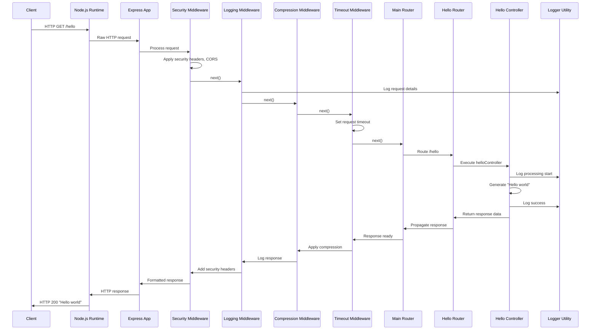
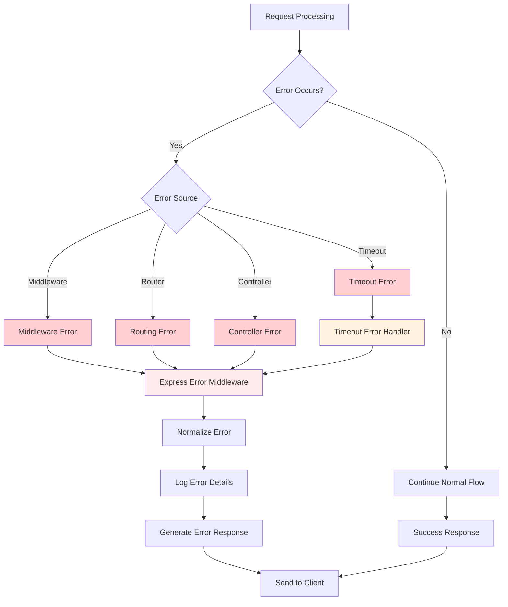
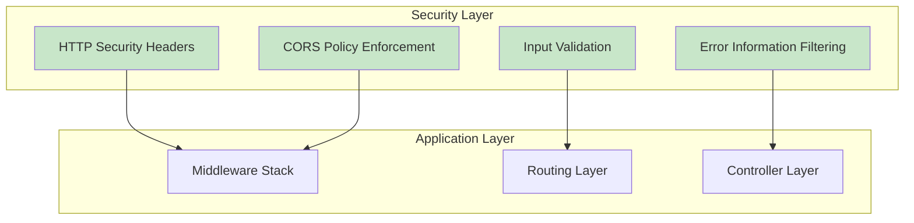

# Node.js Tutorial Backend - Component Diagram

This document provides a comprehensive component diagram and detailed annotations for the Node.js tutorial backend architecture. It visualizes the main system components, their relationships, and the flow of data between them, serving as a canonical reference for developers, maintainers, and educators.

## Table of Contents

1. [Component Diagram](#component-diagram)
2. [Component Annotations](#component-annotations)
3. [Data Flow Explanation](#data-flow-explanation)
4. [Extensibility Notes](#extensibility-notes)
5. [Security and Error Handling](#security-and-error-handling)

## Component Diagram

The following diagram illustrates the modular, event-driven, monolithic Express.js architecture of the Node.js tutorial backend:

```mermaid
graph TD
    subgraph "Client Layer"
        A[HTTP Client]
        A1[Browser]
        A2[Postman]
        A3[curl]
    end
    
    subgraph "Node.js Runtime Environment"
        B[Node.js v22.x LTS Runtime]
        B1[Event Loop]
        B2[V8 JavaScript Engine]
        B3[libuv I/O Layer]
    end
    
    subgraph "Express.js Application Layer"
        C[Express.js v5.1.0 Framework]
        C1[Application Instance]
        C2[HTTP Server Instance]
    end
    
    subgraph "Middleware Stack"
        D[Security Middleware]
        D1[Helmet.js Headers]
        D2[CORS Policy]
        E[Request Logging]
        F[Compression Middleware]
        G[Request Timeout]
    end
    
    subgraph "Routing Layer"
        H[Main Router]
        H1[Route Aggregator]
        I[Hello Router]
        I1[/hello Endpoint]
    end
    
    subgraph "Controller Layer"
        J[Hello Controller]
        J1[Request Handler]
        J2[Response Generator]
    end
    
    subgraph "Error Handling"
        K[Timeout Error Handler]
        L[Centralized Error Handler]
        L1[Error Normalizer]
        L2[Response Formatter]
    end
    
    subgraph "Configuration & Utilities"
        M[Server Configuration]
        M1[Port Settings]
        M2[Environment Config]
        N[Logger Utility]
        N1[Request Logging]
        N2[Error Logging]
        O[Graceful Shutdown]
        O1[Signal Handlers]
        O2[Resource Cleanup]
    end
    
    %% Client connections
    A --> A1
    A --> A2
    A --> A3
    
    %% Client to Node.js
    A1 --> B
    A2 --> B
    A3 --> B
    
    %% Node.js Runtime components
    B --> B1
    B --> B2
    B --> B3
    
    %% Node.js to Express
    B --> C
    C --> C1
    C --> C2
    
    %% Middleware flow (sequential)
    C1 --> D
    D --> D1
    D --> D2
    D --> E
    E --> F
    F --> G
    
    %% Routing flow
    G --> H
    H --> H1
    H1 --> I
    I --> I1
    
    %% Controller execution
    I1 --> J
    J --> J1
    J --> J2
    
    %% Error handling paths
    D -.-> K
    E -.-> K
    F -.-> K
    G -.-> K
    I1 -.-> K
    J -.-> K
    K --> L
    L --> L1
    L --> L2
    
    %% Configuration and utilities
    M --> M1
    M --> M2
    M1 --> C1
    M2 --> C1
    
    N --> N1
    N --> N2
    N1 --> E
    N2 --> L
    
    O --> O1
    O --> O2
    O1 --> C2
    O2 --> C2
    
    %% Response flow (reverse path)
    J2 --> I1
    I1 --> H1
    H1 --> G
    G --> F
    F --> E
    E --> D
    D --> C1
    C1 --> B
    B --> A
    
    %% Error response flow
    L2 --> C1
    
    %% Styling
    classDef clientLayer fill:#e1f5fe,stroke:#01579b,stroke-width:2px
    classDef runtime fill:#f3e5f5,stroke:#4a148c,stroke-width:2px
    classDef express fill:#e8f5e8,stroke:#1b5e20,stroke-width:2px
    classDef middleware fill:#fff3e0,stroke:#e65100,stroke-width:2px
    classDef routing fill:#e0f2f1,stroke:#00695c,stroke-width:2px
    classDef controller fill:#fce4ec,stroke:#880e4f,stroke-width:2px
    classDef error fill:#ffebee,stroke:#c62828,stroke-width:2px
    classDef config fill:#f9fbe7,stroke:#33691e,stroke-width:2px
    
    class A,A1,A2,A3 clientLayer
    class B,B1,B2,B3 runtime
    class C,C1,C2 express
    class D,D1,D2,E,F,G middleware
    class H,H1,I,I1 routing
    class J,J1,J2 controller
    class K,L,L1,L2 error
    class M,M1,M2,N,N1,N2,O,O1,O2 config
```

### Legend

| Symbol | Meaning |
|--------|---------|
| **Solid arrows (→)** | Normal request/response flow |
| **Dashed arrows (-.->)** | Error propagation paths |
| **Rectangles** | System components |
| **Subgraphs** | Logical component groupings |

## Component Annotations

### HTTP Server Components

#### **Node.js v22.x LTS Runtime (B)**
- **Responsibilities:**
  - Provides the JavaScript execution environment
  - Manages the event loop for non-blocking I/O operations
  - Handles low-level networking through libuv
  - Executes V8 JavaScript engine for code compilation and execution
- **Code Reference:** `src/backend/app.js` (main application entry point)
- **Interactions:** Receives HTTP requests from clients and delegates to Express.js framework
- **Extensibility:** Supports horizontal scaling through clustering and load balancing

#### **Express.js v5.1.0 Framework (C)**
- **Responsibilities:**
  - Web application framework providing middleware patterns
  - HTTP server creation and lifecycle management
  - Request/response object enhancement
  - Automatic Promise rejection handling (new in v5.x)
- **Code Reference:** `src/backend/app.js` lines 45-50 (Express app creation)
- **Interactions:** Bridges Node.js runtime with application middleware and routing
- **Extensibility:** Modular middleware architecture supports easy feature addition

### Middleware Stack Components

#### **Security Middleware (D)**
- **Responsibilities:**
  - Applies HTTP security headers via Helmet.js
  - Configures CORS (Cross-Origin Resource Sharing) policies
  - Prevents common web vulnerabilities (XSS, clickjacking, etc.)
  - Disables Express.js version disclosure headers
- **Code Reference:** `src/backend/middleware/security.js`
- **Interactions:** First middleware in stack, processes all incoming requests
- **Extensibility:** Configurable security policies for different environments

#### **Request Logging (E)**
- **Responsibilities:**
  - Logs HTTP requests and responses for observability
  - Captures request metadata (method, path, user agent, IP)
  - Provides performance timing information
  - Integrates with centralized logging utility
- **Code Reference:** `src/backend/middleware/logging.js`
- **Interactions:** Logs all requests after security processing
- **Extensibility:** Supports structured logging formats and external log aggregation

#### **Compression Middleware (F)**
- **Responsibilities:**
  - Applies gzip/deflate compression to HTTP responses
  - Reduces network bandwidth usage
  - Improves response time for large payloads
  - Configurable compression thresholds and algorithms
- **Code Reference:** `src/backend/middleware/compression.js`
- **Interactions:** Compresses responses before timeout processing
- **Extensibility:** Supports custom compression strategies and content types

#### **Request Timeout (G)**
- **Responsibilities:**
  - Enforces per-request timeout limits using AbortController
  - Prevents resource exhaustion from long-running requests
  - Provides clean timeout error responses
  - Integrates with Node.js async/await patterns
- **Code Reference:** `src/backend/middleware/requestTimeout.js`
- **Interactions:** Final middleware before routing, monitors request duration
- **Extensibility:** Configurable timeout values and timeout handling strategies

### Routing Components

#### **Main Router (H)**
- **Responsibilities:**
  - Aggregates and mounts all endpoint routers
  - Provides single entry point for route registration
  - Enables modular route composition
  - Supports error propagation to centralized handlers
- **Code Reference:** `src/backend/routes/index.js`
- **Interactions:** Receives processed requests from middleware stack
- **Extensibility:** New endpoint routers can be easily mounted using factory pattern

#### **Hello Router (I)**
- **Responsibilities:**
  - Handles routing for `/hello` endpoint specifically
  - Registers GET method handler with hello controller
  - Demonstrates modular endpoint organization
  - Maintains separation of routing and business logic
- **Code Reference:** `src/backend/routes/hello.js`
- **Interactions:** Routes `/hello` requests to hello controller
- **Extensibility:** Template for additional endpoint routers (users, auth, etc.)

### Controller Components

#### **Hello Controller (J)**
- **Responsibilities:**
  - Implements business logic for `/hello` endpoint
  - Generates "Hello world" static response
  - Handles request validation and error cases
  - Provides comprehensive logging for request lifecycle
- **Code Reference:** `src/backend/controllers/helloController.js`
- **Interactions:** Processes routed requests and generates responses
- **Extensibility:** Model for additional controllers with business logic

### Error Handling Components

#### **Timeout Error Handler (K)**
- **Responsibilities:**
  - Specifically processes request timeout errors
  - Generates appropriate HTTP 504 responses
  - Logs timeout events for monitoring
  - Positioned before main error handler
- **Code Reference:** `src/backend/middleware/requestTimeout.js` (handleTimeoutError)
- **Interactions:** Catches timeout errors from request timeout middleware
- **Extensibility:** Can be enhanced for different timeout scenarios

#### **Centralized Error Handler (L)**
- **Responsibilities:**
  - Processes all application errors in standardized format
  - Normalizes error responses for security and consistency
  - Logs comprehensive error details for debugging
  - Provides fallback error handling for unexpected cases
- **Code Reference:** `src/backend/middleware/errorHandler.js`
- **Interactions:** Final error processing for all middleware and routes
- **Extensibility:** Supports custom error types and response formats

### Configuration & Utility Components

#### **Server Configuration (M)**
- **Responsibilities:**
  - Centralizes server configuration management
  - Handles environment-specific settings
  - Validates configuration parameters
  - Provides defaults for development scenarios
- **Code Reference:** `src/backend/config/server.js`
- **Interactions:** Supplies configuration to all application components
- **Extensibility:** Supports configuration profiles and runtime updates

#### **Logger Utility (N)**
- **Responsibilities:**
  - Provides centralized logging functionality
  - Supports structured logging with context
  - Handles different log levels (info, warn, error)
  - Integrates with external logging systems
- **Code Reference:** `src/backend/utils/logger.js`
- **Interactions:** Used by all components for observability
- **Extensibility:** Supports multiple log transports and formatters

#### **Graceful Shutdown (O)**
- **Responsibilities:**
  - Handles SIGTERM and SIGINT signals
  - Manages graceful server shutdown process
  - Ensures active connections complete properly
  - Releases resources and prevents data loss
- **Code Reference:** `src/backend/utils/shutdown.js`
- **Interactions:** Monitors server lifecycle and manages cleanup
- **Extensibility:** Can be enhanced for complex resource cleanup scenarios

## Data Flow Explanation

### Normal Request/Response Lifecycle

The following sequence demonstrates how a typical HTTP GET request to `/hello` flows through the system:



### Key Data Transformation Points

1. **HTTP Parsing**: Raw network data → Node.js IncomingMessage object
2. **Express Enhancement**: IncomingMessage → Express Request/Response objects
3. **Security Processing**: Add security headers and validate CORS
4. **Route Matching**: URL path `/hello` → Hello Controller function
5. **Business Logic**: Request parameters → "Hello world" response
6. **Response Formatting**: Response data → HTTP response with headers
7. **Compression**: Original response → Compressed response (if applicable)
8. **Network Transmission**: HTTP response → Raw network data

### Error Flow Integration

Error handling is integrated throughout the system with multiple capture points:



### Observability Integration

The logger utility is integrated at multiple points to provide comprehensive observability:

- **Request Start**: Method, path, user agent, IP address
- **Middleware Processing**: Security headers applied, compression status
- **Controller Execution**: Business logic processing, response generation
- **Error Conditions**: Error details, stack traces, request context
- **Response Completion**: Status codes, response times, performance metrics

## Extensibility Notes

### Adding New Endpoints

The modular structure supports easy addition of new endpoints:

```javascript
// 1. Create new controller (src/backend/controllers/newController.js)
async function newController(req, res, next) {
    // Business logic implementation
}

// 2. Create new router (src/backend/routes/new.js)
const router = Router();
router.get('/new-endpoint', newController);

// 3. Mount in main router (src/backend/routes/index.js)
router.use(newRouter);
```

### Middleware Enhancement

New middleware can be added to the stack using the factory pattern:

```javascript
// Add to middleware/index.js
function getMiddlewareStack(options = {}) {
    const middlewareStack = [];
    
    // Add new middleware in appropriate position
    middlewareStack.push(securityMiddleware());
    middlewareStack.push(newCustomMiddleware()); // Add here
    middlewareStack.push(requestLoggerMiddleware);
    
    return middlewareStack;
}
```

### Database Integration

The architecture supports database integration through:

1. **Data Access Layer**: Add `src/backend/data/` directory for database modules
2. **Repository Pattern**: Create repository classes for data operations
3. **Configuration**: Extend server configuration for database connections
4. **Middleware**: Add database connection middleware to stack

### Authentication & Authorization

Security can be enhanced by adding:

1. **Authentication Middleware**: JWT token validation, session management
2. **Authorization Middleware**: Role-based access control
3. **Security Headers**: Enhanced CSP and security policies
4. **Rate Limiting**: Request frequency and abuse prevention

### Monitoring Enhancement

The current basic logging can be extended with:

1. **Metrics Collection**: Prometheus metrics, performance counters
2. **Health Checks**: Comprehensive health endpoints with dependency checks
3. **Distributed Tracing**: Request tracing across components
4. **APM Integration**: Application Performance Monitoring solutions

## Security and Error Handling

### Security Architecture Integration

The component diagram shows security as a foundational layer:



### Security Middleware Placement

Security middleware is positioned first in the stack to ensure:

- **Early Protection**: Security headers applied before any processing
- **Complete Coverage**: All requests protected regardless of processing outcome
- **Defense in Depth**: Multiple security layers throughout the application
- **Fail-Safe Design**: Security failures block request processing

### Error Handler Architecture

Error handling follows a centralized pattern with specific components:

1. **Timeout Error Handler**: Positioned after routes, before main error handler
2. **Main Error Handler**: Final middleware, processes all error types
3. **Error Normalization**: Converts all errors to standard format
4. **Information Filtering**: Prevents sensitive data leakage in error responses

### Best Practices Implementation

The component architecture demonstrates several security best practices:

- **Principle of Least Privilege**: Components have minimal required permissions
- **Defense in Depth**: Multiple security layers and validation points
- **Fail-Safe Defaults**: Secure configuration defaults throughout
- **Error Handling**: Comprehensive error capture and secure response generation
- **Logging**: Security events logged for monitoring and analysis

### Production Considerations

When evolving this architecture for production use:

1. **Enhanced Security**: Add authentication, authorization, rate limiting
2. **Monitoring**: Implement comprehensive APM and alerting
3. **Scaling**: Add clustering, load balancing, caching layers
4. **Reliability**: Implement circuit breakers, retry logic, health checks
5. **Compliance**: Add audit logging, data protection, regulatory compliance

---

**Document Maintenance**: This component diagram should be updated whenever significant architectural changes are made to the system. It serves as the primary visual reference for the system's structure and should be referenced from the main architecture documentation and README files.

**Version**: 1.0.0  
**Last Updated**: Generated from technical specifications and current codebase  
**Related Documents**: 
- [Architecture Overview](../README.md)
- [API Documentation](../api/)
- [Deployment Guide](../deployment/)