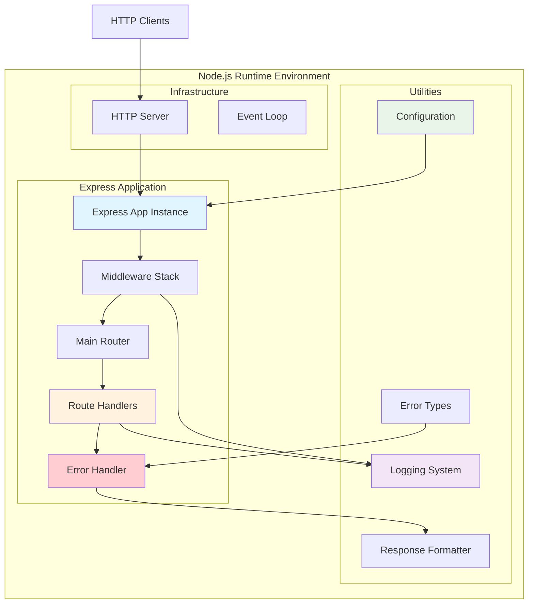
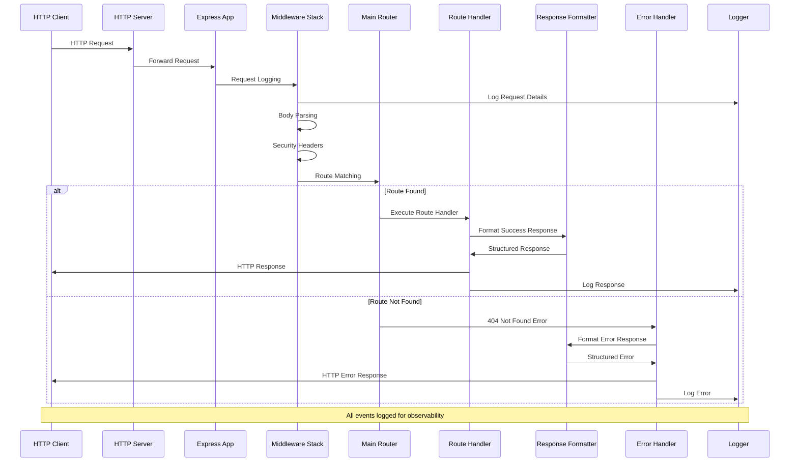
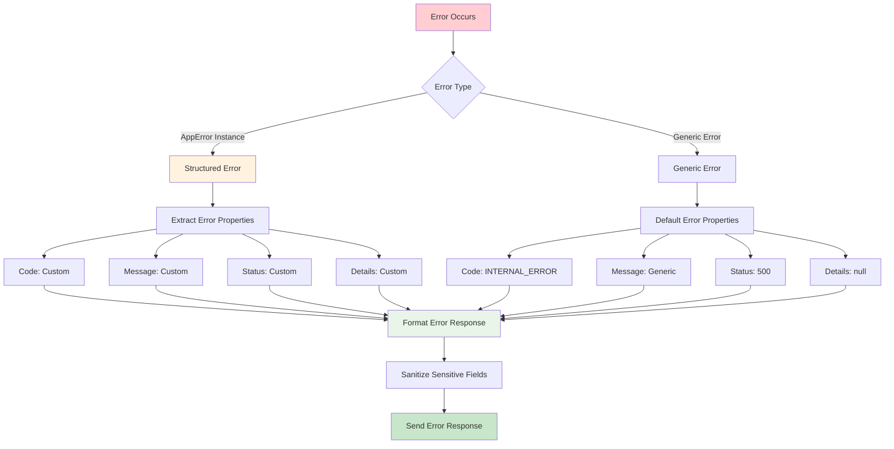

# Node.js Tutorial Backend - Architecture Overview

## Table of Contents
1. [Introduction and Purpose](#introduction-and-purpose)
2. [System Context and Boundaries](#system-context-and-boundaries)
3. [Core Architectural Principles](#core-architectural-principles)
4. [Component Model and Responsibilities](#component-model-and-responsibilities)
5. [Data Flow and Request Lifecycle](#data-flow-and-request-lifecycle)
6. [Design Patterns and Rationale](#design-patterns-and-rationale)
7. [Error Handling and Observability](#error-handling-and-observability)
8. [Configuration and Environment Management](#configuration-and-environment-management)
9. [Traceability to Requirements](#traceability-to-requirements)
10. [Educational and Maintainability Considerations](#educational-and-maintainability-considerations)
11. [References and Further Reading](#references-and-further-reading)

---

## 1. Introduction and Purpose

### 1.1 Overview
This document provides a comprehensive architectural overview of the Node.js tutorial backend application, designed to serve as both an educational resource and a canonical reference for understanding the system's structure, components, and design rationale. The architecture demonstrates modern Node.js and Express.js development patterns while maintaining clarity and educational value.

### 1.2 Purpose and Scope
The architecture overview serves multiple purposes:
- **Educational Resource**: Provides clear explanations of architectural concepts for learning Node.js development
- **Reference Documentation**: Serves as the canonical source for understanding system design decisions
- **Development Guide**: Enables developers to understand and extend the application effectively
- **Maintenance Support**: Facilitates ongoing maintenance and evolution of the codebase

### 1.3 Target Audience
This document is designed for:
- **Developers**: Learning Node.js and Express.js development patterns
- **Educators**: Teaching modern backend development concepts
- **Maintainers**: Working with the codebase for bug fixes and enhancements
- **Reviewers**: Evaluating the architecture for quality and best practices

### 1.4 Document Structure
The document follows a logical progression from high-level concepts to detailed implementation, ensuring comprehensive coverage of all architectural aspects while maintaining educational clarity.

---

## 2. System Context and Boundaries

### 2.1 System Overview
The Node.js tutorial backend is a monolithic, stateless web application built on Express 5.1.0 and Node.js 18+. It implements a single-threaded, event-driven architecture optimized for I/O-bound operations and educational clarity.

### 2.2 External Boundaries

#### 2.2.1 HTTP Clients
- **Boundary Type**: External Interface
- **Protocol**: HTTP/1.1 over TCP
- **Interaction Pattern**: Synchronous request-response
- **Data Exchange**: JSON-formatted HTTP requests and responses

#### 2.2.2 Node.js Runtime Environment
- **Boundary Type**: Platform Interface
- **Components**: V8 JavaScript Engine, libuv library, Event Loop
- **Interaction Pattern**: Asynchronous I/O operations
- **Data Exchange**: System calls and event-driven callbacks

#### 2.2.3 Operating System Kernel
- **Boundary Type**: System Interface
- **Protocol**: System calls via libuv
- **Interaction Pattern**: Asynchronous I/O delegation
- **Data Exchange**: Network operations and process management

### 2.3 Internal Boundaries

#### 2.3.1 Express Application Boundary
- **Scope**: HTTP request processing pipeline
- **Components**: Middleware stack, routing system, error handling
- **Responsibility**: Request/response lifecycle management

#### 2.3.2 Module Boundaries
- **Scope**: Functional separation of concerns
- **Components**: Routes, utilities, configuration, middleware
- **Responsibility**: Clean code organization and maintainability

### 2.4 Security Boundaries
- **Input Validation**: Request sanitization and validation
- **Error Handling**: Secure error responses without information disclosure
- **Framework Security**: Express 5.1.0 ReDoS protection and security enhancements

---

## 3. Core Architectural Principles

### 3.1 Single-Threaded Event Loop Architecture
The application leverages Node.js's fundamental architectural pattern of single-threaded event-driven processing with non-blocking I/O operations.

**Benefits:**
- **Scalability**: Efficient handling of concurrent requests without thread overhead
- **Performance**: Optimized for I/O-bound operations typical in web applications
- **Simplicity**: Eliminates complex thread synchronization and locking mechanisms
- **Resource Efficiency**: Lower memory footprint compared to multi-threaded alternatives

**Implementation:**
- Event loop manages all HTTP requests through callback mechanisms
- Asynchronous operations prevent blocking the main thread
- Express 5.1.0 automatic promise rejection handling simplifies error management

### 3.2 Monolithic Stateless Design
The application implements a monolithic architecture with stateless operation for educational clarity and operational simplicity.

**Characteristics:**
- **Single Deployable Unit**: All components packaged together for simple deployment
- **Stateless Operation**: No persistent state between requests
- **In-Memory Processing**: All data operations occur in memory without external dependencies
- **Educational Focus**: Simplified architecture for learning fundamental concepts

### 3.3 Security-First Approach
Security is integrated throughout the architecture with multiple layers of protection.

**Security Features:**
- **Express 5.1.0 Enhancements**: ReDoS attack prevention via path-to-regexp 8.x
- **Input Validation**: Comprehensive request parsing with security limits
- **Error Sanitization**: Secure error handling without information disclosure
- **Security Headers**: Defense-in-depth with multiple security headers

### 3.4 Standards Compliance
The application adheres to established web standards and best practices.

**Standards Adherence:**
- **HTTP/1.1 Protocol**: Full compliance with HTTP specification
- **REST API Patterns**: Consistent resource-based URL design
- **JSON Standards**: Proper JSON formatting and content types
- **Error Code Standards**: Standard HTTP status codes and error patterns

---

## 4. Component Model and Responsibilities

### 4.1 Component Architecture Overview



### 4.2 Core Components

#### 4.2.1 Node.js Runtime Environment
**File Location**: System Level
**Primary Responsibility**: JavaScript execution environment and event loop management

**Key Features:**
- V8 JavaScript Engine for code execution
- libuv library for cross-platform asynchronous I/O
- Event loop for non-blocking request processing
- Built-in HTTP module for server functionality

**Integration Points:**
- HTTP server creation and management
- Process environment variable access
- Event-driven callback mechanism
- Asynchronous I/O operations

#### 4.2.2 Express Application Instance
**File Location**: `src/backend/app.js`
**Primary Responsibility**: Web framework configuration and request pipeline management

**Key Features:**
- Express 5.1.0 with enhanced security features
- Middleware pipeline configuration
- Router mounting and organization
- Application-level settings and configuration

**Integration Points:**
- HTTP server integration for request handling
- Middleware stack execution
- Route handler delegation
- Error handling pipeline

**Implementation Details:**
```javascript
// Express application factory with comprehensive configuration
function createApp() {
    const app = express();
    
    // Security configuration
    app.disable('x-powered-by');
    app.set('trust proxy', ENVIRONMENT === 'production' ? 1 : 0);
    
    // Middleware pipeline
    app.use(requestLogger);
    app.use(bodyParser.json({ limit: '10mb', depth: 10 }));
    app.use(securityHeaders);
    app.use('/', router);
    app.use(errorHandler);
    
    return app;
}
```

#### 4.2.3 HTTP Server
**File Location**: `src/backend/server.js`
**Primary Responsibility**: HTTP server lifecycle management and process signal handling

**Key Features:**
- Server startup and shutdown procedures
- Comprehensive error handling for server-level errors
- Graceful shutdown with process signal handling
- Health monitoring and operational logging

**Integration Points:**
- Express application mounting
- Process environment integration
- Error handling and logging
- System resource management

**Implementation Details:**
```javascript
// Server startup with comprehensive error handling
function startServer() {
    server = app.listen(PORT, () => {
        logger.info(`Server successfully started on port ${PORT}`);
    });
    
    server.on('error', handleServerError);
    handleProcessSignals();
}
```

#### 4.2.4 Main Router
**File Location**: `src/backend/routes/index.js`
**Primary Responsibility**: Route aggregation and 404 handling

**Key Features:**
- Modular sub-router composition
- Centralized routing configuration
- Comprehensive 404 error handling
- Express 5.1.0 routing security enhancements

**Integration Points:**
- Sub-router mounting and organization
- Error forwarding to global error handler
- Response formatting integration
- Express routing pipeline

**Implementation Details:**
```javascript
// Main router with sub-router composition
const router = Router();

// Mount sub-routers
router.use('/hello', helloRouter);

// Catch-all 404 handler
router.all('*', async (req, res, next) => {
    const notFoundError = new NotFoundError('Route not found', {
        requestedPath: req.path,
        requestedMethod: req.method
    });
    next(notFoundError);
});
```

#### 4.2.5 Hello World Route Handler
**File Location**: `src/backend/routes/hello.js`
**Primary Responsibility**: Implementation of the core '/hello' endpoint

**Key Features:**
- HTTP GET request handling
- Standardized response formatting
- Comprehensive error handling
- Educational clarity and simplicity

**Integration Points:**
- Response formatter integration
- Error type integration
- Express routing system
- Logging system integration

**Implementation Details:**
```javascript
// Hello world route handler with proper error handling
async function helloHandler(req, res, next) {
    try {
        const response = formatSuccess(null, 'Hello world', 200);
        res.status(response.status).json(response);
    } catch (error) {
        const appError = new AppError(
            'An error occurred while processing the hello request',
            'INTERNAL_ERROR',
            500,
            { originalError: error.message, endpoint: '/hello' }
        );
        next(appError);
    }
}
```

#### 4.2.6 Error Handling System
**File Location**: `src/backend/middleware/errorHandler.js`
**Primary Responsibility**: Global error handling and secure error responses

**Key Features:**
- Express 5.1.0 automatic promise rejection handling
- Structured error response generation
- Security-conscious error sanitization
- Comprehensive error logging

**Integration Points:**
- Custom error type integration
- Response formatter integration
- Logging system integration
- Express error middleware pipeline

### 4.3 Utility Components

#### 4.3.1 Configuration Management
**File Location**: `src/backend/config/index.js`
**Primary Responsibility**: Environment-based configuration management

**Key Features:**
- Environment variable processing
- Port validation and management
- Configuration validation and health checks
- Runtime configuration access

**Implementation Details:**
```javascript
// Environment-aware configuration with validation
function getPort() {
    const portEnv = process.env.PORT;
    if (portEnv) {
        const parsedPort = parseInt(portEnv, 10);
        if (validatePort(parsedPort)) {
            return parsedPort;
        }
    }
    return DEFAULT_PORT;
}

const ENVIRONMENT = getEnvironment();
const PORT = getPort();
```

#### 4.3.2 Logging System
**File Location**: `src/backend/utils/logger.js`
**Primary Responsibility**: Centralized, structured logging for all application components

**Key Features:**
- Environment-aware log levels
- Colorized output for development
- Structured log formatting
- Context-aware child loggers

**Implementation Details:**
```javascript
// Logger with environment-aware configuration
class Logger {
    constructor() {
        this.level = getLogLevel();
        this.shouldColorize = ENVIRONMENT !== 'production';
        this.colors = {
            error: chalk.red,
            warn: chalk.yellow,
            info: chalk.blue,
            debug: chalk.gray
        };
    }
    
    info(message, ...meta) {
        if (this._shouldLog('info')) {
            const formattedMessage = this._formatMessage('info', message, meta);
            console.log(this._colorizeMessage('info', formattedMessage));
        }
    }
}
```

#### 4.3.3 Error Types
**File Location**: `src/backend/utils/errorTypes.js`
**Primary Responsibility**: Structured error definitions and error code constants

**Key Features:**
- Base AppError class for consistent error structure
- Specialized error classes for different HTTP scenarios
- Error code constants for client integration
- Stack trace capture for debugging

**Implementation Details:**
```javascript
// Base AppError class with structured error information
class AppError extends Error {
    constructor(message, code, status, details = null) {
        super(message);
        this.name = this.constructor.name;
        this.code = code;
        this.status = status;
        this.details = details;
        Error.captureStackTrace(this, this.constructor);
    }
}

// Specialized error classes
class NotFoundError extends AppError {
    constructor(message = 'Not found', details = null) {
        super(message, ERROR_CODES.NOT_FOUND, 404, details);
    }
}
```

#### 4.3.4 Response Formatter
**File Location**: `src/backend/utils/responseFormatter.js`
**Primary Responsibility**: Standardized HTTP response formatting

**Key Features:**
- Consistent success response structure
- Secure error response formatting
- Automatic field redaction for security
- Integration with custom error types

**Implementation Details:**
```javascript
// Standardized response formatting
function formatSuccess(data = null, message = 'Success', status = 200) {
    return {
        success: true,
        message: message,
        data: data,
        status: status
    };
}

function formatError(err, status = 500) {
    if (err instanceof AppError) {
        return {
            success: false,
            message: err.message,
            code: err.code,
            status: err.status,
            details: sanitizeDetails(err.details)
        };
    }
    // Handle generic errors with secure fallback
    return {
        success: false,
        message: 'An internal server error occurred',
        code: ERROR_CODES.INTERNAL_ERROR,
        status: status,
        details: null
    };
}
```

---

## 5. Data Flow and Request Lifecycle

### 5.1 Request Processing Flow



### 5.2 Detailed Request Lifecycle

#### 5.2.1 Request Initiation
1. **HTTP Client Request**: Client sends HTTP request to the server
2. **Kernel Processing**: Operating system kernel notifies Node.js of incoming connection
3. **Event Loop**: Node.js event loop picks up the request from the poll queue
4. **HTTP Server**: Node.js HTTP server receives and parses the HTTP request

#### 5.2.2 Express Application Processing
1. **Application Entry**: Express application receives the request object
2. **Middleware Pipeline**: Request flows through configured middleware stack
3. **Request Logging**: All requests logged with timing and context information
4. **Body Parsing**: JSON request bodies parsed with security limits
5. **Security Headers**: Security headers added to response

#### 5.2.3 Routing and Handler Execution
1. **Route Matching**: Main router matches request path against defined routes
2. **Route Delegation**: Matched routes forwarded to appropriate handler
3. **Handler Execution**: Route handler processes request and generates response
4. **Response Formatting**: Response formatted using standardized formatter
5. **Response Transmission**: HTTP response sent back to client

#### 5.2.4 Error Handling Flow
1. **Error Detection**: Errors caught by try-catch blocks or Express middleware
2. **Error Classification**: Errors classified by type (client, server, security)
3. **Error Logging**: All errors logged with context and stack trace
4. **Error Sanitization**: Sensitive information removed from error responses
5. **Error Response**: Standardized error response sent to client

### 5.3 Data Transformation Points

#### 5.3.1 HTTP Request Parsing
- **Input**: Raw HTTP request bytes
- **Processing**: Node.js HTTP module parses headers, method, and body
- **Output**: Express Request object with parsed data

#### 5.3.2 JSON Body Parsing
- **Input**: Raw JSON string in request body
- **Processing**: body-parser middleware with security limits
- **Output**: JavaScript object available in req.body

#### 5.3.3 Route Parameter Extraction
- **Input**: URL path with parameters
- **Processing**: Express router with path-to-regexp 8.x
- **Output**: Extracted parameters in req.params

#### 5.3.4 Response Serialization
- **Input**: JavaScript response object
- **Processing**: JSON.stringify with Express response methods
- **Output**: HTTP response with proper headers and status

---

## 6. Design Patterns and Rationale

### 6.1 Factory Pattern (Application Configuration)
**Implementation**: `src/backend/app.js` - `createApp()` function

**Rationale:**
- **Flexibility**: Enables creation of multiple application instances for testing
- **Configuration**: Centralizes application setup and configuration
- **Testability**: Allows fresh application instances for isolated testing
- **Maintainability**: Separates application configuration from server startup

**Benefits:**
- Clean separation between app configuration and server startup
- Easy testing with isolated application instances
- Consistent configuration across different environments
- Extensible architecture for future enhancements

### 6.2 Middleware Pattern (Request Processing)
**Implementation**: Express middleware stack in `src/backend/app.js`

**Rationale:**
- **Modularity**: Separates cross-cutting concerns into discrete middleware
- **Reusability**: Middleware can be reused across different routes
- **Composability**: Middleware can be combined in different configurations
- **Maintainability**: Each middleware has a single responsibility

**Middleware Stack:**
```javascript
// Ordered middleware stack for optimal processing
app.use(requestLogger);        // 1. Request logging
app.use(bodyParser.json());    // 2. Body parsing
app.use(securityHeaders);      // 3. Security headers
app.use('/', router);          // 4. Main router
app.use(errorHandler);         // 5. Error handling
```

### 6.3 Router Pattern (Modular Routing)
**Implementation**: `src/backend/routes/index.js` and sub-routers

**Rationale:**
- **Separation of Concerns**: Each router handles a specific domain area
- **Maintainability**: Routes are organized by functionality
- **Scalability**: Easy to add new route modules
- **Testability**: Each router can be tested independently

**Router Hierarchy:**
```
Main Router (/)
├── Hello Router (/hello)
│   └── GET /hello
└── 404 Handler (*)
```

### 6.4 Error Handling Pattern (Centralized Error Management)
**Implementation**: `src/backend/utils/errorTypes.js` and error middleware

**Rationale:**
- **Consistency**: All errors handled using the same pattern
- **Security**: Secure error responses without information disclosure
- **Maintainability**: Centralized error handling logic
- **Observability**: Structured error logging for monitoring

**Error Handling Flow:**
1. **Error Creation**: Structured AppError instances with context
2. **Error Forwarding**: Express 5.1.0 automatic promise rejection handling
3. **Error Processing**: Global error middleware processes all errors
4. **Error Response**: Standardized error responses with proper sanitization

### 6.5 Dependency Injection Pattern (Configuration and Utilities)
**Implementation**: Configuration and utility modules

**Rationale:**
- **Testability**: Dependencies can be mocked for testing
- **Flexibility**: Different implementations can be injected
- **Maintainability**: Loose coupling between components
- **Configuration**: Environment-specific behavior injection

**Dependency Examples:**
- Configuration injected into application components
- Logger instance shared across all components
- Error types used throughout the application
- Response formatter used by all handlers

### 6.6 Architectural Decision Summary

| Pattern | Implementation | Benefits | Trade-offs |
|---------|----------------|----------|------------|
| **Factory Pattern** | `createApp()` function | Flexibility, testability | Slight complexity increase |
| **Middleware Pattern** | Express middleware stack | Modularity, reusability | Sequential processing requirement |
| **Router Pattern** | Modular route organization | Separation of concerns | Multiple file complexity |
| **Error Handling** | Centralized error management | Consistency, security | Additional abstraction layer |
| **Dependency Injection** | Configuration and utilities | Testability, flexibility | Increased initial setup |

---

## 7. Error Handling and Observability

### 7.1 Error Handling Architecture

#### 7.1.1 Express 5.1.0 Enhanced Error Handling
The application leverages Express 5.1.0's automatic promise rejection handling to eliminate the need for manual error forwarding in most scenarios.

**Key Features:**
- **Automatic Promise Forwarding**: Rejected promises automatically forwarded to error middleware
- **Comprehensive Error Catching**: Both synchronous and asynchronous errors handled
- **Error Context Preservation**: Error context maintained throughout the pipeline
- **Security Integration**: Integration with Express security enhancements

#### 7.1.2 Structured Error Types
**Implementation**: `src/backend/utils/errorTypes.js`

```javascript
// Base AppError class providing structured error information
class AppError extends Error {
    constructor(message, code, status, details = null) {
        super(message);
        this.name = this.constructor.name;
        this.code = code;
        this.status = status;
        this.details = details;
        Error.captureStackTrace(this, this.constructor);
    }
}

// Specialized error classes for different scenarios
class BadRequestError extends AppError {
    constructor(message = 'Bad request', details = null) {
        super(message, ERROR_CODES.BAD_REQUEST, 400, details);
    }
}
```

#### 7.1.3 Error Classification System



### 7.2 Observability Implementation

#### 7.2.1 Centralized Logging System
**Implementation**: `src/backend/utils/logger.js`

**Features:**
- **Environment-Aware Logging**: Different log levels for different environments
- **Structured Logging**: JSON-formatted logs with metadata
- **Colorized Output**: Enhanced readability in development
- **Context Preservation**: Request correlation and context tracking

**Log Levels:**
- **Error**: Always logged, includes stack traces and error context
- **Warn**: Logged in info level and above, for non-critical issues
- **Info**: Logged in info level and above, for operational events
- **Debug**: Logged only in debug level, for detailed troubleshooting

#### 7.2.2 Request Logging Middleware
**Implementation**: `src/backend/middleware/logger.js`

**Logging Information:**
- **Request Details**: Method, URL, headers, body (sanitized)
- **Response Details**: Status code, response time, response size
- **Context Information**: Request ID, user agent, IP address
- **Performance Metrics**: Processing time, memory usage

#### 7.2.3 Error Monitoring and Alerting
**Error Logging Features:**
- **Comprehensive Error Context**: Request details, user information, system state
- **Stack Trace Preservation**: Full stack traces for debugging
- **Error Correlation**: Request correlation IDs for distributed tracing
- **Performance Impact**: Error processing time and resource usage

### 7.3 Health Monitoring

#### 7.3.1 Application Health Indicators
- **Server Status**: HTTP server listening status
- **Memory Usage**: Process memory consumption monitoring
- **Response Times**: Request processing performance metrics
- **Error Rates**: HTTP error response frequency tracking

#### 7.3.2 Health Check Endpoints
The `/hello` endpoint serves as a basic health check, providing:
- **Availability**: Server is responsive and accepting requests
- **Functionality**: Core application logic is working
- **Response Time**: Basic performance indicator
- **Error Handling**: Proper error response generation

---

## 8. Configuration and Environment Management

### 8.1 Environment-Based Configuration
**Implementation**: `src/backend/config/index.js`

### 8.2 Configuration Architecture

```mermaid
graph TB
    subgraph "Environment Variables"
        E1[NODE_ENV]
        E2[PORT]
        E3[LOG_LEVEL]
    end
    
    subgraph "Configuration Module"
        C1[getEnvironment()]
        C2[getPort()]
        C3[validatePort()]
        C4[validateConfiguration()]
    end
    
    subgraph "Application Components"
        A1[Express App]
        A2[HTTP Server]
        A3[Logger]
        A4[Error Handler]
    end
    
    E1 --> C1
    E2 --> C2
    E3 --> C3
    
    C1 --> A1
    C2 --> A2
    C3 --> A3
    C4 --> A4
    
    style E1 fill:#e3f2fd
    style E2 fill:#e3f2fd
    style E3 fill:#e3f2fd
    style C1 fill:#fff3e0
    style C2 fill:#fff3e0
    style C3 fill:#fff3e0
    style C4 fill:#fff3e0
```

### 8.3 Configuration Components

#### 8.3.1 Environment Detection
```javascript
function getEnvironment() {
    const nodeEnv = process.env.NODE_ENV;
    if (nodeEnv && VALID_ENVIRONMENTS.includes(nodeEnv)) {
        return nodeEnv;
    }
    return 'development'; // Safe default
}
```

**Supported Environments:**
- **Development**: Enhanced logging, debugging features, colorized output
- **Production**: Optimized performance, security headers, minimal logging
- **Test**: Minimal logging, test-specific configurations

#### 8.3.2 Port Configuration
```javascript
function getPort() {
    const portEnv = process.env.PORT;
    if (portEnv) {
        const parsedPort = parseInt(portEnv, 10);
        if (validatePort(parsedPort)) {
            return parsedPort;
        }
    }
    return DEFAULT_PORT;
}
```

**Port Validation:**
- **Range**: 1024-65535 (non-privileged ports)
- **Type**: Integer validation
- **Fallback**: Default port 3000 if invalid

#### 8.3.3 Configuration Validation
```javascript
function validateConfiguration() {
    const warnings = [];
    let isValid = true;
    
    // Environment validation
    if (ENVIRONMENT === 'development' && !process.env.NODE_ENV) {
        warnings.push('NODE_ENV not set, defaulting to development');
    }
    
    // Port validation
    if (!validatePort(PORT)) {
        warnings.push(`Invalid port: ${PORT}`);
        isValid = false;
    }
    
    return { isValid, warnings };
}
```

### 8.4 Environment-Specific Behavior

#### 8.4.1 Development Environment
- **Logging**: Debug level logging with colorized output
- **Error Handling**: Detailed error messages with stack traces
- **Performance**: Pretty-printed JSON responses
- **Security**: Relaxed security settings for development ease

#### 8.4.2 Production Environment
- **Logging**: Info level logging with structured format
- **Error Handling**: Sanitized error messages without stack traces
- **Performance**: Optimized JSON responses
- **Security**: Full security headers and protections

#### 8.4.3 Test Environment
- **Logging**: Minimal logging to avoid test noise
- **Error Handling**: Consistent error handling for test assertions
- **Performance**: Fast response times for test execution
- **Security**: Secure defaults with test-specific overrides

---

## 9. Traceability to Requirements

### 9.1 Requirements Mapping

#### 9.1.1 HTTP Server Foundation (F-001)
**Architecture Implementation:**
- **Component**: Express Application (`src/backend/app.js`)
- **Server**: HTTP Server (`src/backend/server.js`)
- **Requirements**: F-001-RQ-001, F-001-RQ-002

**Traceability:**
- Express 5.1.0 initialization with enhanced security features
- HTTP server listener with comprehensive error handling
- Node.js 18+ compatibility and modern JavaScript features
- Cross-platform deployment capabilities

#### 9.1.2 Hello World Endpoint (F-002)
**Architecture Implementation:**
- **Component**: Hello Router (`src/backend/routes/hello.js`)
- **Integration**: Main Router (`src/backend/routes/index.js`)
- **Requirements**: F-002-RQ-001, F-002-RQ-002

**Traceability:**
- GET /hello route handler returning "Hello world" response
- 404 handling for undefined routes
- path-to-regexp 8.x security enhancements
- Standardized response formatting

#### 9.1.3 Basic Error Management (F-003)
**Architecture Implementation:**
- **Component**: Error Handler (`src/backend/middleware/errorHandler.js`)
- **Types**: Error Types (`src/backend/utils/errorTypes.js`)
- **Requirements**: F-003-RQ-001, F-003-RQ-002

**Traceability:**
- Global error handling middleware
- Express 5.1.0 automatic promise rejection handling
- Structured error responses with security sanitization
- Comprehensive error logging and monitoring

#### 9.1.4 Server Configuration Management (F-004)
**Architecture Implementation:**
- **Component**: Configuration (`src/backend/config/index.js`)
- **Requirements**: F-004-RQ-001

**Traceability:**
- Environment-based port configuration
- Configuration validation and health checks
- Environment variable processing
- Default value fallbacks

### 9.2 Technical Specification Alignment

#### 9.2.1 System Architecture (Section 5.1)
**High-Level Architecture Requirements:**
- ✅ Single-threaded event loop architecture
- ✅ Express 5.1.0 with enhanced security features
- ✅ Node.js 18+ compatibility
- ✅ Event-driven processing with non-blocking I/O

#### 9.2.2 Component Details (Section 5.2)
**Component Implementation:**
- ✅ Node.js runtime environment with V8 and libuv
- ✅ Express application framework with middleware pipeline
- ✅ Route handler with promise integration
- ✅ Error handling system with threat model implementation

#### 9.2.3 Technical Decisions (Section 5.3)
**Architecture Style Decisions:**
- ✅ Single-threaded event loop for scalability
- ✅ Express 5.1.0 for modern web framework features
- ✅ Minimalist implementation for educational focus
- ✅ Security-first approach with comprehensive threat model

### 9.3 Business Requirements Alignment

#### 9.3.1 Educational Objectives
**Architecture Support:**
- **Clear Component Separation**: Modular architecture for easy understanding
- **Comprehensive Documentation**: Detailed architectural documentation
- **Best Practices**: Production-ready patterns and implementations
- **Progressive Complexity**: Building from simple to advanced concepts

#### 9.3.2 Technical Objectives
**Architecture Support:**
- **Performance**: Optimized for I/O-bound operations
- **Security**: Comprehensive security implementation
- **Maintainability**: Clean architecture with separation of concerns
- **Scalability**: Foundation for future enhancement and scaling

---

## 10. Educational and Maintainability Considerations

### 10.1 Educational Architecture Design

#### 10.1.1 Progressive Complexity
The architecture is designed to introduce concepts progressively:

1. **Basic HTTP Server**: Simple server creation and request handling
2. **Express Framework**: Web framework integration and middleware
3. **Routing**: Modular route organization and handler implementation
4. **Error Handling**: Comprehensive error management and security
5. **Configuration**: Environment-aware configuration management
6. **Logging**: Structured logging and observability

#### 10.1.2 Clear Separation of Concerns
Each component has a single, well-defined responsibility:

- **Application Configuration**: `src/backend/app.js`
- **Server Management**: `src/backend/server.js`
- **Route Organization**: `src/backend/routes/index.js`
- **Business Logic**: `src/backend/routes/hello.js`
- **Error Management**: `src/backend/utils/errorTypes.js`
- **Response Formatting**: `src/backend/utils/responseFormatter.js`
- **Configuration**: `src/backend/config/index.js`
- **Logging**: `src/backend/utils/logger.js`

#### 10.1.3 Documentation and Comments
Comprehensive documentation throughout the codebase:

- **Function Documentation**: JSDoc comments for all functions
- **Architectural Decisions**: Rationale for design choices
- **Implementation Notes**: Educational notes and explanations
- **Usage Examples**: Clear examples of how to use each component

### 10.2 Maintainability Features

#### 10.2.1 Modular Architecture
- **Independent Components**: Each module can be developed and tested separately
- **Clear Interfaces**: Well-defined APIs between components
- **Loose Coupling**: Minimal dependencies between components
- **High Cohesion**: Related functionality grouped together

#### 10.2.2 Testing Support
- **Factory Pattern**: Easy creation of test instances
- **Modular Routes**: Individual route testing
- **Mocking Support**: Dependencies can be easily mocked
- **Isolated Testing**: Each component can be tested in isolation

#### 10.2.3 Configuration Management
- **Environment-Aware**: Different behavior for different environments
- **Validation**: Configuration validation and error reporting
- **Defaults**: Sensible default values for all configurations
- **Flexibility**: Easy to modify configuration without code changes

### 10.3 Future Enhancement Readiness

#### 10.3.1 Scalability Considerations
- **Horizontal Scaling**: Stateless design supports multiple instances
- **Database Integration**: Architecture ready for database addition
- **Caching**: Response caching can be easily integrated
- **Load Balancing**: Supports deployment behind load balancers

#### 10.3.2 Security Enhancements
- **Authentication**: Architecture supports authentication middleware
- **Authorization**: Role-based access control can be integrated
- **Rate Limiting**: Request rate limiting can be easily added
- **Input Validation**: Comprehensive input validation framework ready

#### 10.3.3 Feature Expansion
- **New Endpoints**: Easy addition of new route handlers
- **Middleware**: Custom middleware can be easily integrated
- **Utilities**: Additional utility functions can be added
- **Integrations**: Third-party service integrations supported

---

## 11. References and Further Reading

### 11.1 Implementation Files

#### 11.1.1 Core Application Files
- **`src/backend/app.js`**: Express application configuration and middleware setup
- **`src/backend/server.js`**: HTTP server startup and process management
- **`src/backend/routes/index.js`**: Main router aggregation and 404 handling
- **`src/backend/routes/hello.js`**: Hello World endpoint implementation

#### 11.1.2 Utility and Support Files
- **`src/backend/config/index.js`**: Environment-based configuration management
- **`src/backend/utils/logger.js`**: Centralized logging system
- **`src/backend/utils/errorTypes.js`**: Structured error types and constants
- **`src/backend/utils/responseFormatter.js`**: Standardized response formatting
- **`src/backend/middleware/errorHandler.js`**: Global error handling middleware

### 11.2 Technical Specification References

#### 11.2.1 System Architecture (Section 5)
- **5.1 HIGH-LEVEL ARCHITECTURE**: Overall system structure and components
- **5.2 COMPONENT DETAILS**: Detailed component specifications and responsibilities
- **5.3 TECHNICAL DECISIONS**: Architecture style decisions and trade-offs
- **5.4 CROSS-CUTTING CONCERNS**: Monitoring, logging, and error handling

#### 11.2.2 Product Requirements (Section 2)
- **2.1 FEATURE CATALOG**: Complete feature specifications and requirements
- **2.2 FUNCTIONAL REQUIREMENTS**: Detailed functional requirement specifications
- **2.5 TRACEABILITY MATRIX**: Requirements to implementation mapping

### 11.3 Framework and Technology Documentation

#### 11.3.1 Express.js 5.1.0
- **Security Enhancements**: ReDoS protection and security improvements
- **Promise Handling**: Automatic promise rejection forwarding
- **Middleware Pipeline**: Enhanced middleware architecture
- **Performance Improvements**: Optimized request processing

#### 11.3.2 Node.js 18+
- **Event Loop**: Single-threaded event-driven architecture
- **Asynchronous I/O**: Non-blocking I/O operations with libuv
- **V8 Engine**: JavaScript execution and optimization
- **Built-in Modules**: HTTP, process, and utility modules

### 11.4 Best Practices and Patterns

#### 11.4.1 Architecture Patterns
- **Factory Pattern**: Application configuration and testing
- **Middleware Pattern**: Request processing and cross-cutting concerns
- **Router Pattern**: Modular route organization
- **Error Handling Pattern**: Centralized error management

#### 11.4.2 Security Best Practices
- **Input Validation**: Request validation and sanitization
- **Error Handling**: Secure error responses without information disclosure
- **Security Headers**: Comprehensive security header implementation
- **Threat Model**: Express.js security threat model implementation

---

## Architecture Functions

### describeArchitecture()
```javascript
/**
 * Provides a comprehensive, structured overview of the system architecture
 * including components, data flow, design patterns, and educational objectives.
 */
function describeArchitecture() {
    return {
        systemOverview: {
            architecture: "Single-threaded event-driven monolithic application",
            framework: "Express 5.1.0 with Node.js 18+",
            pattern: "Stateless request-response with middleware pipeline",
            educational: "Progressive complexity with clear separation of concerns"
        },
        coreComponents: {
            runtime: "Node.js runtime with V8 engine and libuv",
            framework: "Express application with middleware pipeline",
            server: "HTTP server with comprehensive lifecycle management",
            routing: "Modular router architecture with sub-router composition",
            errorHandling: "Centralized error management with structured responses",
            configuration: "Environment-aware configuration management",
            logging: "Structured logging with context preservation",
            utilities: "Response formatting and error type definitions"
        },
        designPrinciples: {
            eventDriven: "Non-blocking I/O with single-threaded event loop",
            security: "Security-first approach with comprehensive threat model",
            educational: "Clear documentation and progressive complexity",
            maintainability: "Modular architecture with clean separation",
            observability: "Comprehensive logging and error handling"
        },
        dataFlow: {
            requestEntry: "HTTP client -> Node.js HTTP server -> Express app",
            processing: "Middleware pipeline -> Router -> Handler -> Response",
            errorHandling: "Error detection -> Classification -> Logging -> Response",
            responseGeneration: "Handler -> Formatter -> HTTP response"
        },
        educationalValue: {
            concepts: "Modern Node.js and Express development patterns",
            patterns: "Production-ready architecture and best practices",
            progression: "Simple to advanced concepts with clear examples",
            maintainability: "Clean code organization and documentation"
        }
    };
}
```

### componentDiagram()
```javascript
/**
 * Generates a component diagram showing the main architectural components
 * and their relationships in Mermaid format.
 */
function componentDiagram() {
    return `
graph TB
    subgraph "External Environment"
        Client[HTTP Clients]
        OS[Operating System]
        Runtime[Node.js Runtime]
    end
    
    subgraph "Express Application"
        App[Express App Instance]
        
        subgraph "Middleware Pipeline"
            Logger[Request Logger]
            Parser[Body Parser]
            Security[Security Headers]
            ErrorMW[Error Handler]
        end
        
        subgraph "Routing System"
            MainRouter[Main Router]
            HelloRouter[Hello Router]
            Handler[Hello Handler]
        end
    end
    
    subgraph "Utilities"
        Config[Configuration]
        LogUtil[Logger Utility]
        ErrorTypes[Error Types]
        Formatter[Response Formatter]
    end
    
    subgraph "Infrastructure"
        Server[HTTP Server]
        EventLoop[Event Loop]
    end
    
    Client --> Server
    Server --> App
    App --> Logger
    Logger --> Parser
    Parser --> Security
    Security --> MainRouter
    MainRouter --> HelloRouter
    HelloRouter --> Handler
    Handler --> Formatter
    Handler --> ErrorMW
    ErrorMW --> Formatter
    
    Config --> App
    LogUtil --> Logger
    LogUtil --> ErrorMW
    ErrorTypes --> ErrorMW
    ErrorTypes --> Handler
    
    Runtime --> EventLoop
    EventLoop --> Server
    OS --> Runtime
    
    style Client fill:#e3f2fd
    style App fill:#e1f5fe
    style Handler fill:#fff3e0
    style ErrorMW fill:#ffcdd2
    style Config fill:#e8f5e8
    style LogUtil fill:#f3e5f5
    `;
}
```

### dataFlowDiagram()
```javascript
/**
 * Generates a data flow diagram showing the request/response lifecycle
 * and error handling flow in Mermaid format.
 */
function dataFlowDiagram() {
    return `
flowchart TD
    subgraph "Request Processing"
        A[HTTP Request] --> B[HTTP Server]
        B --> C[Express App]
        C --> D[Request Logger]
        D --> E[Body Parser]
        E --> F[Security Headers]
        F --> G[Main Router]
        G --> H{Route Match?}
        
        H -->|Yes| I[Hello Handler]
        H -->|No| J[404 Error]
        
        I --> K[Process Request]
        K --> L[Format Response]
        L --> M[Send Response]
        
        J --> N[Create NotFoundError]
        N --> O[Error Handler]
        O --> P[Format Error]
        P --> Q[Send Error Response]
    end
    
    subgraph "Error Handling"
        R[Error Occurs] --> S{Error Type}
        S -->|AppError| T[Extract Error Info]
        S -->|Generic Error| U[Default Error Info]
        
        T --> V[Format Error Response]
        U --> V
        V --> W[Sanitize Details]
        W --> X[Log Error]
        X --> Y[Send Error Response]
    end
    
    subgraph "Logging and Monitoring"
        Z[Log Request] --> AA[Log Response]
        AA --> BB[Performance Metrics]
        BB --> CC[Health Monitoring]
    end
    
    style A fill:#e3f2fd
    style I fill:#fff3e0
    style M fill:#c8e6c9
    style R fill:#ffcdd2
    style Y fill:#ffcdd2
    style Z fill:#f3e5f5
    `;
}
```

---

*This architecture overview document serves as the canonical reference for understanding the Node.js tutorial backend system. It provides comprehensive coverage of all architectural aspects while maintaining educational clarity and supporting the project's learning objectives.*