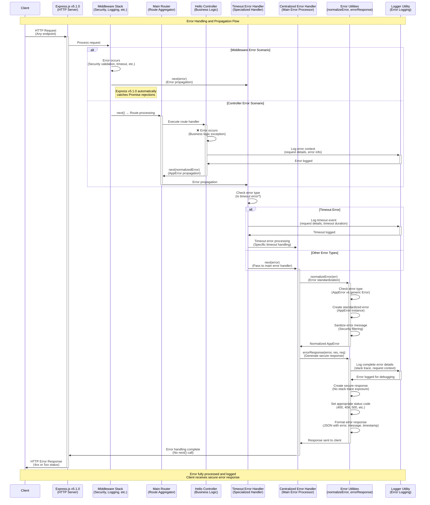
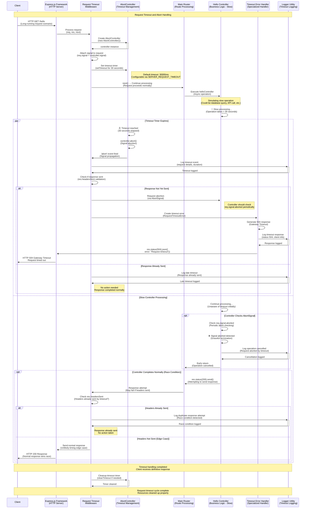

# Node.js Tutorial Backend - Sequence Diagrams

This document provides dynamic sequence diagrams for the Node.js tutorial backend architecture. It visualizes the step-by-step interactions between core system components (HTTP server, middleware, router, controller, error handler, logger, configuration) during key scenarios: request/response lifecycle, error handling, server startup/shutdown, and request timeout/abort. The diagrams are rendered in Mermaid.js syntax and are accompanied by explanatory notes. This document serves as a canonical reference for understanding runtime behavior, supporting onboarding, maintainability, and educational clarity.

## Table of Contents

1. [Request/Response Sequence Diagram (GET /hello)](#1-requestresponse-sequence-diagram-get-hello)
2. [Error Handling Sequence Diagram](#2-error-handling-sequence-diagram)
3. [Startup/Shutdown Sequence Diagram](#3-startupshutdown-sequence-diagram)
4. [Timeout/Abort Sequence Diagram](#4-timeoutabort-sequence-diagram)
5. [Cross-References and Integration Notes](#5-cross-references-and-integration-notes)

---

## 1. Request/Response Sequence Diagram (GET /hello)

This diagram illustrates the complete lifecycle of a typical HTTP GET request to the `/hello` endpoint, demonstrating the flow through middleware, routing, controller execution, and response generation.

### Key Flow Characteristics

- **Event-Driven Processing**: Node.js processes the request through its event loop, enabling high concurrency
- **Middleware Chain**: Sequential execution through security, logging, compression, and timeout middleware
- **Express v5.1.0 Features**: Automatic Promise rejection handling and enhanced async/await support
- **Modular Routing**: Separation between main router and endpoint-specific hello router
- **Comprehensive Logging**: Request and response events logged for observability
- **Security-First Design**: Security headers applied both early and late in the processing chain

---

## 2. Error Handling Sequence Diagram

This diagram demonstrates how errors are captured, propagated, and processed through the centralized error handling system, ensuring consistent error responses and comprehensive error logging.

### Error Handling Features

- **Automatic Error Capture**: Express v5.1.0 automatically forwards Promise rejections to error middleware
- **Error Normalization**: All errors converted to standardized AppError instances for consistent handling
- **Security-First Responses**: Stack traces and internal details filtered from client responses
- **Comprehensive Logging**: Full error context logged for debugging while keeping client responses secure
- **Specialized Handlers**: Dedicated timeout error handling before main error processor
- **Request Context Preservation**: Error logs include complete request details for traceability

---

## 3. Startup/Shutdown Sequence Diagram

This diagram illustrates the server initialization sequence and graceful shutdown process, showing configuration loading, middleware application, server binding, and clean resource management.

```mermaid
sequenceDiagram
    participant Process as Node.js Process<br/>(main thread)
    participant Config as Server Configuration<br/>(Environment & Settings)
    participant Express as Express.js Application<br/>(Framework Instance)
    participant Middleware as Middleware Stack<br/>(Security, Logging, etc.)
    participant Router as Main Router<br/>(Route Registration)
    participant HTTPServer as HTTP Server<br/>(Native http module)
    participant ShutdownHooks as Graceful Shutdown<br/>(Signal Handlers)
    participant Logger as Logger Utility<br/>(Observability)
    
    Note over Process, Logger: Server Startup Sequence
    
    Process->>Process: Node.js v22.x LTS startup<br/>(V8 engine initialization)
    Process->>+Logger: Initialize logging system<br/>(Console transport setup)
    Logger->>-Process: Logging ready
    
    Process->>+Logger: Log startup initiation<br/>(Node version, platform, PID)
    Logger->>-Process: Startup logged
    
    Process->>+Config: Load server configuration<br/>(Environment variables, defaults)
    Config->>Config: Validate configuration<br/>(Port, timeout, environment)
    Config->>Config: Apply defaults<br/>(PORT=3000, timeout=30000ms)
    Config->>-Process: Configuration object<br/>(port, env, requestTimeoutMs)
    
    Process->>+Logger: Log configuration loaded<br/>(port, environment, timeout)
    Logger->>-Process: Config logged
    
    Process->>+Express: Create Express application<br/>(express() instantiation)
    Express->>Express: Disable x-powered-by<br/>(Security hardening)
    Express->>-Process: Express app instance
    
    Process->>+Logger: Log Express app creation<br/>(Express v5.1.0 features)
    Logger->>-Process: App creation logged
    
    Process->>+Middleware: Initialize middleware stack<br/>(getMiddlewareStack())
    Middleware->>Middleware: Create security middleware<br/>(Helmet + CORS)
    Middleware->>Middleware: Create logging middleware<br/>(Request/response logging)
    Middleware->>Middleware: Create compression middleware<br/>(gzip/deflate)
    Middleware->>Middleware: Create timeout middleware<br/>(AbortController-based)
    Middleware->>-Process: Middleware array
    
    Process->>+Express: Apply middleware stack<br/>(app.use() for each middleware)
    Express->>-Process: Middleware applied
    
    Process->>+Router: Initialize main router<br/>(Route aggregation)
    Router->>Router: Mount hello router<br/>(/hello endpoint)
    Router->>Router: Mount health router<br/>(/health endpoint)
    Router->>-Process: Router configuration
    
    Process->>+Express: Mount main router<br/>(app.use('/', router))
    Express->>-Process: Routes registered
    
    Process->>+Express: Mount error handlers<br/>(timeout + centralized)
    Express->>-Process: Error handling configured
    
    Process->>+HTTPServer: Create HTTP server<br/>(http.createServer(app))
    HTTPServer->>HTTPServer: Configure server settings<br/>(timeout, keepAlive, headers)
    HTTPServer->>-Process: Server instance
    
    Process->>+HTTPServer: Start server listening<br/>(server.listen(port))
    HTTPServer->>HTTPServer: Bind to port<br/>(Network interface binding)
    HTTPServer->>-Process: Server listening
    
    Process->>+Logger: Log server started<br/>(port, PID, endpoints, memory)
    Logger->>-Process: Startup success logged
    
    Process->>+ShutdownHooks: Register signal handlers<br/>(SIGTERM, SIGINT)
    ShutdownHooks->>ShutdownHooks: Setup graceful shutdown<br/>(Process signal listeners)
    ShutdownHooks->>-Process: Shutdown hooks active
    
    Process->>+Logger: Log server ready<br/>(status: ready, uptime)
    Logger->>-Process: Ready status logged
    
    Note over Process, Logger: Server running and accepting requests
    Note over Process, Logger: ... Application serving requests ...
    
    Note over Process, Logger: Graceful Shutdown Sequence
    
    Process->>+ShutdownHooks: Receive shutdown signal<br/>(SIGTERM or SIGINT)
    ShutdownHooks->>+Logger: Log shutdown initiation<br/>(signal type, timestamp)
    Logger->>-ShutdownHooks: Shutdown logged
    
    ShutdownHooks->>+HTTPServer: Stop accepting connections<br/>(server.close())
    HTTPServer->>HTTPServer: Reject new connections<br/>(503 Service Unavailable)
    HTTPServer->>HTTPServer: Wait for active requests<br/>(Completion or timeout)
    HTTPServer->>-ShutdownHooks: Server closed
    
    ShutdownHooks->>+Logger: Log connection cleanup<br/>(active connections completed)
    Logger->>-ShutdownHooks: Cleanup logged
    
    ShutdownHooks->>+Process: Release resources<br/>(Cleanup timers, handles)
    Process->>Process: Clear timeouts/intervals<br/>(Resource deallocation)
    Process->>-ShutdownHooks: Resources released
    
    ShutdownHooks->>+Logger: Log shutdown complete<br/>(uptime, exit code)
    Logger->>-ShutdownHooks: Final log
    
    ShutdownHooks->>+Process: process.exit(0)<br/>(Clean shutdown)
    Process->>-Process: Process termination
    
    Note over Process, Logger: Server shutdown completed gracefully
```

### Startup/Shutdown Features

- **Ordered Initialization**: Sequential component initialization with dependency management
- **Configuration Validation**: Environment-based configuration with validation and defaults
- **Middleware Stack Assembly**: Ordered middleware application following security-first principles
- **Graceful Shutdown**: Signal-based shutdown with active request completion and resource cleanup
- **Comprehensive Logging**: All lifecycle events logged for observability and debugging
- **Error Handling**: Startup failures properly logged and result in process exit with error codes

---

## 4. Timeout/Abort Sequence Diagram

This diagram shows how request timeouts are enforced using AbortController and how timeout signals propagate through the system to generate appropriate timeout responses.

### Timeout Handling Features

- **AbortController Integration**: Modern web standard for request cancellation and timeout management
- **Configurable Timeout**: Default 30-second timeout configurable via environment variables
- **Race Condition Handling**: Proper handling of scenarios where timeout and normal completion race
- **Response Deduplication**: Prevention of duplicate responses using res.headersSent checking
- **Graceful Cancellation**: Controllers can check abort signals for clean operation termination
- **Comprehensive Logging**: All timeout events logged with request context and timing information
- **HTTP Standards Compliance**: 504 Gateway Timeout responses following HTTP specification

---

## 5. Cross-References and Integration Notes

### Integration with Component Diagram

These sequence diagrams complement the [Component Diagram](./component-diagram.md) by showing the dynamic runtime behavior of the static architectural components:

- **Static Structure**: Component diagram shows architectural relationships and data flow paths
- **Dynamic Behavior**: Sequence diagrams show temporal interactions and message passing
- **Error Paths**: Both diagrams illustrate error propagation mechanisms and handling strategies
- **Middleware Chain**: Static middleware stack becomes dynamic processing sequence in runtime

### Key Architectural Patterns Demonstrated

1. **Event-Driven Architecture**: Node.js event loop processing visible in request/response flows
2. **Middleware Pattern**: Sequential processing chain with error propagation capabilities  
3. **Factory Pattern**: Router and middleware creation using factory functions
4. **Centralized Error Handling**: All errors funnel through standardized error processing
5. **Graceful Degradation**: Timeout and shutdown scenarios maintain system stability

### Educational Value and Learning Objectives

These diagrams support multiple learning objectives:

- **HTTP Protocol Understanding**: Complete request/response lifecycle visualization
- **Node.js Event Loop**: Asynchronous processing and non-blocking I/O demonstration
- **Express.js Framework**: Middleware patterns and routing mechanisms
- **Error Handling**: Comprehensive error propagation and recovery strategies
- **Production Readiness**: Timeout handling, graceful shutdown, and observability practices

### Production Considerations

When evolving beyond the tutorial scope, these patterns scale to production requirements:

- **Load Balancing**: Multiple instances following the same sequence patterns
- **Monitoring Integration**: Logger utility extensible to APM and metrics systems
- **Circuit Breakers**: Timeout patterns extensible to circuit breaker implementations
- **Distributed Tracing**: Request IDs can be added to trace requests across services
- **Health Checks**: Startup/shutdown patterns support comprehensive health monitoring

### Maintenance Guidelines

To maintain accuracy as the system evolves:

1. **Code Changes**: Update sequence diagrams when middleware order or error handling changes
2. **New Endpoints**: Extend request/response patterns for additional routes
3. **Enhanced Error Handling**: Update error diagrams when new error types are added
4. **Configuration Changes**: Reflect timeout and startup parameter changes in diagrams
5. **Version Updates**: Update framework version references when dependencies are upgraded

---

**Document Version**: 1.0.0  
**Last Updated**: Generated from current codebase analysis  
**Related Documents**:
- [Component Diagram](./component-diagram.md) - Static architectural overview
- [API Documentation](../api/) - Endpoint specifications and usage
- [Configuration Guide](../config/) - Environment and server configuration options

These sequence diagrams serve as the canonical dynamic reference for the Node.js tutorial backend, providing essential insights into runtime behavior for developers, maintainers, and educators working with this educational codebase.