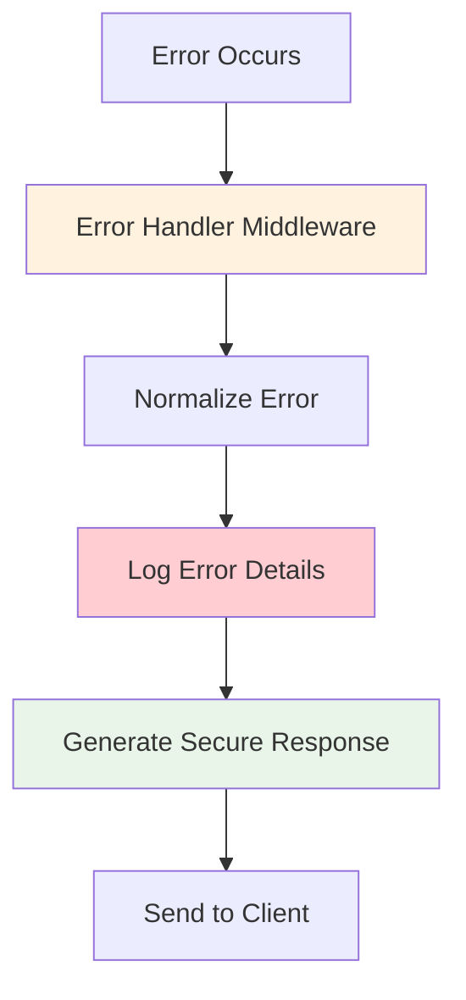

# Monitoring and Observability Guide

## Table of Contents
1. [Logger Utility](#1-logger-utility)
2. [Request/Response Logging](#2-requestresponse-logging)
3. [Error Monitoring](#3-error-monitoring)
4. [Performance Monitoring](#4-performance-monitoring)
5. [Health Checks](#5-health-checks)
6. [Testing and Validation](#6-testing-and-validation)

---

## 1. Logger Utility

### Overview
The Node.js tutorial backend uses a centralized logger utility (`src/backend/utils/logger.js`) that provides structured, timestamped logging across all application components. The logger implements industry-standard log levels and supports both stdout/stderr output routing for containerized environments.

### Log Levels and Usage

The logger supports three primary log levels with numeric priority values:

| Level | Priority | Output Stream | Usage |
|-------|----------|---------------|-------|
| `info` | 20 | stdout | General application information (server startup, request processing) |
| `warn` | 30 | stderr | Non-critical issues that should be noted |
| `error` | 40 | stderr | Critical issues requiring immediate attention |

### Configuration

#### Environment-Based Log Level
Configure the log level using the `LOG_LEVEL` environment variable:

```bash
# Development - Show all logs
export LOG_LEVEL=info

# Production - Show warnings and errors only
export LOG_LEVEL=warn

# Critical environments - Show errors only
export LOG_LEVEL=error
```

#### Runtime Configuration
You can also modify the log level at runtime:

```javascript
const { logger } = require('./utils/logger.js');

// Change log level during application runtime
logger.level = 'warn';
```

### Log Output Format

All log messages follow a consistent structured format:

```
[{timestamp}] [{level}] {message} {metadata}
```

**Example Log Outputs:**

```bash
# Info log
[2024-01-15T10:30:15.123Z] [INFO] Server started successfully { port: 3000, env: 'development' }

# Warning log  
[2024-01-15T10:30:16.456Z] [WARN] Deprecated API usage detected { endpoint: '/old-api', userAgent: 'Mozilla/5.0...' }

# Error log
[2024-01-15T10:30:17.789Z] [ERROR] Database connection failed { error: 'Connection timeout', retryCount: 3 }
```

### Usage Examples

#### Basic Logging
```javascript
const { logger } = require('../utils/logger.js');

// Log informational messages
logger.info('Server started successfully');

// Log warnings for non-critical issues
logger.warn('High memory usage detected');

// Log errors for critical issues
logger.error('Failed to process request');
```

#### Structured Logging with Metadata
```javascript
// Include structured metadata for better observability
logger.info('User authentication successful', {
    userId: '12345',
    sessionId: 'abc-def-ghi',
    duration: 150,
    ipAddress: '192.168.1.100'
});

// Log with performance metrics
logger.info('Database query completed', {
    query: 'SELECT * FROM users',
    duration: 45,
    rowCount: 150,
    cached: false
});
```

#### Named Import Usage
```javascript
// Import individual logger methods
const { info, warn, error } = require('../utils/logger.js');

info('Application initialized');
warn('Configuration parameter missing, using default');
error('Critical system failure');
```

### Integration Points

The logger is integrated throughout the backend components:

- **Controllers**: Log business logic events and user actions
- **Middleware**: Log request processing and middleware execution
- **Error Handlers**: Log all application errors with full context
- **Utilities**: Log helper function execution and system events

---

## 2. Request/Response Logging

### Overview
The request logging middleware (`src/backend/middleware/logging.js`) automatically logs all incoming HTTP requests and outgoing responses, providing comprehensive observability for HTTP traffic patterns, performance metrics, and user behavior analysis.

### Log Format and Fields

Each HTTP request/response cycle generates a structured log entry with the following format:

```
[{timestamp}] {method} {url} {status} {responseTime} ms - {userAgent}
```

**Captured Fields:**
- **Timestamp**: ISO 8601 formatted request start time
- **Method**: HTTP method (GET, POST, PUT, DELETE, etc.)
- **URL**: Complete request path including query parameters
- **Status**: HTTP response status code
- **Response Time**: Processing duration in milliseconds
- **User Agent**: Client identification string

### Log Level Selection

The middleware automatically selects appropriate log levels based on HTTP response status codes:

| Status Code Range | Log Level | Description |
|------------------|-----------|-------------|
| 200-399 | `info` | Successful requests |
| 400-499 | `warn` | Client errors (bad requests, not found, etc.) |
| 500+ | `error` | Server errors (internal server errors, timeouts) |

### Example Log Entries

```bash
# Successful request
[2024-01-15T10:30:15.123Z] [INFO] GET /hello 200 12 ms - Mozilla/5.0 (Windows NT 10.0; Win64; x64)

# Client error
[2024-01-15T10:30:16.456Z] [WARN] GET /nonexistent 404 5 ms - curl/7.68.0

# Server error  
[2024-01-15T10:30:17.789Z] [ERROR] POST /api/data 500 2500 ms - PostmanRuntime/7.28.4
```

### Structured Metadata

In addition to the formatted log message, the middleware includes comprehensive metadata:

```javascript
{
    requestId: 'req-abc-123',
    remoteAddress: '192.168.1.100', 
    method: 'GET',
    url: '/hello',
    statusCode: 200,
    responseTime: 12,
    userAgent: 'Mozilla/5.0...',
    timestamp: '2024-01-15T10:30:15.123Z'
}
```

### Implementation and Integration

#### Middleware Registration
Mount the request logger early in the Express middleware stack for complete coverage:

```javascript
const express = require('express');
const { requestLoggerMiddleware } = require('./middleware/logging.js');

const app = express();

// Register request logger as first middleware for complete coverage
app.use(requestLoggerMiddleware);

// Other middleware and routes...
app.get('/hello', (req, res) => {
    res.send('Hello world');
});
```

#### High-Resolution Timing
The middleware uses `process.hrtime.bigint()` for nanosecond-precision timing, ensuring accurate performance measurements even for very fast requests.

#### Response Completion Detection
Uses the `on-finished` library (^2.4.1) to accurately detect when HTTP responses have completed, ensuring all response data is available when logging occurs.

### Performance Monitoring Integration

Request logs provide essential data for performance analysis:

- **Response Time Distribution**: Identify slow endpoints and performance bottlenecks
- **Error Rate Analysis**: Monitor client and server error patterns
- **Traffic Patterns**: Understand usage patterns and peak load periods
- **User Agent Analysis**: Track client technology and bot activity

---

## 3. Error Monitoring

### Overview
The backend implements comprehensive error monitoring through centralized error handling (`src/backend/middleware/errorHandler.js`) and error normalization utilities (`src/backend/utils/errors.js`). All errors are captured, logged with full context, and responded to with secure, standardized error messages.

### Error Processing Flow



### Error Normalization

All errors are normalized into standardized `AppError` instances with consistent structure:

```javascript
class AppError extends Error {
    constructor(message, status = 500, details = null) {
        super(message);
        this.name = 'AppError';
        this.status = status;      // HTTP status code
        this.details = details;    // Internal details (not exposed to client)
    }
}
```

### Error Response Format

**Client Response (Secure):**
```json
{
    "error": true,
    "message": "Request timed out",
    "status": 504,
    "timestamp": "2024-01-15T10:30:15.123Z",
    "path": "/api/data"
}
```

**Internal Log (Detailed):**
```javascript
{
    error: {
        message: "Request timed out",
        status: 504,
        stack: "Error: Request timed out\n    at timeout (/app/middleware/timeout.js:45:15)...",
        details: { originalError: "AbortError", timeoutDuration: 5000 }
    },
    request: {
        method: "GET",
        url: "/api/data",
        userAgent: "Mozilla/5.0...",
        ip: "192.168.1.100",
        timestamp: "2024-01-15T10:30:15.123Z"
    }
}
```

### Error Categories and Monitoring

#### Request Timeout Errors
- **Detection**: AbortController signals and timeout flags
- **Status Code**: 504 Gateway Timeout
- **Monitoring**: Track timeout frequency and request duration patterns

```bash
[2024-01-15T10:30:17.789Z] [WARN] Request timeout detected, generating 504 response {
    "error": { "name": "AbortError", "type": "AbortError" },
    "request": { "method": "GET", "url": "/api/slow", "timeout": 5000, "duration": 5001 }
}
```

#### HTTP Client Errors (4xx)
- **Common Cases**: 404 Not Found, 405 Method Not Allowed, 400 Bad Request
- **Log Level**: `warn`
- **Monitoring**: Track error patterns and client behavior

```bash
[2024-01-15T10:30:16.456Z] [WARN] GET /nonexistent 404 5 ms - curl/7.68.0
```

#### Server Errors (5xx)
- **Common Cases**: 500 Internal Server Error, 502 Bad Gateway
- **Log Level**: `error`
- **Monitoring**: Critical alerts for application health

```bash
[2024-01-15T10:30:17.789Z] [ERROR] Error occurred during request processing {
    "error": { "message": "Database connection failed", "status": 500, "stack": "..." },
    "request": { "method": "POST", "url": "/api/data" }
}
```

### Security Considerations

#### Information Disclosure Prevention
- Stack traces and internal details are never sent to clients
- Error messages are sanitized to prevent sensitive information leakage
- Full error context is logged internally for debugging

#### Error Response Sanitization
```javascript
// Internal error with sensitive details
const internalError = new Error('Database password authentication failed for user admin');

// Sanitized client response
{
    "error": true,
    "message": "Internal Server Error",
    "status": 500,
    "timestamp": "2024-01-15T10:30:15.123Z"
}
```

### Integration with Monitoring Tools

Error logs are formatted for easy integration with external monitoring systems:

- **Log Aggregation**: JSON-structured logs for Elasticsearch/Grafana
- **Alerting**: Error rate thresholds and critical error notifications
- **Incident Response**: Request correlation IDs and full error context

---

## 4. Performance Monitoring

### Overview
Performance monitoring in the Node.js tutorial backend focuses on response time measurement, throughput analysis, and resource utilization tracking. The monitoring system provides real-time insights into application performance and helps identify bottlenecks.

### Response Time Monitoring

#### High-Resolution Timing
All HTTP requests are timed using `process.hrtime.bigint()` for nanosecond precision:

```javascript
// Request start timing
const startTime = process.hrtime.bigint();

// Response time calculation
const endTime = process.hrtime.bigint();
const responseTimeNs = endTime - startTime;
const responseTimeMs = Math.round(Number(responseTimeNs) / 1000000);
```

#### Performance Targets

| Metric | Target Value | Monitoring Method |
|--------|--------------|-------------------|
| Average Response Time | < 50ms | Request logging middleware |
| 95th Percentile Response Time | < 100ms | Log aggregation analysis |
| Maximum Response Time | < 5000ms (timeout) | Request timeout middleware |
| Server Startup Time | < 2 seconds | Application lifecycle logging |

### Throughput and Load Monitoring

#### Request Rate Tracking
Monitor request patterns through log analysis:

```bash
# Count requests per minute
grep "$(date '+%Y-%m-%dT%H:%M')" app.log | wc -l

# Monitor request distribution by endpoint
grep -o 'GET /[^ ]*' app.log | sort | uniq -c | sort -nr
```

#### Concurrent Connection Monitoring
Track active connections and connection patterns:

```javascript
// Log connection metrics
logger.info('Connection established', {
    activeConnections: server.connections,
    maxConnections: server.maxConnections,
    timestamp: new Date().toISOString()
});
```

### Resource Utilization Monitoring

#### Memory Usage Tracking
Monitor Node.js process memory consumption:

```javascript
const memoryUsage = process.memoryUsage();
logger.info('Memory usage report', {
    rss: memoryUsage.rss,                    // Resident Set Size
    heapTotal: memoryUsage.heapTotal,        // Total heap allocated
    heapUsed: memoryUsage.heapUsed,          // Heap actually used
    external: memoryUsage.external,          // External memory usage
    arrayBuffers: memoryUsage.arrayBuffers   // ArrayBuffer memory
});
```

#### CPU and Event Loop Monitoring
Track event loop performance:

```javascript
// Monitor event loop lag
const { performance } = require('perf_hooks');

function measureEventLoopLag() {
    const start = performance.now();
    setImmediate(() => {
        const lag = performance.now() - start;
        if (lag > 10) { // Alert if lag > 10ms
            logger.warn('Event loop lag detected', { lag: lag });
        }
    });
}
```

### Performance Log Analysis

#### Response Time Distribution
Analyze response time patterns from logs:

```bash
# Extract response times and calculate statistics
grep "ms -" app.log | grep -o '[0-9]* ms' | grep -o '[0-9]*' | sort -n | tail -10
```

#### Error Rate Calculation
Monitor error rates for performance impact:

```bash
# Calculate error rate percentage
total_requests=$(grep -c "\[INFO\]\|\[WARN\]\|\[ERROR\]" app.log)
error_requests=$(grep -c "\[ERROR\]" app.log)
error_rate=$(echo "scale=2; $error_requests * 100 / $total_requests" | bc)
echo "Error rate: $error_rate%"
```

### Integration with External Monitoring

#### Prometheus Metrics Integration
For production environments, integrate with Prometheus:

```javascript
// Example: Custom metrics for monitoring tools
const metrics = {
    requestDuration: responseTimeMs,
    requestCount: 1,
    errorCount: statusCode >= 400 ? 1 : 0,
    httpStatus: statusCode
};

// Log in Prometheus format
logger.info('metrics', metrics);
```

#### Grafana Dashboard Integration
Structure logs for Grafana visualization:

```json
{
    "timestamp": "2024-01-15T10:30:15.123Z",
    "level": "info",
    "message": "request_completed",
    "fields": {
        "method": "GET",
        "url": "/hello",
        "status_code": 200,
        "response_time_ms": 12,
        "user_agent": "Mozilla/5.0..."
    }
}
```

### Performance Alerting

#### Threshold-Based Alerts
Configure alerts for performance degradation:

| Alert Type | Threshold | Action |
|------------|-----------|--------|
| High Response Time | > 1000ms average over 5 minutes | Warning notification |
| Error Rate Spike | > 5% over 5 minutes | Critical alert |
| Memory Usage | > 80% of available memory | Warning notification |
| Timeout Rate | > 1% of requests timing out | Critical alert |

---

## 5. Health Checks

### Overview
Health checks provide a standardized way to monitor application availability and system health. The Node.js tutorial backend implements basic health check endpoints that return essential system metrics and operational status.

### Health Check Endpoint

#### Basic Implementation
Create a simple health check endpoint:

```javascript
const express = require('express');
const router = express.Router();

router.get('/health', (req, res) => {
    const healthData = {
        status: 'OK',
        timestamp: new Date().toISOString(),
        uptime: process.uptime(),
        memory: process.memoryUsage(),
        version: process.env.npm_package_version || '1.0.0'
    };
    
    res.status(200).json(healthData);
});
```

#### Response Format
```json
{
    "status": "OK",
    "timestamp": "2024-01-15T10:30:15.123Z",
    "uptime": 3600.125,
    "memory": {
        "rss": 52428800,
        "heapTotal": 26644480,
        "heapUsed": 18123456,
        "external": 1024768,
        "arrayBuffers": 26556
    },
    "version": "1.0.0"
}
```

### Health Check Categories

#### Liveness Probe
Determines if the application is running:

```javascript
router.get('/health/live', (req, res) => {
    // Simple check - if we can respond, we're alive
    res.status(200).json({
        status: 'alive',
        timestamp: new Date().toISOString()
    });
});
```

#### Readiness Probe
Determines if the application is ready to serve traffic:

```javascript
router.get('/health/ready', (req, res) => {
    const isReady = checkApplicationReadiness();
    
    if (isReady) {
        res.status(200).json({
            status: 'ready',
            timestamp: new Date().toISOString(),
            checks: {
                server: 'healthy',
                dependencies: 'healthy'
            }
        });
    } else {
        res.status(503).json({
            status: 'not_ready',
            timestamp: new Date().toISOString(),
            checks: {
                server: 'healthy',
                dependencies: 'unhealthy'
            }
        });
    }
});
```

### Health Metrics

#### System Metrics
Monitor essential system health indicators:

```javascript
function getSystemHealth() {
    const usage = process.cpuUsage();
    const memory = process.memoryUsage();
    
    return {
        process: {
            pid: process.pid,
            uptime: process.uptime(),
            version: process.version
        },
        memory: {
            rss: memory.rss,
            heapTotal: memory.heapTotal,
            heapUsed: memory.heapUsed,
            heapUsagePercentage: (memory.heapUsed / memory.heapTotal * 100).toFixed(2)
        },
        cpu: {
            user: usage.user,
            system: usage.system
        }
    };
}
```

#### Application Metrics
Track application-specific health indicators:

```javascript
function getApplicationHealth() {
    return {
        requests: {
            total: globalRequestCounter,
            errors: globalErrorCounter,
            errorRate: (globalErrorCounter / globalRequestCounter * 100).toFixed(2)
        },
        performance: {
            averageResponseTime: calculateAverageResponseTime(),
            lastRequestTime: lastRequestTimestamp
        },
        features: {
            logging: 'enabled',
            errorHandling: 'enabled',
            timeouts: 'enabled'
        }
    };
}
```

### Monitoring Integration

#### Container Orchestration
Health checks integrate with container platforms:

```yaml
# Docker Compose health check
healthcheck:
  test: ["CMD", "curl", "-f", "http://localhost:3000/health"]
  interval: 30s
  timeout: 10s
  retries: 3
  start_period: 40s
```

#### Kubernetes Integration
```yaml
apiVersion: v1
kind: Pod
spec:
  containers:
  - name: nodejs-app
    livenessProbe:
      httpGet:
        path: /health/live
        port: 3000
      initialDelaySeconds: 30
      periodSeconds: 10
    readinessProbe:
      httpGet:
        path: /health/ready
        port: 3000
      initialDelaySeconds: 5
      periodSeconds: 5
```

#### External Monitoring Services
Integrate with uptime monitoring services:

```javascript
// Log health check requests for external monitoring
router.get('/health', (req, res) => {
    const userAgent = req.get('User-Agent') || 'unknown';
    
    logger.info('Health check requested', {
        userAgent: userAgent,
        remoteAddress: req.ip,
        timestamp: new Date().toISOString(),
        isMonitoringService: userAgent.includes('monitoring') || userAgent.includes('pingdom')
    });
    
    // Return health data...
});
```

### Health Check Best Practices

#### Response Time Optimization
- Keep health checks lightweight (< 100ms response time)
- Cache health data when possible
- Avoid expensive operations in health checks

#### Status Code Standards
- `200 OK`: Service is healthy and ready
- `503 Service Unavailable`: Service is alive but not ready
- `500 Internal Server Error`: Service has critical issues

#### Monitoring Frequency
- **Development**: Every 10-30 seconds
- **Production**: Every 10-60 seconds depending on criticality
- **Load Balancer**: Every 5-10 seconds for traffic routing

---

## 6. Testing and Validation

### Overview
Testing and validation of monitoring features ensures that logging, error tracking, and performance monitoring work correctly across development and production environments. This section provides comprehensive guidance for validating monitoring functionality.

### Development Environment Testing

#### Logger Validation
Test all log levels and output formatting:

```bash
# Start application with debug logging
export LOG_LEVEL=info
npm start

# In another terminal, trigger various log events
curl http://localhost:3000/hello        # Should generate INFO logs
curl http://localhost:3000/nonexistent  # Should generate WARN logs
curl -X POST http://localhost:3000/hello # Should generate WARN logs (405)
```

**Expected Log Output:**
```bash
[2024-01-15T10:30:15.123Z] [INFO] Server started successfully { port: 3000, env: 'development' }
[2024-01-15T10:30:16.456Z] [INFO] GET /hello 200 12 ms - curl/7.68.0
[2024-01-15T10:30:17.789Z] [WARN] GET /nonexistent 404 8 ms - curl/7.68.0
[2024-01-15T10:30:18.012Z] [WARN] POST /hello 405 3 ms - curl/7.68.0
```

#### Request Logging Validation
Verify request/response logging accuracy:

```javascript
// Test script: test-request-logging.js
const axios = require('axios');

async function testRequestLogging() {
    console.log('Testing request logging...');
    
    // Test successful request
    const response = await axios.get('http://localhost:3000/hello');
    console.log(`Status: ${response.status}, Data: ${response.data}`);
    
    // Test 404 error
    try {
        await axios.get('http://localhost:3000/nonexistent');
    } catch (error) {
        console.log(`404 Error: ${error.response.status}`);
    }
    
    // Test method not allowed
    try {
        await axios.post('http://localhost:3000/hello');
    } catch (error) {
        console.log(`405 Error: ${error.response.status}`);
    }
}

testRequestLogging();
```

### Error Monitoring Testing

#### Error Response Validation
Test error handling and response format:

```bash
# Test timeout error (if timeout middleware is active)
curl --max-time 1 http://localhost:3000/slow-endpoint

# Test malformed requests
curl -X INVALID http://localhost:3000/hello
curl -H "Content-Length: invalid" http://localhost:3000/hello
```

**Expected Error Response:**
```json
{
    "error": true,
    "message": "Request timed out",
    "status": 504,
    "timestamp": "2024-01-15T10:30:15.123Z",
    "path": "/slow-endpoint"
}
```

#### Error Log Format Validation
Verify error logs contain required information:

```javascript
// Test script: validate-error-logs.js
const fs = require('fs');

function validateErrorLogs() {
    // This would typically read from log files or capture stdout/stderr
    console.log('Validating error log format...');
    
    // Simulate checking log structure
    const expectedFields = ['timestamp', 'level', 'message', 'error', 'request'];
    
    // In practice, you'd parse actual log output and validate structure
    console.log('Checking for required fields:', expectedFields);
}
```

### Performance Monitoring Testing

#### Response Time Measurement
Validate response time accuracy:

```javascript
// Test script: test-performance-monitoring.js
const axios = require('axios');

async function testPerformanceMonitoring() {
    console.log('Testing performance monitoring...');
    
    for (let i = 0; i < 10; i++) {
        const startTime = Date.now();
        const response = await axios.get('http://localhost:3000/hello');
        const clientTime = Date.now() - startTime;
        
        console.log(`Request ${i + 1}: Client measured ${clientTime}ms`);
        
        // Compare with server-logged response time
        // (You'd extract this from logs in practice)
    }
}

testPerformanceMonitoring();
```

#### Load Testing
Test monitoring under load conditions:

```bash
# Install artillery for load testing
npm install -g artillery

# Create artillery config: load-test.yml
echo "config:
  target: 'http://localhost:3000'
  phases:
    - duration: 30
      arrivalRate: 10
scenarios:
  - name: 'Hello endpoint'
    requests:
      - get:
          url: '/hello'" > load-test.yml

# Run load test
artillery run load-test.yml

# Monitor logs during load test for performance degradation
tail -f app.log | grep "ms -"
```

### Health Check Testing

#### Health Endpoint Validation
Test health check endpoints:

```bash
# Test basic health check
curl http://localhost:3000/health | jq '.'

# Test liveness probe
curl http://localhost:3000/health/live | jq '.'

# Test readiness probe  
curl http://localhost:3000/health/ready | jq '.'
```

**Expected Health Response:**
```json
{
    "status": "OK",
    "timestamp": "2024-01-15T10:30:15.123Z",
    "uptime": 3600.125,
    "memory": {
        "rss": 52428800,
        "heapTotal": 26644480,
        "heapUsed": 18123456
    },
    "version": "1.0.0"
}
```

### Automated Testing Integration

#### Unit Tests for Monitoring Components
Test logging components in isolation:

```javascript
// tests/logger.test.js
const { logger } = require('../src/backend/utils/logger.js');

describe('Logger utility', () => {
    test('should format log messages correctly', () => {
        // Capture console output
        const consoleSpy = jest.spyOn(process.stdout, 'write');
        
        logger.info('Test message', { key: 'value' });
        
        expect(consoleSpy).toHaveBeenCalledWith(
            expect.stringMatching(/\[\d{4}-\d{2}-\d{2}T\d{2}:\d{2}:\d{2}\.\d{3}Z\] \[INFO\] Test message/)
        );
        
        consoleSpy.mockRestore();
    });
    
    test('should respect log level configuration', () => {
        const originalLevel = logger.level;
        logger.level = 'error';
        
        const consoleSpy = jest.spyOn(process.stdout, 'write');
        
        logger.info('This should not be logged');
        logger.error('This should be logged');
        
        expect(consoleSpy).not.toHaveBeenCalledWith(
            expect.stringContaining('This should not be logged')
        );
        
        logger.level = originalLevel;
        consoleSpy.mockRestore();
    });
});
```

#### Integration Tests for Request Logging
Test HTTP request/response logging:

```javascript
// tests/request-logging.integration.test.js
const request = require('supertest');
const app = require('../src/backend/app.js');

describe('Request logging middleware', () => {
    test('should log successful requests', async () => {
        const consoleSpy = jest.spyOn(process.stdout, 'write');
        
        const response = await request(app)
            .get('/hello')
            .expect(200);
        
        expect(consoleSpy).toHaveBeenCalledWith(
            expect.stringMatching(/\[INFO\] GET \/hello 200 \d+ ms/)
        );
        
        consoleSpy.mockRestore();
    });
    
    test('should log client errors with warn level', async () => {
        const consoleSpy = jest.spyOn(process.stderr, 'write');
        
        await request(app)
            .get('/nonexistent')
            .expect(404);
        
        expect(consoleSpy).toHaveBeenCalledWith(
            expect.stringMatching(/\[WARN\] GET \/nonexistent 404 \d+ ms/)
        );
        
        consoleSpy.mockRestore();
    });
});
```

### Production Environment Validation

#### Log Aggregation Testing
Validate log format compatibility with production systems:

```bash
# Test log parsing for ELK stack
cat app.log | jq -R 'fromjson?'

# Test log filtering
grep -E '\[(ERROR|WARN)\]' app.log | head -10

# Test log rotation compatibility
logrotate -d /etc/logrotate.d/nodejs-app
```

#### Monitoring Tool Integration
Validate integration with external monitoring:

```bash
# Test Prometheus metrics format
curl http://localhost:3000/metrics

# Test Grafana dashboard queries
# (This would involve actual Grafana instance testing)

# Test alerting rules
# (This would involve testing alert conditions)
```

### Continuous Integration Testing

#### CI Pipeline Monitoring Validation
Include monitoring tests in CI/CD pipelines:

```yaml
# .github/workflows/monitoring-tests.yml
name: Monitoring Tests

on: [push, pull_request]

jobs:
  monitoring-tests:
    runs-on: ubuntu-latest
    steps:
      - uses: actions/checkout@v2
      - name: Setup Node.js
        uses: actions/setup-node@v2
        with:
          node-version: '22'
      
      - name: Install dependencies
        run: npm install
      
      - name: Start application
        run: npm start &
        
      - name: Wait for application startup
        run: sleep 5
        
      - name: Test health checks
        run: |
          curl -f http://localhost:3000/health
          curl -f http://localhost:3000/health/live
          curl -f http://localhost:3000/health/ready
      
      - name: Test logging output
        run: |
          curl http://localhost:3000/hello
          curl http://localhost:3000/nonexistent || true
          # Validate log output format
          
      - name: Run monitoring unit tests
        run: npm test -- --testMatch="**/*monitoring*.test.js"
```

### Coverage and Quality Metrics

#### Monitoring Test Coverage
Ensure comprehensive test coverage for monitoring components:

```bash
# Run tests with coverage for monitoring modules
npm test -- --coverage --testMatch="**/*{logging,monitoring,error}*.test.js"

# Generate coverage report
npx nyc report --reporter=html
```

#### Quality Validation
Validate monitoring code quality:

```bash
# Lint monitoring-related files
npx eslint src/backend/utils/logger.js src/backend/middleware/logging.js

# Check for security vulnerabilities in monitoring dependencies
npm audit

# Validate log message formats
grep -E '\[ERROR\]|\[WARN\]|\[INFO\]' app.log | head -20
```

This comprehensive testing approach ensures that all monitoring and observability features function correctly, provide accurate data, and integrate properly with external monitoring systems. Regular validation helps maintain monitoring system reliability and effectiveness for operational visibility.

---

## Conclusion

This monitoring and observability guide provides comprehensive documentation for implementing, configuring, and consuming monitoring features in the Node.js tutorial backend. The centralized logging, request/response monitoring, error tracking, and performance monitoring capabilities work together to provide essential operational visibility.

Key benefits of this monitoring implementation:

- **Centralized Logging**: Structured, timestamped logs with consistent formatting
- **Request Observability**: Complete HTTP request/response lifecycle tracking
- **Error Monitoring**: Comprehensive error capture with secure client responses
- **Performance Insights**: Response time measurement and resource utilization tracking
- **Health Monitoring**: Application health checks for availability monitoring
- **Testing Coverage**: Comprehensive validation of monitoring functionality

The monitoring system is designed for both educational clarity and production readiness, providing a solid foundation for operational observability as applications scale and evolve.