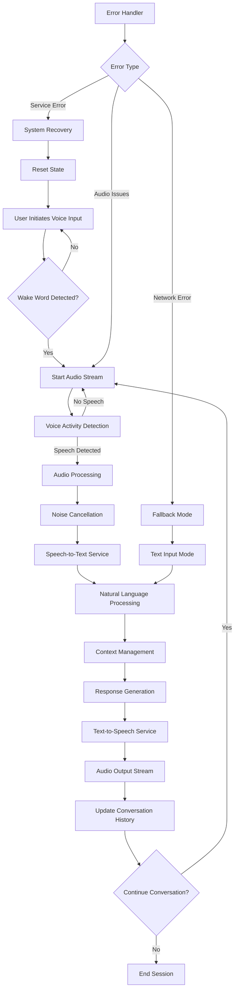
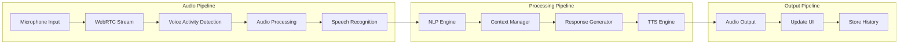
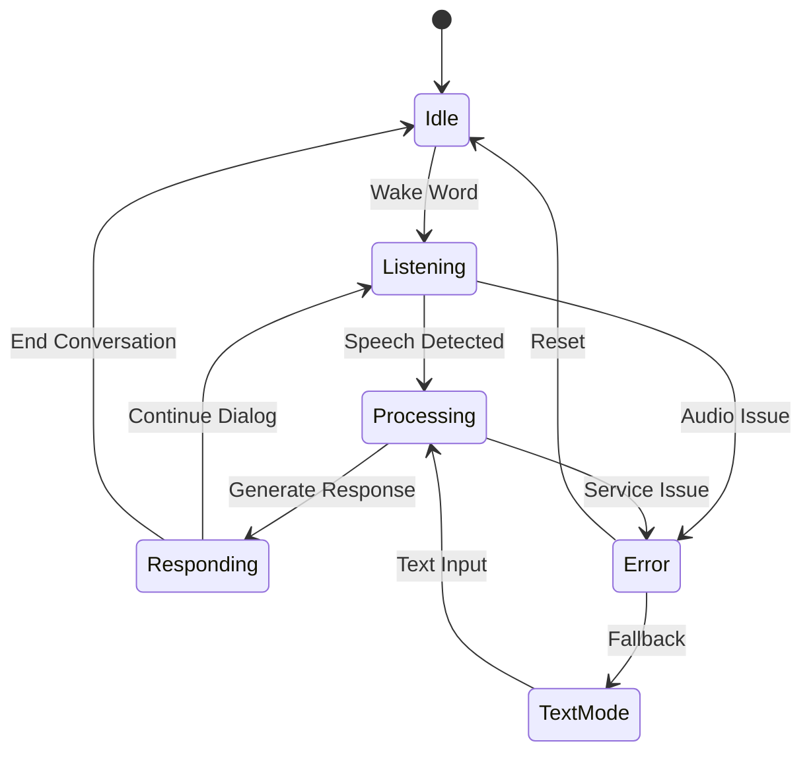
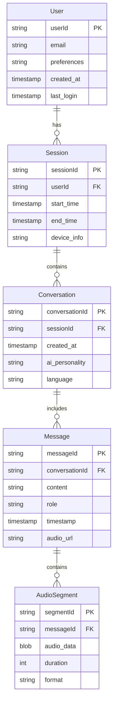
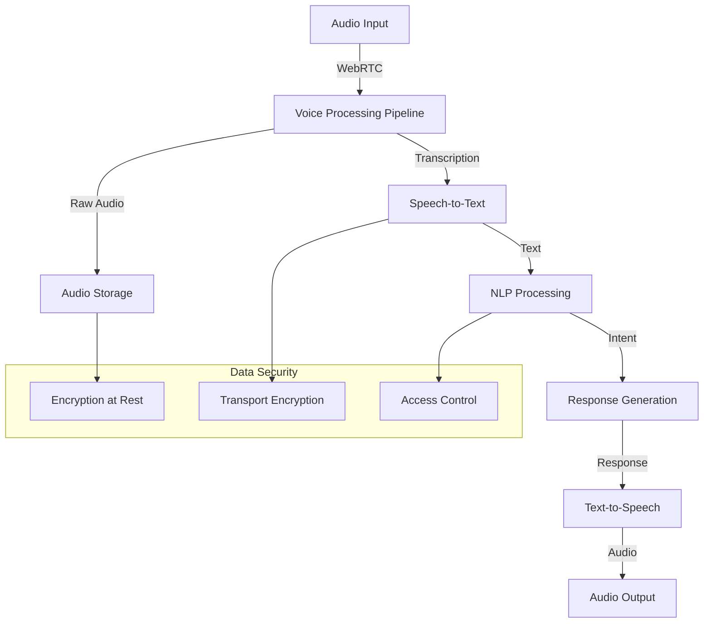

# Product Requirements Document (PRD)

# 1. INTRODUCTION

## 1.1 Purpose
This Product Requirements Document (PRD) specifies the requirements for developing a web-based AI Voice Agent application. The document serves as a comprehensive guide for developers, project managers, QA engineers, and stakeholders involved in the development process. It outlines technical specifications, functional requirements, and design constraints that must be met to successfully implement the system.

## 1.2 Scope
The AI Voice Agent is a web application that enables natural, real-time voice conversations between users and an artificial intelligence assistant. The system encompasses:

- Real-time voice processing capabilities including speech-to-text and text-to-speech
- Natural language understanding and response generation
- Web-based user interface with voice interaction controls
- Conversation management and history tracking
- Multiple AI personality options
- Cross-platform browser compatibility

Key benefits include:
- Hands-free interaction with AI assistants
- Seamless, natural conversation flow
- Accessibility through standard web browsers
- Minimal technical setup requirements
- Support for both voice and text input modalities

The system will not include:
- Native mobile applications
- Offline functionality
- Third-party AI assistant integrations
- Custom wake word training
- Multi-user conversation capabilities

# 2. PRODUCT DESCRIPTION

## 2.1 Product Perspective
The AI Voice Agent is a standalone web application that operates within modern web browsers. It integrates with several external services and systems:

- Cloud-based speech recognition services for real-time transcription
- Natural Language Processing (NLP) engines for intent understanding
- Text-to-Speech (TTS) services for voice synthesis
- WebRTC infrastructure for audio streaming
- Web servers for application hosting and API handling

## 2.2 Product Functions
The system provides the following core functions:

- Voice Input Processing
  - Wake word detection
  - Real-time speech capture and streaming
  - Voice activity detection
  - Noise cancellation
  
- Conversation Management
  - Speech-to-text transcription
  - Natural language understanding
  - Context maintenance
  - Response generation
  - Text-to-speech conversion
  
- User Interface
  - Microphone controls and status indicators
  - Conversation history display
  - Voice personality selection
  - Text input fallback option
  
- Session Management
  - User session tracking
  - Conversation persistence
  - System state management
  - Error recovery

## 2.3 User Characteristics
Target users include:

1. Primary Users
   - Age range: 18-65
   - Technical proficiency: Basic to intermediate
   - Device usage: Desktop and mobile web browsers
   - Use frequency: Regular (daily/weekly)
   - Motivation: Hands-free AI interaction

2. Secondary Users
   - Accessibility needs users
   - Technical support staff
   - System administrators
   - Content moderators

## 2.4 Constraints
1. Technical Constraints
   - Browser compatibility limited to modern versions of Chrome, Firefox, and Safari
   - Requires continuous internet connectivity
   - Minimum bandwidth requirements for voice streaming
   - Device must support WebRTC
   - Limited offline capabilities

2. Regulatory Constraints
   - Voice data privacy compliance (GDPR, CCPA)
   - Data retention policies
   - User consent requirements
   - Accessibility standards (WCAG 2.1)

3. Business Constraints
   - Third-party API usage limits
   - Infrastructure scaling costs
   - Browser-only deployment
   - Single-user conversation scope

## 2.5 Assumptions and Dependencies
Assumptions:
- Users have access to devices with microphone capabilities
- Stable internet connection available during usage
- Modern web browser installation
- Basic understanding of voice assistant interactions
- English language primary support

Dependencies:
- Cloud speech recognition service availability
- WebRTC implementation in target browsers
- Text-to-Speech service reliability
- NLP engine uptime
- API service level agreements
- Browser vendor support for required features
- Third-party library maintenance

# 3. PROCESS FLOWCHART

# 4. FUNCTIONAL REQUIREMENTS

## 4.1 Voice Processing Features

### 4.1.1 Wake Word Detection
**ID**: F101  
**Description**: System actively listens for specific wake words/phrases to initiate conversation  
**Priority**: High  

| Requirement ID | Requirement Description | Acceptance Criteria |
|---------------|------------------------|-------------------|
| F101.1 | Support for customizable wake words | At least 3 preset wake words available |
| F101.2 | Continuous background listening | Wake word detection within 1 second |
| F101.3 | Wake word sensitivity adjustment | User-configurable sensitivity levels |
| F101.4 | False activation prevention | <10% false activation rate |

### 4.1.2 Speech Recognition
**ID**: F102  
**Description**: Real-time conversion of user speech to text  
**Priority**: Critical  

| Requirement ID | Requirement Description | Acceptance Criteria |
|---------------|------------------------|-------------------|
| F102.1 | Real-time transcription | Latency <500ms |
| F102.2 | Multi-language support | Support for English, Spanish, French |
| F102.3 | Punctuation detection | Accurate sentence boundary detection |
| F102.4 | Speech recognition accuracy | >95% accuracy for clear speech |

### 4.1.3 Voice Activity Detection
**ID**: F103  
**Description**: Detect presence of human speech in audio stream  
**Priority**: High  

| Requirement ID | Requirement Description | Acceptance Criteria |
|---------------|------------------------|-------------------|
| F103.1 | Speech/non-speech discrimination | <200ms detection time |
| F103.2 | Automatic session termination | End session after 5s silence |
| F103.3 | Background noise handling | Function in 40dB ambient noise |

## 4.2 Conversation Management Features

### 4.2.1 Natural Language Processing
**ID**: F201  
**Description**: Understanding and processing of user intent  
**Priority**: Critical  

| Requirement ID | Requirement Description | Acceptance Criteria |
|---------------|------------------------|-------------------|
| F201.1 | Intent classification | >90% intent recognition accuracy |
| F201.2 | Context maintenance | Track context for 5+ turns |
| F201.3 | Entity extraction | Identify common entities with 95% accuracy |

### 4.2.2 Response Generation
**ID**: F202  
**Description**: AI-generated contextual responses  
**Priority**: Critical  

| Requirement ID | Requirement Description | Acceptance Criteria |
|---------------|------------------------|-------------------|
| F202.1 | Response relevance | >90% contextually appropriate responses |
| F202.2 | Response time | <2s total processing time |
| F202.3 | Personality consistency | Maintain selected AI personality |

### 4.2.3 Text-to-Speech
**ID**: F203  
**Description**: Convert AI responses to natural-sounding speech  
**Priority**: High  

| Requirement ID | Requirement Description | Acceptance Criteria |
|---------------|------------------------|-------------------|
| F203.1 | Voice quality | Natural prosody and intonation |
| F203.2 | Multiple voices | Minimum 5 distinct voice options |
| F203.3 | Speech rate control | Adjustable speaking rate |

## 4.3 Interface Features

### 4.3.1 Audio Controls
**ID**: F301  
**Description**: User controls for audio input/output  
**Priority**: High  

| Requirement ID | Requirement Description | Acceptance Criteria |
|---------------|------------------------|-------------------|
| F301.1 | Microphone toggle | <100ms response time |
| F301.2 | Volume control | Adjustable in 10% increments |
| F301.3 | Mute function | Immediate audio cutoff |

### 4.3.2 Visual Feedback
**ID**: F302  
**Description**: Visual indicators of system status  
**Priority**: Medium  

| Requirement ID | Requirement Description | Acceptance Criteria |
|---------------|------------------------|-------------------|
| F302.1 | Listening indicator | Clear visual feedback |
| F302.2 | Processing status | Show all system states |
| F302.3 | Error notifications | User-friendly error messages |

### 4.3.3 Conversation History
**ID**: F303  
**Description**: Display and management of conversation logs  
**Priority**: Medium  

| Requirement ID | Requirement Description | Acceptance Criteria |
|---------------|------------------------|-------------------|
| F303.1 | History display | Show last 20 exchanges |
| F303.2 | Export functionality | Export in common formats |
| F303.3 | Search capability | Full-text search of history |

## 4.4 System Features

### 4.4.1 Error Handling
**ID**: F401  
**Description**: System error detection and recovery  
**Priority**: High  

| Requirement ID | Requirement Description | Acceptance Criteria |
|---------------|------------------------|-------------------|
| F401.1 | Connection monitoring | Detect network issues within 1s |
| F401.2 | Fallback modes | Automatic switch to text input |
| F401.3 | Error recovery | Auto-recovery from common errors |

### 4.4.2 Session Management
**ID**: F402  
**Description**: User session handling and state management  
**Priority**: High  

| Requirement ID | Requirement Description | Acceptance Criteria |
|---------------|------------------------|-------------------|
| F402.1 | Session persistence | Maintain state across page reloads |
| F402.2 | Multi-tab handling | Prevent concurrent sessions |
| F402.3 | Session timeout | Auto-logout after 30min inactivity |

# 5. NON-FUNCTIONAL REQUIREMENTS

## 5.1 Performance Requirements

| Category | Requirement | Target Metric |
|----------|------------|---------------|
| Response Time | Voice Processing Latency | < 500ms end-to-end |
| | Wake Word Detection | < 1 second |
| | UI Interaction Response | < 100ms |
| | API Response Time | < 2 seconds |
| Throughput | Concurrent Users per Server | 1000 users |
| | Voice Data Processing | 64kbps per stream |
| Resource Usage | Client Memory Usage | < 512MB RAM |
| | Browser CPU Usage | < 30% on average |
| | Network Bandwidth | 100kbps minimum |

## 5.2 Safety Requirements

| Requirement | Description | Implementation |
|-------------|-------------|----------------|
| Data Backup | Regular backup of conversation data | Daily incremental, weekly full backup |
| Failover Systems | Redundant systems for critical components | Active-passive configuration |
| Error Recovery | Automatic system recovery procedures | Self-healing mechanisms |
| Data Loss Prevention | Protection against data corruption | Transaction logging and validation |
| Graceful Degradation | Fallback to text-only mode | Automatic mode switching |

## 5.3 Security Requirements

| Category | Requirement | Specification |
|----------|------------|---------------|
| Authentication | User Identity Verification | OAuth 2.0 implementation |
| | Session Management | JWT with 30-minute expiry |
| Authorization | Role-based Access Control | User/Admin role separation |
| Data Protection | Voice Data Encryption | AES-256 encryption at rest |
| | Transport Security | TLS 1.3 for all connections |
| Privacy | Data Anonymization | Automated PII detection and masking |
| | Consent Management | Explicit user consent tracking |
| Audit | Security Logging | Complete audit trail of system access |

## 5.4 Quality Requirements

### 5.4.1 Availability
- System uptime: 99.9% (excluding planned maintenance)
- Planned maintenance window: Maximum 4 hours monthly
- Recovery Time Objective (RTO): < 1 hour
- Recovery Point Objective (RPO): < 5 minutes

### 5.4.2 Maintainability
- Code documentation coverage: > 80%
- Modular architecture with clear separation of concerns
- Automated testing coverage: > 90%
- Continuous Integration/Deployment pipeline
- Mean Time To Repair (MTTR): < 2 hours

### 5.4.3 Usability
- First-time user success rate: > 90%
- Task completion rate: > 95%
- User error rate: < 5%
- System Usability Scale (SUS) score: > 80
- Maximum learning time: 10 minutes

### 5.4.4 Scalability
- Horizontal scaling capability: 0-100 instances
- Auto-scaling response time: < 3 minutes
- Database scaling: Support for 1M+ conversations
- Load balancing: Round-robin with health checks
- Storage scalability: Up to 10TB per instance

### 5.4.5 Reliability
- Mean Time Between Failures (MTBF): > 720 hours
- Error rate: < 0.1% of all transactions
- Data durability: 99.999999999%
- Fault tolerance: No single point of failure
- Automated failover time: < 30 seconds

## 5.5 Compliance Requirements

| Requirement Type | Specification | Standard/Regulation |
|-----------------|---------------|-------------------|
| Data Privacy | User data handling | GDPR, CCPA |
| Accessibility | Web interface standards | WCAG 2.1 Level AA |
| Audio Processing | Voice data handling | HIPAA (where applicable) |
| Security Standards | System security | ISO 27001 |
| Browser Standards | Web compatibility | W3C Standards |
| API Standards | REST API design | OpenAPI 3.0 |
| Cloud Security | Infrastructure security | SOC 2 Type II |
| Voice Technology | Speech processing | ITU-T Standards |

# 6. DATA REQUIREMENTS

## 6.1 Data Models

## 6.2 Data Storage

### 6.2.1 Primary Storage Requirements

| Data Type | Storage System | Retention Period | Backup Frequency |
|-----------|---------------|------------------|------------------|
| User Profiles | PostgreSQL | Indefinite | Daily |
| Session Data | Redis | 30 days | Daily |
| Conversation History | PostgreSQL | 90 days | Daily |
| Audio Segments | Object Storage | 7 days | Daily |
| System Logs | Elasticsearch | 30 days | Daily |

### 6.2.2 Backup and Recovery

| Backup Type | Frequency | Retention | Recovery SLA |
|-------------|-----------|-----------|--------------|
| Full Database | Weekly | 3 months | 4 hours |
| Incremental Database | Daily | 1 month | 2 hours |
| Audio Files | Daily | 7 days | 8 hours |
| Configuration | On change | 1 year | 1 hour |

## 6.3 Data Processing

### 6.3.1 Data Security Controls

| Security Layer | Implementation | Standard |
|----------------|----------------|-----------|
| Transport | TLS 1.3 | HTTPS/WSS |
| Storage | AES-256 | Encrypted at rest |
| Access | JWT tokens | OAuth 2.0 |
| Audit | Event logging | ISO 27001 |

### 6.3.2 Data Processing Requirements

| Process Type | Latency Requirement | Processing Location |
|--------------|---------------------|-------------------|
| Voice Processing | <100ms | Edge Server |
| Speech Recognition | <500ms | Cloud Service |
| NLP Processing | <1000ms | Application Server |
| Audio Synthesis | <500ms | Cloud Service |

### 6.3.3 Data Retention Rules

| Data Category | Retention Period | Archival Policy |
|---------------|------------------|-----------------|
| Raw Audio | 24 hours | Delete |
| Transcripts | 90 days | Compress and Archive |
| User Data | Until account deletion | Backup |
| Analytics | 1 year | Aggregate and Archive |

# 7. EXTERNAL INTERFACES

## 7.1 User Interfaces

### 7.1.1 Web Interface Components

| Component | Description | Requirements |
|-----------|-------------|--------------|
| Microphone Control | Primary voice input control | - Clear on/off state indicator - Single-click activation - Permission request handling |
| Voice Activity Display | Real-time audio input visualization | - Waveform or amplitude display - Clear listening state indication |
| Conversation Display | Chat-style message history | - Distinct user/AI messages - Timestamps - Scrollable history |
| System Status | Visual feedback indicators | - Connection status - Processing state - Error notifications |
| Settings Panel | User configuration interface | - Voice selection - Language options - Audio settings |

### 7.1.2 Responsive Design Requirements

| Screen Size | Layout Adjustments |
|-------------|-------------------|
| Desktop (>1024px) | - Two-column layout - Persistent controls - Full conversation history |
| Tablet (768-1024px) | - Flexible single column - Collapsible settings - Scrollable history |
| Mobile (<768px) | - Stack layout - Modal settings - Minimal controls |

## 7.2 Hardware Interfaces

### 7.2.1 Audio Input/Output

| Interface | Specifications | Requirements |
|-----------|---------------|--------------|
| Microphone | - Sample rate: 16kHz minimum - Bit depth: 16-bit - Channels: Mono | - WebRTC audio capture - Auto device selection - Permission handling |
| Speakers/Headphones | - Sample rate: 44.1kHz - Bit depth: 16-bit - Channels: Stereo | - WebAudio API output - Volume control - Device switching |

## 7.3 Software Interfaces

### 7.3.1 External Services Integration

| Service | Interface Type | Requirements |
|---------|---------------|--------------|
| Speech Recognition | REST API | - WebSocket streaming - JSON response format - Error handling |
| Text-to-Speech | REST API | - Audio stream response - Voice selection - SSML support |
| NLP Engine | REST API | - JSON request/response - Authentication - Rate limiting |
| Storage Service | SDK/API | - Blob storage for audio - Data encryption - Access control |

### 7.3.2 Browser Compatibility

| Browser | Minimum Version | Required Features |
|---------|----------------|-------------------|
| Chrome | 83+ | WebRTC, WebAudio, WebSocket |
| Firefox | 78+ | WebRTC, WebAudio, WebSocket |
| Safari | 14+ | WebRTC, WebAudio, WebSocket |

## 7.4 Communication Interfaces

### 7.4.1 Network Protocols

| Protocol | Usage | Specifications |
|----------|-------|---------------|
| WebSocket | Real-time audio streaming | - WSS (secure WebSocket) - Binary audio frames - Heartbeat mechanism |
| HTTPS | REST API communication | - TLS 1.3 - JSON payload - Compression |
| WebRTC | Peer-to-peer audio | - STUN/TURN support - ICE protocol - UDP preferred |

### 7.4.2 Data Formats

| Data Type | Format | Schema |
|-----------|--------|--------|
| Audio Streaming | - Binary PCM - Opus encoded | - 16kHz sample rate - 20ms frames - Variable bitrate |
| API Requests | JSON | - OpenAPI 3.0 spec - UTF-8 encoding |
| Events | JSON | - Event type - Timestamp - Payload |

### 7.4.3 API Authentication

| Method | Implementation | Requirements |
|--------|----------------|--------------|
| Bearer Token | JWT | - 30min expiration - Refresh token support - CORS policy |
| API Keys | Header-based | - Rate limiting - Service-specific keys - Key rotation |

# 8. APPENDICES

## 8.1 GLOSSARY

| Term | Definition |
|------|------------|
| Wake Word | A specific phrase or word that activates the voice assistant's listening mode |
| Voice Activity Detection (VAD) | Technology that detects the presence of human speech in an audio stream |
| Natural Language Processing (NLP) | Technology that enables computers to understand and process human language |
| WebRTC | Web Real-Time Communication, an open-source project enabling real-time communication in web browsers |
| Latency | The time delay between an input and its corresponding output |
| Prosody | The patterns of stress and intonation in speech |
| Fallback Mode | Alternative operation mode when primary functionality is unavailable |
| Session | A period of continuous interaction between user and system |
| Context Management | Maintaining conversational context across multiple exchanges |
| Entity Extraction | Identification of specific named entities within text |

## 8.2 ACRONYMS

| Acronym | Expansion |
|---------|-----------|
| API | Application Programming Interface |
| CORS | Cross-Origin Resource Sharing |
| GDPR | General Data Protection Regulation |
| CCPA | California Consumer Privacy Act |
| HIPAA | Health Insurance Portability and Accountability Act |
| JWT | JSON Web Token |
| REST | Representational State Transfer |
| SDK | Software Development Kit |
| SLA | Service Level Agreement |
| SSL/TLS | Secure Sockets Layer/Transport Layer Security |
| STUN | Session Traversal Utilities for NAT |
| TURN | Traversal Using Relays around NAT |
| UI | User Interface |
| WCAG | Web Content Accessibility Guidelines |
| WSS | WebSocket Secure |

## 8.3 ADDITIONAL REFERENCES

### 8.3.1 Technical Standards

| Standard | Description | URL |
|----------|-------------|-----|
| WebRTC 1.0 | W3C Standard for real-time communication | https://www.w3.org/TR/webrtc/ |
| Web Speech API | W3C Standard for speech recognition and synthesis | https://wicg.github.io/speech-api/ |
| WebSocket Protocol | IETF RFC 6455 | https://tools.ietf.org/html/rfc6455 |
| OAuth 2.0 | Authorization Framework | https://tools.ietf.org/html/rfc6749 |

### 8.3.2 Development Resources

| Resource | Purpose | URL |
|----------|---------|-----|
| MDN Web Docs | WebRTC and Web Audio API documentation | https://developer.mozilla.org |
| WebRTC Samples | Code examples and demos | https://webrtc.github.io/samples/ |
| Web Speech API Demo | Speech recognition examples | https://developer.mozilla.org/en-US/docs/Web/API/Web_Speech_API |
| WCAG Guidelines | Accessibility implementation guide | https://www.w3.org/WAI/WCAG21/quickref/ |

### 8.3.3 Related Research Papers

| Title | Authors | Year | Relevance |
|-------|---------|------|-----------|
| "Deep Speech: Scaling up end-to-end speech recognition" | Hannun et al. | 2014 | Speech recognition architecture |
| "WaveNet: A Generative Model for Raw Audio" | van den Oord et al. | 2016 | Text-to-speech synthesis |
| "Attention Is All You Need" | Vaswani et al. | 2017 | NLP architecture |
| "Neural Voice Cloning with a Few Samples" | Arik et al. | 2018 | Voice synthesis techniques |