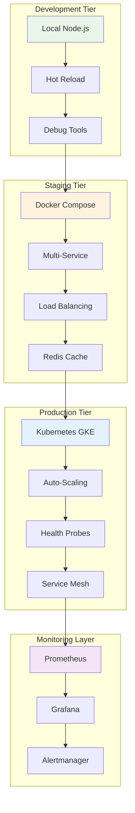
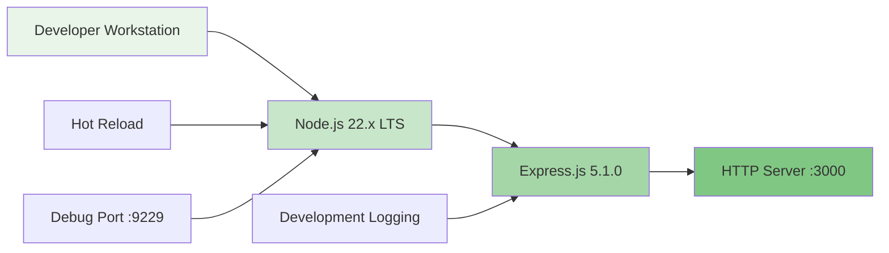
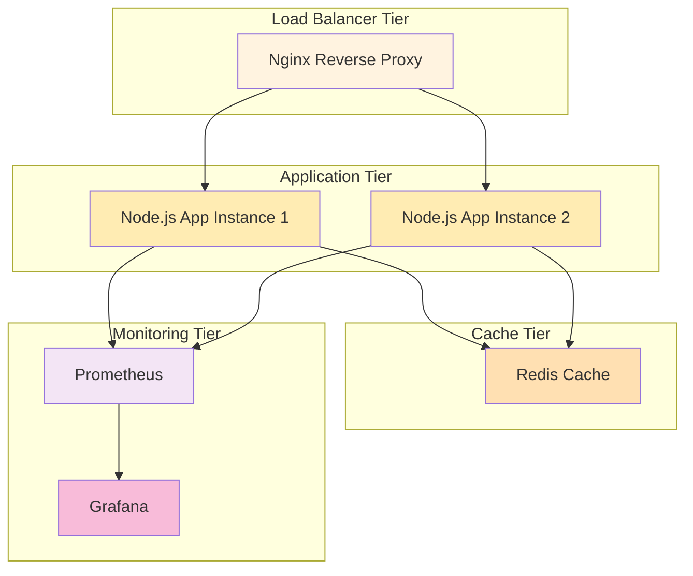
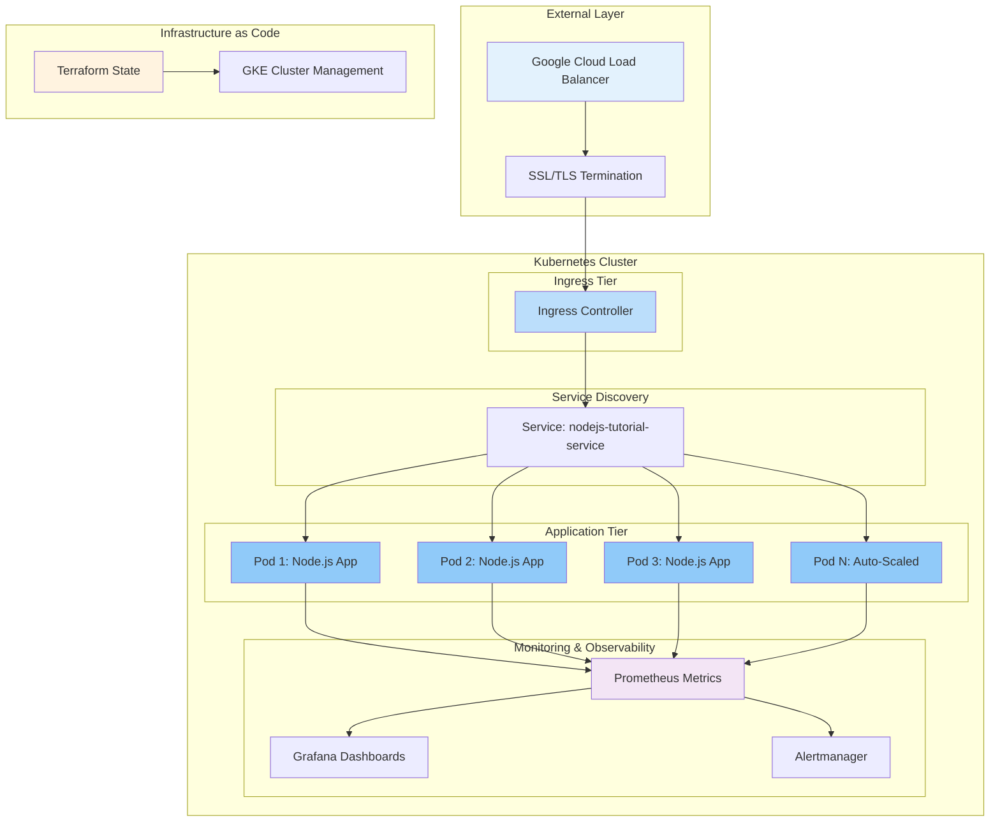
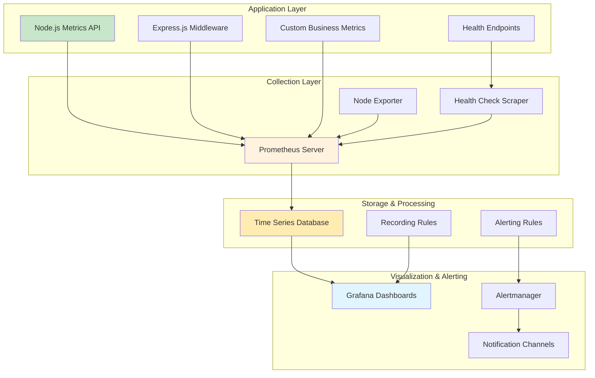

# Node.js Tutorial Application - Infrastructure Documentation

## Table of Contents

1. [Introduction](#introduction)
2. [Quick Start Guide](#quick-start-guide)
3. [Architecture Overview](#architecture-overview)
4. [Deployment Options](#deployment-options)
5. [Monitoring Setup Overview](#monitoring-setup-overview)
6. [Operational Procedures Guide](#operational-procedures-guide)
7. [Troubleshooting Guide](#troubleshooting-guide)
8. [Educational Learning Path](#educational-learning-path)
9. [Advanced Topics](#advanced-topics)
10. [Resources and References](#resources-and-references)

---

## Introduction

Welcome to the comprehensive infrastructure documentation for the Node.js Tutorial Application. This documentation serves as your central hub for understanding, deploying, and operating a production-ready Express.js 5.1.0 application with Node.js 22.x LTS runtime across multiple environments and platforms.

### Infrastructure Philosophy

This infrastructure implementation demonstrates **progressive complexity** - starting with simple local development and evolving to sophisticated production deployment patterns. Every component is designed with **educational clarity** while maintaining **production readiness**, ensuring you learn fundamental concepts that scale to enterprise environments.

### Key Features

- **🎯 Educational First**: Clear explanations and learning objectives for every infrastructure component
- **🚀 Production Ready**: Enterprise-grade patterns with security, monitoring, and operational excellence
- **📈 Progressive Complexity**: Infrastructure scales from simple local development to production-grade cloud deployment
- **🔧 Multi-Platform Support**: Consistent deployment patterns across Docker, Kubernetes, and major cloud platforms
- **👀 Observability by Design**: Comprehensive monitoring, logging, and metrics collection with Prometheus and Grafana
- **🔒 Security First**: Container hardening, network policies, and access control implementation

### Application Specifications

| Component | Technology | Version | Purpose |
|-----------|------------|---------|---------|
| **Runtime Environment** | Node.js | 22.11.0 LTS ('Jod') | JavaScript execution with enhanced performance |
| **Web Framework** | Express.js | 5.1.0 | HTTP server with automatic promise error handling |
| **Containerization** | Docker | 24.0+ | Application packaging with Alpine Linux security |
| **Local Orchestration** | Docker Compose | 2.20.0+ | Multi-service development and staging environments |
| **Production Orchestration** | Kubernetes | 1.28+ | Container orchestration with GKE managed clusters |
| **Infrastructure as Code** | Terraform | 1.5+ | Cloud resource provisioning and management |
| **Monitoring Platform** | Prometheus + Grafana | 2.40.0 + 10.4.0 | Metrics collection and visualization |
| **CI/CD Platform** | GitHub Actions | Latest | Automated testing, building, and deployment |

### Infrastructure Components Overview



---

## Quick Start Guide

### Local Development Environment

**Prerequisites**: Node.js 22.x LTS, NPM package manager

The simplest way to get started with the Node.js tutorial application for learning and development:

```bash
# Navigate to the backend application
cd src/backend

# Install dependencies
npm install

# Start development server with hot reload
npm run dev

# Verify application is running
curl http://localhost:3000/hello
# Expected response: "Hello world"

# Check application health
curl http://localhost:3000/health
# Expected response: JSON with application health status
```

**Development Features**:
- 🔄 Hot reload for rapid development cycles
- 🐛 Debug port exposure for IDE integration (port 9229)
- 📝 Comprehensive logging for development debugging
- ⚡ Fast iteration without containerization overhead

### Docker Compose Staging Environment  

**Prerequisites**: Docker Engine 24.0+, Docker Compose v2.0+

Multi-service orchestration suitable for staging environments and integration testing:

```bash
# Navigate to Docker infrastructure
cd infrastructure/docker

# Start multi-service staging environment
docker-compose up -d --build

# Check service health
docker-compose ps --filter health=healthy

# Test load-balanced application
curl http://localhost/hello
# Traffic routes through Nginx to multiple app instances

# Monitor service logs
docker-compose logs -f nodejs-tutorial-app

# Scale application instances
docker-compose up -d --scale nodejs-tutorial-app=4
```

**Staging Features**:
- 🔀 Load-balanced Node.js application replicas (2 instances by default)
- 🌐 Nginx reverse proxy with SSL termination capability
- 💾 Redis cache for session storage and performance optimization
- 📊 Basic monitoring with health checks and log aggregation
- 🔧 Production-like environment for integration testing

### Kubernetes Production Environment

**Prerequisites**: Kubernetes cluster access, kubectl v1.28+, Container registry authentication

Production-ready container orchestration with comprehensive management:

```bash
# Deploy infrastructure with Terraform (optional)
cd infrastructure/deployment/terraform
terraform init && terraform plan && terraform apply

# Create Kubernetes namespace
kubectl create namespace nodejs-tutorial

# Deploy application to Kubernetes
kubectl apply -f infrastructure/deployment/kubernetes/

# Monitor deployment rollout
kubectl rollout status deployment/nodejs-tutorial-app -n nodejs-tutorial

# Check pod health and status
kubectl get pods -n nodejs-tutorial -l app.kubernetes.io/name=nodejs-tutorial

# Test external access (after ingress setup)
curl https://your-domain.com/hello

# Scale deployment for high availability
kubectl scale deployment nodejs-tutorial-app --replicas=5 -n nodejs-tutorial
```

**Production Features**:
- ⚖️ Auto-scaling based on CPU and memory utilization (3-10 replicas)
- 🏥 Comprehensive health probes (liveness, readiness, startup)
- 🌐 Global load balancing with Google Cloud Load Balancer
- 🔒 Security hardening with non-root execution and network policies
- 📈 Full observability with Prometheus metrics and Grafana dashboards

### Cloud Platform Quick Deploy

**Google Cloud Run (Serverless)**:
```bash
# Build and deploy to Cloud Run
gcloud run deploy nodejs-tutorial \
  --source . \
  --platform managed \
  --region us-central1 \
  --allow-unauthenticated \
  --memory 512Mi \
  --max-instances 10

# Get service URL
gcloud run services describe nodejs-tutorial \
  --platform managed --region us-central1 \
  --format 'value(status.url)'
```

**Heroku Platform (PaaS)**:
```bash
# Create and deploy to Heroku
heroku create nodejs-tutorial-app
git push heroku main

# Open application
heroku open
```

---

## Architecture Overview

### Infrastructure Progression Model

The infrastructure follows a **tiered deployment approach** that demonstrates the evolution from simple development setups to sophisticated production deployments:

#### Development Environment Architecture

**Purpose**: Local development with maximum development velocity and debugging capabilities



**Key Characteristics**:
- 🔄 **Single Process**: Direct Node.js execution without containerization
- 🐛 **Debug-Friendly**: IDE integration, verbose logging, hot reload
- ⚡ **Fast Iteration**: Immediate code changes without rebuild cycles
- 📚 **Learning Focused**: Clear error messages and development tooling

#### Staging Environment Architecture

**Purpose**: Production-like environment for integration testing and deployment validation



**Key Characteristics**:
- 🔄 **Multi-Service Orchestration**: Docker Compose with service dependencies
- ⚖️ **Load Balancing**: Nginx distributes traffic across multiple app instances
- 💾 **Caching Layer**: Redis for session storage and performance optimization
- 📊 **Basic Monitoring**: Health checks, metrics collection, centralized logging

#### Production Environment Architecture

**Purpose**: High-availability, scalable deployment with comprehensive observability and security



**Key Characteristics**:
- 🏗️ **Container Orchestration**: Kubernetes with auto-scaling, self-healing, and rolling updates
- 🌐 **Global Load Balancing**: Cloud-native load balancer with SSL termination and health checks
- 🔒 **Security Hardening**: Network policies, RBAC, non-root execution, image scanning
- 📈 **Full Observability**: Comprehensive metrics, distributed tracing, centralized logging
- 🚀 **Infrastructure as Code**: Terraform provisioning with version control and state management

### Technology Stack Integration

The infrastructure leverages cutting-edge technologies with proven enterprise patterns:

#### Node.js 22.x LTS Runtime Features

- **🚀 Enhanced Performance**: Maglev compiler enabled by default for supported architectures
- **⚡ Improved AbortSignal**: Significantly faster instance creation benefiting fetch API
- **🌊 Optimized Streams**: 10% performance improvement with reduced overhead
- **🔧 Automatic Error Handling**: Express.js 5.1.0 integration with promise rejection forwarding

#### Express.js 5.1.0 Framework Advantages

- **🔄 Async/Await Native Support**: Automatic promise error handling eliminating try-catch boilerplate
- **🛡️ Security Improvements**: ReDoS attack mitigation and CVE-2024-45590 patches
- **📦 Node.js 18+ Requirement**: Modern JavaScript features and enhanced security baseline
- **🚫 Deprecated Pattern Removal**: Elimination of potentially vulnerable regex patterns

#### Container Security and Optimization

- **🏔️ Alpine Linux Base**: Minimal attack surface with ~40MB production images
- **👤 Non-Root Execution**: Security-first approach with dedicated nodejs user (UID 1001)
- **🔍 Multi-Stage Builds**: Optimized production images excluding development dependencies
- **🛡️ Vulnerability Scanning**: Automated security scanning with Snyk, Trivy, and Docker Scout

---

## Deployment Options

### Local Development Deployment

**Use Case**: Initial development, feature testing, debugging sessions

**Setup Process**:
```bash
# Quick start for Node.js development
cd src/backend
npm install
npm run dev

# Environment configuration
cp .env.example .env
# Edit .env with development settings

# Health check validation
curl http://localhost:3000/health
```

**Advantages**:
- ✅ **Fast Iteration**: Immediate code changes with hot reload
- ✅ **Easy Debugging**: Full access to development tools and IDE integration
- ✅ **No Overhead**: Direct execution without containerization complexity

**Limitations**:
- ❌ **Environment Differences**: Potential inconsistencies with production
- ❌ **No Service Dependencies**: Cannot test integration with external services
- ❌ **Limited Scalability**: Single-threaded execution on single machine

**Best Practices**:
- Use Node.js version manager (nvm) for consistent runtime versions
- Implement environment variable configuration for different stages
- Use nodemon for automatic restart on file changes
- Configure ESLint and Prettier for code quality

### Docker Container Deployment

**Use Case**: Environment consistency, packaging, and simple production deployment

**Basic Containerization**:
```bash
# Build production-optimized container
docker build -t nodejs-tutorial:latest .

# Run single container
docker run -p 3000:3000 --name tutorial-app nodejs-tutorial:latest

# Container health validation
docker exec tutorial-app curl -f http://localhost:3000/health
```

**Multi-Stage Build Benefits**:
```dockerfile
# Development dependencies in build stage
FROM node:22-alpine AS builder
WORKDIR /app
COPY package*.json ./
RUN npm ci --only=production && npm cache clean --force

# Minimal production runtime
FROM node:22-alpine AS production  
RUN addgroup -g 1001 -S nodejs && adduser -S nodejs -u 1001
WORKDIR /app
COPY --from=builder --chown=nodejs:nodejs /app/node_modules ./node_modules
COPY --chown=nodejs:nodejs . .
USER nodejs
EXPOSE 3000
CMD ["node", "src/server.js"]
```

**Security Hardening Features**:
- 👤 **Non-Root User**: Application runs as nodejs user (UID 1001)
- 🏔️ **Alpine Linux**: Minimal base image reducing attack surface
- 🔒 **Read-Only Filesystem**: Enhanced security through filesystem restrictions
- 📦 **Minimal Dependencies**: Production-only packages in final image

### Docker Compose Orchestration

**Use Case**: Multi-service development, staging environments, integration testing

The Docker Compose configuration demonstrates production-like architecture with multiple services:

**Service Architecture**:
```yaml
# nodejs-tutorial-app: Load-balanced application instances
deploy:
  replicas: 2
  resources:
    limits: {memory: 1G, cpus: '1.0'}
    reservations: {memory: 256M, cpus: '0.5'}

# nginx: Reverse proxy and load balancer
ports: ["80:80", "443:443"]
volumes: ["nginx-logs:/var/log/nginx:rw"]

# redis: Cache layer for session storage
command: ["redis-server", "--appendonly", "yes", "--maxmemory", "128mb"]
volumes: ["redis-data:/data:rw"]
```

**Networking Strategy**:
- **Frontend Network** (172.29.1.0/24): Public-facing services (Nginx, Load Balancer)
- **Backend Network** (172.29.2.0/24): Internal service communication (App ↔ Redis)

**Volume Management**:
- **app-logs**: Application logs with rotation for debugging and monitoring
- **nginx-logs**: Web server access and error logs for traffic analysis
- **redis-data**: Persistent cache storage for session continuity

**Operational Commands**:
```bash
# Start staging environment
docker-compose up -d

# Scale application instances
docker-compose up -d --scale nodejs-tutorial-app=4

# Monitor service health
docker-compose ps --filter health=healthy

# View real-time logs
docker-compose logs -f nodejs-tutorial-app

# Update and restart services
docker-compose pull && docker-compose up -d --remove-orphans
```

### Kubernetes Production Deployment

**Use Case**: Production workloads, auto-scaling, high availability

The Kubernetes deployment provides enterprise-grade container orchestration:

**Deployment Configuration**:
```yaml
apiVersion: apps/v1
kind: Deployment
metadata:
  name: nodejs-tutorial-app
  namespace: nodejs-tutorial
spec:
  replicas: 3
  strategy:
    type: RollingUpdate
    rollingUpdate:
      maxSurge: 1
      maxUnavailable: 0
  template:
    spec:
      securityContext:
        runAsNonRoot: true
        runAsUser: 1001
        fsGroup: 1001
      containers:
      - name: nodejs-tutorial
        image: nodejs-hello-tutorial:latest
        resources:
          requests: {cpu: 100m, memory: 128Mi}
          limits: {cpu: 500m, memory: 256Mi}
        securityContext:
          allowPrivilegeEscalation: false
          readOnlyRootFilesystem: true
          capabilities: {drop: ["ALL"]}
```

**Health Probe Implementation**:
```yaml
# Startup probe: 30-second window for application initialization
startupProbe:
  httpGet: {path: /health, port: 3000}
  initialDelaySeconds: 10
  periodSeconds: 10
  failureThreshold: 30

# Liveness probe: Pod restart decisions
livenessProbe:
  httpGet: {path: /livez, port: 3000}
  initialDelaySeconds: 30
  periodSeconds: 10
  failureThreshold: 3

# Readiness probe: Traffic routing decisions  
readinessProbe:
  httpGet: {path: /readyz, port: 3000}
  initialDelaySeconds: 5
  periodSeconds: 5
  failureThreshold: 3
```

**Auto-Scaling Configuration**:
```yaml
apiVersion: autoscaling/v2
kind: HorizontalPodAutoscaler
spec:
  scaleTargetRef:
    kind: Deployment
    name: nodejs-tutorial-app
  minReplicas: 3
  maxReplicas: 10
  metrics:
  - type: Resource
    resource: {name: cpu, target: {type: Utilization, averageUtilization: 70}}
  - type: Resource
    resource: {name: memory, target: {type: Utilization, averageUtilization: 80}}
```

### Cloud Platform Deployment

#### Google Cloud Run (Serverless Containers)

**Use Case**: Serverless deployment, automatic scaling, pay-per-use pricing

```bash
# Direct source deployment
gcloud run deploy nodejs-tutorial \
  --source . \
  --platform managed \
  --region us-central1 \
  --allow-unauthenticated \
  --memory 512Mi \
  --cpu 1 \
  --max-instances 10 \
  --set-env-vars NODE_ENV=production

# Container-based deployment
docker build -t gcr.io/PROJECT_ID/nodejs-tutorial .
docker push gcr.io/PROJECT_ID/nodejs-tutorial
gcloud run deploy nodejs-tutorial --image gcr.io/PROJECT_ID/nodejs-tutorial
```

**Cloud Run Benefits**:
- 💰 **Pay-per-Use**: No charges when not processing requests
- 🔄 **Auto-Scaling**: 0 to 1000+ instances based on traffic
- 🌐 **Global Load Balancing**: Automatic traffic distribution
- 🔒 **Built-in Security**: HTTPS by default, IAM integration

#### Heroku Platform-as-a-Service

**Use Case**: Simple deployment, managed infrastructure, rapid prototyping

```bash
# Git-based deployment
heroku create nodejs-tutorial-app
git push heroku main

# Container deployment
heroku container:login
heroku container:push web
heroku container:release web

# Environment configuration
heroku config:set NODE_ENV=production
heroku config:set PORT=443
```

#### AWS Elastic Beanstalk

**Use Case**: Managed container deployment, AWS ecosystem integration

```bash
# Initialize Elastic Beanstalk application
eb init nodejs-tutorial --region us-west-2 --platform "Docker"

# Create production environment
eb create nodejs-tutorial-prod --instance-type t3.small

# Deploy application
eb deploy

# Monitor health and scaling
eb health
eb config
```

---

## Monitoring Setup Overview

### Comprehensive Observability Architecture

The monitoring stack provides **full-spectrum observability** with Prometheus metrics collection, Grafana visualization, and comprehensive health monitoring:



### Application Health Endpoints

The application provides **Kubernetes-compatible health endpoints** following cloud-native standards:

| Endpoint | Purpose | Response Format | Use Case |
|----------|---------|----------------|----------|
| `/health` | **General Health Status** | JSON with detailed system info | General monitoring and dashboards |
| `/livez` | **Kubernetes Liveness Probe** | Plain text "OK" | Container restart decisions |
| `/readyz` | **Kubernetes Readiness Probe** | Plain text "OK" | Traffic routing decisions |
| `/metrics` | **Prometheus Metrics** | Prometheus exposition format | Metrics collection and alerting |

**Health Check Implementation Example**:
```javascript
// Comprehensive health status with performance metrics
app.get('/health', async (req, res) => {
  const healthData = {
    status: 'healthy',
    timestamp: new Date().toISOString(),
    application: {
      name: 'nodejs-hello-tutorial', 
      version: '1.0.0',
      uptime: process.uptime()
    },
    system: {
      memory: {
        used: Math.round(process.memoryUsage().rss / 1024 / 1024),
        heap: Math.round(process.memoryUsage().heapUsed / 1024 / 1024)
      },
      cpu: {
        usage: process.cpuUsage(),
        loadAverage: os.loadavg()
      }
    },
    performance: {
      eventLoopLag: await measureEventLoopLag(),
      responseTime: calculateAverageResponseTime(),
      throughput: calculateRequestsPerSecond()
    }
  };
  
  res.json(healthData);
});
```

### Prometheus Metrics Collection

**Core Application Metrics**:
```javascript
// System-level metrics using Node.js built-in APIs
const metrics = {
  // Memory utilization
  nodejs_process_resident_memory_bytes: process.memoryUsage().rss,
  nodejs_heap_used_bytes: process.memoryUsage().heapUsed,
  nodejs_heap_total_bytes: process.memoryUsage().heapTotal,
  
  // CPU utilization
  nodejs_process_cpu_user_seconds_total: process.cpuUsage().user / 1000000,
  nodejs_process_cpu_system_seconds_total: process.cpuUsage().system / 1000000,
  
  // HTTP request metrics
  nodejs_http_requests_total: REQUEST_COUNTER,
  nodejs_http_request_duration_seconds: RESPONSE_TIME_HISTOGRAM,
  
  // Event loop performance
  nodejs_eventloop_lag_seconds: EVENT_LOOP_LAG,
  nodejs_gc_duration_seconds: GC_DURATION
};
```

**Prometheus Configuration**:
```yaml
# Application metrics scraping
scrape_configs:
  - job_name: 'nodejs-tutorial-app'
    static_configs:
      - targets: ['nodejs-tutorial-app:3000']
    scrape_interval: 15s
    metrics_path: '/metrics'
    
  - job_name: 'nodejs-health-monitoring'
    static_configs:
      - targets: ['nodejs-tutorial-app:3000']
    scrape_interval: 30s
    metrics_path: '/health'
    params: {format: ['prometheus']}
```

### Grafana Dashboard Configuration

**Key Performance Indicators (KPIs)**:
- 📈 **Request Rate**: Requests per second with trend analysis
- ⏱️ **Response Time**: 50th, 95th, and 99th percentile response times  
- 🚨 **Error Rate**: HTTP error percentage with breakdown by status code
- 💾 **Memory Usage**: RSS memory, heap utilization, and growth trends
- ⚡ **CPU Utilization**: Process CPU usage and system load average
- 🔄 **Event Loop Performance**: Event loop lag and utilization metrics

**Dashboard Panels Structure**:
1. **Overview Row**: Application uptime, request rate, error rate, response time
2. **Performance Row**: Response time distribution, throughput analysis, error breakdown
3. **System Resources Row**: Memory usage, CPU utilization, event loop metrics
4. **Operational Row**: Pod scaling, deployment status, alert summary

### Monitoring Stack Deployment

**Automated Setup**:
```bash
# Deploy complete monitoring stack
./infrastructure/scripts/setup-monitoring.sh --deploy

# Deploy with custom retention and resource limits
./infrastructure/scripts/setup-monitoring.sh \
  --deploy \
  --retention 60d \
  --memory-limit 512Mi \
  --enable-alerting
```

**Docker Compose Integration**:
```yaml
# Complete monitoring stack
services:
  prometheus:
    image: prom/prometheus:v2.40.0
    volumes: ['./prometheus.yml:/etc/prometheus/prometheus.yml:ro']
    command: ['--storage.tsdb.retention.time=30d', '--web.enable-lifecycle']
    
  grafana:
    image: grafana/grafana:10.4.0
    environment: {GF_SECURITY_ADMIN_PASSWORD: admin123}
    volumes: ['./grafana/dashboards:/var/lib/grafana/dashboards:ro']
    
  nodejs-tutorial-app:
    healthcheck:
      test: ['CMD', 'curl', '-f', 'http://localhost:3000/health']
      interval: 30s
      timeout: 10s
      retries: 3
```

**Access Points After Deployment**:
- 📊 **Grafana Dashboard**: http://localhost:3001 (admin/admin123)
- 📈 **Prometheus UI**: http://localhost:9090
- 🏥 **Application Health**: http://localhost:3000/health
- 📋 **Application Metrics**: http://localhost:3000/metrics

---

## Operational Procedures Guide

### Deployment Procedures

#### Environment Provisioning

**Infrastructure Deployment with Terraform**:
```bash
# Initialize Terraform workspace
cd infrastructure/deployment/terraform
terraform init
terraform workspace select production

# Plan infrastructure changes
terraform plan -var-file="production.tfvars" -out=tfplan

# Apply infrastructure with approval
terraform apply tfplan

# Verify infrastructure deployment
terraform output -json > infrastructure-outputs.json
```

**Kubernetes Application Deployment**:
```bash
# Create application namespace
kubectl create namespace nodejs-tutorial

# Apply Kubernetes manifests
kubectl apply -f infrastructure/deployment/kubernetes/

# Monitor deployment progress
kubectl rollout status deployment/nodejs-tutorial-app -n nodejs-tutorial --timeout=300s

# Verify pod readiness
kubectl get pods -n nodejs-tutorial -l app.kubernetes.io/name=nodejs-tutorial
```

#### Application Updates and Rolling Deployments

**Container Image Updates**:
```bash
# Build new application version
docker build -t gcr.io/PROJECT_ID/nodejs-tutorial:v1.1.0 src/backend/
docker push gcr.io/PROJECT_ID/nodejs-tutorial:v1.1.0

# Update Kubernetes deployment
kubectl set image deployment/nodejs-tutorial-app \
  nodejs-tutorial=gcr.io/PROJECT_ID/nodejs-tutorial:v1.1.0 \
  -n nodejs-tutorial

# Monitor rolling update
kubectl rollout status deployment/nodejs-tutorial-app -n nodejs-tutorial
```

**Rollback Procedures**:
```bash
# View rollout history
kubectl rollout history deployment/nodejs-tutorial-app -n nodejs-tutorial

# Rollback to previous version
kubectl rollout undo deployment/nodejs-tutorial-app -n nodejs-tutorial

# Rollback to specific revision
kubectl rollout undo deployment/nodejs-tutorial-app --to-revision=2 -n nodejs-tutorial
```

### Scaling Operations

#### Horizontal Pod Autoscaling

**Manual Scaling**:
```bash
# Scale deployment to specific replica count
kubectl scale deployment nodejs-tutorial-app --replicas=5 -n nodejs-tutorial

# Verify scaling operation
kubectl get pods -n nodejs-tutorial -l app.kubernetes.io/name=nodejs-tutorial
```

**Automatic Scaling Configuration**:
```yaml
# HPA with CPU and memory-based scaling
apiVersion: autoscaling/v2
kind: HorizontalPodAutoscaler
metadata:
  name: nodejs-tutorial-hpa
spec:
  scaleTargetRef:
    apiVersion: apps/v1
    kind: Deployment
    name: nodejs-tutorial-app
  minReplicas: 3
  maxReplicas: 10
  metrics:
  - type: Resource
    resource:
      name: cpu
      target: {type: Utilization, averageUtilization: 70}
  - type: Resource
    resource:
      name: memory
      target: {type: Utilization, averageUtilization: 80}
```

#### Performance Monitoring During Scaling

**Resource Utilization Monitoring**:
```bash
# Monitor pod resource usage
kubectl top pods -n nodejs-tutorial --sort-by=memory

# Check HPA status
kubectl get hpa -n nodejs-tutorial

# View scaling events
kubectl get events -n nodejs-tutorial --sort-by='.lastTimestamp' | grep -i scale
```

### Maintenance Procedures

#### Health Check Validation

**Comprehensive Health Validation**:
```bash
# Run detailed health check
./infrastructure/scripts/health-check.sh \
  --url https://your-app.com \
  --detailed \
  --timeout 30 \
  --retries 3

# Kubernetes health validation
kubectl get pods -n nodejs-tutorial \
  -o jsonpath='{.items[*].status.conditions[?(@.type=="Ready")].status}'

# Service endpoint validation
kubectl run test-pod --image=curlimages/curl --rm -i --restart=Never -- \
  curl -f http://nodejs-tutorial-service.nodejs-tutorial.svc.cluster.local/health
```

#### Log Management and Analysis

**Centralized Log Collection**:
```bash
# View application logs across all pods
kubectl logs -f deployment/nodejs-tutorial-app -n nodejs-tutorial --all-containers=true

# Filter logs by severity level
kubectl logs deployment/nodejs-tutorial-app -n nodejs-tutorial | jq 'select(.level == "error")'

# Export logs for analysis
kubectl logs --since=1h deployment/nodejs-tutorial-app -n nodejs-tutorial > app-logs.txt
```

**Docker Compose Log Management**:
```bash
# View service logs with timestamps
docker-compose logs -t -f nodejs-tutorial-app

# Export logs for analysis
docker-compose logs --no-color nodejs-tutorial-app > staging-logs.txt

# Log rotation for long-running services
docker-compose exec nodejs-tutorial-app logrotate -f /etc/logrotate.d/app
```

#### Security Operations

**Container Security Scanning**:
```bash
# Trivy vulnerability scanning
docker run --rm -v /var/run/docker.sock:/var/run/docker.sock \
  aquasec/trivy:latest image nodejs-hello-tutorial:latest

# Generate security report
trivy image --format json --output security-report.json nodejs-hello-tutorial:latest
```

**Kubernetes Security Validation**:
```bash
# Check pod security contexts
kubectl get pods -n nodejs-tutorial -o jsonpath='{.items[*].spec.securityContext}'

# Validate network policies
kubectl get networkpolicy -n nodejs-tutorial
kubectl describe networkpolicy nodejs-tutorial-netpol -n nodejs-tutorial
```

### Backup and Recovery

#### Configuration Backup

**Kubernetes Configuration Backup**:
```bash
# Backup all Kubernetes resources
kubectl get all -n nodejs-tutorial -o yaml > backup-$(date +%Y%m%d)-k8s.yaml

# Backup secrets and configmaps
kubectl get secrets,configmaps -n nodejs-tutorial -o yaml > backup-$(date +%Y%m%d)-config.yaml
```

**Infrastructure State Backup**:
```bash
# Terraform state backup
cd infrastructure/deployment/terraform
terraform state pull > terraform-state-$(date +%Y%m%d).json

# Infrastructure configuration archive
tar -czf infra-backup-$(date +%Y%m%d).tar.gz infrastructure/
```

#### Disaster Recovery Testing

**Recovery Validation Process**:
```bash
# Create disaster recovery test namespace
kubectl create namespace nodejs-tutorial-dr

# Deploy from backup configurations
kubectl apply -f backup-$(date +%Y%m%d)-k8s.yaml -n nodejs-tutorial-dr

# Validate recovery deployment
kubectl get pods -n nodejs-tutorial-dr
curl -f http://DR_LOAD_BALANCER_IP/health

# Cleanup test environment
kubectl delete namespace nodejs-tutorial-dr
```

---

## Troubleshooting Guide

### Common Infrastructure Issues

#### Container Startup Problems

**Symptom**: Pod stuck in `ImagePullBackOff` status
```bash
# Diagnose image pull issues
kubectl describe pod POD_NAME -n nodejs-tutorial

# Common solutions:
# 1. Check image registry authentication
kubectl get secrets -n nodejs-tutorial | grep regcred

# 2. Verify image existence
docker manifest inspect nodejs-hello-tutorial:latest

# 3. Test manual image pull
docker pull nodejs-hello-tutorial:latest
```

**Symptom**: Pod stuck in `CrashLoopBackOff` status
```bash
# Check application logs
kubectl logs POD_NAME -n nodejs-tutorial --previous

# Check resource constraints
kubectl describe pod POD_NAME -n nodejs-tutorial | grep -A 5 "Resources"

# Verify health check configuration
kubectl get pod POD_NAME -n nodejs-tutorial -o yaml | grep -A 10 "livenessProbe"
```

#### Network Connectivity Issues

**Service Discovery Problems**:
```bash
# Test internal service connectivity
kubectl run debug-pod --image=curlimages/curl --rm -i --restart=Never -- \
  curl -v http://nodejs-tutorial-service.nodejs-tutorial.svc.cluster.local:80/health

# Check service endpoints
kubectl get endpoints nodejs-tutorial-service -n nodejs-tutorial

# Verify DNS resolution
kubectl run debug-pod --image=curlimages/curl --rm -i --restart=Never -- \
  nslookup nodejs-tutorial-service.nodejs-tutorial.svc.cluster.local
```

**Ingress and Load Balancer Issues**:
```bash
# Check ingress status
kubectl get ingress -n nodejs-tutorial
kubectl describe ingress nodejs-tutorial-ingress -n nodejs-tutorial

# Verify external IP allocation
kubectl get service nodejs-tutorial-service -n nodejs-tutorial

# Test external connectivity
curl -v -H "Host: your-domain.com" http://EXTERNAL_IP/hello
```

#### Performance and Resource Issues

**High Memory Usage Investigation**:
```bash
# Monitor pod resource consumption
kubectl top pods -n nodejs-tutorial --sort-by=memory

# Analyze memory patterns
kubectl exec -it POD_NAME -n nodejs-tutorial -- node -e "
  console.log(process.memoryUsage());
  console.log('RSS:', Math.round(process.memoryUsage().rss / 1024 / 1024), 'MB');
"

# Check for memory leaks in application metrics
curl -s http://localhost:3000/metrics | grep nodejs_process_resident_memory_bytes
```

**CPU Performance Issues**:
```bash
# Check CPU utilization patterns
kubectl top pods -n nodejs-tutorial --sort-by=cpu

# Analyze event loop performance
curl -s http://localhost:3000/health | jq '.performance.eventLoopLag'

# Review application profiling data
kubectl exec -it POD_NAME -n nodejs-tutorial -- node --prof src/server.js
```

### Monitoring and Alerting Issues

#### Prometheus Scraping Problems

**Missing Metrics Data**:
```bash
# Check Prometheus target status
curl http://localhost:9090/api/v1/targets | jq '.data.activeTargets'

# Test manual metrics scraping
curl -v http://nodejs-tutorial-app:3000/metrics

# Verify network connectivity from Prometheus
docker exec nodejs-tutorial-prometheus \
  wget -qO- http://nodejs-tutorial-app:3000/metrics
```

**Configuration Issues**:
```bash
# Validate Prometheus configuration
docker exec nodejs-tutorial-prometheus \
  promtool check config /etc/prometheus/prometheus.yml

# Reload configuration
curl -X POST http://localhost:9090/-/reload

# Check Prometheus logs
docker logs nodejs-tutorial-prometheus --tail=100
```

#### Grafana Dashboard Problems

**Dashboard Loading Issues**:
```bash
# Check Grafana data source connectivity
curl -H "Authorization: Bearer $GRAFANA_API_TOKEN" \
  "http://localhost:3001/api/datasources/proxy/1/api/v1/query?query=up"

# Verify dashboard provisioning
docker exec nodejs-tutorial-grafana ls -la /var/lib/grafana/dashboards

# Check Grafana logs for errors
docker logs nodejs-tutorial-grafana | grep -i error
```

### Docker and Docker Compose Issues

#### Service Communication Problems

**Inter-Service Connectivity**:
```bash
# Test network connectivity between services
docker-compose exec nodejs-tutorial-app ping redis
docker-compose exec nodejs-tutorial-app nc -zv nginx 80

# Check Docker network configuration
docker network ls
docker network inspect nodejs-tutorial_frontend
```

**Port Binding Issues**:
```bash
# Check port availability
netstat -tulpn | grep :80
lsof -i :80

# Verify container port mapping
docker port nodejs-tutorial-nginx
docker-compose ps
```

#### Volume and Persistence Issues

**Volume Mount Problems**:
```bash
# Check volume mounts
docker inspect nodejs-tutorial-app | jq '.[].Mounts'

# Verify volume permissions
docker-compose exec nodejs-tutorial-app ls -la /usr/src/app/logs

# Test volume persistence
docker-compose down && docker-compose up -d
docker-compose exec redis redis-cli GET test-key
```

### Application-Specific Troubleshooting

#### Health Check Failures

**Health Endpoint Not Responding**:
```javascript
// Debug health check performance
const startTime = Date.now();
const healthResponse = await fetch('http://localhost:3000/health');
console.log('Health check response time:', Date.now() - startTime, 'ms');
console.log('Response status:', healthResponse.status);
console.log('Response body:', await healthResponse.text());
```

**Memory or CPU Threshold Exceeded**:
```bash
# Check application performance metrics
curl -s http://localhost:3000/health | jq '.system'

# Monitor real-time resource usage
docker stats nodejs-tutorial-app --no-stream

# Generate Node.js heap dump for analysis
kill -USR2 $(docker exec nodejs-tutorial-app pidof node)
```

### Emergency Recovery Procedures

#### Complete Service Recovery

**Emergency Restart Procedure**:
```bash
#!/bin/bash
# Emergency infrastructure restart script

echo "Starting emergency recovery..."

# Kubernetes recovery
kubectl rollout restart deployment/nodejs-tutorial-app -n nodejs-tutorial
kubectl wait --for=condition=ready pod -l app.kubernetes.io/name=nodejs-tutorial -n nodejs-tutorial

# Docker Compose recovery
docker-compose -f infrastructure/docker/docker-compose.yml down
docker-compose -f infrastructure/docker/docker-compose.yml up -d

# Validate recovery
./infrastructure/scripts/health-check.sh --retries 10 --timeout 30

echo "Emergency recovery completed"
```

**Infrastructure State Recovery**:
```bash
# Terraform state recovery
cd infrastructure/deployment/terraform
terraform refresh -var-file="production.tfvars"

# Re-import resources if necessary
terraform import google_container_cluster.primary nodejs-tutorial-cluster

# Validate infrastructure state
terraform plan -var-file="production.tfvars"
```

---

## Educational Learning Path

### Progressive Infrastructure Mastery

The infrastructure learning path follows a **scaffolded approach** that builds expertise incrementally while demonstrating real-world patterns and best practices:

#### Level 1: Foundation Concepts (Beginner)

**Learning Objectives**:
- 🏗️ Understand containerization fundamentals and benefits
- 🔧 Learn Docker commands, image building, and container lifecycle
- 📚 Practice basic deployment patterns and troubleshooting
- 🔍 Implement health checks and monitoring basics

**Hands-On Activities**:
```bash
# Activity 1: Container Basics
cd src/backend
docker build -t my-first-nodejs-app .
docker run -p 3000:3000 my-first-nodejs-app

# Activity 2: Container Debugging
docker exec -it CONTAINER_ID /bin/sh
docker logs CONTAINER_ID --follow

# Activity 3: Health Monitoring
curl http://localhost:3000/health
curl http://localhost:3000/metrics
```

**Key Concepts Covered**:
- Container vs. Virtual Machine architecture differences
- Dockerfile best practices and multi-stage builds
- Container security fundamentals (non-root execution, minimal images)
- Basic networking and port mapping concepts

#### Level 2: Service Orchestration (Intermediate)

**Learning Objectives**:
- 🎼 Master Docker Compose for multi-service applications
- 🌐 Implement service networking and communication patterns
- 💾 Configure persistent storage and data management
- 📊 Set up basic monitoring with Prometheus and Grafana

**Hands-On Activities**:
```bash
# Activity 1: Multi-Service Deployment
cd infrastructure/docker
docker-compose up -d --build

# Activity 2: Service Scaling
docker-compose up -d --scale nodejs-tutorial-app=3

# Activity 3: Network Troubleshooting
docker-compose exec nodejs-tutorial-app ping redis
docker network inspect nodejs-tutorial_backend

# Activity 4: Monitoring Setup
./infrastructure/scripts/setup-monitoring.sh --deploy
# Access Grafana at http://localhost:3001
```

**Key Concepts Covered**:
- Service discovery and DNS resolution in containerized environments
- Load balancing strategies and reverse proxy configuration
- Volume management and data persistence patterns
- Monitoring architecture and metrics collection

#### Level 3: Container Orchestration (Advanced)

**Learning Objectives**:
- ☸️ Deploy applications to Kubernetes with proper resource management
- 🏥 Implement comprehensive health checks and probes
- ⚖️ Configure auto-scaling based on performance metrics
- 🔐 Apply security hardening and network policies

**Hands-On Activities**:
```bash
# Activity 1: Kubernetes Deployment
kubectl create namespace nodejs-tutorial
kubectl apply -f infrastructure/deployment/kubernetes/

# Activity 2: Health Probe Configuration
kubectl describe pod POD_NAME -n nodejs-tutorial
kubectl get events -n nodejs-tutorial --sort-by='.lastTimestamp'

# Activity 3: Auto-Scaling Setup
kubectl apply -f infrastructure/deployment/kubernetes/hpa.yml
kubectl get hpa -n nodejs-tutorial --watch

# Activity 4: Security Hardening
kubectl apply -f infrastructure/deployment/kubernetes/network-policy.yml
kubectl auth can-i --list --as=system:serviceaccount:nodejs-tutorial:nodejs-tutorial-sa
```

**Key Concepts Covered**:
- Kubernetes architecture and core resource types
- Pod lifecycle management and container orchestration
- Resource requests, limits, and quality of service classes
- RBAC, service accounts, and workload identity

#### Level 4: Infrastructure as Code (Expert)

**Learning Objectives**:
- 🏗️ Provision cloud infrastructure using Terraform
- ☁️ Integrate with managed cloud services (GKE, Cloud Run, Load Balancers)
- 📊 Implement comprehensive monitoring and observability
- 🚀 Design CI/CD pipelines with automated deployment

**Hands-On Activities**:
```bash
# Activity 1: Infrastructure Provisioning
cd infrastructure/deployment/terraform
terraform init && terraform plan && terraform apply

# Activity 2: Cloud Service Integration
gcloud container clusters get-credentials nodejs-tutorial-cluster
kubectl config current-context

# Activity 3: CI/CD Pipeline Setup
# Configure GitHub Actions workflow
# Set up automated testing and deployment

# Activity 4: Monitoring and Alerting
# Configure Prometheus alerting rules
# Set up Grafana dashboard provisioning
```

**Key Concepts Covered**:
- Infrastructure as Code principles and state management
- Cloud provider APIs and managed service integration
- GitOps workflows and deployment automation
- Comprehensive observability and incident response

#### Level 5: Production Operations (Professional)

**Learning Objectives**:
- 🔧 Implement operational excellence with monitoring, alerting, and incident response
- 🛡️ Apply enterprise security patterns and compliance frameworks
- 💰 Optimize costs through resource management and scaling strategies
- 📈 Plan capacity and performance optimization

**Hands-On Activities**:
```bash
# Activity 1: Incident Response Simulation
# Trigger alert conditions and practice response procedures
kubectl scale deployment nodejs-tutorial-app --replicas=0 -n nodejs-tutorial
# Monitor alerts and execute recovery procedures

# Activity 2: Security Assessment
# Run security scans and vulnerability assessments
trivy image nodejs-hello-tutorial:latest
kubectl get pods -n nodejs-tutorial -o yaml | grep -A 5 securityContext

# Activity 3: Performance Optimization
# Analyze performance metrics and optimize resource allocation
kubectl top pods -n nodejs-tutorial
# Review Grafana dashboards for optimization opportunities

# Activity 4: Cost Management
# Implement resource quotas and cost monitoring
kubectl apply -f infrastructure/deployment/kubernetes/resource-quota.yml
# Review cloud provider billing and optimization recommendations
```

### Best Practices Demonstrated

#### Security Best Practices

**Container Security Hardening**:
- 👤 **Non-Root Execution**: All containers run as unprivileged user (nodejs:1001)
- 🏔️ **Minimal Base Images**: Alpine Linux for reduced attack surface
- 🔒 **Read-Only Filesystems**: Enhanced security through filesystem restrictions
- 🛡️ **Capability Dropping**: Remove all unnecessary Linux capabilities

**Kubernetes Security Implementation**:
```yaml
# Security context example
securityContext:
  runAsNonRoot: true
  runAsUser: 1001
  runAsGroup: 1001
  readOnlyRootFilesystem: true
  allowPrivilegeEscalation: false
  capabilities:
    drop: ["ALL"]
```

**Network Security Policies**:
```yaml
# Network policy example
apiVersion: networking.k8s.io/v1
kind: NetworkPolicy
spec:
  podSelector:
    matchLabels:
      app.kubernetes.io/name: nodejs-tutorial
  policyTypes: ["Ingress", "Egress"]
  ingress:
  - from:
    - namespaceSelector:
        matchLabels:
          name: ingress-nginx
    ports:
    - protocol: TCP
      port: 3000
```

#### Performance Optimization Patterns

**Resource Management**:
```yaml
# Resource requests and limits
resources:
  requests: {cpu: 100m, memory: 128Mi}
  limits: {cpu: 500m, memory: 256Mi}
```

**Auto-Scaling Configuration**:
```yaml
# HPA with multiple metrics
metrics:
- type: Resource
  resource: {name: cpu, target: {type: Utilization, averageUtilization: 70}}
- type: Resource  
  resource: {name: memory, target: {type: Utilization, averageUtilization: 80}}
```

#### Operational Excellence Practices

**Health Check Implementation**:
- 🏥 **Startup Probes**: Allow sufficient time for application initialization
- ❤️ **Liveness Probes**: Detect and restart unhealthy containers
- ✅ **Readiness Probes**: Control traffic routing to healthy instances

**Monitoring and Observability**:
- 📊 **Comprehensive Metrics**: System, application, and business metrics
- 📝 **Structured Logging**: JSON-formatted logs with correlation IDs
- 🚨 **Proactive Alerting**: Threshold-based alerts with escalation procedures

### Skill Development Objectives

By completing this learning path, you will develop:

**Technical Skills**:
- Container orchestration with Docker and Kubernetes
- Infrastructure as Code with Terraform and cloud providers
- Monitoring and observability with Prometheus and Grafana
- CI/CD pipeline design and automation
- Security hardening and compliance implementation

**Operational Skills**:
- Incident response and troubleshooting procedures
- Performance optimization and capacity planning
- Cost management and resource optimization
- Documentation and knowledge sharing practices

**Architecture Skills**:
- Cloud-native application design patterns
- Microservices architecture and service mesh concepts
- Scalability and resilience planning
- Security architecture and threat modeling

---

## Advanced Topics

### Service Mesh Integration

**Istio Integration Example**:
```yaml
# Service mesh configuration for advanced traffic management
apiVersion: networking.istio.io/v1beta1
kind: VirtualService
metadata:
  name: nodejs-tutorial-vs
spec:
  http:
  - match:
    - headers:
        canary:
          exact: "true"
    route:
    - destination:
        host: nodejs-tutorial-service
        subset: v2
      weight: 100
  - route:
    - destination:
        host: nodejs-tutorial-service
        subset: v1
      weight: 100
```

### GitOps Workflow Integration

**ArgoCD Application Configuration**:
```yaml
apiVersion: argoproj.io/v1alpha1
kind: Application
metadata:
  name: nodejs-tutorial
  namespace: argocd
spec:
  project: default
  source:
    repoURL: https://github.com/your-org/nodejs-tutorial
    targetRevision: HEAD
    path: infrastructure/deployment/kubernetes
  destination:
    server: https://kubernetes.default.svc
    namespace: nodejs-tutorial
  syncPolicy:
    automated:
      prune: true
      selfHeal: true
```

### Multi-Cloud Deployment Strategies

**Cloud Provider Abstraction**:
```yaml
# Kubernetes manifests that work across cloud providers
apiVersion: v1
kind: Service
metadata:
  annotations:
    # Google Cloud
    cloud.google.com/load-balancer-type: "External"
    # AWS
    service.beta.kubernetes.io/aws-load-balancer-type: "nlb"
    # Azure
    service.beta.kubernetes.io/azure-load-balancer-mode: "as-configured"
spec:
  type: LoadBalancer
```

---

## Resources and References

### Official Documentation

- **[Node.js 22.x LTS Documentation](https://nodejs.org/docs/latest-v22.x/)** - Runtime features and API reference
- **[Express.js 5.x Documentation](https://expressjs.com/en/5x/api.html)** - Framework documentation and migration guide
- **[Docker Official Documentation](https://docs.docker.com/)** - Container platform and best practices
- **[Kubernetes Documentation](https://kubernetes.io/docs/)** - Container orchestration and cluster management
- **[Terraform Documentation](https://developer.hashicorp.com/terraform/docs)** - Infrastructure as Code and provider reference
- **[Prometheus Documentation](https://prometheus.io/docs/)** - Monitoring and alerting platform
- **[Grafana Documentation](https://grafana.com/docs/)** - Observability and visualization platform

### Cloud Provider Guides

- **[Google Cloud Kubernetes Engine](https://cloud.google.com/kubernetes-engine/docs)** - Managed Kubernetes service
- **[Google Cloud Run Documentation](https://cloud.google.com/run/docs)** - Serverless container platform
- **[AWS Elastic Kubernetes Service](https://docs.aws.amazon.com/eks/)** - Amazon managed Kubernetes
- **[Azure Kubernetes Service](https://docs.microsoft.com/en-us/azure/aks/)** - Microsoft managed Kubernetes
- **[Heroku Container Runtime](https://devcenter.heroku.com/articles/container-registry-and-runtime)** - Platform-as-a-Service deployment

### Infrastructure Components References

#### Detailed Technical Documentation

For comprehensive technical details on specific infrastructure components, refer to:

- **[Infrastructure Architecture Guide](./docs/infrastructure.md)** - Complete technical specifications and implementation details
- **[Deployment Automation Guide](./docs/deployment.md)** - Multi-platform deployment procedures and automation
- **[Monitoring and Observability Guide](./docs/monitoring.md)** - Comprehensive monitoring setup and operational procedures

#### Container Orchestration Files

- **[Docker Compose Configuration](./docker/docker-compose.yml)** - Multi-service orchestration with networking and volumes
- **[Kubernetes Deployment Manifests](./deployment/kubernetes/)** - Production-ready Kubernetes resources
- **[Terraform Infrastructure Code](./deployment/terraform/)** - Cloud infrastructure provisioning and management

#### Automation Scripts

- **[Deployment Script](./scripts/deploy.sh)** - Multi-target deployment automation with validation
- **[Health Check Script](./scripts/health-check.sh)** - Comprehensive health validation and monitoring
- **[Monitoring Setup Script](./scripts/setup-monitoring.sh)** - Automated monitoring stack deployment

### Learning Resources

#### Interactive Tutorials

- **[Kubernetes Interactive Tutorials](https://kubernetes.io/docs/tutorials/)** - Hands-on Kubernetes learning
- **[Docker Getting Started Guide](https://docs.docker.com/get-started/)** - Container fundamentals
- **[Terraform Learn Platform](https://learn.hashicorp.com/terraform)** - Infrastructure as Code tutorials

#### Best Practices Guides

- **[12-Factor App Methodology](https://12factor.net/)** - Application architecture principles
- **[Cloud Native Computing Foundation](https://www.cncf.io/)** - Cloud-native technologies and patterns
- **[Site Reliability Engineering](https://sre.google/)** - Operational excellence and reliability patterns

### Community and Support

#### Project Repositories

- **[Node.js Official Repository](https://github.com/nodejs/node)** - Runtime development and issues
- **[Express.js Repository](https://github.com/expressjs/express)** - Framework development and community
- **[Kubernetes Community](https://github.com/kubernetes/kubernetes)** - Orchestration platform and ecosystem

#### Discussion Forums

- **[Stack Overflow](https://stackoverflow.com/questions/tagged/node.js+docker+kubernetes)** - Technical questions and answers
- **[Reddit DevOps Community](https://www.reddit.com/r/devops/)** - Industry discussions and best practices
- **[CNCF Slack Channels](https://cloud-native.slack.com/)** - Cloud-native technology discussions

---

## Conclusion

This comprehensive infrastructure documentation serves as your complete guide for deploying, managing, and operating the Node.js tutorial application across all environments. The **progressive complexity approach** ensures you can start with simple local development and evolve to sophisticated production deployments while learning enterprise-grade patterns and best practices.

### What You've Learned

Through this infrastructure documentation, you now have:

- 🎯 **Complete Understanding** of modern containerized application deployment
- 🏗️ **Practical Experience** with Docker, Kubernetes, and cloud platforms  
- 📊 **Comprehensive Knowledge** of monitoring and observability implementation
- 🔒 **Security Expertise** with container hardening and network policies
- 🚀 **Operational Excellence** with automation and best practices

### Next Steps

1. **Start Your Journey** with local development to understand the application foundations
2. **Progress to Containerization** to learn modern deployment patterns
3. **Implement Orchestration** with Kubernetes for production-scale operations
4. **Add Comprehensive Monitoring** for operational visibility and reliability
5. **Integrate CI/CD Automation** for deployment efficiency and consistency
6. **Apply Advanced Patterns** like service mesh and GitOps for enterprise operations

### Contributing and Feedback

This infrastructure documentation is designed to evolve with the Node.js ecosystem and community best practices. Your feedback, contributions, and real-world experiences help improve this resource for the entire community.

**Happy learning and deploying! 🚀**

---

*This infrastructure documentation demonstrates production-ready patterns while maintaining educational clarity. All configurations and examples are tested and validated for both learning environments and production deployments.*