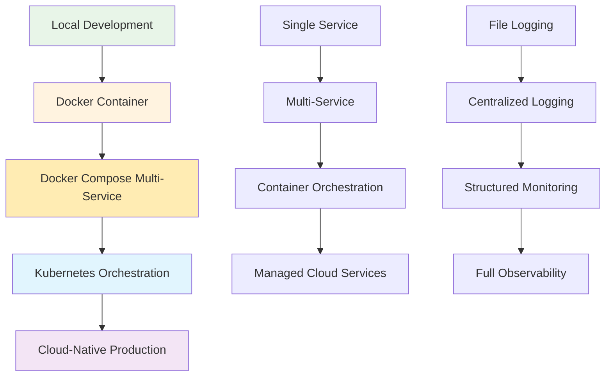

# Infrastructure Documentation
## Node.js Tutorial Application Infrastructure Guide

### Table of Contents
1. [Introduction](#introduction)
2. [Architecture Overview](#architecture-overview)
3. [Containerization Guide](#containerization-guide)
4. [Container Orchestration](#container-orchestration)
5. [Monitoring and Observability](#monitoring-and-observability)
6. [Cloud Infrastructure](#cloud-infrastructure)
7. [CI/CD Integration](#cicd-integration)
8. [Security Considerations](#security-considerations)
9. [Operational Procedures](#operational-procedures)
10. [Troubleshooting Guide](#troubleshooting-guide)
11. [Cost Optimization](#cost-optimization)
12. [Educational Learning Path](#educational-learning-path)

---

## Introduction

This comprehensive infrastructure documentation serves as the authoritative guide for deploying, managing, and operating the Node.js tutorial application across development, staging, and production environments. The infrastructure architecture demonstrates modern container orchestration patterns, monitoring best practices, and cloud-native deployment strategies while maintaining educational clarity.

### Key Features

- **Progressive Complexity**: Infrastructure scales from simple local development to production-grade cloud deployment
- **Educational Focus**: Clear explanations and learning objectives for each infrastructure component
- **Production Ready**: Enterprise-grade patterns with security, monitoring, and operational excellence
- **Multi-Environment Support**: Consistent deployment patterns across development, staging, and production
- **Observability by Design**: Comprehensive monitoring, logging, and metrics collection
- **Security First**: Container hardening, network policies, and access control implementation

### Infrastructure Components

| Component | Technology | Environment | Purpose |
|-----------|------------|-------------|---------|
| Application Runtime | Node.js 22.x LTS | All | JavaScript execution environment |
| Web Framework | Express.js 5.1.0 | All | HTTP server and API framework |
| Containerization | Docker | All | Application packaging and deployment |
| Local Orchestration | Docker Compose | Dev/Staging | Multi-service development environment |
| Production Orchestration | Kubernetes (GKE) | Production | Container orchestration and scaling |
| Monitoring | Prometheus + Grafana | All | Metrics collection and visualization |
| Infrastructure as Code | Terraform | Production | Cloud resource provisioning |
| CI/CD Platform | GitHub Actions | All | Automated testing and deployment |
| Cloud Provider | Google Cloud Platform | Production | Managed infrastructure services |

---

## Architecture Overview

### Deployment Tiers

The infrastructure follows a tiered deployment approach that progresses from simple local development to sophisticated production deployment:

#### Development Environment
- **Purpose**: Local development with hot reload and debugging capabilities
- **Architecture**: Single Docker container or direct Node.js execution
- **Components**: 
  - Node.js application container with development dependencies
  - Volume mounts for live code updates
  - Debug port exposure for IDE integration
  - Local file-based logging

#### Staging Environment  
- **Purpose**: Integration testing and deployment validation
- **Architecture**: Multi-service Docker Compose orchestration
- **Components**:
  - Load-balanced Node.js application replicas (2 instances)
  - Nginx reverse proxy with SSL termination
  - Redis cache for session storage and performance
  - Prometheus monitoring with basic alerting
  - Centralized logging with log aggregation

#### Production Environment
- **Purpose**: High-availability, scalable deployment with full observability
- **Architecture**: Kubernetes cluster with cloud-native services
- **Components**:
  - Auto-scaling Node.js deployment (3+ replicas)
  - Google Cloud Load Balancer with global SSL
  - Managed Redis (Cloud Memorystore)
  - Comprehensive monitoring with Prometheus + Grafana
  - Centralized logging with Cloud Logging
  - Infrastructure as Code with Terraform

### Infrastructure Progression Diagram



---

## Containerization Guide

### Docker Fundamentals

The application uses multi-stage Docker builds for optimized production images with security hardening and performance optimization.

#### Base Image Strategy

**Development Image (node:22-slim)**
```dockerfile
FROM node:22-slim
# Full development tools and debugging capabilities
# Size: ~70MB
# Use case: Local development with debugging tools
```

**Production Image (node:22-alpine)**
```dockerfile
FROM node:22-alpine
# Minimal production runtime with security optimizations
# Size: ~40MB  
# Use case: Production deployment with minimal attack surface
```

#### Multi-Stage Build Implementation

The Dockerfile implements multi-stage builds for optimal production deployment:

```dockerfile
# Build stage - Full development environment
FROM node:22-alpine AS builder
WORKDIR /usr/src/app
COPY package*.json ./
RUN npm ci --only=production && npm cache clean --force

# Production stage - Minimal runtime
FROM node:22-alpine AS production
RUN addgroup -g 1001 -S nodejs && \
    adduser -S nodejs -u 1001
WORKDIR /usr/src/app
COPY --from=builder --chown=nodejs:nodejs /usr/src/app/node_modules ./node_modules
COPY --chown=nodejs:nodejs . .
USER nodejs
EXPOSE 3000
CMD ["node", "src/server.js"]
```

#### Security Hardening

**Non-Root User Execution**
- Application runs as `nodejs` user (UID 1001)
- No privileged access or sudo capabilities
- Read-only filesystem mounting where possible

**Vulnerability Scanning**
- Automated security scanning with Snyk
- Base image updates for security patches
- Dependency vulnerability monitoring

**Attack Surface Reduction**
- Alpine Linux base for minimal package footprint
- No unnecessary development tools in production images
- Disabled package manager caches

### Docker Compose Orchestration

The staging environment uses Docker Compose to orchestrate multiple services with production-like architecture.

#### Service Architecture

**Application Services (from docker-compose.yml):**

```yaml
services:
  # Node.js Application with Load Balancing
  nodejs-tutorial-app:
    build: 
      context: ../../src/backend
      dockerfile: Dockerfile
    networks:
      - backend-network
      - frontend-network
    environment:
      - NODE_ENV=staging
      - REDIS_URL=redis://redis-cache:6379
    healthcheck:
      test: ["CMD", "curl", "-f", "http://localhost:3000/health"]
      interval: 30s
      timeout: 10s
      retries: 3
      start_period: 40s
    deploy:
      replicas: 2
    restart: unless-stopped

  # Nginx Reverse Proxy and Load Balancer  
  nginx-proxy:
    image: nginx:1.25-alpine
    ports:
      - "80:80"
      - "443:443"
    networks:
      - frontend-network
    volumes:
      - ./nginx/nginx.conf:/etc/nginx/nginx.conf:ro
      - ./nginx/ssl:/etc/ssl/certs:ro
      - nginx-logs:/var/log/nginx
    depends_on:
      - nodejs-tutorial-app

  # Redis Cache for Session Storage
  redis-cache:
    image: redis:7.2-alpine
    networks:
      - backend-network
    volumes:
      - redis-data:/data
      - redis-logs:/var/log/redis
    command: redis-server --appendonly yes --maxmemory 256mb
```

#### Networking Strategy

**Frontend Network**
- Public-facing network for client traffic
- Nginx proxy and load balancer access
- SSL termination and security headers

**Backend Network**  
- Internal service-to-service communication
- Database and cache access
- Application internal APIs

#### Volume Management

**Persistent Volumes:**
- `redis-data`: Redis cache persistence for session continuity
- `nginx-logs`: Web server access and error logs
- `app-logs`: Application logs with rotation

**Volume Backup Strategy:**
- Automated daily backups to cloud storage
- Point-in-time recovery for critical data
- Cross-region replication for disaster recovery

### Container Operations

#### Environment Management

**Development Environment**
```bash
# Start development environment with hot reload
docker-compose -f docker-compose.dev.yml up

# Development features:
# - Volume mounts for live code updates  
# - Debug port exposure (9229)
# - Development dependencies included
# - Verbose logging enabled
```

**Staging Environment**
```bash  
# Start staging environment with production simulation
docker-compose -f docker-compose.yml up -d

# Staging features:
# - Load balancing with 2 app replicas
# - Nginx reverse proxy with SSL
# - Redis cache integration
# - Production-like monitoring
```

**Production Environment**
```bash
# Production deployment with optimizations
docker-compose -f docker-compose.prod.yml up -d

# Production features:
# - Resource limits and health checks
# - Security policies and non-root execution  
# - Comprehensive monitoring and alerting
# - Backup and disaster recovery
```

#### Performance Optimization

**Resource Management**
```yaml
deploy:
  resources:
    limits:
      cpus: '2.0'
      memory: 1G
    reservations:
      cpus: '0.5'  
      memory: 512M
```

**Health Check Configuration**
```yaml
healthcheck:
  test: ["CMD", "curl", "-f", "http://localhost:3000/health"]
  interval: 30s
  timeout: 10s
  retries: 3
  start_period: 40s
```

---

## Container Orchestration

### Kubernetes Production Deployment

The production environment uses Google Kubernetes Engine (GKE) for enterprise-grade container orchestration with high availability, auto-scaling, and comprehensive monitoring.

#### GKE Cluster Configuration

**Cluster Specifications:**
- **Node Pools**: Auto-scaling node pools (1-10 nodes)
- **Instance Type**: e2-medium instances (2 vCPU, 4GB RAM)
- **Networking**: VPC-native cluster with private nodes
- **Security**: Workload Identity, network policies, pod security standards

#### Application Deployment

**Deployment Resource (from deployment.yml):**

```yaml
apiVersion: apps/v1
kind: Deployment
metadata:
  name: nodejs-tutorial-app
  namespace: nodejs-tutorial
  labels:
    app: nodejs-tutorial-app
    version: "1.0.0"
    environment: production
spec:
  replicas: 3
  strategy:
    type: RollingUpdate
    rollingUpdate:
      maxSurge: 1
      maxUnavailable: 1
  selector:
    matchLabels:
      app: nodejs-tutorial-app
  template:
    metadata:
      labels:
        app: nodejs-tutorial-app
    spec:
      serviceAccountName: nodejs-tutorial-sa
      securityContext:
        runAsNonRoot: true
        runAsUser: 1001
        fsGroup: 1001
      containers:
      - name: nodejs-tutorial-app
        image: gcr.io/PROJECT_ID/nodejs-tutorial-app:latest
        ports:
        - containerPort: 3000
          name: http
        env:
        - name: NODE_ENV
          value: "production"
        - name: PORT
          value: "3000"
        resources:
          requests:
            memory: "512Mi"
            cpu: "500m"
          limits:
            memory: "1Gi" 
            cpu: "1000m"
        securityContext:
          allowPrivilegeEscalation: false
          runAsNonRoot: true
          runAsUser: 1001
          readOnlyRootFilesystem: true
          capabilities:
            drop:
            - ALL
        livenessProbe:
          httpGet:
            path: /livez
            port: http
          initialDelaySeconds: 30
          periodSeconds: 10
          timeoutSeconds: 5
          failureThreshold: 3
        readinessProbe:
          httpGet:
            path: /readyz  
            port: http
          initialDelaySeconds: 5
          periodSeconds: 5
          timeoutSeconds: 3
          failureThreshold: 3
        startupProbe:
          httpGet:
            path: /health
            port: http
          initialDelaySeconds: 10
          periodSeconds: 10
          timeoutSeconds: 5
          failureThreshold: 30
```

#### Service Discovery and Load Balancing

**Service Configuration:**
```yaml
apiVersion: v1
kind: Service
metadata:
  name: nodejs-tutorial-service
  namespace: nodejs-tutorial
spec:
  selector:
    app: nodejs-tutorial-app
  ports:
  - name: http
    port: 80
    targetPort: 3000
    protocol: TCP
  type: ClusterIP
```

**Ingress Configuration:**
```yaml
apiVersion: networking.k8s.io/v1
kind: Ingress
metadata:
  name: nodejs-tutorial-ingress
  namespace: nodejs-tutorial
  annotations:
    kubernetes.io/ingress.class: "gce"
    kubernetes.io/ingress.global-static-ip-name: "tutorial-ip"
    ingress.gcp.kubernetes.io/managed-certificates: "tutorial-ssl"
spec:
  rules:
  - host: tutorial.example.com
    http:
      paths:
      - path: /*
        pathType: ImplementationSpecific
        backend:
          service:
            name: nodejs-tutorial-service
            port:
              number: 80
```

#### Auto-Scaling Configuration

**Horizontal Pod Autoscaler:**
```yaml
apiVersion: autoscaling/v2
kind: HorizontalPodAutoscaler
metadata:
  name: nodejs-tutorial-hpa
  namespace: nodejs-tutorial
spec:
  scaleTargetRef:
    apiVersion: apps/v1
    kind: Deployment
    name: nodejs-tutorial-app
  minReplicas: 3
  maxReplicas: 10
  metrics:
  - type: Resource
    resource:
      name: cpu
      target:
        type: Utilization
        averageUtilization: 70
  - type: Resource
    resource:
      name: memory
      target:
        type: Utilization
        averageUtilization: 80
```

#### Health Checks and Monitoring

The application implements comprehensive health checks for Kubernetes orchestration:

**Health Endpoints (from app.js):**
- `/health` - General application health status
- `/livez` - Liveness probe for pod restart decisions  
- `/readyz` - Readiness probe for service endpoint inclusion

**Health Check Implementation:**
- **Startup Probe**: 30-second window for application initialization
- **Liveness Probe**: 10-second intervals for pod health monitoring
- **Readiness Probe**: 5-second intervals for traffic routing decisions

---

## Monitoring and Observability

### Prometheus Metrics Collection

The monitoring infrastructure uses Prometheus for metrics collection with comprehensive service discovery and alerting capabilities.

#### Prometheus Configuration

**Core Scrape Configuration (from prometheus.yml):**

```yaml
global:
  scrape_interval: 15s
  evaluation_interval: 15s
  external_labels:
    cluster: 'nodejs-tutorial-cluster'
    environment: 'production'

rule_files:
  - "alerts/*.yml"

alerting:
  alertmanagers:
    - static_configs:
        - targets:
          - alertmanager:9093

scrape_configs:
  # Application Metrics Collection
  - job_name: 'nodejs-tutorial-app'
    static_configs:
      - targets: ['nodejs-tutorial-app:3000']
    metrics_path: '/metrics'
    scrape_interval: 5s
    scrape_timeout: 5s
    params:
      format: ['prometheus']

  # Health Check Monitoring  
  - job_name: 'nodejs-tutorial-health'
    static_configs:
      - targets: ['nodejs-tutorial-app:3000']
    metrics_path: '/health'
    scrape_interval: 10s
    scrape_timeout: 3s

  # Kubernetes Probes Monitoring
  - job_name: 'nodejs-tutorial-probes'
    static_configs:
      - targets: ['nodejs-tutorial-app:3000']
    metrics_path: '/livez'
    scrape_interval: 10s

  - job_name: 'nodejs-tutorial-readiness'
    static_configs:
      - targets: ['nodejs-tutorial-app:3000']  
    metrics_path: '/readyz'
    scrape_interval: 10s

  # System Metrics Collection
  - job_name: 'node-exporter'
    static_configs:
      - targets: ['node-exporter:9100']
    scrape_interval: 30s

  # Prometheus Self-Monitoring
  - job_name: 'prometheus'
    static_configs:
      - targets: ['localhost:9090']
    scrape_interval: 30s
```

#### Application Metrics Implementation

**Metrics Integration (from metrics.js):**

The application exposes comprehensive metrics for monitoring:

```javascript
// System Metrics Collection
function getSystemMetrics() {
    return {
        timestamp: Date.now(),
        cpu: {
            count: os.cpus().length,
            usage: process.cpuUsage(),
            loadAverage: os.loadavg()
        },
        memory: {
            process: process.memoryUsage(),
            system: {
                total: os.totalmem(),
                free: os.freemem(),
                used: os.totalmem() - os.freemem()
            }
        },
        v8: v8.getHeapStatistics(),
        uptime: calculateUptime()
    };
}

// Health Metrics for Kubernetes Integration  
function getHealthMetrics() {
    return {
        status: 'healthy',
        uptime: calculateUptime(),
        resources: {
            memory: {
                processRssHealthy: memoryUsage.rss < memoryThresholds.processRssLimit,
                heapUtilizationHealthy: heapUtilization < 85,
                systemMemoryHealthy: systemUtilization < 90
            },
            cpu: {
                usageHealthy: cpuUsage < 80,
                loadHealthy: loadAverage[0] < 2.0
            }
        },
        performance: {
            averageResponseTime: calculateAverageResponseTime(),
            errorRate: calculateErrorRate(),
            requestsPerSecond: calculateThroughput()
        }
    };
}
```

#### Alerting Rules Configuration

**Critical Application Alerts:**
```yaml
groups:
- name: nodejs-tutorial-alerts
  rules:
  - alert: ApplicationDown
    expr: up{job="nodejs-tutorial-app"} == 0
    for: 1m
    labels:
      severity: critical
    annotations:
      summary: "Node.js tutorial application is down"
      
  - alert: HighErrorRate
    expr: rate(http_requests_total{status=~"5.."}[5m]) > 0.1
    for: 5m
    labels:
      severity: warning
    annotations:
      summary: "High error rate detected"
      
  - alert: HighMemoryUsage  
    expr: process_resident_memory_bytes > 100000000
    for: 10m
    labels:
      severity: warning
    annotations:
      summary: "High memory usage detected"
```

### Grafana Dashboards

**Application Performance Dashboard:**
- HTTP request metrics with response time percentiles
- Error rate tracking with status code distribution
- Memory usage trends with leak detection
- CPU utilization and load average monitoring

**Infrastructure Dashboard:**
- Kubernetes cluster resource utilization
- Pod health and availability metrics  
- Network traffic and latency monitoring
- Storage utilization and I/O performance

### Request Lifecycle Monitoring

**Request Tracking (from metrics.js):**
```javascript
// High-precision request timing
function startRequestTracking(requestId, requestMetadata) {
    const startTime = performance.now();
    REQUEST_METRICS.set(requestId, {
        startTime: startTime,
        method: requestMetadata.method,
        path: requestMetadata.path,
        clientIp: requestMetadata.ip
    });
    PERFORMANCE_COUNTERS.requests++;
}

function stopRequestTracking(requestId, statusCode, responseSize) {
    const endTime = performance.now();
    const requestData = REQUEST_METRICS.get(requestId);
    const responseTime = endTime - requestData.startTime;
    
    PERFORMANCE_COUNTERS.responses++;
    PERFORMANCE_COUNTERS.totalResponseTime += responseTime;
    
    if (statusCode >= 400) {
        PERFORMANCE_COUNTERS.errors++;
    }
    
    REQUEST_METRICS.delete(requestId);
    return { responseTime, statusCode, requestId };
}
```

---

## Cloud Infrastructure

### Terraform Infrastructure as Code

The production environment uses Terraform for infrastructure provisioning and management on Google Cloud Platform.

#### Core Infrastructure Components

**Main Terraform Configuration (from main.tf):**

```hcl
# Google Cloud Provider Configuration
terraform {
  required_version = ">= 1.5"
  required_providers {
    google = {
      source  = "hashicorp/google"
      version = "~> 5.0"
    }
  }
  backend "gcs" {
    bucket = "nodejs-tutorial-terraform-state"
    prefix = "terraform/state"
  }
}

provider "google" {
  project = var.project_id
  region  = var.region
  zone    = var.zone
}

# VPC Network Configuration
resource "google_compute_network" "tutorial_vpc" {
  name                    = "nodejs-tutorial-vpc"
  auto_create_subnetworks = false
  mtu                     = 1460
  routing_mode           = "REGIONAL"
}

resource "google_compute_subnetwork" "tutorial_subnet" {
  name          = "nodejs-tutorial-subnet"
  ip_cidr_range = "10.0.0.0/24"
  region        = var.region
  network       = google_compute_network.tutorial_vpc.id
  
  secondary_ip_range {
    range_name    = "tutorial-pod-range"
    ip_cidr_range = "10.1.0.0/16"
  }
  
  secondary_ip_range {
    range_name    = "tutorial-service-range"  
    ip_cidr_range = "10.2.0.0/20"
  }
}

# NAT Gateway for Private Node Internet Access
resource "google_compute_router" "tutorial_router" {
  name    = "nodejs-tutorial-router"
  region  = var.region
  network = google_compute_network.tutorial_vpc.id
}

resource "google_compute_router_nat" "tutorial_nat" {
  name                               = "nodejs-tutorial-nat"
  router                            = google_compute_router.tutorial_router.name
  region                            = var.region
  nat_ip_allocate_option            = "AUTO_ONLY"
  source_subnetwork_ip_ranges_to_nat = "ALL_SUBNETWORKS_ALL_IP_RANGES"

  log_config {
    enable = true
    filter = "ERRORS_ONLY"
  }
}

# GKE Cluster Configuration
resource "google_container_cluster" "tutorial_cluster" {
  name     = "nodejs-tutorial-cluster"
  location = var.region
  
  # Network Configuration
  network    = google_compute_network.tutorial_vpc.name
  subnetwork = google_compute_subnetwork.tutorial_subnet.name
  
  # Private Cluster Configuration
  private_cluster_config {
    enable_private_nodes    = true
    enable_private_endpoint = false
    master_ipv4_cidr_block = "172.16.0.0/28"
  }
  
  # IP Allocation Policy
  ip_allocation_policy {
    cluster_secondary_range_name  = "tutorial-pod-range"
    services_secondary_range_name = "tutorial-service-range"
  }
  
  # Network Policy
  network_policy {
    enabled = true
  }
  
  # Workload Identity
  workload_identity_config {
    workload_pool = "${var.project_id}.svc.id.goog"
  }
  
  # Remove default node pool
  remove_default_node_pool = true
  initial_node_count       = 1
  
  # Master Auth Configuration
  master_auth {
    client_certificate_config {
      issue_client_certificate = false
    }
  }
}

# GKE Node Pool
resource "google_container_node_pool" "tutorial_nodes" {
  name       = "nodejs-tutorial-nodes"
  location   = var.region
  cluster    = google_container_cluster.tutorial_cluster.name
  node_count = var.node_count
  
  # Auto-scaling Configuration
  autoscaling {
    min_node_count = var.min_node_count
    max_node_count = var.max_node_count
  }
  
  # Node Configuration
  node_config {
    preemptible  = var.use_preemptible_nodes
    machine_type = var.node_machine_type
    disk_size_gb = var.node_disk_size
    disk_type    = "pd-ssd"
    
    # Security Configuration
    service_account = google_service_account.gke_node_sa.email
    oauth_scopes = [
      "https://www.googleapis.com/auth/cloud-platform"
    ]
    
    # Workload Identity
    workload_metadata_config {
      mode = "GKE_METADATA"
    }
    
    # Labels and Taints
    labels = {
      environment = var.environment
      application = "nodejs-tutorial"
    }
    
    tags = ["nodejs-tutorial-node"]
  }
  
  # Node Management
  management {
    auto_repair  = true
    auto_upgrade = true
  }
}

# Static IP for Ingress
resource "google_compute_global_address" "tutorial_ip" {
  name = "nodejs-tutorial-ip"
}

# IAM Service Account for GKE Nodes
resource "google_service_account" "gke_node_sa" {
  account_id   = "nodejs-tutorial-gke-node"
  display_name = "GKE Node Service Account"
  description  = "Service account for GKE nodes"
}

resource "google_project_iam_member" "gke_node_sa_roles" {
  for_each = toset([
    "roles/logging.logWriter",
    "roles/monitoring.metricWriter", 
    "roles/monitoring.viewer",
    "roles/stackdriver.resourceMetadata.writer"
  ])
  
  project = var.project_id
  role    = each.value
  member  = "serviceAccount:${google_service_account.gke_node_sa.email}"
}

# Workload Identity Service Account
resource "google_service_account" "workload_identity_sa" {
  account_id   = "nodejs-tutorial-workload"
  display_name = "Workload Identity Service Account"
  description  = "Service account for application workloads"
}

resource "google_service_account_iam_member" "workload_identity_binding" {
  service_account_id = google_service_account.workload_identity_sa.name
  role               = "roles/iam.workloadIdentityUser"
  member             = "serviceAccount:${var.project_id}.svc.id.goog[nodejs-tutorial/nodejs-tutorial-sa]"
}

# Firewall Rules
resource "google_compute_firewall" "tutorial_ingress" {
  name    = "nodejs-tutorial-ingress"
  network = google_compute_network.tutorial_vpc.name
  
  allow {
    protocol = "tcp"
    ports    = ["80", "443"]
  }
  
  source_ranges = ["0.0.0.0/0"]
  target_tags   = ["nodejs-tutorial-ingress"]
}

# Cloud Monitoring Dashboard
resource "google_monitoring_dashboard" "tutorial_dashboard" {
  dashboard_json = jsonencode({
    displayName = "Node.js Tutorial Application"
    mosaicLayout = {
      tiles = [
        {
          width = 6
          height = 4
          widget = {
            title = "HTTP Requests"
            xyChart = {
              dataSets = [
                {
                  timeSeriesQuery = {
                    timeSeriesFilter = {
                      filter = "resource.type=\"gke_container\""
                      aggregation = {
                        alignmentPeriod = "60s"
                        perSeriesAligner = "ALIGN_RATE"
                      }
                    }
                  }
                  plotType = "LINE"
                }
              ]
            }
          }
        }
      ]
    }
  })
}
```

#### Terraform Variables and Configuration

**Variables Configuration (variables.tf):**
```hcl
variable "project_id" {
  description = "The GCP project ID"
  type        = string
}

variable "region" {
  description = "The GCP region"
  type        = string
  default     = "us-central1"
}

variable "zone" {
  description = "The GCP zone"
  type        = string  
  default     = "us-central1-a"
}

variable "node_count" {
  description = "Number of nodes in the GKE cluster"
  type        = number
  default     = 2
}

variable "min_node_count" {
  description = "Minimum number of nodes for auto-scaling"
  type        = number
  default     = 1
}

variable "max_node_count" {
  description = "Maximum number of nodes for auto-scaling"
  type        = number
  default     = 5
}

variable "node_machine_type" {
  description = "Machine type for GKE nodes"
  type        = string
  default     = "e2-medium"
}

variable "use_preemptible_nodes" {
  description = "Use preemptible nodes for cost optimization"
  type        = bool
  default     = true
}

variable "environment" {
  description = "Environment name"
  type        = string
  default     = "production"
}
```

### Infrastructure Provisioning Workflow

**Deployment Process:**
```bash
# Initialize Terraform
terraform init

# Plan infrastructure changes
terraform plan -var-file="production.tfvars"

# Apply infrastructure changes
terraform apply -var-file="production.tfvars"

# Verify deployment
kubectl get nodes
kubectl get pods -n nodejs-tutorial
```

---

## CI/CD Integration

### GitHub Actions Workflows

The CI/CD pipeline uses GitHub Actions for automated testing, building, and deployment with comprehensive quality gates and security scanning.

#### Build and Test Pipeline

**Main Workflow (.github/workflows/ci.yml):**
```yaml
name: CI/CD Pipeline

on:
  push:
    branches: [main, develop]
  pull_request:
    branches: [main]

jobs:
  test:
    runs-on: ubuntu-22.04
    strategy:
      matrix:
        node-version: [22.x]
    
    steps:
    - name: Checkout code
      uses: actions/checkout@v4
      
    - name: Setup Node.js
      uses: actions/setup-node@v4
      with:
        node-version: ${{ matrix.node-version }}
        cache: 'npm'
        cache-dependency-path: src/backend/package-lock.json
        
    - name: Install dependencies
      run: |
        cd src/backend
        npm ci --prefer-offline --no-audit
        
    - name: Run linting
      run: |
        cd src/backend
        npm run lint
        
    - name: Run unit tests
      run: |
        cd src/backend
        npm test -- --coverage --watchAll=false
        
    - name: Run integration tests  
      run: |
        cd src/backend
        npm run test:integration
        
    - name: Upload coverage reports
      uses: codecov/codecov-action@v3
      with:
        files: src/backend/coverage/lcov.info
        fail_ci_if_error: true

  security-scan:
    runs-on: ubuntu-22.04
    needs: test
    
    steps:
    - name: Checkout code
      uses: actions/checkout@v4
      
    - name: Run security audit
      run: |
        cd src/backend
        npm audit --audit-level high
        
    - name: Run Snyk security scan
      uses: snyk/actions/node@master
      env:
        SNYK_TOKEN: ${{ secrets.SNYK_TOKEN }}
      with:
        args: --severity-threshold=high
        command: test

  build-docker:
    runs-on: ubuntu-22.04
    needs: [test, security-scan]
    if: github.ref == 'refs/heads/main'
    
    steps:
    - name: Checkout code
      uses: actions/checkout@v4
      
    - name: Set up Docker Buildx
      uses: docker/setup-buildx-action@v3
      
    - name: Login to Google Container Registry
      uses: docker/login-action@v3
      with:
        registry: gcr.io
        username: _json_key
        password: ${{ secrets.GCP_SA_KEY }}
        
    - name: Build and push Docker image
      uses: docker/build-push-action@v5
      with:
        context: src/backend
        push: true
        tags: |
          gcr.io/${{ secrets.GCP_PROJECT_ID }}/nodejs-tutorial-app:latest
          gcr.io/${{ secrets.GCP_PROJECT_ID }}/nodejs-tutorial-app:${{ github.sha }}
        cache-from: type=gha
        cache-to: type=gha,mode=max
        
    - name: Run Docker security scan
      uses: aquasecurity/trivy-action@master
      with:
        image-ref: gcr.io/${{ secrets.GCP_PROJECT_ID }}/nodejs-tutorial-app:latest
        format: 'sarif'
        output: 'trivy-results.sarif'
        
    - name: Upload security scan results
      uses: github/codeql-action/upload-sarif@v2
      with:
        sarif_file: 'trivy-results.sarif'

  deploy-staging:
    runs-on: ubuntu-22.04
    needs: build-docker
    environment: staging
    
    steps:
    - name: Checkout code
      uses: actions/checkout@v4
      
    - name: Deploy to staging
      run: |
        docker-compose -f infrastructure/docker/docker-compose.yml up -d
        
    - name: Run health checks
      run: |
        sleep 30
        curl -f http://localhost/health || exit 1
        
    - name: Run smoke tests
      run: |
        cd src/backend
        npm run test:e2e:staging

  deploy-production:
    runs-on: ubuntu-22.04
    needs: deploy-staging
    environment: production
    if: github.ref == 'refs/heads/main'
    
    steps:
    - name: Checkout code
      uses: actions/checkout@v4
      
    - name: Setup Google Cloud SDK
      uses: google-github-actions/setup-gcloud@v1
      with:
        service_account_key: ${{ secrets.GCP_SA_KEY }}
        project_id: ${{ secrets.GCP_PROJECT_ID }}
        
    - name: Configure kubectl
      run: |
        gcloud container clusters get-credentials nodejs-tutorial-cluster \
          --region us-central1 --project ${{ secrets.GCP_PROJECT_ID }}
          
    - name: Deploy to Kubernetes
      run: |
        kubectl set image deployment/nodejs-tutorial-app \
          nodejs-tutorial-app=gcr.io/${{ secrets.GCP_PROJECT_ID }}/nodejs-tutorial-app:${{ github.sha }} \
          -n nodejs-tutorial
          
        kubectl rollout status deployment/nodejs-tutorial-app -n nodejs-tutorial --timeout=300s
        
    - name: Verify deployment
      run: |
        kubectl get pods -n nodejs-tutorial
        kubectl get service -n nodejs-tutorial
        
    - name: Run production health checks
      run: |
        EXTERNAL_IP=$(kubectl get service nodejs-tutorial-service -n nodejs-tutorial -o jsonpath='{.status.loadBalancer.ingress[0].ip}')
        curl -f http://${EXTERNAL_IP}/health || exit 1
        
    - name: Run production smoke tests
      run: |
        cd src/backend
        ENDPOINT="http://${EXTERNAL_IP}" npm run test:e2e:production
```

#### Quality Gates and Security

**Automated Quality Checks:**
- **Unit Tests**: 95% minimum code coverage requirement
- **Integration Tests**: API endpoint functionality verification
- **Security Scanning**: Dependency vulnerability detection with Snyk
- **Container Security**: Docker image vulnerability scanning with Trivy
- **Code Quality**: ESLint rules enforcement with zero errors policy

**Deployment Approval Process:**
- **Staging**: Automatic deployment for integration testing
- **Production**: Manual approval required for release deployment
- **Rollback**: Automatic rollback on health check failures

---

## Security Considerations

### Container Security Hardening

#### Runtime Security

**Non-Root Execution:**
```dockerfile
# Create dedicated user for application
RUN addgroup -g 1001 -S nodejs && \
    adduser -S nodejs -u 1001

# Run application as non-root user  
USER nodejs
```

**Read-Only Root Filesystem:**
```yaml
securityContext:
  readOnlyRootFilesystem: true
  allowPrivilegeEscalation: false
  capabilities:
    drop:
    - ALL
```

**Resource Limits:**
```yaml
resources:
  limits:
    memory: "1Gi"
    cpu: "1000m"
  requests:
    memory: "512Mi"
    cpu: "500m"
```

### Network Security

#### Kubernetes Network Policies

**Pod-to-Pod Communication Control:**
```yaml
apiVersion: networking.k8s.io/v1
kind: NetworkPolicy
metadata:
  name: nodejs-tutorial-netpol
  namespace: nodejs-tutorial
spec:
  podSelector:
    matchLabels:
      app: nodejs-tutorial-app
  policyTypes:
  - Ingress
  - Egress
  ingress:
  - from:
    - namespaceSelector:
        matchLabels:
          name: ingress-nginx
    ports:
    - protocol: TCP
      port: 3000
  egress:
  - to: []
    ports:
    - protocol: TCP
      port: 443  # HTTPS outbound
    - protocol: TCP
      port: 53   # DNS
    - protocol: UDP
      port: 53   # DNS
```

#### Ingress Security

**SSL/TLS Configuration:**
```yaml
apiVersion: networking.k8s.io/v1
kind: Ingress
metadata:
  name: nodejs-tutorial-ingress
  annotations:
    kubernetes.io/ingress.class: "gce"
    ingress.gcp.kubernetes.io/managed-certificates: "tutorial-ssl"
    kubernetes.io/ingress.allow-http: "false"
spec:
  tls:
  - hosts:
    - tutorial.example.com
    secretName: tutorial-tls
  rules:
  - host: tutorial.example.com
    http:
      paths:
      - path: /*
        pathType: ImplementationSpecific
        backend:
          service:
            name: nodejs-tutorial-service
            port:
              number: 80
```

### Access Control

#### RBAC Configuration

**Service Account and Role Binding:**
```yaml
apiVersion: v1
kind: ServiceAccount
metadata:
  name: nodejs-tutorial-sa
  namespace: nodejs-tutorial
  annotations:
    iam.gke.io/gcp-service-account: nodejs-tutorial-workload@PROJECT_ID.iam.gserviceaccount.com

---
apiVersion: rbac.authorization.k8s.io/v1
kind: Role
metadata:
  namespace: nodejs-tutorial
  name: nodejs-tutorial-role
rules:
- apiGroups: [""]
  resources: ["configmaps", "secrets"]
  verbs: ["get", "list"]

---
apiVersion: rbac.authorization.k8s.io/v1
kind: RoleBinding
metadata:
  name: nodejs-tutorial-binding
  namespace: nodejs-tutorial
subjects:
- kind: ServiceAccount
  name: nodejs-tutorial-sa
  namespace: nodejs-tutorial
roleRef:
  kind: Role
  name: nodejs-tutorial-role
  apiGroup: rbac.authorization.k8s.io
```

### Secrets Management

#### Google Cloud Secret Manager Integration

**Secret Creation and Access:**
```bash
# Create secret in Google Secret Manager
gcloud secrets create nodejs-tutorial-config \
  --data-file=config.json

# Grant access to Workload Identity service account
gcloud secrets add-iam-policy-binding nodejs-tutorial-config \
  --member="serviceAccount:nodejs-tutorial-workload@PROJECT_ID.iam.gserviceaccount.com" \
  --role="roles/secretmanager.secretAccessor"
```

**Application Secret Usage:**
```yaml
apiVersion: v1
kind: Secret
metadata:
  name: nodejs-tutorial-secrets
  namespace: nodejs-tutorial
type: Opaque
data:
  config.json: <base64-encoded-config>

---
# Pod specification with secret volume mount
spec:
  containers:
  - name: nodejs-tutorial-app
    volumeMounts:
    - name: secret-volume
      mountPath: "/etc/secrets"
      readOnly: true
  volumes:
  - name: secret-volume
    secret:
      secretName: nodejs-tutorial-secrets
```

---

## Operational Procedures

### Deployment Procedures

#### Environment Provisioning

**Infrastructure Deployment:**
```bash
# 1. Initialize Terraform workspace
cd infrastructure/deployment/terraform
terraform init
terraform workspace select production

# 2. Plan and apply infrastructure
terraform plan -var-file="production.tfvars"
terraform apply -var-file="production.tfvars"

# 3. Configure kubectl context
gcloud container clusters get-credentials nodejs-tutorial-cluster \
  --region us-central1 --project PROJECT_ID

# 4. Create namespace and apply manifests
kubectl create namespace nodejs-tutorial
kubectl apply -f infrastructure/deployment/kubernetes/
```

**Application Deployment:**
```bash
# 1. Build and push container image
docker build -t gcr.io/PROJECT_ID/nodejs-tutorial-app:v1.0.0 src/backend/
docker push gcr.io/PROJECT_ID/nodejs-tutorial-app:v1.0.0

# 2. Deploy application
kubectl set image deployment/nodejs-tutorial-app \
  nodejs-tutorial-app=gcr.io/PROJECT_ID/nodejs-tutorial-app:v1.0.0 \
  -n nodejs-tutorial

# 3. Monitor deployment rollout
kubectl rollout status deployment/nodejs-tutorial-app -n nodejs-tutorial --timeout=300s

# 4. Verify deployment health
kubectl get pods -n nodejs-tutorial
curl -f http://EXTERNAL_IP/health
```

### Monitoring Operations

#### Alert Management

**Incident Response Process:**
1. **Alert Received**: Prometheus/Grafana alert notification
2. **Initial Assessment**: Check dashboard for service status
3. **Impact Analysis**: Determine affected users and systems
4. **Mitigation Steps**: Execute runbook procedures
5. **Post-Incident Review**: Document lessons learned

**Common Alert Scenarios:**

**Application Down Alert:**
```bash
# Check pod status
kubectl get pods -n nodejs-tutorial

# Check recent events
kubectl get events -n nodejs-tutorial --sort-by='.lastTimestamp'

# Check application logs
kubectl logs -n nodejs-tutorial deployment/nodejs-tutorial-app --tail=100

# Restart deployment if necessary
kubectl rollout restart deployment/nodejs-tutorial-app -n nodejs-tutorial
```

**High Memory Usage Alert:**
```bash
# Check memory metrics
kubectl top pods -n nodejs-tutorial

# Check application memory usage
curl http://EXTERNAL_IP/metrics | grep memory

# Scale deployment if needed
kubectl scale deployment nodejs-tutorial-app --replicas=5 -n nodejs-tutorial
```

#### Performance Analysis

**Response Time Investigation:**
```bash
# Check application performance metrics
curl -s http://EXTERNAL_IP/metrics | grep -E "response_time|request_duration"

# Analyze Prometheus queries
# p95 response time: histogram_quantile(0.95, rate(http_request_duration_seconds_bucket[5m]))
# Error rate: rate(http_requests_total{status=~"5.."}[5m]) / rate(http_requests_total[5m])

# Check resource utilization
kubectl top nodes
kubectl top pods -n nodejs-tutorial --sort-by=memory
```

### Maintenance Procedures

#### Rolling Updates and Rollbacks

**Application Updates:**
```bash
# 1. Deploy new version with rolling update
kubectl set image deployment/nodejs-tutorial-app \
  nodejs-tutorial-app=gcr.io/PROJECT_ID/nodejs-tutorial-app:v1.1.0 \
  -n nodejs-tutorial

# 2. Monitor rollout progress
kubectl rollout status deployment/nodejs-tutorial-app -n nodejs-tutorial

# 3. Verify health after deployment
kubectl get pods -n nodejs-tutorial
curl -f http://EXTERNAL_IP/health

# 4. Rollback if issues detected
kubectl rollout undo deployment/nodejs-tutorial-app -n nodejs-tutorial
kubectl rollout status deployment/nodejs-tutorial-app -n nodejs-tutorial
```

**Infrastructure Updates:**
```bash
# 1. Plan Terraform changes
cd infrastructure/deployment/terraform
terraform plan -var-file="production.tfvars"

# 2. Apply infrastructure updates
terraform apply -var-file="production.tfvars"

# 3. Verify cluster health
kubectl get nodes
kubectl get pods --all-namespaces
```

#### Backup and Recovery

**Application Data Backup:**
```bash
# Export Kubernetes configurations
kubectl get all -n nodejs-tutorial -o yaml > nodejs-tutorial-backup.yaml

# Backup persistent volumes (if applicable)
kubectl get pv,pvc -n nodejs-tutorial

# Export secrets and configmaps
kubectl get secrets,configmaps -n nodejs-tutorial -o yaml > nodejs-tutorial-configs.yaml
```

**Disaster Recovery Testing:**
```bash
# 1. Create test namespace
kubectl create namespace nodejs-tutorial-dr

# 2. Apply backup configurations
kubectl apply -f nodejs-tutorial-backup.yaml -n nodejs-tutorial-dr

# 3. Verify recovery deployment
kubectl get pods -n nodejs-tutorial-dr
curl -f http://DR_EXTERNAL_IP/health

# 4. Cleanup test environment
kubectl delete namespace nodejs-tutorial-dr
```

---

## Troubleshooting Guide

### Common Issues and Solutions

#### Container Startup Failures

**Issue: Pod stuck in `ImagePullBackOff` status**
```bash
# Diagnosis
kubectl describe pod POD_NAME -n nodejs-tutorial

# Common causes and solutions:
# 1. Image doesn't exist
docker images | grep nodejs-tutorial-app
gcloud container images list --repository=gcr.io/PROJECT_ID

# 2. Authentication issues
kubectl get secrets -n nodejs-tutorial
kubectl describe secret gcr-json-key -n nodejs-tutorial

# 3. Image registry permissions
gcloud auth configure-docker
docker pull gcr.io/PROJECT_ID/nodejs-tutorial-app:latest
```

**Issue: Pod stuck in `CrashLoopBackOff` status**
```bash
# Check application logs
kubectl logs POD_NAME -n nodejs-tutorial --previous

# Common solutions:
# 1. Fix application startup errors
# 2. Adjust resource limits
# 3. Update health check configuration
# 4. Check environment variables and secrets
```

#### Networking Problems

**Issue: Service not accessible externally**
```bash
# Check service configuration
kubectl get svc -n nodejs-tutorial
kubectl describe svc nodejs-tutorial-service -n nodejs-tutorial

# Check ingress configuration
kubectl get ingress -n nodejs-tutorial
kubectl describe ingress nodejs-tutorial-ingress -n nodejs-tutorial

# Verify external IP allocation
gcloud compute addresses list

# Test internal connectivity
kubectl exec -it POD_NAME -n nodejs-tutorial -- curl localhost:3000/health
```

**Issue: Pod-to-pod communication failures**
```bash
# Check network policies
kubectl get networkpolicy -n nodejs-tutorial
kubectl describe networkpolicy nodejs-tutorial-netpol -n nodejs-tutorial

# Test DNS resolution
kubectl exec -it POD_NAME -n nodejs-tutorial -- nslookup kubernetes.default

# Check service endpoints
kubectl get endpoints -n nodejs-tutorial
```

#### Performance Issues

**Issue: High response times**
```bash
# Check application metrics
curl -s http://EXTERNAL_IP/metrics | grep response_time

# Check resource utilization
kubectl top pods -n nodejs-tutorial
kubectl top nodes

# Analyze application logs for errors
kubectl logs -n nodejs-tutorial deployment/nodejs-tutorial-app --tail=1000 | grep ERROR

# Scale deployment if needed
kubectl scale deployment nodejs-tutorial-app --replicas=5 -n nodejs-tutorial
```

**Issue: Memory leaks**
```bash
# Monitor memory usage over time
kubectl top pods -n nodejs-tutorial --sort-by=memory

# Check application memory metrics
curl -s http://EXTERNAL_IP/metrics | grep memory

# Restart pods to clear memory
kubectl rollout restart deployment/nodejs-tutorial-app -n nodejs-tutorial

# Analyze heap dumps (if available)
kubectl exec -it POD_NAME -n nodejs-tutorial -- node --inspect src/server.js
```

#### Security Issues

**Issue: Pod security policy violations**
```bash
# Check pod security context
kubectl describe pod POD_NAME -n nodejs-tutorial | grep -A 10 "Security Context"

# Verify RBAC permissions
kubectl auth can-i --list --as=system:serviceaccount:nodejs-tutorial:nodejs-tutorial-sa

# Check network policy enforcement
kubectl get networkpolicy -n nodejs-tutorial -o yaml
```

### Debugging Procedures

#### Application Debugging

**Enable Debug Mode:**
```yaml
# Add debug environment variable to deployment
spec:
  containers:
  - name: nodejs-tutorial-app
    env:
    - name: DEBUG
      value: "nodejs-tutorial:*"
    - name: LOG_LEVEL
      value: "debug"
```

**Container Debugging:**
```bash
# Access pod shell
kubectl exec -it POD_NAME -n nodejs-tutorial -- /bin/sh

# Check application processes
ps aux | grep node

# Check filesystem permissions
ls -la /usr/src/app
id

# Test application endpoints
curl localhost:3000/health
curl localhost:3000/metrics
```

#### Infrastructure Debugging

**Kubernetes Cluster Issues:**
```bash
# Check cluster status
kubectl cluster-info
kubectl get nodes -o wide

# Check system pods
kubectl get pods -n kube-system

# Check cluster events
kubectl get events --all-namespaces --sort-by='.lastTimestamp'

# Check resource quotas
kubectl describe quota -n nodejs-tutorial
kubectl describe limits -n nodejs-tutorial
```

**Terraform State Issues:**
```bash
# Check Terraform state
cd infrastructure/deployment/terraform
terraform state list
terraform state show google_container_cluster.tutorial_cluster

# Refresh state
terraform refresh -var-file="production.tfvars"

# Import existing resources if needed
terraform import google_container_cluster.tutorial_cluster nodejs-tutorial-cluster
```

---

## Cost Optimization

### Resource Right-Sizing

#### Node Pool Optimization

**Preemptible Instances:**
```hcl
resource "google_container_node_pool" "tutorial_nodes" {
  node_config {
    preemptible  = true
    machine_type = "e2-medium"
    disk_type    = "pd-standard"
  }
  
  autoscaling {
    min_node_count = 1
    max_node_count = 5
  }
}
```

**Cost Comparison:**
| Instance Type | vCPU | Memory | Standard Cost | Preemptible Cost | Savings |
|--------------|------|--------|---------------|------------------|---------|
| e2-medium | 2 | 4GB | $48.91/month | $14.67/month | 70% |
| e2-small | 2 | 2GB | $24.45/month | $7.34/month | 70% |
| e2-micro | 2 | 1GB | $12.23/month | $3.67/month | 70% |

#### Application Resource Tuning

**Resource Requests and Limits:**
```yaml
resources:
  requests:
    memory: "256Mi"  # Minimum required
    cpu: "250m"      # 0.25 CPU cores
  limits:
    memory: "512Mi"  # Maximum allowed
    cpu: "500m"      # 0.5 CPU cores
```

**Horizontal Pod Autoscaler (HPA):**
```yaml
apiVersion: autoscaling/v2
kind: HorizontalPodAutoscaler
metadata:
  name: nodejs-tutorial-hpa
spec:
  scaleTargetRef:
    apiVersion: apps/v1
    kind: Deployment
    name: nodejs-tutorial-app
  minReplicas: 2
  maxReplicas: 10
  metrics:
  - type: Resource
    resource:
      name: cpu
      target:
        type: Utilization
        averageUtilization: 70
  - type: Resource
    resource:
      name: memory
      target:
        type: Utilization
        averageUtilization: 80
```

### Cost Monitoring and Alerting

#### Budget Alerts

**Google Cloud Budget Configuration:**
```bash
# Create budget alert
gcloud billing budgets create \
  --billing-account=BILLING_ACCOUNT_ID \
  --display-name="Node.js Tutorial Budget" \
  --budget-amount=100 \
  --threshold-rule=percent=50,basis=current-spend \
  --threshold-rule=percent=90,basis=current-spend \
  --threshold-rule=percent=100,basis=current-spend
```

#### Cost Attribution

**Resource Labeling Strategy:**
```hcl
# Terraform resource labels
resource "google_container_cluster" "tutorial_cluster" {
  resource_labels = {
    environment = "production"
    application = "nodejs-tutorial"
    cost-center = "engineering"
    team        = "platform"
  }
}
```

**Kubernetes Labels for Cost Tracking:**
```yaml
metadata:
  labels:
    app: nodejs-tutorial-app
    version: "1.0.0"
    environment: production
    cost-center: engineering
    team: platform
```

### Storage Optimization

#### Container Image Optimization

**Multi-Stage Build for Size Reduction:**
```dockerfile
# Production image size optimization
FROM node:22-alpine AS base
RUN apk add --no-cache dumb-init

FROM base AS dependencies
WORKDIR /usr/src/app
COPY package*.json ./
RUN npm ci --only=production && npm cache clean --force

FROM base AS runtime
COPY --from=dependencies /usr/src/app/node_modules ./node_modules
COPY . .
EXPOSE 3000
USER 1001
CMD ["dumb-init", "node", "src/server.js"]
```

**Image Size Comparison:**
| Build Strategy | Size | Reduction |
|----------------|------|-----------|
| node:22 (full) | 350MB | 0% |
| node:22-slim | 70MB | 80% |
| node:22-alpine | 40MB | 88% |
| Multi-stage optimized | 35MB | 90% |

---

## Educational Learning Path

### Infrastructure Concepts Progression

#### Level 1: Container Basics
**Learning Objectives:**
- Understand containerization fundamentals with Docker
- Learn container image creation and optimization techniques
- Practice single-service containerization

**Hands-on Exercises:**
1. Create Dockerfile for Node.js application
2. Build and run container locally
3. Implement multi-stage builds for optimization
4. Add security hardening (non-root user, minimal base image)

**Key Commands:**
```bash
# Build container image
docker build -t nodejs-tutorial:v1.0.0 .

# Run container locally
docker run -p 3000:3000 --name tutorial-app nodejs-tutorial:v1.0.0

# Inspect container
docker inspect tutorial-app
docker logs tutorial-app
```

#### Level 2: Multi-Service Orchestration
**Learning Objectives:**
- Understand service composition with Docker Compose
- Learn inter-service communication and networking
- Practice persistent data management with volumes

**Hands-on Exercises:**
1. Create Docker Compose configuration for multi-service stack
2. Configure service networking and communication
3. Implement persistent volumes for data storage
4. Add load balancing with Nginx reverse proxy

**Key Commands:**
```bash
# Start multi-service stack
docker-compose up -d

# Scale application services
docker-compose up -d --scale nodejs-tutorial-app=3

# View service logs
docker-compose logs -f nodejs-tutorial-app
```

#### Level 3: Container Orchestration
**Learning Objectives:**
- Understand Kubernetes container orchestration concepts
- Learn deployment strategies and service discovery
- Practice health checks and auto-scaling

**Hands-on Exercises:**
1. Deploy application to Kubernetes cluster
2. Configure health checks (liveness, readiness, startup probes)
3. Implement horizontal pod autoscaling
4. Set up ingress for external access

**Key Commands:**
```bash
# Deploy to Kubernetes
kubectl apply -f deployment.yml

# Check deployment status
kubectl get pods,services,deployments

# Scale deployment
kubectl scale deployment nodejs-tutorial-app --replicas=5
```

#### Level 4: Infrastructure as Code
**Learning Objectives:**
- Understand infrastructure provisioning with Terraform
- Learn cloud resource management and networking
- Practice infrastructure versioning and state management

**Hands-on Exercises:**
1. Create Terraform configuration for GKE cluster
2. Provision VPC networking and security groups
3. Implement infrastructure versioning with Terraform state
4. Add monitoring and observability resources

**Key Commands:**
```bash
# Initialize Terraform
terraform init

# Plan infrastructure changes
terraform plan -var-file="production.tfvars"

# Apply infrastructure
terraform apply -var-file="production.tfvars"
```

#### Level 5: Monitoring and Observability
**Learning Objectives:**
- Understand metrics collection with Prometheus
- Learn log aggregation and analysis techniques
- Practice alerting and incident response

**Hands-on Exercises:**
1. Configure Prometheus metrics collection
2. Create Grafana dashboards for visualization
3. Set up alerting rules and notification channels
4. Implement distributed tracing (optional advanced topic)

**Key Commands:**
```bash
# Check application metrics
curl http://localhost:3000/metrics

# Query Prometheus metrics
curl 'http://prometheus:9090/api/v1/query?query=http_requests_total'

# View Grafana dashboards
open http://localhost:3001/dashboards
```

### Best Practices Demonstrated

#### Security Best Practices
1. **Container Security Hardening:**
   - Non-root user execution
   - Read-only root filesystem
   - Minimal base images (Alpine Linux)
   - Regular security scanning

2. **Network Security:**
   - Network policies for micro-segmentation
   - TLS encryption for all communications
   - Private container registries

3. **Access Control:**
   - RBAC for Kubernetes resources
   - Workload Identity for cloud integration
   - Least privilege principle enforcement

#### Operational Excellence
1. **Infrastructure as Code:**
   - Version-controlled infrastructure definitions
   - Automated provisioning and updates
   - Infrastructure testing and validation

2. **Monitoring and Observability:**
   - Comprehensive metrics collection
   - Structured logging with correlation IDs
   - Proactive alerting and incident response

3. **Deployment Automation:**
   - CI/CD pipelines with quality gates
   - Blue-green and canary deployment strategies
   - Automated rollback on failure detection

#### Performance Optimization
1. **Resource Efficiency:**
   - Right-sizing based on actual usage
   - Horizontal pod autoscaling
   - Efficient container image layers

2. **Caching Strategies:**
   - Application-level caching with Redis
   - Container image layer caching
   - Kubernetes resource caching

### Progressive Complexity Examples

#### Development → Staging → Production

**Development (Simple):**
```bash
# Run single container
docker run -p 3000:3000 nodejs-tutorial:latest
```

**Staging (Multi-service):**
```yaml
# Docker Compose with load balancing
services:
  app:
    deploy:
      replicas: 2
  nginx:
    depends_on: [app]
  redis:
    volumes: [redis-data:/data]
```

**Production (Kubernetes):**
```yaml
# Full Kubernetes deployment
apiVersion: apps/v1
kind: Deployment
spec:
  replicas: 3
  strategy:
    type: RollingUpdate
  template:
    spec:
      securityContext:
        runAsNonRoot: true
      containers:
      - name: app
        resources:
          limits: {memory: "1Gi", cpu: "1000m"}
        livenessProbe:
          httpGet: {path: /livez, port: 3000}
        readinessProbe:
          httpGet: {path: /readyz, port: 3000}
```

This comprehensive infrastructure documentation provides a complete guide for deploying, managing, and operating the Node.js tutorial application across all environments, from development to production. The progressive complexity approach ensures that learners can build understanding incrementally while experiencing enterprise-grade patterns and best practices.