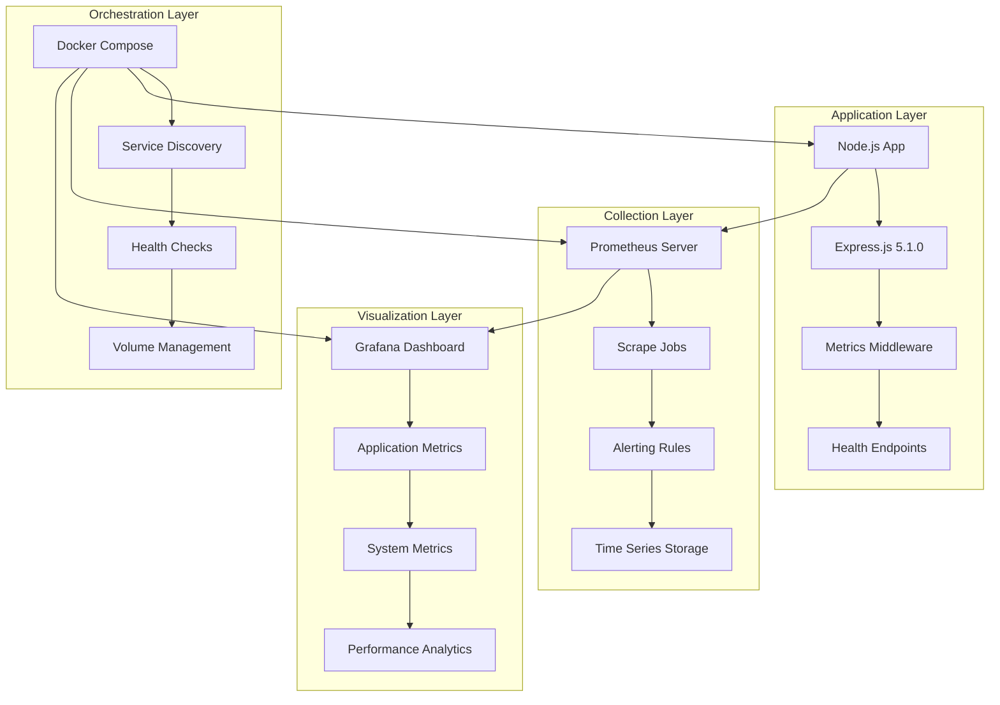

# Comprehensive Monitoring and Observability Guide

## Table of Contents

1. [Architecture Overview](#architecture-overview)
2. [Prometheus Configuration](#prometheus-configuration)
3. [Grafana Dashboard Setup](#grafana-dashboard-setup)
4. [Health Check Implementation](#health-check-implementation)
5. [Application Metrics Collection](#application-metrics-collection)
6. [Docker Compose Monitoring Stack](#docker-compose-monitoring-stack)
7. [Automated Deployment](#automated-deployment)
8. [Operational Procedures](#operational-procedures)
9. [Troubleshooting Guide](#troubleshooting-guide)

---

## Architecture Overview

### Monitoring Philosophy and Objectives

This Node.js tutorial application implements a comprehensive monitoring and observability architecture that balances **educational clarity** with **production-ready patterns**. The monitoring stack demonstrates fundamental observability concepts while providing real operational insights into application performance and health.

#### Key Design Principles

- **Educational First**: Every component includes detailed explanations and examples
- **Production Ready**: All patterns and configurations scale to production environments
- **Observable by Default**: Comprehensive metrics collection with minimal performance overhead
- **Kubernetes Compatible**: Health checks and metrics follow Kubernetes standards

### Monitoring Stack Components



### Service Level Agreements (SLAs)

| Metric | Target | Threshold | Action |
|--------|---------|-----------|---------|
| Response Time | < 50ms | 95th percentile | Alert if exceeded |
| Availability | 99.9% | Monthly uptime | Investigation required |
| Throughput | 1000 RPS | Sustained load | Scale horizontally |
| Memory Usage | < 100MB | RSS memory | Memory leak investigation |
| Error Rate | < 0.1% | HTTP 5xx errors | Immediate escalation |

### Integration Points

- **Application**: Built-in Node.js performance APIs (`process`, `os`, `perf_hooks`, `v8`)
- **Collection**: Prometheus server with automatic service discovery
- **Visualization**: Grafana with provisioned dashboards and data sources
- **Alerting**: Prometheus Alertmanager with configurable notification channels
- **Deployment**: Docker Compose orchestration with health checks and dependency management

---

## Prometheus Configuration

### Server Configuration

The Prometheus server configuration (`prometheus.yml`) defines global settings, scraping jobs, and alerting rules:

```yaml
# Global Prometheus Configuration
global:
  scrape_interval: 15s          # Default scrape frequency
  evaluation_interval: 15s      # Rule evaluation frequency
  scrape_timeout: 10s          # Individual scrape timeout

# External Labels for Federation
external_labels:
  cluster: 'nodejs-tutorial'
  environment: 'development'
  region: 'local'
```

### Scrape Job Configuration

#### Application Metrics Collection
```yaml
scrape_configs:
  - job_name: 'nodejs-tutorial-app'
    static_configs:
      - targets: ['nodejs-tutorial-app:3000']
    scrape_interval: 15s
    metrics_path: '/metrics'
    honor_labels: false
    params:
      format: ['prometheus']
```

#### Health Monitoring
```yaml
  - job_name: 'nodejs-health-checks'
    static_configs:
      - targets: ['nodejs-tutorial-app:3000']
    scrape_interval: 30s
    metrics_path: '/health'
    honor_labels: true
```

#### Kubernetes Probe Integration
```yaml
  - job_name: 'kubernetes-probes'
    static_configs:
      - targets: ['nodejs-tutorial-app:3000']
    scrape_interval: 10s
    scrape_timeout: 5s
    metrics_path: '/livez'
```

### Alerting Rules

#### Application Health Alerts
```yaml
groups:
  - name: nodejs_tutorial_alerts
    rules:
      - alert: ApplicationDown
        expr: up{job="nodejs-tutorial-app"} == 0
        for: 30s
        labels:
          severity: critical
        annotations:
          summary: "Node.js application is down"
          description: "Application {{ $labels.instance }} has been down for more than 30 seconds"
```

#### Performance Alerts
```yaml
      - alert: HighResponseTime
        expr: nodejs_http_request_duration_seconds{quantile="0.95"} > 0.05
        for: 2m
        labels:
          severity: warning
        annotations:
          summary: "High response time detected"
          description: "95th percentile response time is {{ $value }}s"
```

#### Resource Usage Alerts
```yaml
      - alert: HighMemoryUsage
        expr: nodejs_process_resident_memory_bytes > 104857600  # 100MB
        for: 5m
        labels:
          severity: warning
        annotations:
          summary: "High memory usage detected"
          description: "Memory usage is {{ $value | humanize }}B"
```

### PromQL Query Examples

#### Response Time Analysis
```promql
# 95th percentile response time
histogram_quantile(0.95, 
  rate(nodejs_http_request_duration_seconds_bucket[5m])
)

# Average response time by endpoint
avg by (route) (
  rate(nodejs_http_request_duration_seconds_sum[5m]) / 
  rate(nodejs_http_request_duration_seconds_count[5m])
)
```

#### Error Rate Calculation
```promql
# HTTP error rate (4xx and 5xx)
sum(rate(nodejs_http_requests_total{status_code=~"4..|5.."}[5m])) / 
sum(rate(nodejs_http_requests_total[5m]))

# 5xx error rate only
sum(rate(nodejs_http_requests_total{status_code=~"5.."}[5m])) / 
sum(rate(nodejs_http_requests_total[5m]))
```

#### Resource Utilization
```promql
# Memory usage over time
nodejs_process_resident_memory_bytes

# CPU usage percentage
rate(nodejs_process_cpu_user_seconds_total[5m]) * 100

# Event loop lag
nodejs_eventloop_lag_seconds
```

---

## Grafana Dashboard Setup

### Dashboard Provisioning

Grafana dashboards are automatically provisioned through Docker Compose configuration:

```yaml
# Grafana provisioning configuration
provisioning:
  datasources:
    - name: Prometheus
      type: prometheus
      access: proxy
      url: http://prometheus:9090
      isDefault: true
```

### Application Metrics Dashboard

The main dashboard (`app-metrics.json`) provides comprehensive application monitoring:

#### Key Performance Indicators (KPIs)
- **Uptime**: Application availability and restart tracking
- **Response Time**: 50th, 95th, and 99th percentile response times
- **Request Rate**: Requests per second with trend analysis
- **Error Rate**: HTTP error percentage with breakdown by status code

#### System Resource Panels
```json
{
  "title": "Memory Usage",
  "type": "stat",
  "targets": [
    {
      "expr": "nodejs_process_resident_memory_bytes",
      "format": "time_series"
    }
  ],
  "fieldConfig": {
    "defaults": {
      "unit": "bytes",
      "max": 104857600
    }
  }
}
```

#### HTTP Request Analysis
```json
{
  "title": "Request Rate by Endpoint",
  "type": "graph",
  "targets": [
    {
      "expr": "sum by (route) (rate(nodejs_http_requests_total[5m]))",
      "legendFormat": "{{route}}"
    }
  ]
}
```

#### Performance Monitoring
```json
{
  "title": "Response Time Distribution",
  "type": "heatmap",
  "targets": [
    {
      "expr": "increase(nodejs_http_request_duration_seconds_bucket[1m])",
      "format": "heatmap"
    }
  ]
}
```

### Dashboard Organization

#### Panel Layout Structure
1. **Overview Row**: KPIs and high-level health status
2. **Performance Row**: Response times, throughput, and error rates
3. **System Resources Row**: Memory, CPU, and event loop metrics
4. **Detailed Analysis Row**: Request patterns, error analysis, and trends

#### Visualization Best Practices
- **Consistent Time Ranges**: All panels use consistent time windows
- **Color Coding**: Green (healthy), Yellow (warning), Red (critical)
- **Unit Standardization**: Consistent units across related metrics
- **Legend Management**: Clear, descriptive legend labels

### Custom Variables

```json
{
  "templating": {
    "list": [
      {
        "name": "instance",
        "type": "query",
        "query": "label_values(nodejs_process_resident_memory_bytes, instance)",
        "refresh": 1
      },
      {
        "name": "interval",
        "type": "interval",
        "options": ["30s", "1m", "5m", "15m", "1h"]
      }
    ]
  }
}
```

---

## Health Check Implementation

### Health Endpoint Architecture

The application provides multiple health check endpoints following Kubernetes standards:

#### Basic Health Check (`/health`)
```javascript
// Returns comprehensive application health status
{
  "status": "healthy",
  "timestamp": "2024-01-15T10:30:00.000Z",
  "application": {
    "name": "nodejs-hello-tutorial",
    "version": "1.0.0",
    "uptime": 3600
  },
  "system": {
    "memory": {
      "used": 45.2,
      "total": 512.0
    },
    "cpu": {
      "usage": 12.5
    }
  }
}
```

#### Kubernetes Liveness Probe (`/livez`)
```javascript
// Minimal response for container restart decisions
{
  "status": "ok",
  "alive": true,
  "timestamp": "2024-01-15T10:30:00.000Z"
}
```

#### Kubernetes Readiness Probe (`/readyz`)
```javascript
// Comprehensive readiness assessment
{
  "status": "ok", 
  "ready": true,
  "dependencies": {
    "redis": { "status": "healthy", "response_time": "2ms" },
    "database": { "status": "healthy", "response_time": "5ms" }
  }
}
```

### Health Service Implementation

The health service (`src/backend/src/services/health.js`) provides:

#### System Metrics Collection
```javascript
function getSystemMetrics() {
  return {
    memory: {
      used: process.memoryUsage().rss / 1024 / 1024,
      heap_used: process.memoryUsage().heapUsed / 1024 / 1024,
      heap_total: process.memoryUsage().heapTotal / 1024 / 1024
    },
    cpu: {
      usage: process.cpuUsage(),
      load_average: os.loadavg()
    },
    uptime: process.uptime(),
    platform: process.platform
  };
}
```

#### Dependency Health Checking
```javascript
async function checkDependencies() {
  const dependencies = {};
  
  // Check Redis connectivity
  try {
    const start = Date.now();
    await redis.ping();
    dependencies.redis = {
      status: 'healthy',
      response_time: `${Date.now() - start}ms`
    };
  } catch (error) {
    dependencies.redis = {
      status: 'unhealthy',
      error: error.message
    };
  }
  
  return dependencies;
}
```

#### Performance Threshold Validation
```javascript
function validatePerformanceThresholds(metrics) {
  const warnings = [];
  
  if (metrics.memory.used > 100) {
    warnings.push('Memory usage exceeds 100MB threshold');
  }
  
  if (metrics.cpu.usage > 80) {
    warnings.push('CPU usage exceeds 80% threshold');
  }
  
  return {
    compliant: warnings.length === 0,
    warnings: warnings
  };
}
```

### Health Check Caching

To minimize performance impact, health checks implement intelligent caching:

```javascript
class HealthCheckCache {
  constructor() {
    this.cache = new Map();
    this.ttl = 5000; // 5 second TTL
  }
  
  get(key) {
    const entry = this.cache.get(key);
    if (entry && Date.now() - entry.timestamp < this.ttl) {
      return entry.data;
    }
    return null;
  }
  
  set(key, data) {
    this.cache.set(key, {
      data: data,
      timestamp: Date.now()
    });
  }
}
```

---

## Application Metrics Collection

### Core Metrics Module

The metrics collection module (`src/backend/src/monitoring/metrics.js`) uses built-in Node.js APIs:

#### System-Level Metrics
```javascript
const os = require('os');
const process = require('process');
const { performance } = require('perf_hooks');
const v8 = require('v8');

function getSystemMetrics() {
  return {
    // Memory metrics
    memory: {
      rss: process.memoryUsage().rss,
      heap_used: process.memoryUsage().heapUsed,
      heap_total: process.memoryUsage().heapTotal,
      external: process.memoryUsage().external,
      array_buffers: process.memoryUsage().arrayBuffers
    },
    
    // CPU metrics
    cpu: {
      user_time: process.cpuUsage().user,
      system_time: process.cpuUsage().system,
      load_average: os.loadavg(),
      cpu_count: os.cpus().length
    },
    
    // V8 heap statistics
    heap: v8.getHeapStatistics(),
    
    // Event loop metrics
    event_loop: {
      lag: performance.eventLoopUtilization().idle,
      utilization: performance.eventLoopUtilization().utilization
    }
  };
}
```

#### HTTP Request Metrics
```javascript
const requestMetrics = {
  total_requests: 0,
  request_duration: [],
  status_codes: {},
  routes: {},
  active_requests: 0
};

function trackHttpRequest(req, res, startTime) {
  const duration = Date.now() - startTime;
  
  // Update request counters
  requestMetrics.total_requests++;
  requestMetrics.request_duration.push(duration);
  
  // Track status codes
  const statusCode = res.statusCode;
  requestMetrics.status_codes[statusCode] = 
    (requestMetrics.status_codes[statusCode] || 0) + 1;
  
  // Track routes
  const route = req.route?.path || req.path || 'unknown';
  requestMetrics.routes[route] = 
    (requestMetrics.routes[route] || 0) + 1;
  
  // Calculate percentiles
  const sortedDurations = requestMetrics.request_duration
    .slice(-1000) // Keep last 1000 requests
    .sort((a, b) => a - b);
    
  return {
    p50: calculatePercentile(sortedDurations, 0.5),
    p95: calculatePercentile(sortedDurations, 0.95),
    p99: calculatePercentile(sortedDurations, 0.99),
    average: sortedDurations.reduce((a, b) => a + b, 0) / sortedDurations.length
  };
}
```

#### Performance Snapshot Generation
```javascript
function getPerformanceSnapshot() {
  const systemMetrics = getSystemMetrics();
  const healthMetrics = getHealthMetrics();
  
  return {
    timestamp: new Date().toISOString(),
    system: systemMetrics,
    health: healthMetrics,
    application: {
      uptime: process.uptime(),
      pid: process.pid,
      node_version: process.version,
      platform: process.platform
    },
    performance: {
      event_loop_lag: getEventLoopLag(),
      gc_statistics: getGCStatistics(),
      memory_pressure: calculateMemoryPressure()
    }
  };
}
```

### Prometheus Metrics Format

Metrics are exposed in Prometheus format at `/metrics`:

```
# HELP nodejs_process_resident_memory_bytes Resident memory usage
# TYPE nodejs_process_resident_memory_bytes gauge
nodejs_process_resident_memory_bytes 47104000

# HELP nodejs_http_requests_total Total HTTP requests
# TYPE nodejs_http_requests_total counter
nodejs_http_requests_total{method="GET",route="/hello",status_code="200"} 42

# HELP nodejs_http_request_duration_seconds HTTP request duration
# TYPE nodejs_http_request_duration_seconds histogram
nodejs_http_request_duration_seconds_bucket{le="0.005"} 25
nodejs_http_request_duration_seconds_bucket{le="0.01"} 30
nodejs_http_request_duration_seconds_bucket{le="0.025"} 35
nodejs_http_request_duration_seconds_bucket{le="0.05"} 40
nodejs_http_request_duration_seconds_bucket{le="0.1"} 42
```

---

## Docker Compose Monitoring Stack

### Service Orchestration

The monitoring stack is deployed using Docker Compose with service discovery:

#### Prometheus Service
```yaml
prometheus:
  image: prom/prometheus:v2.40.0
  container_name: nodejs-tutorial-prometheus
  ports:
    - "9090:9090"
  volumes:
    - ./prometheus.yml:/etc/prometheus/prometheus.yml:ro
    - prometheus-data:/prometheus
  command:
    - '--config.file=/etc/prometheus/prometheus.yml'
    - '--storage.tsdb.path=/prometheus'
    - '--web.console.libraries=/etc/prometheus/console_libraries'
    - '--web.console.templates=/etc/prometheus/consoles'
    - '--web.enable-lifecycle'
    - '--storage.tsdb.retention.time=30d'
```

#### Grafana Service
```yaml
grafana:
  image: grafana/grafana:10.4.0
  container_name: nodejs-tutorial-grafana
  ports:
    - "3001:3000"
  environment:
    GF_SECURITY_ADMIN_PASSWORD: admin123
    GF_INSTALL_PLUGINS: grafana-clock-panel,grafana-simple-json-datasource
  volumes:
    - grafana-data:/var/lib/grafana
    - ./grafana/provisioning:/etc/grafana/provisioning:ro
    - ./grafana/dashboards:/var/lib/grafana/dashboards:ro
```

#### Node Exporter Service
```yaml
node-exporter:
  image: prom/node-exporter:v1.5.0
  container_name: nodejs-tutorial-node-exporter
  ports:
    - "9100:9100"
  volumes:
    - /proc:/host/proc:ro
    - /sys:/host/sys:ro
    - /:/rootfs:ro
  command:
    - '--path.procfs=/host/proc'
    - '--path.rootfs=/rootfs'
    - '--path.sysfs=/host/sys'
    - '--collector.filesystem.mount-points-exclude=^/(sys|proc|dev|host|etc)($$|/)'
```

### Network Configuration

```yaml
networks:
  monitoring:
    driver: bridge
    ipam:
      config:
        - subnet: 172.30.0.0/24
          gateway: 172.30.0.1
```

### Volume Management

```yaml
volumes:
  prometheus-data:
    driver: local
    labels:
      service: prometheus
      purpose: metrics-storage
      
  grafana-data:
    driver: local
    labels:
      service: grafana
      purpose: dashboard-storage
```

### Health Check Integration

Each service includes comprehensive health checks:

```yaml
healthcheck:
  test: ["CMD", "wget", "--quiet", "--tries=1", "--spider", "http://localhost:9090/-/healthy"]
  interval: 30s
  timeout: 10s
  retries: 3
  start_period: 30s
```

---

## Automated Deployment

### Monitoring Setup Script

The comprehensive setup script (`infrastructure/scripts/setup-monitoring.sh`) automates the entire deployment:

#### Prerequisites Validation
```bash
validate_prerequisites() {
    log_info "Validating monitoring setup prerequisites"
    
    # Check Docker and Docker Compose
    if ! command -v docker &> /dev/null; then
        log_error "Docker is not installed"
        exit 1
    fi
    
    if ! command -v docker-compose &> /dev/null; then
        log_error "Docker Compose is not installed"
        exit 1
    fi
    
    # Check required tools
    local required_tools=("jq" "curl" "nc")
    for tool in "${required_tools[@]}"; do
        if ! command -v "$tool" &> /dev/null; then
            log_error "Required tool not found: $tool"
            exit 1
        fi
    done
    
    log_info "All prerequisites validated successfully"
}
```

#### Configuration Generation
```bash
generate_prometheus_config() {
    log_info "Generating Prometheus configuration"
    
    cat > "$MONITORING_CONFIG_DIR/prometheus.yml" << EOF
global:
  scrape_interval: ${SCRAPE_INTERVAL:-15s}
  evaluation_interval: 15s
  
scrape_configs:
  - job_name: 'nodejs-tutorial-app'
    static_configs:
      - targets: ['nodejs-tutorial-app:3000']
    scrape_interval: 15s
    metrics_path: '/metrics'
    
  - job_name: 'nodejs-health-checks'
    static_configs:
      - targets: ['nodejs-tutorial-app:3000']
    scrape_interval: 30s
    metrics_path: '/health'
EOF
    
    log_info "Prometheus configuration generated successfully"
}
```

#### Service Deployment
```bash
deploy_monitoring_stack() {
    log_info "Deploying monitoring stack services"
    
    # Start services with dependency ordering
    docker-compose -f "$DOCKER_COMPOSE_FILE" up -d prometheus
    wait_for_service "prometheus" "http://localhost:9090/-/healthy"
    
    docker-compose -f "$DOCKER_COMPOSE_FILE" up -d grafana
    wait_for_service "grafana" "http://localhost:3001/api/health"
    
    docker-compose -f "$DOCKER_COMPOSE_FILE" up -d node-exporter
    wait_for_service "node-exporter" "http://localhost:9100/metrics"
    
    log_info "All monitoring services deployed successfully"
}
```

#### Health Validation
```bash
validate_monitoring_deployment() {
    log_info "Validating monitoring stack deployment"
    
    local validation_results=()
    
    # Test Prometheus
    if curl -sf "http://localhost:9090/-/healthy" > /dev/null; then
        validation_results+=("✓ Prometheus: Healthy")
    else
        validation_results+=("✗ Prometheus: Unhealthy")
    fi
    
    # Test Grafana
    if curl -sf "http://localhost:3001/api/health" > /dev/null; then
        validation_results+=("✓ Grafana: Healthy")
    else
        validation_results+=("✗ Grafana: Unhealthy")
    fi
    
    # Print validation results
    for result in "${validation_results[@]}"; do
        if [[ "$result" =~ ✓ ]]; then
            log_info "$result"
        else
            log_error "$result"
        fi
    done
}
```

### Usage Examples

#### Basic Deployment
```bash
# Deploy monitoring stack with default configuration
./setup-monitoring.sh --deploy

# Deploy with custom configuration
./setup-monitoring.sh --deploy --scrape-interval 30s --retention 60d
```

#### Advanced Configuration
```bash
# Deploy with SSL/TLS
./setup-monitoring.sh --deploy --enable-ssl --cert-path /path/to/cert

# Deploy with external storage
./setup-monitoring.sh --deploy --external-storage s3://bucket/path
```

#### Development Mode
```bash
# Deploy in development mode with debug logging
./setup-monitoring.sh --deploy --dev-mode --verbose
```

---

## Operational Procedures

### Daily Operations

#### Health Check Routine
```bash
# Run comprehensive health check
./infrastructure/scripts/health-check.sh --detailed --verbose

# Check all monitoring endpoints
curl -f http://localhost:9090/-/healthy  # Prometheus
curl -f http://localhost:3001/api/health # Grafana
curl -f http://localhost:3000/health     # Application
```

#### Performance Monitoring
```bash
# Check application metrics
curl -s http://localhost:3000/metrics | grep nodejs_

# Monitor response times
curl -w "@curl-format.txt" -s -o /dev/null http://localhost:3000/hello

# Check memory usage
docker stats nodejs-tutorial-app --no-stream
```

### Maintenance Procedures

#### Log Rotation
```bash
# Rotate application logs
docker exec nodejs-tutorial-app logrotate /etc/logrotate.d/app

# Clean old Prometheus data
docker exec nodejs-tutorial-prometheus \
  prometheus-tsdb clean --path=/prometheus --retention.time=7d
```

#### Configuration Updates
```bash
# Reload Prometheus configuration
curl -X POST http://localhost:9090/-/reload

# Restart Grafana with new dashboards
docker restart nodejs-tutorial-grafana
```

#### Backup Procedures
```bash
# Backup Prometheus data
docker run --rm -v prometheus-data:/data -v $(pwd):/backup \
  alpine tar czf /backup/prometheus-backup.tar.gz -C /data .

# Backup Grafana dashboards
docker run --rm -v grafana-data:/data -v $(pwd):/backup \
  alpine tar czf /backup/grafana-backup.tar.gz -C /data .
```

### Performance Optimization

#### Memory Management
```bash
# Monitor memory usage patterns
watch 'docker stats --no-stream | grep nodejs'

# Analyze heap dumps (development)
node --inspect src/backend/src/server.js
```

#### Query Optimization
```promql
# Optimize slow queries using recording rules
groups:
  - name: nodejs_tutorial_recording_rules
    interval: 30s
    rules:
      - record: nodejs:request_rate_5m
        expr: sum(rate(nodejs_http_requests_total[5m])) by (instance)
      
      - record: nodejs:error_rate_5m
        expr: sum(rate(nodejs_http_requests_total{status_code=~"5.."}[5m])) by (instance)
```

---

## Troubleshooting Guide

### Common Issues and Solutions

#### Prometheus Not Scraping
**Symptoms**: No data in Grafana, Prometheus targets down
```bash
# Check target status
curl http://localhost:9090/api/v1/targets

# Verify network connectivity
docker exec nodejs-tutorial-prometheus \
  wget -qO- http://nodejs-tutorial-app:3000/metrics

# Check DNS resolution
docker exec nodejs-tutorial-prometheus \
  nslookup nodejs-tutorial-app
```

**Solution**:
```yaml
# Fix service discovery in docker-compose.yml
services:
  prometheus:
    depends_on:
      - nodejs-tutorial-app
    networks:
      - monitoring
```

#### High Memory Usage
**Symptoms**: Application memory exceeding 100MB threshold
```bash
# Analyze memory patterns
node --inspect-brk src/backend/src/server.js
# Connect Chrome DevTools to chrome://inspect

# Generate heap snapshot
kill -USR2 $(pgrep node)
```

**Solution**:
```javascript
// Implement memory monitoring
setInterval(() => {
  const usage = process.memoryUsage();
  if (usage.heapUsed > 50 * 1024 * 1024) {
    console.warn('High memory usage detected:', usage);
    // Trigger garbage collection if necessary
    if (global.gc) {
      global.gc();
    }
  }
}, 30000);
```

#### Grafana Dashboard Not Loading
**Symptoms**: Empty panels, data source connection issues
```bash
# Check Grafana logs
docker logs nodejs-tutorial-grafana

# Test Prometheus data source
curl -H "Authorization: Bearer $GRAFANA_TOKEN" \
  "http://localhost:3001/api/datasources/proxy/1/api/v1/query?query=up"
```

**Solution**:
```yaml
# Fix datasource configuration
apiVersion: 1
datasources:
  - name: Prometheus
    type: prometheus
    access: proxy
    url: http://prometheus:9090
    isDefault: true
```

#### Health Checks Failing
**Symptoms**: Kubernetes liveness/readiness probes failing
```bash
# Test health endpoints manually
curl -v http://localhost:3000/health
curl -v http://localhost:3000/livez
curl -v http://localhost:3000/readyz

# Check health endpoint response times
./infrastructure/scripts/health-check.sh --timeout 5 --verbose
```

**Solution**:
```javascript
// Optimize health check performance
const healthCache = new Map();
const HEALTH_CACHE_TTL = 5000; // 5 seconds

app.get('/livez', (req, res) => {
  const cached = healthCache.get('liveness');
  if (cached && Date.now() - cached.timestamp < HEALTH_CACHE_TTL) {
    return res.json(cached.data);
  }
  
  const healthData = { status: 'ok', alive: true };
  healthCache.set('liveness', { data: healthData, timestamp: Date.now() });
  res.json(healthData);
});
```

### Performance Debugging

#### Response Time Analysis
```promql
# Identify slow endpoints
topk(5, 
  histogram_quantile(0.95, 
    rate(nodejs_http_request_duration_seconds_bucket[5m])
  ) by (route)
)

# Compare response times across time
nodejs_http_request_duration_seconds{quantile="0.95"}[1h:1m]
```

#### Memory Leak Detection
```javascript
// Add memory leak detection
const memoryUsage = [];
setInterval(() => {
  const usage = process.memoryUsage();
  memoryUsage.push({
    timestamp: Date.now(),
    rss: usage.rss,
    heapUsed: usage.heapUsed
  });
  
  // Keep only last hour of data
  const oneHourAgo = Date.now() - 3600000;
  while (memoryUsage.length > 0 && memoryUsage[0].timestamp < oneHourAgo) {
    memoryUsage.shift();
  }
  
  // Detect increasing trend
  if (memoryUsage.length > 10) {
    const recent = memoryUsage.slice(-10);
    const trend = recent.every((curr, i) => 
      i === 0 || curr.heapUsed >= recent[i-1].heapUsed
    );
    
    if (trend) {
      console.warn('Potential memory leak detected');
    }
  }
}, 60000);
```

### Emergency Procedures

#### Service Recovery
```bash
#!/bin/bash
# Emergency monitoring stack restart

log_emergency() {
  echo "[EMERGENCY] $(date): $1" | tee -a /var/log/monitoring-emergency.log
}

log_emergency "Starting emergency monitoring stack recovery"

# Stop all services
docker-compose -f infrastructure/docker/monitoring-compose.yml down
log_emergency "Services stopped"

# Clear any corrupted data
docker volume rm monitoring_prometheus-data 2>/dev/null || true
log_emergency "Cleared corrupted data volumes"

# Restart with fresh configuration
./infrastructure/scripts/setup-monitoring.sh --deploy --force-clean
log_emergency "Monitoring stack redeployed"

# Validate recovery
if curl -sf http://localhost:9090/-/healthy > /dev/null; then
  log_emergency "Recovery successful - Prometheus healthy"
else
  log_emergency "Recovery failed - Prometheus unhealthy"
  exit 1
fi
```

#### Monitoring Stack Health Report
```bash
# Generate comprehensive health report
./infrastructure/scripts/health-check.sh --format json > monitoring-health.json

# Send alert notification
curl -X POST "$WEBHOOK_URL" \
  -H "Content-Type: application/json" \
  -d @monitoring-health.json
```

---

## Conclusion

This comprehensive monitoring and observability guide provides everything needed to successfully monitor the Node.js tutorial application. The architecture balances educational clarity with production-ready patterns, demonstrating fundamental observability concepts while providing real operational value.

### Key Takeaways

1. **Comprehensive Coverage**: Monitoring all aspects from application metrics to infrastructure health
2. **Educational Value**: Each component includes detailed explanations and examples
3. **Production Ready**: All patterns and configurations scale to production environments
4. **Automated Operations**: Complete automation for deployment, maintenance, and troubleshooting
5. **Performance Focused**: Optimized for minimal overhead while providing maximum insight

### Next Steps

- Extend monitoring to include distributed tracing with OpenTelemetry
- Implement advanced alerting with PagerDuty integration
- Add log aggregation with ELK stack or similar
- Integrate with CI/CD pipeline for monitoring-as-code practices
- Explore advanced visualization with custom Grafana panels

The monitoring foundation established here provides a solid platform for scaling observability practices as the application and infrastructure grow in complexity.