# System Architecture Documentation

## Table of Contents

1. [Introduction](#introduction)
2. [System Overview](#system-overview)
3. [Component Architecture](#component-architecture)
4. [Technical Decisions](#technical-decisions)
5. [Middleware Pipeline](#middleware-pipeline)
6. [Configuration Management](#configuration-management)
7. [Server Lifecycle](#server-lifecycle)
8. [Data Flow](#data-flow)
9. [Performance Considerations](#performance-considerations)
10. [Security Architecture](#security-architecture)
11. [Integration Points](#integration-points)
12. [Future Considerations](#future-considerations)

---

## Introduction

This document provides comprehensive architectural documentation for the Node.js tutorial application, a minimalist web server designed to demonstrate fundamental HTTP server concepts using Express.js 5.1.0 and Node.js v22.x LTS. The application serves as an educational foundation for understanding modern web server architecture, component design patterns, and professional development practices.

### Purpose

The architecture is optimized for educational clarity and rapid development, implementing a single `/hello` endpoint that returns "Hello world" to demonstrate:

- Express.js framework integration with Node.js runtime
- HTTP request/response lifecycle management
- Component-based architecture with clear separation of concerns
- Configuration management and environment-based deployment
- Error handling patterns and middleware pipeline design

### Scope

This architecture documentation covers the complete system design for a tutorial application focused on:

- **Educational Value**: Simplified architecture for learning fundamental concepts
- **Production Patterns**: Industry-standard practices in an accessible format
- **Scalability Foundation**: Design principles that support future enhancement
- **Cross-Platform Compatibility**: Universal deployment capabilities

---

## System Overview

### Architecture Style

The application implements a **single-tier monolithic architecture** optimized for educational purposes and rapid development. This architectural choice prioritizes learning objectives over production scalability requirements, providing a unified codebase that demonstrates fundamental Node.js concepts without distributed system complexity.

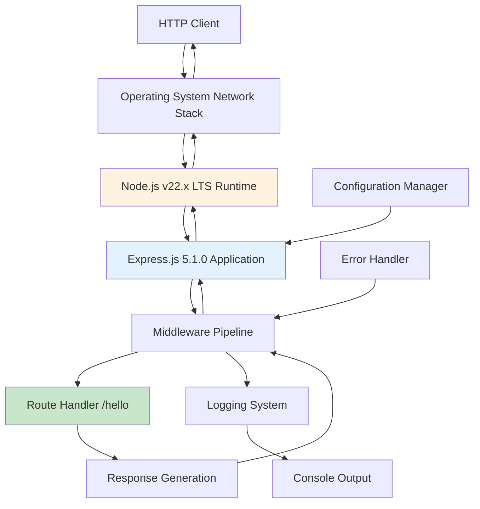

### Core Design Principles

1. **Separation of Concerns**: Clear distinction between HTTP server management, request routing, and response generation
2. **Minimal Dependencies**: Single external dependency (Express.js) to reduce complexity and security surface
3. **Educational Focus**: Architecture optimized for learning rather than production scalability
4. **Cross-Platform Compatibility**: Leveraging Node.js cross-platform capabilities for universal deployment

### System Boundaries

| Boundary Layer | Responsibility | Technology |
|----------------|---------------|------------|
| **Client Boundary** | HTTP protocol interface for external communication | HTTP/1.1 over TCP |
| **Application Boundary** | Business logic, route handlers, configuration management | Express.js application code |
| **Framework Boundary** | HTTP server abstraction and middleware pipeline | Express.js 5.1.0 framework |
| **Runtime Boundary** | JavaScript execution and built-in modules | Node.js v22.x LTS runtime |
| **System Boundary** | Network stack, file system, process management | Operating system services |

---

## Component Architecture

### Layered Architecture Structure

The application follows a **three-tier component structure** that separates concerns while maintaining simplicity:

#### Presentation Layer
- **Responsibility**: HTTP request/response handling and client communication
- **Components**: Express.js application instance, middleware stack
- **Integration**: Managed by Express.js application component

#### Business Logic Layer  
- **Responsibility**: Route processing and application logic implementation
- **Components**: Route handlers, response generators, request processors
- **Integration**: Controllers and services for request processing

#### Infrastructure Layer
- **Responsibility**: Server configuration, lifecycle management, runtime services
- **Components**: Server instance, configuration manager, logging system
- **Integration**: System-level services and environment management

### Core Components

#### 1. Express Application Component (app.js)

**Primary Responsibility**: Central orchestrator for HTTP request processing and middleware management

**Key Features**:
- Express.js 5.1.0 with enhanced async/await error handling
- Automatic Promise rejection forwarding to error middleware
- ReDoS attack prevention and CVE-2024-45590 mitigation
- Middleware pipeline orchestration

**Dependencies**:
- `config/index.js` - Centralized configuration management
- `routes/index.js` - Route handler registration
- `middleware/index.js` - Middleware stack setup
- `utils/index.js` - Utility functions and helpers

**Integration Points**:
- HTTP server instance binding
- Route handler registration and execution
- Error middleware integration
- Configuration system integration

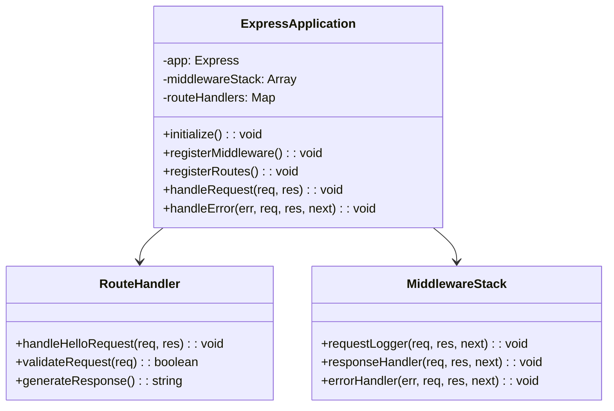

#### 2. HTTP Server Component (server.js)

**Primary Responsibility**: Server lifecycle management, network binding, and graceful shutdown coordination

**Key Features**:
- HTTP server instantiation and port binding
- Process signal handling (SIGTERM, SIGINT)
- Graceful shutdown procedures
- Error recovery mechanisms

**Dependencies**:
- `app.js` - Express application instance
- `config/index.js` - Server configuration settings
- `lib/server.js` - Server utilities
- `lib/lifecycle.js` - Lifecycle management

**Integration Points**:
- Express application mounting
- Configuration system for port/host settings
- Process management and signal handling
- Error reporting and recovery coordination

#### 3. Configuration Manager Component (config/index.js)

**Primary Responsibility**: Centralized configuration aggregation, validation, and environment management

**Architecture Pattern**: Configuration pattern with validation and environment-specific overrides

**Configuration Modules**:
- `environment.js` - Environment variables and Node.js settings
- `server.js` - HTTP server configuration and connection limits  
- `logging.js` - Logging levels and output formats

**Validation Features**:
- Cross-module compatibility checks
- Environment-specific configuration loading
- Default value fallback mechanisms
- Configuration error reporting

**Environment Support**:
- **Development**: Enhanced logging, detailed error messages
- **Test**: Minimal logging, isolated configuration
- **Production**: Optimized logging, security headers

#### 4. Middleware Stack Component (middleware/index.js)

**Primary Responsibility**: Request processing pipeline with logging, response formatting, and error handling

**Pipeline Order**:
1. **Request Logger Middleware** - HTTP request logging and timing
2. **Response Handler Middleware** - Standardized response formatting
3. **Application Routes** - /hello endpoint and route processing
4. **404 Not Found Handler** - Unmatched route handling
5. **Error Handler Middleware** - Comprehensive error processing

**Middleware Pattern**: Express.js middleware pipeline pattern ensuring consistent request handling and error management

**Error Handling**: Express.js 5.1.0 enhanced async/await error handling with automatic Promise rejection forwarding

---

## Technical Decisions

### Framework Selection

#### Express.js 5.1.0 Selection Rationale

**Decision**: Express.js 5.1.0 as primary web framework
**Rationale**: 
- De facto standard server framework for Node.js
- Minimalist approach with robust feature set
- Enhanced async/await error handling capabilities
- Latest stable release with security improvements

**Key Improvements in Express.js 5.1.0**:
- Native Node.js method usage reducing external dependencies
- ReDoS attack prevention (CVE-2024-45590 mitigation)
- Modernized codebase with performance improvements
- Enhanced async/await support with automatic error forwarding

#### Node.js v22.x LTS Selection

**Decision**: Node.js v22.x LTS for runtime environment
**Rationale**:
- Active LTS support until October 2025
- 55% performance improvement over v18.17.0
- Enhanced security features and stability
- Cross-platform compatibility for educational environments

### Design Patterns

#### 1. Middleware Pipeline Pattern
**Implementation**: Express.js middleware pipeline for request processing
**Benefits**: Ordered execution, consistent error handling, modular request processing

#### 2. Factory Pattern  
**Implementation**: Factory functions for creating configured middleware and application components
**Benefits**: Consistent component initialization, configuration injection

#### 3. Barrel Exports Pattern
**Implementation**: Index.js barrel export pattern for organized module access
**Benefits**: Clean imports, centralized module management, simplified dependencies

#### 4. Centralized Configuration Pattern
**Implementation**: Unified configuration management with validation
**Benefits**: Environment-specific settings, validation consistency, flexible deployment

### Security Decisions

#### Framework Security
- **Express.js 5.1.0 Security**: Enhanced security features including ReDoS prevention
- **Header Security**: X-Powered-By header disabled for framework fingerprinting prevention
- **Error Sanitization**: Error message sanitization to prevent information disclosure

#### Development Security
- **Environment Isolation**: Development-focused security with localhost binding
- **Minimal External Exposure**: Single endpoint with static response
- **Input Validation**: Not required for static endpoint (no user input processing)

---

## Middleware Pipeline

### Pipeline Architecture

The middleware pipeline implements a sequential processing pattern that ensures consistent request handling and comprehensive error management throughout the application lifecycle.

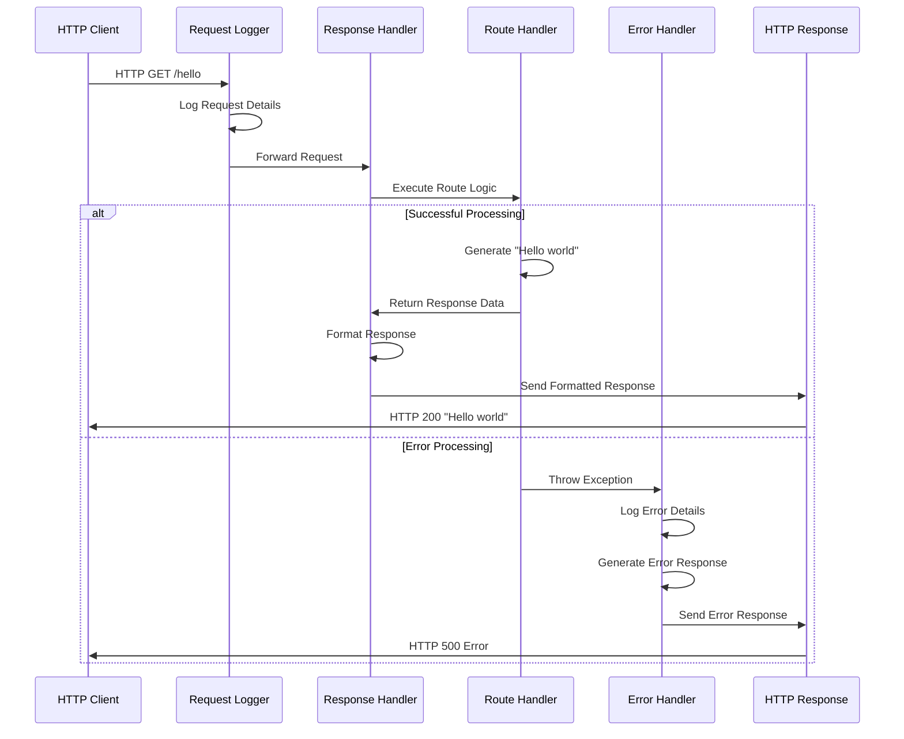

### Middleware Components

#### Request Logger Middleware
**Purpose**: HTTP request logging and timing measurement
**Implementation**: Console-based logging for development environments
**Data Captured**: Request method, URL, timestamp, response time

#### Response Handler Middleware  
**Purpose**: Standardized response formatting and header management
**Implementation**: Consistent response structure and HTTP status code management
**Features**: Content-type headers, response compression (if enabled)

#### Route Processing Middleware
**Purpose**: Application-specific route handling and business logic execution
**Implementation**: Express.js route handlers with async/await support
**Error Handling**: Automatic error forwarding to error middleware

#### Error Handler Middleware
**Purpose**: Comprehensive error processing and response generation
**Implementation**: Centralized error handling with classification and logging
**Features**: Error sanitization, appropriate HTTP status codes, recovery mechanisms

### Async Error Handling

Express.js 5.1.0 provides enhanced async/await error handling capabilities:

- **Automatic Promise Rejection Forwarding**: Rejected promises automatically forwarded to error middleware
- **Simplified Error Handling**: No manual error catching required for async route handlers
- **Consistent Error Processing**: Unified error handling pipeline for both sync and async operations

---

## Configuration Management

### Configuration Architecture

#### Centralized Configuration System

The configuration system implements a **centralized pattern** with comprehensive validation and environment-specific overrides, ensuring consistent application behavior across different deployment scenarios.

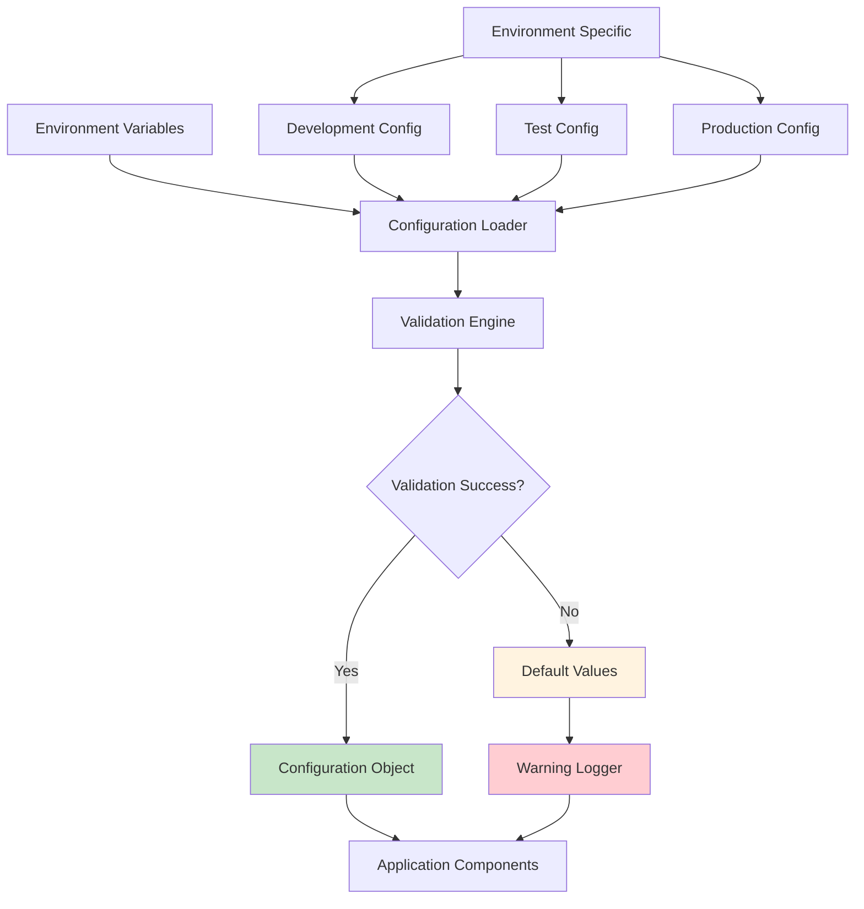

#### Configuration Modules

##### Environment Configuration (config/environment.js)
- **Node.js Settings**: Runtime configuration and environment variables
- **Deployment Environment**: Development, test, production environment detection
- **Process Configuration**: Process-level settings and resource limits

##### Server Configuration (config/server.js)  
- **HTTP Server Settings**: Port, host, connection timeouts
- **Express.js Configuration**: Framework-specific settings and options
- **Network Configuration**: Keep-alive settings, connection limits

##### Logging Configuration (config/logging.js)
- **Log Levels**: Error, warn, info, debug level configuration
- **Output Formats**: Console formatting and structured logging
- **Development Settings**: Enhanced logging for development environments

### Environment-Specific Configuration

| Environment | Configuration Focus | Key Settings |
|-------------|-------------------|--------------|
| **Development** | Enhanced debugging and logging | Detailed error messages, verbose logging, development defaults |
| **Test** | Isolated testing environment | Minimal logging, test-specific ports, isolated settings |
| **Production** | Performance and security optimization | Optimized logging, security headers, production defaults |

### Configuration Validation

#### Validation Rules
- **Data Type Validation**: Ensuring correct data types for all configuration values
- **Range Validation**: Port numbers within valid ranges (1-65535)
- **Dependency Validation**: Cross-module configuration compatibility checks
- **Default Value Assignment**: Fallback values for missing configuration

#### Error Handling
- **Graceful Degradation**: Continue operation with default values when possible
- **Error Reporting**: Detailed error messages for configuration issues
- **Validation Feedback**: Clear indication of configuration problems and solutions

---

## Server Lifecycle

### Initialization Sequence

The server initialization follows a **dependency-first loading pattern** ensuring proper startup order and comprehensive error handling:

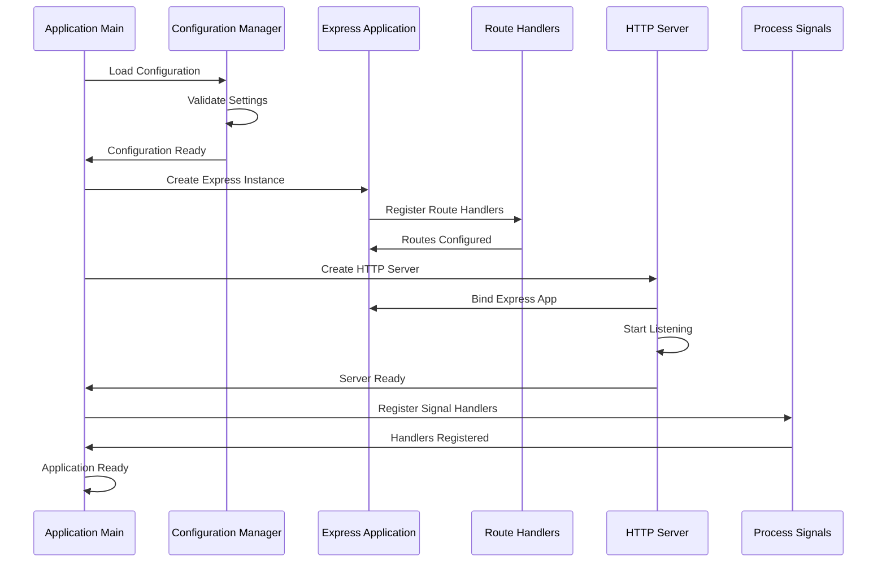

### Startup Procedures

1. **Environment Configuration Loading**: Load and validate environment variables
2. **Express Application Creation**: Initialize Express.js application instance
3. **Middleware Setup**: Configure middleware pipeline in correct order
4. **Route Registration**: Register application routes and handlers
5. **HTTP Server Creation**: Create and configure HTTP server instance
6. **Port Binding**: Bind server to configured port with error handling
7. **Signal Handler Registration**: Setup graceful shutdown signal handlers
8. **Ready State Confirmation**: Confirm application ready for requests

### Graceful Shutdown Process

#### Shutdown Signal Handling
- **SIGTERM Signal**: Graceful shutdown initiated by process manager
- **SIGINT Signal**: User-initiated shutdown (Ctrl+C)
- **Uncaught Exception**: Emergency shutdown with error logging

#### Shutdown Sequence
1. **Signal Reception**: Detect shutdown signal and log initiation
2. **Connection Rejection**: Stop accepting new HTTP connections
3. **Connection Draining**: Allow existing connections to complete
4. **Resource Cleanup**: Clean up application resources and connections
5. **Process Exit**: Exit process with appropriate exit code

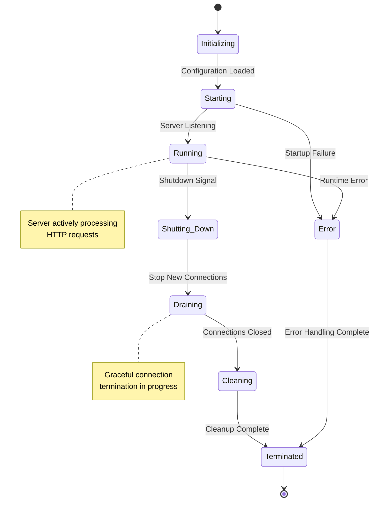

### Error Handling During Lifecycle

#### Startup Error Handling
- **Port Binding Conflicts**: Alternative port retry or graceful failure
- **Configuration Errors**: Default value fallback with warning messages
- **Dependency Failures**: Clear error reporting and resolution guidance

#### Runtime Error Management
- **Request Processing Errors**: Error middleware handling with continued operation
- **Resource Exhaustion**: Monitoring and alerting for resource limits
- **Uncaught Exceptions**: Comprehensive error logging with graceful recovery

---

## Data Flow

### Request Processing Flow

The system implements a **linear pipeline data flow** optimized for educational clarity and minimal latency, demonstrating fundamental HTTP request-response patterns.

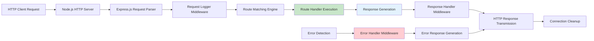

### Data Transformation Points

#### 1. HTTP Protocol Parsing
**Input**: Raw network packets from HTTP client
**Process**: Node.js HTTP module parsing into request objects
**Output**: Structured HTTP request object with headers, method, URL

#### 2. Route Matching
**Input**: HTTP request object with URL path
**Process**: Express.js route matching against registered patterns
**Output**: Matched route handler function and parameters

#### 3. Handler Execution  
**Input**: Express request and response objects
**Process**: Route-specific business logic execution
**Output**: Response data and HTTP status code

#### 4. Response Serialization
**Input**: JavaScript response data and status
**Process**: HTTP response formatting and header generation
**Output**: Complete HTTP response transmitted to client

### Configuration Data Flow

The configuration system implements a **centralized loading pattern** with validation and distribution to application components:

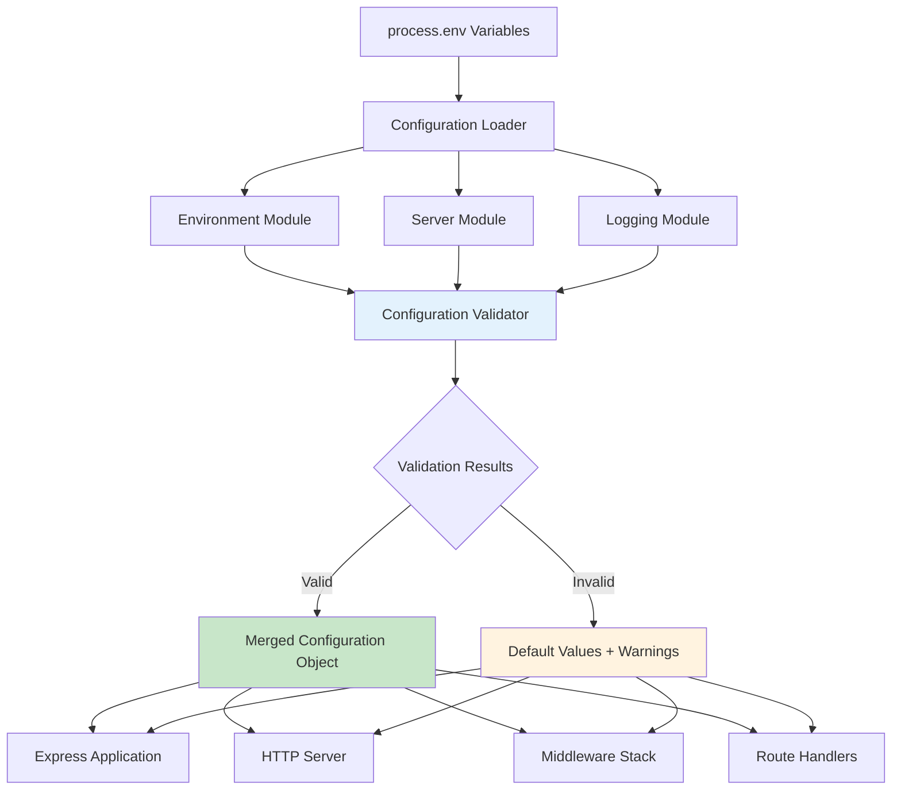

### Error Data Flow

#### Error Detection and Propagation
- **Route Handler Errors**: Exceptions thrown during request processing
- **Middleware Errors**: Errors in middleware execution chain
- **System Errors**: Server startup, binding, or resource errors

#### Error Processing Pipeline
1. **Error Capture**: Exception catching at appropriate middleware level
2. **Error Classification**: Determining error type and severity
3. **Error Logging**: Structured error logging for debugging
4. **Error Response**: Generating appropriate HTTP error response
5. **Error Recovery**: Continuing operation or graceful shutdown

---

## Performance Considerations

### Node.js v22.x Performance Characteristics

#### Runtime Optimization
- **55% Performance Improvement**: Compared to Node.js v18.17.0
- **Event-Driven Architecture**: Single-threaded event loop for concurrent request handling
- **Non-Blocking I/O**: Asynchronous I/O operations for efficient resource utilization
- **Memory Management**: V8 JavaScript engine optimization for memory efficiency

### Express.js 5.1.0 Optimizations

#### Framework Improvements
- **Native Node.js Methods**: Reduced external dependencies improving performance
- **Efficient Middleware Ordering**: Optimized pipeline execution order
- **Enhanced Route Matching**: Improved path-to-regexp library (v0.x to v8.x upgrade)
- **Memory Efficiency**: Reduced memory footprint through code optimization

### Application-Level Optimizations

#### Request Processing
- **Static Response Caching**: Eliminated unnecessary processing for /hello endpoint
- **Minimal Middleware Stack**: Essential functionality only to reduce overhead
- **Efficient Configuration Loading**: Cached configuration with validation optimization
- **Streamlined Error Handling**: Fast error response generation

#### Performance Targets

| Performance Metric | Target Value | Measurement Method | Optimization Strategy |
|-------------------|--------------|-------------------|----------------------|
| **Response Time** | < 100ms | Request-to-response latency | Minimal processing overhead |
| **Memory Usage** | < 50MB | Process RSS monitoring | Efficient object lifecycle |
| **Startup Time** | < 2 seconds | Time to listening state | Optimized initialization sequence |
| **Concurrent Requests** | > 100 req/sec | Load testing capability | Event loop efficiency |

### Scaling Characteristics

#### Vertical Scaling
- **Single Process Design**: Suitable for development and educational environments
- **Resource Efficiency**: Minimal CPU and memory consumption
- **Connection Handling**: Node.js event loop manages concurrent connections

#### Horizontal Scaling Preparation
- **Stateless Design**: No session state or persistent data dependencies
- **Configuration Externalization**: Environment-based configuration for multiple instances
- **Process Clustering**: Foundation for future clustering implementation

---

## Security Architecture

### Development-Focused Security Approach

The tutorial application implements **minimal security measures** appropriate for local development and educational use, while demonstrating security awareness and best practices.

#### Security Boundary Model

```mermaid
graph TD
    A[Internet] -.-> B[Local Network Firewall]
    B --> C[Development Machine]
    C --> D[Localhost Binding 127.0.0.1:3000]
    D --> E[Node.js Process]
    E --> F[Express.js Application]
    F --> G[/hello Endpoint]
    
    H[Security Zone: Network] --> C
    I[Security Zone: Process] --> E
    J[Security Zone: Application] --> F
    
    style D fill:#c8e6c9
    style H fill:#fff3e0
    style I fill:#e3f2fd
    style J fill:#f3e5f5
```

### Framework-Level Security

#### Express.js 5.1.0 Security Features
- **ReDoS Attack Prevention**: Built-in protection against Regular Expression Denial of Service
- **CVE-2024-45590 Mitigation**: Security vulnerability fixes in latest release
- **Header Security**: X-Powered-By header disabled to prevent version fingerprinting
- **Enhanced Error Handling**: Sanitized error responses preventing information disclosure

#### Node.js LTS Security Benefits
- **Active LTS Support**: Security updates and critical bug fixes until October 2025
- **Stable Security Model**: Mature runtime with established security practices
- **Process Isolation**: Single process design with minimal external interactions

### Application Security Controls

#### Input Processing Security
- **Static Response Generation**: No user input processing eliminates injection vulnerabilities
- **Route Validation**: Simple GET /hello endpoint with no parameter processing
- **Method Restrictions**: Only GET method supported, reducing attack surface

#### Network Security
- **Localhost Binding**: Server bound to 127.0.0.1 preventing external network access
- **Development Environment**: Designed for local development, not production exposure
- **Port Configuration**: Configurable port with validation and error handling

#### Error Handling Security
- **Error Message Sanitization**: Generic error messages preventing information disclosure
- **Stack Trace Protection**: Error details logged locally, not exposed to clients
- **Graceful Error Recovery**: Continued operation after recoverable errors

### Security Best Practices Demonstrated

#### Dependency Management
- **Version Pinning**: Exact version specification for reproducible builds
- **Minimal Dependencies**: Single external dependency reduces security surface
- **Security Auditing**: npm audit integration for vulnerability detection

#### Configuration Security
- **Environment Variable Isolation**: Sensitive configuration through environment variables
- **Default Value Security**: Secure defaults with explicit override requirements
- **Configuration Validation**: Input validation preventing configuration-based attacks

---

## Integration Points

### Internal Integration Architecture

The application maintains **clear integration boundaries** with well-defined interfaces between components, enabling modularity and testability.

#### Component Integration Map

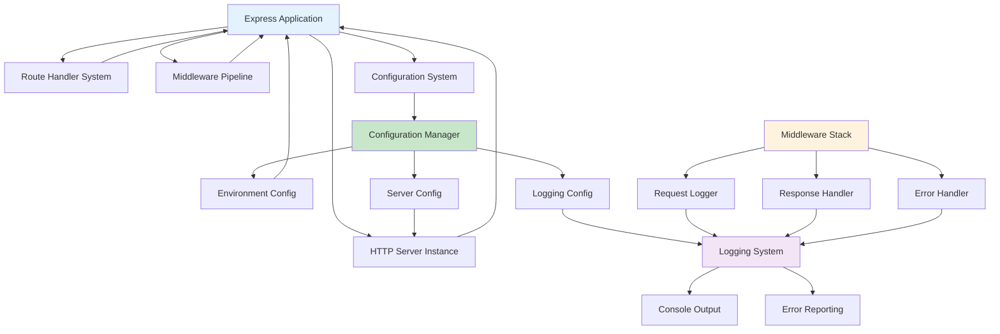

### External Interface Points

#### HTTP Protocol Interface
- **Client Communication**: Standard HTTP/1.1 protocol for web browsers and API clients
- **Request Methods**: GET method support with proper HTTP status codes
- **Content Types**: Plain text responses with appropriate headers
- **Error Responses**: Standard HTTP error codes with meaningful messages

#### Operating System Integration
- **Network Stack**: TCP socket management through Node.js HTTP module
- **Process Management**: Signal handling for graceful shutdown (SIGTERM, SIGINT)
- **Environment Variables**: Configuration through process.env interface
- **File System**: Minimal file system interaction for module loading

#### Node.js Runtime Integration
- **Event Loop**: Asynchronous request processing through Node.js event system
- **Module System**: CommonJS module loading and dependency resolution
- **Process APIs**: Access to process information and environment
- **Built-in Modules**: HTTP, path, and process module integration

### Integration Patterns

#### Request-Response Integration
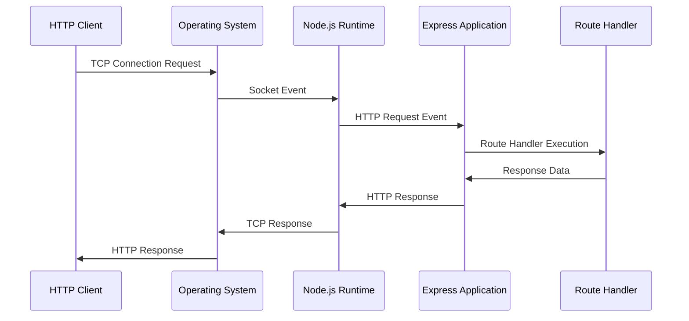

#### Configuration Integration
- **Environment Loading**: Process environment variable access
- **Module Distribution**: Configuration object distribution to components
- **Validation Integration**: Cross-component configuration validation
- **Runtime Updates**: Dynamic configuration changes (limited scope)

#### Error Integration
- **Error Aggregation**: Centralized error collection from all components
- **Error Propagation**: Hierarchical error handling with appropriate escalation
- **Error Reporting**: Unified error logging and monitoring integration
- **Recovery Coordination**: Component-level error recovery with system stability

---

## Future Considerations

### Architectural Evolution Path

The current monolithic architecture provides a solid foundation for progressive enhancement toward more complex system designs while maintaining educational value.

#### Scalability Enhancement Opportunities

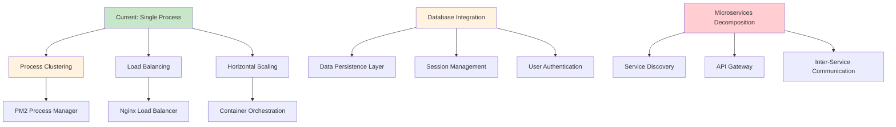

### Database Integration Path

#### Data Layer Enhancement
- **Database Connectivity**: Integration with MongoDB, PostgreSQL, or MySQL
- **ORM/ODM Integration**: Mongoose, Sequelize, or Prisma implementation
- **Connection Pooling**: Database connection management and optimization
- **Data Migration**: Schema management and version control

#### Persistence Patterns
- **Repository Pattern**: Data access abstraction layer
- **Unit of Work**: Transaction management and consistency
- **Caching Layer**: Redis integration for performance optimization
- **Data Validation**: Schema validation and business rule enforcement

### Authentication and Authorization Enhancement

#### Security Framework Integration
- **JWT Authentication**: Token-based authentication system
- **OAuth2 Integration**: Third-party authentication providers
- **Role-Based Access Control**: User permission and authorization system
- **Session Management**: Secure session handling and storage

#### API Security Enhancement
- **Rate Limiting**: Request throttling and abuse prevention
- **Input Validation**: Comprehensive request data validation
- **CORS Configuration**: Cross-origin resource sharing management
- **Security Headers**: HTTPS enforcement and security header implementation

### Monitoring and Observability Evolution

#### Production Monitoring
- **Application Performance Monitoring**: New Relic, Datadog, or custom APM
- **Distributed Tracing**: Request tracing across system components
- **Metrics Collection**: Prometheus metrics and Grafana visualization
- **Log Aggregation**: Centralized logging with ELK stack or similar

#### DevOps Integration
- **CI/CD Pipeline**: Automated testing, building, and deployment
- **Container Orchestration**: Docker and Kubernetes integration
- **Infrastructure as Code**: Terraform or CloudFormation deployment
- **Monitoring Automation**: Automated alerting and incident response

### Microservices Migration Strategy

#### Service Decomposition Approach
- **Domain-Driven Design**: Business domain identification and service boundaries
- **Service Extraction**: Gradual extraction of functionality into separate services
- **API Gateway Implementation**: Centralized API management and routing
- **Service Communication**: REST APIs, gRPC, or message queues

#### Operational Complexity Management
- **Service Discovery**: Consul, etcd, or Kubernetes service discovery
- **Configuration Management**: Centralized configuration for distributed services
- **Health Monitoring**: Service health checks and automated recovery
- **Deployment Orchestration**: Blue-green deployments and rolling updates

### Educational Value Preservation

#### Progressive Learning Path
- **Complexity Introduction**: Gradual introduction of advanced concepts
- **Architectural Documentation**: Maintaining comprehensive documentation
- **Code Examples**: Working examples for each architectural enhancement
- **Best Practices**: Industry-standard practices in educational context

#### Tutorial Enhancement
- **Advanced Modules**: Progressive tutorial modules building on foundation
- **Real-World Examples**: Production-ready patterns in educational format
- **Interactive Learning**: Hands-on exercises and practical implementations
- **Community Contributions**: Open-source contributions and collaborative learning

---

## Conclusion

This Node.js tutorial application architecture demonstrates a carefully designed balance between educational simplicity and professional-grade development practices. The **single-tier monolithic architecture** leveraging **Express.js 5.1.0** and **Node.js v22.x LTS** provides:

### Key Architectural Benefits

1. **Educational Clarity**: Simplified component structure focusing on fundamental concepts
2. **Professional Patterns**: Industry-standard practices in accessible format
3. **Scalability Foundation**: Design principles supporting future enhancement
4. **Security Awareness**: Basic security practices with room for advancement
5. **Performance Optimization**: Efficient implementation demonstrating Node.js capabilities

### Technical Achievement

The architecture successfully implements:
- **HTTP Server Fundamentals** with Express.js framework integration
- **Component-Based Design** with clear separation of concerns
- **Configuration Management** with environment-specific settings
- **Error Handling** with comprehensive error processing
- **Performance Optimization** with minimal resource consumption

### Learning Outcomes

This architectural approach enables developers to understand:
- **Node.js Runtime Concepts** and event-driven architecture
- **Express.js Framework Usage** and middleware patterns
- **HTTP Server Development** and request-response lifecycle
- **Configuration Management** and deployment flexibility
- **Error Handling Strategies** and production readiness

The foundation established by this architecture supports progressive enhancement toward complex distributed systems while maintaining the educational value that makes Node.js development accessible to new developers. The comprehensive documentation and clear component boundaries ensure that this tutorial application serves as an effective stepping stone toward professional web development mastery.