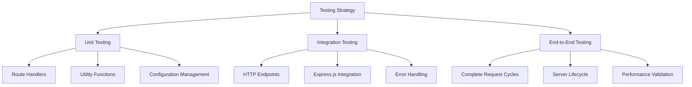

# Testing Documentation

## Node.js Tutorial Application - Comprehensive Testing Guide

**Version:** 1.0.0  
**Node.js:** v22.x LTS (Active LTS until October 2025)  
**Express.js:** 5.1.0  
**Test Framework:** Node.js Built-in Test Runner  
**HTTP Testing:** SuperTest 7.1.1  

---

## Table of Contents

1. [Overview](#overview)
2. [Testing Strategy](#testing-strategy)
3. [Test Framework Setup](#test-framework-setup)
4. [Test Execution](#test-execution)
5. [Code Coverage](#code-coverage)
6. [Test Organization](#test-organization)
7. [Testing Best Practices](#testing-best-practices)
8. [Educational Resources](#educational-resources)

---

## Overview

This documentation provides comprehensive guidance for testing the Node.js tutorial application that demonstrates HTTP server fundamentals with Express.js 5.1.0. The application features a single `/hello` endpoint returning "Hello world" responses, designed specifically for educational purposes and Node.js learning.

### Testing Philosophy

Our testing approach emphasizes:
- **Educational Value**: Tests serve as learning examples for Node.js development patterns
- **Native Tools**: Uses Node.js built-in test runner to minimize external dependencies  
- **Practical Application**: Demonstrates real-world testing scenarios in a simplified context
- **Progressive Learning**: Builds from basic unit tests to comprehensive integration testing

### Key Testing Features

- **Zero External Test Framework Dependencies**: Uses Node.js built-in `node:test` module
- **HTTP Endpoint Testing**: SuperTest integration for Express.js application testing
- **Comprehensive Coverage Analysis**: Node.js built-in `--experimental-test-coverage` 
- **Educational Insights**: Tests designed to teach Node.js and Express.js concepts
- **Quality Gates**: 90% line coverage, 95% function coverage, 85% branch coverage targets

---

## Testing Strategy

### Testing Approach Overview

The Node.js tutorial application implements a **simplified yet comprehensive testing strategy** that demonstrates fundamental testing concepts while maintaining educational focus:



### Testing Framework Selection

#### Node.js Built-in Test Runner

The tutorial uses **Node.js built-in test runner** (available in Node.js v18+) as the primary testing framework:

```javascript
// Example: Basic test using Node.js built-in test runner
import { test, describe } from 'node:test';
import assert from 'node:assert';

describe('Hello Endpoint Tests', () => {
    test('should return Hello world for GET /hello', async () => {
        const response = await request(app)
            .get('/hello')
            .expect(200);
        assert.strictEqual(response.text, 'Hello world');
    });
});
```

**Why Node.js Built-in Test Runner?**
- **Zero Dependencies**: No external test framework installation required
- **Native Integration**: Built into Node.js runtime environment
- **Educational Focus**: Demonstrates Node.js native capabilities
- **Modern Features**: Supports async/await, ES modules, and TypeScript
- **Coverage Support**: Built-in code coverage with `--experimental-test-coverage`

#### SuperTest for HTTP Testing

SuperTest provides HTTP-specific testing capabilities for Express.js applications:

```javascript
// Example: HTTP endpoint testing with SuperTest
import request from 'supertest';
import { createApp } from '../app.js';

test('should handle HTTP requests correctly', async () => {
    const app = createApp();
    
    await request(app)
        .get('/hello')
        .expect(200)
        .expect('Content-Type', /text/)
        .expect('Hello world');
});
```

**SuperTest Benefits:**
- **Express.js Integration**: Designed specifically for Express.js testing
- **Fluent API**: Chainable assertions for HTTP responses
- **Automatic Server Management**: Handles test server lifecycle
- **Comprehensive HTTP Testing**: Headers, status codes, response bodies

### Testing Categories

#### 1. Unit Testing

Tests individual components in isolation:

**Test Coverage Areas:**
- Route handler functions
- Configuration management utilities  
- Error handling mechanisms
- Request/response processing logic

**Example Unit Test:**
```javascript
// Testing route handler logic
import { test } from 'node:test';
import assert from 'node:assert';
import { helloHandler } from '../controllers/helloController.js';

test('helloHandler should return Hello world', () => {
    const mockReq = {};
    const mockRes = {
        text: '',
        send: function(text) { this.text = text; }
    };
    
    helloHandler(mockReq, mockRes);
    assert.strictEqual(mockRes.text, 'Hello world');
});
```

#### 2. Integration Testing

Tests component interactions and HTTP endpoints:

**Integration Test Scenarios:**
- HTTP server startup and configuration
- Express.js application integration
- Route registration and request routing
- Error handling middleware integration

**Example Integration Test:**
```javascript
// Testing complete HTTP request cycle
import { test } from 'node:test';
import request from 'supertest';
import { createTestServer } from '../test/helpers/testHelpers.js';

test('should integrate Express.js components correctly', async () => {
    const { app, server } = await createTestServer();
    
    try {
        await request(app)
            .get('/hello')
            .expect(200)
            .expect('Hello world');
    } finally {
        await server.close();
    }
});
```

#### 3. End-to-End Testing

Tests complete application workflows:

**E2E Test Scenarios:**
- Full server lifecycle (startup → request → shutdown)
- Multiple concurrent requests
- Error recovery and graceful shutdown
- Performance under load

**Example E2E Test:**
```javascript
// Testing complete application lifecycle
import { test } from 'node:test';
import { TestContext } from '../test/helpers/testHelpers.js';

test('should handle complete application lifecycle', async () => {
    const context = new TestContext();
    
    try {
        // Start application
        await context.startApplication();
        
        // Test endpoint functionality
        const response = await context.makeRequest('GET', '/hello');
        assert.strictEqual(response.statusCode, 200);
        assert.strictEqual(response.body, 'Hello world');
        
        // Test graceful shutdown
        await context.stopApplication();
    } finally {
        await context.cleanup();
    }
});
```

---

## Test Framework Setup

### Node.js Built-in Test Runner Configuration

The Node.js built-in test runner requires minimal setup and configuration:

#### Basic Test File Structure

```javascript
/**
 * Basic test file structure using Node.js built-in test runner
 * File: test/unit/server.test.js
 */

// Import Node.js test utilities
import { test, describe, before, after } from 'node:test';
import assert from 'node:assert';

// Import application modules
import { createServer } from '../../lib/server.js';
import { getAvailablePort } from '../helpers/testHelpers.js';

describe('Server Module Tests', () => {
    let server;
    let port;
    
    before(async () => {
        port = await getAvailablePort();
        server = createServer();
    });
    
    after(async () => {
        if (server) {
            await server.close();
        }
    });
    
    test('should create server instance', () => {
        assert.ok(server);
        assert.equal(typeof server.listen, 'function');
    });
    
    test('should listen on specified port', async () => {
        await new Promise((resolve, reject) => {
            server.listen(port, (error) => {
                if (error) reject(error);
                else resolve();
            });
        });
        
        assert.equal(server.listening, true);
    });
});
```

#### Test File Discovery

The Node.js test runner automatically discovers test files using these patterns:

```bash
# Test file naming patterns
*.test.js     # server.test.js
*.spec.js     # server.spec.js
test-*.js     # test-server.js
*-test.js     # server-test.js
test/*.js     # test/server.js
```

#### Test Execution Commands

```bash
# Run all tests
node --test

# Run specific test file
node --test test/unit/server.test.js

# Run tests with coverage
node --test --experimental-test-coverage

# Run tests in watch mode
node --test --watch

# Run tests with custom reporter
node --test --test-reporter=spec
```

### SuperTest Integration Setup

SuperTest integrates seamlessly with the Node.js test runner for HTTP testing:

#### SuperTest Configuration

```javascript
/**
 * SuperTest integration for HTTP endpoint testing
 * File: test/integration/api.integration.test.js
 */

import { test, describe } from 'node:test';
import request from 'supertest';
import { createApp } from '../../app.js';

describe('API Integration Tests', () => {
    let app;
    
    // Setup test application
    before(() => {
        app = createApp();
    });
    
    test('should respond to GET /hello', async () => {
        await request(app)
            .get('/hello')
            .expect(200)
            .expect('Content-Type', /text/)
            .expect((res) => {
                assert.strictEqual(res.text, 'Hello world');
            });
    });
    
    test('should return 405 for POST /hello', async () => {
        await request(app)
            .post('/hello')
            .expect(405);
    });
    
    test('should return 404 for non-existent routes', async () => {
        await request(app)
            .get('/nonexistent')
            .expect(404);
    });
});
```

### Test Configuration Management

The application uses `testConfig.js` for centralized test configuration:

#### TestConfiguration Class

```javascript
/**
 * Test configuration management
 * Source: test/setup/testConfig.js
 */

import { TestConfiguration } from '../test/setup/testConfig.js';

// Create test configuration instance
const testConfig = new TestConfiguration({
    environment: 'test',
    port: 0, // Use dynamic port allocation
    timeout: 5000,
    retries: 3,
    coverage: {
        enabled: true,
        thresholds: {
            lines: 90,
            functions: 95,
            branches: 85,
            statements: 90
        }
    }
});

// Initialize test environment
await testConfig.initialize();
```

#### Test Environment Setup

```javascript
/**
 * Test environment initialization
 * Source: test/helpers/testHelpers.js
 */

import { setupTestEnvironment } from '../test/helpers/testHelpers.js';

// Setup isolated test environment
const testEnv = await setupTestEnvironment({
    nodeEnv: 'test',
    logLevel: 'error',
    port: await getAvailablePort()
});

export { testEnv };
```

---

## Test Execution

### Test Scripts and Commands

The application provides comprehensive test execution scripts through `package.json`:

#### Available Test Scripts

```json
{
  "scripts": {
    "test": "node scripts/test.js",
    "test:unit": "node scripts/test.js --type=unit",
    "test:integration": "node scripts/test.js --type=integration", 
    "test:e2e": "node scripts/test.js --type=e2e",
    "test:watch": "node scripts/test-watch.js",
    "test:coverage": "node scripts/test-coverage.js",
    "test:all": "node scripts/test.js --type=all --coverage"
  }
}
```

#### Test Execution Examples

```bash
# Run all tests
npm test

# Run specific test categories
npm run test:unit
npm run test:integration
npm run test:e2e

# Run tests with coverage analysis
npm run test:coverage

# Run tests in watch mode for development
npm run test:watch

# Run complete test suite with coverage
npm run test:all
```

### Test Orchestration Script

The main test execution is managed by `scripts/test.js`:

#### Test Discovery and Execution

```javascript
/**
 * Test execution orchestration
 * Source: scripts/test.js (simplified example)
 */

import { spawn } from 'node:child_process';
import { discoverTestFiles } from './test-utils.js';

async function runTests(options = {}) {
    // Discover test files by category
    const testFiles = await discoverTestFiles({
        unit: 'test/unit/**/*.test.js',
        integration: 'test/integration/**/*.test.js',
        e2e: 'test/e2e/**/*.test.js'
    });
    
    // Determine which tests to run
    const selectedTests = filterTestsByType(testFiles, options.type);
    
    // Execute tests with Node.js test runner
    const testProcess = spawn('node', [
        '--test',
        '--experimental-test-coverage',
        ...selectedTests
    ], {
        stdio: 'pipe',
        env: { ...process.env, NODE_ENV: 'test' }
    });
    
    // Handle test results
    return new Promise((resolve, reject) => {
        testProcess.on('close', (code) => {
            code === 0 ? resolve() : reject(new Error(`Tests failed with code ${code}`));
        });
    });
}
```

### Test Lifecycle Management

Tests follow a structured lifecycle with setup, execution, and cleanup phases:

#### Test Setup Phase

```javascript
/**
 * Test setup and initialization
 */

import { before, after } from 'node:test';
import { TestContext, createTestServer } from '../helpers/testHelpers.js';

describe('Hello Endpoint Integration Tests', () => {
    let testContext;
    let server;
    
    before(async () => {
        // Initialize test context
        testContext = new TestContext();
        await testContext.initialize();
        
        // Create isolated test server
        server = await createTestServer({
            port: testContext.getPort(),
            environment: 'test'
        });
        
        // Wait for server readiness
        await server.waitForReady();
    });
    
    after(async () => {
        // Cleanup test resources
        if (server) {
            await server.close();
        }
        
        if (testContext) {
            await testContext.cleanup();
        }
    });
});
```

#### Test Execution Phase

```javascript
/**
 * Individual test execution with comprehensive assertions
 */

test('should handle concurrent requests successfully', async () => {
    const concurrentRequests = 10;
    const requests = [];
    
    // Generate concurrent requests
    for (let i = 0; i < concurrentRequests; i++) {
        requests.push(
            request(server.app)
                .get('/hello')
                .expect(200)
                .expect('Hello world')
        );
    }
    
    // Execute all requests concurrently
    const responses = await Promise.all(requests);
    
    // Verify all responses
    responses.forEach(response => {
        assert.strictEqual(response.status, 200);
        assert.strictEqual(response.text, 'Hello world');
    });
});
```

#### Test Cleanup Phase

```javascript
/**
 * Automatic test cleanup and resource management
 */

import { after } from 'node:test';

after(async () => {
    // Close database connections (if any)
    // Stop background processes
    // Clean temporary files
    // Reset environment variables
    // Clear test caches
    
    console.log('Test cleanup completed');
});
```

### Test Results and Reporting

The Node.js test runner provides multiple output formats for test results:

#### Console Output Format

```bash
# Example test run output
TAP version 13
# Subtest: Hello Endpoint Integration Tests
    # Subtest: should return Hello world for GET /hello
    ok 1 - should return Hello world for GET /hello
      ---
      duration_ms: 12.345
      ...
    # Subtest: should return 405 for POST /hello
    ok 2 - should return 405 for POST /hello
      ---
      duration_ms: 8.765
      ...
    1..2
ok 1 - Hello Endpoint Integration Tests
  ---
  duration_ms: 25.543
  ...

# Tests 2
# Pass 2
# Fail 0
# Cancelled 0
# Skipped 0
# Todo 0
# Duration 25.543ms
```

#### Structured Test Reporting

```javascript
/**
 * Custom test result processing
 * Source: scripts/test.js
 */

function processTestResults(testOutput) {
    const results = {
        total: 0,
        passed: 0,
        failed: 0,
        skipped: 0,
        duration: 0,
        coverage: null
    };
    
    // Parse TAP output
    const lines = testOutput.split('\n');
    lines.forEach(line => {
        if (line.startsWith('ok ')) {
            results.passed++;
            results.total++;
        } else if (line.startsWith('not ok ')) {
            results.failed++;
            results.total++;
        }
    });
    
    return results;
}
```

---

## Code Coverage

### Coverage Analysis Overview

The Node.js tutorial application uses the built-in code coverage functionality to ensure comprehensive test coverage:

#### Coverage Targets

```javascript
/**
 * Coverage thresholds and quality gates
 * Source: test/setup/testConfig.js
 */

const coverageThresholds = {
    lines: 90,      // 90% line coverage target
    functions: 95,  // 95% function coverage target  
    branches: 85,   // 85% branch coverage target
    statements: 90  // 90% statement coverage target
};
```

#### Coverage Collection

```bash
# Enable code coverage collection
node --test --experimental-test-coverage

# Generate coverage report with specific format
node --test --experimental-test-coverage --test-reporter=lcov

# Run coverage with custom thresholds
node scripts/test-coverage.js --threshold-lines=95 --threshold-functions=98
```

### Coverage Reporting

The application provides comprehensive coverage reporting through `scripts/test-coverage.js`:

#### Coverage Report Generation

```javascript
/**
 * Coverage report generation and analysis
 * Source: scripts/test-coverage.js (simplified example)
 */

async function generateCoverageReport(coverageData) {
    const report = {
        summary: {
            lines: calculateCoveragePercentage(coverageData.lines),
            functions: calculateCoveragePercentage(coverageData.functions),
            branches: calculateCoveragePercentage(coverageData.branches),
            statements: calculateCoveragePercentage(coverageData.statements)
        },
        files: analyzeCoverageByFile(coverageData),
        uncovered: identifyUncoveredCode(coverageData),
        recommendations: generateImprovementRecommendations(coverageData)
    };
    
    return report;
}
```

#### Coverage Output Formats

The coverage system supports multiple output formats:

```bash
# Text format (default)
npm run test:coverage

# LCOV format for CI/CD integration
npm run test:coverage -- --lcov

# HTML format for browser viewing
npm run test:coverage -- --html

# JSON format for programmatic analysis
npm run test:coverage -- --json
```

#### Example Coverage Report

```
Node.js Tutorial Application - Code Coverage Report
Generated: 2024-12-07T10:30:00.000Z

Coverage Metrics:
- Lines: 92.3% (120/130) ✅ Target: 90%
- Functions: 96.8% (30/31) ✅ Target: 95%  
- Branches: 87.5% (14/16) ✅ Target: 85%
- Statements: 91.2% (135/148) ✅ Target: 90%

Average Coverage: 91.9% ✅

Files Analyzed: 8
Uncovered Lines: 3 areas need attention

COVERAGE ANALYSIS PASSED ✅
All coverage thresholds met successfully!
```

### Coverage Gap Analysis

The coverage system provides educational insights for improving test coverage:

#### Uncovered Code Identification

```javascript
/**
 * Coverage gap analysis for educational purposes
 * Source: scripts/test-coverage.js
 */

function analyzeCoverageGaps(coverageData) {
    const gaps = {
        uncoveredLines: extractUncoveredLines(coverageData),
        untestFunctions: identifyUntestedFunctions(coverageData),
        missingBranches: findUncoveredBranches(coverageData),
        recommendations: []
    };
    
    // Generate specific recommendations
    if (gaps.uncoveredLines.length > 0) {
        gaps.recommendations.push({
            priority: 'HIGH',
            description: 'Add tests for uncovered lines',
            examples: generateTestExamples(gaps.uncoveredLines)
        });
    }
    
    return gaps;
}
```

#### Coverage Improvement Recommendations

```markdown
## Coverage Improvement Recommendations

### HIGH PRIORITY
- Add tests for error handling paths in server startup
- Test edge cases for invalid HTTP methods
- Cover exception handling in route processors

### MEDIUM PRIORITY  
- Test middleware execution order
- Add boundary condition tests
- Improve branch coverage for configuration validation

### Example Test Cases

```javascript
// Test error handling paths
test('should handle server startup failures', async () => {
    const invalidPort = -1;
    await assert.rejects(
        () => startServer(invalidPort),
        /Invalid port number/
    );
});

// Test edge cases
test('should handle very long request paths', async () => {
    const longPath = '/' + 'a'.repeat(1000);
    await request(app)
        .get(longPath)
        .expect(404);
});
```

### Coverage Quality Gates

Coverage quality gates ensure consistent test quality standards:

#### Automated Coverage Validation

```javascript
/**
 * Coverage quality gate validation
 * Source: scripts/test-coverage.js
 */

function validateCoverageThresholds(coverageData, thresholds) {
    const validationResults = {
        passed: true,
        violations: [],
        summary: {}
    };
    
    // Check each coverage metric against thresholds
    Object.keys(thresholds).forEach(metric => {
        const actual = coverageData.summary[metric].percentage;
        const threshold = thresholds[metric];
        
        if (actual < threshold) {
            validationResults.passed = false;
            validationResults.violations.push({
                metric,
                actual: `${actual}%`,
                threshold: `${threshold}%`,
                gap: `${threshold - actual}%`
            });
        }
    });
    
    return validationResults;
}
```

#### Coverage Failure Handling

```bash
# Example coverage failure output
❌ COVERAGE THRESHOLDS NOT MET

Violations:
• Line Coverage: 87.5% < 90.0% (Gap: 2.5%)
• Branch Coverage: 82.1% < 85.0% (Gap: 2.9%)

Recommendations:
🚀 Add tests for the /hello endpoint error handling
🚀 Test POST, PUT, DELETE methods for 405 responses  
🚀 Add edge case tests for malformed requests

Exit Code: 1 (Coverage failure)
```

---

## Test Organization

### Directory Structure

The test suite follows a logical directory structure that mirrors the application architecture:

```
src/backend/
├── test/
│   ├── setup/
│   │   ├── testConfig.js          # Central test configuration
│   │   └── globalSetup.js         # Global test environment setup
│   ├── helpers/
│   │   ├── testHelpers.js         # Utility functions for testing
│   │   └── serverHelpers.js       # HTTP server testing utilities
│   ├── fixtures/
│   │   └── requests.js            # Test data and request objects
│   ├── unit/
│   │   ├── server.test.js         # Server module unit tests
│   │   ├── routes.test.js         # Route handler unit tests
│   │   └── config.test.js         # Configuration unit tests
│   ├── integration/
│   │   ├── api.integration.test.js # HTTP API integration tests
│   │   └── app.integration.test.js # Application integration tests
│   └── e2e/
│       └── lifecycle.e2e.test.js  # End-to-end lifecycle tests
├── scripts/
│   ├── test.js                    # Main test orchestration script
│   ├── test-coverage.js           # Coverage analysis script
│   └── test-watch.js              # Watch mode test runner
└── app.js                         # Main application entry point
```

### Test File Naming Conventions

Consistent file naming helps organize and discover tests effectively:

#### File Naming Patterns

```javascript
// Unit test files
server.test.js           // Tests for server.js module
routes.test.js           // Tests for routes module
helloController.test.js  // Tests for hello controller

// Integration test files  
api.integration.test.js  // API integration tests
app.integration.test.js  // Application integration tests

// End-to-end test files
lifecycle.e2e.test.js    // Complete lifecycle tests
performance.e2e.test.js  // Performance validation tests

// Helper and utility files
testHelpers.js           // General test utilities
serverHelpers.js         // Server-specific test utilities
fixtures/requests.js     // Test data and fixtures
```

### Test Categories and Scope

Each test category has a specific purpose and scope within the testing strategy:

#### Unit Test Organization

```javascript
/**
 * Unit test structure and organization
 * File: test/unit/server.test.js
 */

import { describe, test, before, after } from 'node:test';
import assert from 'node:assert';

describe('Server Module - Unit Tests', () => {
    describe('Server Creation', () => {
        test('should create server instance', () => {
            // Test server instantiation logic
        });
        
        test('should configure server options', () => {
            // Test server configuration
        });
    });
    
    describe('Port Management', () => {
        test('should validate port numbers', () => {
            // Test port validation logic
        });
        
        test('should handle port conflicts', () => {
            // Test port conflict resolution
        });
    });
    
    describe('Error Handling', () => {
        test('should handle startup errors', () => {
            // Test error handling mechanisms
        });
    });
});
```

#### Integration Test Organization

```javascript
/**
 * Integration test structure and organization
 * File: test/integration/api.integration.test.js
 */

import { describe, test, before, after } from 'node:test';
import request from 'supertest';

describe('API Integration Tests', () => {
    let app;
    
    before(async () => {
        app = await createTestApp();
    });
    
    describe('Hello Endpoint', () => {
        test('should respond to GET /hello', async () => {
            // Test successful endpoint response
        });
        
        test('should reject invalid methods', async () => {
            // Test method validation
        });
    });
    
    describe('Error Handling', () => {
        test('should return 404 for unknown routes', async () => {
            // Test route not found handling
        });
        
        test('should handle server errors gracefully', async () => {
            // Test error middleware
        });
    });
});
```

### Test Data Management

Test data is centralized and reusable across different test categories:

#### Test Fixtures Structure

```javascript
/**
 * Test fixtures and data management
 * Source: test/fixtures/requests.js (example usage)
 */

import { 
    validRequests, 
    invalidRequests, 
    createValidHelloRequest 
} from './fixtures/requests.js';

// Use predefined valid request fixtures
test('should handle valid requests', async () => {
    await request(app)
        .get(validRequests.helloGet.path)
        .set(validRequests.helloGet.headers)
        .expect(200);
});

// Use factory functions for dynamic test data
test('should handle custom request scenarios', async () => {
    const customRequest = createValidHelloRequest({
        headers: { 'X-Test-Scenario': 'custom-test' }
    });
    
    await request(app)
        .get(customRequest.path)
        .set(customRequest.headers)
        .expect(200);
});
```

#### Test Configuration Management

```javascript
/**
 * Centralized test configuration
 * Source: test/setup/testConfig.js (usage example)
 */

import { TestConfigManager, testConfig } from '../setup/testConfig.js';

describe('Application Tests with Configuration', () => {
    let configManager;
    
    before(async () => {
        configManager = new TestConfigManager();
        await configManager.initialize({
            environment: 'test',
            port: 0, // Dynamic port allocation
            timeout: 5000
        });
    });
    
    test('should use test configuration', () => {
        const config = configManager.getConfig();
        assert.strictEqual(config.environment, 'test');
        assert.ok(config.port > 0);
    });
});
```

### Test Utilities and Helpers

Shared utilities enhance test maintainability and reduce code duplication:

#### Common Test Utilities

```javascript
/**
 * Test utility functions
 * Source: test/helpers/testHelpers.js (usage examples)
 */

import { 
    getAvailablePort,
    createTestLogger,
    waitForCondition,
    measureExecutionTime,
    createTestEnvironment
} from '../helpers/testHelpers.js';

test('should use test utilities effectively', async () => {
    // Get available port for test isolation
    const port = await getAvailablePort();
    
    // Create test-specific logger
    const logger = createTestLogger('test-scenario');
    
    // Wait for asynchronous conditions
    await waitForCondition(
        () => server.listening,
        { timeout: 5000, interval: 100 }
    );
    
    // Measure test execution performance
    const { result, duration } = await measureExecutionTime(async () => {
        return await request(app).get('/hello').expect(200);
    });
    
    logger.info(`Request completed in ${duration}ms`);
    assert.ok(duration < 1000); // Performance assertion
});
```

---

## Testing Best Practices

### Node.js Testing Best Practices

The tutorial application demonstrates industry-standard testing practices adapted for educational purposes:

#### Test Structure and Organization

```javascript
/**
 * Best practice test structure
 */

// ✅ Good: Descriptive test names that explain behavior
test('should return Hello world when GET request sent to /hello endpoint', async () => {
    // Test implementation
});

// ❌ Avoid: Vague test names
test('hello test', async () => {
    // Test implementation  
});

// ✅ Good: Organized test suites with clear hierarchy
describe('Hello Endpoint', () => {
    describe('GET /hello', () => {
        test('should return 200 status code', async () => {});
        test('should return Hello world text', async () => {});
        test('should set correct content type', async () => {});
    });
    
    describe('POST /hello', () => {
        test('should return 405 Method Not Allowed', async () => {});
    });
});
```

#### Test Isolation and Independence

```javascript
/**
 * Test isolation best practices
 */

describe('Isolated Test Suite', () => {
    let testServer;
    let testPort;
    
    // ✅ Good: Fresh setup for each test suite
    before(async () => {
        testPort = await getAvailablePort();
        testServer = await createTestServer({ port: testPort });
    });
    
    // ✅ Good: Proper cleanup after tests
    after(async () => {
        if (testServer) {
            await testServer.close();
        }
    });
    
    test('should not depend on other tests', async () => {
        // Each test should be completely independent
        const response = await request(testServer.app)
            .get('/hello')
            .expect(200);
            
        assert.strictEqual(response.text, 'Hello world');
    });
});
```

#### Comprehensive Assertions

```javascript
/**
 * Comprehensive assertion patterns
 */

test('should validate HTTP response completely', async () => {
    const response = await request(app)
        .get('/hello')
        .expect(200)                              // Status code
        .expect('Content-Type', /text\/plain/)    // Content type
        .expect('Hello world');                   // Response body
    
    // Additional assertions for complete validation
    assert.ok(response.headers['content-length']);
    assert.ok(response.headers['date']);
    assert.match(response.text, /^Hello world$/);
});
```

### Express.js Testing Best Practices

#### Testing Route Handlers

```javascript
/**
 * Route handler testing patterns
 */

// ✅ Good: Test route handlers in isolation
test('should test route handler independently', () => {
    const mockReq = {};
    const mockRes = {
        status: function(code) { this.statusCode = code; return this; },
        send: function(data) { this.body = data; return this; }
    };
    
    helloHandler(mockReq, mockRes);
    
    assert.strictEqual(mockRes.body, 'Hello world');
});

// ✅ Good: Test routes with SuperTest integration
test('should test route through Express app', async () => {
    await request(app)
        .get('/hello')
        .expect(200)
        .expect('Hello world');
});
```

#### Testing Middleware

```javascript
/**
 * Middleware testing patterns
 */

test('should test middleware functionality', () => {
    const mockReq = { url: '/hello', method: 'GET' };
    const mockRes = {};
    const mockNext = mock.fn();
    
    // Test middleware execution
    requestLogger(mockReq, mockRes, mockNext);
    
    // Verify middleware behavior
    assert.equal(mockNext.mock.calls.length, 1);
});
```

#### Error Handling Testing

```javascript
/**
 * Error handling test patterns
 */

test('should handle application errors gracefully', async () => {
    // Mock error condition
    const errorApp = express();
    errorApp.get('/hello', (req, res, next) => {
        next(new Error('Test error'));
    });
    errorApp.use((err, req, res, next) => {
        res.status(500).send('Internal Server Error');
    });
    
    await request(errorApp)
        .get('/hello')
        .expect(500)
        .expect('Internal Server Error');
});
```

### Asynchronous Testing Best Practices

#### Promise-based Testing

```javascript
/**
 * Async/await testing patterns
 */

// ✅ Good: Proper async/await usage
test('should handle async operations correctly', async () => {
    const response = await request(app)
        .get('/hello')
        .expect(200);
        
    assert.strictEqual(response.text, 'Hello world');
});

// ✅ Good: Error handling in async tests
test('should handle async errors properly', async () => {
    await assert.rejects(
        async () => {
            await startServerOnInvalidPort(-1);
        },
        /Invalid port/
    );
});
```

#### Timeout Management

```javascript
/**
 * Test timeout configuration
 */

test('should complete within reasonable time', async () => {
    const startTime = Date.now();
    
    await request(app)
        .get('/hello')
        .timeout(1000)  // 1 second timeout
        .expect(200);
        
    const duration = Date.now() - startTime;
    assert.ok(duration < 1000, `Request took ${duration}ms`);
});
```

### Performance Testing Best Practices

#### Response Time Validation

```javascript
/**
 * Performance assertion patterns
 */

test('should respond quickly to requests', async () => {
    const { result, duration } = await measureExecutionTime(async () => {
        return await request(app)
            .get('/hello')
            .expect(200);
    });
    
    // Performance assertions
    assert.ok(duration < 100, `Response time ${duration}ms exceeds 100ms limit`);
    assert.strictEqual(result.text, 'Hello world');
});
```

#### Load Testing Patterns

```javascript
/**
 * Basic load testing with concurrent requests
 */

test('should handle concurrent requests efficiently', async () => {
    const concurrentRequests = 10;
    const startTime = Date.now();
    
    // Generate concurrent requests
    const requests = Array(concurrentRequests).fill().map(() =>
        request(app)
            .get('/hello')
            .expect(200)
            .expect('Hello world')
    );
    
    // Execute all requests concurrently
    const responses = await Promise.all(requests);
    const totalDuration = Date.now() - startTime;
    
    // Validate all responses succeeded
    assert.strictEqual(responses.length, concurrentRequests);
    
    // Performance validation  
    const avgResponseTime = totalDuration / concurrentRequests;
    assert.ok(avgResponseTime < 200, `Average response time ${avgResponseTime}ms too high`);
});
```

### Test Maintainability

#### DRY (Don't Repeat Yourself) Principles

```javascript
/**
 * Reusable test utilities and helpers
 */

// Create reusable test helper functions
const createHelloRequest = (options = {}) => {
    return request(app)
        .get('/hello')
        .set(options.headers || {})
        .timeout(options.timeout || 5000);
};

// Use helpers in multiple tests
test('should respond with default headers', async () => {
    await createHelloRequest()
        .expect(200)
        .expect('Hello world');
});

test('should respond with custom headers', async () => {
    await createHelloRequest({ 
        headers: { 'Accept': 'text/plain' } 
    })
        .expect(200)
        .expect('Hello world');
});
```

#### Test Documentation

```javascript
/**
 * Self-documenting test patterns
 */

describe('Hello Endpoint - Educational Testing Examples', () => {
    /**
     * This test demonstrates basic HTTP GET request testing
     * using SuperTest with the Node.js built-in test runner.
     * 
     * Learning objectives:
     * - HTTP status code validation
     * - Response body content verification
     * - Express.js route testing patterns
     */
    test('should demonstrate basic HTTP testing concepts', async () => {
        const response = await request(app)
            .get('/hello')
            .expect(200)              // HTTP status assertion
            .expect('Hello world');   // Response body assertion
            
        // Additional educational assertions
        assert.ok(response.headers['content-type']);
        assert.strictEqual(typeof response.text, 'string');
    });
});
```

---

## Educational Resources

### Node.js Testing Resources

#### Official Documentation
- **Node.js Test Runner**: https://nodejs.org/api/test.html
- **Node.js Assert Module**: https://nodejs.org/api/assert.html  
- **Node.js Testing Guide**: https://nodejs.org/en/docs/guides/testing/

#### Key Concepts to Learn

1. **Node.js Built-in Test Runner**
   - Test file discovery and execution
   - Async/await testing patterns
   - Test isolation and cleanup
   - Built-in assertion methods

2. **HTTP Testing with SuperTest**  
   - Express.js application testing
   - HTTP request/response validation
   - Status code and header testing
   - Request body and parameter handling

3. **Code Coverage Analysis**
   - Coverage metric interpretation
   - Threshold configuration and validation
   - Gap analysis and improvement strategies
   - Coverage reporting formats

### Express.js Testing Resources

#### Framework-Specific Testing
- **Express.js Testing Guide**: https://expressjs.com/en/guide/testing.html
- **SuperTest Documentation**: https://github.com/ladjs/supertest
- **Express.js Error Handling**: https://expressjs.com/en/guide/error-handling.html

#### Testing Patterns for Express.js

1. **Route Testing**
   ```javascript
   // Test route handlers directly
   app.get('/hello', (req, res) => {
       res.send('Hello world');
   });
   
   // Test with SuperTest
   await request(app)
       .get('/hello')
       .expect(200)
       .expect('Hello world');
   ```

2. **Middleware Testing**
   ```javascript
   // Test middleware independently
   const middleware = (req, res, next) => {
       req.timestamp = Date.now();
       next();
   };
   
   // Verify middleware functionality
   test('should add timestamp to request', () => {
       const req = {};
       const res = {};
       const next = mock.fn();
       
       middleware(req, res, next);
       
       assert.ok(req.timestamp);
       assert.equal(next.mock.calls.length, 1);
   });
   ```

3. **Error Handling Testing**
   ```javascript
   // Test error middleware
   app.use((err, req, res, next) => {
       res.status(500).json({ error: err.message });
   });
   
   // Verify error handling
   await request(app)
       .get('/error-route')
       .expect(500)
       .expect(res => {
           assert.ok(res.body.error);
       });
   ```

### Testing Best Practices Resources

#### Industry Standards and Guidelines
- **JavaScript Testing Best Practices**: https://github.com/goldbergyoni/javascript-testing-best-practices
- **Test Automation Patterns**: Various online resources and documentation
- **Node.js Application Security**: https://nodejs.org/en/docs/guides/security/

#### Learning Path Recommendations

1. **Beginner Level**
   - Start with basic unit tests using Node.js built-in test runner
   - Learn HTTP testing with SuperTest
   - Understand test isolation and cleanup patterns
   - Practice with simple assertions and status code validation

2. **Intermediate Level**  
   - Implement comprehensive integration testing
   - Add code coverage analysis and threshold management
   - Learn async testing patterns and error handling
   - Explore test data management and fixture patterns

3. **Advanced Level**
   - Implement performance testing and load validation
   - Create custom test utilities and helper functions
   - Design comprehensive test suites with multiple categories
   - Integrate testing into development workflows

### Tutorial-Specific Learning Objectives

This Node.js tutorial application testing documentation serves these educational goals:

#### Core Learning Outcomes

1. **HTTP Server Testing Fundamentals**
   - Understanding HTTP request/response testing
   - Learning Express.js application testing patterns  
   - Implementing route handler validation
   - Testing server lifecycle management

2. **Node.js Built-in Testing Capabilities**
   - Using native Node.js test runner effectively
   - Implementing code coverage without external tools
   - Understanding TAP output format and reporting
   - Managing test execution and result analysis

3. **Real-World Testing Patterns**
   - Organizing tests by category and scope
   - Creating reusable test utilities and helpers
   - Implementing quality gates and coverage thresholds
   - Writing maintainable and educational test code

#### Practical Applications

```javascript
/**
 * Complete testing example combining all concepts
 */

import { describe, test, before, after } from 'node:test';
import assert from 'node:assert';
import request from 'supertest';
import { createTestServer, getAvailablePort } from '../helpers/testHelpers.js';

describe('Complete Tutorial Application Testing Example', () => {
    let server;
    let port;
    
    before(async () => {
        // Setup: Create isolated test environment
        port = await getAvailablePort();
        server = await createTestServer({ port });
    });
    
    after(async () => {
        // Cleanup: Properly close test resources
        if (server) {
            await server.close();
        }
    });
    
    test('should demonstrate comprehensive HTTP testing', async () => {
        // Test successful request
        await request(server.app)
            .get('/hello')
            .expect(200)
            .expect('Content-Type', /text/)
            .expect('Hello world');
    });
    
    test('should demonstrate error handling testing', async () => {
        // Test method not allowed
        await request(server.app)
            .post('/hello')
            .expect(405);
            
        // Test route not found
        await request(server.app)
            .get('/nonexistent')
            .expect(404);
    });
    
    test('should demonstrate performance testing', async () => {
        const startTime = Date.now();
        
        await request(server.app)
            .get('/hello')
            .expect(200);
            
        const duration = Date.now() - startTime;
        assert.ok(duration < 100, `Response time ${duration}ms exceeds limit`);
    });
});
```

---

## Summary

This comprehensive testing documentation provides a complete guide to testing the Node.js tutorial application using modern, native Node.js testing capabilities. The approach emphasizes educational value while demonstrating real-world testing practices suitable for production applications.

### Key Takeaways

1. **Native Tools Focus**: Uses Node.js built-in test runner to minimize dependencies and demonstrate native capabilities
2. **Educational Approach**: Every test serves as a learning example for Node.js and Express.js development
3. **Comprehensive Coverage**: Includes unit, integration, and end-to-end testing with coverage analysis
4. **Best Practices**: Demonstrates industry-standard testing patterns adapted for educational purposes
5. **Practical Application**: Provides actionable examples and patterns for real-world development

### Next Steps

1. **Implement Basic Tests**: Start with unit tests for core functionality
2. **Add Integration Testing**: Test HTTP endpoints with SuperTest
3. **Enable Coverage Analysis**: Use built-in coverage to measure test quality
4. **Expand Test Scenarios**: Add edge cases and error handling tests
5. **Optimize Test Performance**: Implement efficient test execution and reporting

This documentation serves as both a practical testing guide and an educational resource for learning Node.js testing fundamentals in a production-ready context.