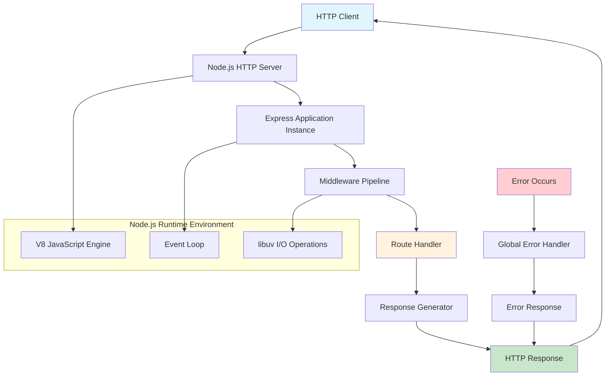
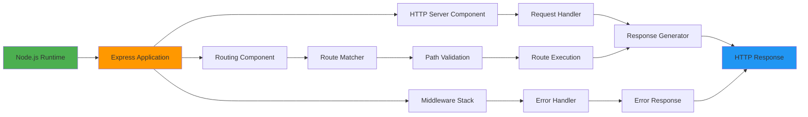
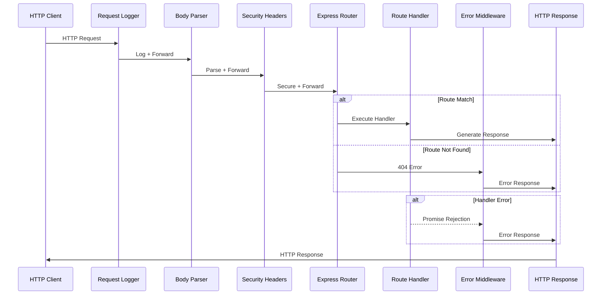
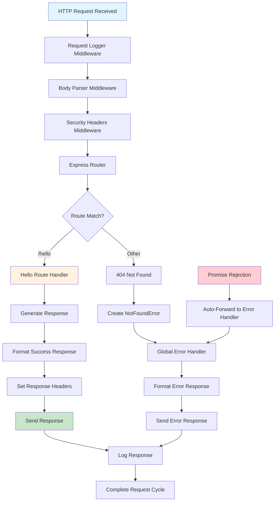
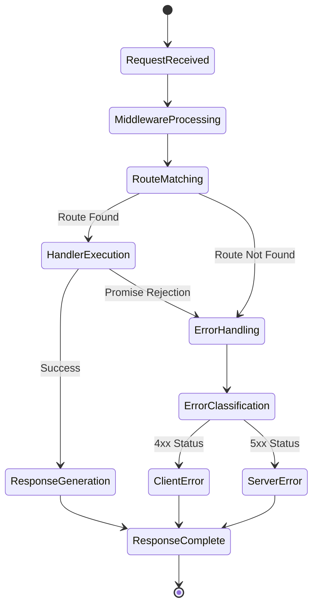
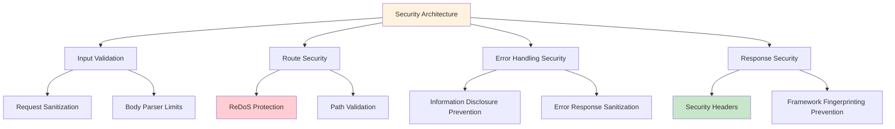
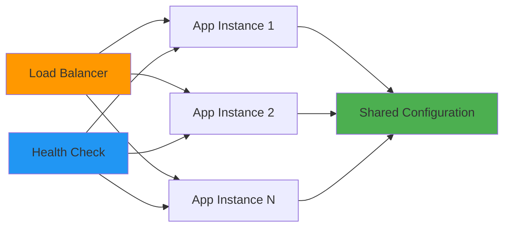
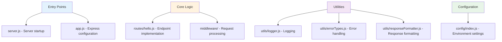

# Node.js Tutorial Application - System Architecture Documentation

## Table of Contents

1. [Introduction and System Overview](#introduction-and-system-overview)
2. [High-Level Architecture](#high-level-architecture)
3. [Component Design and Responsibilities](#component-design-and-responsibilities)
4. [Request/Response Flow and Data Processing](#requestresponse-flow-and-data-processing)
5. [Security Architecture and Considerations](#security-architecture-and-considerations)
6. [Scalability and Performance Characteristics](#scalability-and-performance-characteristics)
7. [Rationale for Architectural Decisions](#rationale-for-architectural-decisions)
8. [Educational Design Principles](#educational-design-principles)
9. [Implementation References](#implementation-references)

---

## Introduction and System Overview

### Purpose and Educational Objectives

The Node.js tutorial application serves as a comprehensive educational resource for developers learning server-side JavaScript development. This system demonstrates fundamental concepts of building HTTP servers using modern web technologies, specifically Node.js 22.x LTS and Express.js 5.1.0.

**Primary Learning Objectives:**
- Understanding Node.js runtime environment and event-driven architecture
- Express.js framework fundamentals and middleware patterns
- HTTP request/response cycle mechanics
- Error handling and logging best practices
- Security considerations in web application development

### System Scope and Boundaries

The application implements a **stateless, monolithic architecture** with the following characteristics:

- **Single Endpoint**: `/hello` route returning "Hello world" response
- **Educational Focus**: Designed for learning clarity over feature completeness
- **Modern Stack**: Node.js 22.x LTS with Express 5.1.0
- **Security-First**: Implements Express 5 security enhancements including ReDoS protection
- **Production-Ready Patterns**: Demonstrates enterprise-grade development practices

---

## High-Level Architecture

### System Architecture Overview

The Node.js tutorial application follows a **Single-Threaded Event Loop Architecture** leveraging Node.js's non-blocking I/O capabilities and Express.js's middleware pipeline pattern.

### Architectural Principles

**Event-Driven Processing**: All HTTP requests are processed through Node.js's event loop mechanism, enabling concurrent request handling without traditional multi-threading complexity.

**Non-Blocking I/O**: Asynchronous operations prevent thread blocking, maintaining responsiveness and supporting high concurrency levels.

**Minimalist Design**: Educational focus drives simplified component interactions while maintaining production-ready patterns.

**Security-First Approach**: Built-in security features including ReDoS attack prevention through path-to-regexp 8.x integration.

---

## Component Design and Responsibilities

### Core Component Architecture

The system implements a modular component architecture with clear separation of concerns:

### Component Responsibilities Matrix

| Component | Primary Responsibility | Implementation | Integration Points |
|-----------|----------------------|----------------|-------------------|
| **Node.js Runtime** | JavaScript execution environment and event loop management | V8 Engine + libuv | HTTP module, process environment |
| **Express Application** | Web framework providing routing and middleware capabilities | Express 5.1.0 with enhanced security | Middleware stack, route handlers |
| **Request Logger** | HTTP request/response logging and monitoring | Structured logging with timing | All incoming requests |
| **Route Handler** | Business logic execution for `/hello` endpoint | Static response generation | Response formatter, error handling |
| **Error Handler** | Global error handling and recovery mechanisms | Express 5 automatic promise forwarding | All middleware and routes |
| **Response Formatter** | Standardized response structure generation | JSON formatting utility | Route handlers, error middleware |

### Express Middleware Pipeline

The middleware execution follows a specific order for optimal request processing:

---

## Request/Response Flow and Data Processing

### Complete Request Processing Cycle

The system processes HTTP requests through a sequential pipeline with comprehensive error handling:

### Data Flow Description

**Request Processing Flow:**
1. **TCP Connection**: Client establishes HTTP connection with Node.js server
2. **HTTP Parsing**: Raw HTTP request parsed into Express request object
3. **Middleware Pipeline**: Request flows through sequential middleware stack
4. **Route Matching**: URL pattern matching using path-to-regexp 8.x
5. **Handler Execution**: Business logic execution with automatic promise handling
6. **Response Generation**: Standardized response formatting and transmission

**Error Handling Flow:**
Express 5.1.0 provides automatic promise rejection forwarding, eliminating the need for explicit try/catch blocks in async route handlers.

---

## Security Architecture and Considerations

### Express 5.1.0 Security Enhancements

The application leverages Express 5's comprehensive security improvements:

**ReDoS Attack Prevention**: Updated to path-to-regexp 8.x, removing sub-expression regex patterns that could cause Regular Expression Denial of Service attacks.

**Automatic Promise Rejection Handling**: Enhanced error handling prevents application crashes from unhandled promise rejections.

**Security Headers Implementation**: Comprehensive HTTP security headers prevent common web vulnerabilities.

### Security Control Matrix

| Security Domain | Implementation | Threat Mitigation | Monitoring |
|-----------------|----------------|-------------------|------------|
| **Input Validation** | Express body-parser with limits | Injection attacks, payload size attacks | Request pattern analysis |
| **Route Security** | path-to-regexp 8.x patterns | ReDoS attacks | Route access logging |
| **Error Handling** | Secure error responses without stack traces | Information disclosure | Error pattern detection |
| **Response Headers** | X-Content-Type-Options, X-Frame-Options, etc. | XSS, Clickjacking, MIME sniffing | Header compliance monitoring |

### Threat Model Implementation

The application implements a comprehensive threat model addressing:

- **ReDoS Attacks**: Mitigated through secure regex patterns
- **Information Disclosure**: Prevented through sanitized error responses
- **Framework Fingerprinting**: Disabled via `x-powered-by` header removal
- **Injection Attacks**: Prevented through input validation and sanitization

---

## Scalability and Performance Characteristics

### Node.js Event Loop Architecture

The system leverages Node.js's single-threaded event loop for efficient concurrent request handling:

**Scalability Characteristics:**
- **Memory Efficiency**: Single process handling multiple concurrent connections
- **CPU Optimization**: Event-driven architecture minimizes CPU context switching
- **I/O Performance**: Non-blocking I/O operations through libuv
- **Connection Handling**: Thousands of concurrent connections with minimal overhead

### Performance Metrics and Targets

| Performance Metric | Target Value | Monitoring Method | Threshold Alert |
|-------------------|--------------|-------------------|------------------|
| **Response Time** | < 50ms | Express middleware timing | > 100ms |
| **Memory Usage** | < 50MB | process.memoryUsage() | > 75MB |
| **CPU Usage** | < 10% | process.cpuUsage() | > 25% |
| **Error Rate** | < 0.1% | Error middleware tracking | > 1% |

### Horizontal Scaling Preparation

While the tutorial application runs as a single instance, the architecture supports scaling through:

---

## Rationale for Architectural Decisions

### Monolithic Architecture Choice

**Decision**: Single monolithic application with stateless design

**Rationale:**
- **Educational Clarity**: Simplified architecture for learning fundamental concepts
- **Development Efficiency**: Rapid development and deployment cycles
- **Operational Simplicity**: Single deployment unit with minimal infrastructure
- **Performance Optimization**: No distributed system overhead

**Benefits:**
- Clear learning path for beginners
- Simplified deployment and testing
- Optimal performance for tutorial scope
- Foundation for future enhancement

### Express 5.1.0 Framework Selection

**Decision**: Express 5.1.0 as the web framework

**Rationale:**
- **Modern Features**: Latest security enhancements and automatic promise handling
- **Industry Standard**: De facto standard server framework for Node.js
- **Educational Value**: Demonstrates current best practices
- **Security Focus**: Comprehensive threat model and ReDoS protection

### Absence of Database Layer

**Decision**: No persistent data storage

**Rationale:**
- **Educational Focus**: Maintains attention on core Node.js and Express concepts
- **Simplicity**: Eliminates database setup and configuration complexity
- **Performance**: Immediate response generation without I/O overhead
- **Portability**: Consistent behavior across different environments

---

## Educational Design Principles

### Learning-Focused Architecture

The application architecture prioritizes educational clarity through:

**Progressive Complexity**: Building from basic HTTP server concepts to production-ready patterns

**Clear Separation of Concerns**: Each component has a single, well-defined responsibility

**Modern Patterns**: Demonstrates current industry best practices and patterns

**Comprehensive Documentation**: Extensive code comments and architectural explanations

### Code Organization for Learning

### Educational Benefits

- **Hands-on Learning**: Working code examples with immediate execution
- **Best Practices**: Production-ready patterns suitable for real-world development
- **Security Awareness**: Integration of security best practices from the beginning
- **Scalability Understanding**: Foundation concepts for building larger applications

---

## Implementation References

### Code Module Mapping

| Architectural Component | Implementation File | Key Features |
|------------------------|-------------------|--------------|
| **Server Initialization** | `src/backend/server.js` | Process management, graceful shutdown, error handling |
| **Express Application** | `src/backend/app.js` | Middleware pipeline, security configuration |
| **Route Handling** | `src/backend/routes/hello.js` | Endpoint implementation, response generation |
| **Error Management** | `src/backend/middleware/errorHandler.js` | Global error handling, Express 5 integration |
| **Request Logging** | `src/backend/middleware/logger.js` | Structured logging, performance monitoring |
| **Configuration** | `src/backend/config/index.js` | Environment-based configuration |
| **Error Types** | `src/backend/utils/errorTypes.js` | Structured error handling |
| **Response Formatting** | `src/backend/utils/responseFormatter.js` | Standardized API responses |

### Integration with Express 5 Features

**Automatic Promise Rejection Handling**: Route handlers can use async/await without explicit error catching

**Enhanced Security**: ReDoS protection through path-to-regexp 8.x integration

**Improved Error Pipeline**: Automatic forwarding of rejected promises to error handling middleware

**Modern Middleware Architecture**: Support for both callback and promise-based middleware patterns

### Monitoring and Observability

The architecture includes comprehensive observability features:

- **Structured Logging**: JSON-formatted logs for monitoring systems
- **Request Tracing**: Unique request IDs for distributed tracing
- **Performance Metrics**: Response time and resource usage tracking
- **Error Tracking**: Comprehensive error logging and classification

---

## Conclusion

The Node.js tutorial application architecture successfully balances educational clarity with production-ready patterns. By leveraging Express 5.1.0's modern features and implementing comprehensive security measures, the application serves as an excellent foundation for learning server-side JavaScript development.

The monolithic, stateless design provides optimal performance for the tutorial scope while maintaining the flexibility for future enhancement and scaling. The comprehensive error handling, logging, and security implementations demonstrate enterprise-grade development practices suitable for professional environments.

This architecture documentation serves as both a learning resource and a reference implementation, providing developers with practical examples of modern Node.js application development patterns and best practices.